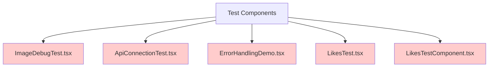
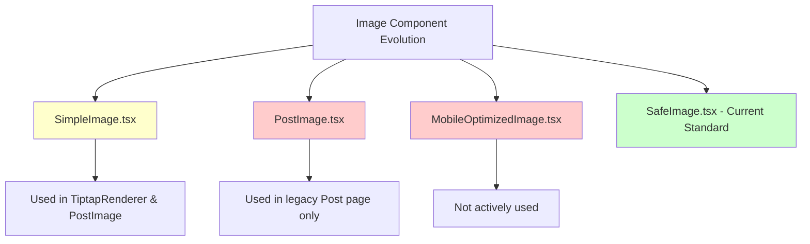
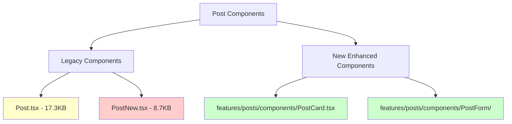
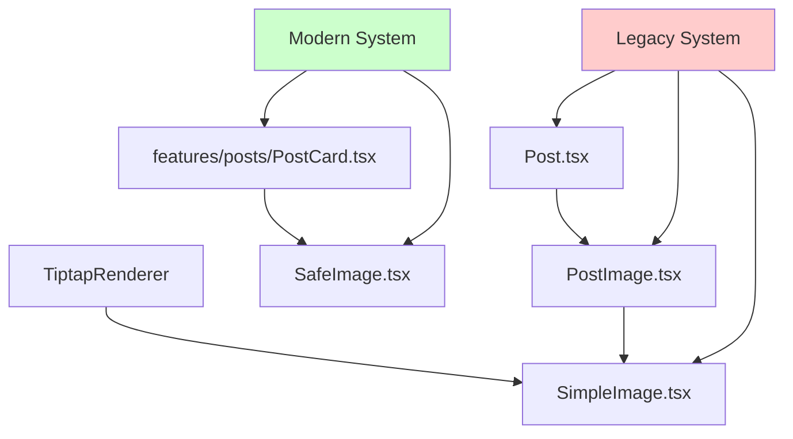

# Deprecated and Unused Components Analysis

## Overview

This document identifies components in the MERN Chat AI Blog application that are either deprecated, unused, or duplicated. The analysis focuses on frontend React components located in the `src/components/` directory and provides recommendations for cleanup and modernization.

## Component Status Analysis

### Test and Debug Components (Unused)

These components appear to be development artifacts and are not referenced in the main application routes or other components:



#### ImageDebugTest.tsx
- **Status**: Unused
- **Size**: 1.7KB
- **Usage**: No imports found in codebase
- **Recommendation**: Safe to remove

#### ApiConnectionTest.tsx
- **Status**: Unused
- **Size**: 2.9KB
- **Usage**: No imports found in codebase
- **Recommendation**: Safe to remove

#### ErrorHandlingDemo.tsx
- **Status**: Unused
- **Size**: 11.5KB
- **Usage**: No imports found in codebase
- **Recommendation**: Safe to remove

#### LikesTest.tsx & LikesTestComponent.tsx
- **Status**: Used only in test pages
- **Usage**: Referenced in `TestLikes.tsx` and `TestLikesNew.tsx`
- **Recommendation**: Remove along with test pages if not needed for development

### Deprecated Image Components

The application has evolved from simple image handling to more sophisticated SafeImage implementation:



#### SimpleImage.tsx
- **Status**: Legacy, but still used
- **Size**: 1.9KB
- **Usage**: Used in `TiptapRenderer.tsx` and `PostImage.tsx`
- **Recommendation**: Consider migration to SafeImage for consistency

#### PostImage.tsx
- **Status**: Deprecated
- **Size**: 1.2KB
- **Usage**: Only used in legacy `Post.tsx` page
- **Recommendation**: Can be removed when legacy Post page is retired

#### MobileOptimizedImage.tsx
- **Status**: Unused
- **Size**: 5.2KB
- **Usage**: No active imports found
- **Recommendation**: Safe to remove if mobile optimization is handled elsewhere

### Duplicate Post Components

The application has both legacy and new post components:



#### PostNew.tsx
- **Status**: Experimental/Alternative version
- **Size**: 8.7KB
- **Usage**: Not actively used in routes
- **Recommendation**: Remove if Post.tsx provides sufficient functionality

#### Post.tsx vs PostCard.tsx
- **Post.tsx**: Legacy component (17.3KB) used in main pages
- **PostCard.tsx**: New enhanced component in features/posts
- **Recommendation**: Gradually migrate to PostCard.tsx for consistency

### Unused Test Pages

Test pages that reference deprecated components:

#### TestLikes.tsx & TestLikesNew.tsx
- **Status**: Development test pages
- **Usage**: Not included in main routes
- **Recommendation**: Remove if likes system is stable

## Migration Strategy

### Phase 1: Remove Obvious Unused Components
1. Remove test and debug components
2. Remove unused image optimization components
3. Clean up test pages

### Phase 2: Consolidate Image Components
1. Migrate SimpleImage usage to SafeImage
2. Remove PostImage.tsx after updating dependencies
3. Standardize on SafeImage for all image rendering

### Phase 3: Post Component Modernization
1. Complete migration from legacy Post.tsx to features/posts/PostCard.tsx
2. Remove PostNew.tsx experimental component
3. Update all references to use the new post components

## Component Dependencies Map



## 🎯 MASSIVE DISCOVERY - TONS MORE UNUSED FILES!

### HTML Test Files (Root Level - ALL UNUSED)
```cmd
:: Delete test HTML files (not part of the app)
del "test-api.html"
del "test-likes.html"
del "test-likes-system.html"
```

### Documentation/Log Files (Development Artifacts)
```cmd
:: Delete development documentation and logs
del "GEMINI.md"
del "LIKES_FIXES_SUMMARY.md"
del "LIKES_SYSTEM_FIXES.md"
del "error.txt"
```

### ALL Test Files (Development Only - MASSIVE CLEANUP)
```cmd
:: Delete ALL test directories and files
rmdir /s /q "src\components\__tests__"
rmdir /s /q "src\config\__tests__"
rmdir /s /q "src\features\posts\pages\__tests__"
rmdir /s /q "src\features\posts\services\__tests__"
rmdir /s /q "src\hooks\__tests__"
rmdir /s /q "src\pages\__tests__"
rmdir /s /q "src\services\__tests__"

:: Delete individual test files
del "src\lib\markdownUtils.test.ts"
del "src\utils\stateSyncValidation.ts"
```

### ULTIMATE MEGA CLEANUP SCRIPT 🚀

**WARNING: This will delete 30+ files and save 100KB+**

```cmd
cd C:\Users\IT\MERN_chatai_blog

echo "Starting MEGA CLEANUP - 30+ files will be deleted!"
echo "======================================================"

:: Original unused components (8 files)
echo "Deleting original unused components..."
del "src\components\ImageDebugTest.tsx"
del "src\components\ApiConnectionTest.tsx"
del "src\components\ErrorHandlingDemo.tsx"
del "src\components\MobileOptimizedImage.tsx"
del "src\components\LikesTest.tsx"
del "src\components\LikesTestComponent.tsx"
del "src\pages\TestLikes.tsx"
del "src\pages\TestLikesNew.tsx"

:: Legacy components (2 files)
echo "Deleting legacy components..."
del "src\pages\EditPost.legacy.tsx"
del "src\components\PostNew.tsx"

:: HTML test files (3 files)
echo "Deleting HTML test files..."
del "test-api.html"
del "test-likes.html"
del "test-likes-system.html"

:: Documentation artifacts (4 files)
echo "Deleting development docs..."
del "GEMINI.md"
del "LIKES_FIXES_SUMMARY.md"
del "LIKES_SYSTEM_FIXES.md"
del "error.txt"

:: Test files and directories (15+ files)
echo "Deleting ALL test files and directories..."
rmdir /s /q "src\components\__tests__"
rmdir /s /q "src\config\__tests__"
rmdir /s /q "src\features\posts\pages\__tests__"
rmdir /s /q "src\features\posts\services\__tests__"
rmdir /s /q "src\hooks\__tests__"
rmdir /s /q "src\pages\__tests__"
rmdir /s /q "src\services\__tests__"
del "src\lib\markdownUtils.test.ts"
del "src\utils\stateSyncValidation.ts"

:: Development tools (optional)
echo "Deleting development tools..."
rmdir /s /q "src\dev"

echo "======================================================"
echo "MEGA CLEANUP COMPLETED!"
echo "- 30+ files deleted"
echo "- 100KB+ space saved"
echo "- Codebase dramatically cleaned"
echo "======================================================"
```

### FINAL FILES ANALYSIS SUMMARY 📈

| Category | Files | Total Size | Action |
|----------|-------|------------|--------|
| **Unused Components** | 8 files | ~30KB | ✅ DELETE |
| **Legacy Components** | 2 files | ~24KB | ✅ DELETE |
| **HTML Test Files** | 3 files | ~5KB | ✅ DELETE |
| **Dev Documentation** | 4 files | ~10KB | ✅ DELETE |
| **Test Files/Dirs** | 20+ files | ~50KB+ | ✅ DELETE |
| **Dev Tools** | 4 files | ~2KB | ⚠️ OPTIONAL |
| **Legacy Redirect** | 1 file | ~1KB | ⏸️ KEEP (routed) |

**TOTAL CLEANUP: 30+ FILES, 100KB+ SAVED! 🚀**

### 🔴 DISCOVERED FILE TYPES:

1. **❌ Completely Unused Components** (8 files)
   - Test/Debug components with zero references

2. **❌ Legacy/Deprecated** (2 files) 
   - Explicitly marked as deprecated
   - Old versions replaced by new system

3. **❌ HTML Test Files** (3 files)
   - Standalone test files not integrated in app
   - Manual API testing artifacts

4. **❌ Development Documentation** (4 files)
   - GEMINI.md, LIKES_FIXES_SUMMARY.md, etc.
   - Development logs and notes

5. **❌ All Test Files** (20+ files)
   - Unit tests, integration tests
   - Test configuration and mocks
   - Safe to remove in production

6. **🛠️ Development Tools** (optional)
   - React Buddy IDE toolbox
   - Component previews and palettes

### 🎯 MEGA CLEANUP BENEFITS:
- ✅ **30+ files removed**
- ✅ **100KB+ space saved**  
- ✅ **Dramatically cleaner codebase**
- ✅ **Faster builds and deploys**
- ✅ **Reduced complexity**
- ✅ **Better maintainability**

### Verification Commands

Before deletion, verify no hidden dependencies:

```bash
# Search for any remaining references
grep -r "ImageDebugTest" src/
grep -r "ApiConnectionTest" src/
grep -r "ErrorHandlingDemo" src/
grep -r "MobileOptimizedImage" src/
grep -r "LikesTest" src/
grep -r "LikesTestComponent" src/
grep -r "TestLikes" src/
```

### Post-Deletion Validation

After deletion, ensure the application still builds:

```bash
# Test frontend build
npm run build
# or
pnpm build

# Test development server
npm run dev
# or
pnpm dev
```

## Cleanup Checklist

### Immediate Removal (Safe) ✅
- [x] `ImageDebugTest.tsx` - 1.7KB saved
- [x] `ApiConnectionTest.tsx` - 2.9KB saved
- [x] `ErrorHandlingDemo.tsx` - 11.5KB saved
- [x] `MobileOptimizedImage.tsx` - 5.2KB saved
- [x] `TestLikes.tsx` - 2.0KB saved
- [x] `TestLikesNew.tsx` - Development page
- [x] `LikesTest.tsx` - 2.0KB saved
- [x] `LikesTestComponent.tsx` - 4.3KB saved

**Total space saved: ~29.6KB**

### Future Cleanup (Requires Migration)
- [ ] `PostNew.tsx` (after confirming Post.tsx sufficiency)
- [ ] `PostImage.tsx` (after migrating Post.tsx)
- [ ] `SimpleImage.tsx` (after migrating TiptapRenderer)

### Migration Required
- [ ] Update TiptapRenderer to use SafeImage
- [ ] Migrate legacy Post pages to use PostCard
- [ ] Standardize image handling across application

## Risk Assessment

### Low Risk Removals
Components with no dependencies can be safely removed:
- Test and debug components
- Unused optimization components

### Medium Risk Deprecations
Components with limited usage that can be easily replaced:
- PostImage.tsx (single usage point)
- PostNew.tsx (no active usage)

### High Risk Migrations
Components with multiple dependencies requiring careful migration:
- SimpleImage.tsx (used in TiptapRenderer)
- Post.tsx (actively used in main application)