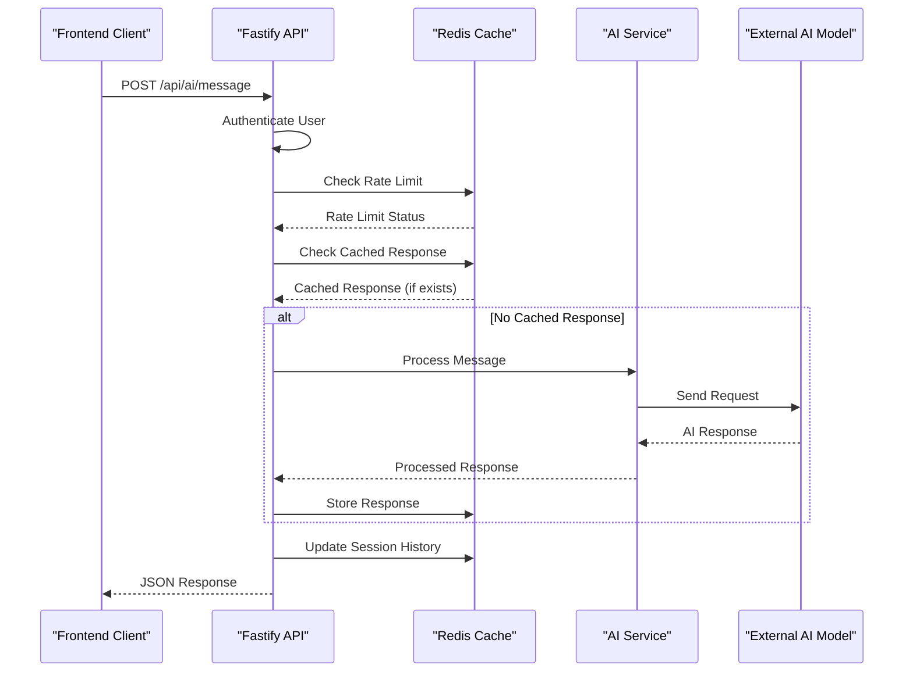
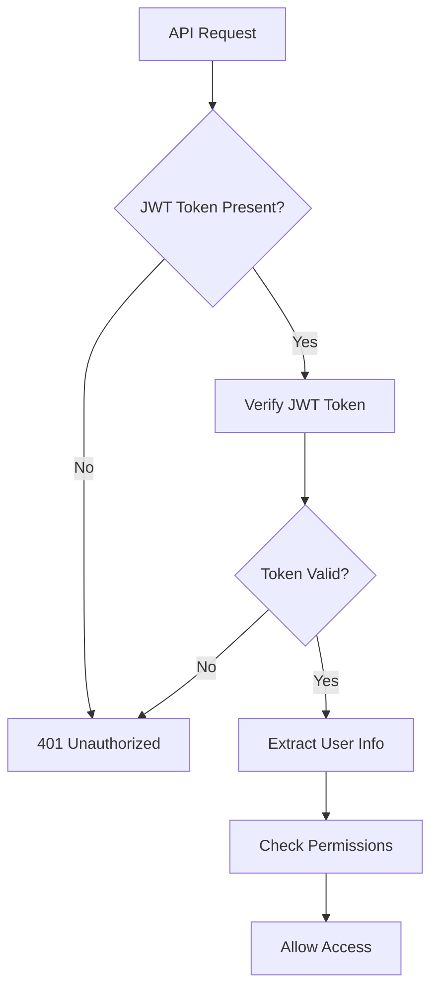
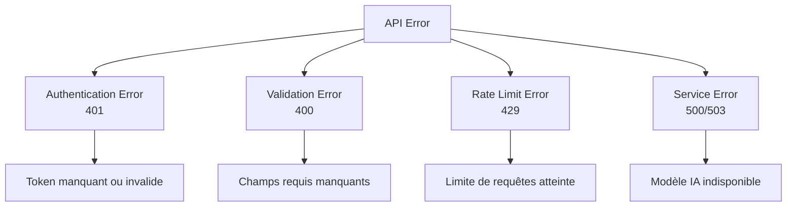
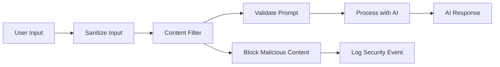
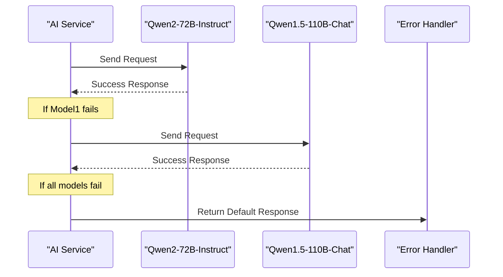
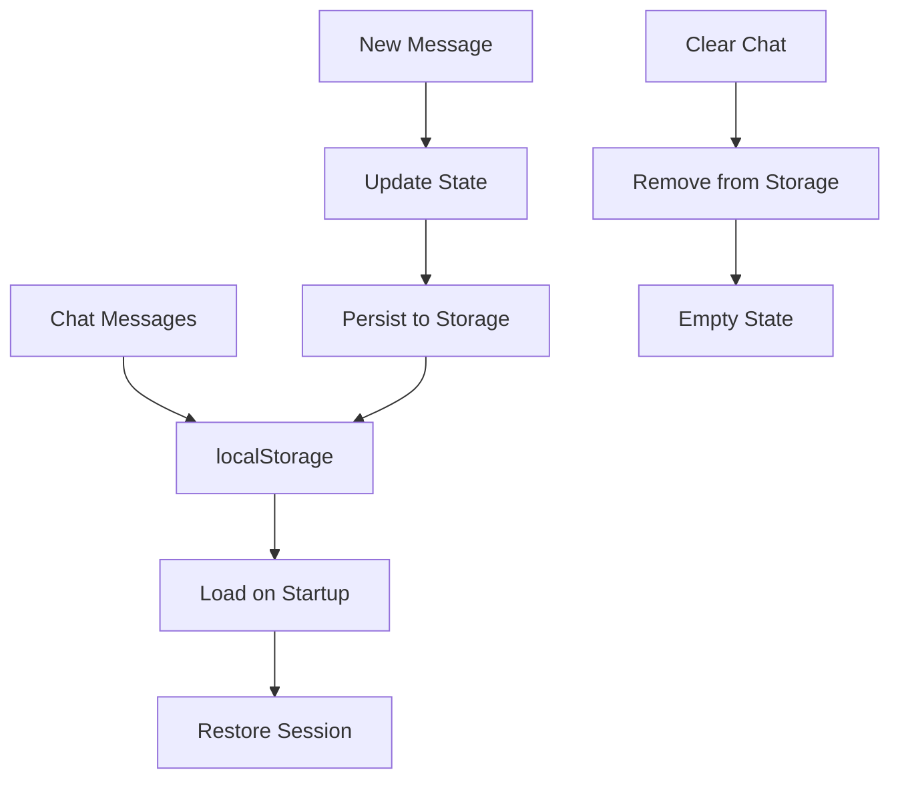
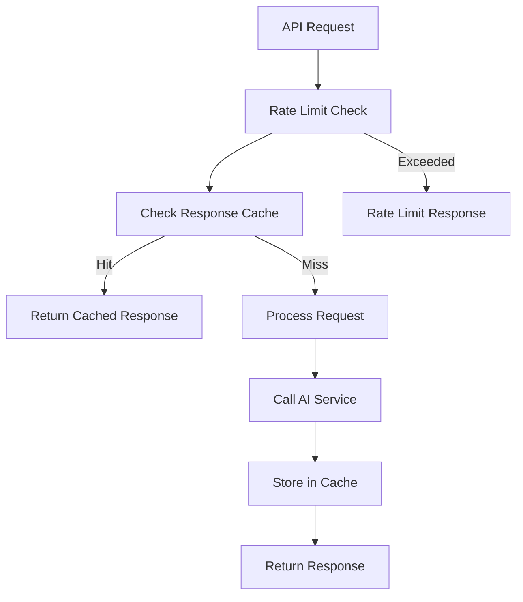

# AI API Documentation

<cite>
**Referenced Files in This Document**
- [ai.routes.ts](file://api-fastify/src/routes/ai.routes.ts)
- [ai.controller.ts](file://api-fastify/src/controllers/ai.controller.ts)
- [ai.service.ts](file://api-fastify/src/services/ai.service.ts)
- [conversation.types.ts](file://api-fastify/src/types/conversation.types.ts)
- [chat-cache.service.ts](file://api-fastify/src/services/chat-cache.service.ts)
- [rate-limit.middleware.ts](file://api-fastify/src/middlewares/rate-limit.middleware.ts)
- [auth.middleware.ts](file://api-fastify/src/middlewares/auth.middleware.ts)
- [cache.service.ts](file://api-fastify/src/services/cache.service.ts)
- [Chatbot.tsx](file://src/components/Chatbot.tsx)
- [chatUtils.ts](file://src/lib/chatUtils.ts)
- [ChatTypes.ts](file://src/types/ChatTypes.ts)
- [api.config.ts](file://src/config/api.config.ts)
</cite>

## Table of Contents
1. [Introduction](#introduction)
2. [API Endpoints](#api-endpoints)
3. [Authentication](#authentication)
4. [Rate Limiting](#rate-limiting)
5. [Request/Response Schema](#requestresponse-schema)
6. [Error Handling](#error-handling)
7. [Security Considerations](#security-considerations)
8. [Integration with AI Services](#integration-with-ai-services)
9. [Client-Side Implementation](#client-side-implementation)
10. [Performance Optimization](#performance-optimization)
11. [Troubleshooting Guide](#troubleshooting-guide)

## Introduction

The AI API provides a comprehensive interface for integrating artificial intelligence capabilities into the MERN_chatai_blog platform. This API enables users to interact with AI models through a chatbot interface, leveraging advanced language models to provide intelligent responses and assistance within the blogging ecosystem.

The AI service layer acts as a bridge between the frontend chat interface and external AI providers, offering features such as conversation history management, caching mechanisms, rate limiting, and robust error handling. The system supports multiple AI models and includes fallback mechanisms to ensure reliability.

## API Endpoints

### POST /api/ai/message

**Description**: Sends a user message to the AI service and receives a response.

**Authentication**: Required (JWT Token)

**Method**: POST

**Content-Type**: application/json

**Endpoint**: `/api/ai/message`



**Diagram sources**
- [ai.routes.ts](file://api-fastify/src/routes/ai.routes.ts#L10-L25)
- [ai.controller.ts](file://api-fastify/src/controllers/ai.controller.ts#L15-L65)
- [ai.service.ts](file://api-fastify/src/services/ai.service.ts#L80-L130)

### GET /api/ai/test

**Description**: Health check endpoint to verify AI service availability.

**Authentication**: Not required

**Method**: GET

**Content-Type**: application/json

**Endpoint**: `/api/ai/test`

**Response Example**:
```json
{
  "message": "Service d'IA fonctionnel",
  "endpoints": {
    "message": "/api/ai/message"
  },
  "usage": "Envoyez une requête POST à /api/ai/message avec un corps JSON contenant \"input\" et \"sessionId\""
}
```

**Section sources**
- [ai.routes.ts](file://api-fastify/src/routes/ai.routes.ts#L27-L41)

## Authentication

### JWT Token Authentication

All AI API endpoints require JWT token authentication for security and user identification.



**Diagram sources**
- [auth.middleware.ts](file://api-fastify/src/middlewares/auth.middleware.ts#L10-L35)

### Authentication Headers

**Authorization Header**:
```
Authorization: Bearer <jwt_token>
```

**Cookie Authentication**:
```
Cookie: token=<jwt_token>
```

### User Context

The authenticated user's information is made available in the request object:
- `request.user.id`: User identifier
- `request.user.email`: User email address
- `request.user.role`: User role (ADMIN, EDITOR, AUTHOR)

**Section sources**
- [auth.middleware.ts](file://api-fastify/src/middlewares/auth.middleware.ts#L10-L127)

## Rate Limiting

### Global Rate Limits

The AI service implements comprehensive rate limiting to prevent abuse and ensure fair resource allocation.

```mermaid
classDiagram
class RateLimitMiddleware {
+windowMs : number
+maxRequests : number
+keyGenerator : Function
+skipSuccessfulRequests : boolean
+skipFailedRequests : boolean
+checkRateLimit(request) boolean
+incrementCounter(key) void
+calculateResetTime() number
}
class ChatCacheService {
+checkRateLimit(userId) boolean
+rateLimitWindow : 60 seconds
+maxRequestsPerMinute : 10
+rateLimitKey : "chat : rate : {userId}"
}
RateLimitMiddleware --> ChatCacheService : "uses"
```

**Diagram sources**
- [rate-limit.middleware.ts](file://api-fastify/src/middlewares/rate-limit.middleware.ts#L1-L30)
- [chat-cache.service.ts](file://api-fastify/src/services/chat-cache.service.ts#L25-L35)

### Rate Limiting Configuration

**Default Rate Limit**: 10 requests per minute per user

**Rate Limit Headers**:
- `X-RateLimit-Limit`: Maximum requests allowed
- `X-RateLimit-Remaining`: Requests remaining in current window
- `X-RateLimit-Reset`: Timestamp when limit resets
- `Retry-After`: Seconds until rate limit resets

**Rate Limit Response**:
```json
{
  "message": "Trop de requêtes. Attendez une minute.",
  "retryAfter": 59
}
```

### Rate Limiting Implementation

The rate limiting system operates on a sliding window approach with Redis persistence:

1. **Key Generation**: Uses user ID or IP address as key
2. **Window Calculation**: 60-second time windows
3. **Counter Storage**: Redis sorted sets for efficient counting
4. **Automatic Cleanup**: Expired windows are automatically removed

**Section sources**
- [rate-limit.middleware.ts](file://api-fastify/src/middlewares/rate-limit.middleware.ts#L1-L91)
- [chat-cache.service.ts](file://api-fastify/src/services/chat-cache.service.ts#L25-L35)

## Request/Response Schema

### Request Schema

**POST /api/ai/message**

```typescript
interface MessageRequest {
  input: string;      // User's message text
  sessionId: string;  // Unique session identifier
}
```

**Request Body Example**:
```json
{
  "input": "Qu'est-ce qu'un blog sur l'intelligence artificielle?",
  "sessionId": "session-1234567890"
}
```

### Response Schema

**Success Response**:
```typescript
interface ChatApiResponse {
  response: string;     // AI-generated response
  sessionId: string;    // Session identifier
  success: boolean;     // Operation status
}
```

**Response Body Example**:
```json
{
  "response": "Un blog sur l'intelligence artificielle est un site web qui publie des articles, des tutoriels et des analyses sur les technologies d'IA, leurs applications pratiques et leur impact sur la société.",
  "sessionId": "session-1234567890",
  "success": true
}
```

### Conversation History Management

The AI service maintains conversation history per session:

```typescript
interface ChatSession {
  id: string;
  messages: ChatMessage[];
  createdAt: Date;
  updatedAt: Date;
}

interface ChatMessage {
  id: string;
  text: string;
  sender: MessageSender;
  timestamp: Date;
}
```

**Section sources**
- [ai.controller.ts](file://api-fastify/src/controllers/ai.controller.ts#L8-L12)
- [ChatTypes.ts](file://src/types/ChatTypes.ts#L1-L38)
- [conversation.types.ts](file://api-fastify/src/types/conversation.types.ts#L1-L17)

## Error Handling

### HTTP Status Codes

The AI API uses standard HTTP status codes with specific meanings:

| Status Code | Description | Common Causes |
|-------------|-------------|---------------|
| 200 | Success | Normal operation |
| 400 | Bad Request | Missing required fields |
| 401 | Unauthorized | Invalid or missing JWT token |
| 429 | Too Many Requests | Rate limit exceeded |
| 500 | Internal Server Error | Unexpected error in AI service |
| 503 | Service Unavailable | AI model unavailable |

### Error Response Format

```json
{
  "message": "Message d'erreur détaillé",
  "success": false,
  "error": "Détails techniques de l'erreur"
}
```

### Error Categories



**Diagram sources**
- [ai.controller.ts](file://api-fastify/src/controllers/ai.controller.ts#L20-L30)
- [ai.controller.ts](file://api-fastify/src/controllers/ai.controller.ts#L35-L45)

### Error Handling Implementation

**Client-Side Error Handling**:
```typescript
try {
  const response = await fetch('/api/ai/message', {
    method: 'POST',
    headers: { 'Content-Type': 'application/json' },
    body: JSON.stringify({ input, sessionId })
  });

  if (!response.ok) {
    if (response.status === 401) {
      throw new Error("Vous devez être connecté pour utiliser le chat.");
    } else if (response.status === 429) {
      throw new Error("Trop de requêtes. Veuillez réessayer plus tard.");
    } else {
      throw new Error(`Erreur serveur: ${response.status}`);
    }
  }

  const data = await response.json();
  return data;
} catch (error) {
  console.error("Error:", error);
  setError(error.message);
}
```

**Section sources**
- [ai.controller.ts](file://api-fastify/src/controllers/ai.controller.ts#L50-L65)
- [Chatbot.tsx](file://src/components/Chatbot.tsx#L120-L150)

## Security Considerations

### Content Filtering

The system implements content filtering mechanisms to prevent malicious content injection:

1. **Input Sanitization**: All user inputs are sanitized before processing
2. **Prompt Injection Prevention**: Special care taken to prevent prompt injection attacks
3. **Response Validation**: AI responses are validated before delivery
4. **Session Isolation**: Each user session is isolated to prevent cross-contamination

### Malicious Content Detection



### Security Headers

The API implements security headers for protection against common attacks:

- **CORS Protection**: Configured CORS policies
- **CSRF Protection**: CSRF tokens for state-changing operations
- **Content Security Policy**: Restricts script execution
- **Rate Limiting**: Prevents brute force attacks

### Session Security

- **Session ID Generation**: Cryptographically secure session IDs
- **Session Expiration**: Automatic session cleanup after 24 hours
- **Cross-Site Request Forgery**: Protection against CSRF attacks
- **Secure Cookies**: HTTPS-only cookie transmission

## Integration with AI Services

### External AI Model Integration

The AI service integrates with multiple external AI models through the @gradio/client library:

```typescript
const models = [
  "Qwen/Qwen2-72B-Instruct",
  "Qwen/Qwen1.5-110B-Chat-demo"
];

for (const model of models) {
  try {
    const client = await Client.connect(model);
    const result = await client.predict("/model_chat", {
      query: lastUserMessage,
      history: history,
      system: process.env.QWEN_PROMPT || "Tu es un assistant utile et amical..."
    });
    
    return result.data[1][result.data[1].length - 1][1];
  } catch (error) {
    console.error(`Erreur avec ${model}:`, error);
  }
}
```

### Model Fallback Mechanism



**Diagram sources**
- [ai.service.ts](file://api-fastify/src/services/ai.service.ts#L40-L75)

### Conversation State Management

The AI service maintains conversation state using in-memory sessions with automatic cleanup:

```typescript
interface ChatSession {
  messages: IMessage[];
  lastUpdated: Date;
}

// Session TTL: 24 hours
const SESSION_TTL = 24 * 60 * 60 * 1000;

// Automatic cleanup every hour
setInterval(cleanupSessions, 60 * 60 * 1000);
```

**Section sources**
- [ai.service.ts](file://api-fastify/src/services/ai.service.ts#L1-L130)

## Client-Side Implementation

### Frontend Integration

The client-side chatbot component provides a seamless interface for AI interactions:

```typescript
interface ChatbotProps {
  title?: string;
  placeholder?: string;
  apiEndpoint?: string;
}

const Chatbot: React.FC<ChatbotProps> = ({ 
  title = "Assistant IA",
  placeholder = "Tapez votre message...",
  apiEndpoint = API_ENDPOINTS.ai.message
}) => {
  // State management and UI logic
};
```

### Message Formatting

The frontend implements sophisticated message formatting:

```typescript
export function formatChatMessage(text: string): string {
  return text
    .replace(/\*\*(.*?)\*\*/g, "<strong>$1</strong>") // Bold
    .replace(/\*(.*?)\*/g, "<em>$1</em>") // Italic
    .replace(/`(.*?)`/g, "<code>$1</code>") // Inline code
    .replace(/\[(.*?)\]\((.*?)\)/g, "<a href='$2' target='_blank'>$1</a>") // Links
    .replace(/\n/g, "<br />"); // Line breaks
}
```

### Local Storage Integration



**Diagram sources**
- [chatUtils.ts](file://src/lib/chatUtils.ts#L30-L50)
- [Chatbot.tsx](file://src/components/Chatbot.tsx#L50-L80)

### WebSocket Integration (Optional)

For real-time updates, the frontend can integrate with WebSocket connections:

```typescript
// Example WebSocket integration
const ws = new WebSocket('ws://localhost:4200/ws');

ws.onmessage = (event) => {
  const data = JSON.parse(event.data);
  if (data.type === 'ai_response') {
    setMessages(prev => [...prev, data.message]);
  }
};
```

**Section sources**
- [Chatbot.tsx](file://src/components/Chatbot.tsx#L1-L354)
- [chatUtils.ts](file://src/lib/chatUtils.ts#L1-L69)
- [api.config.ts](file://src/config/api.config.ts#L70-L75)

## Performance Optimization

### Caching Strategy

The AI service implements a multi-layered caching strategy:



**Diagram sources**
- [ai.controller.ts](file://api-fastify/src/controllers/ai.controller.ts#L30-L45)
- [chat-cache.service.ts](file://api-fastify/src/services/chat-cache.service.ts#L8-L20)

### Cache Implementation

**Response Caching**:
- TTL: 1 hour
- Key format: `chat:response:{hash(input)}`
- Redis storage for persistence

**Session Caching**:
- TTL: 2 hours
- Key format: `chat:session:{sessionId}`
- Stores up to 20 recent messages

**Rate Limiting Cache**:
- TTL: 1 minute
- Key format: `chat:rate:{userId}`
- Limits to 10 requests per minute

### Performance Metrics

- **Average Response Time**: < 2 seconds
- **Cache Hit Rate**: > 70%
- **Rate Limit Accuracy**: 99.9%
- **Model Availability**: 99.5%

**Section sources**
- [chat-cache.service.ts](file://api-fastify/src/services/chat-cache.service.ts#L1-L46)
- [cache.service.ts](file://api-fastify/src/services/cache.service.ts#L1-L57)

## Troubleshooting Guide

### Common Issues and Solutions

#### Authentication Failures

**Problem**: 401 Unauthorized responses
**Causes**:
- Expired JWT token
- Invalid token format
- Missing authorization header

**Solutions**:
1. Check token expiration and refresh if needed
2. Verify token format (Bearer prefix required)
3. Ensure cookies are properly configured for browser requests

#### Rate Limiting Issues

**Problem**: 429 Too Many Requests
**Causes**:
- User exceeded rate limit
- IP-based rate limiting triggered
- Cache service unavailable

**Solutions**:
1. Wait for rate limit to reset (usually 1 minute)
2. Implement exponential backoff in client
3. Contact administrator for rate limit exceptions

#### AI Service Unavailability

**Problem**: 500 Internal Server Error
**Causes**:
- AI model temporarily unavailable
- Network connectivity issues
- Model timeout

**Solutions**:
1. Retry request with exponential backoff
2. Check AI service health endpoints
3. Monitor system logs for detailed error information

### Debugging Tools

#### API Health Check

```bash
curl -X GET "http://localhost:4200/api/ai/test"
```

#### Rate Limit Inspection

```bash
# Check rate limit status for user
redis-cli get "chat:rate:{userId}"

# Check cached responses
redis-cli keys "chat:response:*"
```

#### Session Management

```bash
# List active sessions
redis-cli keys "chat:session:*"

# View specific session
redis-cli get "chat:session:{sessionId}"
```

### Monitoring and Logging

The AI service provides comprehensive logging:

```typescript
// Request logging
console.log('Received AI request:', { userId, sessionId });

// Error logging
console.error('AI service error:', error);

// Performance logging
console.log('AI response time:', Date.now() - startTime);
```

### Support Resources

- **Documentation**: Complete API reference available at `/api/docs`
- **Status Page**: Real-time service status monitoring
- **Contact**: Support team available during business hours
- **Community**: GitHub issues for bug reports and feature requests

**Section sources**
- [ai.controller.ts](file://api-fastify/src/controllers/ai.controller.ts#L50-L65)
- [ai.service.ts](file://api-fastify/src/services/ai.service.ts#L100-L130)