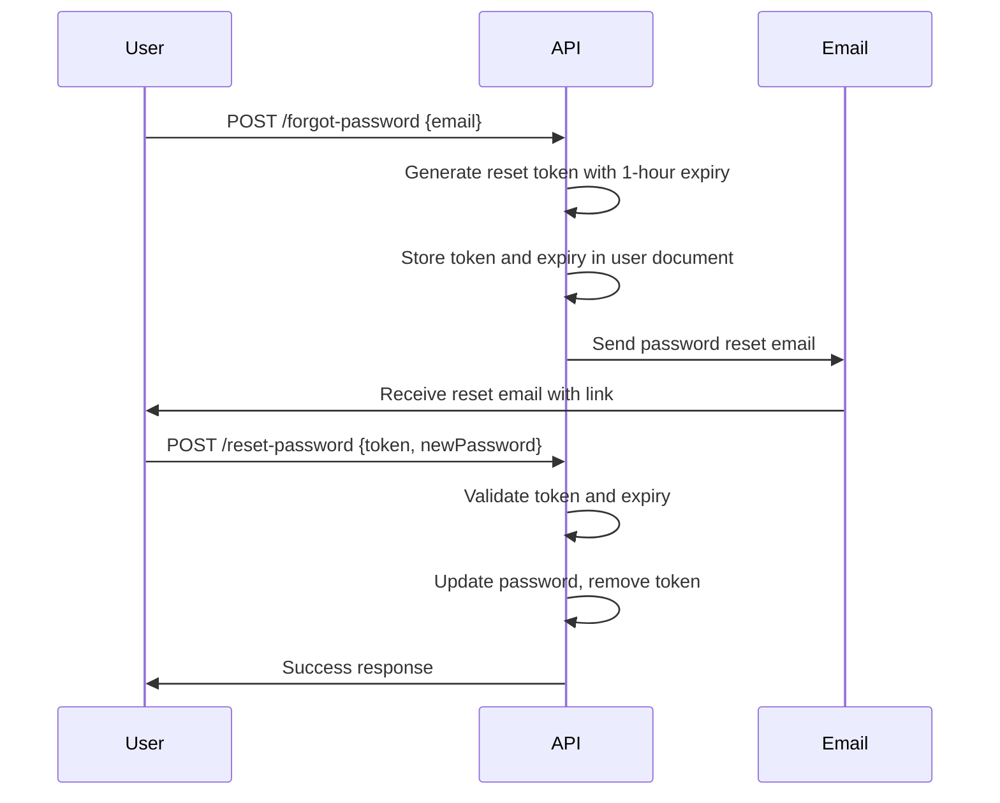

# Authentication API

<cite>
**Referenced Files in This Document**   
- [auth.routes.ts](file://api-fastify/src/routes/auth.routes.ts)
- [auth.controller.ts](file://api-fastify/src/controllers/auth.controller.ts)
- [auth.schema.ts](file://api-fastify/src/schemas/auth.schema.ts)
- [auth.service.ts](file://api-fastify/src/services/auth.service.ts)
- [auth.types.ts](file://api-fastify/src/types/auth.types.ts)
- [auth.middleware.ts](file://api-fastify/src/middlewares/auth.middleware.ts)
- [user.model.ts](file://api-fastify/src/models/user.model.ts)
- [email.service.ts](file://api-fastify/src/services/email.service.ts)
- [Login.tsx](file://src/pages/Login.tsx)
- [Register.tsx](file://src/pages/Register.tsx)
- [ForgotPassword.tsx](file://src/pages/ForgotPassword.tsx)
- [ResetPassword.tsx](file://src/pages/ResetPassword.tsx)
</cite>

## Table of Contents
1. [Introduction](#introduction)
2. [Authentication Flows](#authentication-flows)
3. [JWT Authentication Mechanism](#jwt-authentication-mechanism)
4. [Request/Response Schemas](#requestresponse-schemas)
5. [Email Verification Workflow](#email-verification-workflow)
6. [Password Reset Process](#password-reset-process)
7. [User Role Management](#user-role-management)
8. [Security Considerations](#security-considerations)
9. [API Endpoints](#api-endpoints)
10. [Usage Examples](#usage-examples)
11. [Error Handling](#error-handling)

## Introduction
The Authentication API provides comprehensive user authentication functionality for the MERN_chatai_blog application. This API handles user registration, login, logout, email verification, password reset, and user role management through a secure JWT-based authentication system. The API is designed with security best practices in mind, including password hashing, rate limiting, and CSRF protection.

The authentication system uses HTTP-only, secure cookies to store JWT tokens on the client side, with a default expiration of 30 days. All authentication endpoints are protected by appropriate validation schemas that enforce field requirements for email, password, and username. The API also includes comprehensive email verification and password recovery workflows to ensure account security.

**Section sources**
- [auth.routes.ts](file://api-fastify/src/routes/auth.routes.ts)
- [auth.controller.ts](file://api-fastify/src/controllers/auth.controller.ts)

## Authentication Flows
The Authentication API supports multiple user authentication flows that cover the complete user lifecycle from registration to secure access. These flows are designed to provide a seamless user experience while maintaining high security standards.

The primary authentication flows include:
- **User Registration**: New users can create an account by providing username, email, and password
- **User Login**: Registered users can authenticate with their credentials
- **User Logout**: Authenticated users can terminate their session
- **Email Verification**: New accounts require email verification before full access
- **Password Recovery**: Users can reset forgotten passwords through email verification
- **Password Change**: Authenticated users can update their password

Each flow follows a consistent pattern of request validation, business logic processing, and standardized response formatting. The flows are implemented as RESTful endpoints with appropriate HTTP methods and status codes.


**Diagram sources**
- [auth.routes.ts](file://api-fastify/src/routes/auth.routes.ts)
- [auth.controller.ts](file://api-fastify/src/controllers/auth.controller.ts)

**Section sources**
- [auth.controller.ts](file://api-fastify/src/controllers/auth.controller.ts)
- [auth.service.ts](file://api-fastify/src/services/auth.service.ts)

## JWT Authentication Mechanism
The Authentication API implements a JWT (JSON Web Token)-based authentication mechanism that provides stateless, secure user authentication. When a user successfully logs in, the server generates a JWT token containing user information and signs it with a secret key.

The JWT token contains the following payload:
- User ID (_id)
- Email address
- Username
- User role
- Expiration timestamp

The token is stored in an HTTP-only, secure cookie to prevent XSS attacks and ensure it cannot be accessed by client-side JavaScript. The cookie configuration includes:
- **httpOnly**: true (prevents JavaScript access)
- **secure**: true in production (transmitted only over HTTPS)
- **sameSite**: 'lax' (provides CSRF protection)
- **maxAge**: 30 days (default expiration)

The token expiration is configurable via the JWT_EXPIRES_IN environment variable, with a default value of '30d' (30 days). The authentication middleware verifies the JWT token on each request to protected endpoints, ensuring that only authenticated users can access restricted resources.

```mermaid
sequenceDiagram
participant Client
participant Server
Client->>Server : POST /login {email, password}
Server->>Server : Validate credentials
Server->>Server : Generate JWT token
Server->>Client : Set-Cookie : token=JWT; HttpOnly; Secure; SameSite=Lax
Client->>Server : Subsequent requests with cookie
Server->>Server : Verify JWT token
Server->>Client : Process request or return 401
```

**Diagram sources**
- [auth.controller.ts](file://api-fastify/src/controllers/auth.controller.ts)
- [auth.middleware.ts](file://api-fastify/src/middlewares/auth.middleware.ts)

**Section sources**
- [auth.controller.ts](file://api-fastify/src/controllers/auth.controller.ts)
- [auth.middleware.ts](file://api-fastify/src/middlewares/auth.middleware.ts)

## Request/Response Schemas
The Authentication API uses validation schemas defined in auth.schema.ts to ensure consistent and secure data exchange between client and server. These schemas validate both request payloads and response structures according to predefined rules.

The request schemas enforce the following validation rules:
- **Email**: Must be a valid email format
- **Password**: Minimum length of 6 characters
- **Username**: Minimum length of 3 characters, maximum of 30
- **Required fields**: Essential fields are marked as required

The response schemas define the structure of successful and error responses, ensuring clients receive consistent data formats. All responses include appropriate HTTP status codes and structured error messages when applicable.


**Diagram sources**
- [auth.schema.ts](file://api-fastify/src/schemas/auth.schema.ts)
- [auth.types.ts](file://api-fastify/src/types/auth.types.ts)

**Section sources**
- [auth.schema.ts](file://api-fastify/src/schemas/auth.schema.ts)
- [auth.types.ts](file://api-fastify/src/types/auth.types.ts)

## Email Verification Workflow
The email verification workflow ensures that users verify their email addresses before gaining full access to their accounts. This process enhances security by confirming that users have access to the email address they provided during registration.

The workflow follows these steps:
1. User registers with email and password
2. System generates a unique verification token
3. Verification email is sent to the user's email address
4. User clicks the verification link in the email
5. System validates the token and marks the account as verified

The verification token is a cryptographically secure random string generated using Node.js crypto module. The token is stored in the user document in the database and is valid until the user completes verification. Once verified, the token is removed from the database and the isVerified flag is set to true.


**Diagram sources**
- [auth.controller.ts](file://api-fastify/src/controllers/auth.controller.ts)
- [auth.service.ts](file://api-fastify/src/services/auth.service.ts)
- [email.service.ts](file://api-fastify/src/services/email.service.ts)

**Section sources**
- [auth.service.ts](file://api-fastify/src/services/auth.service.ts)
- [email.service.ts](file://api-fastify/src/services/email.service.ts)

## Password Reset Process
The password reset process allows users to recover access to their accounts when they forget their password. This secure workflow uses time-limited tokens to prevent unauthorized password changes.

The process follows these steps:
1. User requests password reset with their email
2. System generates a time-limited reset token (valid for 1 hour)
3. Reset email is sent to the user's email address
4. User clicks the reset link in the email
5. User enters a new password through the reset interface
6. System validates the token and updates the password

The reset token is stored in the user document along with an expiration timestamp. The token is only valid for one hour from creation, after which it becomes invalid. This time limitation reduces the window of opportunity for potential attackers to misuse the token.



**Diagram sources**
- [auth.controller.ts](file://api-fastify/src/controllers/auth.controller.ts)
- [auth.service.ts](file://api-fastify/src/services/auth.service.ts)
- [email.service.ts](file://api-fastify/src/services/email.service.ts)

**Section sources**
- [auth.service.ts](file://api-fastify/src/services/auth.service.ts)
- [auth.schema.ts](file://api-fastify/src/schemas/auth.schema.ts)

## User Role Management
The Authentication API includes role-based access control (RBAC) that allows different levels of access based on user roles. The system supports four distinct user roles:
- **user**: Basic user with read access
- **author**: Can create and edit their own content
- **editor**: Can manage content from multiple authors
- **admin**: Full system access and user management

The API provides endpoints to check user roles, enabling client applications to display appropriate UI elements and functionality based on the user's permissions. The role checking endpoints are protected and require authentication.

Middleware functions enforce role-based access to protected resources:
- **checkAdmin**: Verifies if the user has admin role
- **checkAuthorEditorAdmin**: Verifies if the user has author, editor, or admin role
- **authenticate**: Verifies if the user is authenticated (any role)


**Diagram sources**
- [user.types.ts](file://api-fastify/src/types/user.types.ts)
- [auth.controller.ts](file://api-fastify/src/controllers/auth.controller.ts)
- [auth.middleware.ts](file://api-fastify/src/middlewares/auth.middleware.ts)

**Section sources**
- [user.types.ts](file://api-fastify/src/types/user.types.ts)
- [auth.middleware.ts](file://api-fastify/src/middlewares/auth.middleware.ts)

## Security Considerations
The Authentication API implements multiple security measures to protect user accounts and prevent common web vulnerabilities. These security features are designed to provide robust protection against various attack vectors.

Key security features include:
- **Password Hashing**: All passwords are hashed using bcrypt with a salt factor of 10 before storage
- **Rate Limiting**: Authentication endpoints are protected against brute force attacks with rate limiting
- **CSRF Protection**: SameSite=Lax cookie policy prevents cross-site request forgery
- **HTTP-only Cookies**: JWT tokens are stored in HTTP-only cookies to prevent XSS attacks
- **Input Validation**: All inputs are validated against strict schemas to prevent injection attacks
- **Secure Transmission**: Cookies are marked as secure in production, requiring HTTPS

The rate limiting system restricts the number of authentication attempts from a single IP address or user account within a specified time window. This prevents brute force attacks on login and password reset endpoints. The system also uses cryptographically secure random token generation for email verification and password reset tokens.

**Section sources**
- [user.model.ts](file://api-fastify/src/models/user.model.ts)
- [auth.middleware.ts](file://api-fastify/src/middlewares/auth.middleware.ts)
- [rate-limit.middleware.ts](file://api-fastify/src/middlewares/rate-limit.middleware.ts)

## API Endpoints
The Authentication API provides a comprehensive set of endpoints for user authentication and management. Each endpoint follows RESTful principles and uses appropriate HTTP methods and status codes.

| Endpoint | Method | Description | Authentication Required |
|---------|--------|-------------|------------------------|
| /register | POST | Register a new user | No |
| /login | POST | Authenticate user credentials | No |
| /logout | POST | Terminate user session | Yes |
| /verify-email/:token | GET | Verify user's email address | No |
| /forgot-password | POST | Request password reset | No |
| /reset-password | POST | Reset password with token | No |
| /change-password | POST | Change password (authenticated) | Yes |
| /me | GET | Get current user information | Yes |
| /check-admin | GET | Check if user is admin | Yes |
| /check-author | GET | Check if user is author, editor, or admin | Yes |

All protected endpoints (those requiring authentication) use the authenticate middleware to verify the JWT token in the request cookie. The middleware extracts user information from the token and attaches it to the request object for use in subsequent handlers.

**Section sources**
- [auth.routes.ts](file://api-fastify/src/routes/auth.routes.ts)
- [auth.controller.ts](file://api-fastify/src/controllers/auth.controller.ts)

## Usage Examples
The following examples demonstrate how to use the Authentication API endpoints in various scenarios.

### Registration and Login with curl
```bash
# Register a new user
curl -X POST http://localhost:3000/api/auth/register \
  -H "Content-Type: application/json" \
  -d '{
    "username": "johndoe",
    "email": "john@example.com",
    "password": "password123"
  }'

# Login with credentials
curl -X POST http://localhost:3000/api/auth/login \
  -H "Content-Type: application/json" \
  -d '{
    "email": "john@example.com",
    "password": "password123"
  }'
```

### JavaScript Token Handling
```javascript
// Login function with token handling
async function login(email, password) {
  try {
    const response = await fetch('/api/auth/login', {
      method: 'POST',
      headers: {
        'Content-Type': 'application/json',
      },
      body: JSON.stringify({ email, password }),
      credentials: 'include' // Important: include cookies
    });

    if (response.ok) {
      const data = await response.json();
      // Token is automatically stored in cookie
      // data.token is also returned for clients that prefer manual storage
      return data;
    } else {
      throw new Error('Login failed');
    }
  } catch (error) {
    console.error('Login error:', error);
    throw error;
  }
}

// Making authenticated requests
async function getMe() {
  const response = await fetch('/api/auth/me', {
    method: 'GET',
    credentials: 'include' // Send cookies with request
  });
  
  if (response.ok) {
    return await response.json();
  }
}
```

**Section sources**
- [Login.tsx](file://src/pages/Login.tsx)
- [auth.controller.ts](file://api-fastify/src/controllers/auth.controller.ts)

## Error Handling
The Authentication API implements comprehensive error handling to provide meaningful feedback to clients while maintaining security. Error responses follow a consistent format and include appropriate HTTP status codes.

Common error responses include:
- **400 Bad Request**: Invalid input data or missing required fields
- **401 Unauthorized**: Authentication failed or missing credentials
- **403 Forbidden**: Insufficient permissions for the requested action
- **429 Too Many Requests**: Rate limit exceeded
- **500 Internal Server Error**: Unexpected server error

The API follows security best practices by not revealing sensitive information in error messages. For example, during login attempts, the same error message is returned for both invalid email and invalid password to prevent user enumeration attacks.

Error responses include a message field with a user-friendly description of the error. Client applications should handle these errors gracefully and provide appropriate feedback to users.

**Section sources**
- [auth.controller.ts](file://api-fastify/src/controllers/auth.controller.ts)
- [auth.middleware.ts](file://api-fastify/src/middlewares/auth.middleware.ts)