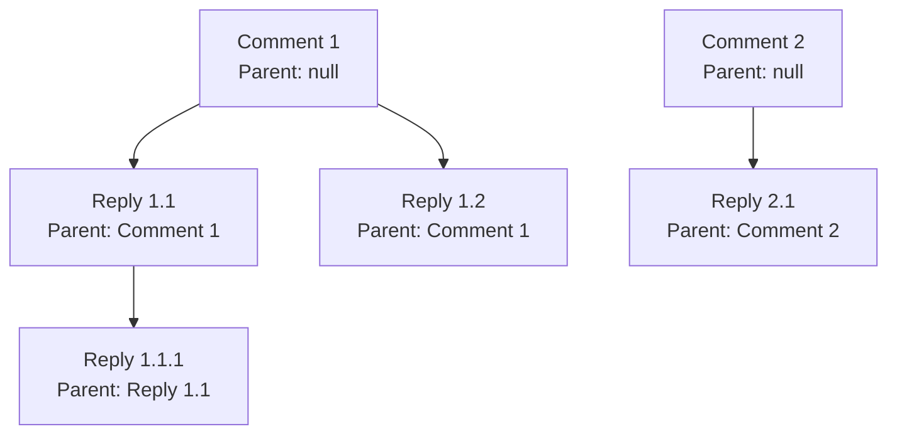

# Comments API Documentation

<cite>
**Referenced Files in This Document**
- [comment.schema.ts](file://api-fastify/src/schemas/comment.schema.ts)
- [comment.controller.ts](file://api-fastify/src/controllers/comment.controller.ts)
- [comment.service.ts](file://api-fastify/src/services/comment.service.ts)
- [comment.model.ts](file://api-fastify/src/models/comment.model.ts)
- [comment.routes.ts](file://api-fastify/src/routes/comment.routes.ts)
- [comment.types.ts](file://api-fastify/src/types/comment.types.ts)
- [auth.middleware.ts](file://api-fastify/src/middlewares/auth.middleware.ts)
- [rate-limit.middleware.ts](file://api-fastify/src/middlewares/rate-limit.middleware.ts)
</cite>

## Table of Contents
1. [Introduction](#introduction)
2. [Authentication Requirements](#authentication-requirements)
3. [Rate Limiting](#rate-limiting)
4. [API Endpoints](#api-endpoints)
5. [Request/Response Schemas](#requestresponse-schemas)
6. [Error Codes](#error-codes)
7. [Hierarchical Comments](#hierarchical-comments)
8. [Permission Model](#permission-model)
9. [Examples](#examples)
10. [Best Practices](#best-practices)

## Introduction

The Comments API provides comprehensive functionality for managing comments in the MERN_chatai_blog platform. It supports CRUD operations for comments, hierarchical threading, reactions (likes/dislikes), and sophisticated permission controls. The API follows RESTful principles and implements JWT-based authentication for sensitive operations.

## Authentication Requirements

All endpoints require JWT authentication except for retrieving comments, which supports optional authentication for public access.

### Authentication Header
```http
Authorization: Bearer <jwt_token>
```

### Authentication Middleware
The API uses a centralized authentication middleware that validates JWT tokens and extracts user information:

```typescript
// Example authentication flow
await request.jwtVerify(); // Validates JWT token
console.log('Authenticated user:', request.user); // Contains user data
```

**Section sources**
- [auth.middleware.ts](file://api-fastify/src/middlewares/auth.middleware.ts#L10-L40)

## Rate Limiting

The API implements rate limiting to prevent abuse and spam submissions. Different limits apply based on the endpoint type.

### Global Rate Limits

| Endpoint Type | Requests/Minute | Description |
|---------------|-----------------|-------------|
| General Comments | 60 | Standard comment operations |
| Comment Creation | 30 | New comment submissions |
| Comment Modification | 30 | Updates and deletions |

### Rate Limit Headers
Responses include rate limiting headers for client monitoring:

```http
X-RateLimit-Limit: 60
X-RateLimit-Remaining: 59
X-RateLimit-Reset: 1640995200000
Retry-After: 60
```

**Section sources**
- [rate-limit.middleware.ts](file://api-fastify/src/middlewares/rate-limit.middleware.ts#L1-L92)

## API Endpoints

### GET /comments/post/:post

Retrieve all comments for a specific post with optional pagination and filtering.

**Authentication**: Optional - Public access allowed

**Parameters**:
- `post` (string, required): Post ID
- `parent` (string, optional): Parent comment ID for replies
- `page` (number, optional): Page number (default: 1)
- `limit` (number, optional): Items per page (default: 10, max: 100)

**Response**: Paginated comment list with hierarchical structure

### GET /comments/:id

Retrieve a specific comment by ID.

**Authentication**: Required

**Parameters**:
- `id` (string, required): Comment ID

**Response**: Single comment object with author and reactions

### POST /comments/

Create a new comment on a post.

**Authentication**: Required

**Parameters**: None (body contains comment data)

**Body**: `{ content: string, post: string, parent?: string }`

**Response**: Created comment with metadata

### PUT /comments/:id

Update an existing comment.

**Authentication**: Required

**Parameters**:
- `id` (string, required): Comment ID

**Body**: `{ content: string }`

**Response**: Updated comment data

### DELETE /comments/:id

Delete a comment.

**Authentication**: Required

**Parameters**:
- `id` (string, required): Comment ID

**Response**: Success confirmation

### POST /comments/:id/like

Add a like reaction to a comment.

**Authentication**: Required

**Parameters**:
- `id` (string, required): Comment ID

**Response**: Updated reaction counts and status

### POST /comments/:id/unlike

Remove a like reaction from a comment.

**Authentication**: Required

**Parameters**:
- `id` (string, required): Comment ID

**Response**: Updated reaction counts and status

### POST /comments/:id/dislike

Add a dislike reaction to a comment.

**Authentication**: Required

**Parameters**:
- `id` (string, required): Comment ID

**Response**: Updated reaction counts and status

## Request/Response Schemas

### Get Comments Schema

```typescript
{
  params: {
    post: { type: 'string' }
  },
  querystring: {
    parent: { type: 'string' },
    page: { type: 'number', minimum: 1 },
    limit: { type: 'number', minimum: 1, maximum: 100 }
  },
  response: {
    200: {
      type: 'object',
      properties: {
        comments: Array<CommentResponse>,
        total: { type: 'number' },
        page: { type: 'number' },
        limit: { type: 'number' },
        totalPages: { type: 'number' }
      }
    }
  }
}
```

### Create Comment Schema

```typescript
{
  body: {
    content: { type: 'string', minLength: 1, maxLength: 1000 },
    post: { type: 'string' },
    parent: { type: 'string' }
  },
  response: {
    201: {
      type: 'object',
      properties: {
        message: { type: 'string' },
        comment: CommentResponse
      }
    }
  }
}
```

### Comment Response Structure

```typescript
interface CommentResponse {
  _id: string;
  content: string;
  post: string;
  author: {
    _id: string;
    username: string;
    profilePicture?: string;
  };
  parent?: string;
  likes: string[]; // User IDs who liked
  dislikes: string[]; // User IDs who disliked
  likeCount: number;
  dislikeCount: number;
  isLiked?: boolean; // Present if user is authenticated
  isDisliked?: boolean; // Present if user is authenticated
  createdAt: string;
  updatedAt: string;
  replies?: CommentResponse[]; // Nested replies for top-level comments
}
```

**Section sources**
- [comment.schema.ts](file://api-fastify/src/schemas/comment.schema.ts#L1-L449)
- [comment.types.ts](file://api-fastify/src/types/comment.types.ts#L1-L49)

## Error Codes

### 400 Bad Request
- **Invalid post ID**: `ID article invalide`
- **Invalid comment ID**: `ID commentaire invalide`
- **Invalid parent comment ID**: `ID commentaire parent invalide`
- **Comment parent not found**: `Commentaire parent non trouvé`
- **Parent comment belongs to different post**: `Le commentaire parent n'appartient pas à cet article`
- **Nested replies not allowed**: `Les réponses imbriquées ne sont pas autorisées`

### 401 Unauthorized
- **Missing or invalid JWT token**: `Non autorisé - Veuillez vous connecter`

### 403 Forbidden
- **Unauthorized to modify comment**: `Vous n'êtes pas autorisé à mettre à jour ce commentaire`
- **Unauthorized to delete comment**: `Vous n'êtes pas autorisé à supprimer ce commentaire`

### 404 Not Found
- **Post not found**: `Article non trouvé`
- **Comment not found**: `Commentaire non trouvé`
- **Parent comment not found**: `Commentaire parent non trouvé`

### 500 Internal Server Error
- **General server error**: `Une erreur est survenue lors de la [operation]`

**Section sources**
- [comment.controller.ts](file://api-fastify/src/controllers/comment.controller.ts#L20-L486)

## Hierarchical Comments

The API supports hierarchical comment structures with unlimited depth. Comments can have parent-child relationships for threaded discussions.

### Thread Structure
- **Top-level comments**: `parent: null` or `parent: undefined`
- **Replies**: `parent: <parent_comment_id>`
- **Nested replies**: Replies to replies (limited to depth 1)

### Reply Retrieval
When fetching top-level comments, the API automatically retrieves and nests all replies under their respective parent comments.



**Diagram sources**
- [comment.model.ts](file://api-fastify/src/models/comment.model.ts#L1-L78)

## Permission Model

### Ownership-Based Permissions
- **Comment authors**: Can edit and delete their own comments
- **Administrators**: Can edit and delete any comment
- **Editors**: Can edit and delete comments (role-based)
- **Public users**: Can view comments but cannot modify them

### Role-Based Access Control
```typescript
// Permission checking in update/delete operations
const isAuthor = (comment.author as any).toString() === currentUserId;
const isAdmin = currentUserRole === 'admin';

if (!isAuthor && !isAdmin) {
  throw new Error("Vous n'êtes pas autorisé à mettre à jour ce commentaire");
}
```

**Section sources**
- [comment.service.ts](file://api-fastify/src/services/comment.service.ts#L150-L170)

## Examples

### Submitting a New Comment

```bash
curl -X POST https://api.example.com/comments \
  -H "Authorization: Bearer <jwt_token>" \
  -H "Content-Type: application/json" \
  -d '{
    "content": "Great post! Very insightful.",
    "post": "64f9b8c7e1a2b3c4d5e6f7g8",
    "parent": null
  }'
```

**Response**:
```json
{
  "message": "Commentaire créé avec succès",
  "comment": {
    "_id": "64f9b8c7e1a2b3c4d5e6f7h9",
    "content": "Great post! Very insightful.",
    "post": "64f9b8c7e1a2b3c4d5e6f7g8",
    "author": {
      "_id": "64f9b8c7e1a2b3c4d5e6f7i0",
      "username": "john_doe",
      "profilePicture": "https://example.com/avatar.jpg"
    },
    "parent": null,
    "likes": [],
    "dislikes": [],
    "likeCount": 0,
    "dislikeCount": 0,
    "createdAt": "2024-01-01T10:00:00.000Z",
    "updatedAt": "2024-01-01T10:00:00.000Z"
  }
}
```

### Editing an Existing Comment

```bash
curl -X PUT https://api.example.com/comments/64f9b8c7e1a2b3c4d5e6f7h9 \
  -H "Authorization: Bearer <jwt_token>" \
  -H "Content-Type: application/json" \
  -d '{
    "content": "Updated: Great post! Very insightful and informative."
  }'
```

**Response**:
```json
{
  "message": "Commentaire mis à jour avec succès",
  "comment": {
    "_id": "64f9b8c7e1a2b3c4d5e6f7h9",
    "content": "Updated: Great post! Very insightful and informative."
  }
}
```

### Adding a Like Reaction

```bash
curl -X POST https://api.example.com/comments/64f9b8c7e1a2b3c4d5e6f7h9/like \
  -H "Authorization: Bearer <jwt_token>"
```

**Response**:
```json
{
  "message": "Réaction mise à jour avec succès",
  "likes": ["64f9b8c7e1a2b3c4d5e6f7i0"],
  "dislikes": [],
  "likeCount": 1,
  "dislikeCount": 0,
  "isLiked": true,
  "isDisliked": false
}
```

### Retrieving Comments with Pagination

```bash
curl -X GET https://api.example.com/comments/post/64f9b8c7e1a2b3c4d5e6f7g8?page=1&limit=10 \
  -H "Authorization: Bearer <optional_jwt_token>"
```

**Response**:
```json
{
  "comments": [
    {
      "_id": "64f9b8c7e1a2b3c4d5e6f7h9",
      "content": "Great post!",
      "post": "64f9b8c7e1a2b3c4d5e6f7g8",
      "author": {
        "_id": "64f9b8c7e1a2b3c4d5e6f7i0",
        "username": "john_doe"
      },
      "parent": null,
      "likes": [],
      "dislikes": [],
      "likeCount": 0,
      "replies": [
        {
          "_id": "64f9b8c7e1a2b3c4d5e6f7j1",
          "content": "Thanks!",
          "post": "64f9b8c7e1a2b3c4d5e6f7g8",
          "author": {
            "_id": "64f9b8c7e1a2b3c4d5e6f7k2",
            "username": "jane_smith"
          },
          "parent": "64f9b8c7e1a2b3c4d5e6f7h9",
          "likes": [],
          "dislikes": [],
          "likeCount": 0
        }
      ]
    }
  ],
  "total": 15,
  "page": 1,
  "limit": 10,
  "totalPages": 2
}
```

## Best Practices

### Content Validation
- **Minimum length**: 1 character
- **Maximum length**: 1000 characters
- **Trim whitespace**: Automatically handled by schema validation

### Rate Limiting Guidelines
- **Comment creation**: Maximum 30 requests per minute
- **Comment updates/deletions**: Maximum 30 requests per minute
- **General operations**: Maximum 60 requests per minute

### Performance Optimization
- **Index usage**: Comments are indexed by post and creation date
- **Pagination**: Always use pagination for large datasets
- **Cache invalidation**: Automatic cache invalidation on comment modifications

### Security Considerations
- **Input sanitization**: Content is automatically trimmed and validated
- **Ownership verification**: All modifications require ownership validation
- **Rate limiting**: Prevents abuse and spam attacks
- **Optional authentication**: Public endpoints support anonymous access

**Section sources**
- [comment.model.ts](file://api-fastify/src/models/comment.model.ts#L1-L78)
- [comment.service.ts](file://api-fastify/src/services/comment.service.ts#L1-L333)