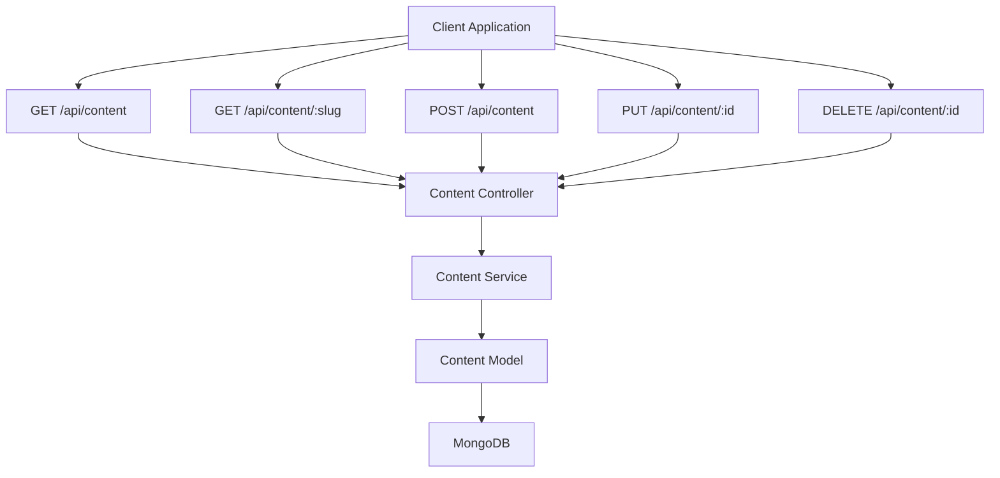
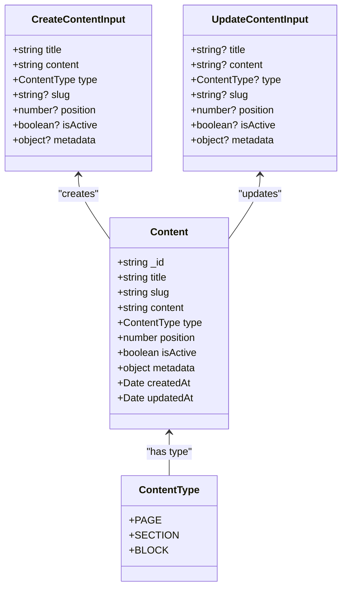
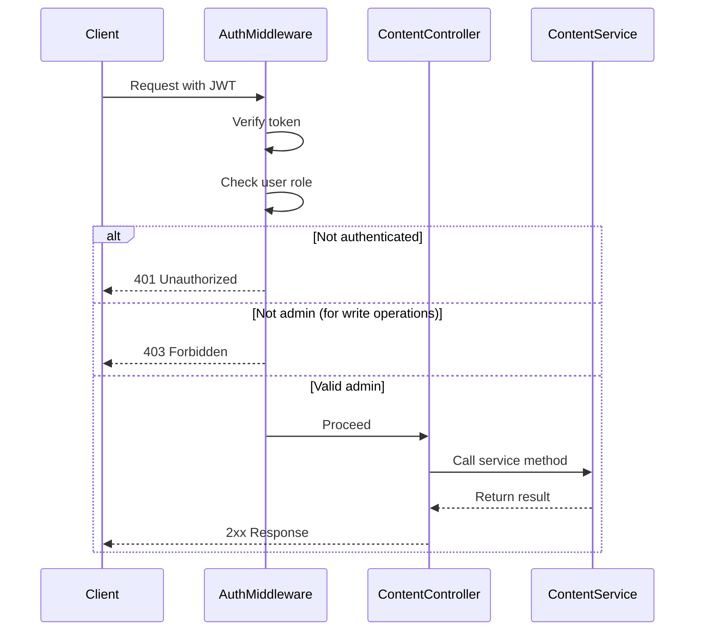

# Content API

<cite>
**Referenced Files in This Document**   
- [content.controller.ts](file://api-fastify/src/controllers/content.controller.ts)
- [content.service.ts](file://api-fastify/src/services/content.service.ts)
- [content.model.ts](file://api-fastify/src/models/content.model.ts)
- [content.types.ts](file://api-fastify/src/types/content.types.ts)
- [content.routes.ts](file://api-fastify/src/routes/content.routes.ts)
- [content.schema.ts](file://api-fastify/src/schemas/content.schema.ts)
- [auth.middleware.ts](file://api-fastify/src/middlewares/auth.middleware.ts)
</cite>

## Table of Contents
1. [Introduction](#introduction)
2. [API Endpoints](#api-endpoints)
3. [Request/Response Schemas](#requestresponse-schemas)
4. [Authentication and Authorization](#authentication-and-authorization)
5. [Content Types and Structure](#content-types-and-structure)
6. [Error Handling](#error-handling)
7. [Examples](#examples)
8. [Frontend Integration](#frontend-integration)

## Introduction
The Content API provides endpoints for managing static content within the MERN_chatai_blog application. This API enables CRUD operations for content items such as pages, sections, and blocks that make up the static elements of the website. The API is built using Fastify and follows REST principles, with JWT-based authentication and role-based access control to ensure only authorized users can modify content.

The content management system supports different types of static content, each with a title, body content, slug, position, and metadata. Content items can be active or inactive, allowing for draft content to be created and edited before publication. The API includes comprehensive validation and error handling to ensure data integrity and provide meaningful feedback to clients.

**Section sources**
- [content.controller.ts](file://api-fastify/src/controllers/content.controller.ts#L1-L208)
- [content.service.ts](file://api-fastify/src/services/content.service.ts#L1-L157)

## API Endpoints

### GET /api/content
Retrieves all content items with optional filtering by type and active status.

### GET /api/content/:slug
Retrieves a specific content item by its slug identifier.

### POST /api/content
Creates a new content item. Requires authentication and admin privileges.

### PUT /api/content/:id
Updates an existing content item by its ID. Requires authentication and admin privileges.

### DELETE /api/content/:id
Deletes a content item by its ID. Requires authentication and admin privileges.



**Diagram sources**
- [content.routes.ts](file://api-fastify/src/routes/content.routes.ts#L1-L78)
- [content.controller.ts](file://api-fastify/src/controllers/content.controller.ts#L1-L208)

**Section sources**
- [content.routes.ts](file://api-fastify/src/routes/content.routes.ts#L1-L78)
- [content.controller.ts](file://api-fastify/src/controllers/content.controller.ts#L1-L208)

## Request/Response Schemas

### Content Object Structure
The content API uses a consistent structure for content objects with the following fields:

| Field | Type | Required | Description |
|-------|------|----------|-------------|
| title | string | Yes | Content title (2-200 characters) |
| slug | string | Yes | URL-friendly identifier (unique) |
| content | string | Yes | Main content body (Markdown or HTML) |
| type | string | Yes | Content type (page, section, block) |
| position | number | No | Display order (default: 0) |
| isActive | boolean | No | Whether content is publicly visible (default: true) |
| metadata | object | No | Additional key-value data for the content |

### Request Schemas
Each endpoint has specific request validation:

- **GET /**: Query parameters for filtering by `type` and `isActive`
- **GET /:slug**: Path parameter for the content slug
- **POST /**: Body with content data (title, content, type required)
- **PUT /:id**: Path parameter for content ID and body with update data
- **DELETE /:id**: Path parameter for content ID

### Response Schemas
Standardized responses include appropriate status codes and data structures:

- **200 OK**: Successful GET/PUT operations with content data
- **201 Created**: Successful POST operation with created content info
- **200 OK**: Successful DELETE operation with success message
- **400 Bad Request**: Validation errors or invalid data
- **404 Not Found**: Content not found
- **500 Internal Server Error**: Server-side errors



**Diagram sources**
- [content.model.ts](file://api-fastify/src/models/content.model.ts#L1-L53)
- [content.types.ts](file://api-fastify/src/types/content.types.ts#L1-L50)
- [content.schema.ts](file://api-fastify/src/schemas/content.schema.ts#L1-L201)

**Section sources**
- [content.schema.ts](file://api-fastify/src/schemas/content.schema.ts#L1-L201)
- [content.types.ts](file://api-fastify/src/types/content.types.ts#L1-L50)

## Authentication and Authorization

### JWT Authentication
All modification endpoints (POST, PUT, DELETE) require JWT authentication via the `authenticate` middleware. The token can be provided either in the Authorization header as a Bearer token or in a cookie named "token".

### Role-Based Access Control
Only users with admin privileges can create, update, or delete content. This is enforced by the `isAdmin` middleware which:

1. Verifies the JWT token
2. Retrieves the user from the database
3. Checks if the user's role is "admin"
4. Returns 403 Forbidden if the user is not an admin

Regular users and guests can only retrieve content through the GET endpoints.

### Content Visibility
Inactive content (where `isActive` is false) is only accessible to admin users. For non-admin users, inactive content appears as if it doesn't exist (404 Not Found), providing a way to create draft content that remains hidden until published.



**Diagram sources**
- [auth.middleware.ts](file://api-fastify/src/middlewares/auth.middleware.ts#L1-L127)
- [content.routes.ts](file://api-fastify/src/routes/content.routes.ts#L1-L78)

**Section sources**
- [auth.middleware.ts](file://api-fastify/src/middlewares/auth.middleware.ts#L1-L127)
- [content.routes.ts](file://api-fastify/src/routes/content.routes.ts#L1-L78)

## Content Types and Structure

### Supported Content Types
The API supports three types of static content:

- **Page**: Top-level content representing complete pages on the site
- **Section**: Content sections that can be part of pages or displayed independently
- **Block**: Reusable content blocks that can be embedded in multiple places

### Data Relationships
Content items are stored as documents in MongoDB with the following relationships:

- Each content item has a unique slug for URL-based retrieval
- The position field allows for ordered display of content within a type
- Metadata field supports extensibility for additional content properties
- Timestamps (createdAt, updatedAt) are automatically maintained

### Frontend Rendering
Content retrieved from the API is used by the frontend to render static site elements. The content body can contain Markdown or HTML, which is processed by frontend components like `MarkdownRenderer` and `TiptapRenderer` to display properly formatted content.

**Section sources**
- [content.model.ts](file://api-fastify/src/models/content.model.ts#L1-L53)
- [content.types.ts](file://api-fastify/src/types/content.types.ts#L1-L50)

## Error Handling

### Error Codes and Meanings
The API returns standardized error responses with appropriate HTTP status codes:

| Status Code | Scenario | Response Message |
|-----------|---------|-----------------|
| 400 | Invalid content ID format | "ID contenu invalide" |
| 400 | Duplicate slug on create/update | "Un contenu avec ce slug existe déjà" |
| 403 | Non-admin user attempting write operation | "Accès refusé - Droits d'administrateur requis" |
| 404 | Content not found by slug or ID | "Contenu non trouvé" |
| 500 | Server-side errors | "Une erreur est survenue lors de la [operation]" |

### Validation Rules
The API enforces several validation rules:

- Title must be 2-200 characters long
- Slug must be unique across all content
- Type must be one of the defined ContentType values
- Required fields (title, content, type) must be present on creation

### Error Response Structure
Error responses follow a consistent format:
```json
{
  "message": "Error description"
}
```

**Section sources**
- [content.controller.ts](file://api-fastify/src/controllers/content.controller.ts#L1-L208)
- [content.service.ts](file://api-fastify/src/services/content.service.ts#L1-L157)

## Examples

### Retrieving a Specific Content Page
To retrieve a content page by its slug:

```http
GET /api/content/about-us
Authorization: Bearer <jwt_token>
```

Response:
```json
{
  "content": {
    "_id": "64a1b2c3d4e5f6a7b8c9d0e1",
    "title": "About Us",
    "slug": "about-us",
    "content": "# Welcome to Our Site\n\nWe are dedicated to...",
    "type": "page",
    "position": 1,
    "isActive": true,
    "metadata": {
      "seoTitle": "About Our Company",
      "seoDescription": "Learn about our mission and values"
    },
    "createdAt": "2023-07-01T10:00:00.000Z",
    "updatedAt": "2023-07-05T14:30:00.000Z"
  }
}
```

### Updating Content for a Site Section
To update an existing content section:

```http
PUT /api/content/64a1b2c3d4e5f6a7b8c9d0e2
Authorization: Bearer <jwt_token>
Content-Type: application/json

{
  "title": "Updated Hero Section",
  "content": "## New Hero Content\n\nUpdated welcome message...",
  "isActive": true
}
```

Response:
```json
{
  "message": "Contenu mis à jour avec succès",
  "content": {
    "_id": "64a1b2c3d4e5f6a7b8c9d0e2",
    "title": "Updated Hero Section",
    "slug": "hero-section"
  }
}
```

**Section sources**
- [content.controller.ts](file://api-fastify/src/controllers/content.controller.ts#L46-L82)
- [content.service.ts](file://api-fastify/src/services/content.service.ts#L107-L156)

## Frontend Integration

### API Service Layer
The frontend uses a service layer to interact with the Content API, abstracting the HTTP calls and providing a clean interface for components. This service handles:

- Request formatting and response parsing
- Error handling and user feedback
- Authentication token management
- Loading states and caching

### Component Integration
Content from the API is integrated into the frontend through components like:

- `MarkdownRenderer`: Renders Markdown content from the API
- `TiptapRenderer`: Renders rich text content created with the Tiptap editor
- Admin interfaces for content management

The separation between content storage and presentation allows for flexible rendering while maintaining a consistent content management workflow.

**Section sources**
- [postApi.ts](file://src/features/posts/services/postApi.ts#L1-L604)
- [ContentFilterAdmin.tsx](file://src/components/admin/ContentFilterAdmin.tsx#L1-L740)