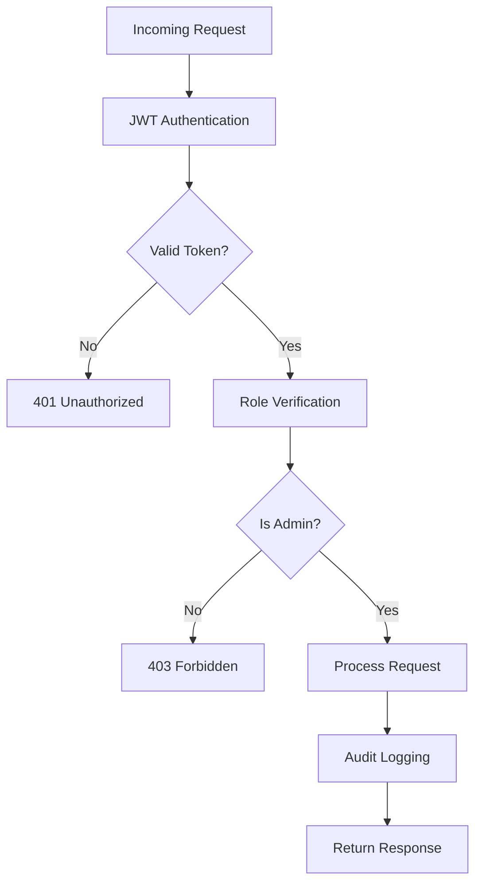
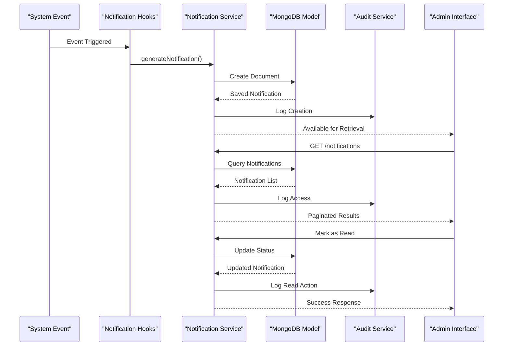
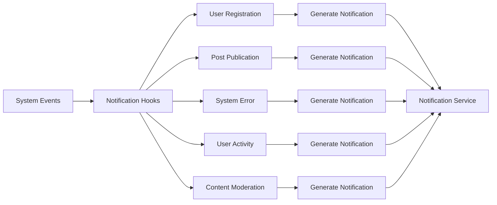

# Notifications API Documentation

<cite>
**Referenced Files in This Document**
- [notification.controller.ts](file://api-fastify/src/controllers/notification.controller.ts)
- [notification.service.ts](file://api-fastify/src/services/notification.service.ts)
- [notification.model.ts](file://api-fastify/src/models/notification.model.ts)
- [notification.types.ts](file://api-fastify/src/types/notification.types.ts)
- [notification.routes.ts](file://api-fastify/src/routes/notification.routes.ts)
- [notification-cleanup.service.ts](file://api-fastify/src/services/notification-cleanup.service.ts)
- [notification-audit.service.ts](file://api-fastify/src/services/notification-audit.service.ts)
- [notification-hooks.service.ts](file://api-fastify/src/services/notification-hooks.service.ts)
- [auth.middleware.ts](file://api-fastify/src/middlewares/auth.middleware.ts)
- [notification-validation.middleware.ts](file://api-fastify/src/middlewares/notification-validation.middleware.ts)
- [NotificationService.ts](file://src/services/NotificationService.ts)
- [AdminNotification.ts](file://src/types/AdminNotification.ts)
</cite>

## Table of Contents
1. [Introduction](#introduction)
2. [Authentication & Authorization](#authentication--authorization)
3. [API Endpoints](#api-endpoints)
4. [Notification Lifecycle](#notification-lifecycle)
5. [Data Models](#data-models)
6. [Error Handling](#error-handling)
7. [Integration Services](#integration-services)
8. [Performance & Rate Limiting](#performance--rate-limiting)
9. [Troubleshooting Guide](#troubleshooting-guide)
10. [Best Practices](#best-practices)

## Introduction

The Notifications API provides comprehensive administrative functionality for managing system notifications in the MERN_chatai_blog platform. This API enables administrators to retrieve, manage, and monitor notifications while maintaining strict security controls and audit trails.

The notification system is designed to handle various types of administrative alerts including user registrations, post publications, system errors, user activities, and content moderation events. All operations require administrator privileges and are tracked through comprehensive audit logging.

## Authentication & Authorization

All notification endpoints require JWT-based authentication with role-based access control. Only administrators can access and modify notification data.

### Authentication Requirements

- **JWT Token**: Must be included in the Authorization header
- **Role**: Administrator (`UserRole.ADMIN`)
- **Token Validation**: Automatic verification through middleware

### Security Implementation



**Section sources**
- [auth.middleware.ts](file://api-fastify/src/middlewares/auth.middleware.ts#L40-L55)

## API Endpoints

### GET /api/admin/notifications

Retrieve paginated notifications with optional filtering.

#### Request Parameters

| Parameter | Type | Required | Description |
|-----------|------|----------|-------------|
| `page` | integer | No | Page number (default: 1, min: 1) |
| `limit` | integer | No | Items per page (default: 50, max: 100) |
| `unreadOnly` | boolean | No | Filter unread notifications only |

#### Response Schema

```typescript
interface GetNotificationsResponse {
  notifications: AdminNotification[];
  pagination: {
    currentPage: number;
    totalPages: number;
    totalNotifications: number;
    hasNextPage: boolean;
    hasPrevPage: boolean;
  };
  unreadCount: number;
}
```

#### Example Request

```bash
GET /api/admin/notifications?page=1&limit=20&unreadOnly=true
Authorization: Bearer <jwt-token>
```

#### Example Response

```json
{
  "notifications": [
    {
      "id": "651234567890abcdef123456",
      "type": "user_registered",
      "title": "New User Registration",
      "message": "John Doe has registered an account",
      "timestamp": "2024-09-25T10:30:00Z",
      "read": false,
      "priority": "medium",
      "actionUrl": "/admin/users/651234567890abcdef123456",
      "metadata": {
        "userId": "651234567890abcdef123456",
        "username": "johndoe"
      }
    }
  ],
  "pagination": {
    "currentPage": 1,
    "totalPages": 5,
    "totalNotifications": 100,
    "hasNextPage": true,
    "hasPrevPage": false
  },
  "unreadCount": 15
}
```

### PATCH /api/admin/notifications/:id/read

Mark a specific notification as read.

#### Path Parameters

| Parameter | Type | Required | Description |
|-----------|------|----------|-------------|
| `id` | string | Yes | MongoDB ObjectId of the notification |

#### Response Schema

```typescript
interface MarkAsReadResponse {
  message: string;
  notification: AdminNotification;
}
```

#### Example Request

```bash
PATCH /api/admin/notifications/651234567890abcdef123456/read
Authorization: Bearer <jwt-token>
```

#### Example Response

```json
{
  "message": "Notification marquée comme lue avec succès",
  "notification": {
    "id": "651234567890abcdef123456",
    "type": "user_registered",
    "title": "New User Registration",
    "message": "John Doe has registered an account",
    "timestamp": "2024-09-25T10:30:00Z",
    "read": true,
    "priority": "medium",
    "actionUrl": "/admin/users/651234567890abcdef123456",
    "metadata": {
      "userId": "651234567890abcdef123456",
      "username": "johndoe"
    }
  }
}
```

### PATCH /api/admin/notifications/read-all

Mark all unread notifications as read.

#### Response Schema

```typescript
interface MarkAllAsReadResponse {
  message: string;
  modifiedCount: number;
}
```

#### Example Request

```bash
PATCH /api/admin/notifications/read-all
Authorization: Bearer <jwt-token>
```

#### Example Response

```json
{
  "message": "15 notifications marquées comme lues avec succès",
  "modifiedCount": 15
}
```

### POST /api/admin/notifications/cleanup

Manually trigger cleanup of old notifications (older than 30 days).

#### Response Schema

```typescript
interface CleanupResponse {
  message: string;
  deletedCount: number;
}
```

#### Example Request

```bash
POST /api/admin/notifications/cleanup
Authorization: Bearer <jwt-token>
```

#### Example Response

```json
{
  "message": "25 anciennes notifications supprimées avec succès",
  "deletedCount": 25
}
```

### GET /api/admin/notifications/cleanup/status

Get the status of the automatic cleanup service.

#### Response Schema

```typescript
interface CleanupStatusResponse {
  message: string;
  status: {
    isRunning: boolean;
    intervalHours?: number;
  };
}
```

#### Example Request

```bash
GET /api/admin/notifications/cleanup/status
Authorization: Bearer <jwt-token>
```

#### Example Response

```json
{
  "message": "Statut du service de nettoyage récupéré avec succès",
  "status": {
    "isRunning": true,
    "intervalHours": 24
  }
}
```

**Section sources**
- [notification.routes.ts](file://api-fastify/src/routes/notification.routes.ts#L1-L317)
- [notification.controller.ts](file://api-fastify/src/controllers/notification.controller.ts#L1-L217)

## Notification Lifecycle

The notification lifecycle encompasses creation, delivery, reading, and eventual cleanup of notifications.



**Diagram sources**
- [notification-hooks.service.ts](file://api-fastify/src/services/notification-hooks.service.ts#L1-L139)
- [notification.service.ts](file://api-fastify/src/services/notification.service.ts#L1-L261)
- [notification-audit.service.ts](file://api-fastify/src/services/notification-audit.service.ts#L1-L149)

### Notification Types

The system supports five distinct notification types:

1. **user_registered**: New user registration alerts
2. **post_published**: Post publication notifications
3. **system_error**: System error notifications
4. **user_activity**: User activity monitoring
5. **content_moderation**: Content moderation requests

### Priority Levels

Notifications are categorized by priority:

- **low**: Informational notifications
- **medium**: Standard operational alerts
- **high**: Critical system events requiring immediate attention

**Section sources**
- [notification.model.ts](file://api-fastify/src/models/notification.model.ts#L1-L97)
- [notification.service.ts](file://api-fastify/src/services/notification.service.ts#L80-L120)

## Data Models

### AdminNotification Interface

```typescript
interface AdminNotification {
  id: string;
  type: 'user_registered' | 'post_published' | 'system_error' | 'user_activity' | 'content_moderation';
  title: string;
  message: string;
  timestamp: Date;
  read: boolean;
  priority: 'low' | 'medium' | 'high';
  actionUrl?: string;
  metadata?: {
    userId?: string;
    postId?: string;
    username?: string;
    postTitle?: string;
    errorCode?: string;
  };
}
```

### Notification Model Schema

The MongoDB model defines the complete structure with validation rules:

```typescript
interface INotification extends Document {
  _id: string;
  type: 'user_registered' | 'post_published' | 'system_error' | 'user_activity' | 'content_moderation';
  title: string;
  message: string;
  timestamp: Date;
  read: boolean;
  priority: 'low' | 'medium' | 'high';
  actionUrl?: string;
  metadata?: {
    userId?: string;
    postId?: string;
    username?: string;
    postTitle?: string;
    errorCode?: string;
  };
  createdAt: Date;
  updatedAt: Date;
}
```

### Database Indexes

The notification collection uses strategic indexing for optimal performance:

- `{ timestamp: -1 }`: For chronological sorting
- `{ read: 1 }`: For unread notification queries
- `{ type: 1 }`: For type-based filtering
- `{ priority: 1 }`: For priority-based queries

**Section sources**
- [notification.model.ts](file://api-fastify/src/models/notification.model.ts#L1-L97)
- [notification.types.ts](file://api-fastify/src/types/notification.types.ts#L1-L48)

## Error Handling

The API implements comprehensive error handling with specific HTTP status codes and meaningful error messages.

### HTTP Status Codes

| Status Code | Meaning | Occurrence |
|-------------|---------|------------|
| 200 | Success | All successful operations |
| 400 | Bad Request | Invalid parameters or malformed requests |
| 401 | Unauthorized | Missing or invalid JWT token |
| 403 | Forbidden | Insufficient permissions |
| 404 | Not Found | Notification not found |
| 500 | Internal Server Error | Unexpected server errors |

### Error Response Format

```typescript
interface ErrorResponse {
  message: string;
}
```

### Common Error Scenarios

#### Invalid Notification ID

```json
{
  "message": "Format d'ID de notification invalide"
}
```

#### Notification Not Found

```json
{
  "message": "Notification non trouvée"
}
```

#### Permission Denied

```json
{
  "message": "Accès refusé - Droits d'administrateur requis"
}
```

#### Data Validation Errors

```json
{
  "message": "Le titre et le message sont requis"
}
```

**Section sources**
- [notification-validation.middleware.ts](file://api-fastify/src/middlewares/notification-validation.middleware.ts#L1-L112)
- [notification.controller.ts](file://api-fastify/src/controllers/notification.controller.ts#L1-L217)

## Integration Services

### Notification Hooks Service

The notification hooks service automatically generates notifications for system events:



**Diagram sources**
- [notification-hooks.service.ts](file://api-fastify/src/services/notification-hooks.service.ts#L1-L139)

### Notification Audit Service

All operations are logged for compliance and security monitoring:

```typescript
interface NotificationAuditEvent {
  action: 'get_notifications' | 'mark_as_read' | 'mark_all_as_read' | 'create_notification';
  userId?: string;
  notificationId?: string;
  ip: string;
  userAgent?: string;
  timestamp: Date;
  success: boolean;
  error?: string;
  metadata?: Record<string, any>;
}
```

### Notification Cleanup Service

Automated cleanup maintains database performance:

- **Retention Policy**: 30-day retention
- **Cleanup Interval**: Configurable (default: 24 hours)
- **Manual Trigger**: Available for immediate cleanup

**Section sources**
- [notification-hooks.service.ts](file://api-fastify/src/services/notification-hooks.service.ts#L1-L139)
- [notification-audit.service.ts](file://api-fastify/src/services/notification-audit.service.ts#L1-L149)
- [notification-cleanup.service.ts](file://api-fastify/src/services/notification-cleanup.service.ts#L1-L83)

## Performance & Rate Limiting

### Rate Limiting Strategy

The API implements two-tier rate limiting:

1. **Standard Rate Limiting**: 100 requests per minute for notification retrieval
2. **Modification Rate Limiting**: 20 requests per minute for notification updates

### Pagination Optimization

- **Default Limit**: 50 notifications per page
- **Maximum Limit**: 100 notifications per page
- **Efficient Queries**: Uses MongoDB's `skip()` and `limit()` with appropriate indexes

### Caching Considerations

While the backend API doesn't implement caching, the frontend service includes sophisticated caching mechanisms:

- **Local Cache**: In-memory storage of recent notifications
- **Cache Invalidation**: Automatic updates on modifications
- **Fallback Strategy**: Graceful degradation when API is unavailable

**Section sources**
- [notification.routes.ts](file://api-fastify/src/routes/notification.routes.ts#L1-L317)
- [NotificationService.ts](file://src/services/NotificationService.ts#L1-L199)

## Troubleshooting Guide

### Common Issues and Solutions

#### Issue: 401 Unauthorized Response

**Symptoms**: Requests return 401 status code

**Causes**:
- Missing Authorization header
- Expired or invalid JWT token
- Malformed token format

**Solutions**:
1. Verify JWT token is present in Authorization header
2. Ensure token hasn't expired
3. Check token format (should be `Bearer <token>`)
4. Regenerate token if necessary

#### Issue: 403 Forbidden Response

**Symptoms**: Requests return 403 status code

**Causes**:
- User is not an administrator
- Insufficient role permissions
- User account disabled

**Solutions**:
1. Verify user role is ADMIN
2. Check user account status
3. Contact system administrator for role assignment

#### Issue: 404 Notification Not Found

**Symptoms**: Specific notification operations fail

**Causes**:
- Invalid notification ID
- Notification was deleted
- Incorrect ID format

**Solutions**:
1. Verify notification ID format (MongoDB ObjectId)
2. Check if notification still exists
3. Use proper ID format: `651234567890abcdef123456`

#### Issue: 500 Internal Server Error

**Symptoms**: Unexpected server errors

**Causes**:
- Database connectivity issues
- Validation failures
- Unhandled exceptions

**Solutions**:
1. Check database connection
2. Review request payload validation
3. Monitor server logs for detailed error information

### Debugging Tools

#### Audit Logs

Enable audit logging to track all notification operations:

```typescript
// Enable debug mode
const debugEnabled = true;
```

#### Health Checks

Monitor service health through cleanup status endpoint:

```bash
GET /api/admin/notifications/cleanup/status
```

#### Monitoring Metrics

Track key metrics:
- Notification creation rate
- Read/unread ratios
- Cleanup operation frequency
- Error rates by endpoint

**Section sources**
- [notification-audit.service.ts](file://api-fastify/src/services/notification-audit.service.ts#L1-L149)
- [notification.controller.ts](file://api-fastify/src/controllers/notification.controller.ts#L1-L217)

## Best Practices

### Security Guidelines

1. **Always Use HTTPS**: All communication should occur over encrypted connections
2. **Token Management**: Store JWT tokens securely and implement proper refresh mechanisms
3. **Input Validation**: All incoming data is validated and sanitized
4. **Audit Trail**: All operations are logged for security monitoring

### Performance Optimization

1. **Pagination**: Always use pagination for large datasets
2. **Index Utilization**: Leverage database indexes for efficient queries
3. **Selective Fields**: Request only necessary fields when possible
4. **Batch Operations**: Use bulk operations for multiple updates

### Operational Excellence

1. **Monitoring**: Implement comprehensive monitoring and alerting
2. **Backup Strategy**: Regular backups of notification data
3. **Capacity Planning**: Monitor growth trends and plan accordingly
4. **Documentation**: Keep API documentation up to date

### Development Workflow

1. **Testing**: Comprehensive testing of all endpoints
2. **Validation**: Strict input validation and error handling
3. **Versioning**: Maintain backward compatibility
4. **Documentation**: Clear, detailed API documentation