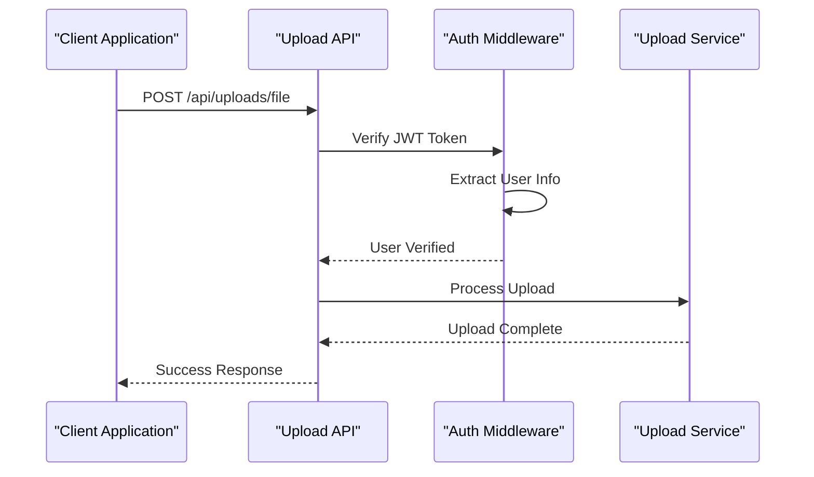
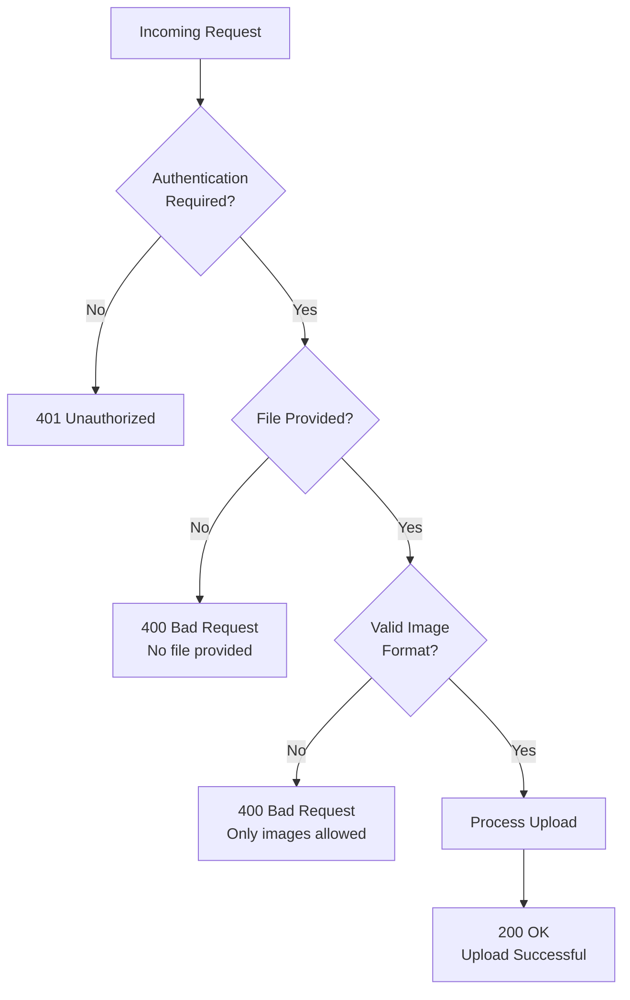
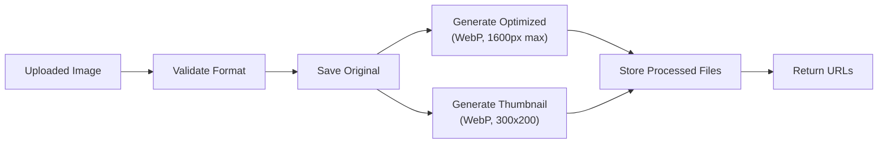

# Upload API Documentation

<cite>
**Referenced Files in This Document**
- [upload.controller.ts](file://api-fastify/src/controllers/upload.controller.ts)
- [upload.service.ts](file://api-fastify/src/services/upload.service.ts)
- [image.service.ts](file://api-fastify/src/services/image.service.ts)
- [upload.routes.ts](file://api-fastify/src/routes/upload.routes.ts)
- [auth.middleware.ts](file://api-fastify/src/middlewares/auth.middleware.ts)
- [server.ts](file://api-fastify/src/server.ts)
- [user.types.ts](file://api-fastify/src/types/user.types.ts)
- [MediaUpload.tsx](file://src/features/posts/components/PostForm/MediaUpload.tsx)
- [useImageHandler.ts](file://src/hooks/useImageHandler.ts)
- [postApi.ts](file://src/features/posts/services/postApi.ts)
- [api.types.ts](file://src/features/posts/types/api.types.ts)
</cite>

## Table of Contents
1. [Introduction](#introduction)
2. [Authentication Requirements](#authentication-requirements)
3. [API Endpoints](#api-endpoints)
4. [Request Structure](#request-structure)
5. [Response Schemas](#response-schemas)
6. [File Processing Features](#file-processing-features)
7. [Error Codes](#error-codes)
8. [Security Considerations](#security-considerations)
9. [Usage Examples](#usage-examples)
10. [Implementation Details](#implementation-details)

## Introduction

The Upload API provides comprehensive file upload capabilities for the MERN_chatai_blog platform, focusing primarily on image uploads with advanced processing features. The API supports both traditional multipart file uploads and base64-encoded image uploads, with automatic optimization, thumbnail generation, and secure storage mechanisms.

The upload service is designed to handle various image formats while maintaining optimal performance and security standards. It integrates seamlessly with the blog's content management system, enabling authors and editors to easily incorporate media into their posts.

## Authentication Requirements

All upload endpoints require authentication via JWT tokens. The API implements role-based access control, ensuring that only authenticated users can upload files.

### Authentication Flow



**Diagram sources**
- [auth.middleware.ts](file://api-fastify/src/middlewares/auth.middleware.ts#L10-L40)
- [upload.routes.ts](file://api-fastify/src/routes/upload.routes.ts#L12-L18)

### Role-Based Access Control

The upload service currently requires authentication for all endpoints, with plans for future role-based restrictions:

- **Authenticated Users**: Can upload files
- **Administrators**: Full upload privileges
- **Editors**: Upload privileges for content creation
- **Authors**: Upload privileges for personal content

**Section sources**
- [auth.middleware.ts](file://api-fastify/src/middlewares/auth.middleware.ts#L10-L40)
- [upload.routes.ts](file://api-fastify/src/routes/upload.routes.ts#L12-L18)

## API Endpoints

The Upload API consists of two primary endpoints, both requiring authentication:

### Endpoint 1: File Upload (Multipart Form)

**URL**: `POST /api/uploads/file`

**Description**: Uploads files using multipart/form-data format, primarily for image files.

**Authentication**: Required (JWT token in Authorization header or cookies)

### Endpoint 2: Base64 Image Upload

**URL**: `POST /api/uploads/base64`

**Description**: Uploads images encoded in base64 format, useful for inline image data.

**Authentication**: Required (JWT token in Authorization header or cookies)



**Diagram sources**
- [upload.controller.ts](file://api-fastify/src/controllers/upload.controller.ts#L25-L50)
- [upload.controller.ts](file://api-fastify/src/controllers/upload.controller.ts#L75-L100)

**Section sources**
- [upload.routes.ts](file://api-fastify/src/routes/upload.routes.ts#L12-L87)

## Request Structure

### File Upload (Multipart Form)

**Content-Type**: `multipart/form-data`

**Body Parameters**:
- `file`: The image file to upload (required)

**Example Request**:
```bash
curl -X POST \
  http://localhost:4200/api/uploads/file \
  -H 'Authorization: Bearer YOUR_JWT_TOKEN' \
  -F 'file=@/path/to/image.jpg'
```

### Base64 Image Upload

**Content-Type**: `application/json`

**Body Parameters**:
- `filename`: Original filename (required)
- `data`: Base64-encoded image data (required)

**Example Request**:
```bash
curl -X POST \
  http://localhost:4200/api/uploads/base64 \
  -H 'Authorization: Bearer YOUR_JWT_TOKEN' \
  -H 'Content-Type: application/json' \
  -d '{
    "filename": "example.jpg",
    "data": "data:image/jpeg;base64,/9j/4AAQSkZJRgABAQAAAQ..."
  }'
```

**Section sources**
- [upload.controller.ts](file://api-fastify/src/controllers/upload.controller.ts#L15-L25)
- [upload.controller.ts](file://api-fastify/src/controllers/upload.controller.ts#L55-L75)

## Response Schemas

### Success Response Format

Both endpoints return a standardized response format containing multiple URLs for different image variants:

```json
{
  "message": "Image uploadée avec succès",
  "url": "http://localhost:4200/uploads/abc123def456.jpg",
  "urls": {
    "original": "http://localhost:4200/uploads/abc123def456.jpg",
    "optimized": "http://localhost:4200/uploads/abc123def456-opt.webp",
    "thumbnail": "http://localhost:4200/uploads/abc123def456-thumb.webp"
  }
}
```

### Response Properties

- **message**: Success confirmation message
- **url**: Legacy field pointing to the original image URL (for backward compatibility)
- **urls**: Object containing URLs for different image variants:
  - `original`: Unmodified original image
  - `optimized`: Optimized version (WebP format, max 1600px width)
  - `thumbnail`: Thumbnail version (WebP format, 300x200 pixels)

### Error Response Format

```json
{
  "message": "Erreur spécifique du serveur"
}
```

**Section sources**
- [upload.controller.ts](file://api-fastify/src/controllers/upload.controller.ts#L45-L60)
- [upload.controller.ts](file://api-fastify/src/controllers/upload.controller.ts#L100-L115)

## File Processing Features

### Image Optimization

The upload service automatically processes uploaded images with advanced optimization:



**Diagram sources**
- [upload.service.ts](file://api-fastify/src/services/upload.service.ts#L55-L75)
- [image.service.ts](file://api-fastify/src/services/image.service.ts#L10-L40)

### Processing Specifications

#### Original Image Storage
- **Format**: Preserved from original upload
- **Naming**: Generated using nanoid (10-character unique ID)
- **Location**: `./uploads/` directory

#### Optimized Image Generation
- **Format**: WebP (maximum compatibility and compression)
- **Width Limit**: 1600 pixels (maintains quality while reducing file size)
- **Quality**: 82% (balanced quality vs file size)
- **Naming**: `{original-id}-opt.webp`

#### Thumbnail Generation
- **Format**: WebP
- **Dimensions**: 300x200 pixels
- **Quality**: 70%
- **Naming**: `{original-id}-thumb.webp`

### Supported Image Formats

The API supports the following image formats:

- JPEG/JPG
- PNG
- GIF
- WebP
- SVG (with validation)

**Section sources**
- [upload.service.ts](file://api-fastify/src/services/upload.service.ts#L55-L75)
- [image.service.ts](file://api-fastify/src/services/image.service.ts#L10-L40)
- [useImageHandler.ts](file://src/hooks/useImageHandler.ts#L35-L45)

## Error Codes

The Upload API implements comprehensive error handling with specific HTTP status codes and meaningful error messages.

### HTTP Status Codes

| Status Code | Description | Common Causes |
|-------------|-------------|---------------|
| 200 | Success | File uploaded and processed successfully |
| 400 | Bad Request | Invalid request format, missing file, or invalid base64 data |
| 401 | Unauthorized | Missing or invalid JWT token |
| 403 | Forbidden | Insufficient permissions (future implementation) |
| 413 | Payload Too Large | File size exceeds limits |
| 415 | Unsupported Media Type | Non-image file uploaded |
| 500 | Internal Server Error | Unexpected server error during processing |

### Error Scenarios

#### 400 Bad Request
- **No file provided**: Empty multipart form
- **Invalid base64 format**: Malformed base64 data
- **Unsupported file type**: Non-image file uploaded

#### 413 Payload Too Large
- **File size limit exceeded**: Files larger than 5MB (multipart) or 10MB (base64)

#### 415 Unsupported Media Type
- **Non-image file**: Attempting to upload documents, videos, or other non-image files

#### 500 Internal Server Error
- **Processing failure**: Issues during image optimization or storage
- **Storage errors**: Disk space or permission problems
- **Unexpected exceptions**: Unhandled runtime errors


**Diagram sources**
- [upload.controller.ts](file://api-fastify/src/controllers/upload.controller.ts#L30-L35)
- [upload.controller.ts](file://api-fastify/src/controllers/upload.controller.ts#L80-L85)

**Section sources**
- [upload.controller.ts](file://api-fastify/src/controllers/upload.controller.ts#L30-L35)
- [upload.controller.ts](file://api-fastify/src/controllers/upload.controller.ts#L80-L85)
- [upload.controller.ts](file://api-fastify/src/controllers/upload.controller.ts#L110-L115)

## Security Considerations

### File Type Validation

The API implements strict file type validation to prevent malicious file uploads:

```typescript
// MIME type validation in upload controller
if (!mimeType.startsWith('image/')) {
  return reply.status(400).send({
    message: 'Seules les images sont autorisées',
  });
}
```

### File Size Limits

- **Multipart uploads**: Maximum 5MB per file
- **Base64 uploads**: Maximum 10MB equivalent (due to encoding overhead)

### Additional Security Measures

#### Frontend Validation
The client-side implementation includes comprehensive validation:

```typescript
// Client-side file type validation
const allowedTypes = ['image/jpeg', 'image/jpg', 'image/png', 'image/gif', 'image/webp'];

// Size validation (5MB limit)
const maxSize = 5 * 1024 * 1024; // 5MB
if (file.size > maxSize) {
  // Handle error
}
```

#### SVG Validation
Special validation for SVG files to prevent potential security risks:

```typescript
// SVG viewBox validation
const viewBoxMatch = text.match(/viewBox\s*=\s*"([^"]*)"/i);
if (!viewBoxMatch) {
  setError('SVG invalide: attribut viewBox manquant');
}
```

### Future Security Enhancements

The API is designed to accommodate future security features:

- **Virus scanning**: Integration with antivirus services
- **Content filtering**: Automatic detection of inappropriate content
- **Access controls**: Role-based restrictions for different upload types
- **Rate limiting**: Protection against abuse and DoS attacks

**Section sources**
- [upload.controller.ts](file://api-fastify/src/controllers/upload.controller.ts#L35-L40)
- [useImageHandler.ts](file://src/hooks/useImageHandler.ts#L35-L45)
- [MediaUpload.tsx](file://src/features/posts/components/PostForm/MediaUpload.tsx#L180-L200)

## Usage Examples

### JavaScript Example (XMLHttpRequest)

```javascript
async function uploadImage(file) {
  const formData = new FormData();
  formData.append('file', file);

  const xhr = new XMLHttpRequest();
  xhr.open('POST', 'http://localhost:4200/api/uploads/file', true);
  xhr.setRequestHeader('Authorization', 'Bearer YOUR_JWT_TOKEN');
  xhr.withCredentials = true;

  return new Promise((resolve, reject) => {
    xhr.upload.onprogress = (event) => {
      if (event.lengthComputable) {
        const progress = (event.loaded / event.total) * 100;
        console.log(`Upload progress: ${progress.toFixed(2)}%`);
      }
    };

    xhr.onload = () => {
      if (xhr.status >= 200 && xhr.status < 300) {
        const response = JSON.parse(xhr.responseText);
        resolve(response);
      } else {
        reject(new Error(`Upload failed: ${xhr.status}`));
      }
    };

    xhr.onerror = () => reject(new Error('Network error'));
    xhr.send(formData);
  });
}
```

### JavaScript Example (Fetch API)

```javascript
async function uploadImageWithFetch(file) {
  const formData = new FormData();
  formData.append('file', file);

  try {
    const response = await fetch('http://localhost:4200/api/uploads/file', {
      method: 'POST',
      headers: {
        'Authorization': 'Bearer YOUR_JWT_TOKEN'
      },
      credentials: 'include',
      body: formData
    });

    if (!response.ok) {
      throw new Error(`HTTP error! status: ${response.status}`);
    }

    const data = await response.json();
    return data;
  } catch (error) {
    console.error('Upload error:', error);
    throw error;
  }
}
```

### React Hook Example

```javascript
function useImageUpload() {
  const [uploadProgress, setUploadProgress] = useState(0);
  const [uploadError, setUploadError] = useState(null);

  const uploadImage = useCallback(async (file) => {
    const formData = new FormData();
    formData.append('file', file);

    try {
      const response = await fetch('/api/uploads/file', {
        method: 'POST',
        headers: {
          'Authorization': `Bearer ${localStorage.getItem('token')}`
        },
        body: formData
      });

      if (!response.ok) {
        throw new Error(`Upload failed: ${response.status}`);
      }

      const data = await response.json();
      return data.urls.optimized;
    } catch (error) {
      setUploadError(error.message);
      throw error;
    }
  }, []);

  return { uploadImage, uploadProgress, uploadError };
}
```

### cURL Examples

#### Basic File Upload
```bash
curl -X POST \
  http://localhost:4200/api/uploads/file \
  -H 'Authorization: Bearer YOUR_JWT_TOKEN' \
  -F 'file=@/path/to/image.jpg'
```

#### Base64 Upload
```bash
curl -X POST \
  http://localhost:4200/api/uploads/base64 \
  -H 'Authorization: Bearer YOUR_JWT_TOKEN' \
  -H 'Content-Type: application/json' \
  -d '{
    "filename": "example.jpg",
    "data": "data:image/jpeg;base64,/9j/4AAQSkZJRgABAQAAAQ..."
  }'
```

**Section sources**
- [postApi.ts](file://src/features/posts/services/postApi.ts#L372-L416)
- [useImageHandler.ts](file://src/hooks/useImageHandler.ts#L123-L148)

## Implementation Details

### File Storage Mechanism

The upload service uses local file system storage with the following characteristics:

#### Directory Structure
- **Root**: `./uploads/` directory
- **Naming**: Unique filenames generated using nanoid
- **Organization**: Flat structure (no subdirectories)

#### File Path Generation
```typescript
// Unique filename generation
const baseName = nanoid(10);
const fileName = `${baseName}${ext}`;
const filePath = path.join(UPLOAD_DIR, fileName);
```

### Server Configuration

The API server is configured with appropriate limits and middleware:

#### CORS Configuration
```typescript
await server.register(cors, {
  origin: [
    'https://iwomi-blog.netlify.app',
    'http://localhost:5173',
    'http://localhost:4200',
    'http://localhost:3000'
  ],
  credentials: true,
  methods: ['GET', 'POST', 'PUT', 'DELETE', 'OPTIONS']
});
```

#### File Upload Limits
```typescript
await server.register(multipart, {
  limits: {
    fileSize: 5 * 1024 * 1024, // 5MB
  },
});
```

### Image Processing Pipeline

The image processing follows a sophisticated pipeline:


**Diagram sources**
- [image.service.ts](file://api-fastify/src/services/image.service.ts#L10-L40)
- [upload.service.ts](file://api-fastify/src/services/upload.service.ts#L55-L75)

### Error Handling Strategy

The API implements comprehensive error handling at multiple levels:

#### Controller Level
```typescript
try {
  // Upload processing logic
  const saved = await UploadService.saveImageFile(file);
  // Success response
} catch (error) {
  request.log.error(error);
  return reply.status(500).send({
    message: 'Une erreur est survenue lors de l\'upload du fichier',
  });
}
```

#### Service Level
```typescript
// Validation and error propagation
if (!mimeType.startsWith('image/')) {
  throw new Error('Le fichier doit être une image');
}
```

**Section sources**
- [server.ts](file://api-fastify/src/server.ts#L40-L80)
- [upload.service.ts](file://api-fastify/src/services/upload.service.ts#L15-L30)
- [upload.controller.ts](file://api-fastify/src/controllers/upload.controller.ts#L40-L50)