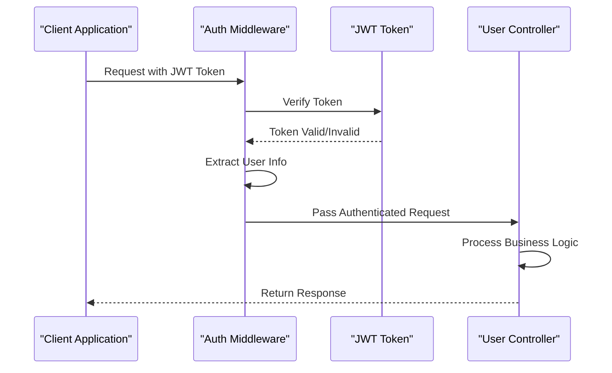
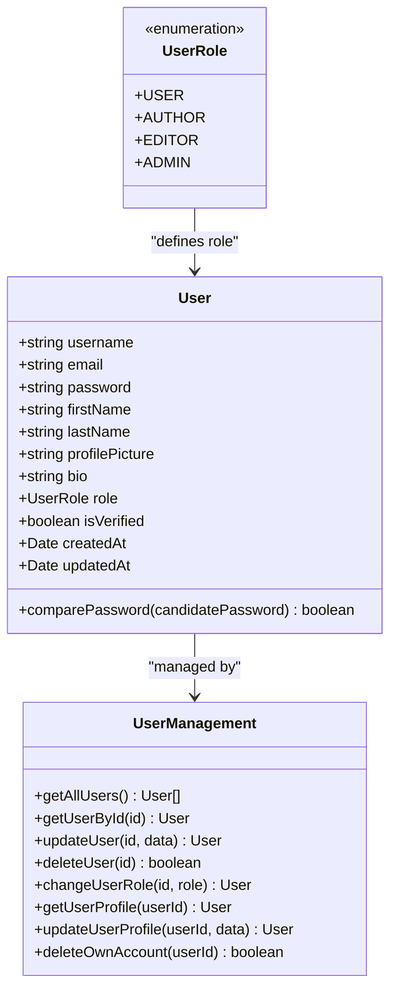
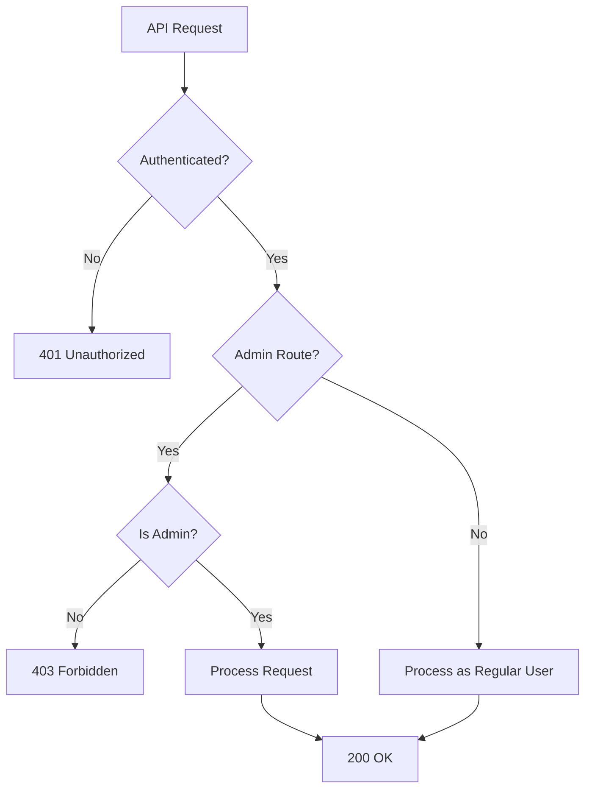
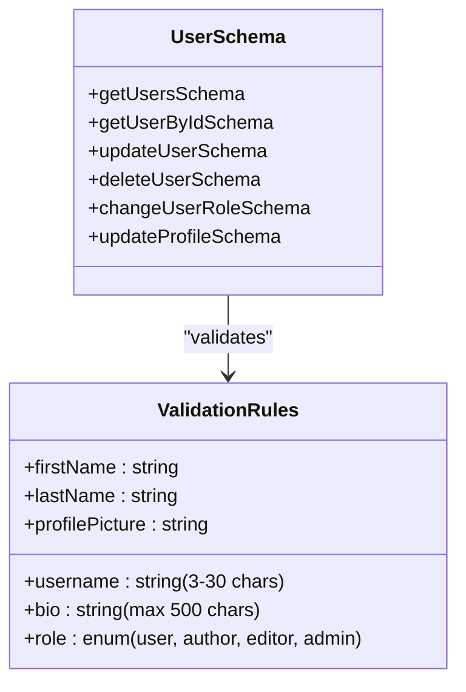
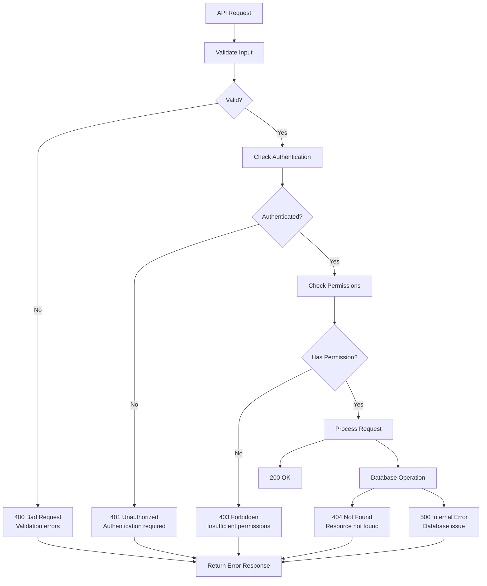
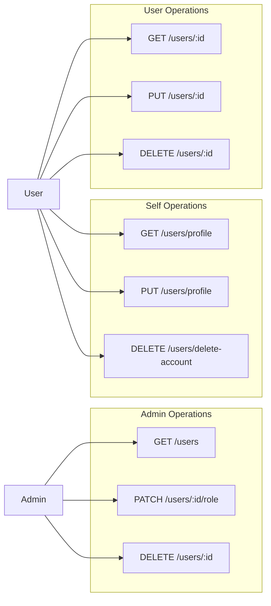

# Users API Documentation

<cite>
**Referenced Files in This Document**
- [user.routes.ts](file://api-fastify/src/routes/user.routes.ts)
- [user.schema.ts](file://api-fastify/src/schemas/user.schema.ts)
- [user.controller.ts](file://api-fastify/src/controllers/user.controller.ts)
- [user.service.ts](file://api-fastify/src/services/user.service.ts)
- [user.types.ts](file://api-fastify/src/types/user.types.ts)
- [user.model.ts](file://api-fastify/src/models/user.model.ts)
- [auth.middleware.ts](file://api-fastify/src/middlewares/auth.middleware.ts)
</cite>

## Table of Contents
1. [Introduction](#introduction)
2. [Authentication Requirements](#authentication-requirements)
3. [User Role Management](#user-role-management)
4. [API Endpoints](#api-endpoints)
5. [Request/Response Schemas](#requestresponse-schemas)
6. [Error Handling](#error-handling)
7. [Security Considerations](#security-considerations)
8. [Usage Examples](#usage-examples)
9. [Best Practices](#best-practices)

## Introduction

The Users API provides comprehensive endpoints for managing user accounts within the MERN_chatAI_blog application. This API handles user registration, profile management, role-based access control, and administrative user management. The API follows RESTful principles and implements JWT-based authentication with role-based authorization.

The user management system supports four distinct user roles: USER, AUTHOR, EDITOR, and ADMIN. Each role has specific permissions and access levels, enabling granular control over who can perform various operations within the application.

## Authentication Requirements

All user-related endpoints require JWT authentication. The authentication middleware validates the JWT token and ensures the user is properly authenticated before allowing access to protected routes.

### Authentication Flow



**Diagram sources**
- [auth.middleware.ts](file://api-fastify/src/middlewares/auth.middleware.ts#L10-L40)

### Token Requirements

- **Location**: JWT tokens are typically sent in the `Authorization` header as `Bearer <token>`
- **Format**: Standard JWT format with user claims
- **Expiration**: Configurable expiration time (typically 1 hour)
- **Required Scope**: All user endpoints require authentication

**Section sources**
- [auth.middleware.ts](file://api-fastify/src/middlewares/auth.middleware.ts#L10-L40)

## User Role Management

The application implements a hierarchical role-based access control system with four distinct user roles:



**Diagram sources**
- [user.types.ts](file://api-fastify/src/types/user.types.ts#L5-L10)
- [user.model.ts](file://api-fastify/src/models/user.model.ts#L1-L50)

### Role Descriptions

- **USER**: Basic authenticated user with limited privileges
- **AUTHOR**: Can create and edit their own posts
- **EDITOR**: Can moderate content and manage other users
- **ADMIN**: Full administrative privileges including user management

### Role-Based Access Control



**Diagram sources**
- [auth.middleware.ts](file://api-fastify/src/middlewares/auth.middleware.ts#L45-L65)

**Section sources**
- [user.types.ts](file://api-fastify/src/types/user.types.ts#L5-L10)
- [auth.middleware.ts](file://api-fastify/src/middlewares/auth.middleware.ts#L45-L65)

## API Endpoints

### GET /users/profile - Get Current User Profile

Retrieves the authenticated user's profile information.

**Authentication**: Required  
**Role**: All authenticated users  
**Permissions**: Read own profile

**Request Headers**:
```
Authorization: Bearer <jwt_token>
```

**Response Format**:
```json
{
  "user": {
    "_id": "string",
    "username": "string",
    "email": "string",
    "firstName": "string|null",
    "lastName": "string|null",
    "profilePicture": "string|null",
    "bio": "string|null",
    "role": "string",
    "isVerified": "boolean",
    "createdAt": "string",
    "updatedAt": "string"
  }
}
```

### PUT /users/profile - Update Current User Profile

Updates the authenticated user's profile information.

**Authentication**: Required  
**Role**: All authenticated users  
**Permissions**: Update own profile

**Request Headers**:
```
Authorization: Bearer <jwt_token>
Content-Type: application/json
```

**Request Body**:
```json
{
  "username": "string (min: 3, max: 30)",
  "firstName": "string",
  "lastName": "string",
  "profilePicture": "string",
  "bio": "string (max: 500)"
}
```

### GET /users - Get All Users

Retrieves all users with pagination and optional search functionality.

**Authentication**: Required  
**Role**: Admin only  
**Permissions**: View all users

**Query Parameters**:
- `page`: Page number (default: 1)
- `limit`: Items per page (default: 10)
- `search`: Search term for username, email, firstName, lastName

**Response Format**:
```json
{
  "users": [
    {
      "_id": "string",
      "username": "string",
      "email": "string",
      "firstName": "string|null",
      "lastName": "string|null",
      "profilePicture": "string|null",
      "bio": "string|null",
      "role": "string",
      "isVerified": "boolean",
      "createdAt": "string",
      "updatedAt": "string"
    }
  ],
  "total": "number",
  "page": "number",
  "limit": "number",
  "totalPages": "number"
}
```

### GET /users/:id - Get User by ID

Retrieves a specific user by their ID.

**Authentication**: Required  
**Role**: All authenticated users  
**Permissions**: View any user profile

**Path Parameters**:
- `id`: User ID (MongoDB ObjectId)

### PUT /users/:id - Update User

Updates a user's information.

**Authentication**: Required  
**Role**: Admin or self-update  
**Permissions**: Update own profile or admin privilege

**Path Parameters**:
- `id`: User ID to update

**Request Body**:
```json
{
  "username": "string (min: 3, max: 30)",
  "firstName": "string",
  "lastName": "string",
  "profilePicture": "string",
  "bio": "string (max: 500)"
}
```

### DELETE /users/:id - Delete User

Deletes a user account.

**Authentication**: Required  
**Role**: Admin or self-delete  
**Permissions**: Delete own account or admin privilege

**Path Parameters**:
- `id`: User ID to delete

### PATCH /users/:id/role - Change User Role

Changes a user's role (admin only).

**Authentication**: Required  
**Role**: Admin only  
**Permissions**: Modify user roles

**Path Parameters**:
- `id`: User ID to modify

**Request Body**:
```json
{
  "role": "string (one of: user, author, editor, admin)"
}
```

### DELETE /users/delete-account - Delete Own Account

Deletes the authenticated user's account.

**Authentication**: Required  
**Role**: All authenticated users  
**Permissions**: Delete own account

**Section sources**
- [user.routes.ts](file://api-fastify/src/routes/user.routes.ts#L1-L110)

## Request/Response Schemas

### User Schema Validation

The API implements comprehensive schema validation using Fastify's built-in validation system:



**Diagram sources**
- [user.schema.ts](file://api-fastify/src/schemas/user.schema.ts#L1-L285)

### Response Status Codes

| Status Code | Endpoint | Description |
|-------------|----------|-------------|
| 200 | All | Successful operation |
| 400 | All | Bad request, validation failed |
| 401 | All | Authentication required |
| 403 | Admin routes | Insufficient permissions |
| 404 | GET /users/:id | User not found |
| 500 | All | Internal server error |

**Section sources**
- [user.schema.ts](file://api-fastify/src/schemas/user.schema.ts#L1-L285)

## Error Handling

The API implements comprehensive error handling with specific error responses for different scenarios:

### Common Error Responses



**Diagram sources**
- [user.controller.ts](file://api-fastify/src/controllers/user.controller.ts#L1-L315)

### Error Message Patterns

The API uses consistent error message patterns across all endpoints:

- **Validation Errors**: "Ce nom d'utilisateur est déjà utilisé" / "ID utilisateur invalide"
- **Access Denied**: "Vous n'êtes pas autorisé à..." / "Droits d'administrateur requis"
- **Not Found**: "Utilisateur non trouvé" / "Ressource non trouvée"
- **Internal Errors**: Generic error messages with detailed logging

**Section sources**
- [user.controller.ts](file://api-fastify/src/controllers/user.controller.ts#L1-L315)

## Security Considerations

### Data Protection

The API implements several security measures to protect user data:

1. **Sensitive Data Filtering**: Passwords, verification tokens, and reset tokens are automatically excluded from all responses
2. **Input Validation**: All user inputs are validated against strict schemas
3. **Authentication Required**: All user endpoints require valid JWT authentication
4. **Authorization Checks**: Role-based access control prevents unauthorized operations

### Role-Based Restrictions



**Diagram sources**
- [auth.middleware.ts](file://api-fastify/src/middlewares/auth.middleware.ts#L45-L127)

### Token Security

- **Secure Storage**: JWT tokens are stored securely in HTTP-only cookies
- **Expiration**: Tokens have configurable expiration times
- **Refresh Mechanism**: Implement token refresh for long sessions
- **Revocation**: Tokens can be revoked on logout or security events

**Section sources**
- [user.model.ts](file://api-fastify/src/models/user.model.ts#L70-L97)
- [auth.middleware.ts](file://api-fastify/src/middlewares/auth.middleware.ts#L1-L128)

## Usage Examples

### Example 1: Updating User Profile

```javascript
// JavaScript fetch example
const updateProfile = async (userId, updateData, token) => {
  try {
    const response = await fetch(`/api/users/profile`, {
      method: 'PUT',
      headers: {
        'Authorization': `Bearer ${token}`,
        'Content-Type': 'application/json'
      },
      body: JSON.stringify(updateData)
    });
    
    if (!response.ok) {
      throw new Error(`HTTP error! status: ${response.status}`);
    }
    
    const result = await response.json();
    return result.user;
  } catch (error) {
    console.error('Failed to update profile:', error);
    throw error;
  }
};

// Usage
const updatedUser = await updateProfile('user-id-here', {
  username: 'new-username',
  firstName: 'John',
  lastName: 'Doe',
  bio: 'Updated bio information'
}, 'jwt-token-here');
```

### Example 2: Admin Retrieving All Users

```javascript
// JavaScript fetch example
const getAllUsers = async (page = 1, limit = 10, search = '', token) => {
  try {
    const queryParams = new URLSearchParams({
      page: page.toString(),
      limit: limit.toString(),
      search: search
    });
    
    const response = await fetch(`/api/users?${queryParams}`, {
      method: 'GET',
      headers: {
        'Authorization': `Bearer ${token}`
      }
    });
    
    if (!response.ok) {
      throw new Error(`HTTP error! status: ${response.status}`);
    }
    
    return await response.json();
  } catch (error) {
    console.error('Failed to retrieve users:', error);
    throw error;
  }
};

// Usage
const usersData = await getAllUsers(1, 20, 'john');
console.log(usersData.users); // Array of user objects
console.log(usersData.total); // Total number of users
```

### Example 3: Changing User Role

```javascript
// JavaScript fetch example
const changeUserRole = async (userId, newRole, token) => {
  try {
    const response = await fetch(`/api/users/${userId}/role`, {
      method: 'PATCH',
      headers: {
        'Authorization': `Bearer ${token}`,
        'Content-Type': 'application/json'
      },
      body: JSON.stringify({ role: newRole })
    });
    
    if (!response.ok) {
      throw new Error(`HTTP error! status: ${response.status}`);
    }
    
    return await response.json();
  } catch (error) {
    console.error('Failed to change user role:', error);
    throw error;
  }
};

// Usage
try {
  const result = await changeUserRole('user-id-here', 'editor', 'admin-jwt-token');
  console.log('Role changed successfully:', result.user);
} catch (error) {
  console.error('Failed to change role:', error.message);
}
```

## Best Practices

### Client-Side Implementation

1. **Token Management**: Store JWT tokens securely and handle automatic token refresh
2. **Error Handling**: Implement comprehensive error handling for all API calls
3. **Input Validation**: Validate user inputs before sending requests
4. **Loading States**: Show loading indicators during API calls
5. **Caching**: Implement appropriate caching strategies for user data

### Server-Side Implementation

1. **Rate Limiting**: Implement rate limiting to prevent abuse
2. **Logging**: Log all user operations for audit purposes
3. **Monitoring**: Monitor API performance and error rates
4. **Backup**: Implement database backup strategies for user data
5. **Testing**: Write comprehensive unit and integration tests

### Security Best Practices

1. **HTTPS Only**: Always use HTTPS for production deployments
2. **CORS Policy**: Configure appropriate CORS policies
3. **Input Sanitization**: Sanitize all user inputs
4. **Audit Logs**: Maintain audit logs for sensitive operations
5. **Regular Updates**: Keep dependencies updated to latest secure versions

### Performance Optimization

1. **Pagination**: Always use pagination for listing endpoints
2. **Indexing**: Properly index database queries
3. **Caching**: Implement caching for frequently accessed data
4. **Connection Pooling**: Use connection pooling for database connections
5. **Monitoring**: Monitor API performance metrics