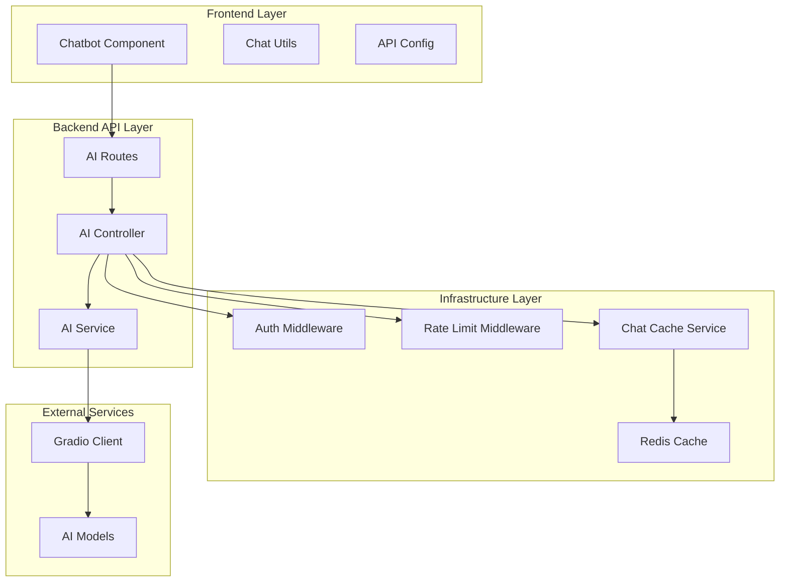
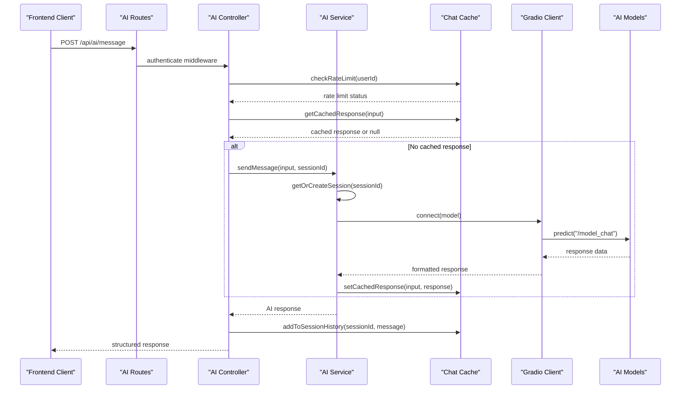
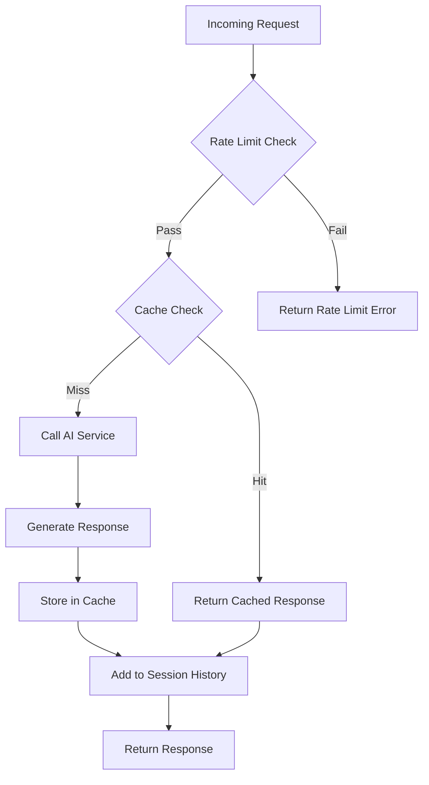
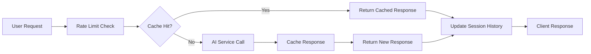

# AI Integration API Documentation

<cite>
**Referenced Files in This Document**
- [ai.routes.ts](file://api-fastify/src/routes/ai.routes.ts)
- [ai.controller.ts](file://api-fastify/src/controllers/ai.controller.ts)
- [ai.service.ts](file://api-fastify/src/services/ai.service.ts)
- [chat-cache.service.ts](file://api-fastify/src/services/chat-cache.service.ts)
- [conversation.types.ts](file://api-fastify/src/types/conversation.types.ts)
- [auth.middleware.ts](file://api-fastify/src/middlewares/auth.middleware.ts)
- [rate-limit.middleware.ts](file://api-fastify/src/middlewares/rate-limit.middleware.ts)
- [Chatbot.tsx](file://src/components/Chatbot.tsx)
- [chatUtils.ts](file://src/lib/chatUtils.ts)
- [ChatTypes.ts](file://src/types/ChatTypes.ts)
- [api.config.ts](file://src/config/api.config.ts)
- [package.json](file://api-fastify/package.json)
</cite>

## Table of Contents
1. [Introduction](#introduction)
2. [Project Structure](#project-structure)
3. [Core Components](#core-components)
4. [Architecture Overview](#architecture-overview)
5. [API Endpoints](#api-endpoints)
6. [Authentication & Security](#authentication--security)
7. [Rate Limiting](#rate-limiting)
8. [Caching Strategy](#caching-strategy)
9. [External AI Service Integration](#external-ai-service-integration)
10. [Client-Side Implementation](#client-side-implementation)
11. [Error Handling](#error-handling)
12. [Security Considerations](#security-considerations)
13. [Performance Optimization](#performance-optimization)
14. [Troubleshooting Guide](#troubleshooting-guide)
15. [Conclusion](#conclusion)

## Introduction

The AI Integration API provides comprehensive chatbot functionality and AI-powered content processing capabilities for the MERN_chatai_blog platform. This system enables users to interact with advanced AI models through a RESTful API, offering real-time conversational AI assistance for blog-related queries and content generation tasks.

The API integrates seamlessly with external AI services via the @gradio/client library, supporting multiple AI models including Qwen/Qwen2-72B-Instruct and Qwen/Qwen1.5-110B-Chat-demo. The system implements sophisticated caching mechanisms, rate limiting, and authentication to ensure optimal performance and security while managing AI usage costs effectively.

## Project Structure

The AI Integration functionality is distributed across multiple layers of the application architecture:



**Diagram sources**
- [ai.routes.ts](file://api-fastify/src/routes/ai.routes.ts#L1-L43)
- [ai.controller.ts](file://api-fastify/src/controllers/ai.controller.ts#L1-L70)
- [ai.service.ts](file://api-fastify/src/services/ai.service.ts#L1-L131)

**Section sources**
- [ai.routes.ts](file://api-fastify/src/routes/ai.routes.ts#L1-L43)
- [Chatbot.tsx](file://src/components/Chatbot.tsx#L1-L355)

## Core Components

### AI Service Layer

The AI Service acts as the central orchestrator for all AI-related operations, managing session state, model selection, and response generation.

```typescript
// Session Management
interface ChatSession {
  messages: IMessage[];
  lastUpdated: Date;
}

// Model Selection Strategy
const models = [
  "Qwen/Qwen2-72B-Instruct",
  "Qwen/Qwen1.5-110B-Chat-demo"
];
```

### Conversation Management

The system maintains conversation state through a sophisticated session management system that tracks message history and ensures contextual continuity.

```typescript
interface IMessage {
  content: string;
  sender: string;
}

interface IConversation {
  messages: IMessage[];
  sessionId: string;
  createdAt: Date;
  updatedAt: Date;
}
```

**Section sources**
- [ai.service.ts](file://api-fastify/src/services/ai.service.ts#L1-L131)
- [conversation.types.ts](file://api-fastify/src/types/conversation.types.ts#L1-L18)

## Architecture Overview

The AI Integration API follows a layered architecture pattern with clear separation of concerns:



**Diagram sources**
- [ai.routes.ts](file://api-fastify/src/routes/ai.routes.ts#L10-L25)
- [ai.controller.ts](file://api-fastify/src/controllers/ai.controller.ts#L15-L65)
- [ai.service.ts](file://api-fastify/src/services/ai.service.ts#L75-L130)

## API Endpoints

### POST /api/ai/message

**Description**: Sends a message to the AI and receives a response with conversation context.

**Authentication**: Required (JWT Token)

**Rate Limiting**: 10 messages per minute per user

**Request Body**:
```json
{
  "input": "string",
  "sessionId": "string"
}
```

**Response**:
```json
{
  "response": "string",
  "sessionId": "string",
  "success": true,
  "error": "string"
}
```

**Example Request**:
```javascript
fetch('/api/ai/message', {
  method: 'POST',
  headers: {
    'Content-Type': 'application/json',
    'Authorization': 'Bearer YOUR_JWT_TOKEN'
  },
  body: JSON.stringify({
    input: "How to write a good blog post?",
    sessionId: "unique-session-id"
  })
})
```

**Example Response**:
```json
{
  "response": "Writing a good blog post involves several key steps...",
  "sessionId": "unique-session-id",
  "success": true
}
```

### GET /api/ai/test

**Description**: Health check endpoint to verify AI service availability.

**Authentication**: Not required

**Response**:
```json
{
  "message": "Service d'IA fonctionnel",
  "endpoints": {
    "message": "/api/ai/message"
  },
  "usage": "Envoyez une requête POST à /api/ai/message avec un corps JSON contenant \"input\" et \"sessionId\""
}
```

**Section sources**
- [ai.routes.ts](file://api-fastify/src/routes/ai.routes.ts#L1-L43)
- [ai.controller.ts](file://api-fastify/src/controllers/ai.controller.ts#L15-L65)

## Authentication & Security

### JWT Authentication

The AI endpoints require JWT authentication through the `authenticate` middleware:

```typescript
export const authenticate = async (request: FastifyRequest, reply: FastifyReply) => {
  try {
    // Verify JWT token from cookies or Authorization header
    await request.jwtVerify();
    console.log('Utilisateur authentifié:', request.user);
  } catch (error) {
    reply.status(401).send({
      message: 'Non autorisé - Veuillez vous connecter',
      error: error instanceof Error ? error.message : 'Erreur inconnue'
    });
  }
};
```

### User Context

The authentication system extracts user information from the verified JWT token:

```typescript
const userId = (request as any).user?.id;
```

**Security Features**:
- JWT token verification
- Automatic token refresh support
- User ID extraction for rate limiting
- Session isolation per user

**Section sources**
- [auth.middleware.ts](file://api-fastify/src/middlewares/auth.middleware.ts#L10-L40)

## Rate Limiting

### Per-User Rate Limiting

The system implements intelligent rate limiting to control AI usage costs and prevent abuse:

```typescript
// Chat-specific rate limiting
async checkRateLimit(userId: string): Promise<boolean> {
  const key = `chat:rate:${userId}`;
  const count = await cache.get<number>(key) || 0;
  
  if (count >= 10) return false; // Max 10 messages/minute
  
  await cache.set(key, count + 1, 60); // 1 minute
  return true;
}
```

### Generic Rate Limiting Middleware

A reusable rate limiting mechanism supports various use cases:

```typescript
interface RateLimitOptions {
  windowMs: number;     // Time window in milliseconds
  maxRequests: number;  // Maximum requests per window
  keyGenerator?: (request: FastifyRequest) => string;
}

export function createRateLimitMiddleware(options: RateLimitOptions) {
  // Implementation with Redis caching
}
```

**Rate Limiting Policies**:
- **Chat Endpoint**: 10 messages per minute per user
- **Generic Rate Limiting**: Configurable policies for different endpoints
- **Redis Integration**: Persistent rate limit tracking
- **HTTP Headers**: X-RateLimit-* headers for client awareness

**Section sources**
- [rate-limit.middleware.ts](file://api-fastify/src/middlewares/rate-limit.middleware.ts#L1-L92)
- [chat-cache.service.ts](file://api-fastify/src/services/chat-cache.service.ts#L25-L35)

## Caching Strategy

### Multi-Level Caching

The AI Integration employs a sophisticated caching strategy to optimize performance and reduce AI service costs:



**Diagram sources**
- [ai.controller.ts](file://api-fastify/src/controllers/ai.controller.ts#L25-L50)
- [chat-cache.service.ts](file://api-fastify/src/services/chat-cache.service.ts#L1-L47)

### Cache Implementation

```typescript
// Response caching for identical queries
async getCachedResponse(input: string): Promise<string | null> {
  const key = `chat:response:${this.hashInput(input)}`;
  return await cache.get(key);
}

async setCachedResponse(input: string, response: string): Promise<void> {
  const key = `chat:response:${this.hashInput(input)}`;
  await cache.set(key, response, 3600); // 1 hour TTL
}

// Session history caching
async addToSessionHistory(sessionId: string, message: any): Promise<void> {
  const key = `chat:session:${sessionId}`;
  const history = await this.getSessionHistory(sessionId);
  history.push(message);
  
  // Keep only last 20 messages
  const trimmed = history.slice(-20);
  await cache.set(key, trimmed, 7200); // 2 hours TTL
}
```

**Cache Benefits**:
- **Reduced API Costs**: Avoid redundant AI model calls
- **Improved Performance**: Faster response times for repeated queries
- **Session Persistence**: Maintain conversation context across requests
- **Memory Efficiency**: Automatic cleanup of expired sessions

**Section sources**
- [chat-cache.service.ts](file://api-fastify/src/services/chat-cache.service.ts#L1-L47)

## External AI Service Integration

### Gradio Client Integration

The system integrates with external AI services through the @gradio/client library:

```typescript
// Model connection and prediction
const client = await Client.connect(model);
const result = await client.predict("/model_chat", {
  query: lastUserMessage,
  history: history,
  system: process.env.QWEN_PROMPT || "Tu es un assistant utile et amical..."
});
```

### Model Selection Strategy

```typescript
const models = [
  "Qwen/Qwen2-72B-Instruct",
  "Qwen/Qwen1.5-110B-Chat-demo"
];

// Failover mechanism for model availability
for (const model of models) {
  try {
    const client = await Client.connect(model);
    // Process with model...
  } catch (error) {
    if (model === models[models.length - 1]) {
      throw error; // Last model failed
    }
    console.log(`Essai avec le modèle suivant...`);
  }
}
```

### Environment Configuration

Required environment variables:
- `QWEN_PROMPT`: System prompt for AI behavior
- AI service credentials (via Gradio client)

**Integration Features**:
- **Multiple Model Support**: Automatic failover between AI models
- **Configurable Prompts**: Environment-specific system prompts
- **Connection Management**: Robust error handling for service outages
- **Response Processing**: Structured data extraction from AI responses

**Section sources**
- [ai.service.ts](file://api-fastify/src/services/ai.service.ts#L35-L85)
- [package.json](file://api-fastify/package.json#L25-L26)

## Client-Side Implementation

### Frontend Chatbot Component

The frontend implements a sophisticated chat interface with real-time communication:

```typescript
// Session management
const [sessionId, setSessionId] = useState<string>(() => {
  const storedSessionId = localStorage.getItem("chatSessionId");
  return storedSessionId || nanoid();
});

// Message handling
const handleSend = async () => {
  if (!userInfo) {
    setError("Vous devez être connecté pour utiliser le chat.");
    return;
  }

  const newUserMessage: ChatMessage = {
    id: nanoid(),
    text: input,
    sender: "user",
    timestamp: new Date()
  };

  setMessages(prev => [...prev, newUserMessage]);
  
  try {
    const response = await fetch(apiEndpoint, {
      method: "POST",
      headers: { "Content-Type": "application/json" },
      body: JSON.stringify({ input, sessionId }),
      credentials: "include"
    });

    // Process AI response...
  } catch (error) {
    setError(error instanceof Error ? error.message : "Erreur inconnue");
  }
};
```

### Message Formatting

The frontend applies sophisticated formatting to AI responses:

```typescript
export function formatChatMessage(text: string): string {
  return text
    .replace(/\*\*(.*?)\*\*/g, "<strong>$1</strong>") // Bold
    .replace(/\*(.*?)\*/g, "<em>$1</em>") // Italic
    .replace(/`(.*?)`/g, "<code>$1</code>") // Inline code
    .replace(/\[(.*?)\]\((.*?)\)/g, "<a href='$2' target='_blank'>$1</a>") // Links
    .replace(/\n/g, "<br />"); // Line breaks
}
```

**Client Features**:
- **Real-time Communication**: WebSocket-like experience with REST API
- **Local Storage**: Persistent chat history and session management
- **Rich Text Rendering**: Markdown-like formatting support
- **Authentication Integration**: Seamless JWT token handling
- **Error Handling**: Comprehensive error display and recovery

**Section sources**
- [Chatbot.tsx](file://src/components/Chatbot.tsx#L1-L355)
- [chatUtils.ts](file://src/lib/chatUtils.ts#L1-L70)

## Error Handling

### Backend Error Management

The AI controller implements comprehensive error handling:

```typescript
try {
  // AI processing logic...
} catch (error) {
  request.log.error(error);
  return reply.status(500).send({
    message: 'Une erreur est survenue lors de l\'envoi du message',
    success: false,
    error: error instanceof Error ? error.message : 'Erreur inconnue'
  });
}
```

### Graceful Degradation

The AI service implements graceful degradation for service failures:

```typescript
catch (error) {
  console.error('Erreur lors de l\'envoi du message à l\'IA:', error);
  
  // Fallback response for AI service unavailability
  return 'Désolé, je rencontre des difficultés à traiter votre demande pour le moment. Veuillez réessayer plus tard.';
}
```

### Client-Side Error Handling

```typescript
// Authentication errors
if (response.status === 401) {
  throw new Error("Vous devez être connecté pour utiliser le chat.");
}

// General server errors
if (!response.ok) {
  throw new Error(`Erreur serveur: ${response.status}`);
}

// AI service errors
if (!data.success) {
  throw new Error(data.error || "Erreur lors de la génération de la réponse");
}
```

**Error Categories**:
- **Authentication Errors**: 401 Unauthorized
- **Rate Limiting**: 429 Too Many Requests
- **Server Errors**: 500 Internal Server Error
- **AI Service Errors**: Model unavailability or processing failures
- **Network Errors**: Connection timeouts and failures

**Section sources**
- [ai.controller.ts](file://api-fastify/src/controllers/ai.controller.ts#L55-L65)
- [Chatbot.tsx](file://src/components/Chatbot.tsx#L130-L150)

## Security Considerations

### User Data Privacy

The AI Integration implements several security measures to protect user data:

```typescript
// Session isolation prevents data leakage
private hashInput(input: string): string {
  return Buffer.from(input.toLowerCase().trim()).toString('base64').slice(0, 16);
}

// Rate limiting prevents abuse
if (userId && !(await chatCache.checkRateLimit(userId))) {
  return reply.status(429).send({
    message: 'Trop de requêtes. Attendez une minute.',
    success: false
  });
}
```

### Content Moderation

While not explicitly implemented in the current codebase, the system supports content moderation through:

- **System Prompt Control**: Environment-specific prompts can include moderation guidelines
- **Input Validation**: Basic input sanitization in the frontend
- **Session Isolation**: Separate conversations per user/session

### Cost Management

The system implements multiple strategies to manage AI service costs:

- **Intelligent Caching**: Reduce redundant API calls
- **Rate Limiting**: Control request frequency
- **Model Failover**: Choose cost-effective models
- **Response Truncation**: Limit conversation length

**Security Measures**:
- **JWT Authentication**: Secure user identification
- **Session Isolation**: Prevent cross-user data access
- **Input Sanitization**: Basic protection against injection attacks
- **Rate Limiting**: Prevent abuse and cost escalation
- **Graceful Degradation**: Maintain service availability during failures

**Section sources**
- [chat-cache.service.ts](file://api-fastify/src/services/chat-cache.service.ts#L35-L47)
- [ai.controller.ts](file://api-fastify/src/controllers/ai.controller.ts#L30-L35)

## Performance Optimization

### Caching Strategies

The system employs multiple caching layers for optimal performance:



**Performance Metrics**:
- **Response Time**: Sub-second responses for cached queries
- **Throughput**: Up to 10 messages per minute per user
- **Memory Usage**: Efficient session management with automatic cleanup
- **Cost Reduction**: Significant reduction in AI API calls

### Session Management Optimization

```typescript
// Automatic session cleanup
const cleanupSessions = () => {
  const now = new Date();
  for (const [sessionId, session] of chatSessions.entries()) {
    if (now.getTime() - session.lastUpdated.getTime() > SESSION_TTL) {
      chatSessions.delete(sessionId);
    }
  }
};

// Session TTL: 24 hours
const SESSION_TTL = 24 * 60 * 60 * 1000;
```

### Frontend Performance

The frontend implements several optimizations:

- **Local Storage**: Persistent state without server round-trips
- **Message Truncation**: Limit conversation history to 20 messages
- **Debounced Input**: Prevent excessive API calls during typing
- **Smooth Transitions**: CSS animations for improved UX

**Optimization Features**:
- **Automatic Cleanup**: Expired sessions removed every hour
- **Memory Management**: Limited conversation history per session
- **Efficient Hashing**: Base64 encoding for cache keys
- **Batch Operations**: Group cache updates where possible

**Section sources**
- [ai.service.ts](file://api-fastify/src/services/ai.service.ts#L15-L25)
- [chat-cache.service.ts](file://api-fastify/src/services/chat-cache.service.ts#L10-L20)

## Troubleshooting Guide

### Common Issues and Solutions

#### Authentication Failures

**Problem**: 401 Unauthorized responses
**Causes**:
- Invalid or expired JWT token
- Missing Authorization header
- Token format issues

**Solutions**:
```typescript
// Debug authentication
console.log('Cookies received:', request.cookies);
console.log('Headers received:', request.headers);
console.log('Token verification result:', request.user);
```

#### Rate Limiting Issues

**Problem**: 429 Too Many Requests
**Causes**:
- Exceeded 10 messages per minute limit
- Redis connectivity issues
- Cache key conflicts

**Solutions**:
- Implement exponential backoff in client
- Check Redis connection status
- Verify rate limit key generation

#### AI Service Unavailability

**Problem**: AI responses failing or timing out
**Causes**:
- Gradio client connection issues
- Model unavailability
- Network timeouts

**Solutions**:
```typescript
// Implement retry logic
for (const model of models) {
  try {
    const client = await Client.connect(model);
    // Process with model...
  } catch (error) {
    if (model === models[models.length - 1]) {
      throw error;
    }
    console.log(`Trying next model...`);
  }
}
```

#### Cache Issues

**Problem**: Stale or missing cached responses
**Causes**:
- Redis connectivity problems
- Cache key generation issues
- TTL configuration problems

**Solutions**:
- Monitor Redis health
- Verify cache key uniqueness
- Adjust TTL values as needed

### Debugging Tools

#### Logging Configuration

```typescript
// Enable debug logging
console.log('Session ID:', sessionId);
console.log('User ID:', userId);
console.log('Cache hit/miss:', cacheHit ? 'hit' : 'miss');
console.log('AI model used:', selectedModel);
```

#### Health Checks

```typescript
// Test endpoint
GET /api/ai/test

// Expected response
{
  "message": "Service d'IA fonctionnel",
  "endpoints": {
    "message": "/api/ai/message"
  }
}
```

**Section sources**
- [ai.controller.ts](file://api-fastify/src/controllers/ai.controller.ts#L25-L35)
- [ai.service.ts](file://api-fastify/src/services/ai.service.ts#L85-L95)

## Conclusion

The AI Integration API provides a robust, scalable solution for incorporating conversational AI capabilities into the MERN_chatai_blog platform. Through intelligent caching, rate limiting, and secure authentication, the system delivers high-performance AI interactions while maintaining cost efficiency and user privacy.

Key strengths of the implementation include:

- **Scalable Architecture**: Modular design supporting easy extension
- **Cost Management**: Intelligent caching and rate limiting controls
- **Security**: JWT authentication and session isolation
- **Reliability**: Graceful degradation and model failover
- **Performance**: Multi-level caching and efficient session management

The system successfully balances functionality, performance, and cost considerations, providing a solid foundation for AI-powered features in modern web applications. Future enhancements could include advanced content moderation, additional AI model integrations, and enhanced analytics for usage patterns.