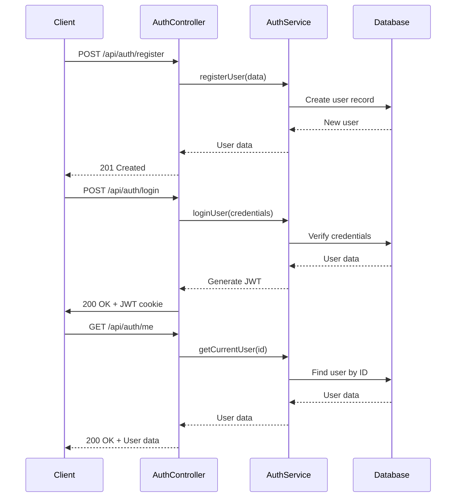
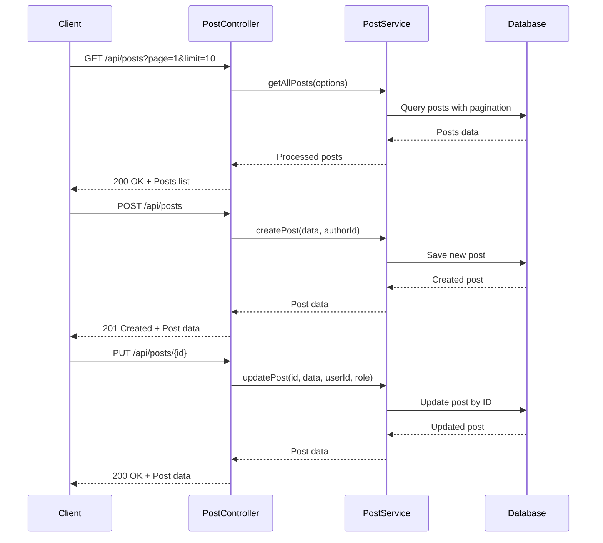

# API Endpoints Reference

<cite>
**Referenced Files in This Document**   
- [server.ts](file://api-fastify/src/server.ts)
- [index.ts](file://api-fastify/src/routes/index.ts)
- [auth.controller.ts](file://api-fastify/src/controllers/auth.controller.ts)
- [auth.routes.ts](file://api-fastify/src/routes/auth.routes.ts)
- [auth.schema.ts](file://api-fastify/src/schemas/auth.schema.ts)
- [post.controller.ts](file://api-fastify/src/controllers/post.controller.ts)
- [post.routes.ts](file://api-fastify/src/routes/post.routes.ts)
- [post.schema.ts](file://api-fastify/src/schemas/post.schema.ts)
- [user.controller.ts](file://api-fastify/src/controllers/user.controller.ts)
- [user.routes.ts](file://api-fastify/src/routes/user.routes.ts)
- [user.schema.ts](file://api-fastify/src/schemas/user.schema.ts)
- [comment.controller.ts](file://api-fastify/src/controllers/comment.controller.ts)
- [comment.routes.ts](file://api-fastify/src/routes/comment.routes.ts)
- [comment.schema.ts](file://api-fastify/src/schemas/comment.schema.ts)
- [category.controller.ts](file://api-fastify/src/controllers/category.controller.ts)
- [category.routes.ts](file://api-fastify/src/routes/category.routes.ts)
- [category.schema.ts](file://api-fastify/src/schemas/category.schema.ts)
- [content.controller.ts](file://api-fastify/src/controllers/content.controller.ts)
- [content.routes.ts](file://api-fastify/src/routes/content.routes.ts)
- [content.schema.ts](file://api-fastify/src/schemas/content.schema.ts)
- [notification.controller.ts](file://api-fastify/src/controllers/notification.controller.ts)
- [notification.routes.ts](file://api-fastify/src/routes/notification.routes.ts)
- [notification.schema.ts](file://api-fastify/src/schemas/notification.schema.ts)
- [upload.controller.ts](file://api-fastify/src/controllers/upload.controller.ts)
- [upload.routes.ts](file://api-fastify/src/routes/upload.routes.ts)
- [ai.controller.ts](file://api-fastify/src/controllers/ai.controller.ts)
- [ai.routes.ts](file://api-fastify/src/routes/ai.routes.ts)
- [ai.schema.ts](file://api-fastify/src/schemas/ai.schema.ts)
- [health.controller.ts](file://api-fastify/src/controllers/health.controller.ts)
- [health.routes.ts](file://api-fastify/src/routes/health.routes.ts)
- [auth.middleware.ts](file://api-fastify/src/middlewares/auth.middleware.ts)
- [rate-limit.middleware.ts](file://api-fastify/src/middlewares/rate-limit.middleware.ts)
- [cache.middleware.ts](file://api-fastify/src/middlewares/cache.middleware.ts)
</cite>

## Table of Contents
1. [Introduction](#introduction)
2. [Base URL and Versioning](#base-url-and-versioning)
3. [Authentication](#authentication)
4. [Posts](#posts)
5. [Users](#users)
6. [Comments](#comments)
7. [Categories](#categories)
8. [Content](#content)
9. [Notifications](#notifications)
10. [Uploads](#uploads)
11. [AI](#ai)
12. [Health](#health)
13. [Security and Middleware](#security-and-middleware)
14. [Client Implementation Guidelines](#client-implementation-guidelines)
15. [Error Handling](#error-handling)
16. [Appendices](#appendices)

## Introduction

This document provides comprehensive reference documentation for the RESTful API endpoints in the MERN_chatai_blog application. The API is built using Fastify and follows REST principles with JSON-based request and response payloads. The endpoints are organized into logical groups including authentication, posts, users, comments, categories, content, notifications, uploads, AI, and health monitoring.

The API uses JWT-based authentication for protected routes, with tokens provided via both HTTP-only cookies and response bodies for client flexibility. Request validation is implemented using Fastify's schema validation system, ensuring data integrity and providing clear error messages for invalid requests.

**Section sources**
- [server.ts](file://api-fastify/src/server.ts#L1-L174)
- [index.ts](file://api-fastify/src/routes/index.ts#L1-L53)

## Base URL and Versioning

The API is accessible at the base URL `/api` with all endpoints prefixed accordingly. The current implementation does not include versioning in the URL path, but backward compatibility is maintained through careful API design and deprecation practices.

The API supports the following base URL patterns:
- Production: `https://iwomi-blog.netlify.app/api`
- Development: `http://localhost:4200/api`

Versioning is managed through careful backward-compatible changes, with major breaking changes requiring a new API version to be implemented in the future. Clients should expect that existing endpoints will maintain their behavior and response formats unless explicitly documented in release notes.

**Section sources**
- [server.ts](file://api-fastify/src/server.ts#L70-L72)
- [index.ts](file://api-fastify/src/routes/index.ts#L15-L50)

## Authentication

The authentication system provides endpoints for user registration, login, password management, and session handling. All authentication endpoints are accessible under the `/api/auth` prefix.



**Diagram sources**
- [auth.controller.ts](file://api-fastify/src/controllers/auth.controller.ts#L1-L330)
- [auth.routes.ts](file://api-fastify/src/routes/auth.routes.ts#L1-L73)

### Register User
- **HTTP Method**: POST
- **URL**: `/api/auth/register`
- **Authentication Required**: No
- **Rate Limiting**: Yes

#### Request Parameters
| Parameter | Type | Required | Description |
|---------|------|----------|-------------|
| username | string | Yes | User's chosen username (3-30 characters) |
| email | string | Yes | User's email address |
| password | string | Yes | User's password (minimum 6 characters) |
| firstName | string | No | User's first name |
| lastName | string | No | User's last name |

#### Request Body Example
```json
{
  "username": "johndoe",
  "email": "john@example.com",
  "password": "password123",
  "firstName": "John",
  "lastName": "Doe"
}
```

#### Response Format (201 Created)
```json
{
  "message": "Registration successful. Please verify your email to activate your account.",
  "user": {
    "_id": "60d5ecf1f1f2f3f4f5f6f7f8",
    "username": "johndoe",
    "email": "john@example.com",
    "firstName": "John",
    "lastName": "Doe",
    "role": "USER",
    "isVerified": false,
    "createdAt": "2023-06-15T10:30:00.000Z",
    "updatedAt": "2023-06-15T10:30:00.000Z"
  }
}
```

#### Error Responses
| Status Code | Error Message | Description |
|------------|---------------|-------------|
| 400 | "Email already in use" | Email address is already registered |
| 400 | "Username already in use" | Username is already taken |
| 400 | "Invalid email format" | Email address is not valid |
| 400 | "Password must be at least 6 characters" | Password too short |
| 500 | "An error occurred during registration" | Internal server error |

**Section sources**
- [auth.controller.ts](file://api-fastify/src/controllers/auth.controller.ts#L15-L52)
- [auth.routes.ts](file://api-fastify/src/routes/auth.routes.ts#L10-L12)
- [auth.schema.ts](file://api-fastify/src/schemas/auth.schema.ts#L45-L80)

### Login User
- **HTTP Method**: POST
- **URL**: `/api/auth/login`
- **Authentication Required**: No
- **Rate Limiting**: Yes

#### Request Parameters
| Parameter | Type | Required | Description |
|---------|------|----------|-------------|
| email | string | Yes | User's email address |
| password | string | Yes | User's password |

#### Request Body Example
```json
{
  "email": "john@example.com",
  "password": "password123"
}
```

#### Response Format (200 OK)
```json
{
  "token": "eyJhbGciOiJIUzI1NiIsInR5cCI6IkpXVCJ9.xxxxx",
  "user": {
    "_id": "60d5ecf1f1f2f3f4f5f6f7f8",
    "username": "johndoe",
    "email": "john@example.com",
    "firstName": "John",
    "lastName": "Doe",
    "profilePicture": "https://example.com/avatar.jpg",
    "bio": "Tech enthusiast",
    "role": "AUTHOR",
    "isVerified": true,
    "createdAt": "2023-06-15T10:30:00.000Z",
    "updatedAt": "2023-06-15T10:30:00.000Z"
  }
}
```

The response includes both a JWT token in the response body and sets an HTTP-only cookie named "token" for added security. The cookie is configured with secure flag in production, sameSite=lax, and a 30-day expiration.

#### Error Responses
| Status Code | Error Message | Description |
|------------|---------------|-------------|
| 401 | "Invalid email or password" | Credentials are incorrect |
| 400 | "Invalid email format" | Email address is not valid |
| 400 | "User account not verified" | Email not verified yet |
| 500 | "An error occurred during login" | Internal server error |

**Section sources**
- [auth.controller.ts](file://api-fastify/src/controllers/auth.controller.ts#L54-L108)
- [auth.routes.ts](file://api-fastify/src/routes/auth.routes.ts#L14-L16)
- [auth.schema.ts](file://api-fastify/src/schemas/auth.schema.ts#L5-L40)

### Logout User
- **HTTP Method**: POST
- **URL**: `/api/auth/logout`
- **Authentication Required**: Yes
- **Rate Limiting**: No

#### Request Parameters
None

#### Request Headers
| Header | Value | Required |
|--------|-------|----------|
| Authorization | Bearer <token> | Yes (if not using cookie) |

#### Response Format (200 OK)
```json
{
  "message": "Logout successful"
}
```

The logout endpoint clears the JWT cookie and invalidates the session on the client side.

#### Error Responses
| Status Code | Error Message | Description |
|------------|---------------|-------------|
| 500 | "An error occurred during logout" | Internal server error |

**Section sources**
- [auth.controller.ts](file://api-fastify/src/controllers/auth.controller.ts#L288-L314)
- [auth.routes.ts](file://api-fastify/src/routes/auth.routes.ts#L18-L20)

### Get Current User
- **HTTP Method**: GET
- **URL**: `/api/auth/me`
- **Authentication Required**: Yes
- **Rate Limiting**: Yes

#### Request Parameters
None

#### Request Headers
| Header | Value | Required |
|--------|-------|----------|
| Authorization | Bearer <token> | Yes (if not using cookie) |

#### Response Format (200 OK)
```json
{
  "user": {
    "_id": "60d5ecf1f1f2f3f4f5f6f7f8",
    "username": "johndoe",
    "email": "john@example.com",
    "firstName": "John",
    "lastName": "Doe",
    "profilePicture": "https://example.com/avatar.jpg",
    "bio": "Tech enthusiast",
    "role": "AUTHOR",
    "isVerified": true,
    "createdAt": "2023-06-15T10:30:00.000Z",
    "updatedAt": "2023-06-15T10:30:00.000Z"
  }
}
```

#### Error Responses
| Status Code | Error Message | Description |
|------------|---------------|-------------|
| 404 | "User not found" | User ID from token not found |
| 401 | "Authentication token missing" | No token provided |
| 401 | "Token expired" | JWT token has expired |
| 500 | "An error occurred retrieving user information" | Internal server error |

**Section sources**
- [auth.controller.ts](file://api-fastify/src/controllers/auth.controller.ts#L232-L258)
- [auth.routes.ts](file://api-fastify/src/routes/auth.routes.ts#L52-L58)

### Check Admin Privileges
- **HTTP Method**: GET
- **URL**: `/api/auth/check-admin`
- **Authentication Required**: Yes
- **Rate Limiting**: Yes

#### Request Parameters
None

#### Request Headers
| Header | Value | Required |
|--------|-------|----------|
| Authorization | Bearer <token> | Yes (if not using cookie) |

#### Response Format (200 OK)
```json
{
  "isAdmin": true
}
```

#### Error Responses
| Status Code | Error Message | Description |
|------------|---------------|-------------|
| 500 | "An error occurred checking admin privileges" | Internal server error |

**Section sources**
- [auth.controller.ts](file://api-fastify/src/controllers/auth.controller.ts#L274-L286)
- [auth.routes.ts](file://api-fastify/src/routes/auth.routes.ts#L60-L66)

### Forgot Password
- **HTTP Method**: POST
- **URL**: `/api/auth/forgot-password`
- **Authentication Required**: No
- **Rate Limiting**: Yes

#### Request Parameters
| Parameter | Type | Required | Description |
|---------|------|----------|-------------|
| email | string | Yes | User's email address |

#### Request Body Example
```json
{
  "email": "john@example.com"
}
```

#### Response Format (200 OK)
```json
{
  "message": "If an account exists with this email, a reset link has been sent."
}
```

For security reasons, the response is the same regardless of whether the email exists in the system.

#### Error Responses
| Status Code | Error Message | Description |
|------------|---------------|-------------|
| 500 | "An error occurred requesting password reset" | Internal server error |

**Section sources**
- [auth.controller.ts](file://api-fastify/src/controllers/auth.controller.ts#L136-L163)
- [auth.routes.ts](file://api-fastify/src/routes/auth.routes.ts#L26-L28)
- [auth.schema.ts](file://api-fastify/src/schemas/auth.schema.ts#L125-L150)

### Reset Password
- **HTTP Method**: POST
- **URL**: `/api/auth/reset-password`
- **Authentication Required**: No
- **Rate Limiting**: Yes

#### Request Parameters
| Parameter | Type | Required | Description |
|---------|------|----------|-------------|
| token | string | Yes | Password reset token from email |
| password | string | Yes | New password (minimum 6 characters) |

#### Request Body Example
```json
{
  "token": "reset-token-from-email",
  "password": "newpassword123"
}
```

#### Response Format (200 OK)
```json
{
  "message": "Password reset successfully. You can now log in."
}
```

#### Error Responses
| Status Code | Error Message | Description |
|------------|---------------|-------------|
| 400 | "Invalid or expired reset token" | Token is invalid or has expired |
| 400 | "Password must be at least 6 characters" | Password too short |
| 500 | "An error occurred resetting password" | Internal server error |

**Section sources**
- [auth.controller.ts](file://api-fastify/src/controllers/auth.controller.ts#L165-L195)
- [auth.routes.ts](file://api-fastify/src/routes/auth.routes.ts#L30-L32)
- [auth.schema.ts](file://api-fastify/src/schemas/auth.schema.ts#L155-L185)

### Change Password
- **HTTP Method**: POST
- **URL**: `/api/auth/change-password`
- **Authentication Required**: Yes
- **Rate Limiting**: Yes

#### Request Parameters
| Parameter | Type | Required | Description |
|---------|------|----------|-------------|
| currentPassword | string | Yes | User's current password |
| newPassword | string | Yes | New password (minimum 6 characters) |

#### Request Body Example
```json
{
  "currentPassword": "oldpassword123",
  "newPassword": "newpassword123"
}
```

#### Response Format (200 OK)
```json
{
  "message": "Password changed successfully"
}
```

#### Error Responses
| Status Code | Error Message | Description |
|------------|---------------|-------------|
| 401 | "Current password is incorrect" | Current password doesn't match |
| 400 | "New password must be at least 6 characters" | New password too short |
| 404 | "User not found" | User ID from token not found |
| 500 | "An error occurred changing password" | Internal server error |

**Section sources**
- [auth.controller.ts](file://api-fastify/src/controllers/auth.controller.ts#L197-L230)
- [auth.routes.ts](file://api-fastify/src/routes/auth.routes.ts#L34-L42)
- [auth.schema.ts](file://api-fastify/src/schemas/auth.schema.ts#L190-L213)

## Posts

The posts endpoints provide CRUD operations for blog posts, including creation, retrieval, updating, deletion, and interaction features like liking and disliking. All post endpoints are accessible under the `/api/posts` prefix.



**Diagram sources**
- [post.controller.ts](file://api-fastify/src/controllers/post.controller.ts#L1-L483)
- [post.routes.ts](file://api-fastify/src/routes/post.routes.ts#L1-L126)

### Get All Posts
- **HTTP Method**: GET
- **URL**: `/api/posts`
- **Authentication Required**: Optional
- **Rate Limiting**: Yes
- **Cache**: 10 minutes

#### Query Parameters
| Parameter | Type | Required | Description | Default |
|---------|------|----------|-------------|---------|
| page | number | No | Page number for pagination | 1 |
| limit | number | No | Number of posts per page (max 50) | 10 |
| search | string | No | Search term for title and content | "" |
| category | string | No | Filter by category ID or slug | "" |
| tag | string | No | Filter by tag | "" |
| author | string | No | Filter by author ID | "" |
| status | string | No | Filter by post status (published, draft, archived) | "" |

#### Response Format (200 OK)
```json
{
  "posts": [
    {
      "_id": "60d5ecf1f1f2f3f4f5f6f7f8",
      "title": "Getting Started with React",
      "slug": "getting-started-with-react",
      "content": "React is a popular JavaScript library...",
      "contentBlocks": [
        {
          "type": "paragraph",
          "content": "React is a popular JavaScript library..."
        }
      ],
      "excerpt": "Learn the basics of React development",
      "featuredImage": "https://example.com/react.jpg",
      "status": "published",
      "author": {
        "_id": "60d5ecf1f1f2f3f4f5f6f7f9",
        "username": "johndoe",
        "profilePicture": "https://example.com/avatar.jpg"
      },
      "categories": [
        {
          "_id": "60d5ecf1f1f2f3f4f5f6f7fa",
          "name": "JavaScript",
          "slug": "javascript"
        }
      ],
      "tags": ["react", "javascript", "frontend"],
      "publishedAt": "2023-06-15T10:30:00.000Z",
      "views": 150,
      "likes": ["60d5ecf1f1f2f3f4f5f6f7fb"],
      "dislikes": [],
      "likeCount": 1,
      "dislikeCount": 0,
      "commentCount": 5,
      "createdAt": "2023-06-15T10:30:00.000Z",
      "updatedAt": "2023-06-15T10:30:00.000Z"
    }
  ],
  "total": 25,
  "page": 1,
  "pages": 3,
  "limit": 10
}
```

#### Error Responses
| Status Code | Error Message | Description |
|------------|---------------|-------------|
| 500 | "An error occurred retrieving posts" | Internal server error |

**Section sources**
- [post.controller.ts](file://api-fastify/src/controllers/post.controller.ts#L54-L95)
- [post.routes.ts](file://api-fastify/src/routes/post.routes.ts#L10-L20)
- [post.schema.ts](file://api-fastify/src/schemas/post.schema.ts#L5-L50)

### Get Post by ID or Slug
- **HTTP Method**: GET
- **URL**: `/api/posts/{idOrSlug}`
- **Authentication Required**: Optional
- **Rate Limiting**: Yes
- **Cache**: 5 minutes

#### Path Parameters
| Parameter | Type | Required | Description |
|---------|------|----------|-------------|
| idOrSlug | string | Yes | Post ID or slug |

#### Response Format (200 OK)
```json
{
  "post": {
    "_id": "60d5ecf1f1f2f3f4f5f6f7f8",
    "title": "Getting Started with React",
    "slug": "getting-started-with-react",
    "content": "React is a popular JavaScript library...",
    "contentBlocks": [
      {
        "type": "paragraph",
        "content": "React is a popular JavaScript library..."
      }
    ],
    "excerpt": "Learn the basics of React development",
    "featuredImage": "https://example.com/react.jpg",
    "status": "published",
    "author": {
      "_id": "60d5ecf1f1f2f3f4f5f6f7f9",
      "username": "johndoe",
      "profilePicture": "https://example.com/avatar.jpg"
    },
    "categories": [
      {
        "_id": "60d5ecf1f1f2f3f4f5f6f7fa",
        "name": "JavaScript",
        "slug": "javascript"
      }
    ],
    "tags": ["react", "javascript", "frontend"],
    "publishedAt": "2023-06-15T10:30:00.000Z",
    "views": 150,
    "likes": ["60d5ecf1f1f2f3f4f5f6f7fb"],
    "dislikes": [],
    "likeCount": 1,
    "dislikeCount": 0,
    "commentCount": 5,
    "createdAt": "2023-06-15T10:30:00.000Z",
    "updatedAt": "2023-06-15T10:30:00.000Z"
  }
}
```

#### Error Responses
| Status Code | Error Message | Description |
|------------|---------------|-------------|
| 404 | "Post not found" | Post with given ID or slug does not exist |
| 500 | "An error occurred retrieving the post" | Internal server error |

**Section sources**
- [post.controller.ts](file://api-fastify/src/controllers/post.controller.ts#L97-L137)
- [post.routes.ts](file://api-fastify/src/routes/post.routes.ts#L22-L32)

### Create Post
- **HTTP Method**: POST
- **URL**: `/api/posts`
- **Authentication Required**: Yes
- **Rate Limiting**: Yes

#### Request Body Parameters
| Parameter | Type | Required | Description |
|---------|------|----------|-------------|
| title | string | Yes | Post title |
| content | string | Yes | Post content in Markdown format |
| contentBlocks | array | No | Array of content blocks for rich text editing |
| excerpt | string | No | Post excerpt |
| featuredImage | string | No | URL of featured image |
| status | string | No | Post status (published, draft, archived) | "draft" |
| categories | array | Yes | Array of category IDs |
| tags | array | No | Array of tags |

#### Request Body Example
```json
{
  "title": "Getting Started with React",
  "content": "React is a popular JavaScript library...",
  "contentBlocks": [
    {
      "type": "paragraph",
      "content": "React is a popular JavaScript library..."
    }
  ],
  "excerpt": "Learn the basics of React development",
  "featuredImage": "https://example.com/react.jpg",
  "status": "published",
  "categories": ["60d5ecf1f1f2f3f4f5f6f7fa"],
  "tags": ["react", "javascript", "frontend"]
}
```

#### Response Format (201 Created)
```json
{
  "message": "Post created successfully",
  "post": {
    "_id": "60d5ecf1f1f2f3f4f5f6f7f8",
    "title": "Getting Started with React",
    "slug": "getting-started-with-react",
    "content": "React is a popular JavaScript library...",
    "contentBlocks": [
      {
        "type": "paragraph",
        "content": "React is a popular JavaScript library..."
      }
    ],
    "excerpt": "Learn the basics of React development",
    "featuredImage": "https://example.com/react.jpg",
    "status": "published",
    "author": {
      "_id": "60d5ecf1f1f2f3f4f5f6f7f9",
      "username": "johndoe",
      "profilePicture": "https://example.com/avatar.jpg"
    },
    "categories": [
      {
        "_id": "60d5ecf1f1f2f3f4f5f6f7fa",
        "name": "JavaScript",
        "slug": "javascript"
      }
    ],
    "tags": ["react", "javascript", "frontend"],
    "publishedAt": "2023-06-15T10:30:00.000Z",
    "views": 0,
    "likes": [],
    "dislikes": [],
    "likeCount": 0,
    "dislikeCount": 0,
    "commentCount": 0,
    "createdAt": "2023-06-15T10:30:00.000Z",
    "updatedAt": "2023-06-15T10:30:00.000Z"
  }
}
```

#### Error Responses
| Status Code | Error Message | Description |
|------------|---------------|-------------|
| 400 | "One or more categories do not exist" | Invalid category IDs provided |
| 403 | "You are not authorized to create a published post" | User role doesn't allow publishing |
| 500 | "An error occurred creating the post" | Internal server error |

**Section sources**
- [post.controller.ts](file://api-fastify/src/controllers/post.controller.ts#L139-L203)
- [post.routes.ts](file://api-fastify/src/routes/post.routes.ts#L34-L42)
- [post.schema.ts](file://api-fastify/src/schemas/post.schema.ts#L55-L100)

### Update Post
- **HTTP Method**: PUT
- **URL**: `/api/posts/{id}`
- **Authentication Required**: Yes
- **Rate Limiting**: Yes

#### Path Parameters
| Parameter | Type | Required | Description |
|---------|------|----------|-------------|
| id | string | Yes | Post ID |

#### Request Body Parameters
Same as Create Post endpoint, but all fields are optional.

#### Request Body Example
```json
{
  "title": "Advanced React Patterns",
  "status": "published"
}
```

#### Response Format (200 OK)
```json
{
  "success": true,
  "message": "Post updated successfully",
  "post": {
    "_id": "60d5ecf1f1f2f3f4f5f6f7f8",
    "title": "Advanced React Patterns",
    "slug": "advanced-react-patterns",
    "content": "React is a popular JavaScript library...",
    "contentBlocks": [
      {
        "type": "paragraph",
        "content": "React is a popular JavaScript library..."
      }
    ],
    "excerpt": "Learn the basics of React development",
    "featuredImage": "https://example.com/react.jpg",
    "status": "published",
    "author": {
      "_id": "60d5ecf1f1f2f3f4f5f6f7f9",
      "username": "johndoe",
      "profilePicture": "https://example.com/avatar.jpg"
    },
    "categories": [
      {
        "_id": "60d5ecf1f1f2f3f4f5f6f7fa",
        "name": "JavaScript",
        "slug": "javascript"
      }
    ],
    "tags": ["react", "javascript", "frontend"],
    "publishedAt": "2023-06-15T10:30:00.000Z",
    "views": 0,
    "likes": [],
    "dislikes": [],
    "likeCount": 0,
    "dislikeCount": 0,
    "commentCount": 0,
    "createdAt": "2023-06-15T10:30:00.000Z",
    "updatedAt": "2023-06-15T11:45:00.000Z"
  }
}
```

#### Error Responses
| Status Code | Error Message | Description |
|------------|---------------|-------------|
| 400 | "Invalid post ID" | Post ID is not a valid ObjectId |
| 404 | "Post not found" | Post with given ID does not exist |
| 403 | "You are not authorized to update this post" | User is not the author or admin |
| 400 | "One or more categories do not exist" | Invalid category IDs provided |
| 500 | "An error occurred updating the post" | Internal server error |

**Section sources**
- [post.controller.ts](file://api-fastify/src/controllers/post.controller.ts#L205-L298)
- [post.routes.ts](file://api-fastify/src/routes/post.routes.ts#L44-L52)

### Delete Post
- **HTTP Method**: DELETE
- **URL**: `/api/posts/{id}`
- **Authentication Required**: Yes
- **Rate Limiting**: Yes

#### Path Parameters
| Parameter | Type | Required | Description |
|---------|------|----------|-------------|
| id | string | Yes | Post ID |

#### Request Body Parameters
| Parameter | Type | Required | Description | Default |
|---------|------|----------|-------------|---------|
| soft | boolean | No | Whether to perform soft delete | true |

#### Response Format (200 OK)
```json
{
  "message": "Post deleted successfully",
  "data": {
    "soft": true,
    "deletedAt": "2023-06-15T12:30:00.000Z"
  }
}
```

For soft deletes, the post is marked as deleted but remains in the database. For hard deletes (soft=false), the post is permanently removed.

#### Error Responses
| Status Code | Error Message | Description |
|------------|---------------|-------------|
| 400 | "Invalid post ID" | Post ID is not a valid ObjectId |
| 404 | "Post not found" | Post with given ID does not exist |
| 403 | "You are not authorized to delete this post" | User is not the author or admin |
| 403 | "Only administrators can permanently delete a post" | User is not admin but requested hard delete |
| 409 | "Post already deleted" | Post has already been soft-deleted |
| 500 | "An error occurred deleting the post" | Internal server error |

**Section sources**
- [post.controller.ts](file://api-fastify/src/controllers/post.controller.ts#L300-L362)
- [post.routes.ts](file://api-fastify/src/routes/post.routes.ts#L54-L62)

### Like Post
- **HTTP Method**: POST
- **URL**: `/api/posts/{id}/like`
- **Authentication Required**: Yes
- **Rate Limiting**: Yes

#### Path Parameters
| Parameter | Type | Required | Description |
|---------|------|----------|-------------|
| id | string | Yes | Post ID |

#### Response Format (200 OK)
```json
{
  "message": "Post liked successfully",
  "likes": ["60d5ecf1f1f2f3f4f5f6f7fb"],
  "dislikes": [],
  "likeCount": 1,
  "dislikeCount": 0,
  "isLiked": true,
  "isDisliked": false
}
```

#### Error Responses
| Status Code | Error Message | Description |
|------------|---------------|-------------|
| 400 | "Invalid post ID" | Post ID is not a valid ObjectId |
| 404 | "Post not found" | Post with given ID does not exist |
| 400 | "You have already liked this post" | User has already liked the post |
| 500 | "An error occurred liking the post" | Internal server error |

**Section sources**
- [post.controller.ts](file://api-fastify/src/controllers/post.controller.ts#L364-L404)
- [post.routes.ts](file://api-fastify/src/routes/post.routes.ts#L64-L72)

### Unlike Post
- **HTTP Method**: POST
- **URL**: `/api/posts/{id}/unlike`
- **Authentication Required**: Yes
- **Rate Limiting**: Yes

#### Path Parameters
| Parameter | Type | Required | Description |
|---------|------|----------|-------------|
| id | string | Yes | Post ID |

#### Response Format (200 OK)
```json
{
  "message": "Post unliked successfully",
  "likes": [],
  "dislikes": [],
  "likeCount": 0,
  "dislikeCount": 0,
  "isLiked": false,
  "isDisliked": false
}
```

#### Error Responses
| Status Code | Error Message | Description |
|------------|---------------|-------------|
| 400 | "Invalid post ID" | Post ID is not a valid ObjectId |
| 404 | "Post not found" | Post with given ID does not exist |
| 400 | "You have not liked this post" | User has not liked the post |
| 500 | "An error occurred unliking the post" | Internal server error |

**Section sources**
- [post.controller.ts](file://api-fastify/src/controllers/post.controller.ts#L406-L446)
- [post.routes.ts](file://api-fastify/src/routes/post.routes.ts#L74-L82)

### Dislike Post
- **HTTP Method**: POST
- **URL**: `/api/posts/{id}/dislike`
- **Authentication Required**: Yes
- **Rate Limiting**: Yes

#### Path Parameters
| Parameter | Type | Required | Description |
|---------|------|----------|-------------|
| id | string | Yes | Post ID |

#### Response Format (200 OK)
```json
{
  "message": "Post disliked successfully",
  "likes": [],
  "dislikes": ["60d5ecf1f1f2f3f4f5f6f7fb"],
  "likeCount": 0,
  "dislikeCount": 1,
  "isLiked": false,
  "isDisliked": true
}
```

#### Error Responses
| Status Code | Error Message | Description |
|------------|---------------|-------------|
| 400 | "Invalid post ID" | Post ID is not a valid ObjectId |
| 404 | "Post not found" | Post with given ID does not exist |
| 400 | "You have already disliked this post" | User has already disliked the post |
| 500 | "An error occurred disliking the post" | Internal server error |

**Section sources**
- [post.controller.ts](file://api-fastify/src/controllers/post.controller.ts#L448-L483)
- [post.routes.ts](file://api-fastify/src/routes/post.routes.ts#L84-L92)

## Users

The users endpoints provide functionality for user management, including retrieving user lists, getting individual user information, and updating user profiles. All user endpoints are accessible under the `/api/users` prefix.

### Get All Users
- **HTTP Method**: GET
- **URL**: `/api/users`
- **Authentication Required**: Yes
- **Rate Limiting**: Yes

#### Query Parameters
| Parameter | Type | Required | Description | Default |
|---------|------|----------|-------------|---------|
| page | number | No | Page number for pagination | 1 |
| limit | number | No | Number of users per page (max 50) | 10 |
| search | string | No | Search term for username, email, or name | "" |

#### Response Format (200 OK)
```json
{
  "users": [
    {
      "_id": "60d5ecf1f1f2f3f4f5f6f7f8",
      "username": "johndoe",
      "email": "john@example.com",
      "firstName": "John",
      "lastName": "Doe",
      "profilePicture": "https://example.com/avatar.jpg",
      "bio": "Tech enthusiast",
      "role": "AUTHOR",
      "isVerified": true,
      "postCount": 15,
      "commentCount": 42,
      "createdAt": "2023-06-15T10:30:00.000Z",
      "updatedAt": "2023-06-15T10:30:00.000Z"
    }
  ],
  "total": 25,
  "page": 1,
  "pages": 3,
  "limit": 10
}
```

#### Error Responses
| Status Code | Error Message | Description |
|------------|---------------|-------------|
| 500 | "An error occurred retrieving users" | Internal server error |

**Section sources**
- [user.controller.ts](file://api-fastify/src/controllers/user.controller.ts#L10-L40)
- [user.routes.ts](file://api-fastify/src/routes/user.routes.ts#L10-L18)

### Get User by ID
- **HTTP Method**: GET
- **URL**: `/api/users/{id}`
- **Authentication Required**: Yes
- **Rate Limiting**: Yes

#### Path Parameters
| Parameter | Type | Required | Description |
|---------|------|----------|-------------|
| id | string | Yes | User ID |

#### Response Format (200 OK)
```json
{
  "user": {
    "_id": "60d5ecf1f1f2f3f4f5f6f7f8",
    "username": "johndoe",
    "email": "john@example.com",
    "firstName": "John",
    "lastName": "Doe",
    "profilePicture": "https://example.com/avatar.jpg",
    "bio": "Tech enthusiast",
    "role": "AUTHOR",
    "isVerified": true,
    "postCount": 15,
    "commentCount": 42,
    "createdAt": "2023-06-15T10:30:00.000Z",
    "updatedAt": "2023-06-15T10:30:00.000Z"
  }
}
```

#### Error Responses
| Status Code | Error Message | Description |
|------------|---------------|-------------|
| 400 | "Invalid user ID" | User ID is not a valid ObjectId |
| 404 | "User not found" | User with given ID does not exist |
| 500 | "An error occurred retrieving the user" | Internal server error |

**Section sources**
- [user.controller.ts](file://api-fastify/src/controllers/user.controller.ts#L42-L77)
- [user.routes.ts](file://api-fastify/src/routes/user.routes.ts#L20-L28)

### Update User
- **HTTP Method**: PUT
- **URL**: `/api/users/{id}`
- **Authentication Required**: Yes
- **Rate Limiting**: Yes

#### Path Parameters
| Parameter | Type | Required | Description |
|---------|------|----------|-------------|
| id | string | Yes | User ID |

#### Request Body Parameters
| Parameter | Type | Required | Description |
|---------|------|----------|-------------|
| username | string | No | User's username |
| email | string | No | User's email address |
| firstName | string | No | User's first name |
| lastName | string | No | User's last name |
| bio | string | No | User's bio |
| profilePicture | string | No | URL of profile picture |

#### Request Body Example
```json
{
  "firstName": "John",
  "lastName": "Smith",
  "bio": "Senior developer and tech writer"
}
```

#### Response Format (200 OK)
```json
{
  "message": "User updated successfully",
  "user": {
    "_id": "60d5ecf1f1f2f3f4f5f6f7f8",
    "username": "johndoe",
    "email": "john@example.com",
    "firstName": "John",
    "lastName": "Smith",
    "profilePicture": "https://example.com/avatar.jpg",
    "bio": "Senior developer and tech writer",
    "role": "AUTHOR",
    "isVerified": true,
    "postCount": 15,
    "commentCount": 42,
    "createdAt": "2023-06-15T10:30:00.000Z",
    "updatedAt": "2023-06-15T11:45:00.000Z"
  }
}
```

#### Error Responses
| Status Code | Error Message | Description |
|------------|---------------|-------------|
| 400 | "Invalid user ID" | User ID is not a valid ObjectId |
| 404 | "User not found" | User with given ID does not exist |
| 403 | "You are not authorized to update this user" | User is not updating their own profile or an admin |
| 400 | "Email already in use" | Email address is already registered |
| 400 | "Username already in use" | Username is already taken |
| 500 | "An error occurred updating the user" | Internal server error |

**Section sources**
- [user.controller.ts](file://api-fastify/src/controllers/user.controller.ts#L79-L128)
- [user.routes.ts](file://api-fastify/src/routes/user.routes.ts#L30-L38)

### Delete User
- **HTTP Method**: DELETE
- **URL**: `/api/users/{id}`
- **Authentication Required**: Yes
- **Rate Limiting**: Yes

#### Path Parameters
| Parameter | Type | Required | Description |
|---------|------|----------|-------------|
| id | string | Yes | User ID |

#### Response Format (200 OK)
```json
{
  "message": "User deleted successfully"
}
```

#### Error Responses
| Status Code | Error Message | Description |
|------------|---------------|-------------|
| 400 | "Invalid user ID" | User ID is not a valid ObjectId |
| 404 | "User not found" | User with given ID does not exist |
| 403 | "You are not authorized to delete this user" | User is not an admin |
| 400 | "Cannot delete user with existing posts or comments" | User has content that would be orphaned |
| 500 | "An error occurred deleting the user" | Internal server error |

**Section sources**
- [user.controller.ts](file://api-fastify/src/controllers/user.controller.ts#L130-L175)
- [user.routes.ts](file://api-fastify/src/routes/user.routes.ts#L40-L48)

### Change User Role
- **HTTP Method**: PUT
- **URL**: `/api/users/{id}/role`
- **Authentication Required**: Yes
- **Rate Limiting**: Yes

#### Path Parameters
| Parameter | Type | Required | Description |
|---------|------|----------|-------------|
| id | string | Yes | User ID |

#### Request Body Parameters
| Parameter | Type | Required | Description |
|---------|------|----------|-------------|
| role | string | Yes | New role (USER, AUTHOR, EDITOR, ADMIN) |

#### Request Body Example
```json
{
  "role": "ADMIN"
}
```

#### Response Format (200 OK)
```json
{
  "message": "User role changed successfully",
  "user": {
    "_id": "60d5ecf1f1f2f3f4f5f6f7f8",
    "username": "johndoe",
    "email": "john@example.com",
    "firstName": "John",
    "lastName": "Doe",
    "profilePicture": "https://example.com/avatar.jpg",
    "bio": "Tech enthusiast",
    "role": "ADMIN",
    "isVerified": true,
    "postCount": 15,
    "commentCount": 42,
    "createdAt": "2023-06-15T10:30:00.000Z",
    "updatedAt": "2023-06-15T11:45:00.000Z"
  }
}
```

#### Error Responses
| Status Code | Error Message | Description |
|------------|---------------|-------------|
| 400 | "Invalid user ID" | User ID is not a valid ObjectId |
| 404 | "User not found" | User with given ID does not exist |
| 400 | "Invalid role specified" | Role is not one of the allowed values |
| 400 | "Cannot demote administrator" | Attempting to demote an admin without proper authorization |
| 500 | "An error occurred changing user role" | Internal server error |

**Section sources**
- [user.controller.ts](file://api-fastify/src/controllers/user.controller.ts#L177-L222)
- [user.routes.ts](file://api-fastify/src/routes/user.routes.ts#L50-L58)

### Get User Profile
- **HTTP Method**: GET
- **URL**: `/api/users/profile`
- **Authentication Required**: Yes
- **Rate Limiting**: Yes

#### Response Format (200 OK)
```json
{
  "user": {
    "_id": "60d5ecf1f1f2f3f4f5f6f7f8",
    "username": "johndoe",
    "email": "john@example.com",
    "firstName": "John",
    "lastName": "Doe",
    "profilePicture": "https://example.com/avatar.jpg",
    "bio": "Tech enthusiast",
    "role": "AUTHOR",
    "isVerified": true,
    "postCount": 15,
    "commentCount": 42,
    "createdAt": "2023-06-15T10:30:00.000Z",
    "updatedAt": "2023-06-15T10:30:00.000Z"
  }
}
```

#### Error Responses
| Status Code | Error Message | Description |
|------------|---------------|-------------|
| 400 | "Invalid user ID" | User ID from token is not valid |
| 404 | "User not found" | User with given ID does not exist |
| 500 | "An error occurred retrieving user profile" | Internal server error |

**Section sources**
- [user.controller.ts](file://api-fastify/src/controllers/user.controller.ts#L224-L259)
- [user.routes.ts](file://api-fastify/src/routes/user.routes.ts#L60-L66)

### Update User Profile
- **HTTP Method**: PUT
- **URL**: `/api/users/profile`
- **Authentication Required**: Yes
- **Rate Limiting**: Yes

#### Request Body Parameters
Same as Update User endpoint.

#### Response Format (200 OK)
```json
{
  "message": "Profile updated successfully",
  "user": {
    "_id": "60d5ecf1f1f2f3f4f5f6f7f8",
    "username": "johndoe",
    "email": "john@example.com",
    "firstName": "John",
    "lastName": "Smith",
    "profilePicture": "https://example.com/avatar.jpg",
    "bio": "Senior developer and tech writer",
    "role": "AUTHOR",
    "isVerified": true,
    "postCount": 15,
    "commentCount": 42,
    "createdAt": "2023-06-15T10:30:00.000Z",
    "updatedAt": "2023-06-15T11:45:00.000Z"
  }
}
```

#### Error Responses
| Status Code | Error Message | Description |
|------------|---------------|-------------|
| 400 | "Invalid user ID" | User ID from token is not valid |
| 404 | "User not found" | User with given ID does not exist |
| 400 | "Email already in use" | Email address is already registered |
| 400 | "Username already in use" | Username is already taken |
| 500 | "An error occurred updating user profile" | Internal server error |

**Section sources**
- [user.controller.ts](file://api-fastify/src/controllers/user.controller.ts#L261-L305)
- [user.routes.ts](file://api-fastify/src/routes/user.routes.ts#L68-L76)

### Delete Own Account
- **HTTP Method**: DELETE
- **URL**: `/api/users/profile`
- **Authentication Required**: Yes
- **Rate Limiting**: Yes

#### Response Format (200 OK)
```json
{
  "message": "User account deleted successfully"
}
```

#### Error Responses
| Status Code | Error Message | Description |
|------------|---------------|-------------|
| 500 | "An error occurred deleting user account" | Internal server error |

**Section sources**
- [user.controller.ts](file://api-fastify/src/controllers/user.controller.ts#L307-L315)
- [user.routes.ts](file://api-fastify/src/routes/user.routes.ts#L78-L84)

## Comments

The comments endpoints provide functionality for managing comments on blog posts, including creating, retrieving, updating, and deleting comments, as well as liking and disliking comments. All comment endpoints are accessible under the `/api/comments` prefix.

### Get Post Comments
- **HTTP Method**: GET
- **URL**: `/api/comments/{post}`
- **Authentication Required**: Optional
- **Rate Limiting**: Yes

#### Path Parameters
| Parameter | Type | Required | Description |
|---------|------|----------|-------------|
| post | string | Yes | Post ID |

#### Query Parameters
| Parameter | Type | Required | Description | Default |
|---------|------|----------|-------------|---------|
| parent | string | No | Parent comment ID for replies | "" |
| page | number | No | Page number for pagination | 1 |
| limit | number | No | Number of comments per page (max 50) | 10 |

#### Response Format (200 OK)
```json
{
  "comments": [
    {
      "_id": "60d5ecf1f1f2f3f4f5f6f7fc",
      "content": "Great article! Very informative.",
      "author": {
        "_id": "60d5ecf1f1f2f3f4f5f6f7fb",
        "username": "janedoe",
        "profilePicture": "https://example.com/jane.jpg"
      },
      "post": "60d5ecf1f1f2f3f4f5f6f7f8",
      "parent": null,
      "replies": [
        {
          "_id": "60d5ecf1f1f2f3f4f5f6f7fd",
          "content": "Thanks for the feedback!",
          "author": {
            "_id": "60d5ecf1f1f2f3f4f5f6f7f9",
            "username": "johndoe",
            "profilePicture": "https://example.com/avatar.jpg"
          },
          "post": "60d5ecf1f1f2f3f4f5f6f7f8",
          "parent": "60d5ecf1f1f2f3f4f5f6f7fc",
          "likes": [],
          "dislikes": [],
          "likeCount": 0,
          "dislikeCount": 0,
          "isLiked": false,
          "isDisliked": false,
          "createdAt": "2023-06-15T11:00:00.000Z",
          "updatedAt": "2023-06-15T11:00:00.000Z"
        }
      ],
      "likes": [],
      "dislikes": [],
      "likeCount": 0,
      "dislikeCount": 0,
      "isLiked": false,
      "isDisliked": false,
      "createdAt": "2023-06-15T10:45:00.000Z",
      "updatedAt": "2023-06-15T10:45:00.000Z"
    }
  ],
  "total": 5,
  "page": 1,
  "pages": 1,
  "limit": 10
}
```

#### Error Responses
| Status Code | Error Message | Description |
|------------|---------------|-------------|
| 400 | "Invalid post ID" | Post ID is not a valid ObjectId |
| 404 | "Post not found" | Post with given ID does not exist |
| 400 | "Invalid parent comment ID" | Parent comment ID is not a valid ObjectId |
| 404 | "Parent comment not found" | Parent comment with given ID does not exist |
| 500 | "An error occurred retrieving comments" | Internal server error |

**Section sources**
- [comment.controller.ts](file://api-fastify/src/controllers/comment.controller.ts#L10-L88)
- [comment.routes.ts](file://api-fastify/src/routes/comment.routes.ts#L10-L22)

### Get Comment
- **HTTP Method**: GET
- **URL**: `/api/comments/{id}`
- **Authentication Required**: Optional
- **Rate Limiting**: Yes

#### Path Parameters
| Parameter | Type | Required | Description |
|---------|------|----------|-------------|
| id | string | Yes | Comment ID |

#### Response Format (200 OK)
```json
{
  "comment": {
    "_id": "60d5ecf1f1f2f3f4f5f6f7fc",
    "content": "Great article! Very informative.",
    "author": {
      "_id": "60d5ecf1f1f2f3f4f5f6f7fb",
      "username": "janedoe",
      "profilePicture": "https://example.com/jane.jpg"
    },
    "post": "60d5ecf1f1f2f3f4f5f6f7f8",
    "parent": null,
    "replies": [
      {
        "_id": "60d5ecf1f1f2f3f4f5f6f7fd",
        "content": "Thanks for the feedback!",
        "author": {
          "_id": "60d5ecf1f1f2f3f4f5f6f7f9",
          "username": "johndoe",
          "profilePicture": "https://example.com/avatar.jpg"
        },
        "post": "60d5ecf1f1f2f3f4f5f6f7f8",
        "parent": "60d5ecf1f1f2f3f4f5f6f7fc",
        "likes": [],
        "dislikes": [],
        "likeCount": 0,
        "dislikeCount": 0,
        "isLiked": false,
        "isDisliked": false,
        "createdAt": "2023-06-15T11:00:00.000Z",
        "updatedAt": "2023-06-15T11:00:00.000Z"
      }
    ],
    "likes": [],
    "dislikes": [],
    "likeCount": 0,
    "dislikeCount": 0,
    "isLiked": false,
    "isDisliked": false,
    "createdAt": "2023-06-15T10:45:00.000Z",
    "updatedAt": "2023-06-15T10:45:00.000Z"
  }
}
```

#### Error Responses
| Status Code | Error Message | Description |
|------------|---------------|-------------|
| 400 | "Invalid comment ID" | Comment ID is not a valid ObjectId |
| 404 | "Comment not found" | Comment with given ID does not exist |
| 500 | "An error occurred retrieving the comment" | Internal server error |

**Section sources**
- [comment.controller.ts](file://api-fastify/src/controllers/comment.controller.ts#L90-L132)
- [comment.routes.ts](file://api-fastify/src/routes/comment.routes.ts#L24-L32)

### Create Comment
- **HTTP Method**: POST
- **URL**: `/api/comments`
- **Authentication Required**: Yes
- **Rate Limiting**: Yes

#### Request Body Parameters
| Parameter | Type | Required | Description |
|---------|------|----------|-------------|
| content | string | Yes | Comment content |
| post | string | Yes | Post ID |
| parent | string | No | Parent comment ID for replies |

#### Request Body Example
```json
{
  "content": "Great article! Very informative.",
  "post": "60d5ecf1f1f2f3f4f5f6f7f8",
  "parent": null
}
```

#### Response Format (201 Created)
```json
{
  "message": "Comment created successfully",
  "comment": {
    "_id": "60d5ecf1f1f2f3f4f5f6f7fc",
    "content": "Great article! Very informative.",
    "author": {
      "_id": "60d5ecf1f1f2f3f4f5f6f7fb",
      "username": "janedoe",
      "profilePicture": "https://example.com/jane.jpg"
    },
    "post": "60d5ecf1f1f2f3f4f5f6f7f8",
    "parent": null,
    "replies": [],
    "likes": [],
    "dislikes": [],
    "likeCount": 0,
    "dislikeCount": 0,
    "isLiked": false,
    "isDisliked": false,
    "createdAt": "2023-06-15T10:45:00.000Z",
    "updatedAt": "2023-06-15T10:45:00.000Z"
  }
}
```

#### Error Responses
| Status Code | Error Message | Description |
|------------|---------------|-------------|
| 400 | "Invalid post ID" | Post ID is not a valid ObjectId |
| 404 | "Post not found" | Post with given ID does not exist |
| 400 | "Invalid parent comment ID" | Parent comment ID is not a valid ObjectId |
| 404 | "Parent comment not found" | Parent comment with given ID does not exist |
| 400 | "Parent comment does not belong to this post" | Parent comment is for a different post |
| 400 | "Nested replies are not allowed" | Attempting to reply to a reply |
| 500 | "An error occurred creating the comment" | Internal server error |

**Section sources**
- [comment.controller.ts](file://api-fastify/src/controllers/comment.controller.ts#L134-L194)
- [comment.routes.ts](file://api-fastify/src/routes/comment.routes.ts#L34-L42)

### Update Comment
- **HTTP Method**: PUT
- **URL**: `/api/comments/{id}`
- **Authentication Required**: Yes
- **Rate Limiting**: Yes

#### Path Parameters
| Parameter | Type | Required | Description |
|---------|------|----------|-------------|
| id | string | Yes | Comment ID |

#### Request Body Parameters
| Parameter | Type | Required | Description |
|---------|------|----------|-------------|
| content | string | Yes | Updated comment content |

#### Request Body Example
```json
{
  "content": "Updated comment content."
}
```

#### Response Format (200 OK)
```json
{
  "message": "Comment updated successfully",
  "comment": {
    "_id": "60d5ecf1f1f2f3f4f5f6f7fc",
    "content": "Updated comment content.",
    "author": {
      "_id": "60d5ecf1f1f2f3f4f5f6f7fb",
      "username": "janedoe",
      "profilePicture": "https://example.com/jane.jpg"
    },
    "post": "60d5ecf1f1f2f3f4f5f6f7f8",
    "parent": null,
    "replies": [
      {
        "_id": "60d5ecf1f1f2f3f4f5f6f7fd",
        "content": "Thanks for the feedback!",
        "author": {
          "_id": "60d5ecf1f1f2f3f4f5f6f7f9",
          "username": "johndoe",
          "profilePicture": "https://example.com/avatar.jpg"
        },
        "post": "60d5ecf1f1f2f3f4f5f6f7f8",
        "parent": "60d5ecf1f1f2f3f4f5f6f7fc",
        "likes": [],
        "dislikes": [],
        "likeCount": 0,
        "dislikeCount": 0,
        "isLiked": false,
        "isDisliked": false,
        "createdAt": "2023-06-15T11:00:00.000Z",
        "updatedAt": "2023-06-15T11:00:00.000Z"
      }
    ],
    "likes": [],
    "dislikes": [],
    "likeCount": 0,
    "dislikeCount": 0,
    "isLiked": false,
    "isDisliked": false,
    "createdAt": "2023-06-15T10:45:00.000Z",
    "updatedAt": "2023-06-15T11:30:00.000Z"
  }
}
```

#### Error Responses
| Status Code | Error Message | Description |
|------------|---------------|-------------|
| 400 | "Invalid comment ID" | Comment ID is not a valid ObjectId |
| 404 | "Comment not found" | Comment with given ID does not exist |
| 403 | "You are not authorized to update this comment" | User is not the author or admin |
| 500 | "An error occurred updating the comment" | Internal server error |

**Section sources**
- [comment.controller.ts](file://api-fastify/src/controllers/comment.controller.ts#L196-L247)
- [comment.routes.ts](file://api-fastify/src/routes/comment.routes.ts#L44-L52)

### Delete Comment
- **HTTP Method**: DELETE
- **URL**: `/api/comments/{id}`
- **Authentication Required**: Yes
- **Rate Limiting**: Yes

#### Path Parameters
| Parameter | Type | Required | Description |
|---------|------|----------|-------------|
| id | string | Yes | Comment ID |

#### Response Format (200 OK)
```json
{
  "message": "Comment deleted successfully"
}
```

#### Error Responses
| Status Code | Error Message | Description |
|------------|---------------|-------------|
| 400 | "Invalid comment ID" | Comment ID is not a valid ObjectId |
| 404 | "Comment not found" | Comment with given ID does not exist |
| 403 | "You are not authorized to delete this comment" | User is not the author or admin |
| 500 | "An error occurred deleting the comment" | Internal server error |

**Section sources**
- [comment.controller.ts](file://api-fastify/src/controllers/comment.controller.ts#L249-L300)
- [comment.routes.ts](file://api-fastify/src/routes/comment.routes.ts#L54-L62)

### Like Comment
- **HTTP Method**: POST
- **URL**: `/api/comments/{id}/like`
- **Authentication Required**: Yes
- **Rate Limiting**: Yes

#### Path Parameters
| Parameter | Type | Required | Description |
|---------|------|----------|-------------|
| id | string | Yes | Comment ID |

#### Response Format (200 OK)
```json
{
  "message": "Reaction updated successfully",
  "likes": ["60d5ecf1f1f2f3f4f5f6f7fb"],
  "dislikes": [],
  "likeCount": 1,
  "dislikeCount": 0,
  "isLiked": true,
  "isDisliked": false
}
```

#### Error Responses
| Status Code | Error Message | Description |
|------------|---------------|-------------|
| 400 | "Invalid comment ID" | Comment ID is not a valid ObjectId |
| 404 | "Comment not found" | Comment with given ID does not exist |
| 400 | "You have already liked this comment" | User has already liked the comment |
| 500 | "An error occurred liking the comment" | Internal server error |

**Section sources**
- [comment.controller.ts](file://api-fastify/src/controllers/comment.controller.ts#L302-L356)
- [comment.routes.ts](file://api-fastify/src/routes/comment.routes.ts#L64-L72)

### Unlike Comment
- **HTTP Method**: POST
- **URL**: `/api/comments/{id}/unlike`
- **Authentication Required**: Yes
- **Rate Limiting**: Yes

#### Path Parameters
| Parameter | Type | Required | Description |
|---------|------|----------|-------------|
| id | string | Yes | Comment ID |

#### Response Format (200 OK)
```json
{
  "message": "Comment unliked successfully",
  "likes": [],
  "dislikes": [],
  "likeCount": 0,
  "dislikeCount": 0,
  "isLiked": false,
  "isDisliked": false
}
```

#### Error Responses
| Status Code | Error Message | Description |
|------------|---------------|-------------|
| 400 | "Invalid comment ID" | Comment ID is not a valid ObjectId |
| 404 | "Comment not found" | Comment with given ID does not exist |
| 400 | "You have not liked this comment" | User has not liked the comment |
| 500 | "An error occurred unliking the comment" | Internal server error |

**Section sources**
- [comment.controller.ts](file://api-fastify/src/controllers/comment.controller.ts#L358-L412)
- [comment.routes.ts](file://api-fastify/src/routes/comment.routes.ts#L74-L82)

### Dislike Comment
- **HTTP Method**: POST
- **URL**: `/api/comments/{id}/dislike`
- **Authentication Required**: Yes
- **Rate Limiting**: Yes

#### Path Parameters
| Parameter | Type | Required | Description |
|---------|------|----------|-------------|
| id | string | Yes | Comment ID |

#### Response Format (200 OK)
```json
{
  "message": "Reaction updated successfully",
  "likes": [],
  "dislikes": ["60d5ecf1f1f2f3f4f5f6f7fb"],
  "likeCount": 0,
  "dislikeCount": 1,
  "isLiked": false,
  "isDisliked": true
}
```

#### Error Responses
| Status Code | Error Message | Description |
|------------|---------------|-------------|
| 400 | "Invalid comment ID" | Comment ID is not a valid ObjectId |
| 404 | "Comment not found" | Comment with given ID does not exist |
| 400 | "You have already disliked this comment" | User has already disliked the comment |
| 500 | "An error occurred disliking the comment" | Internal server error |

**Section sources**
- [comment.controller.ts](file://api-fastify/src/controllers/comment.controller.ts#L414-L468)
- [comment.routes.ts](file://api-fastify/src/routes/comment.routes.ts#L84-L92)

## Categories

The categories endpoints provide functionality for managing blog categories, including creating, retrieving, updating, and deleting categories. All category endpoints are accessible under the `/api/categories` prefix.

### Get All Categories
- **HTTP Method**: GET
- **URL**: `/api/categories`
- **Authentication Required**: No
- **Rate Limiting**: Yes

#### Response Format (200 OK)
```json
{
  "categories": [
    {
      "_id": "60d5ecf1f1f2f3f4f5f6f7fa",
      "name": "JavaScript",
      "slug": "javascript",
      "description": "Articles about JavaScript programming",
      "parent": null,
      "postCount": 25,
      "createdAt": "2023-06-15T10:30:00.000Z",
      "updatedAt": "2023-06-15T10:30:00.000Z"
    },
    {
      "_id": "60d5ecf1f1f2f3f4f5f6f7fb",
      "name": "React",
      "slug": "react",
      "description": "Articles about React framework",
      "parent": "60d5ecf1f1f2f3f4f5f6f7fa",
      "postCount": 15,
      "createdAt": "2023-06-15T10:30:00.000Z",
      "updatedAt": "2023-06-15T10:30:00.000Z"
    }
  ]
}
```

#### Error Responses
| Status Code | Error Message | Description |
|------------|---------------|-------------|
| 500 | "An error occurred retrieving categories" | Internal server error |

**Section sources**
- [category.controller.ts](file://api-fastify/src/controllers/category.controller.ts#L10-L38)
- [category.routes.ts](file://api-fastify/src/routes/category.routes.ts#L10-L16)

### Get Category by ID or Slug
- **HTTP Method**: GET
- **URL**: `/api/categories/{idOrSlug}`
- **Authentication Required**: No
- **Rate Limiting**: Yes

#### Path Parameters
| Parameter | Type | Required | Description |
|---------|------|----------|-------------|
| idOrSlug | string | Yes | Category ID or slug |

#### Response Format (200 OK)
```json
{
  "category": {
    "_id": "60d5ecf1f1f2f3f4f5f6f7fa",
    "name": "JavaScript",
    "slug": "javascript",
    "description": "Articles about JavaScript programming",
    "parent": null,
    "postCount": 25,
    "createdAt": "2023-06-15T10:30:00.000Z",
    "updatedAt": "2023-06-15T10:30:00.000Z"
  }
}
```

#### Error Responses
| Status Code | Error Message | Description |
|------------|---------------|-------------|
| 404 | "Category not found" | Category with given ID or slug does not exist |
| 500 | "An error occurred retrieving the category" | Internal server error |

**Section sources**
- [category.controller.ts](file://api-fastify/src/controllers/category.controller.ts#L40-L68)
- [category.routes.ts](file://api-fastify/src/routes/category.routes.ts#L18-L26)

### Create Category
- **HTTP Method**: POST
- **URL**: `/api/categories`
- **Authentication Required**: Yes
- **Rate Limiting**: Yes

#### Request Body Parameters
| Parameter | Type | Required | Description |
|---------|------|----------|-------------|
| name | string | Yes | Category name |
| slug | string | No | Category slug (auto-generated if not provided) |
| description | string | No | Category description |
| parent | string | No | Parent category ID for subcategories |

#### Request Body Example
```json
{
  "name": "React",
  "slug": "react",
  "description": "Articles about React framework",
  "parent": "60d5ecf1f1f2f3f4f5f6f7fa"
}
```

#### Response Format (201 Created)
```json
{
  "message": "Category created successfully",
  "category": {
    "_id": "60d5ecf1f1f2f3f4f5f6f7fb",
    "name": "React",
    "slug": "react",
    "description": "Articles about React framework",
    "parent": "60d5ecf1f1f2f3f4f5f6f7fa",
    "postCount": 0,
    "createdAt": "2023-06-15T10:30:00.000Z",
    "updatedAt": "2023-06-15T10:30:00.000Z"
  }
}
```

#### Error Responses
| Status Code | Error Message | Description |
|------------|---------------|-------------|
| 400 | "A category with this name already exists" | Category name is already in use |
| 400 | "Invalid parent category ID" | Parent category ID is not a valid ObjectId |
| 400 | "Parent category not found" | Parent category with given ID does not exist |
| 500 | "An error occurred creating the category" | Internal server error |

**Section sources**
- [category.controller.ts](file://api-fastify/src/controllers/category.controller.ts#L70-L118)
- [category.routes.ts](file://api-fastify/src/routes/category.routes.ts#L28-L36)

### Update Category
- **HTTP Method**: PUT
- **URL**: `/api/categories/{id}`
- **Authentication Required**: Yes
- **Rate Limiting**: Yes

#### Path Parameters
| Parameter | Type | Required | Description |
|---------|------|----------|-------------|
| id | string | Yes | Category ID |

#### Request Body Parameters
Same as Create Category endpoint, but all fields are optional.

#### Request Body Example
```json
{
  "description": "Updated description for React category"
}
```

#### Response Format (200 OK)
```json
{
  "message": "Category updated successfully",
  "category": {
    "_id": "60d5ecf1f1f2f3f4f5f6f7fb",
    "name": "React",
    "slug": "react",
    "description": "Updated description for React category",
    "parent": "60d5ecf1f1f2f3f4f5f6f7fa",
    "postCount": 0,
    "createdAt": "2023-06-15T10:30:00.000Z",
    "updatedAt": "2023-06-15T11:45:00.000Z"
  }
}
```

#### Error Responses
| Status Code | Error Message | Description |
|------------|---------------|-------------|
| 400 | "Invalid category ID" | Category ID is not a valid ObjectId |
| 404 | "Category not found" | Category with given ID does not exist |
| 400 | "A category with this name already exists" | Category name is already in use |
| 400 | "Invalid parent category ID" | Parent category ID is not a valid ObjectId |
| 400 | "A category cannot be its own parent" | Attempting to set category as its own parent |
| 400 | "Circular reference detected in category hierarchy" | Category hierarchy creates a loop |
| 500 | "An error occurred updating the category" | Internal server error |

**Section sources**
- [category.controller.ts](file://api-fastify/src/controllers/category.controller.ts#L120-L196)
- [category.routes.ts](file://api-fastify/src/routes/category.routes.ts#L38-L46)

### Delete Category
- **HTTP Method**: DELETE
- **URL**: `/api/categories/{id}`
- **Authentication Required**: Yes
- **Rate Limiting**: Yes

#### Path Parameters
| Parameter | Type | Required | Description |
|---------|------|----------|-------------|
| id | string | Yes | Category ID |

#### Response Format (200 OK)
```json
{
  "message": "Category deleted successfully"
}
```

#### Error Responses
| Status Code | Error Message | Description |
|------------|---------------|-------------|
| 400 | "Invalid category ID" | Category ID is not a valid ObjectId |
| 404 | "Category not found" | Category with given ID does not exist |
| 400 | "Cannot delete a category that has subcategories" | Category has child categories |
| 400 | "Cannot delete a category used by posts" | Category is assigned to existing posts |
| 500 | "An error occurred deleting the category" | Internal server error |

**Section sources**
- [category.controller.ts](file://api-fastify/src/controllers/category.controller.ts#L198-L235)
- [category.routes.ts](file://api-fastify/src/routes/category.routes.ts#L48-L56)

## Content

The content endpoints provide functionality for managing content, including retrieving content by type and updating content. All content endpoints are accessible under the `/api/content` prefix.

### Get Content
- **HTTP Method**: GET
- **URL**: `/api/content/{type}`
- **Authentication Required**: No
- **Rate Limiting**: Yes

#### Path Parameters
| Parameter | Type | Required | Description |
|---------|------|----------|-------------|
| type | string | Yes | Content type (about, privacy, terms, etc.) |

#### Response Format (200 OK)
```json
{
  "content": {
    "type": "about",
    "title": "About Us",
    "content": "We are a team of passionate developers...",
    "updatedAt": "2023-06-15T10:30:00.000Z"
  }
}
```

#### Error Responses
| Status Code | Error Message | Description |
|------------|---------------|-------------|
| 404 | "Content not found" | Content with given type does not exist |
| 500 | "An error occurred retrieving content" | Internal server error |

**Section sources**
- [content.controller.ts](file://api-fastify/src/controllers/content.controller.ts#L10-L38)
- [content.routes.ts](file://api-fastify/src/routes/content.routes.ts#L10-L18)

### Update Content
- **HTTP Method**: PUT
- **URL**: `/api/content/{type}`
- **Authentication Required**: Yes
- **Rate Limiting**: Yes

#### Path Parameters
| Parameter | Type | Required | Description |
|---------|------|----------|-------------|
| type | string | Yes | Content type (about, privacy, terms, etc.) |

#### Request Body Parameters
| Parameter | Type | Required | Description |
|---------|------|----------|-------------|
| title | string | No | Content title |
| content | string | Yes | Content body |

#### Request Body Example
```json
{
  "title": "About Us",
  "content": "We are a team of passionate developers and writers..."
}
```

#### Response Format (200 OK)
```json
{
  "message": "Content updated successfully",
  "content": {
    "type": "about",
    "title": "About Us",
    "content": "We are a team of passionate developers and writers...",
    "updatedAt": "2023-06-15T11:45:00.000Z"
  }
}
```

#### Error Responses
| Status Code | Error Message | Description |
|------------|---------------|-------------|
| 404 | "Content not found" | Content with given type does not exist |
| 403 | "You are not authorized to update this content" | User role doesn't allow content updates |
| 500 | "An error occurred updating content" | Internal server error |

**Section sources**
- [content.controller.ts](file://api-fastify/src/controllers/content.controller.ts#L40-L78)
- [content.routes.ts](file://api-fastify/src/routes/content.routes.ts#L20-L28)

## Notifications

The notifications endpoints provide functionality for managing admin notifications, including retrieving notifications, marking them as read, and cleaning up old notifications. All notification endpoints are accessible under the `/api/admin/notifications` prefix.

### Get Notifications
- **HTTP Method**: GET
- **URL**: `/api/admin/notifications`
- **Authentication Required**: Yes
- **Rate Limiting**: Yes

#### Query Parameters
| Parameter | Type | Required | Description | Default |
|---------|------|----------|-------------|---------|
| page | number | No | Page number for pagination | 1 |
| limit | number | No | Number of notifications per page (max 100) | 50 |
| unreadOnly | boolean | No | Whether to return only unread notifications | false |

#### Response Format (200 OK)
```json
{
  "notifications": [
    {
      "_id": "60d5ecf1f1f2f3f4f5f6f7fe",
      "type": "system_error",
      "title": "Server Error",
      "message": "Error 500 on POST /api/posts",
      "read": false,
      "createdAt": "2023-06-15T10:30:00.000Z",
      "metadata": {
        "endpoint": "POST /api/posts",
        "ip": "192.168.1.1",
        "userId": "60d5ecf1f1f2f3f4f5f6f7f8"
      }
    }
  ],
  "total": 25,
  "page": 1,
  "pages": 1,
  "limit": 50
}
```

#### Error Responses
| Status Code | Error Message | Description |
|------------|---------------|-------------|
| 500 | "An error occurred retrieving notifications" | Internal server error |

**Section sources**
- [notification.controller.ts](file://api-fastify/src/controllers/notification.controller.ts#L10-L58)
- [notification.routes.ts](file://api-fastify/src/routes/notification.routes.ts#L10-L18)

### Mark Notification as Read
- **HTTP Method**: PUT
- **URL**: `/api/admin/notifications/{id}/read`
- **Authentication Required**: Yes
- **Rate Limiting**: Yes

#### Path Parameters
| Parameter | Type | Required | Description |
|---------|------|----------|-------------|
| id | string | Yes | Notification ID |

#### Response Format (200 OK)
```json
{
  "message": "Notification marked as read successfully",
  "notification": {
    "_id": "60d5ecf1f1f2f3f4f5f6f7fe",
    "type": "system_error",
    "title": "Server Error",
    "message": "Error 500 on POST /api/posts",
    "read": true,
    "createdAt": "2023-06-15T10:30:00.000Z",
    "metadata": {
      "endpoint": "POST /api/posts",
      "ip": "192.168.1.1",
      "userId": "60d5ecf1f1f2f3f4f5f6f7f8"
    }
  }
}
```

#### Error Responses
| Status Code | Error Message | Description |
|------------|---------------|-------------|
| 404 | "Notification not found" | Notification with given ID does not exist |
| 500 | "An error occurred marking notification as read" | Internal server error |

**Section sources**
- [notification.controller.ts](file://api-fastify/src/controllers/notification.controller.ts#L60-L108)
- [notification.routes.ts](file://api-fastify/src/routes/notification.routes.ts#L20-L28)

### Mark All Notifications as Read
- **HTTP Method**: PUT
- **URL**: `/api/admin/notifications/read-all`
- **Authentication Required**: Yes
- **Rate Limiting**: Yes

#### Response Format (200 OK)
```json
{
  "message": "25 notifications marked as read successfully",
  "modifiedCount": 25
}
```

#### Error Responses
| Status Code | Error Message | Description |
|------------|---------------|-------------|
| 500 | "An error occurred marking all notifications as read" | Internal server error |

**Section sources**
- [notification.controller.ts](file://api-fastify/src/controllers/notification.controller.ts#L110-L148)
- [notification.routes.ts](file://api-fastify/src/routes/notification.routes.ts#L30-L36)

### Cleanup Old Notifications
- **HTTP Method**: POST
- **URL**: `/api/admin/notifications/cleanup`
- **Authentication Required**: Yes
- **Rate Limiting**: Yes

#### Response Format (200 OK)
```json
{
  "message": "150 old notifications deleted successfully",
  "deletedCount": 150
}
```

#### Error Responses
| Status Code | Error Message | Description |
|------------|---------------|-------------|
| 500 | "An error occurred cleaning up notifications" | Internal server error |

**Section sources**
- [notification.controller.ts](file://api-fastify/src/controllers/notification.controller.ts#L150-L188)
- [notification.routes.ts](file://api-fastify/src/routes/notification.routes.ts#L38-L44)

### Get Cleanup Service Status
- **HTTP Method**: GET
- **URL**: `/api/admin/notifications/status`
- **Authentication Required**: Yes
- **Rate Limiting**: Yes

#### Response Format (200 OK)
```json
{
  "message": "Cleanup service status retrieved successfully",
  "status": {
    "enabled": true,
    "intervalHours": 24,
    "retentionDays": 30,
    "lastRun": "2023-06-15T10:30:00.000Z",
    "nextRun": "2023-06-16T10:30:00.000Z"
  }
}
```

#### Error Responses
| Status Code | Error Message | Description |
|------------|---------------|-------------|
| 500 | "An error occurred retrieving cleanup status" | Internal server error |

**Section sources**
- [notification.controller.ts](file://api-fastify/src/controllers/notification.controller.ts#L190-L217)
- [notification.routes.ts](file://api-fastify/src/routes/notification.routes.ts#L46-L52)

## Uploads

The uploads endpoints provide functionality for uploading files, including images and other media. All upload endpoints are accessible under the `/api/uploads` prefix.

### Upload File
- **HTTP Method**: POST
- **URL**: `/api/uploads`
- **Authentication Required**: Yes
- **Rate Limiting**: Yes

#### Request Body Parameters
Multipart form data with file field.

#### Response Format (201 Created)
```json
{
  "message": "File uploaded successfully",
  "file": {
    "filename": "image.jpg",
    "path": "/uploads/image.jpg",
    "url": "https://example.com/uploads/image.jpg",
    "mimetype": "image/jpeg",
    "size": 123456,
    "uploadDate": "2023-06-15T10:30:00.000Z"
  }
}
```

#### Error Responses
| Status Code | Error Message | Description |
|------------|---------------|-------------|
| 400 | "No file uploaded" | No file provided in request |
| 400 | "File size exceeds limit of 5MB" | File is too large |
| 400 | "Invalid file type" | File type is not allowed |
| 500 | "An error occurred uploading the file" | Internal server error |

**Section sources**
- [upload.controller.ts](file://api-fastify/src/controllers/upload.controller.ts#L10-L50)
- [upload.routes.ts](file://api-fastify/src/routes/upload.routes.ts#L10-L18)

## AI

The AI endpoints provide functionality for interacting with the AI chatbot, including sending messages and receiving responses. All AI endpoints are accessible under the `/api/ai` prefix.

### Send Message
- **HTTP Method**: POST
- **URL**: `/api/ai/message`
- **Authentication Required**: Optional
- **Rate Limiting**: Yes

#### Request Body Parameters
| Parameter | Type | Required | Description |
|---------|------|----------|-------------|
| input | string | Yes | User message |
| sessionId | string | Yes | Session identifier |

#### Request Body Example
```json
{
  "input": "What is React?",
  "sessionId": "session-123"
}
```

#### Response Format (200 OK)
```json
{
  "response": "React is a JavaScript library for building user interfaces...",
  "success": true,
  "sessionId": "session-123"
}
```

#### Error Responses
| Status Code | Error Message | Description |
|------------|---------------|-------------|
| 400 | "Message and session ID are required" | Missing required fields |
| 429 | "Too many requests. Wait one minute." | Rate limit exceeded |
| 500 | "An error occurred sending message" | Internal server error |

**Section sources**
- [ai.controller.ts](file://api-fastify/src/controllers/ai.controller.ts#L10-L70)
- [ai.routes.ts](file://api-fastify/src/routes/ai.routes.ts#L10-L18)

## Health

The health endpoints provide functionality for monitoring the health of the API and its dependencies. All health endpoints are accessible under the `/api/health` prefix.

### Health Check
- **HTTP Method**: GET
- **URL**: `/api/health`
- **Authentication Required**: No
- **Rate Limiting**: No

#### Response Format (200 OK)
```json
{
  "status": "ok",
  "timestamp": "2023-06-15T10:30:00.000Z",
  "dependencies": {
    "database": "connected",
    "redis": "connected"
  }
}
```

#### Error Responses
| Status Code | Error Message | Description |
|------------|---------------|-------------|
| 503 | "Service unavailable" | One or more dependencies are down |

**Section sources**
- [health.controller.ts](file://api-fastify/src/controllers/health.controller.ts#L10-L38)
- [health.routes.ts](file://api-fastify/src/routes/health.routes.ts#L10-L16)

## Security and Middleware

The API implements several security measures and middleware functions to protect against common vulnerabilities and ensure robust operation.

### JWT-Based Authentication

The API uses JSON Web Tokens (JWT) for authentication, implemented using the Fastify JWT plugin. Tokens are generated upon successful login and can be provided via HTTP Authorization header or HTTP-only cookie.

Key JWT configuration:
- **Secret**: Stored in JWT_SECRET environment variable
- **Expiration**: Configurable via JWT_EXPIRES_IN (default: 30 days)
- **Cookie Settings**: HTTP-only, secure in production, sameSite=lax
- **Error Messages**: Customized for better user experience

Authentication is enforced through the `authenticate` middleware, which verifies the JWT token and attaches user information to the request object.

**Section sources**
- [server.ts](file://api-fastify/src/server.ts#L55-L75)
- [auth.middleware.ts](file://api-fastify/src/middlewares/auth.middleware.ts#L1-L50)

### Rate Limiting

The API implements rate limiting to prevent abuse and protect against denial-of-service attacks. Rate limiting is applied to sensitive endpoints like authentication and AI interactions.

The rate limiting middleware:
- Tracks requests by IP address and user ID (when authenticated)
- Allows configurable limits per time period
- Returns 429 status code when limits are exceeded
- Includes retry-after headers when possible

**Section sources**
- [rate-limit.middleware.ts](file://api-fastify/src/middlewares/rate-limit.middleware.ts#L1-L50)

### CORS Configuration

The API has a strict CORS policy to prevent cross-site request forgery attacks while allowing legitimate cross-origin requests from trusted domains.

Allowed origins:
- `https://iwomi-blog.netlify.app`
- `http://localhost:5173`
- `http://localhost:4200`
- `http://localhost:3000`
- `https://mern-chatai-blog.vercel.app`
- `https://mern-chatai-blog-git-main.vercel.app`
- `https://mern-chatai-blog-*.vercel.app`

CORS settings:
- **Credentials**: Enabled
- **Methods**: GET, POST, PUT, DELETE, OPTIONS
- **Headers**: Content-Type, Authorization, X-Requested-With

**Section sources**
- [server.ts](file://api-fastify/src/server.ts#L30-L65)

### Request Validation

All API endpoints use Fastify's schema validation system to validate request parameters, query strings, and body content. Validation schemas are defined in the `/schemas` directory and reference TypeScript interfaces for type safety.

Validation benefits:
- Prevents invalid data from reaching business logic
- Provides clear error messages for clients
- Improves API reliability and security
- Reduces need for manual validation in controllers

**Section sources**
- [auth.schema.ts](file://api-fastify/src/schemas/auth.schema.ts#L1-L213)
- [post.schema.ts](file://api-fastify/src/schemas/post.schema.ts#L1-L150)
- [user.schema.ts](file://api-fastify/src/schemas/user.schema.ts#L1-L100)

### Caching

The API implements caching for frequently accessed data to improve performance and reduce database load.

Cache strategies:
- **Posts**: 10-minute cache with optional authentication
- **Comments**: 5-minute cache with optional authentication
- **Categories**: In-memory cache with manual invalidation
- **AI Responses**: Redis-based cache with rate limiting

Cache invalidation is handled automatically when data is modified through appropriate endpoints.

**Section sources**
- [cache.middleware.ts](file://api-fastify/src/middlewares/cache.middleware.ts#L1-L30)
- [cache-invalidation.ts](file://api-fastify/src/utils/cache-invalidation.ts#L1-L50)

## Client Implementation Guidelines

This section provides guidance for implementing clients that consume the MERN_chatai_blog API, from both frontend and external client perspectives.

### Frontend Implementation

For the React frontend application, follow these best practices:

1. **Authentication Flow**:
   - Store JWT tokens in memory (not localStorage) for security
   - Handle token expiration by redirecting to login page
   - Use HTTP-only cookies when possible for added security

2. **Error Handling**:
   - Display user-friendly error messages
   - Log detailed errors in development mode
   - Implement retry logic for transient failures

3. **Caching Strategy**:
   - Respect server-side cache headers
   - Implement client-side caching for frequently accessed data
   - Invalidate cache when data is modified

4. **Performance Optimization**:
   - Use pagination for large datasets
   - Implement lazy loading for images and content
   - Debounce search and filter operations

### External Client Implementation

For third-party clients consuming the API:

1. **Authentication**:
   - Use the /api/auth/login endpoint to obtain a JWT token
   - Include the token in the Authorization header: `Bearer <token>`
   - Handle token expiration by re-authenticating

2. **Rate Limiting**:
   - Monitor response headers for rate limit information
   - Implement exponential backoff for retry logic
   - Cache responses when appropriate to reduce requests

3. **Error Handling**:
   - Parse error responses to provide meaningful feedback
   - Implement circuit breaker pattern for resilience
   - Log errors for debugging and monitoring

4. **Versioning Considerations**:
   - The API currently does not use versioning in URLs
   - Monitor release notes for breaking changes
   - Implement backward compatibility in client code
   - Use feature detection rather than version checking when possible

5. **Security Best Practices**:
   - Use HTTPS for all requests
   - Validate SSL certificates
   - Sanitize input data to prevent injection attacks
   - Implement proper error handling to avoid information leakage

**Section sources**
- [api.config.ts](file://src/config/api.config.ts#L1-L20)
- [postApi.ts](file://src/features/posts/services/postApi.ts#L1-L100)
- [NotificationApiClient.ts](file://src/services/NotificationApiClient.ts#L1-L50)

## Error Handling

The API implements comprehensive error handling to provide meaningful feedback to clients while maintaining security.

### Error Response Structure

All error responses follow a consistent structure:
```json
{
  "message": "User-friendly error message",
  "error": "Detailed error information (development mode only)"
}
```

In production, detailed error information is omitted to prevent information leakage.

### Common Error Codes

| Status Code | Usage |
|------------|-------|
| 400 | Bad Request - Invalid input data |
| 401 | Unauthorized - Missing or invalid authentication |
| 403 | Forbidden - Insufficient permissions |
| 404 | Not Found - Resource does not exist |
| 409 | Conflict - Resource state conflict |
| 429 | Too Many Requests - Rate limit exceeded |
| 500 | Internal Server Error - Unexpected server error |
| 503 | Service Unavailable - Dependency failure |

### Error Logging

All errors are logged using the Pino logger with contextual information:
- Error message and stack trace (in development)
- Request method and URL
- User ID (when available)
- IP address
- Timestamp

System errors (500+) trigger automatic notification creation for admin review.

**Section sources**
- [server.ts](file://api-fastify/src/server.ts#L140-L174)
- [error-logger.middleware.ts](file://api-fastify/src/middlewares/error-logger.middleware.ts#L1-L20)

## Appendices

### Appendix A: HTTP Status Code Reference

| Code | Name | Description |
|------|------|-------------|
| 200 | OK | Request successful |
| 201 | Created | Resource created successfully |
| 204 | No Content | Request successful, no content to return |
| 400 | Bad Request | Invalid request parameters |
| 401 | Unauthorized | Authentication required or failed |
| 403 | Forbidden | Insufficient permissions |
| 404 | Not Found | Resource not found |
| 409 | Conflict | Resource state conflict |
| 429 | Too Many Requests | Rate limit exceeded |
| 500 | Internal Server Error | Unexpected server error |
| 503 | Service Unavailable | Dependency failure |

### Appendix B: Authentication Roles

| Role | Permissions |
|------|-------------|
| USER | Read posts, comments, create comments |
| AUTHOR | All USER permissions plus create, update, delete own posts |
| EDITOR | All AUTHOR permissions plus moderate comments, publish posts |
| ADMIN | Full access to all resources and settings |

### Appendix C: Environment Variables

| Variable | Description | Default |
|---------|-------------|---------|
| PORT | Server port | 4200 |
| JWT_SECRET | JWT signing secret | default_secret_change_in_production |
| JWT_EXPIRES_IN | JWT token expiration | 30d |
| NODE_ENV | Environment mode | development |
| DATABASE_URL | MongoDB connection string | mongodb://localhost:27017/blog |
| REDIS_URL | Redis connection string | redis://localhost:6379 |