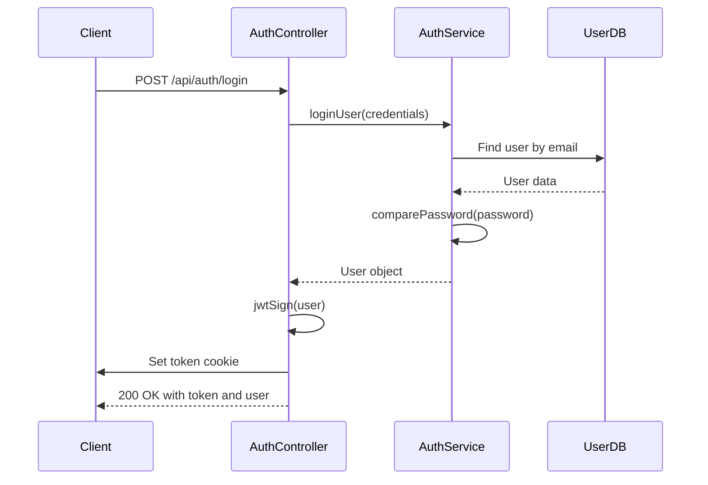
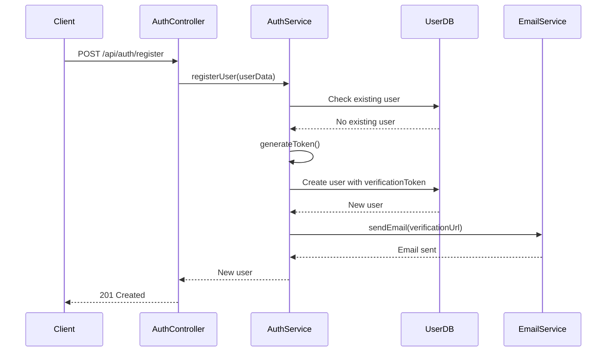
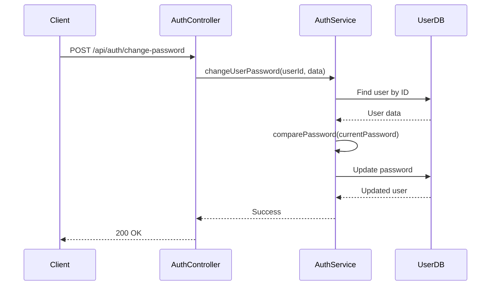
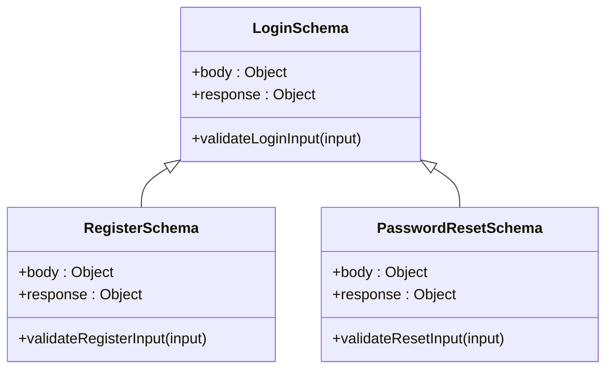
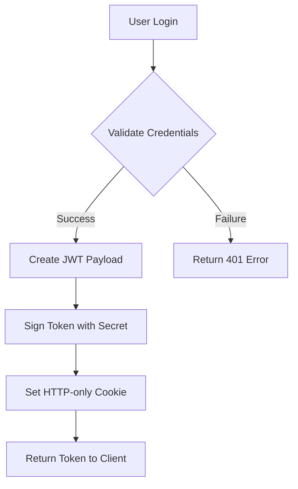
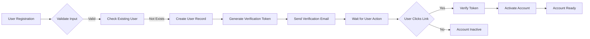
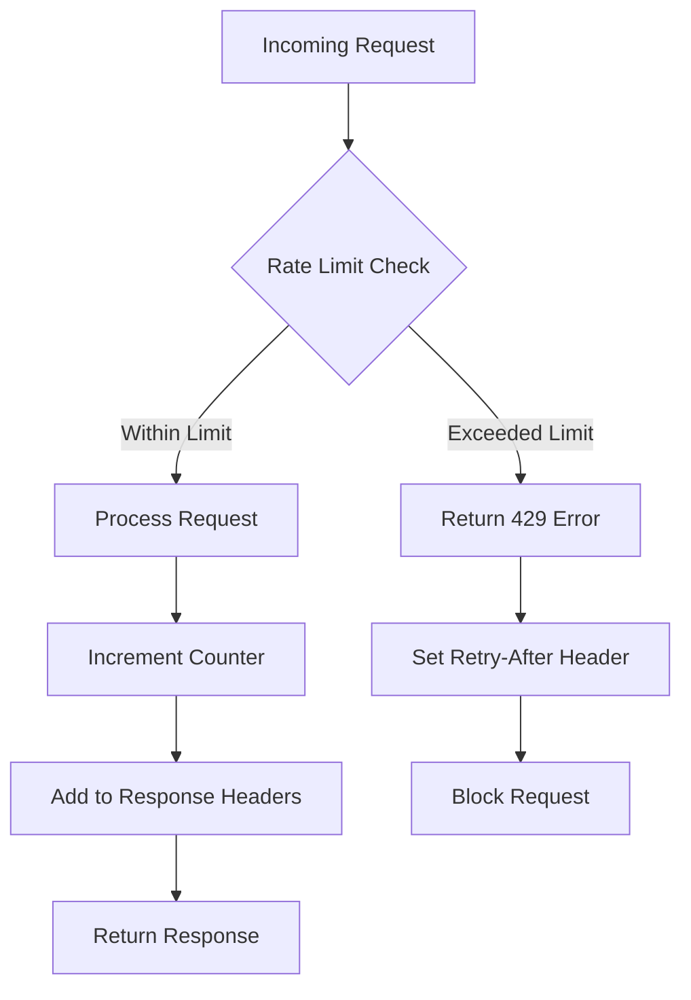
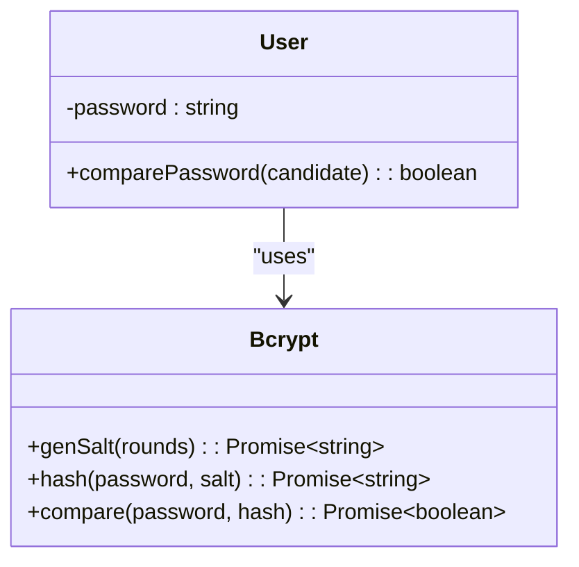
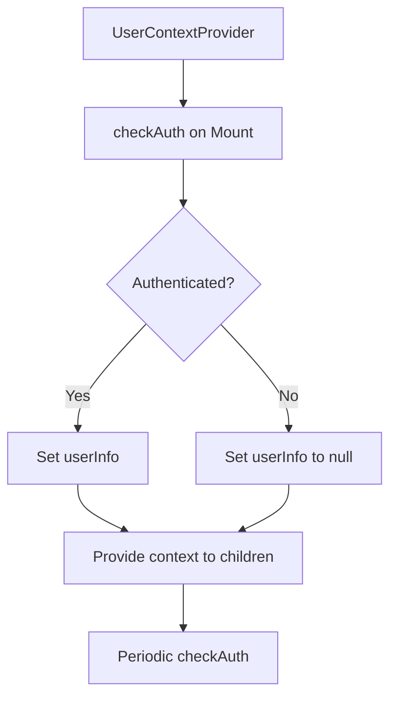

# Authentication API

<cite>
**Referenced Files in This Document**   
- [auth.routes.ts](file://api-fastify/src/routes/auth.routes.ts)
- [auth.controller.ts](file://api-fastify/src/controllers/auth.controller.ts)
- [auth.schema.ts](file://api-fastify/src/schemas/auth.schema.ts)
- [auth.service.ts](file://api-fastify/src/services/auth.service.ts)
- [auth.types.ts](file://api-fastify/src/types/auth.types.ts)
- [auth.middleware.ts](file://api-fastify/src/middlewares/auth.middleware.ts)
- [user.model.ts](file://api-fastify/src/models/user.model.ts)
- [index.ts](file://api-fastify/src/utils/index.ts)
- [server.ts](file://api-fastify/src/server.ts)
- [rate-limit.middleware.ts](file://api-fastify/src/middlewares/rate-limit.middleware.ts)
- [Login.tsx](file://src/pages/Login.tsx)
- [UserContext.tsx](file://src/UserContext.tsx)
- [api.config.ts](file://src/config/api.config.ts)
</cite>

## Table of Contents
1. [Introduction](#introduction)
2. [Authentication Endpoints](#authentication-endpoints)
3. [Request Validation](#request-validation)
4. [JWT-Based Authentication Flow](#jwt-based-authentication-flow)
5. [Registration Workflow](#registration-workflow)
6. [Password Reset Mechanism](#password-reset-mechanism)
7. [Security Considerations](#security-considerations)
8. [Error Handling](#error-handling)
9. [Frontend Integration](#frontend-integration)
10. [Curl Examples](#curl-examples)

## Introduction
The Authentication API provides secure user authentication and authorization for the MERN_chatai_blog application. It implements a comprehensive authentication system with JWT-based token management, email verification, password reset functionality, and role-based access control. The API is built using Fastify framework with TypeScript, providing type safety and robust error handling.

The authentication system follows modern security practices including password hashing with bcrypt, secure token storage via HTTP-only cookies, CSRF protection with SameSite cookies, and rate limiting to prevent brute force attacks. The API endpoints are organized under the `/api/auth` route prefix and support standard authentication operations including registration, login, logout, password management, and user profile retrieval.

**Section sources**
- [auth.routes.ts](file://api-fastify/src/routes/auth.routes.ts)
- [server.ts](file://api-fastify/src/server.ts)

## Authentication Endpoints
The authentication API provides a comprehensive set of endpoints for user authentication and management. All endpoints are accessible under the `/api/auth` route prefix.

### Login Endpoint
The login endpoint authenticates users with their email and password credentials.

**URL**: `POST /api/auth/login`  
**Authentication**: Not required  
**Rate Limiting**: 5 attempts per minute per IP address

This endpoint validates user credentials, generates a JWT token upon successful authentication, and sets it as an HTTP-only cookie for enhanced security. The token is also included in the response body for clients that prefer manual token management.



**Diagram sources**
- [auth.controller.ts](file://api-fastify/src/controllers/auth.controller.ts#L45-L95)
- [auth.service.ts](file://api-fastify/src/services/auth.service.ts#L75-L105)

### Registration Endpoint
The registration endpoint creates new user accounts with email verification.

**URL**: `POST /api/auth/register`  
**Authentication**: Not required  
**Rate Limiting**: 3 attempts per hour per IP address

This endpoint creates a new user account, generates a verification token, stores it in the database, and sends a verification email with a link containing the token. The account remains inactive until email verification is completed.



**Diagram sources**
- [auth.controller.ts](file://api-fastify/src/controllers/auth.controller.ts#L15-L43)
- [auth.service.ts](file://api-fastify/src/services/auth.service.ts#L25-L65)

### Logout Endpoint
The logout endpoint terminates user sessions.

**URL**: `POST /api/auth/logout`  
**Authentication**: Required (via JWT token)  
**Rate Limiting**: 10 attempts per minute per user

This endpoint clears the authentication cookie on the client side. Since JWT tokens are stateless, the server does not maintain a session blacklist by default, but the cookie removal effectively logs out the user from the current device.

**Section sources**
- [auth.routes.ts](file://api-fastify/src/routes/auth.routes.ts#L15)
- [auth.controller.ts](file://api-fastify/src/controllers/auth.controller.ts#L315-L329)

### Email Verification Endpoint
The email verification endpoint activates user accounts after registration.

**URL**: `GET /api/auth/verify-email/:token`  
**Authentication**: Not required  
**Rate Limiting**: 5 attempts per hour per IP address

This endpoint validates the verification token, updates the user's `isVerified` status to true, and removes the verification token from the database.

**Section sources**
- [auth.routes.ts](file://api-fastify/src/routes/auth.routes.ts#L18)
- [auth.controller.ts](file://api-fastify/src/controllers/auth.controller.ts#L97-L125)

### Password Management Endpoints
The authentication system provides endpoints for password recovery and modification.

**Forgot Password**: `POST /api/auth/forgot-password`  
Sends a password reset link to the user's email address if it exists in the system. For security reasons, the response does not indicate whether the email was found.

**Reset Password**: `POST /api/auth/reset-password`  
Resets the user's password using a valid reset token. The token must be included in the request body and must not be expired.

**Change Password**: `POST /api/auth/change-password`  
Allows authenticated users to change their password by providing their current password and new password.



**Diagram sources**
- [auth.controller.ts](file://api-fastify/src/controllers/auth.controller.ts#L185-L219)
- [auth.service.ts](file://api-fastify/src/services/auth.service.ts#L185-L210)

### User Profile Endpoints
These endpoints provide access to user information and role verification.

**Get Current User**: `GET /api/auth/me`  
Returns the authenticated user's profile information, excluding sensitive fields like password.

**Check Admin**: `GET /api/auth/check-admin`  
Verifies if the authenticated user has administrator privileges.

**Check Author/Editor**: `GET /api/auth/check-author`  
Verifies if the authenticated user has author, editor, or administrator privileges.

**Section sources**
- [auth.routes.ts](file://api-fastify/src/routes/auth.routes.ts#L37-L55)
- [auth.controller.ts](file://api-fastify/src/controllers/auth.controller.ts#L221-L313)

## Request Validation
The authentication API implements comprehensive request validation using Fastify schemas to ensure data integrity and security.

### Validation Schema Structure
All request validation is defined in the `auth.schema.ts` file using Fastify's schema validation system. Each endpoint has a corresponding schema that defines the expected request structure, required fields, data types, and constraints.



**Diagram sources**
- [auth.schema.ts](file://api-fastify/src/schemas/auth.schema.ts)

### Input Validation Rules
The following validation rules are applied to authentication requests:

**Login Validation**:
- Email: Required, valid email format
- Password: Required, minimum 6 characters

**Registration Validation**:
- Username: Required, 3-30 characters
- Email: Required, valid email format, unique
- Password: Required, minimum 6 characters
- First/Last Name: Optional

**Password Reset Validation**:
- Email: Required, valid email format
- Token: Required, string
- New Password: Required, minimum 6 characters

**Change Password Validation**:
- Current Password: Required
- New Password: Required, minimum 6 characters

The validation system returns detailed error messages for invalid requests, helping clients correct their input. All validation occurs before any database operations, preventing unnecessary processing.

**Section sources**
- [auth.schema.ts](file://api-fastify/src/schemas/auth.schema.ts)
- [auth.types.ts](file://api-fastify/src/types/auth.types.ts)

## JWT-Based Authentication Flow
The authentication system uses JSON Web Tokens (JWT) for stateless session management, providing secure and scalable user authentication.

### Token Generation and Signing
When a user successfully logs in, the server generates a JWT token containing the user's essential information:

- User ID
- Email address
- Username
- Role

The token is signed using a secret key defined in the environment variables (`JWT_SECRET`) and has an expiration time configured via `JWT_EXPIRES_IN` (default: 30 days).



**Diagram sources**
- [auth.controller.ts](file://api-fastify/src/controllers/auth.controller.ts#L55-L75)
- [server.ts](file://api-fastify/src/server.ts#L70-L85)

### Token Storage and Security
The authentication system implements multiple security measures for token management:

**HTTP-only Cookies**: Tokens are stored in HTTP-only cookies to prevent access via JavaScript, mitigating XSS attacks.

**Secure Flag**: Cookies are marked as secure in production, ensuring they are only transmitted over HTTPS.

**SameSite Protection**: Cookies use 'lax' SameSite policy to prevent CSRF attacks.

**Token in Response Body**: For flexibility, the token is also included in the response body, allowing clients to store it in memory or secure storage if cookies are not preferred.

### Token Verification
All protected routes use the `authenticate` middleware to verify JWT tokens. The middleware:

1. Checks for token in cookies or Authorization header
2. Validates token signature and expiration
3. Attaches user information to the request object
4. Handles verification errors with appropriate HTTP status codes

The verification process is handled by Fastify's JWT plugin, which integrates seamlessly with the framework's error handling system.

**Section sources**
- [auth.middleware.ts](file://api-fastify/src/middlewares/auth.middleware.ts)
- [server.ts](file://api-fastify/src/server.ts#L70-L85)

## Registration Workflow
The user registration process implements a secure email verification system to ensure valid email addresses and prevent automated account creation.

### Registration Process
1. User submits registration form with username, email, and password
2. Server validates input and checks for existing accounts
3. New user is created with `isVerified: false` and a unique verification token
4. Verification email is sent with a link containing the token
5. User clicks the verification link to activate their account
6. Account is activated and user can log in



**Diagram sources**
- [auth.service.ts](file://api-fastify/src/services/auth.service.ts#L25-L65)
- [user.model.ts](file://api-fastify/src/models/user.model.ts)

### Email Verification
The email verification system uses randomly generated tokens (32 bytes of random data) that are stored in the user document. When a user clicks the verification link:

1. The token is extracted from the URL parameter
2. The system finds the user with matching verification token
3. The user's `isVerified` flag is set to true
4. The verification token is removed from the database
5. The account is now active and can be used for login

The system does not expire verification tokens by default, but this could be implemented by adding an expiration timestamp to the user model.

**Section sources**
- [auth.controller.ts](file://api-fastify/src/controllers/auth.controller.ts#L97-L125)
- [auth.service.ts](file://api-fastify/src/services/auth.service.ts#L135-L155)

## Password Reset Mechanism
The password reset system provides a secure way for users to recover access to their accounts when they forget their password.

### Reset Process Flow
1. User requests password reset with their email address
2. System checks if email exists in database
3. If found, generates a reset token with 1-hour expiration
4. Sends reset link via email containing the token
5. User clicks link and is directed to reset form
6. User enters new password which is validated and stored

```mermaid
flowchart TD
A[Forgot Password Request] --> B{Email Exists?}
B --> |Yes| C[Generate Reset Token]
C --> D[Set Expiration (1 hour)]
D --> E[Update User Record]
E --> F[Send Reset Email]
F --> G[User Clicks Link]
G --> H{Token Valid?}
H --> |Yes| I[Show Reset Form]
I --> J[Validate New Password]
J --> K[Update Password]
K --> L[Remove Reset Token]
L --> M[Password Reset Complete]
H --> |No| N[Error: Invalid Token]
```

**Diagram sources**
- [auth.service.ts](file://api-fastify/src/services/auth.service.ts#L157-L210)

### Security Features
The password reset system includes several security measures:

**Token Expiration**: Reset tokens expire after 1 hour to prevent misuse.

**Single-Use Tokens**: Once a token is used to reset a password, it is immediately removed from the database.

**Generic Responses**: The forgot password endpoint returns the same response regardless of whether the email exists, preventing email enumeration attacks.

**Rate Limiting**: The endpoint is rate-limited to prevent abuse and brute force attempts.

The system uses the same token generation function (`generateToken`) as the email verification system, ensuring cryptographically secure random tokens.

**Section sources**
- [auth.service.ts](file://api-fastify/src/services/auth.service.ts#L157-L210)
- [index.ts](file://api-fastify/src/utils/index.ts#L50-L55)

## Security Considerations
The authentication system implements multiple security layers to protect user accounts and prevent common attacks.

### Rate Limiting
The API implements rate limiting to prevent brute force attacks and abuse:

**Login Attempts**: Limited to 5 attempts per minute per IP address
**Registration Attempts**: Limited to 3 attempts per hour per IP address
**Password Reset Requests**: Limited to 5 attempts per hour per IP address

The rate limiting system uses Redis to track request counts and automatically resets counters after the specified time window. This prevents attackers from guessing passwords or flooding the system with requests.



**Diagram sources**
- [rate-limit.middleware.ts](file://api-fastify/src/middlewares/rate-limit.middleware.ts)
- [server.ts](file://api-fastify/src/server.ts)

### Brute Force Protection
In addition to rate limiting, the system implements several brute force protection measures:

**Account Lockout**: While not explicitly implemented, the rate limiting effectively prevents rapid password guessing.

**Generic Error Messages**: Authentication errors return generic messages to prevent information leakage about valid accounts.

**Secure Token Generation**: Both verification and reset tokens use cryptographically secure random generation (32 bytes of random data).

### CORS Policies
The server implements strict CORS policies to prevent unauthorized cross-origin requests:

**Allowed Origins**: Specific domains including production and development environments
**Credentials**: Enabled to allow cookie transmission
**Methods**: Restricted to necessary HTTP methods
**Headers**: Limited to required headers

The CORS configuration is defined in the server setup and includes wildcard support for Vercel deployments.

**Section sources**
- [server.ts](file://api-fastify/src/server.ts#L30-L65)
- [rate-limit.middleware.ts](file://api-fastify/src/middlewares/rate-limit.middleware.ts)

### Secure Token Storage
The authentication system follows best practices for secure token storage:

**HTTP-only Cookies**: Prevents access via JavaScript, mitigating XSS attacks
**Secure Flag**: Ensures cookies are only sent over HTTPS in production
**SameSite Lax**: Protects against CSRF attacks while allowing legitimate cross-site usage
**Token in Response Body**: Provided as an alternative for clients that prefer manual token management

### Password Security
The system implements robust password security measures:

**bcrypt Hashing**: Passwords are hashed using bcrypt with a salt factor of 10
**Pre-save Hook**: Hashing occurs automatically before saving to database
**Password Comparison**: Secure comparison method prevents timing attacks



**Diagram sources**
- [user.model.ts](file://api-fastify/src/models/user.model.ts#L80-L95)

## Error Handling
The authentication API implements comprehensive error handling to provide meaningful feedback while maintaining security.

### Error Codes and Responses
The system uses standard HTTP status codes to indicate the result of authentication operations:

**400 Bad Request**: Validation errors or malformed requests
- Invalid email format
- Password too short
- Missing required fields

**401 Unauthorized**: Authentication failures
- Invalid credentials
- Expired or invalid token
- Missing authentication

**403 Forbidden**: Authorization failures
- Insufficient privileges
- Access to restricted resources

**404 Not Found**: Resource not found
- User not found
- Invalid verification token

**429 Too Many Requests**: Rate limiting
- Exceeded request limits
- Brute force protection triggered

**500 Internal Server Error**: Unexpected server errors
- Database connection issues
- Email service failures

### Error Response Structure
All error responses follow a consistent structure:

```json
{
  "message": "Descriptive error message"
}
```

For security reasons, error messages are kept generic when they might reveal sensitive information. For example, login failures return "Email or password incorrect" regardless of whether the email exists or the password is wrong.

### Client-Side Error Handling
The frontend implementation includes robust error handling:

**Form Validation**: Client-side validation prevents unnecessary API calls
**Error Display**: Clear error messages are displayed to users
**Error Clearing**: Errors are automatically cleared when users correct their input
**Network Error Handling**: Graceful handling of network issues and timeouts

**Section sources**
- [auth.controller.ts](file://api-fastify/src/controllers/auth.controller.ts)
- [Login.tsx](file://src/pages/Login.tsx#L100-L150)

## Frontend Integration
The authentication system is designed for seamless integration with the React frontend application.

### User Context Management
The frontend uses a React Context (`UserContext`) to manage authentication state across the application:

**State Management**: Centralized user information including ID, username, and role
**Persistence**: Automatic session checking on page load
**Periodic Validation**: Session validity checked every 5 minutes
**Loading States**: Proper loading indicators during authentication operations



**Diagram sources**
- [UserContext.tsx](file://src/UserContext.tsx)

### API Integration Patterns
The frontend uses consistent patterns for API integration:

**Fetch API**: Native fetch with proper configuration
**Credentials**: Include credentials for cookie handling
**Error Handling**: Comprehensive try-catch blocks
**Loading States**: UI feedback during requests
**Success Handling**: Navigation and state updates

### Authentication Flow
The typical authentication flow in the frontend:

1. User navigates to login page
2. Enters credentials and submits form
3. Client validates input locally
4. Sends request to `/api/auth/login`
5. On success: updates context, shows success message, redirects
6. On failure: displays error message, allows retry

**Section sources**
- [UserContext.tsx](file://src/UserContext.tsx)
- [Login.tsx](file://src/pages/Login.tsx)
- [api.config.ts](file://src/config/api.config.ts)

## Curl Examples
The following curl examples demonstrate how to interact with the authentication API endpoints.

### User Registration
```bash
curl -X POST https://your-api-domain.com/api/auth/register \
  -H "Content-Type: application/json" \
  -d '{
    "username": "johndoe",
    "email": "john@example.com",
    "password": "securepassword123",
    "firstName": "John",
    "lastName": "Doe"
  }'
```

Expected response:
```json
{
  "message": "Registration successful. Please check your email to verify your account.",
  "user": {
    "_id": "64a1b2c3d4e5f6a7b8c9d0e1",
    "username": "johndoe",
    "email": "john@example.com",
    "role": "USER",
    "isVerified": false,
    "createdAt": "2023-07-01T10:00:00.000Z"
  }
}
```

### User Login
```bash
curl -X POST https://your-api-domain.com/api/auth/login \
  -H "Content-Type: application/json" \
  -H "Cookie: token=existing_token_if_any" \
  -d '{
    "email": "john@example.com",
    "password": "securepassword123"
  }'
```

Expected response:
```json
{
  "token": "eyJhbGciOiJIUzI1NiIsInR5cCI6IkpXVCJ9.eyJfaWQiOiI2NGExYjJjM2Q0ZTVmNmE3YjhjOWQwZTEiLCJlbWFpbCI6ImpvaG5AZXhhbXBsZS5jb20iLCJ1c2VybmFtZSI6ImpvaG5kb2UiLCJyb2xlIjoiVVNFUiIsImlhdCI6MTY4ODIwMDAwMCwiZXhwIjoxNjkwNzkyMDAwfQ.secret",
  "user": {
    "_id": "64a1b2c3d4e5f6a7b8c9d0e1",
    "username": "johndoe",
    "email": "john@example.com",
    "role": "USER",
    "isVerified": true,
    "createdAt": "2023-07-01T10:00:00.000Z"
  }
}
```

### Password Reset Request
```bash
curl -X POST https://your-api-domain.com/api/auth/forgot-password \
  -H "Content-Type: application/json" \
  -d '{
    "email": "john@example.com"
  }'
```

Expected response:
```json
{
  "message": "If an account exists with this email, a reset link has been sent."
}
```

### Password Reset
```bash
curl -X POST https://your-api-domain.com/api/auth/reset-password \
  -H "Content-Type: application/json" \
  -d '{
    "token": "reset_token_from_email",
    "password": "newsecurepassword456"
  }'
```

Expected response:
```json
{
  "message": "Password reset successfully. You can now log in."
}
```

### Change Password
```bash
curl -X POST https://your-api-domain.com/api/auth/change-password \
  -H "Content-Type: application/json" \
  -H "Cookie: token=valid_authentication_token" \
  -d '{
    "currentPassword": "securepassword123",
    "newPassword": "newsecurepassword456"
  }'
```

Expected response:
```json
{
  "message": "Password changed successfully"
}
```

### Get Current User
```bash
curl -X GET https://your-api-domain.com/api/auth/me \
  -H "Cookie: token=valid_authentication_token"
```

Expected response:
```json
{
  "user": {
    "_id": "64a1b2c3d4e5f6a7b8c9d0e1",
    "username": "johndoe",
    "email": "john@example.com",
    "role": "USER",
    "isVerified": true,
    "createdAt": "2023-07-01T10:00:00.000Z"
  }
}
```

### Logout
```bash
curl -X POST https://your-api-domain.com/api/auth/logout \
  -H "Cookie: token=valid_authentication_token"
```

Expected response:
```json
{
  "message": "Logout successful"
}
```

**Section sources**
- [auth.routes.ts](file://api-fastify/src/routes/auth.routes.ts)
- [api.config.ts](file://src/config/api.config.ts)