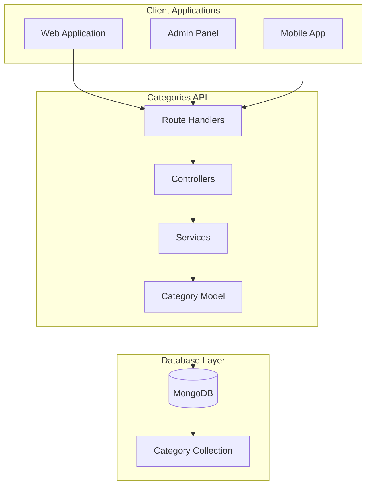
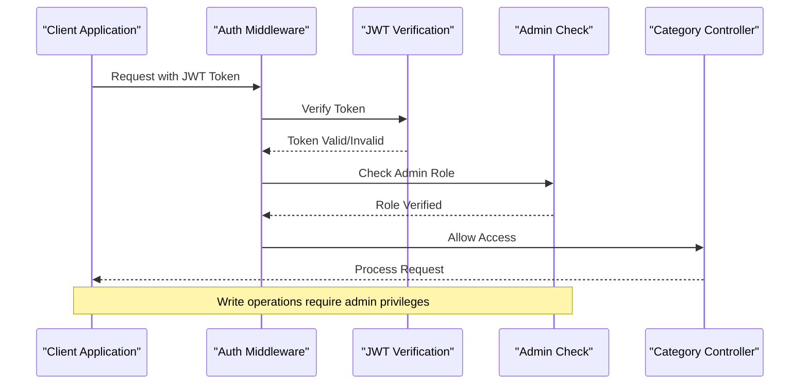
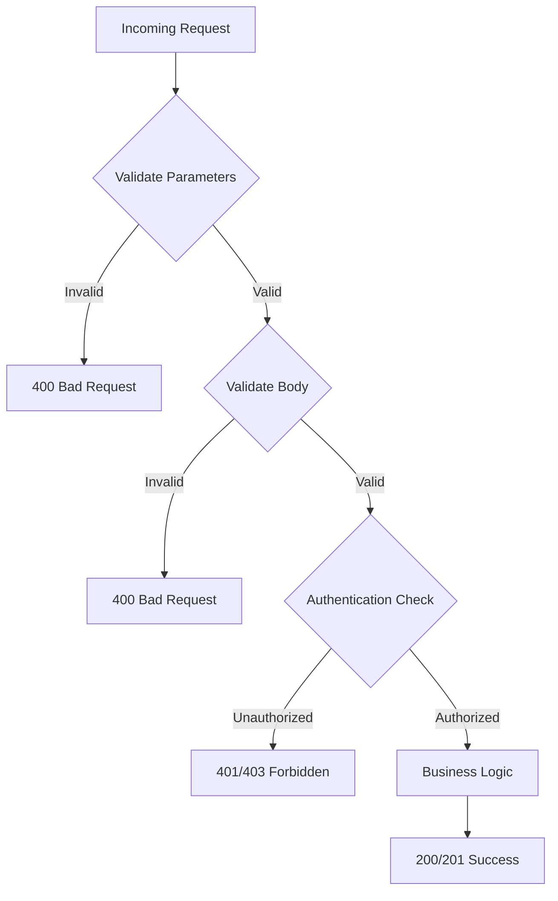
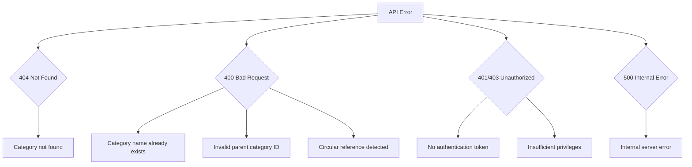
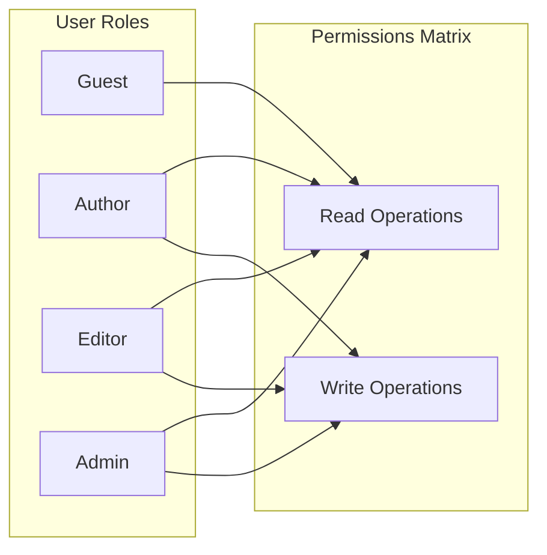
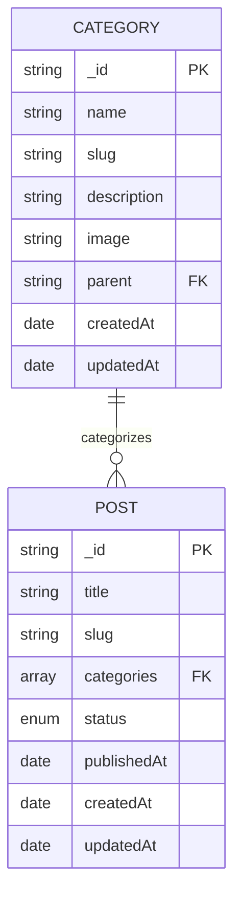

# Categories API Documentation

<cite>
**Referenced Files in This Document**
- [category.routes.ts](file://api-fastify/src/routes/category.routes.ts)
- [category.controller.ts](file://api-fastify/src/controllers/category.controller.ts)
- [category.service.ts](file://api-fastify/src/services/category.service.ts)
- [category.model.ts](file://api-fastify/src/models/category.model.ts)
- [category.schema.ts](file://api-fastify/src/schemas/category.schema.ts)
- [category.types.ts](file://api-fastify/src/types/category.types.ts)
- [auth.middleware.ts](file://api-fastify/src/middlewares/auth.middleware.ts)
- [index.ts](file://api-fastify/src/utils/index.ts)
- [createCategory.tsx](file://src/pages/createCategory.tsx)
- [DelCategory.tsx](file://src/pages/DelCategory.tsx)
- [api.config.ts](file://src/config/api.config.ts)
</cite>

## Table of Contents
1. [Introduction](#introduction)
2. [API Overview](#api-overview)
3. [Authentication Requirements](#authentication-requirements)
4. [Endpoints Reference](#endpoints-reference)
5. [Request/Response Schemas](#requestresponse-schemas)
6. [Validation Rules](#validation-rules)
7. [Error Handling](#error-handling)
8. [Rate Limiting](#rate-limiting)
9. [Usage Examples](#usage-examples)
10. [Access Control](#access-control)
11. [Integration with Posts](#integration-with-posts)
12. [Troubleshooting Guide](#troubleshooting-guide)

## Introduction

The Categories API provides comprehensive CRUD operations for managing content categories in the MERN_chatai_blog platform. Categories serve as organizational units for blog posts, enabling structured content management and enhanced navigation capabilities. This API supports hierarchical category structures, automatic slug generation, and seamless integration with the post management system.

The API follows RESTful principles and implements robust validation, authentication, and error handling mechanisms to ensure secure and reliable category management.

## API Overview

The Categories API consists of five main endpoints that support full CRUD operations:

- **GET /api/categories** - Retrieve all categories with post counts
- **GET /api/categories/:idOrSlug** - Get a specific category by ID or slug
- **POST /api/categories** - Create a new category (admin only)
- **PUT /api/categories/:id** - Update an existing category (admin only)
- **DELETE /api/categories/:id** - Delete a category (admin only)



**Diagram sources**
- [category.routes.ts](file://api-fastify/src/routes/category.routes.ts#L1-L75)
- [category.controller.ts](file://api-fastify/src/controllers/category.controller.ts#L1-L235)
- [category.service.ts](file://api-fastify/src/services/category.service.ts#L1-L227)

## Authentication Requirements

All write operations (POST, PUT, DELETE) require JWT authentication with administrative privileges. The authentication middleware ensures that only authorized administrators can modify category data.

### Authentication Flow



**Diagram sources**
- [auth.middleware.ts](file://api-fastify/src/middlewares/auth.middleware.ts#L1-L128)

**Section sources**
- [auth.middleware.ts](file://api-fastify/src/middlewares/auth.middleware.ts#L1-L128)
- [category.routes.ts](file://api-fastify/src/routes/category.routes.ts#L25-L60)

## Endpoints Reference

### GET /api/categories

Retrieves all categories sorted alphabetically by name, including post counts for each category.

**Authentication:** Optional

**Response Format:**
```json
{
  "categories": [
    {
      "_id": "string",
      "name": "string",
      "slug": "string",
      "description": "string|null",
      "image": "string|null",
      "parent": "string|null",
      "postCount": number,
      "createdAt": "date-time",
      "updatedAt": "date-time"
    }
  ]
}
```

### GET /api/categories/:idOrSlug

Retrieves a specific category by ID or slug, including associated post count.

**Authentication:** Optional

**Parameters:**
- `idOrSlug` (string): Category ID or slug

**Response Format:**
```json
{
  "category": {
    "_id": "string",
    "name": "string",
    "slug": "string",
    "description": "string|null",
    "image": "string|null",
    "parent": {
      "_id": "string",
      "name": "string",
      "slug": "string"
    } | null,
    "postCount": number,
    "createdAt": "date-time",
    "updatedAt": "date-time"
  }
}
```

### POST /api/categories

Creates a new category with automatic slug generation and validation.

**Authentication:** Required (Admin)

**Request Body:**
```json
{
  "name": "string (required, 2-50 chars)",
  "description": "string (optional, max 500 chars)",
  "image": "string (optional)",
  "parent": "string (optional, valid ObjectId)"
}
```

**Response Format:**
```json
{
  "message": "Catégorie créée avec succès",
  "category": {
    "_id": "string",
    "name": "string",
    "slug": "string"
  }
}
```

### PUT /api/categories/:id

Updates an existing category with validation for name uniqueness and parent relationships.

**Authentication:** Required (Admin)

**Parameters:**
- `id` (string): Category ID

**Request Body:**
```json
{
  "name": "string (optional, 2-50 chars)",
  "description": "string (optional, max 500 chars)",
  "image": "string (optional)",
  "parent": "string (optional, valid ObjectId)"
}
```

**Response Format:**
```json
{
  "message": "Catégorie mise à jour avec succès",
  "category": {
    "_id": "string",
    "name": "string",
    "slug": "string"
  }
}
```

### DELETE /api/categories/:id

Deletes a category after validating it's not in use by posts and has no child categories.

**Authentication:** Required (Admin)

**Parameters:**
- `id` (string): Category ID

**Response Format:**
```json
{
  "message": "Catégorie supprimée avec succès"
}
```

**Section sources**
- [category.routes.ts](file://api-fastify/src/routes/category.routes.ts#L1-L75)
- [category.controller.ts](file://api-fastify/src/controllers/category.controller.ts#L1-L235)

## Request/Response Schemas

### Category Model Schema

The category model defines the structure and validation rules for category data:

```typescript
interface ICategory extends Document {
  name: string;           // Required, 2-50 characters
  slug: string;          // Required, unique, lowercase
  description?: string;  // Optional, max 500 characters
  image?: string;        // Optional image URL
  parent?: ICategory['_id']; // Optional parent category
  createdAt: Date;
  updatedAt: Date;
}
```

### Validation Schema

Each endpoint includes comprehensive validation schemas:



**Diagram sources**
- [category.schema.ts](file://api-fastify/src/schemas/category.schema.ts#L1-L202)

**Section sources**
- [category.model.ts](file://api-fastify/src/models/category.model.ts#L1-L45)
- [category.schema.ts](file://api-fastify/src/schemas/category.schema.ts#L1-L202)
- [category.types.ts](file://api-fastify/src/types/category.types.ts#L1-L38)

## Validation Rules

### Category Name Validation

- **Required:** Yes
- **Format:** String
- **Length:** Minimum 2 characters, Maximum 50 characters
- **Uniqueness:** Enforced at database level
- **Characters:** Trimmed, alphanumeric with spaces and hyphens

### Slug Generation

The API automatically generates slugs from category names with the following process:

1. Convert to lowercase
2. Trim whitespace
3. Replace special characters with hyphens
4. Collapse multiple hyphens into single hyphens
5. Remove leading/trailing hyphens
6. Append unique identifier (nanoid)

Example: `"My Category"` → `"my-category-abc123"`

### Parent Category Validation

- **Optional:** Yes
- **Type:** Valid MongoDB ObjectId
- **Circular Reference Prevention:** Automatic detection
- **Self-Reference Prevention:** Blocked (category cannot be its own parent)

### Description Validation

- **Optional:** Yes
- **Format:** Plain text or HTML
- **Length:** Maximum 500 characters

**Section sources**
- [category.model.ts](file://api-fastify/src/models/category.model.ts#L6-L25)
- [category.service.ts](file://api-fastify/src/services/category.service.ts#L45-L85)
- [index.ts](file://api-fastify/src/utils/index.ts#L8-L20)

## Error Handling

The API implements comprehensive error handling with specific error codes and messages:

### Common Error Responses



**Diagram sources**
- [category.controller.ts](file://api-fastify/src/controllers/category.controller.ts#L45-L120)
- [category.service.ts](file://api-fastify/src/services/category.service.ts#L45-L180)

### Specific Error Messages

| Error Type | Status Code | Message |
|------------|-------------|---------|
| Category not found | 404 | "Catégorie non trouvée" |
| Duplicate name | 400 | "Une catégorie avec ce nom existe déjà" |
| Invalid parent ID | 400 | "ID de catégorie parent invalide" |
| Circular reference | 400 | "Référence circulaire détectée dans la hiérarchie des catégories" |
| Self-parenting | 400 | "Une catégorie ne peut pas être son propre parent" |
| Category in use | 400 | "Impossible de supprimer une catégorie utilisée par des articles" |
| Category has children | 400 | "Impossible de supprimer une catégorie qui a des sous-catégories" |

**Section sources**
- [category.controller.ts](file://api-fastify/src/controllers/category.controller.ts#L45-L120)
- [category.service.ts](file://api-fastify/src/services/category.service.ts#L45-L180)

## Rate Limiting

While not explicitly implemented in the current codebase, rate limiting should be considered for the category creation endpoint to prevent abuse:

### Recommended Rate Limits

- **Creation Endpoint (/api/categories):** 10 requests per minute per IP
- **Other Endpoints:** 100 requests per minute per IP
- **Authentication Failures:** 5 failures per minute per IP

### Implementation Considerations

Rate limiting should be implemented at the middleware level using tools like:
- Redis-based rate limiting
- Memory-based rate limiting for development
- IP-based or user-based limiting

## Usage Examples

### Creating a New Category

```javascript
// Basic category creation
fetch('/api/categories', {
  method: 'POST',
  headers: {
    'Content-Type': 'application/json',
    'Authorization': 'Bearer YOUR_JWT_TOKEN'
  },
  body: JSON.stringify({
    name: 'Technology',
    description: 'Articles about technology and innovation',
    image: 'https://example.com/tech-icon.png'
  })
})
.then(response => response.json())
.then(data => console.log('Category created:', data))
.catch(error => console.error('Error:', error));
```

### Creating a Subcategory

```javascript
// Creating a subcategory with parent reference
fetch('/api/categories', {
  method: 'POST',
  headers: {
    'Content-Type': 'application/json',
    'Authorization': 'Bearer YOUR_JWT_TOKEN'
  },
  body: JSON.stringify({
    name: 'Artificial Intelligence',
    description: 'AI advancements and applications',
    parent: '654321abcdef654321abcdef' // Parent category ID
  })
})
.then(response => response.json())
.then(data => console.log('Subcategory created:', data))
.catch(error => console.error('Error:', error));
```

### Retrieving All Categories

```javascript
// Get all categories with post counts
fetch('/api/categories')
.then(response => response.json())
.then(data => {
  console.log('Categories:', data.categories);
  // Access post counts: data.categories[0].postCount
})
.catch(error => console.error('Error:', error));
```

### Updating a Category

```javascript
// Update category information
fetch('/api/categories/654321abcdef654321abcdef', {
  method: 'PUT',
  headers: {
    'Content-Type': 'application/json',
    'Authorization': 'Bearer YOUR_JWT_TOKEN'
  },
  body: JSON.stringify({
    name: 'Updated Technology',
    description: 'Enhanced technology articles',
    image: 'https://example.com/new-tech-icon.png'
  })
})
.then(response => response.json())
.then(data => console.log('Category updated:', data))
.catch(error => console.error('Error:', error));
```

### Deleting a Category

```javascript
// Delete a category
fetch('/api/categories/654321abcdef654321abcdef', {
  method: 'DELETE',
  headers: {
    'Authorization': 'Bearer YOUR_JWT_TOKEN'
  }
})
.then(response => response.json())
.then(data => console.log('Category deleted:', data))
.catch(error => console.error('Error:', error));
```

**Section sources**
- [createCategory.tsx](file://src/pages/createCategory.tsx#L80-L120)
- [DelCategory.tsx](file://src/pages/DelCategory.tsx#L120-L180)

## Access Control

### Role-Based Permissions

The API implements role-based access control with the following permission levels:



**Diagram sources**
- [auth.middleware.ts](file://api-fastify/src/middlewares/auth.middleware.ts#L40-L80)

### Permission Details

| Operation | Required Role | Description |
|-----------|---------------|-------------|
| GET /categories | None | Public access for browsing |
| GET /categories/:idOrSlug | None | Public access for category details |
| POST /categories | ADMIN | Admin-only creation |
| PUT /categories/:id | ADMIN | Admin-only updates |
| DELETE /categories/:id | ADMIN | Admin-only deletion |

### Authentication Middleware

The authentication system includes several middleware functions:

- **authenticate():** Verifies JWT token presence and validity
- **isAdmin():** Ensures user has admin privileges
- **isEditorOrAdmin():** Allows editors and admins
- **isAuthorEditorOrAdmin():** Allows authors, editors, and admins

**Section sources**
- [auth.middleware.ts](file://api-fastify/src/middlewares/auth.middleware.ts#L1-L128)

## Integration with Posts

Categories are tightly integrated with the post management system, serving as the primary organizational structure for content.

### Category-Post Relationship



**Diagram sources**
- [category.model.ts](file://api-fastify/src/models/category.model.ts#L1-L45)
- [category.service.ts](file://api-fastify/src/services/category.service.ts#L15-L35)

### Post Count Calculation

Each category response includes a `postCount` field that represents the number of published posts in that category:

```typescript
// Example calculation in service layer
const postCount = await Post.countDocuments({
  categories: category._id,
  status: PostStatus.PUBLISHED
});
```

### Filtering Posts by Category

Categories enable efficient post filtering through the category ID or slug:

```javascript
// Filter posts by category
const posts = await Post.find({
  categories: categoryId,
  status: PostStatus.PUBLISHED
}).sort({ publishedAt: -1 });
```

**Section sources**
- [category.service.ts](file://api-fastify/src/services/category.service.ts#L15-L35)
- [category.service.ts](file://api-fastify/src/services/category.service.ts#L45-L85)

## Troubleshooting Guide

### Common Issues and Solutions

#### 1. Authentication Failures

**Problem:** 401 Unauthorized errors when accessing protected endpoints.

**Solution:**
- Verify JWT token is included in Authorization header
- Check token expiration
- Ensure token hasn't been revoked
- Confirm user has appropriate role permissions

#### 2. Category Creation Failures

**Problem:** 400 Bad Request when creating categories.

**Common Causes:**
- Duplicate category name
- Invalid parent category ID
- Circular reference in hierarchy
- Missing required fields

**Debugging Steps:**
```javascript
// Check for duplicate names
const existing = await Category.findOne({ name: categoryName });
if (existing) {
  console.log('Duplicate category found:', existing);
}

// Validate parent category
if (parentCategoryId) {
  const parent = await Category.findById(parentCategoryId);
  if (!parent) {
    console.log('Parent category not found');
  }
}
```

#### 3. Category Deletion Failures

**Problem:** 400 Bad Request when deleting categories.

**Common Causes:**
- Category has child categories
- Category is used by posts
- Invalid category ID

**Prevention:**
```javascript
// Check before deletion
const hasChildren = await Category.exists({ parent: categoryId });
const isUsed = await Post.exists({ categories: categoryId });

if (hasChildren) {
  throw new Error('Cannot delete category with subcategories');
}

if (isUsed) {
  throw new Error('Cannot delete category used by posts');
}
```

#### 4. Slug Generation Issues

**Problem:** Conflicting slugs or invalid characters.

**Solution:**
- The API automatically handles slug conflicts
- Special characters are sanitized during generation
- Slugs are lowercase and hyphen-separated

#### 5. Performance Issues

**Problem:** Slow response times for category queries.

**Optimization Strategies:**
- Add indexes on frequently queried fields
- Implement caching for category lists
- Use pagination for large category collections
- Optimize post count calculations

**Section sources**
- [category.controller.ts](file://api-fastify/src/controllers/category.controller.ts#L45-L120)
- [category.service.ts](file://api-fastify/src/services/category.service.ts#L180-L227)