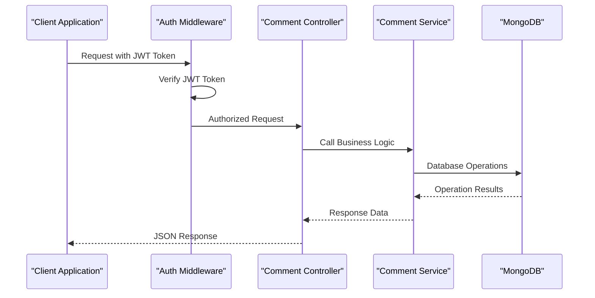
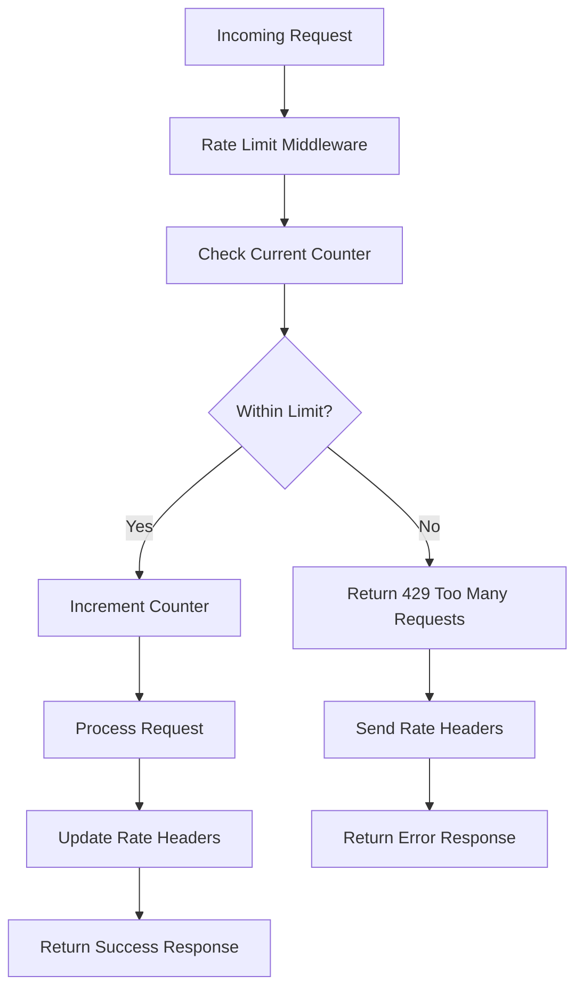
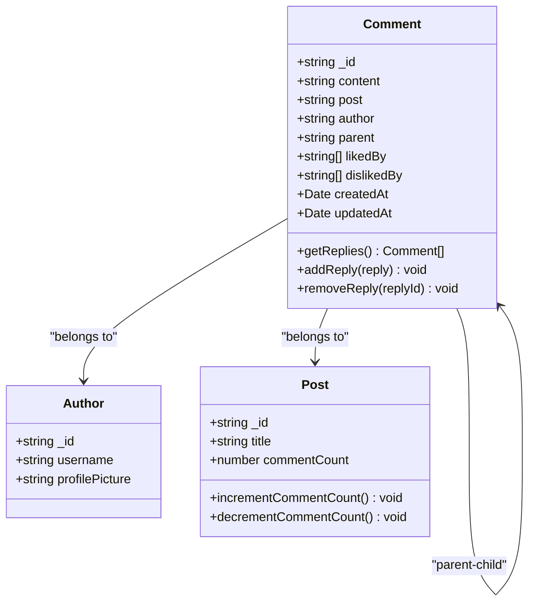
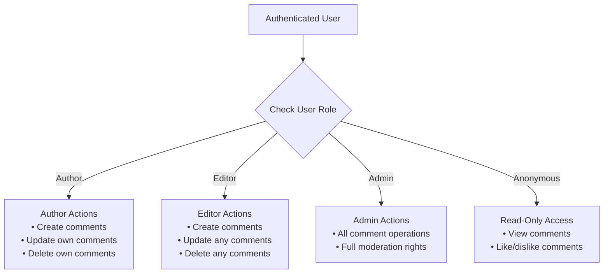
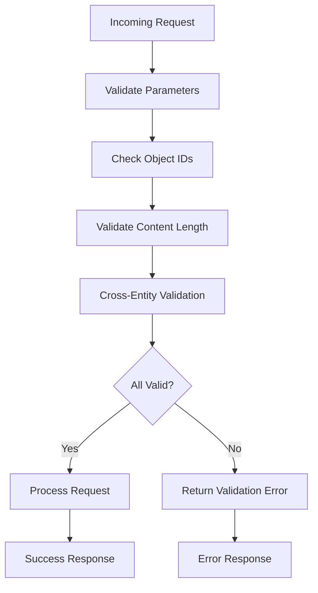
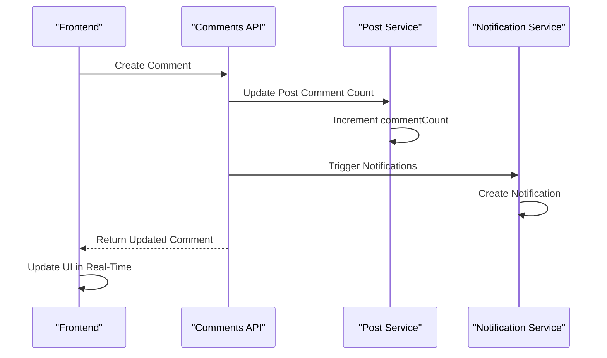
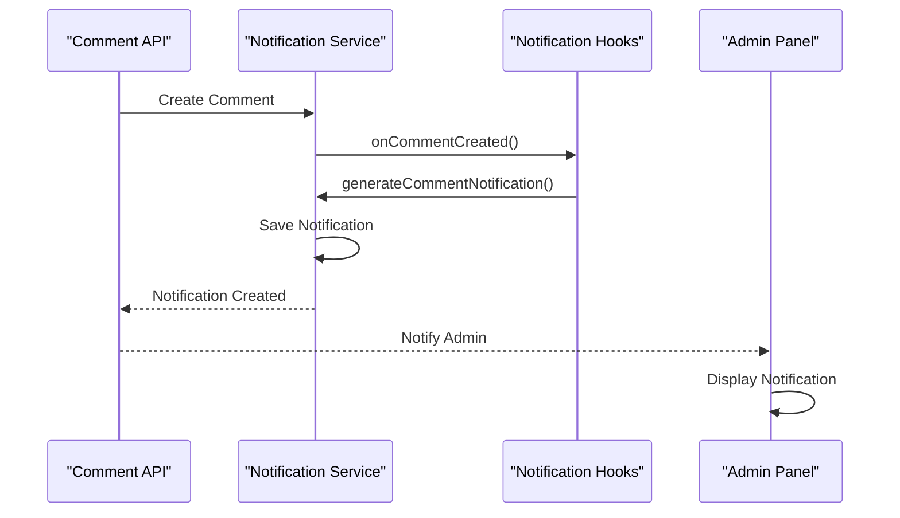
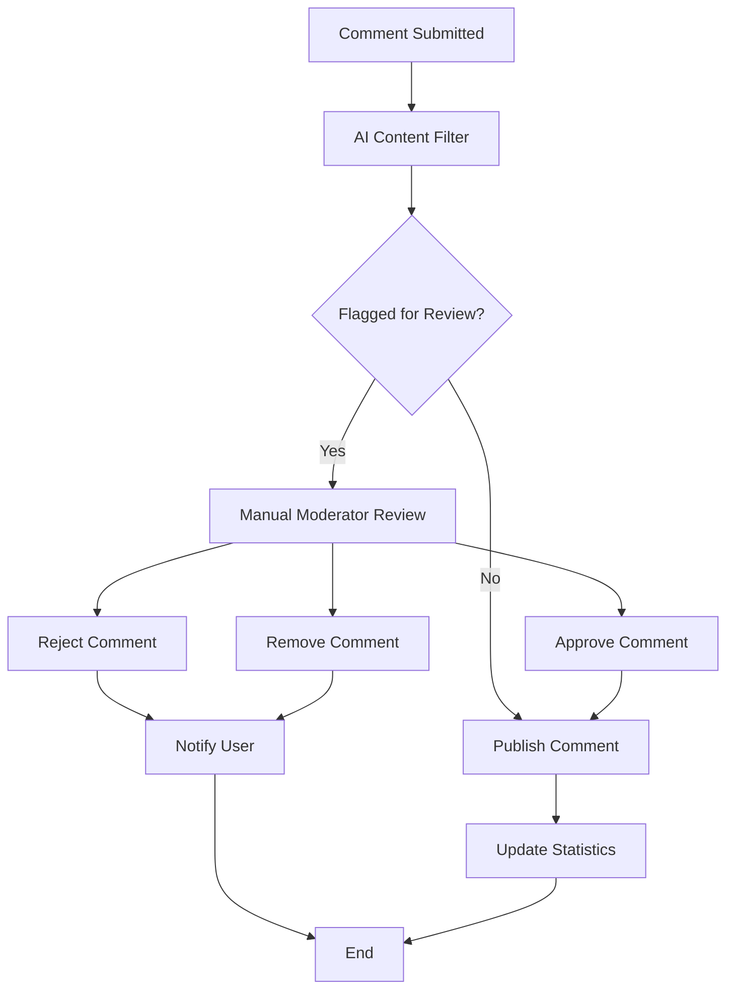

# Comments API Documentation

<cite>
**Referenced Files in This Document**
- [comment.routes.ts](file://api-fastify/src/routes/comment.routes.ts)
- [comment.controller.ts](file://api-fastify/src/controllers/comment.controller.ts)
- [comment.service.ts](file://api-fastify/src/services/comment.service.ts)
- [comment.model.ts](file://api-fastify/src/models/comment.model.ts)
- [comment.types.ts](file://api-fastify/src/types/comment.types.ts)
- [comment.schema.ts](file://api-fastify/src/schemas/comment.schema.ts)
- [simple-reaction.service.ts](file://api-fastify/src/services/simple-reaction.service.ts)
- [auth.middleware.ts](file://api-fastify/src/middlewares/auth.middleware.ts)
- [rate-limit.middleware.ts](file://api-fastify/src/middlewares/rate-limit.middleware.ts)
- [notification.service.ts](file://api-fastify/src/services/notification.service.ts)
- [notification-hooks.service.ts](file://api-fastify/src/services/notification-hooks.service.ts)
- [api.config.ts](file://src/config/api.config.ts)
</cite>

## Table of Contents
1. [Introduction](#introduction)
2. [Authentication Requirements](#authentication-requirements)
3. [Rate Limiting](#rate-limiting)
4. [Endpoint Reference](#endpoint-reference)
5. [Data Models](#data-models)
6. [Request/Response Examples](#requestresponse-examples)
7. [Authorization Rules](#authorization-rules)
8. [Validation Logic](#validation-logic)
9. [Integration with Post Entities](#integration-with-post-entities)
10. [Notification System Integration](#notification-system-integration)
11. [Error Handling](#error-handling)
12. [Moderation Considerations](#moderation-considerations)
13. [Best Practices](#best-practices)

## Introduction

The Comments API provides comprehensive functionality for managing comments on blog posts within the MERN_chatai_blog platform. This API supports CRUD operations for comments, nested comment structures for replies, reaction systems (likes/dislikes), and seamless integration with the notification system for real-time updates.

The API is built using Fastify framework and follows RESTful principles with JSON responses. It implements robust authentication using JWT tokens, comprehensive validation, and rate limiting to prevent abuse while maintaining optimal performance.

## Authentication Requirements

All write operations (create, update, delete, like/dislike) require authentication using JWT tokens. The authentication middleware validates the presence and validity of the token in either cookies or Authorization headers.



**Diagram sources**
- [auth.middleware.ts](file://api-fastify/src/middlewares/auth.middleware.ts#L10-L40)
- [comment.controller.ts](file://api-fastify/src/controllers/comment.controller.ts#L55-L65)

**Section sources**
- [auth.middleware.ts](file://api-fastify/src/middlewares/auth.middleware.ts#L10-L40)
- [comment.routes.ts](file://api-fastify/src/routes/comment.routes.ts#L55-L127)

## Rate Limiting

The API implements sophisticated rate limiting to prevent spam and abuse. Different endpoints have varying limits based on their sensitivity and resource consumption.

### Rate Limiting Configuration

- **General Comment Operations**: 30 requests per minute per user/IP
- **Notification Actions**: 100 requests per minute per user/IP
- **Read Operations**: No strict limits (optional authentication)



**Diagram sources**
- [rate-limit.middleware.ts](file://api-fastify/src/middlewares/rate-limit.middleware.ts#L15-L50)

**Section sources**
- [rate-limit.middleware.ts](file://api-fastify/src/middlewares/rate-limit.middleware.ts#L15-L91)

## Endpoint Reference

### GET /api/comments/post/:postId

**Description**: Retrieve comments for a specific post with optional pagination and filtering.

**Parameters**:
- `postId` (string, required): ID of the post to retrieve comments for
- `parent` (string, optional): Filter comments by parent comment ID (for replies)
- `page` (number, optional): Page number (minimum: 1, default: 1)
- `limit` (number, optional): Number of comments per page (minimum: 1, maximum: 100, default: 10)

**Authentication**: Optional - Returns comments regardless of authentication status

**Response Format**:
```json
{
  "comments": [
    {
      "_id": "string",
      "content": "string",
      "post": "string",
      "author": {
        "_id": "string",
        "username": "string",
        "profilePicture": "string|null"
      },
      "parent": "string|null",
      "likes": ["string"],
      "dislikes": ["string"],
      "likeCount": number,
      "dislikeCount": number,
      "isLiked": boolean|null,
      "isDisliked": boolean|null,
      "createdAt": "string (ISO date)",
      "updatedAt": "string (ISO date)",
      "replies": []
    }
  ],
  "total": number,
  "page": number,
  "limit": number,
  "totalPages": number
}
```

### GET /api/comments/:id

**Description**: Retrieve a specific comment by ID.

**Parameters**:
- `id` (string, required): ID of the comment to retrieve

**Authentication**: Not required

**Response Format**:
```json
{
  "comment": {
    "_id": "string",
    "content": "string",
    "post": "string",
    "author": {
      "_id": "string",
      "username": "string",
      "profilePicture": "string|null"
    },
    "parent": "string|null",
    "likes": ["string"],
    "dislikes": ["string"],
    "likeCount": number,
    "dislikeCount": number,
    "isLiked": boolean|null,
    "isDisliked": boolean|null,
    "createdAt": "string (ISO date)",
    "updatedAt": "string (ISO date)"
  }
}
```

### POST /api/comments

**Description**: Create a new comment or reply to an existing comment.

**Authentication**: Required (JWT token)

**Request Body**:
```json
{
  "content": "string (1-1000 characters)",
  "post": "string (post ID)",
  "parent": "string|null (parent comment ID for replies)"
}
```

**Response Format**:
```json
{
  "message": "Commentaire créé avec succès",
  "comment": {
    "_id": "string",
    "content": "string",
    "post": "string",
    "author": {
      "_id": "string",
      "username": "string",
      "profilePicture": "string|null"
    },
    "parent": "string|null",
    "likes": [],
    "dislikes": [],
    "likeCount": 0,
    "createdAt": "string (ISO date)",
    "updatedAt": "string (ISO date)"
  }
}
```

### PUT /api/comments/:id

**Description**: Update an existing comment.

**Authentication**: Required (JWT token)

**Request Body**:
```json
{
  "content": "string (1-1000 characters)"
}
```

**Response Format**:
```json
{
  "message": "Commentaire mis à jour avec succès",
  "comment": {
    "_id": "string",
    "content": "string"
  }
}
```

### DELETE /api/comments/:id

**Description**: Delete a comment.

**Authentication**: Required (JWT token)

**Response Format**:
```json
{
  "message": "Commentaire supprimé avec succès"
}
```

### POST /api/comments/:id/like

**Description**: Like a comment.

**Authentication**: Required (JWT token)

**Response Format**:
```json
{
  "message": "Action effectuée avec succès",
  "likes": ["user1", "user2"],
  "dislikes": [],
  "likeCount": 2,
  "dislikeCount": 0,
  "isLiked": true,
  "isDisliked": false
}
```

### POST /api/comments/:id/unlike

**Description**: Remove like from a comment.

**Authentication**: Required (JWT token)

**Response Format**:
```json
{
  "message": "Action effectuée avec succès",
  "likes": ["user2"],
  "dislikes": [],
  "likeCount": 1,
  "dislikeCount": 0,
  "isLiked": false,
  "isDisliked": false
}
```

### POST /api/comments/:id/dislike

**Description**: Dislike a comment.

**Authentication**: Required (JWT token)

**Response Format**:
```json
{
  "message": "Action effectuée avec succès",
  "likes": [],
  "dislikes": ["user1"],
  "likeCount": 0,
  "dislikeCount": 1,
  "isLiked": false,
  "isDisliked": true
}
```

**Section sources**
- [comment.routes.ts](file://api-fastify/src/routes/comment.routes.ts#L0-L127)
- [comment.schema.ts](file://api-fastify/src/schemas/comment.schema.ts#L0-L448)

## Data Models

### Comment Model

The Comment model defines the structure of comments stored in MongoDB:

```typescript
interface IComment extends Document {
  content: string;           // Comment content (1-1000 chars)
  post: IPost['_id'];        // Reference to the post
  author: IUser['_id'];      // Reference to the author
  parent?: IComment['_id'];  // Reference to parent comment (for replies)
  likedBy: IUser['_id'][];   // Array of users who liked the comment
  dislikedBy: IUser['_id'][]; // Array of users who disliked the comment
  createdAt: Date;           // Timestamp of creation
  updatedAt: Date;           // Timestamp of last update
}
```

### Nested Comment Structure

The API supports hierarchical comment structures where comments can have parent-child relationships:



**Diagram sources**
- [comment.model.ts](file://api-fastify/src/models/comment.model.ts#L5-L25)
- [comment.types.ts](file://api-fastify/src/types/comment.types.ts#L7-L15)

**Section sources**
- [comment.model.ts](file://api-fastify/src/models/comment.model.ts#L1-L78)
- [comment.types.ts](file://api-fastify/src/types/comment.types.ts#L1-L49)

## Request/Response Examples

### Adding a Comment to a Post

**Request**:
```http
POST /api/comments
Content-Type: application/json
Cookie: token=your-jwt-token

{
  "content": "Great post! Very informative.",
  "post": "654321abcdef654321abcdef"
}
```

**Response**:
```json
{
  "message": "Commentaire créé avec succès",
  "comment": {
    "_id": "654321abcdef654321abcdef",
    "content": "Great post! Very informative.",
    "post": "654321abcdef654321abcdef",
    "author": {
      "_id": "789012abcdef789012abcdef",
      "username": "john_doe",
      "profilePicture": "/uploads/avatar_john.jpg"
    },
    "parent": null,
    "likes": [],
    "dislikes": [],
    "likeCount": 0,
    "createdAt": "2024-01-15T10:30:00.000Z",
    "updatedAt": "2024-01-15T10:30:00.000Z"
  }
}
```

### Replying to a Comment

**Request**:
```http
POST /api/comments
Content-Type: application/json
Cookie: token=your-jwt-token

{
  "content": "Thanks for sharing!",
  "post": "654321abcdef654321abcdef",
  "parent": "654321abcdef654321abcde1"
}
```

**Response**:
```json
{
  "message": "Commentaire créé avec succès",
  "comment": {
    "_id": "654321abcdef654321abcdef",
    "content": "Thanks for sharing!",
    "post": "654321abcdef654321abcdef",
    "author": {
      "_id": "789012abcdef789012abcdef",
      "username": "jane_smith",
      "profilePicture": "/uploads/avatar_jane.jpg"
    },
    "parent": "654321abcdef654321abcde1",
    "likes": [],
    "dislikes": [],
    "likeCount": 0,
    "createdAt": "2024-01-15T10:35:00.000Z",
    "updatedAt": "2024-01-15T10:35:00.000Z"
  }
}
```

### Retrieving Comments for a Post

**Request**:
```http
GET /api/comments/post/654321abcdef654321abcdef?page=1&limit=10
```

**Response**:
```json
{
  "comments": [
    {
      "_id": "654321abcdef654321abcde1",
      "content": "Excellent article!",
      "post": "654321abcdef654321abcdef",
      "author": {
        "_id": "789012abcdef789012abcdef",
        "username": "john_doe",
        "profilePicture": "/uploads/avatar_john.jpg"
      },
      "parent": null,
      "likes": ["789012abcdef789012abcdef"],
      "dislikes": [],
      "likeCount": 1,
      "dislikeCount": 0,
      "isLiked": true,
      "isDisliked": false,
      "createdAt": "2024-01-15T10:30:00.000Z",
      "updatedAt": "2024-01-15T10:30:00.000Z",
      "replies": [
        {
          "_id": "654321abcdef654321abcde2",
          "content": "Glad you enjoyed it!",
          "post": "654321abcdef654321abcdef",
          "author": {
            "_id": "123456abcdef123456abcdef",
            "username": "article_author",
            "profilePicture": "/uploads/avatar_author.jpg"
          },
          "parent": "654321abcdef654321abcde1",
          "likes": [],
          "dislikes": [],
          "likeCount": 0,
          "dislikeCount": 0,
          "isLiked": false,
          "isDisliked": false,
          "createdAt": "2024-01-15T10:32:00.000Z",
          "updatedAt": "2024-01-15T10:32:00.000Z"
        }
      ]
    }
  ],
  "total": 15,
  "page": 1,
  "limit": 10,
  "totalPages": 2
}
```

### Updating a Comment

**Request**:
```http
PUT /api/comments/654321abcdef654321abcdef
Content-Type: application/json
Cookie: token=your-jwt-token

{
  "content": "Updated: Great post! Very informative and helpful."
}
```

**Response**:
```json
{
  "message": "Commentaire mis à jour avec succès",
  "comment": {
    "_id": "654321abcdef654321abcdef",
    "content": "Updated: Great post! Very informative and helpful."
  }
}
```

### Liking a Comment

**Request**:
```http
POST /api/comments/654321abcdef654321abcdef/like
Content-Type: application/json
Cookie: token=your-jwt-token
```

**Response**:
```json
{
  "message": "Action effectuée avec succès",
  "likes": [
    "789012abcdef789012abcdef",
    "123456abcdef123456abcdef"
  ],
  "dislikes": [],
  "likeCount": 2,
  "dislikeCount": 0,
  "isLiked": true,
  "isDisliked": false
}
```

**Section sources**
- [comment.controller.ts](file://api-fastify/src/controllers/comment.controller.ts#L55-L317)
- [comment.service.ts](file://api-fastify/src/services/comment.service.ts#L15-L333)

## Authorization Rules

### Write Operations Authorization

All write operations (POST, PUT, DELETE) require authentication and enforce strict authorization rules:

1. **Comment Creation**: Any authenticated user can create comments on posts
2. **Comment Update**: Only the original author or admins can update comments
3. **Comment Deletion**: Only the original author or admins can delete comments
4. **Reactions**: Any authenticated user can like/dislike comments

### Role-Based Access Control



**Diagram sources**
- [auth.middleware.ts](file://api-fastify/src/middlewares/auth.middleware.ts#L45-L127)

### Permission Validation Logic

The authorization middleware performs the following checks:

```typescript
// Authorization logic in comment service
const isAuthor = (comment.author as any).toString() === currentUserId;
const isAdmin = currentUserRole === 'admin';

if (!isAuthor && !isAdmin) {
  throw new Error("Vous n'êtes pas autorisé à modifier ce commentaire");
}
```

**Section sources**
- [comment.service.ts](file://api-fastify/src/services/comment.service.ts#L240-L260)
- [auth.middleware.ts](file://api-fastify/src/middlewares/auth.middleware.ts#L45-L127)

## Validation Logic

### Content Length Validation

The API enforces strict content length limits to prevent abuse and ensure readability:

- **Minimum length**: 1 character
- **Maximum length**: 1000 characters
- **Validation applies to**: Comment content fields

### Object ID Validation

All MongoDB ObjectIDs are validated before processing:

```typescript
// Validation in comment service
if (!isValidObjectId(id)) {
  throw new Error('ID commentaire invalide');
}
```

### Cross-Entity Validation

The API performs cross-entity validation to ensure data integrity:

1. **Post existence**: Validates that the target post exists before creating comments
2. **Parent comment validation**: Ensures parent comments exist and belong to the same post
3. **Nested reply restrictions**: Prevents infinite nesting by disallowing replies to replies

### Validation Flow



**Diagram sources**
- [comment.service.ts](file://api-fastify/src/services/comment.service.ts#L15-L200)
- [comment.schema.ts](file://api-fastify/src/schemas/comment.schema.ts#L150-L200)

**Section sources**
- [comment.schema.ts](file://api-fastify/src/schemas/comment.schema.ts#L150-L200)
- [comment.service.ts](file://api-fastify/src/services/comment.service.ts#L15-L200)

## Integration with Post Entities

### Comment Count Management

The API automatically manages comment counts for posts through MongoDB middleware:

```typescript
// Post-save middleware for comment count increment
commentSchema.post('save', async function () {
  try {
    await Post.findByIdAndUpdate(this.post, {
      $inc: { commentCount: 1 },
    });
  } catch (error) {
    console.error('Erreur lors de la mise à jour du compteur de commentaires:', error);
  }
});

// Pre-delete middleware for comment count decrement
commentSchema.pre('findOneAndDelete', async function () {
  const commentId = this.getQuery()._id;
  try {
    const comment = await Comment.findById(commentId);
    if (comment) {
      await Post.findByIdAndUpdate(comment.post, {
        $inc: { commentCount: -1 },
      });
    }
  } catch (error) {
    console.error('Erreur lors de la mise à jour du compteur de commentaires:', error);
  }
});
```

### Cascade Deletion

When deleting comments, the system handles cascade deletion appropriately:

1. **Parent comments**: Deleting a parent comment deletes all associated replies
2. **Child comments**: Replies are automatically cleaned up when parent is deleted
3. **Post deletion**: All comments for a post are deleted when the post is removed

### Real-Time Updates

The comment system integrates with the frontend to provide real-time updates:



**Diagram sources**
- [comment.model.ts](file://api-fastify/src/models/comment.model.ts#L30-L50)
- [notification-hooks.service.ts](file://api-fastify/src/services/notification-hooks.service.ts#L1-L139)

**Section sources**
- [comment.model.ts](file://api-fastify/src/models/comment.model.ts#L30-L50)
- [comment.service.ts](file://api-fastify/src/services/comment.service.ts#L280-L333)

## Notification System Integration

### Automatic Notification Generation

The API integrates with the notification system to create automatic notifications for various comment-related events:

```typescript
// Notification generation for comment creation
export async function generateCommentNotification(
  commentId: string,
  commenterName: string,
  postId: string,
  postTitle: string
): Promise<AdminNotification> {
  return createNotification({
    type: 'comment_created',
    title: 'Nouveau commentaire',
    message: `${commenterName} a commenté votre post: "${postTitle}".`,
    priority: 'medium',
    actionUrl: `/admin/comments/${commentId}`,
    metadata: {
      commentId,
      postId,
      commenterName,
      postTitle,
    },
  });
}
```

### Notification Types

The system generates notifications for the following scenarios:

1. **New Comment**: When a user creates a comment on their post
2. **Reply Notification**: When someone replies to a comment they've commented on
3. **Mention Notification**: When users are mentioned in comments (future feature)
4. **Moderation Alert**: When comments require moderation review

### Notification Flow



**Diagram sources**
- [notification.service.ts](file://api-fastify/src/services/notification.service.ts#L120-L180)
- [notification-hooks.service.ts](file://api-fastify/src/services/notification-hooks.service.ts#L1-L139)

**Section sources**
- [notification.service.ts](file://api-fastify/src/services/notification.service.ts#L120-L260)
- [notification-hooks.service.ts](file://api-fastify/src/services/notification-hooks.service.ts#L1-L139)

## Error Handling

### Standard Error Responses

The API returns standardized error responses with appropriate HTTP status codes:

```typescript
// Error handling in comment controller
try {
  // Business logic
} catch (error) {
  if (error instanceof Error) {
    if (error.message === 'ID commentaire invalide') {
      return reply.status(400).send({
        message: error.message,
      });
    } else if (error.message === 'Commentaire non trouvé') {
      return reply.status(404).send({
        message: error.message,
      });
    } else if (error.message === 'Vous n\'êtes pas autorisé à modifier ce commentaire') {
      return reply.status(403).send({
        message: error.message,
      });
    }
  }
  throw error;
}
```

### Error Categories

1. **Validation Errors** (400): Invalid input data, missing required fields
2. **Authorization Errors** (403): Insufficient permissions
3. **Resource Not Found** (404): Target comment or post doesn't exist
4. **Server Errors** (500): Internal server errors

### Error Response Format

```json
{
  "message": "Descriptive error message",
  "error": "Optional technical error details"
}
```

### Rate Limiting Errors

When rate limits are exceeded:

```json
{
  "message": "Trop de requêtes. Veuillez réessayer plus tard.",
  "retryAfter": 45
}
```

**Section sources**
- [comment.controller.ts](file://api-fastify/src/controllers/comment.controller.ts#L213-L261)
- [rate-limit.middleware.ts](file://api-fastify/src/middlewares/rate-limit.middleware.ts#L35-L50)

## Moderation Considerations

### Content Filtering

The API integrates with content filtering services to moderate comments:

1. **Automated Filtering**: Uses AI-based content analysis
2. **Keyword Detection**: Identifies inappropriate language
3. **Spam Detection**: Flags potential spam comments
4. **Manual Review**: Provides admin interface for manual moderation

### Moderation Workflow



### Admin Tools

Administrators have access to comprehensive moderation tools:

- **Comment Moderation Dashboard**: View flagged comments
- **Bulk Actions**: Moderate multiple comments at once
- **User Reporting**: Report abusive users
- **Content Blocking**: Block specific content patterns

## Best Practices

### Performance Optimization

1. **Indexing**: Proper MongoDB indexing for comment queries
2. **Pagination**: Always use pagination for comment lists
3. **Selective Population**: Populate only necessary fields
4. **Caching**: Cache frequently accessed comment data

### Security Considerations

1. **Input Sanitization**: Clean all user inputs
2. **XSS Prevention**: Escape HTML content
3. **CSRF Protection**: Implement CSRF tokens
4. **Rate Limiting**: Prevent abuse through rate limiting

### Scalability Guidelines

1. **Database Sharding**: Consider sharding for high-volume sites
2. **Read Replicas**: Use read replicas for comment queries
3. **CDN Integration**: Serve static assets through CDN
4. **Background Processing**: Offload heavy operations to background jobs

### Monitoring and Logging

1. **Request Logging**: Log all API requests for debugging
2. **Performance Metrics**: Monitor response times and error rates
3. **Security Auditing**: Track authentication and authorization events
4. **Usage Analytics**: Monitor comment creation and engagement metrics