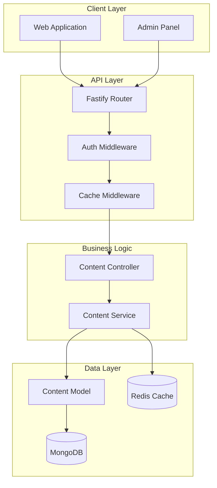
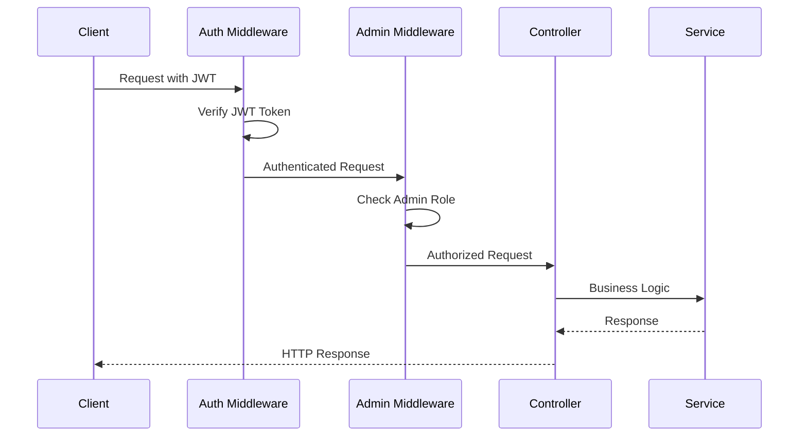
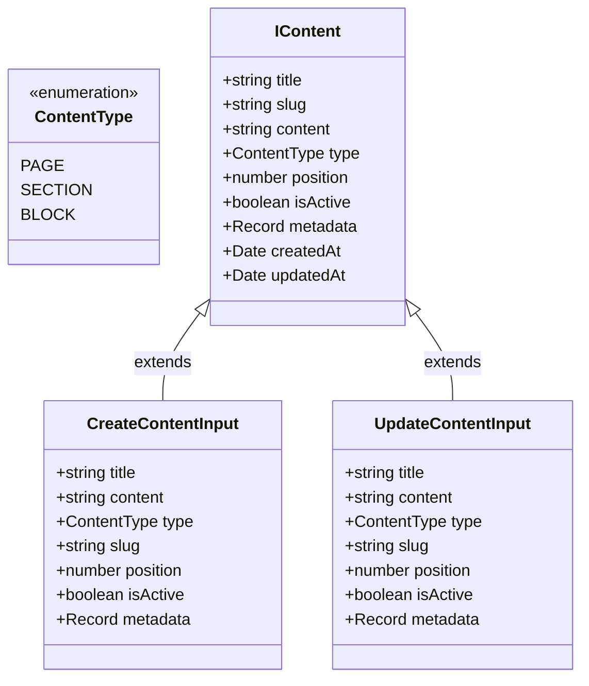
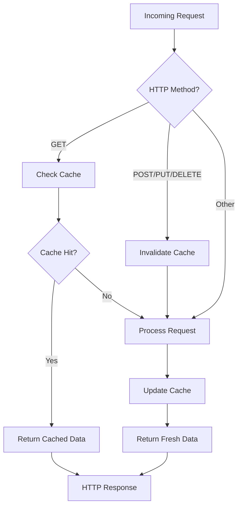
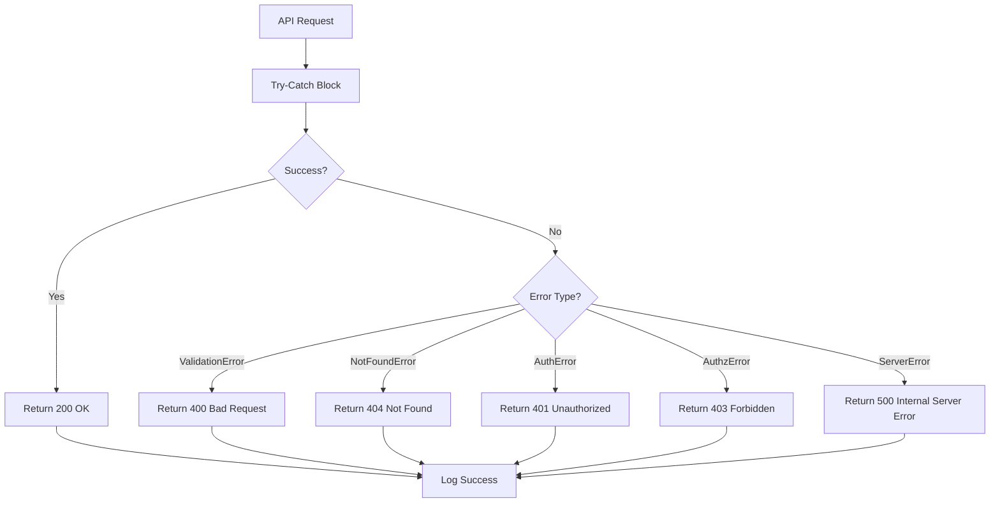

# Content API Documentation

<cite>
**Referenced Files in This Document**
- [content.controller.ts](file://api-fastify/src/controllers/content.controller.ts)
- [content.service.ts](file://api-fastify/src/services/content.service.ts)
- [content.model.ts](file://api-fastify/src/models/content.model.ts)
- [content.types.ts](file://api-fastify/src/types/content.types.ts)
- [content.routes.ts](file://api-fastify/src/routes/content.routes.ts)
- [content.schema.ts](file://api-fastify/src/schemas/content.schema.ts)
- [auth.middleware.ts](file://api-fastify/src/middlewares/auth.middleware.ts)
- [cache.middleware.ts](file://api-fastify/src/middlewares/cache.middleware.ts)
- [cache.service.ts](file://api-fastify/src/services/cache.service.ts)
- [cache-invalidation.ts](file://api-fastify/src/utils/cache-invalidation.ts)
- [Home.tsx](file://src/pages/Home.tsx)
- [seed.ts](file://api-fastify/src/scripts/seed.ts)
</cite>

## Table of Contents
1. [Introduction](#introduction)
2. [API Overview](#api-overview)
3. [Authentication & Authorization](#authentication--authorization)
4. [Content Types](#content-types)
5. [Endpoints Reference](#endpoints-reference)
6. [Request/Response Schemas](#requestresponse-schemas)
7. [Caching Strategy](#caching-strategy)
8. [Error Handling](#error-handling)
9. [Content Management Workflow](#content-management-workflow)
10. [Best Practices](#best-practices)

## Introduction

The Content API provides comprehensive management capabilities for static content sections in the MERN_chatai_blog platform. This API handles the creation, retrieval, updating, and deletion of various content types including homepage banners, featured sections, page content, and CMS-managed sections. The API follows RESTful principles and implements robust authentication, authorization, and caching mechanisms to ensure secure and efficient content delivery.

## API Overview

The Content API is built using Fastify framework and provides endpoints under `/api/content`. It supports multiple content types and implements role-based access control with JWT authentication. The API integrates with Redis caching for improved performance and includes automatic cache invalidation when content is modified.



**Diagram sources**
- [content.routes.ts](file://api-fastify/src/routes/content.routes.ts#L1-L79)
- [auth.middleware.ts](file://api-fastify/src/middlewares/auth.middleware.ts#L1-L128)
- [cache.middleware.ts](file://api-fastify/src/middlewares/cache.middleware.ts#L1-L25)

## Authentication & Authorization

All content modification endpoints require JWT authentication and admin privileges. The API implements a two-tier middleware system:

### Authentication Middleware
- Validates JWT tokens from cookies or Authorization headers
- Extracts user information from verified tokens
- Provides detailed error messages for authentication failures

### Authorization Middleware
- Restricts access to admin-only endpoints
- Verifies user roles against required permissions
- Returns appropriate HTTP status codes for unauthorized access



**Diagram sources**
- [auth.middleware.ts](file://api-fastify/src/middlewares/auth.middleware.ts#L10-L50)
- [content.routes.ts](file://api-fastify/src/routes/content.routes.ts#L35-L70)

**Section sources**
- [auth.middleware.ts](file://api-fastify/src/middlewares/auth.middleware.ts#L1-L128)
- [content.routes.ts](file://api-fastify/src/routes/content.routes.ts#L35-L70)

## Content Types

The Content API supports three distinct content types, each serving specific purposes in the CMS system:

### Content Type Definitions



**Diagram sources**
- [content.types.ts](file://api-fastify/src/types/content.types.ts#L1-L51)
- [content.model.ts](file://api-fastify/src/models/content.model.ts#L1-L54)

### Content Type Details

| Type | Purpose | Use Cases |
|------|---------|-----------|
| **PAGE** | Complete web pages | About pages, Terms of Service, Contact forms |
| **SECTION** | Content sections | Homepage banners, featured areas, footer content |
| **BLOCK** | Individual content blocks | Text blocks, image galleries, call-to-action elements |

**Section sources**
- [content.types.ts](file://api-fastify/src/types/content.types.ts#L5-L15)
- [content.model.ts](file://api-fastify/src/models/content.model.ts#L15-L25)

## Endpoints Reference

### GET /api/content

**Description**: Retrieve all content items with optional filtering by type and active status.

**Authentication**: Optional (public access for content retrieval)

**Parameters**:
- `type` (optional): Filter by content type (page, section, block)
- `isActive` (optional): Filter by activation status

**Response**: Array of content objects with basic information

### GET /api/content/:slug

**Description**: Retrieve a specific content item by slug.

**Authentication**: Optional (public access)

**Parameters**:
- `slug`: Unique identifier for the content

**Response**: Full content object including content field

### POST /api/content

**Description**: Create a new content item.

**Authentication**: Required (admin only)

**Authorization**: Admin role required

**Request Body**: Content creation data

**Response**: Success message and basic content information

### PUT /api/content/:id

**Description**: Update an existing content item.

**Authentication**: Required (admin only)

**Authorization**: Admin role required

**Parameters**:
- `id`: MongoDB ObjectId of the content to update

**Request Body**: Partial content update data

**Response**: Success message and updated content information

### DELETE /api/content/:id

**Description**: Delete a content item.

**Authentication**: Required (admin only)

**Authorization**: Admin role required

**Parameters**:
- `id`: MongoDB ObjectId of the content to delete

**Response**: Success message

**Section sources**
- [content.routes.ts](file://api-fastify/src/routes/content.routes.ts#L1-L79)
- [content.controller.ts](file://api-fastify/src/controllers/content.controller.ts#L1-L209)

## Request/Response Schemas

### Get All Content Schema

```typescript
interface GetAllContentResponse {
  contents: Array<{
    _id: string;
    title: string;
    slug: string;
    type: ContentType;
    position: number;
    isActive: boolean;
    createdAt: string;
    updatedAt: string;
  }>;
}
```

### Get Content by Slug Schema

```typescript
interface GetContentResponse {
  content: {
    _id: string;
    title: string;
    slug: string;
    content: string;
    type: ContentType;
    position: number;
    isActive: boolean;
    metadata: Record<string, any>;
    createdAt: string;
    updatedAt: string;
  };
}
```

### Create Content Schema

```typescript
interface CreateContentRequest {
  title: string;
  content: string;
  type: ContentType;
  slug?: string;
  position?: number;
  isActive?: boolean;
  metadata?: Record<string, any>;
}

interface CreateContentResponse {
  message: string;
  content: {
    _id: string;
    title: string;
    slug: string;
  };
}
```

### Update Content Schema

```typescript
interface UpdateContentRequest {
  title?: string;
  content?: string;
  type?: ContentType;
  slug?: string;
  position?: number;
  isActive?: boolean;
  metadata?: Record<string, any>;
}
```

**Section sources**
- [content.schema.ts](file://api-fastify/src/schemas/content.schema.ts#L1-L202)
- [content.types.ts](file://api-fastify/src/types/content.types.ts#L25-L51)

## Caching Strategy

The Content API implements a sophisticated caching mechanism using Redis to improve performance and reduce database load. The caching strategy includes automatic cache invalidation and intelligent cache key generation.

### Cache Implementation



**Diagram sources**
- [cache.middleware.ts](file://api-fastify/src/middlewares/cache.middleware.ts#L1-L25)
- [cache.service.ts](file://api-fastify/src/services/cache.service.ts#L1-L58)

### Cache Key Strategy

- **Cache Keys**: Generated using URL patterns (`cache:/api/content*`)
- **TTL**: Default 300 seconds (5 minutes)
- **Invalidation**: Automatic when content is modified
- **Scope**: Public content endpoints only

### Cache Invalidation

The API implements targeted cache invalidation to ensure data consistency:

```typescript
// Invalidate content-related caches
await cache.del('cache:/api/content*');
await cache.del('cache:/api/content/:slug*');
```

**Section sources**
- [cache.middleware.ts](file://api-fastify/src/middlewares/cache.middleware.ts#L1-L25)
- [cache.service.ts](file://api-fastify/src/services/cache.service.ts#L1-L58)
- [cache-invalidation.ts](file://api-fastify/src/utils/cache-invalidation.ts#L1-L18)

## Error Handling

The Content API implements comprehensive error handling with specific error codes and meaningful error messages for different scenarios.

### Common Error Responses

| Status Code | Scenario | Error Message |
|-------------|----------|---------------|
| 400 | Invalid content data | "Un contenu avec ce slug existe déjà" |
| 400 | Invalid ID format | "ID contenu invalide" |
| 404 | Content not found | "Contenu non trouvé" |
| 401 | Authentication required | "Non autorisé - Veuillez vous connecter" |
| 403 | Insufficient permissions | "Accès refusé - Droits d'administrateur requis" |
| 500 | Internal server error | Generic error message |

### Error Handling Flow



**Diagram sources**
- [content.controller.ts](file://api-fastify/src/controllers/content.controller.ts#L15-L209)

**Section sources**
- [content.controller.ts](file://api-fastify/src/controllers/content.controller.ts#L15-L209)
- [content.service.ts](file://api-fastify/src/services/content.service.ts#L1-L158)

## Content Management Workflow

### Creating Content

1. **Authentication**: Admin user authenticates with JWT token
2. **Validation**: Request data validated against schema
3. **Slug Generation**: Automatic slug generation if not provided
4. **Uniqueness Check**: Ensures slug doesn't conflict with existing content
5. **Persistence**: Content saved to MongoDB
6. **Cache Invalidation**: Related caches invalidated
7. **Response**: Success message with basic content info

### Updating Content

1. **Authentication**: Admin verification
2. **Existence Check**: Validates content ID exists
3. **Slug Update**: Generates new slug if title changes
4. **Conflict Check**: Ensures new slug uniqueness
5. **Update**: Applies changes to database
6. **Cache Invalidation**: Updates relevant caches
7. **Response**: Success message with updated info

### Retrieving Content

1. **Authentication**: Optional for public content
2. **Visibility Check**: Filters inactive content for non-admin users
3. **Caching**: Checks Redis cache first
4. **Database Query**: Retrieves from MongoDB if cache miss
5. **Response**: Content data with appropriate headers

**Section sources**
- [content.service.ts](file://api-fastify/src/services/content.service.ts#L1-L158)
- [content.controller.ts](file://api-fastify/src/controllers/content.controller.ts#L1-L209)

## Best Practices

### Content Design Guidelines

1. **Slug Structure**: Use descriptive, URL-friendly slugs
2. **Content Organization**: Group related content by type and purpose
3. **Metadata Usage**: Leverage metadata for additional content properties
4. **Position Management**: Use position field for content ordering
5. **Activation Control**: Use isActive flag for content lifecycle management

### Performance Optimization

1. **Caching Strategy**: Leverage Redis caching for frequently accessed content
2. **Index Usage**: Database indexes optimize query performance
3. **Selective Fields**: Use projection to limit returned fields
4. **Batch Operations**: Group related content operations when possible

### Security Considerations

1. **Authentication**: Always require JWT for content modification
2. **Authorization**: Implement role-based access control
3. **Input Validation**: Strict schema validation prevents injection attacks
4. **Rate Limiting**: Implement rate limiting for API endpoints
5. **Audit Logging**: Log all content modification activities

### Example Usage Patterns

#### Fetching Featured Content

```javascript
// Fetch all active sections for homepage
const response = await fetch('/api/content?type=section&isActive=true');
const { contents } = await response.json();
```

#### Updating Homepage Banner

```javascript
// Update homepage banner content
const response = await fetch('/api/content/home-banner', {
  method: 'PUT',
  headers: {
    'Authorization': 'Bearer YOUR_JWT_TOKEN',
    'Content-Type': 'application/json'
  },
  body: JSON.stringify({
    content: '# New Banner Content\nUpdated message here',
    isActive: true
  })
});
```

#### Creating a New Page

```javascript
// Create a new terms of service page
const response = await fetch('/api/content', {
  method: 'POST',
  headers: {
    'Authorization': 'Bearer YOUR_JWT_TOKEN',
    'Content-Type': 'application/json'
  },
  body: JSON.stringify({
    title: 'Terms of Service',
    type: 'page',
    content: 'Full terms and conditions...',
    isActive: true
  })
});
```

**Section sources**
- [seed.ts](file://api-fastify/src/scripts/seed.ts#L361-L419)
- [Home.tsx](file://src/pages/Home.tsx#L499-L550)