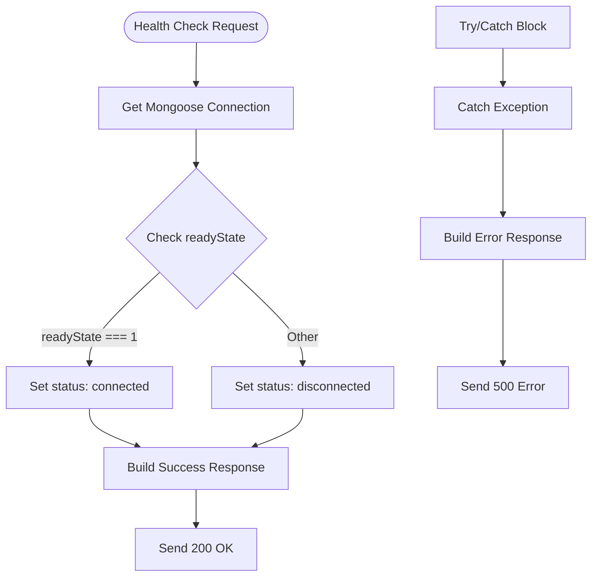
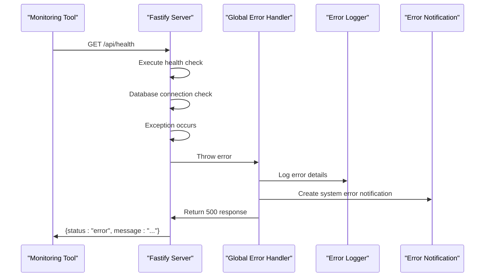
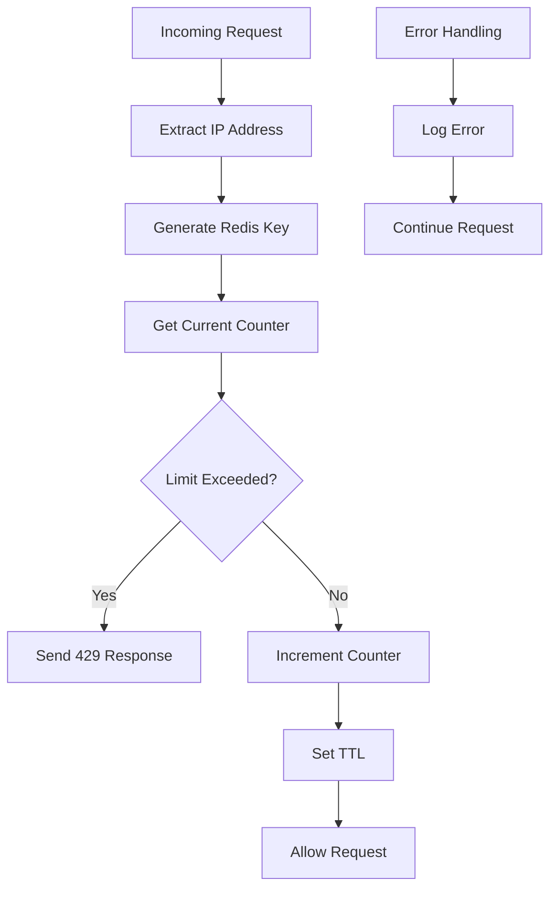

# Health Check API Documentation

<cite>
**Referenced Files in This Document**
- [health.routes.ts](file://api-fastify/src/routes/health.routes.ts)
- [health.controller.ts](file://api-fastify/src/controllers/health.controller.ts)
- [database.ts](file://api-fastify/src/config/database.ts)
- [cache.service.ts](file://api-fastify/src/services/cache.service.ts)
- [rate-limit.middleware.ts](file://api-fastify/src/middlewares/rate-limit.middleware.ts)
- [error-logger.middleware.ts](file://api-fastify/src/middlewares/error-logger.middleware.ts)
- [error-notification.middleware.ts](file://api-fastify/src/middlewares/error-notification.middleware.ts)
- [notification-hooks.service.ts](file://api-fastify/src/services/notification-hooks.service.ts)
- [server.ts](file://api-fastify/src/server.ts)
- [ConnectionMonitor.ts](file://src/services/ConnectionMonitor.ts)
- [index.ts](file://api-fastify/src/routes/index.ts)
</cite>

## Table of Contents
1. [Introduction](#introduction)
2. [Endpoint Specification](#endpoint-specification)
3. [Response Format](#response-format)
4. [Implementation Details](#implementation-details)
5. [Security Considerations](#security-considerations)
6. [Integration with Monitoring Systems](#integration-with-monitoring-systems)
7. [Error Handling](#error-handling)
8. [Rate Limiting](#rate-limiting)
9. [Testing and Validation](#testing-and-validation)
10. [Best Practices](#best-practices)

## Introduction

The Health Check API endpoint (`/api/health`) is a critical component of the MERN_chatai_blog system designed to monitor system status and availability. This endpoint provides essential information about the health of the application, including database connectivity, Redis cache status, and system uptime. It serves as a foundation for automated monitoring, deployment pipelines, and operational dashboards.

The health check endpoint follows RESTful principles and implements comprehensive error detection, logging, and notification mechanisms to ensure reliable system monitoring and rapid issue identification.

## Endpoint Specification

### HTTP Method and URL
- **Method**: `GET`
- **URL**: `/api/health`
- **Content-Type**: `application/json`
- **Authentication**: Not required for basic health checks

### Request Headers
```http
Accept: application/json
```

### Response Status Codes
- **200 OK**: System is healthy and operational
- **500 Internal Server Error**: System error occurred during health check

## Response Format

### Successful Response (200 OK)
```json
{
  "status": "ok",
  "timestamp": "2024-01-15T10:30:45.123Z",
  "database": {
    "status": "connected"
  },
  "environment": "production",
  "version": "1.2.3"
}
```

### Error Response (500 Internal Server Error)
```json
{
  "status": "error",
  "message": "Une erreur est survenue lors de la vérification de la santé de l'API"
}
```

### Response Fields Description

| Field | Type | Description |
|-------|------|-------------|
| `status` | string | Overall system status (`ok` or `error`) |
| `timestamp` | string | ISO 8601 formatted timestamp |
| `database.status` | string | Database connection status (`connected` or `disconnected`) |
| `environment` | string | Current Node.js environment (`development`, `production`, etc.) |
| `version` | string | Application version from package.json |

## Implementation Details

### Controller Implementation

The health check controller implements a straightforward yet robust health verification mechanism:

```typescript
export const checkHealth = async (
  _request: FastifyRequest,
  reply: FastifyReply
) => {
  try {
    // Vérifier la connexion à la base de données
    const dbStatus = mongoose.connection.readyState === 1 ? 'connected' : 'disconnected';

    // Retourner la réponse
    return reply.status(200).send({
      status: 'ok',
      timestamp: new Date().toISOString(),
      database: {
        status: dbStatus,
      },
      environment: process.env.NODE_ENV || 'development',
      version: process.env.npm_package_version || '1.0.0',
    });
  } catch (error) {
    return reply.status(500).send({
      status: 'error',
      message: 'Une erreur est survenue lors de la vérification de la santé de l\'API',
    });
  }
};
```

### Database Connection Verification

The health check verifies database connectivity using Mongoose's connection state:



**Diagram sources**
- [health.controller.ts](file://api-fastify/src/controllers/health.controller.ts#L8-L31)

### Route Registration

The health route is registered with the Fastify server using a dedicated route module:

```typescript
export async function healthRoutes(fastify: FastifyInstance): Promise<void> {
  // Route pour vérifier la santé de l'API
  fastify.get('/', HealthController.checkHealth);
}
```

**Section sources**
- [health.routes.ts](file://api-fastify/src/routes/health.routes.ts#L7-L11)
- [health.controller.ts](file://api-fastify/src/controllers/health.controller.ts#L8-L31)

## Security Considerations

### Authentication Requirements

The health check endpoint does not require authentication for basic health checks, making it accessible to:
- Load balancers and reverse proxies
- Monitoring systems and alerting tools
- Deployment pipelines and CI/CD systems
- Manual testing and debugging

### Security Implications

While the lack of authentication simplifies monitoring integration, it introduces several security considerations:

1. **Information Disclosure**: The endpoint reveals system status and potentially sensitive information
2. **Denial of Service**: Frequent health checks could impact system performance
3. **Abuse Prevention**: Rate limiting is essential to prevent malicious probing

### Mitigation Strategies

1. **Rate Limiting**: Implemented to prevent abuse
2. **Logging**: Comprehensive error logging for security monitoring
3. **Minimal Information**: Only essential health information is exposed
4. **Network Security**: Deploy behind firewalls and load balancers

## Integration with Monitoring Systems

### Frontend Connection Monitor

The frontend implements a sophisticated connection monitoring service that utilizes the health check endpoint:

```typescript
export class ConnectionMonitor {
  private config: ConnectionMonitorConfig = {
    checkInterval: 30000, // 30 seconds
    timeout: 5000, // 5 seconds
    endpoint: '/api/health',
    ...config
  }
}
```

### Integration Patterns

#### Basic Health Monitoring
```javascript
// Simple polling for system status
const checkHealth = async () => {
  try {
    const response = await fetch('/api/health');
    return response.ok;
  } catch {
    return false;
  }
};
```

#### Advanced Connection Monitoring
```javascript
// Using ConnectionMonitor for sophisticated status tracking
const monitor = new ConnectionMonitor({
  checkInterval: 30000,
  timeout: 5000
});

monitor.subscribe(status => {
  console.log('Connection status:', status);
});
```

### Deployment Pipeline Integration

The health check endpoint integrates seamlessly with various deployment scenarios:

```yaml
# Example Kubernetes readiness probe
readinessProbe:
  httpGet:
    path: /api/health
    port: 3000
  initialDelaySeconds: 5
  periodSeconds: 10

# Example Docker Compose health check
healthcheck:
  test: ["CMD", "curl", "-f", "http://localhost:3000/api/health"]
  interval: 30s
  timeout: 10s
  retries: 3
```

**Section sources**
- [ConnectionMonitor.ts](file://src/services/ConnectionMonitor.ts#L10-L20)

## Error Handling

### Global Error Handler Integration

The health check endpoint benefits from the application's comprehensive error handling system:



**Diagram sources**
- [server.ts](file://api-fastify/src/server.ts#L140-L160)
- [error-notification.middleware.ts](file://api-fastify/src/middlewares/error-notification.middleware.ts#L8-L25)

### Error Scenarios and Responses

#### Database Connection Failure
- **Cause**: MongoDB connection lost or unreachable
- **Response**: 500 Internal Server Error with generic error message
- **Notification**: System error notification created asynchronously

#### Redis Cache Unavailability
- **Cause**: Redis service not responding
- **Impact**: Rate limiting disabled, cache operations fail silently
- **Response**: Health check continues with reduced functionality

#### Network Timeout
- **Cause**: Health check request timing out
- **Response**: 500 Internal Server Error
- **Notification**: Error logged and system notification sent

### Error Recovery Mechanisms

The system implements several error recovery strategies:

1. **Graceful Degradation**: Health check continues even if secondary services fail
2. **Asynchronous Notifications**: Error notifications don't block health check response
3. **Circuit Breaker Pattern**: Prevents cascading failures in monitoring systems

**Section sources**
- [server.ts](file://api-fastify/src/server.ts#L140-L160)
- [error-notification.middleware.ts](file://api-fastify/src/middlewares/error-notification.middleware.ts#L8-L25)
- [notification-hooks.service.ts](file://api-fastify/src/services/notification-hooks.service.ts#L40-L55)

## Rate Limiting

### Implementation Details

The health check endpoint implements rate limiting to prevent abuse and ensure system stability:

```typescript
export function createRateLimitMiddleware(options: RateLimitOptions) {
  const {
    windowMs,
    maxRequests,
    keyGenerator = (request: FastifyRequest) => request.ip,
  } = options;

  return async (request: FastifyRequest, reply: FastifyReply) => {
    try {
      const key = `rate_limit:${keyGenerator(request)}`;
      const windowStart = Math.floor(Date.now() / windowMs) * windowMs;
      const windowKey = `${key}:${windowStart}`;

      // Récupérer le nombre de requêtes dans la fenêtre actuelle
      const currentRequests = await cache.get<number>(windowKey) || 0;

      // Vérifier si la limite est dépassée
      if (currentRequests >= maxRequests) {
        const resetTime = windowStart + windowMs;
        const retryAfter = Math.ceil((resetTime - Date.now()) / 1000);

        reply.header('X-RateLimit-Limit', maxRequests);
        reply.header('X-RateLimit-Remaining', 0);
        reply.header('X-RateLimit-Reset', resetTime);
        reply.header('Retry-After', retryAfter);

        return reply.status(429).send({
          message: 'Trop de requêtes. Veuillez réessayer plus tard.',
          retryAfter,
        });
      }

      // Incrémenter le compteur
      const newCount = currentRequests + 1;
      const ttl = Math.ceil((windowStart + windowMs - Date.now()) / 1000);
      await cache.set(windowKey, newCount, ttl);
    } catch (error) {
      // En cas d'erreur avec Redis, on laisse passer la requête
      request.log.error('Erreur dans le rate limiting:', error);
    }
  };
}
```

### Rate Limiting Configuration

| Parameter | Value | Purpose |
|-----------|-------|---------|
| Window Size | 60 seconds | Time window for counting requests |
| Max Requests | 100 per minute | Maximum requests per IP address |
| Key Generator | IP address | Unique identifier for rate limiting |
| TTL | Dynamic | Automatic cleanup of rate limit counters |

### Rate Limit Headers

When rate limit is exceeded, the following headers are included:

- `X-RateLimit-Limit`: Maximum requests allowed in window
- `X-RateLimit-Remaining`: Remaining requests in current window
- `X-RateLimit-Reset`: Timestamp when limit resets
- `Retry-After`: Seconds until rate limit resets

### Redis Integration

The rate limiting system uses Redis for distributed rate limiting:



**Diagram sources**
- [rate-limit.middleware.ts](file://api-fastify/src/middlewares/rate-limit.middleware.ts#L15-L50)

**Section sources**
- [rate-limit.middleware.ts](file://api-fastify/src/middlewares/rate-limit.middleware.ts#L15-L50)

## Testing and Validation

### Manual Testing

#### Basic Health Check Test
```bash
curl -v http://localhost:3000/api/health
```

Expected response:
```json
{
  "status": "ok",
  "timestamp": "2024-01-15T10:30:45.123Z",
  "database": {
    "status": "connected"
  },
  "environment": "development",
  "version": "1.0.0"
}
```

#### Error Scenario Test
1. Stop MongoDB service
2. Make health check request
3. Expected response: 500 Internal Server Error

### Automated Testing

#### Unit Test Example
```typescript
describe('Health Check Endpoint', () => {
  it('should return 200 when database is connected', async () => {
    const response = await request(app)
      .get('/api/health')
      .expect(200);
    
    expect(response.body.status).toBe('ok');
    expect(response.body.database.status).toBe('connected');
  });

  it('should return 500 when database is disconnected', async () => {
    // Mock database disconnection
    jest.spyOn(mongoose.connection, 'readyState', 'get').mockReturnValue(0);
    
    const response = await request(app)
      .get('/api/health')
      .expect(500);
    
    expect(response.body.status).toBe('error');
  });
});
```

### Integration Testing

#### Load Testing
```bash
# Using Apache Bench
ab -n 1000 -c 10 http://localhost:3000/api/health

# Using Artillery
artillery quick --count 10 --num 1000 http://localhost:3000/api/health
```

#### Performance Metrics
- **Response Time**: Target < 100ms
- **Throughput**: Target > 1000 requests/second
- **Error Rate**: Target < 0.1%

## Best Practices

### Monitoring Integration

#### Prometheus Metrics
```yaml
# Example Prometheus scrape configuration
scrape_configs:
  - job_name: 'mern-chatai-blog'
    metrics_path: /api/health
    static_configs:
      - targets: ['localhost:3000']
    scrape_interval: 30s
```

#### Grafana Dashboard
- **Uptime Percentage**: Track system availability over time
- **Response Time**: Monitor health check latency
- **Error Rate**: Track health check failure rate
- **Database Status**: Visualize database connectivity

### Operational Guidelines

#### Alerting Rules
```yaml
groups:
  - name: mern-chatai-blog
    rules:
      - alert: HealthCheckFailed
        expr: up{job="mern-chatai-blog"} == 0
        for: 1m
        labels:
          severity: critical
        annotations:
          summary: "Health check failed"
          description: "Health check endpoint is not responding"
```

#### Maintenance Procedures
1. **Regular Health Checks**: Verify endpoint functionality daily
2. **Rate Limit Tuning**: Adjust limits based on monitoring data
3. **Error Review**: Investigate error patterns weekly
4. **Documentation Updates**: Keep documentation current with changes

### Security Hardening

#### Network Security
- Deploy behind firewall
- Use HTTPS in production
- Implement IP whitelisting for sensitive environments
- Monitor for unusual health check patterns

#### Access Control
- Restrict access to internal networks only
- Use VPN for administrative health checks
- Implement audit logging for health check access
- Regular security assessments

### Performance Optimization

#### Caching Strategy
- Implement local caching for frequent checks
- Use CDN for geographically distributed monitoring
- Optimize database connection pooling
- Monitor Redis cache performance

#### Scalability Considerations
- Horizontal scaling support
- Load balancer health check integration
- Auto-scaling based on health metrics
- Resource utilization monitoring