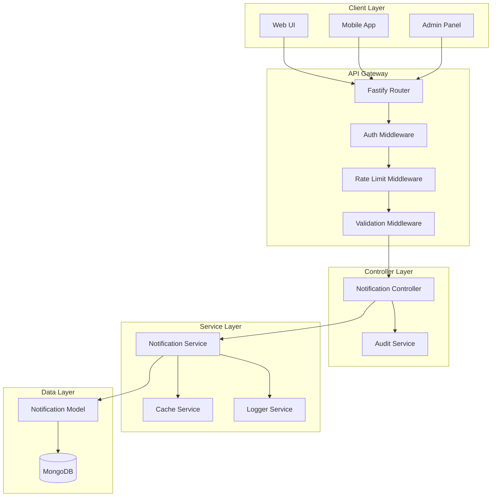
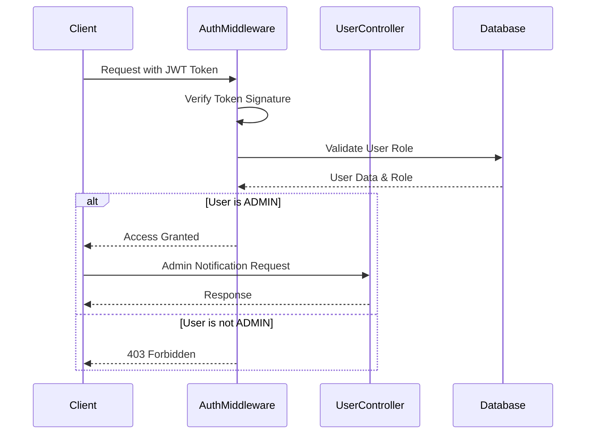
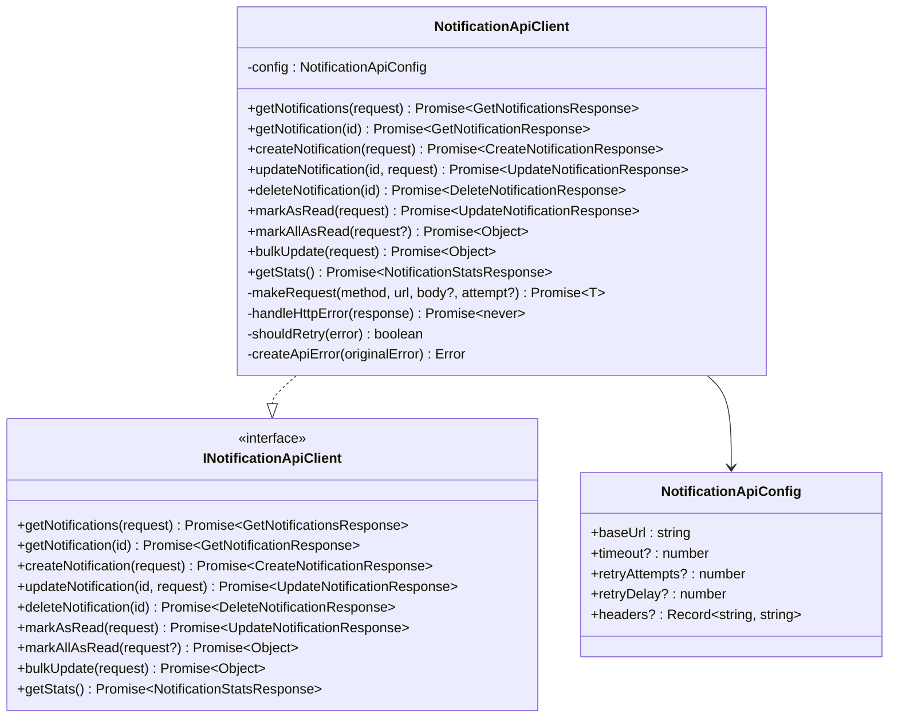
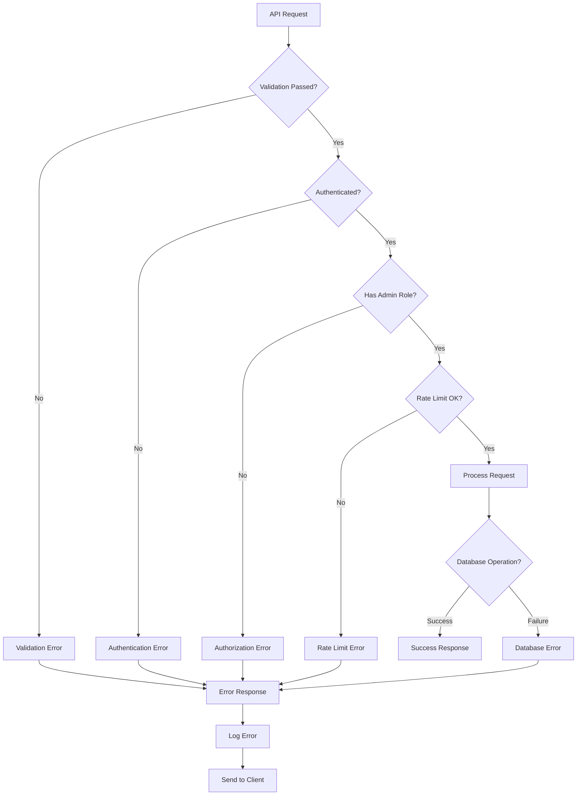

# Notifications API Documentation

<cite>
**Referenced Files in This Document**
- [notification.controller.ts](file://api-fastify/src/controllers/notification.controller.ts)
- [notification.service.ts](file://api-fastify/src/services/notification.service.ts)
- [notification.model.ts](file://api-fastify/src/models/notification.model.ts)
- [notification.types.ts](file://api-fastify/src/types/notification.types.ts)
- [notification.routes.ts](file://api-fastify/src/routes/notification.routes.ts)
- [auth.middleware.ts](file://api-fastify/src/middlewares/auth.middleware.ts)
- [rate-limit.middleware.ts](file://api-fastify/src/middlewares/rate-limit.middleware.ts)
- [notification-audit.service.ts](file://api-fastify/src/services/notification-audit.service.ts)
- [NotificationApiClient.ts](file://src/services/NotificationApiClient.ts)
- [NotificationApi.ts](file://src/types/NotificationApi.ts)
- [AdminNotification.ts](file://src/types/AdminNotification.ts)
- [NotificationService.ts](file://src/services/NotificationService.ts)
- [NotificationPanel.tsx](file://src/components/admin/NotificationPanel.tsx)
</cite>

## Table of Contents
1. [Introduction](#introduction)
2. [Architecture Overview](#architecture-overview)
3. [Authentication & Security](#authentication--security)
4. [Core Endpoints](#core-endpoints)
5. [Request/Response Schemas](#requestresponse-schemas)
6. [Client Implementation](#client-implementation)
7. [Error Handling](#error-handling)
8. [Performance Considerations](#performance-considerations)
9. [Integration Examples](#integration-examples)
10. [Troubleshooting Guide](#troubleshooting-guide)

## Introduction

The Notifications API is a comprehensive system designed for managing administrative notifications within the MERN_chatai_blog platform. This API provides endpoints for creating, reading, updating, and managing system notifications with robust security, rate limiting, and audit capabilities. The system supports real-time updates, bulk operations, and integrates seamlessly with the frontend notification panel.

The API follows RESTful principles and implements JWT-based authentication with role-based access control. It includes sophisticated error handling, caching mechanisms, and performance optimizations to ensure reliable operation under various load conditions.

## Architecture Overview

The Notifications API follows a layered architecture with clear separation of concerns:



**Diagram sources**
- [notification.routes.ts](file://api-fastify/src/routes/notification.routes.ts#L1-L317)
- [notification.controller.ts](file://api-fastify/src/controllers/notification.controller.ts#L1-L217)
- [notification.service.ts](file://api-fastify/src/services/notification.service.ts#L1-L261)

**Section sources**
- [notification.routes.ts](file://api-fastify/src/routes/notification.routes.ts#L1-L50)
- [notification.controller.ts](file://api-fastify/src/controllers/notification.controller.ts#L1-L30)

## Authentication & Security

### JWT-Based Authentication

All admin notification endpoints require JWT authentication with administrator privileges. The system implements role-based access control to ensure only authorized administrators can access notification management functionality.



**Diagram sources**
- [auth.middleware.ts](file://api-fastify/src/middlewares/auth.middleware.ts#L40-L55)
- [notification.routes.ts](file://api-fastify/src/routes/notification.routes.ts#L10-L15)

### Rate Limiting

The system implements two-tier rate limiting:

1. **Standard Rate Limiting**: 100 requests per minute per user/IP
2. **Modification Rate Limiting**: 30 requests per minute per user/IP for sensitive operations

```typescript
// Standard rate limiting for read operations
export const notificationRateLimit = createRateLimitMiddleware({
  windowMs: 60 * 1000, // 1 minute
  maxRequests: 100,
  keyGenerator: (request: FastifyRequest) => {
    return request.user?._id || request.ip;
  },
  skipSuccessfulRequests: false,
  skipFailedRequests: true,
});

// Strict rate limiting for write operations
export const notificationModifyRateLimit = createRateLimitMiddleware({
  windowMs: 60 * 1000, // 1 minute
  maxRequests: 30,
  keyGenerator: (request: FastifyRequest) => {
    return request.user?._id || request.ip;
  },
  skipSuccessfulRequests: false,
  skipFailedRequests: true,
});
```

**Section sources**
- [auth.middleware.ts](file://api-fastify/src/middlewares/auth.middleware.ts#L40-L55)
- [rate-limit.middleware.ts](file://api-fastify/src/middlewares/rate-limit.middleware.ts#L60-L91)

## Core Endpoints

### GET /api/admin/notifications

Retrieves paginated notifications with optional filtering.

**Parameters:**
- `page` (optional): Page number (default: 1)
- `limit` (optional): Items per page (max: 100, default: 50)
- `unreadOnly` (optional): Filter unread notifications only

**Response:**
```typescript
{
  notifications: AdminNotification[],
  pagination: {
    currentPage: number,
    totalPages: number,
    totalNotifications: number,
    hasNextPage: boolean,
    hasPrevPage: boolean
  },
  unreadCount: number
}
```

### PATCH /api/admin/notifications/:id/read

Marks a specific notification as read.

**Response:**
```typescript
{
  message: string,
  notification: AdminNotification
}
```

### PATCH /api/admin/notifications/read-all

Marks all unread notifications as read.

**Response:**
```typescript
{
  message: string,
  modifiedCount: number
}
```

### POST /api/admin/notifications/cleanup

Manually triggers cleanup of old notifications (older than 30 days).

**Response:**
```typescript
{
  message: string,
  deletedCount: number
}
```

### GET /api/admin/notifications/cleanup/status

Retrieves the status of the automatic cleanup service.

**Response:**
```typescript
{
  message: string,
  status: {
    isRunning: boolean,
    intervalHours: number
  }
}
```

**Section sources**
- [notification.routes.ts](file://api-fastify/src/routes/notification.routes.ts#L20-L317)
- [notification.controller.ts](file://api-fastify/src/controllers/notification.controller.ts#L15-L217)

## Request/Response Schemas

### AdminNotification Schema

```typescript
interface AdminNotification {
  id: string;
  type: 'user_registered' | 'post_published' | 'system_error' | 'user_activity' | 'content_moderation';
  title: string;
  message: string;
  timestamp: Date;
  read: boolean;
  priority: 'low' | 'medium' | 'high';
  actionUrl?: string;
  metadata?: {
    userId?: string;
    postId?: string;
    username?: string;
    postTitle?: string;
    errorCode?: string;
  };
}
```

### CreateNotificationInput Schema

```typescript
interface CreateNotificationInput {
  type: AdminNotification['type'];
  title: string;
  message: string;
  priority?: AdminNotification['priority'];
  actionUrl?: string;
  metadata?: AdminNotification['metadata'];
}
```

### GetNotificationsQuery Schema

```typescript
interface GetNotificationsQuery {
  page?: number;
  limit?: number;
  unreadOnly?: boolean;
}
```

**Section sources**
- [notification.types.ts](file://api-fastify/src/types/notification.types.ts#L1-L48)
- [notification.model.ts](file://api-fastify/src/models/notification.model.ts#L1-L97)

## Client Implementation

### NotificationApiClient

The client-side implementation provides a comprehensive API client for interacting with the notification endpoints.



**Diagram sources**
- [NotificationApiClient.ts](file://src/services/NotificationApiClient.ts#L1-L299)
- [NotificationApi.ts](file://src/types/NotificationApi.ts#L150-L193)

### Key Features

1. **Automatic Retry Logic**: Configurable retry attempts with exponential backoff
2. **Error Handling**: Comprehensive error categorization and handling
3. **Request Validation**: Automatic parameter validation and sanitization
4. **Response Caching**: Intelligent caching for improved performance
5. **Timeout Management**: Configurable timeouts with graceful degradation

**Section sources**
- [NotificationApiClient.ts](file://src/services/NotificationApiClient.ts#L1-L100)
- [NotificationApi.ts](file://src/types/NotificationApi.ts#L1-L50)

## Error Handling

### Error Categories

The system implements comprehensive error handling with the following categories:



**Diagram sources**
- [notification.controller.ts](file://api-fastify/src/controllers/notification.controller.ts#L15-L50)
- [NotificationApiClient.ts](file://src/services/NotificationApiClient.ts#L150-L200)

### Error Response Formats

```typescript
// Validation Error
{
  success: false,
  error: {
    code: 'VALIDATION_ERROR',
    message: 'Invalid request parameters',
    validationErrors: [
      {
        field: 'title',
        message: 'Title is required',
        code: 'REQUIRED'
      }
    ]
  },
  timestamp: '2024-01-01T00:00:00Z'
}

// Authentication Error
{
  success: false,
  error: {
    code: 'AUTHENTICATION_ERROR',
    message: 'Invalid or missing token'
  },
  timestamp: '2024-01-01T00:00:00Z'
}

// Rate Limit Error
{
  success: false,
  error: {
    code: 'RATE_LIMIT_EXCEEDED',
    message: 'Too many requests',
    retryAfter: 60
  },
  timestamp: '2024-01-01T00:00:00Z'
}
```

**Section sources**
- [NotificationApi.ts](file://src/types/NotificationApi.ts#L50-L100)
- [NotificationApiClient.ts](file://src/services/NotificationApiClient.ts#L150-L200)

## Performance Considerations

### Caching Strategy

The system implements a multi-layer caching strategy:

1. **Redis Cache**: Distributed cache for rate limiting and session data
2. **Local Cache**: In-memory cache for frequently accessed notifications
3. **Browser Cache**: Client-side caching for improved user experience

### Database Optimization

```typescript
// MongoDB indexes for optimal performance
NotificationSchema.index({ timestamp: -1 });     // For chronological sorting
NotificationSchema.index({ read: 1 });         // For unread filtering
NotificationSchema.index({ type: 1 });         // For type-based queries
NotificationSchema.index({ priority: 1 });     // For priority-based filtering
```

### Polling Optimization

The client-side service implements intelligent polling:

- **Default Interval**: 30 seconds for notification updates
- **Adaptive Intervals**: Shorter intervals when new notifications arrive
- **Backoff Strategy**: Exponential backoff on errors
- **Debouncing**: Prevents excessive polling during bulk operations

### Memory Management

```typescript
// Automatic cleanup of old notifications
export async function cleanupOldNotifications(): Promise<{ deletedCount: number }> {
  try {
    const thirtyDaysAgo = new Date();
    thirtyDaysAgo.setDate(thirtyDaysAgo.getDate() - 30);

    const result = await Notification.deleteMany({
      timestamp: { $lt: thirtyDaysAgo }
    });

    logger.info(`${result.deletedCount} old notifications deleted`);
    return { deletedCount: result.deletedCount };
  } catch (error) {
    logger.error('Error cleaning up old notifications', error);
    throw new Error('Unable to clean up old notifications');
  }
}
```

**Section sources**
- [notification.model.ts](file://api-fastify/src/models/notification.model.ts#L70-L97)
- [notification.service.ts](file://api-fastify/src/services/notification.service.ts#L200-L261)
- [NotificationService.ts](file://src/services/NotificationService.ts#L200-L250)

## Integration Examples

### Fetching Unread Notifications

```javascript
// Using NotificationApiClient
const notifications = await notificationApiClient.getNotifications({
  filters: { read: false },
  limit: 20,
  sortBy: 'timestamp',
  sortOrder: 'desc'
});

console.log(`Found ${notifications.data.unreadCount} unread notifications`);
```

### Marking a Notification as Read

```javascript
// Using NotificationApiClient
try {
  const result = await notificationApiClient.markAsRead({
    notificationId: 'notification_12345'
  });
  
  console.log(`Notification marked as read:`, result.data.notification);
} catch (error) {
  console.error('Failed to mark notification as read:', error);
}
```

### Creating a System Alert

```javascript
// Using NotificationApiClient
const newNotification = await notificationApiClient.createNotification({
  type: 'system_error',
  title: 'Database Connection Lost',
  message: 'Unable to connect to primary database replica',
  priority: 'high',
  actionUrl: '/admin/system/databases',
  metadata: {
    errorCode: 'DB_CONN_TIMEOUT',
    component: 'database-service'
  }
});
```

### Bulk Operations

```javascript
// Using NotificationService
const service = createNotificationService(config, apiClient);

// Mark all notifications as read
await service.markAllAsRead();

// Get unread count
const unreadCount = await service.getUnreadCount();
console.log(`Unread notifications: ${unreadCount}`);
```

**Section sources**
- [NotificationApiClient.ts](file://src/services/NotificationApiClient.ts#L50-L150)
- [NotificationService.ts](file://src/services/NotificationService.ts#L50-L150)

## Troubleshooting Guide

### Common Issues and Solutions

#### 1. Authentication Failures

**Symptoms**: 401 Unauthorized responses
**Causes**: 
- Expired or invalid JWT token
- Missing authorization header
- Token signature verification failure

**Solutions**:
```typescript
// Check token validity
const token = localStorage.getItem('jwt_token');
if (!token) {
  // Redirect to login
  window.location.href = '/login';
}

// Refresh expired tokens
try {
  await refreshAuthToken();
} catch (error) {
  // Handle token refresh failure
}
```

#### 2. Rate Limiting Issues

**Symptoms**: 429 Too Many Requests
**Causes**:
- Exceeding rate limits
- Rapid consecutive requests
- Network latency causing retries

**Solutions**:
```typescript
// Implement exponential backoff
async function makeRequestWithBackoff(url, options, attempt = 1) {
  try {
    return await fetch(url, options);
  } catch (error) {
    if (error.status === 429 && attempt < MAX_RETRIES) {
      const delay = Math.pow(2, attempt) * 1000;
      await new Promise(resolve => setTimeout(resolve, delay));
      return makeRequestWithBackoff(url, options, attempt + 1);
    }
    throw error;
  }
}
```

#### 3. Network Connectivity Issues

**Symptoms**: Timeout errors, failed requests
**Causes**:
- Poor network connectivity
- Server overload
- DNS resolution failures

**Solutions**:
```typescript
// Implement connection monitoring
const connectionMonitor = new ConnectionMonitor({
  onOnline: () => {
    // Resume polling and sync notifications
    notificationService.startPolling();
  },
  onOffline: () => {
    // Pause polling and show offline indicator
    notificationService.stopPolling();
  }
});
```

#### 4. Database Performance Issues

**Symptoms**: Slow response times, timeouts
**Causes**:
- Large notification collections
- Missing database indexes
- Concurrent write operations

**Solutions**:
```typescript
// Optimize database queries
const notifications = await Notification.find(filter)
  .sort({ timestamp: -1 })
  .skip(skip)
  .limit(limit)
  .lean();

// Ensure proper indexing
db.notifications.createIndex({ timestamp: -1 });
db.notifications.createIndex({ read: 1 });
```

### Debugging Tools

#### Enable Debug Logging

```typescript
// Enable detailed logging
const debugConfig = {
  level: 'debug',
  transports: [
    new winston.transports.Console(),
    new winston.transports.File({ filename: 'notifications-debug.log' })
  ]
};

const logger = winston.createLogger(debugConfig);
```

#### Monitor API Performance

```typescript
// Track API response times
const startTime = Date.now();
const response = await fetch('/api/admin/notifications');
const endTime = Date.now();

console.log(`API response time: ${endTime - startTime}ms`);
```

**Section sources**
- [NotificationApiClient.ts](file://src/services/NotificationApiClient.ts#L200-L299)
- [notification-audit.service.ts](file://api-fastify/src/services/notification-audit.service.ts#L1-L50)