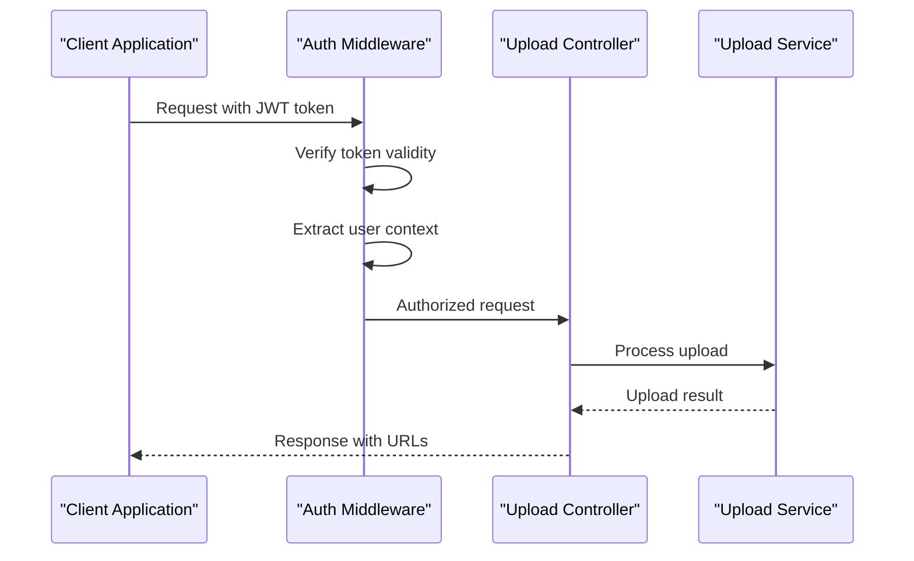
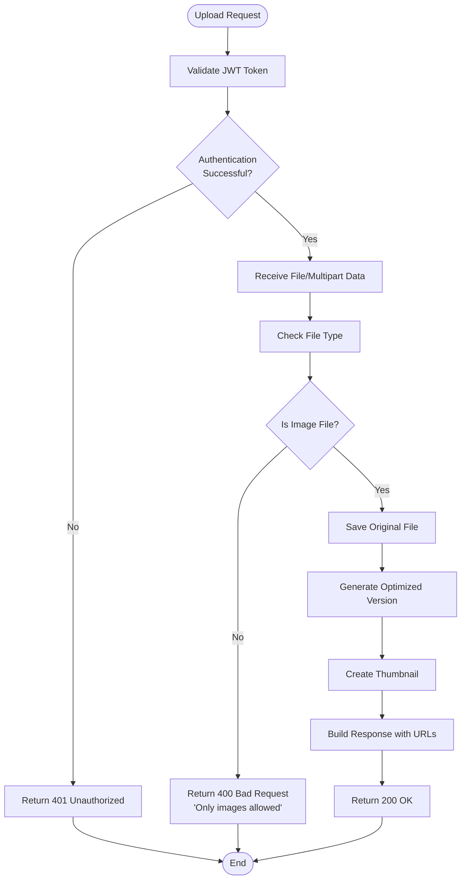
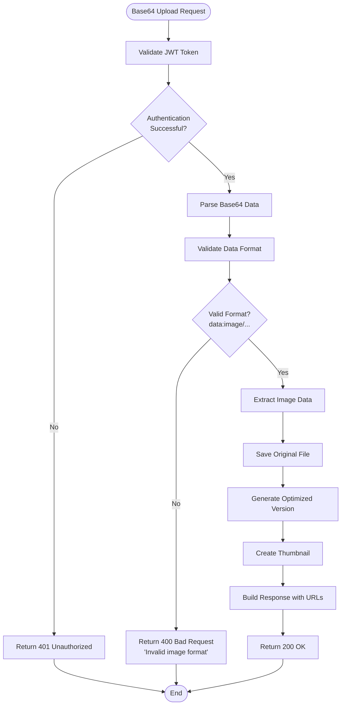
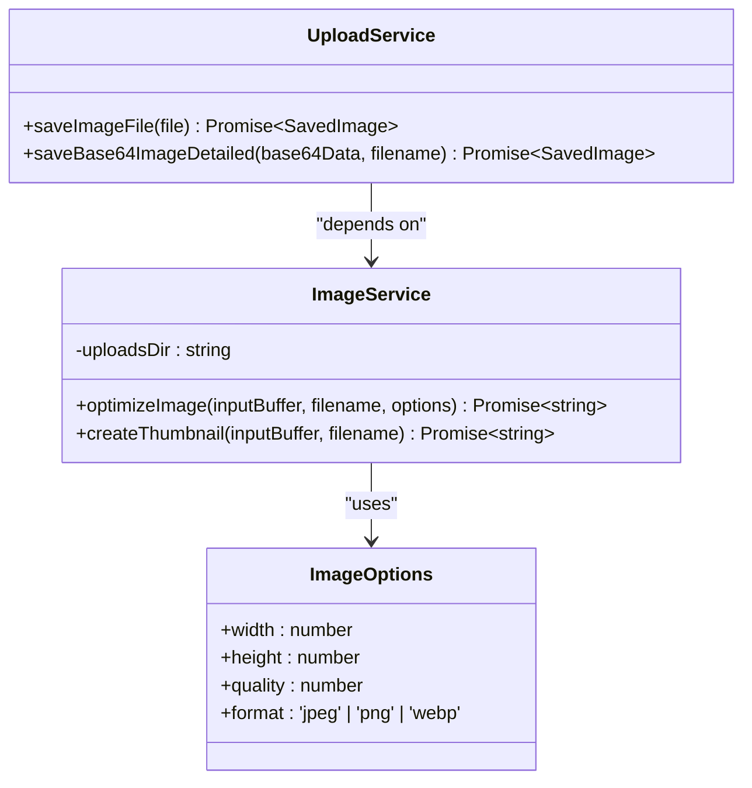
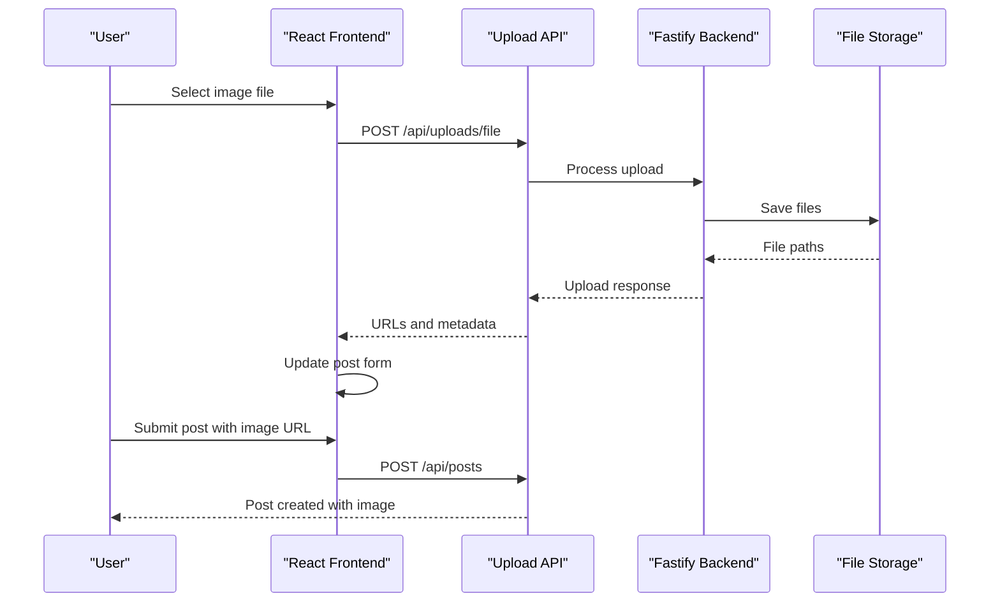
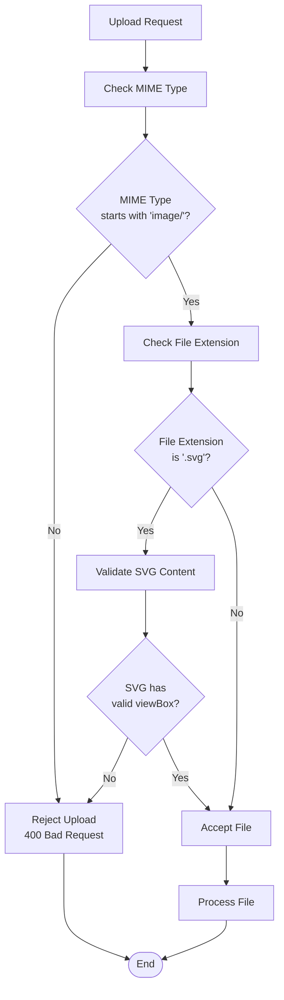

# Upload API Documentation

<cite>
**Referenced Files in This Document**
- [upload.routes.ts](file://api-fastify/src/routes/upload.routes.ts)
- [upload.controller.ts](file://api-fastify/src/controllers/upload.controller.ts)
- [upload.service.ts](file://api-fastify/src/services/upload.service.ts)
- [image.service.ts](file://api-fastify/src/services/image.service.ts)
- [auth.middleware.ts](file://api-fastify/src/middlewares/auth.middleware.ts)
- [MediaUpload.tsx](file://src/features/posts/components/PostForm/MediaUpload.tsx)
- [postApi.ts](file://src/features/posts/services/postApi.ts)
- [api.config.ts](file://src/config/api.config.ts)
- [user.model.ts](file://api-fastify/src/models/user.model.ts)
- [user.types.ts](file://api-fastify/src/types/user.types.ts)
</cite>

## Table of Contents
1. [Introduction](#introduction)
2. [API Endpoints](#api-endpoints)
3. [Authentication](#authentication)
4. [File Upload Workflow](#file-upload-workflow)
5. [Supported File Types](#supported-file-types)
6. [File Processing](#file-processing)
7. [Response Formats](#response-formats)
8. [Integration with Post Creation](#integration-with-post-creation)
9. [Security Considerations](#security-considerations)
10. [Error Handling](#error-handling)
11. [Frontend Integration](#frontend-integration)
12. [Best Practices](#best-practices)

## Introduction

The Upload API in MERN_chatai_blog provides comprehensive file upload capabilities specifically designed for handling images in posts and user content. Built on Fastify framework, it offers two main endpoints for uploading files: one for multipart form data and another for base64-encoded images. The API integrates seamlessly with the blog's post creation system and user profile management features.

## API Endpoints

### File Upload Endpoint

**POST** `/api/uploads/file`

Uploads files using multipart form data format. Supports image files with automatic optimization and thumbnail generation.

**Endpoint Details:**
- **Method:** POST
- **Content-Type:** `multipart/form-data`
- **Authentication:** Required (JWT Token)
- **Path:** `/api/uploads/file`

### Base64 Image Upload Endpoint

**POST** `/api/uploads/base64`

Uploads images encoded in base64 format. Automatically extracts image data and saves optimized versions.

**Endpoint Details:**
- **Method:** POST
- **Content-Type:** `application/json`
- **Authentication:** Required (JWT Token)
- **Path:** `/api/uploads/base64`

**Section sources**
- [upload.routes.ts](file://api-fastify/src/routes/upload.routes.ts#L10-L88)

## Authentication

All upload endpoints require authentication using JWT tokens. The authentication middleware validates the token and ensures the user has appropriate permissions.

### Authentication Requirements

- **Token Location:** Cookies or Authorization header
- **Required Role:** Any authenticated user
- **Token Format:** Bearer token
- **Validation:** JWT verification with user context

### Authentication Flow



**Diagram sources**
- [auth.middleware.ts](file://api-fastify/src/middlewares/auth.middleware.ts#L10-L40)
- [upload.controller.ts](file://api-fastify/src/controllers/upload.controller.ts#L25-L35)

**Section sources**
- [auth.middleware.ts](file://api-fastify/src/middlewares/auth.middleware.ts#L10-L127)
- [upload.routes.ts](file://api-fastify/src/routes/upload.routes.ts#L12-L15)

## File Upload Workflow

The upload process follows a structured workflow that handles file validation, storage, optimization, and response generation.

### File Upload Process



**Diagram sources**
- [upload.controller.ts](file://api-fastify/src/controllers/upload.controller.ts#L25-L60)
- [upload.service.ts](file://api-fastify/src/services/upload.service.ts#L40-L80)

### Base64 Upload Process



**Diagram sources**
- [upload.controller.ts](file://api-fastify/src/controllers/upload.controller.ts#L65-L100)
- [upload.service.ts](file://api-fastify/src/services/upload.service.ts#L85-L120)

**Section sources**
- [upload.controller.ts](file://api-fastify/src/controllers/upload.controller.ts#L25-L120)
- [upload.service.ts](file://api-fastify/src/services/upload.service.ts#L40-L165)

## Supported File Types

The Upload API primarily supports image files with automatic conversion to optimized formats.

### Supported Image Formats

- **JPEG/JPG**: Full support with quality optimization
- **PNG**: Transparent image support
- **WebP**: Modern format with excellent compression
- **GIF**: Animated and static images
- **SVG**: Vector graphics with validation
- **BMP**: Basic bitmap support

### File Size Limits

- **Default Limit**: 5MB per file
- **Maximum Size**: Configurable via frontend
- **Validation**: Automatic size checking during upload

### File Type Validation

```typescript
// Frontend validation example
const validateFile = async (file: File): Promise<boolean> => {
  // Check file type if accept is specified
  if (accept !== '*/*') {
    const acceptTypes = accept.split(',').map(type => type.trim());
    const fileType = file.type;
    const isValidType = acceptTypes.some(type => {
      if (type.includes('*')) {
        return fileType.startsWith(type.replace('*', ''));
      }
      return type === fileType;
    });

    if (!isValidType) {
      setError(`Type de fichier invalide. Types acceptés: ${accept}`);
      return false;
    }
  }

  // Check file size
  if (file.size > maxSize) {
    setError(`Fichier trop volumineux. Taille maximum: ${Math.round(maxSize / 1024 / 1024)}MB`);
    return false;
  }

  return true;
};
```

**Section sources**
- [MediaUpload.tsx](file://src/features/posts/components/PostForm/MediaUpload.tsx#L180-L220)

## File Processing

The upload service implements sophisticated file processing that includes optimization, thumbnail generation, and format conversion.

### Image Optimization

The system uses Sharp library for advanced image processing with configurable parameters.



**Diagram sources**
- [image.service.ts](file://api-fastify/src/services/image.service.ts#L10-L61)
- [upload.service.ts](file://api-fastify/src/services/upload.service.ts#L40-L80)

### Optimization Parameters

- **Original Width**: 1600px (configurable)
- **Quality**: 82% (WebP format)
- **Format**: WebP (default), JPEG, PNG
- **Thumbnail Size**: 300x200px
- **Thumbnail Quality**: 70%

### Storage Locations

Files are stored in the `uploads` directory with the following structure:

```
uploads/
├── [nanoid]-opt.[extension]     # Optimized version
├── [nanoid]-thumb.[extension]   # Thumbnail version
└── [nanoid].[extension]         # Original file
```

**Section sources**
- [image.service.ts](file://api-fastify/src/services/image.service.ts#L10-L61)
- [upload.service.ts](file://api-fastify/src/services/upload.service.ts#L40-L165)

## Response Formats

The API returns standardized responses with comprehensive metadata about uploaded files.

### Standard Upload Response

```json
{
  "message": "Fichier uploadé avec succès",
  "url": "http://localhost:4200/uploads/abc123def456.jpg",
  "urls": {
    "original": "http://localhost:4200/uploads/abc123def456.jpg",
    "optimized": "http://localhost:4200/uploads/abc123def456-opt.webp",
    "thumbnail": "http://localhost:4200/uploads/abc123def456-thumb.webp"
  }
}
```

### Base64 Upload Response

```json
{
  "message": "Image uploadée avec succès",
  "url": "http://localhost:4200/uploads/xyz789ghi012.webp",
  "urls": {
    "original": "http://localhost:4200/uploads/xyz789ghi012.webp",
    "optimized": "http://localhost:4200/uploads/xyz789ghi012-opt.webp",
    "thumbnail": "http://localhost:4200/uploads/xyz789ghi012-thumb.webp"
  }
}
```

### Response Schema

```typescript
interface UploadResponse {
  message: string;
  url: string;
  urls: {
    original: string;
    optimized: string;
    thumbnail: string;
  };
}
```

**Section sources**
- [upload.controller.ts](file://api-fastify/src/controllers/upload.controller.ts#L40-L60)
- [upload.controller.ts](file://api-fastify/src/controllers/upload.controller.ts#L85-L105)

## Integration with Post Creation

The upload API seamlessly integrates with the post creation system, enabling users to attach images to their content.

### Post Creation Integration



**Diagram sources**
- [MediaUpload.tsx](file://src/features/posts/components/PostForm/MediaUpload.tsx#L280-L320)
- [postApi.ts](file://src/features/posts/services/postApi.ts#L400-L450)

### Media Upload Component

The frontend implements a sophisticated media upload component that handles:

- Drag-and-drop file selection
- Progress tracking during upload
- Preview generation
- Error handling
- Integration with post creation workflow

```typescript
// Example usage in post creation
const uploadFile = async (file: File) => {
  setIsUploading(true);
  setError(null);
  setUploadProgress(null);

  try {
    const isValid = await validateFile(file);
    if (!isValid) {
      setIsUploading(false);
      setSelectedFile(null);
      return;
    }

    const response = await apiService.uploadFile(file, (progress) => {
      setUploadProgress(progress);
    }) as UploadResponse;

    const fileUrl = extractUrlFromResponse(response);
    if (!fileUrl) {
      setError(response.message || 'Échec du téléchargement - URL manquante');
      return;
    }

    onChange(fileUrl);
    setIsUploading(false);
    setSelectedFile(null);
    
  } catch (error) {
    setError(error instanceof Error ? error.message : 'Échec du téléchargement');
    setIsUploading(false);
    setSelectedFile(null);
  }
};
```

**Section sources**
- [MediaUpload.tsx](file://src/features/posts/components/PostForm/MediaUpload.tsx#L280-L350)
- [postApi.ts](file://src/features/posts/services/postApi.ts#L400-L450)

## Security Considerations

The upload API implements multiple layers of security to prevent malicious uploads and ensure system integrity.

### File Type Validation



**Diagram sources**
- [upload.controller.ts](file://api-fastify/src/controllers/upload.controller.ts#L35-L45)
- [MediaUpload.tsx](file://src/features/posts/components/PostForm/MediaUpload.tsx#L200-L240)

### Security Measures

1. **MIME Type Validation**: Ensures only image files are accepted
2. **File Extension Checking**: Validates file extensions against allowed types
3. **SVG Validation**: Special validation for SVG files to prevent XSS attacks
4. **Size Limits**: Prevents abuse through large file uploads
5. **Unique Filenames**: Uses nanoid for secure, collision-resistant filenames
6. **Directory Restriction**: Files stored in controlled upload directory

### SVG Security Validation

```typescript
// SVG validation for security
if (file.type === 'image/svg+xml') {
  try {
    const text = await file.text();
    const viewBoxMatch = text.match(/viewBox\s*=\s*"([^"]*)"/i);
    if (!viewBoxMatch) {
      setError('SVG invalide: attribut viewBox manquant');
      return false;
    }
    const viewBoxValues = viewBoxMatch[1].trim().split(/\s+/);
    if (viewBoxValues.length !== 4 || !viewBoxValues.every(v => /^-?\d*\.?\d+$/.test(v))) {
      setError('SVG invalide: viewBox doit contenir 4 nombres (ex: "0 0 100 100")');
      return false;
    }
  } catch (error) {
    setError(`Erreur lors de la validation du fichier SVG: ${error instanceof Error ? error.message : 'Format invalide'}`);
    return false;
  }
}
```

**Section sources**
- [MediaUpload.tsx](file://src/features/posts/components/PostForm/MediaUpload.tsx#L200-L240)
- [upload.controller.ts](file://api-fastify/src/controllers/upload.controller.ts#L35-L45)

## Error Handling

The API implements comprehensive error handling with meaningful error messages and appropriate HTTP status codes.

### Common Error Scenarios

1. **Authentication Errors**
   - Status: 401 Unauthorized
   - Message: "Non autorisé - Veuillez vous connecter"
   - Cause: Invalid or missing JWT token

2. **File Upload Errors**
   - Status: 400 Bad Request
   - Message: "Aucun fichier fourni" or "Seules les images sont autorisées"
   - Cause: Missing file or invalid file type

3. **System Errors**
   - Status: 500 Internal Server Error
   - Message: "Une erreur est survenue lors de l'upload du fichier"
   - Cause: Server-side processing failure

### Error Response Format

```json
{
  "message": "Message d'erreur détaillé",
  "error": "Détails techniques (optionnel)"
}
```

### Frontend Error Handling

```typescript
// Frontend error handling example
const handleUploadError = (error: any) => {
  if (error.response) {
    // Server responded with error
    setError(error.response.data.message || 'Erreur lors de l\'upload');
  } else if (error.request) {
    // No response received
    setError('Impossible de se connecter au serveur');
  } else {
    // Other error
    setError('Erreur lors de l\'upload');
  }
};
```

**Section sources**
- [upload.controller.ts](file://api-fastify/src/controllers/upload.controller.ts#L50-L60)
- [upload.controller.ts](file://api-fastify/src/controllers/upload.controller.ts#L105-L115)

## Frontend Integration

The frontend provides a comprehensive media upload component that integrates seamlessly with the upload API.

### MediaUpload Component Features

- **Drag and Drop Support**: Intuitive file selection
- **Progress Tracking**: Real-time upload progress
- **Preview Generation**: Live preview of uploaded images
- **Error Handling**: Comprehensive error reporting
- **Multiple Formats**: Support for both file uploads and base64
- **Responsive Design**: Works across devices and screen sizes

### Integration Example

```typescript
// Using the MediaUpload component
<MediaUpload
  value={coverImage}
  onChange={setCoverImage}
  accept="image/*"
  maxSize={5 * 1024 * 1024} // 5MB
  isCoverImage={true}
  hasError={!!coverImageError}
/>
```

### API Service Integration

```typescript
// Upload service implementation
async uploadFile(
  file: File,
  onProgress?: (progress: { loaded: number; total: number; percentage: number }) => void
): Promise<UploadResponse> {
  try {
    const formData = new FormData();
    formData.append('file', file);

    const xhr = new XMLHttpRequest();
    
    return new Promise((resolve, reject) => {
      xhr.upload.addEventListener('progress', (event) => {
        if (event.lengthComputable && onProgress) {
          const percentage = Math.round((event.loaded / event.total) * 100);
          onProgress({ loaded: event.loaded, total: event.total, percentage });
        }
      });

      xhr.addEventListener('load', () => {
        if (xhr.status >= 200 && xhr.status < 300) {
          try {
            const result = JSON.parse(xhr.responseText);
            resolve(result);
          } catch (error) {
            reject(new Error(`Format de réponse invalide: ${xhr.responseText}`));
          }
        } else {
          reject(new Error(`Upload failed: ${xhr.status} - ${xhr.responseText}`));
        }
      });

      xhr.addEventListener('error', () => {
        reject(new Error('Upload failed'));
      });

      xhr.open('POST', API_ENDPOINTS.uploads.file);
      xhr.withCredentials = true;
      xhr.send(formData);
    });
  } catch (error) {
    throw this.handleError(error);
  }
}
```

**Section sources**
- [MediaUpload.tsx](file://src/features/posts/components/PostForm/MediaUpload.tsx#L100-L150)
- [postApi.ts](file://src/features/posts/services/postApi.ts#L400-L450)

## Best Practices

### File Upload Guidelines

1. **File Size Management**
   - Keep individual files under 5MB
   - Consider batch upload for multiple files
   - Implement client-side size validation

2. **Image Optimization**
   - Use modern formats (WebP preferred)
   - Optimize for web delivery
   - Generate appropriate thumbnails

3. **Error Prevention**
   - Validate file types before upload
   - Implement retry mechanisms for failed uploads
   - Provide clear error messages to users

4. **Performance Optimization**
   - Use progress indicators
   - Implement cancel functionality
   - Cache successful uploads when appropriate

5. **Security Best Practices**
   - Always validate file types
   - Implement proper authentication
   - Use HTTPS for all uploads
   - Regular security audits of upload handlers

### Implementation Recommendations

```typescript
// Recommended upload configuration
const uploadConfig = {
  maxSize: 5 * 1024 * 1024, // 5MB
  accept: 'image/*',
  formats: ['jpeg', 'jpg', 'png', 'webp', 'gif', 'svg'],
  quality: 82,
  thumbnail: {
    width: 300,
    height: 200,
    quality: 70
  }
};
```

### Monitoring and Maintenance

- Monitor upload success rates
- Track file storage usage
- Implement cleanup procedures for orphaned files
- Regular security assessments
- Performance monitoring and optimization