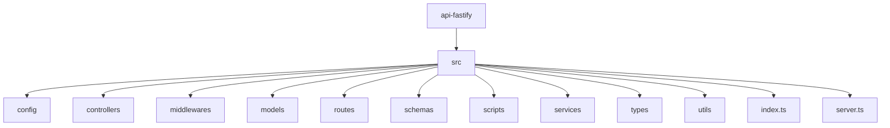
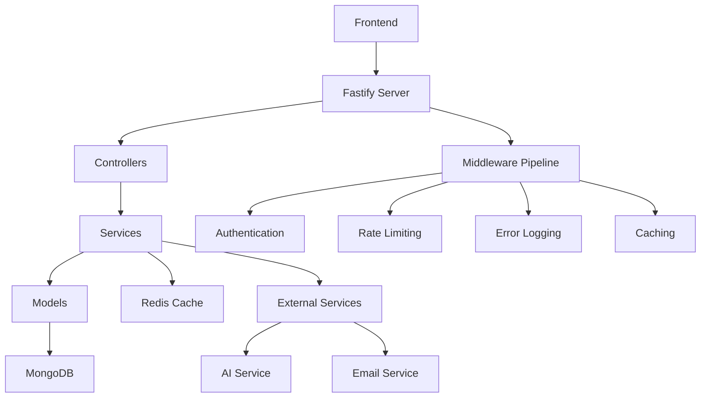
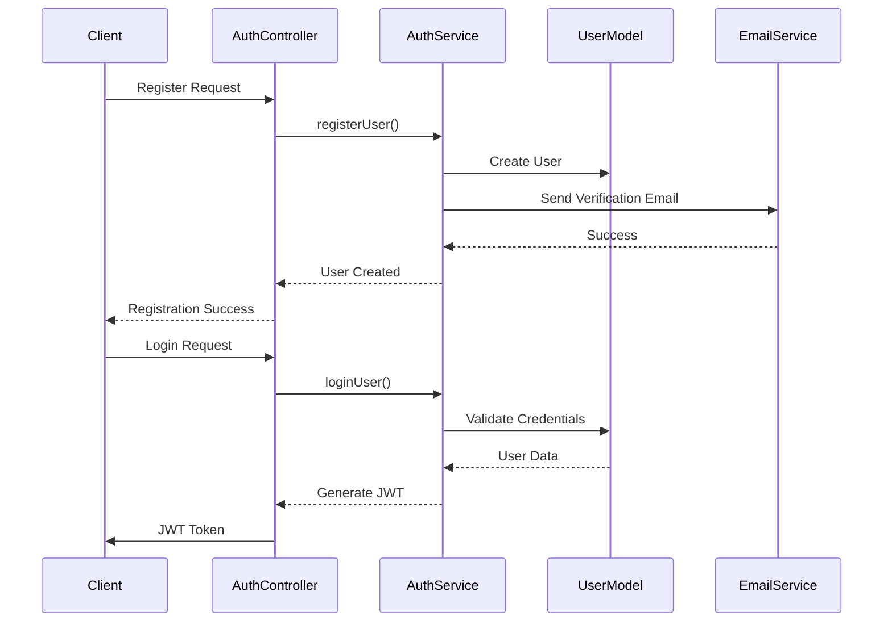
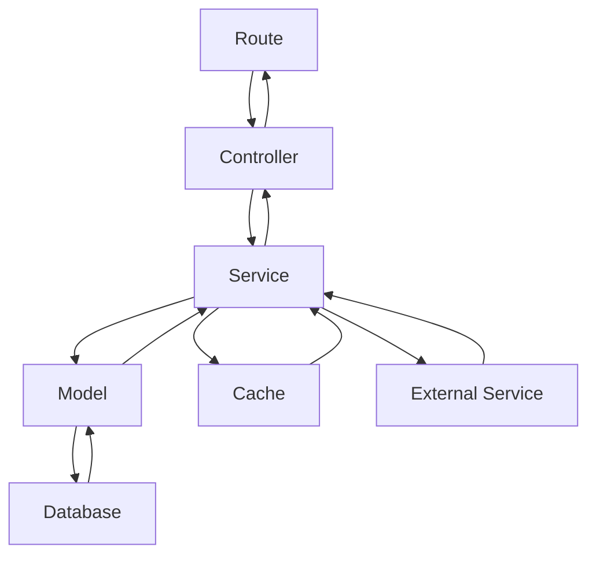
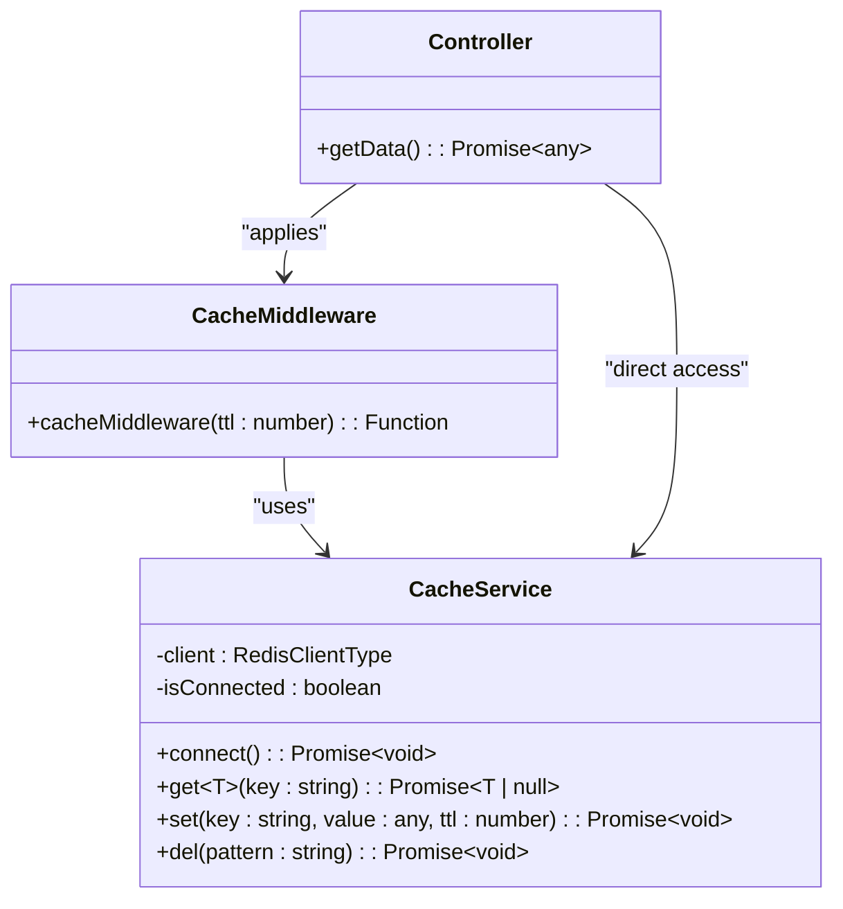
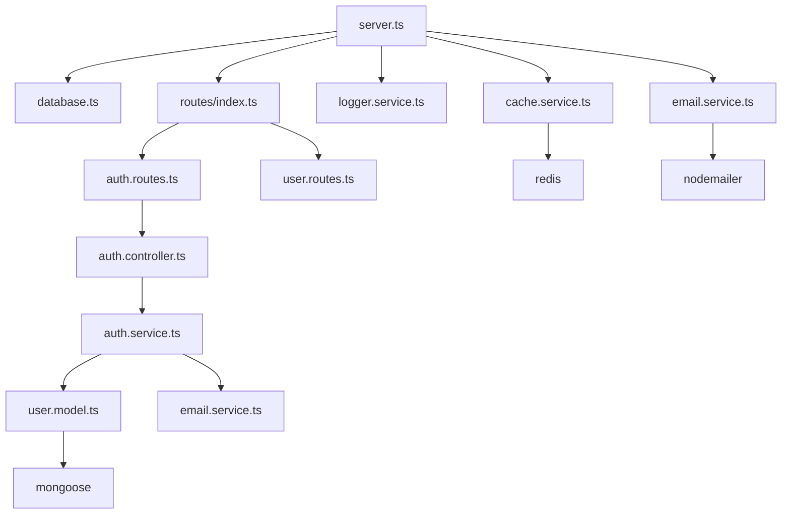
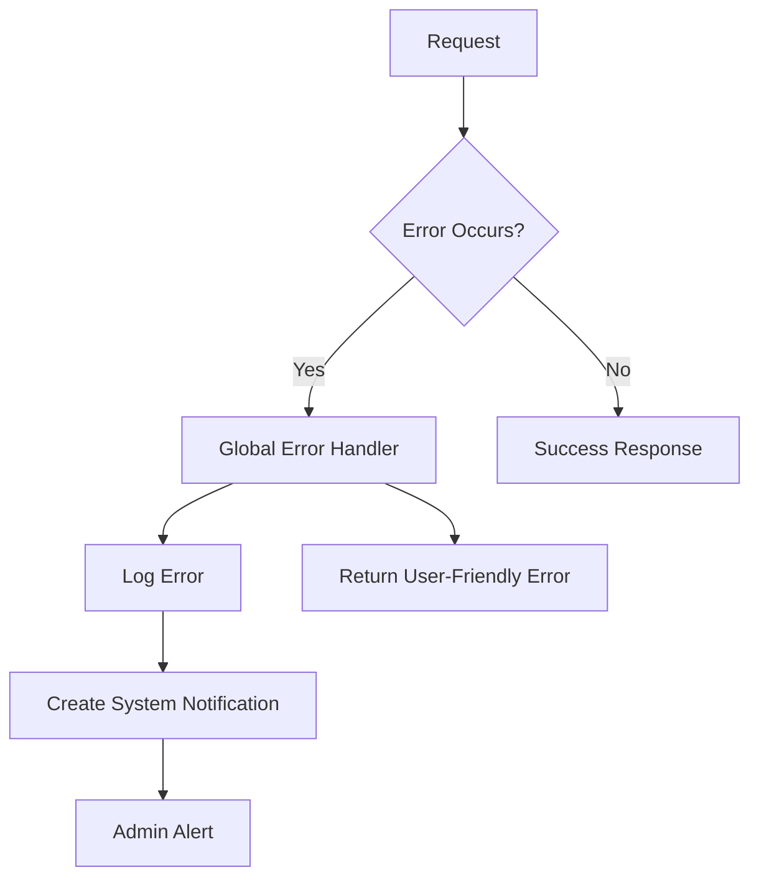

# Backend Architecture

<cite>
**Referenced Files in This Document**   
- [index.ts](file://api-fastify/src/index.ts)
- [server.ts](file://api-fastify/src/server.ts)
- [database.ts](file://api-fastify/src/config/database.ts)
- [index.ts](file://api-fastify/src/routes/index.ts)
- [auth.controller.ts](file://api-fastify/src/controllers/auth.controller.ts)
- [auth.service.ts](file://api-fastify/src/services/auth.service.ts)
- [user.model.ts](file://api-fastify/src/models/user.model.ts)
- [auth.middleware.ts](file://api-fastify/src/middlewares/auth.middleware.ts)
- [cache.service.ts](file://api-fastify/src/services/cache.service.ts)
- [cache.middleware.ts](file://api-fastify/src/middlewares/cache.middleware.ts)
- [rate-limit.middleware.ts](file://api-fastify/src/middlewares/rate-limit.middleware.ts)
- [email.service.ts](file://api-fastify/src/services/email.service.ts)
- [logger.service.ts](file://api-fastify/src/services/logger.service.ts)
- [notification.service.ts](file://api-fastify/src/services/notification.service.ts)
</cite>

## Table of Contents
1. [Introduction](#introduction)
2. [Project Structure](#project-structure)
3. [Core Components](#core-components)
4. [Architecture Overview](#architecture-overview)
5. [Detailed Component Analysis](#detailed-component-analysis)
6. [Dependency Analysis](#dependency-analysis)
7. [Performance Considerations](#performance-considerations)
8. [Troubleshooting Guide](#troubleshooting-guide)
9. [Conclusion](#conclusion)

## Introduction
The MERN_chatai_blog backend is a Node.js application built with the Fastify framework, implementing an MVC (Model-View-Controller) architectural pattern. The system integrates with MongoDB via Mongoose ODM for data persistence, Redis for caching, and external services for AI and email functionality. This document provides comprehensive architectural documentation detailing the system design, component interactions, data flows, and integration patterns.

**Section sources**
- [server.ts](file://api-fastify/src/server.ts#L1-L174)

## Project Structure

The backend component follows a well-organized directory structure that separates concerns according to the MVC pattern with additional layers for services, middleware, and configuration.

**Diagram sources**
- [server.ts](file://api-fastify/src/server.ts#L1-L174)
- [index.ts](file://api-fastify/src/index.ts#L1-L36)

**Section sources**
- [server.ts](file://api-fastify/src/server.ts#L1-L174)
- [index.ts](file://api-fastify/src/index.ts#L1-L36)

## Core Components

The backend architecture is built around several core components that work together to provide a robust and scalable system. The application uses Fastify as the web framework, which provides high performance and low overhead. The MVC pattern is implemented with clear separation between controllers (handling HTTP requests), services (business logic), and models (data access). Additional components include middleware for cross-cutting concerns, Redis for caching, and integration with external services.

**Section sources**
- [server.ts](file://api-fastify/src/server.ts#L1-L174)
- [auth.controller.ts](file://api-fastify/src/controllers/auth.controller.ts#L1-L330)
- [auth.service.ts](file://api-fastify/src/services/auth.service.ts#L1-L243)
- [user.model.ts](file://api-fastify/src/models/user.model.ts#L1-L97)

## Architecture Overview

The backend architecture follows a layered approach with clear separation of concerns. The system is designed to handle RESTful API requests with proper authentication, authorization, and error handling. The architecture includes integration with external services for AI and email functionality, as well as caching mechanisms to improve performance.

**Diagram sources**
- [server.ts](file://api-fastify/src/server.ts#L1-L174)
- [auth.middleware.ts](file://api-fastify/src/middlewares/auth.middleware.ts#L1-L128)
- [cache.middleware.ts](file://api-fastify/src/middlewares/cache.middleware.ts#L1-L25)
- [rate-limit.middleware.ts](file://api-fastify/src/middlewares/rate-limit.middleware.ts#L1-L92)

## Detailed Component Analysis

### Authentication System Analysis

The authentication system is implemented using JWT (JSON Web Tokens) with cookie-based storage for enhanced security. The system supports registration, login, password reset, and email verification workflows.

**Diagram sources**
- [auth.controller.ts](file://api-fastify/src/controllers/auth.controller.ts#L1-L330)
- [auth.service.ts](file://api-fastify/src/services/auth.service.ts#L1-L243)
- [user.model.ts](file://api-fastify/src/models/user.model.ts#L1-L97)
- [email.service.ts](file://api-fastify/src/services/email.service.ts#L1-L84)

**Section sources**
- [auth.controller.ts](file://api-fastify/src/controllers/auth.controller.ts#L1-L330)
- [auth.service.ts](file://api-fastify/src/services/auth.service.ts#L1-L243)
- [user.model.ts](file://api-fastify/src/models/user.model.ts#L1-L97)

### Data Flow Analysis

The system implements a clear data flow from routes to controllers to services to models. This separation ensures that business logic is encapsulated in services, while controllers handle HTTP-specific concerns.

**Diagram sources**
- [routes/index.ts](file://api-fastify/src/routes/index.ts#L1-L53)
- [auth.controller.ts](file://api-fastify/src/controllers/auth.controller.ts#L1-L330)
- [auth.service.ts](file://api-fastify/src/services/auth.service.ts#L1-L243)
- [user.model.ts](file://api-fastify/src/models/user.model.ts#L1-L97)

**Section sources**
- [routes/index.ts](file://api-fastify/src/routes/index.ts#L1-L53)
- [auth.controller.ts](file://api-fastify/src/controllers/auth.controller.ts#L1-L330)
- [auth.service.ts](file://api-fastify/src/services/auth.service.ts#L1-L243)

### Caching System Analysis

The caching system is implemented using Redis with a service-layer approach. The system provides both manual caching through the cache service and automatic caching through middleware.

**Diagram sources**
- [cache.service.ts](file://api-fastify/src/services/cache.service.ts#L1-L58)
- [cache.middleware.ts](file://api-fastify/src/middlewares/cache.middleware.ts#L1-L25)

**Section sources**
- [cache.service.ts](file://api-fastify/src/services/cache.service.ts#L1-L58)
- [cache.middleware.ts](file://api-fastify/src/middlewares/cache.middleware.ts#L1-L25)

## Dependency Analysis

The backend system has well-defined dependencies between components, following the dependency inversion principle where possible. The architecture minimizes coupling between components while maintaining clear integration points.

**Diagram sources**
- [server.ts](file://api-fastify/src/server.ts#L1-L174)
- [database.ts](file://api-fastify/src/config/database.ts#L1-L22)
- [routes/index.ts](file://api-fastify/src/routes/index.ts#L1-L53)
- [auth.controller.ts](file://api-fastify/src/controllers/auth.controller.ts#L1-L330)
- [auth.service.ts](file://api-fastify/src/services/auth.service.ts#L1-L243)
- [user.model.ts](file://api-fastify/src/models/user.model.ts#L1-L97)
- [cache.service.ts](file://api-fastify/src/services/cache.service.ts#L1-L58)
- [email.service.ts](file://api-fastify/src/services/email.service.ts#L1-L84)

**Section sources**
- [server.ts](file://api-fastify/src/server.ts#L1-L174)
- [database.ts](file://api-fastify/src/config/database.ts#L1-L22)
- [routes/index.ts](file://api-fastify/src/routes/index.ts#L1-L53)

## Performance Considerations

The system incorporates several performance optimization strategies, including Redis caching, rate limiting to prevent abuse, and efficient database queries through Mongoose. The Fastify framework provides built-in performance benefits with its low overhead and high throughput capabilities.

The caching strategy includes both route-level caching through middleware and service-level caching for specific operations. The rate limiting system helps protect against denial-of-service attacks and ensures fair usage of system resources.

**Section sources**
- [cache.service.ts](file://api-fastify/src/services/cache.service.ts#L1-L58)
- [cache.middleware.ts](file://api-fastify/src/middlewares/cache.middleware.ts#L1-L25)
- [rate-limit.middleware.ts](file://api-fastify/src/middlewares/rate-limit.middleware.ts#L1-L92)

## Troubleshooting Guide

The system includes comprehensive error handling and logging mechanisms to facilitate troubleshooting. The error handling strategy includes centralized error handling in the Fastify server, detailed logging with the logger service, and notification systems for critical errors.

The logger service writes logs to files with timestamps and context information, making it easier to trace issues. The system also includes notification hooks that can alert administrators of critical system errors.

**Diagram sources**
- [server.ts](file://api-fastify/src/server.ts#L1-L174)
- [logger.service.ts](file://api-fastify/src/services/logger.service.ts#L1-L63)
- [notification.service.ts](file://api-fastify/src/services/notification.service.ts#L1-L261)

**Section sources**
- [server.ts](file://api-fastify/src/server.ts#L1-L174)
- [logger.service.ts](file://api-fastify/src/services/logger.service.ts#L1-L63)
- [notification.service.ts](file://api-fastify/src/services/notification.service.ts#L1-L261)

## Conclusion

The MERN_chatai_blog backend architecture demonstrates a well-structured implementation of the MVC pattern using the Fastify framework. The system effectively separates concerns between controllers, services, and models, while incorporating cross-cutting concerns like authentication, caching, and error handling through middleware.

Key architectural strengths include the use of JWT for secure authentication, Redis for performance optimization, and a clean separation of business logic from HTTP concerns. The integration with external services for AI and email functionality is well-designed, allowing for extensibility without compromising system stability.

The architecture supports scalability through its caching mechanisms and rate limiting, while maintaining security through proper authentication and authorization controls. The comprehensive logging and error handling systems provide visibility into system operations and facilitate troubleshooting when issues arise.