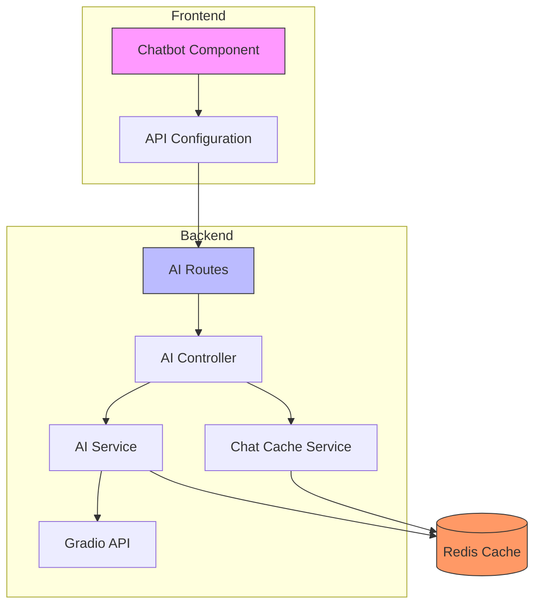
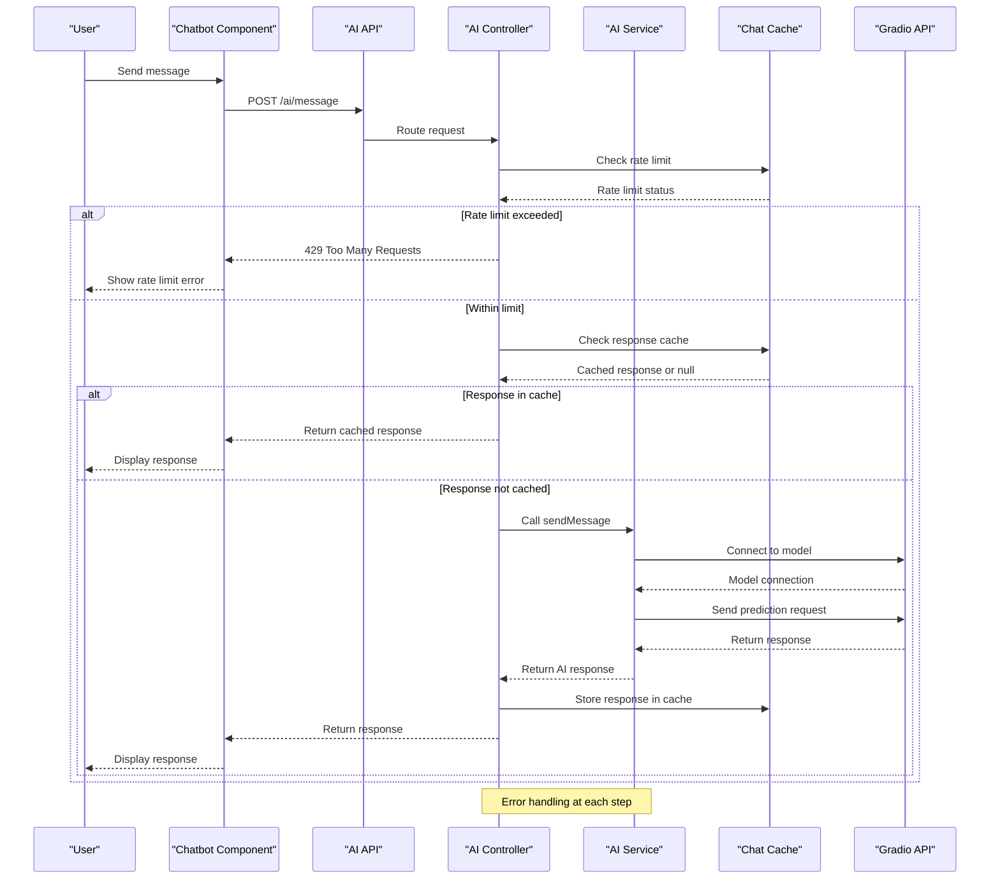
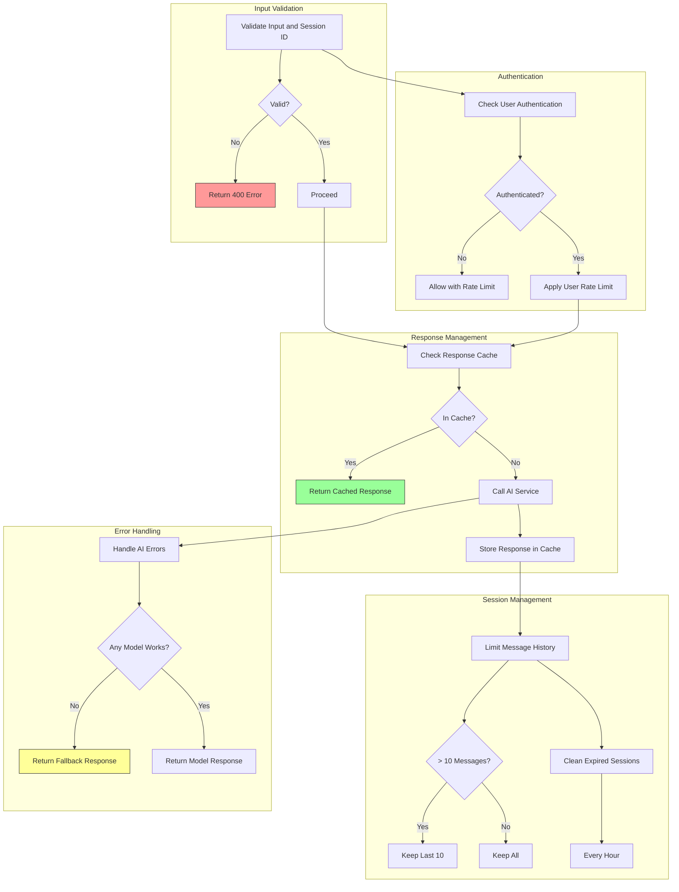
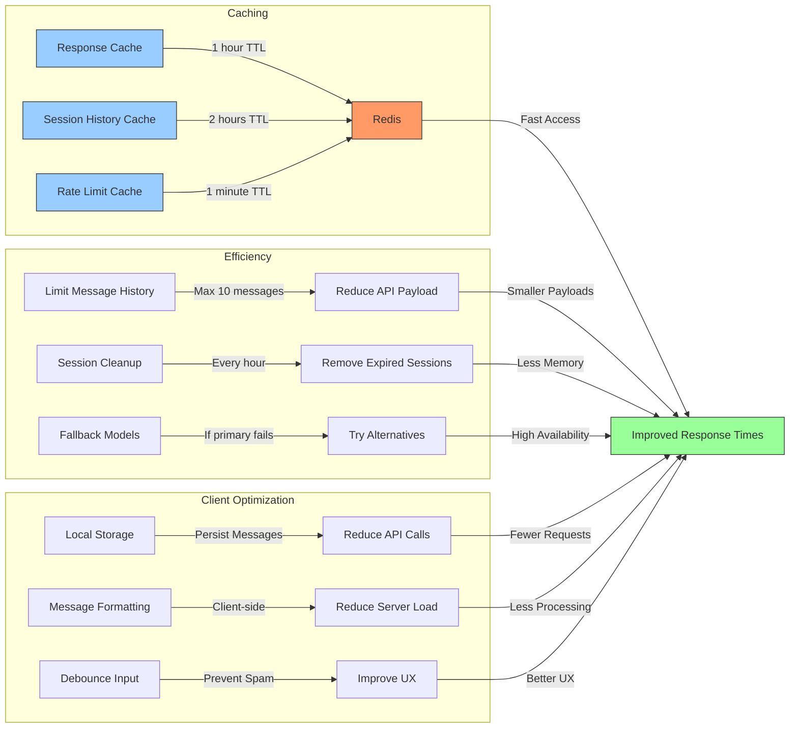

# AI Service

<cite>
**Referenced Files in This Document**   
- [ai.service.ts](file://api-fastify/src/services/ai.service.ts)
- [ai.controller.ts](file://api-fastify/src/controllers/ai.controller.ts)
- [chat-cache.service.ts](file://api-fastify/src/services/chat-cache.service.ts)
- [ai.routes.ts](file://api-fastify/src/routes/ai.routes.ts)
- [conversation.types.ts](file://api-fastify/src/types/conversation.types.ts)
- [Chatbot.tsx](file://src/components/Chatbot.tsx)
- [chatUtils.ts](file://src/lib/chatUtils.ts)
- [ChatTypes.ts](file://src/types/ChatTypes.ts)
- [api.config.ts](file://src/config/api.config.ts)
- [cache.service.ts](file://api-fastify/src/services/cache.service.ts)
</cite>

## Table of Contents
1. [Introduction](#introduction)
2. [AI Service Architecture](#ai-service-architecture)
3. [Core Components](#core-components)
4. [Request/Response Flow](#requestresponse-flow)
5. [External AI Provider Integration](#external-ai-provider-integration)
6. [Session Management](#session-management)
7. [Caching Strategy](#caching-strategy)
8. [Rate Limiting Implementation](#rate-limiting-implementation)
9. [Error Handling](#error-handling)
10. [Client-Side Implementation](#client-side-implementation)
11. [Business Rules](#business-rules)
12. [Performance Considerations](#performance-considerations)
13. [Common Issues and Solutions](#common-issues-and-solutions)
14. [Conclusion](#conclusion)

## Introduction
The AI service in MERN_chatai_blog provides intelligent features including content generation, analysis, and chatbot interactions. This documentation details the implementation of the AI-powered features, focusing on the integration with external AI providers (Gradio), request/response handling, error management, and performance optimization strategies. The service enables users to interact with AI models through a chat interface, with features like session persistence, response caching, and rate limiting to ensure reliability and scalability.

## AI Service Architecture
The AI service follows a layered architecture with clear separation of concerns between routes, controllers, services, and data models. The architecture enables scalable AI interactions while maintaining performance and reliability through caching and rate limiting mechanisms.



**Diagram sources**
- [ai.routes.ts](file://api-fastify/src/routes/ai.routes.ts)
- [ai.controller.ts](file://api-fastify/src/controllers/ai.controller.ts)
- [ai.service.ts](file://api-fastify/src/services/ai.service.ts)
- [chat-cache.service.ts](file://api-fastify/src/services/chat-cache.service.ts)
- [Chatbot.tsx](file://src/components/Chatbot.tsx)

**Section sources**
- [ai.routes.ts](file://api-fastify/src/routes/ai.routes.ts)
- [ai.controller.ts](file://api-fastify/src/controllers/ai.controller.ts)
- [ai.service.ts](file://api-fastify/src/services/ai.service.ts)
- [Chatbot.tsx](file://src/components/Chatbot.tsx)

## Core Components
The AI service consists of several core components that work together to provide AI-powered functionality. These components include the AI service for model interaction, the AI controller for request handling, the chat cache service for performance optimization, and the client-side chatbot component for user interaction.

**Section sources**
- [ai.service.ts](file://api-fastify/src/services/ai.service.ts)
- [ai.controller.ts](file://api-fastify/src/controllers/ai.controller.ts)
- [chat-cache.service.ts](file://api-fastify/src/services/chat-cache.service.ts)
- [Chatbot.tsx](file://src/components/Chatbot.tsx)

## Request/Response Flow
The request/response flow for AI interactions follows a structured pattern from client to server and back, with multiple layers of processing and optimization.



**Diagram sources**
- [ai.controller.ts](file://api-fastify/src/controllers/ai.controller.ts)
- [ai.service.ts](file://api-fastify/src/services/ai.service.ts)
- [chat-cache.service.ts](file://api-fastify/src/services/chat-cache.service.ts)
- [Chatbot.tsx](file://src/components/Chatbot.tsx)

**Section sources**
- [ai.controller.ts](file://api-fastify/src/controllers/ai.controller.ts)
- [ai.service.ts](file://api-fastify/src/services/ai.service.ts)
- [chat-cache.service.ts](file://api-fastify/src/services/chat-cache.service.ts)
- [Chatbot.tsx](file://src/components/Chatbot.tsx)

## External AI Provider Integration
The AI service integrates with external AI providers through the Gradio client library, enabling access to powerful language models for content generation and analysis.

```mermaid
classDiagram
class AIService {
+generateResponse(messages : IMessage[]) : Promise~string~
+sendMessage(input : string, sessionId : string) : Promise~string~
}
class GradioClient {
+connect(model : string) : Promise~Client~
+predict(endpoint : string, data : object) : Promise~any~
}
class ModelConfig {
+models : string[]
+QWEN_PROMPT : string
}
AIService --> GradioClient : "uses"
AIService --> ModelConfig : "configures"
GradioClient --> "Qwen/Qwen2-72B-Instruct" : "connects to"
GradioClient --> "Qwen/Qwen1.5-110B-Chat-demo" : "connects to"
```

**Diagram sources**
- [ai.service.ts](file://api-fastify/src/services/ai.service.ts)

**Section sources**
- [ai.service.ts](file://api-fastify/src/services/ai.service.ts)

## Session Management
The AI service implements session management to maintain conversation context across multiple interactions, with automatic cleanup of expired sessions.

```mermaid
classDiagram
class ChatSession {
+messages : IMessage[]
+lastUpdated : Date
}
class SessionManager {
-chatSessions : Map~string, ChatSession~
-SESSION_TTL : number
+getOrCreateSession(sessionId : string) : ChatSession
+cleanupSessions() : void
}
class IMessage {
+content : string
+sender : string
}
SessionManager --> ChatSession : "manages"
ChatSession --> IMessage : "contains"
SessionManager --> "setInterval" : "scheduled cleanup"
```

**Diagram sources**
- [ai.service.ts](file://api-fastify/src/services/ai.service.ts)
- [conversation.types.ts](file://api-fastify/src/types/conversation.types.ts)

**Section sources**
- [ai.service.ts](file://api-fastify/src/services/ai.service.ts)
- [conversation.types.ts](file://api-fastify/src/types/conversation.types.ts)

## Caching Strategy
The AI service implements a multi-layer caching strategy to improve performance and reduce API costs by caching responses and managing rate limits.

```mermaid
classDiagram
class ChatCacheService {
+getCachedResponse(input : string) : Promise~string | null~
+setCachedResponse(input : string, response : string) : Promise~void~
+getSessionHistory(sessionId : string) : Promise~any[]~
+addToSessionHistory(sessionId : string, message : any) : Promise~void~
+checkRateLimit(userId : string) : Promise~boolean~
-hashInput(input : string) : string
}
class CacheService {
+get~T~(key : string) : Promise~T | null~
+set(key : string, value : any, ttl : number) : Promise~void~
+del(pattern : string) : Promise~void~
-client : RedisClientType
-isConnected : boolean
}
class Redis {
+GET(key)
+SETEX(key, ttl, value)
+KEYS(pattern)
+DEL(keys)
}
ChatCacheService --> CacheService : "uses"
CacheService --> Redis : "implements"
note right of ChatCacheService
Cache keys :
- chat : response : {hash}
- chat : session : {sessionId}
- chat : rate : {userId}
end
```

**Diagram sources**
- [chat-cache.service.ts](file://api-fastify/src/services/chat-cache.service.ts)
- [cache.service.ts](file://api-fastify/src/services/cache.service.ts)

**Section sources**
- [chat-cache.service.ts](file://api-fastify/src/services/chat-cache.service.ts)
- [cache.service.ts](file://api-fastify/src/services/cache.service.ts)

## Rate Limiting Implementation
The AI service implements rate limiting to prevent abuse and ensure fair usage of AI resources, with configurable limits and Redis-based tracking.

```mermaid
flowchart TD
Start([Request Received]) --> ExtractKey["Extract Key from Request\n(IP or User ID)"]
ExtractKey --> GenerateKey["Generate Rate Limit Key\nrate_limit:{key}:{windowStart}"]
GenerateKey --> GetCount["Get Current Request Count\nfrom Redis"]
GetCount --> CheckLimit{"Count >= Max Requests?"}
CheckLimit --> |Yes| SetHeaders["Set Rate Limit Headers\n429 Status"]
SetHeaders --> Return429["Return 429 Response"]
CheckLimit --> |No| IncrementCount["Increment Request Count\nin Redis"]
IncrementCount --> SetRemainingHeaders["Set Rate Limit Headers\nwith Remaining Count"]
SetRemainingHeaders --> ProcessRequest["Process Request"]
ProcessRequest --> Return200["Return 200 Response"]
style Return429 fill:#f99,stroke:#333
style Return200 fill:#9f9,stroke:#333
note right of SetHeaders
Headers set:
- X-RateLimit-Limit
- X-RateLimit-Remaining: 0
- X-RateLimit-Reset
- Retry-After
end
note right of SetRemainingHeaders
Headers set:
- X-RateLimit-Limit
- X-RateLimit-Remaining
- X-RateLimit-Reset
end
```

**Diagram sources**
- [rate-limit.middleware.ts](file://api-fastify/src/middlewares/rate-limit.middleware.ts)
- [chat-cache.service.ts](file://api-fastify/src/services/chat-cache.service.ts)

**Section sources**
- [rate-limit.middleware.ts](file://api-fastify/src/middlewares/rate-limit.middleware.ts)
- [chat-cache.service.ts](file://api-fastify/src/services/chat-cache.service.ts)

## Error Handling
The AI service implements comprehensive error handling at multiple levels to ensure reliability and provide meaningful feedback to users.

```mermaid
flowchart TD
ClientError["Client-Side Error\n(Chatbot Component)"]
ServerError["Server-Side Error\n(AI Controller)"]
ServiceError["Service Error\n(AI Service)"]
CacheError["Cache Error\n(Chat Cache Service)"]
APIError["External API Error\n(Gradio Connection)"]
ClientError --> |Network Error| HandleClientError["Show Network Error\n'Erreur réseau'"]
ClientError --> |Auth Error| HandleAuthError["Show Auth Error\n'Vous devez être connecté'"]
ClientError --> |General Error| HandleGeneralError["Show General Error\n'Une erreur est survenue'"]
ServerError --> |Validation Error| HandleValidationError["Return 400\n'Message requis'"]
ServerError --> |Rate Limit Error| HandleRateLimitError["Return 429\n'Trop de requêtes'"]
ServerError --> |Internal Error| HandleInternalError["Return 500\n'Erreur serveur'"]
ServiceError --> |Model Connection Error| HandleModelError["Try Next Model\nor Return Fallback"]
ServiceError --> |Response Format Error| HandleFormatError["Return Fallback Response"]
CacheError --> |Redis Unavailable| HandleCacheError["Continue Without Cache"]
APIError --> |Connection Failed| HandleAPIError["Try Alternative Model"]
style HandleClientError fill:#f99,stroke:#333
style HandleValidationError fill:#f99,stroke:#333
style HandleRateLimitError fill:#ff9,stroke:#333
style HandleInternalError fill:#f99,stroke:#333
style HandleModelError fill:#ff9,stroke:#333
style HandleFormatError fill:#ff9,stroke:#333
style HandleCacheError fill:#9f9,stroke:#333
style HandleAPIError fill:#ff9,stroke:#333
```



**Diagram sources**
- [ai.service.ts](file://api-fastify/src/services/ai.service.ts)
- [ai.controller.ts](file://api-fastify/src/controllers/ai.controller.ts)
- [Chatbot.tsx](file://src/components/Chatbot.tsx)

**Section sources**
- [ai.service.ts](file://api-fastify/src/services/ai.service.ts)
- [ai.controller.ts](file://api-fastify/src/controllers/ai.controller.ts)
- [Chatbot.tsx](file://src/components/Chatbot.tsx)

## Client-Side Implementation
The client-side implementation provides a user-friendly chat interface with local storage for message persistence and formatting for AI responses.

```mermaid
classDiagram
class Chatbot {
+isOpen : boolean
+messages : ChatMessage[]
+input : string
+sessionId : string
+isThinking : boolean
+error : string | null
+toggleChat() : void
+handleSend() : Promise~void~
+handleKeyDown(e : KeyboardEvent) : void
+clearChat() : void
}
class ChatUtils {
+formatChatMessage(text : string) : string
+formatMessageTime(date : Date) : string
+saveMessagesToStorage(messages : ChatMessage[]) : void
+loadMessagesFromStorage() : ChatMessage[]
+generateWelcomeMessage(id : string) : ChatMessage
}
class ChatTypes {
+ChatMessage
+ChatApiResponse
+ChatSession
+MessageSender
}
class APIConfig {
+API_ENDPOINTS
+getImageUrl()
+getValidImageUrl()
}
Chatbot --> ChatUtils : "uses"
Chatbot --> ChatTypes : "uses"
Chatbot --> APIConfig : "uses"
Chatbot --> "localStorage" : "persists"
note right of ChatUtils
Formatting rules :
- **text** → <strong>
- *text* → <em>
- `code` → <code>
- [link](url) → <a>
- \n → <br />
end
```

**Diagram sources**
- [Chatbot.tsx](file://src/components/Chatbot.tsx)
- [chatUtils.ts](file://src/lib/chatUtils.ts)
- [ChatTypes.ts](file://src/types/ChatTypes.ts)
- [api.config.ts](file://src/config/api.config.ts)

**Section sources**
- [Chatbot.tsx](file://src/components/Chatbot.tsx)
- [chatUtils.ts](file://src/lib/chatUtils.ts)
- [ChatTypes.ts](file://src/types/ChatTypes.ts)
- [api.config.ts](file://src/config/api.config.ts)

## Business Rules
The AI service implements several business rules to ensure proper usage, data integrity, and user experience.



**Diagram sources**
- [ai.controller.ts](file://api-fastify/src/controllers/ai.controller.ts)
- [ai.service.ts](file://api-fastify/src/services/ai.service.ts)
- [chat-cache.service.ts](file://api-fastify/src/services/chat-cache.service.ts)

**Section sources**
- [ai.controller.ts](file://api-fastify/src/controllers/ai.controller.ts)
- [ai.service.ts](file://api-fastify/src/services/ai.service.ts)
- [chat-cache.service.ts](file://api-fastify/src/services/chat-cache.service.ts)

## Performance Considerations
The AI service implements several performance optimizations to ensure fast response times and efficient resource usage.



**Diagram sources**
- [ai.service.ts](file://api-fastify/src/services/ai.service.ts)
- [chat-cache.service.ts](file://api-fastify/src/services/chat-cache.service.ts)
- [Chatbot.tsx](file://src/components/Chatbot.tsx)

**Section sources**
- [ai.service.ts](file://api-fastify/src/services/ai.service.ts)
- [chat-cache.service.ts](file://api-fastify/src/services/chat-cache.service.ts)
- [Chatbot.tsx](file://src/components/Chatbot.tsx)

## Common Issues and Solutions
This section addresses common issues that may occur with the AI service and their solutions.

```mermaid
flowchart TD
subgraph "AI Response Latency"
A[High Latency] --> B{Causes}
B --> C[Model Processing Time]
B --> D[Network Latency]
B --> E[Server Load]
C --> F[Solutions]
D --> F
E --> F
F --> G[Implement Response Caching]
F --> H[Use Faster Models]
F --> I[Optimize Server Resources]
F --> J[Show Loading Indicators]
end
subgraph "Rate Limiting Issues"
K[Rate Limit Exceeded] --> L{Causes}
L --> M[Too Many Requests]
L --> N[Shared IP Address]
M --> O[Solutions]
N --> O
O --> P[Implement Client-Side Throttling]
O --> Q[Increase Rate Limit for Authenticated Users]
O --> R[Provide Clear Error Messages]
end
subgraph "Caching Problems"
S[Cache Inconsistency] --> T{Causes}
T --> U[Cache Expiration]
T --> V[Cache Invalidation]
U --> W[Solutions]
V --> W
W --> X[Set Appropriate TTL Values]
W --> Y[Implement Cache Invalidation]
W --> Z[Monitor Cache Hit Rate]
end
subgraph "Model Failures"
AA[Model Unavailable] --> AB{Causes}
AB --> AC[Service Outage]
AB --> AD[API Changes]
AC --> AE[Solutions]
AD --> AE
AE --> AF[Implement Fallback Models]
AE --> AG[Graceful Degradation]
AE --> AH[Monitor Service Health]
end
style A fill:#f99,stroke:#333
style K fill:#f99,stroke:#333
style S fill:#f99,stroke:#333
style AA fill:#f99,stroke:#333
style G fill:#9f9,stroke:#333
style H fill:#9f9,stroke:#333
style I fill:#9f9,stroke:#333
style J fill:#9f9,stroke:#333
style P fill:#9f9,stroke:#333
style Q fill:#9f9,stroke:#333
style R fill:#9f9,stroke:#333
style X fill:#9f9,stroke:#333
style Y fill:#9f9,stroke:#333
style Z fill:#9f9,stroke:#333
style AF fill:#9f9,stroke:#333
style AG fill:#9f9,stroke:#333
style AH fill:#9f9,stroke:#333
```



**Diagram sources**
- [ai.service.ts](file://api-fastify/src/services/ai.service.ts)
- [chat-cache.service.ts](file://api-fastify/src/services/chat-cache.service.ts)
- [ai.controller.ts](file://api-fastify/src/controllers/ai.controller.ts)
- [Chatbot.tsx](file://src/components/Chatbot.tsx)

**Section sources**
- [ai.service.ts](file://api-fastify/src/services/ai.service.ts)
- [chat-cache.service.ts](file://api-fastify/src/services/chat-cache.service.ts)
- [ai.controller.ts](file://api-fastify/src/controllers/ai.controller.ts)
- [Chatbot.tsx](file://src/components/Chatbot.tsx)

## Conclusion
The AI service in MERN_chatai_blog provides a robust and scalable solution for AI-powered features including content generation, analysis, and chatbot interactions. The service integrates with external AI providers through the Gradio client, implements comprehensive caching and rate limiting strategies, and provides a user-friendly client-side interface. Key features include session persistence, response caching, rate limiting, and fallback mechanisms for improved reliability. The architecture follows best practices for separation of concerns, with clear boundaries between routes, controllers, services, and data models. Performance optimizations such as response caching, message history limiting, and client-side message persistence ensure fast response times and efficient resource usage. The service handles errors gracefully at multiple levels, providing meaningful feedback to users while maintaining system stability. This comprehensive implementation enables the blog to offer advanced AI features while ensuring reliability, scalability, and a positive user experience.