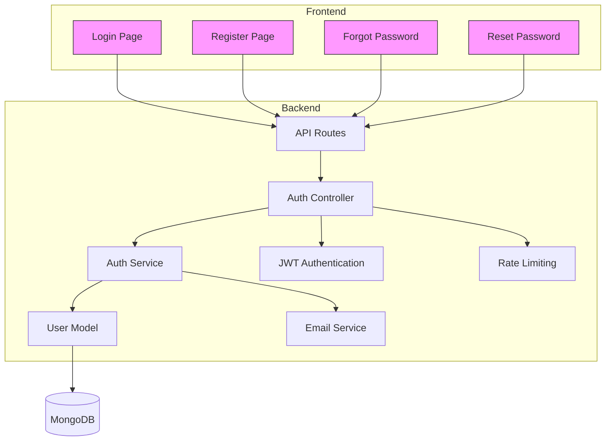
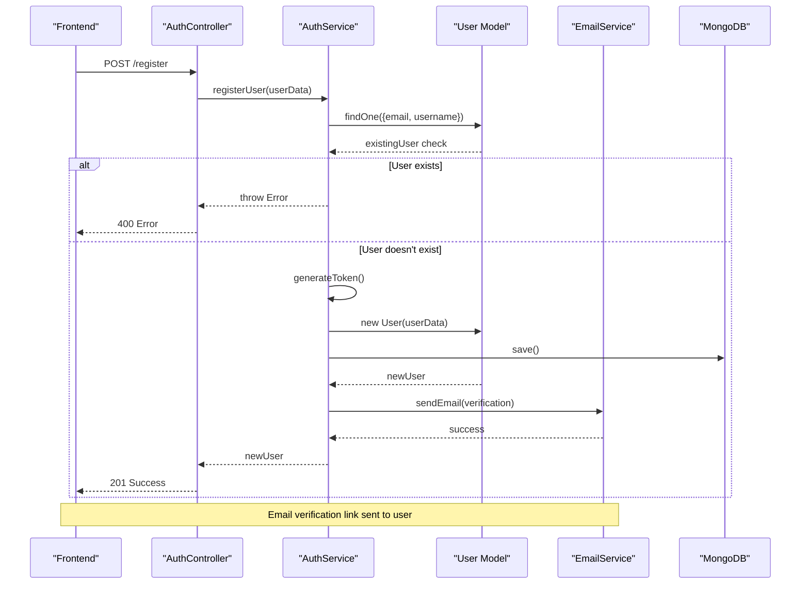
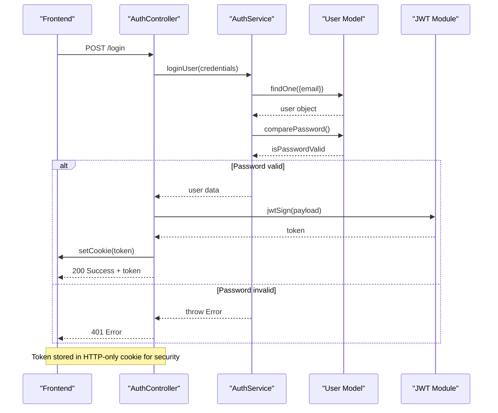
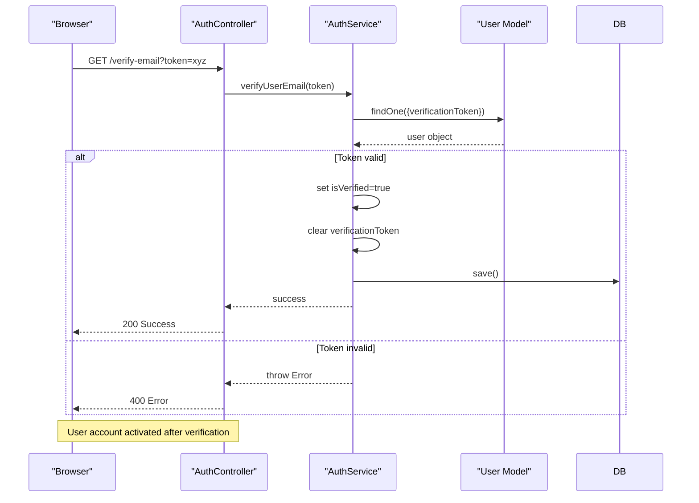
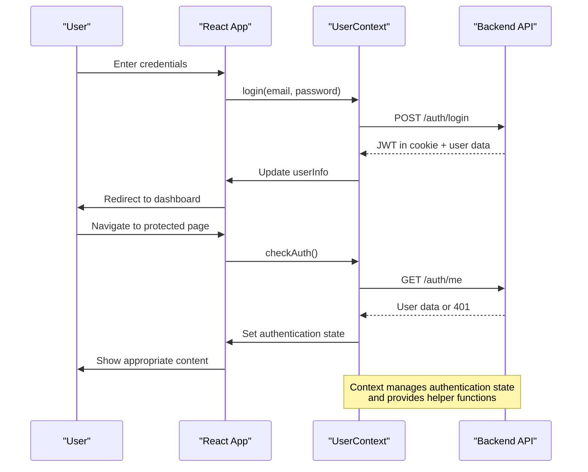
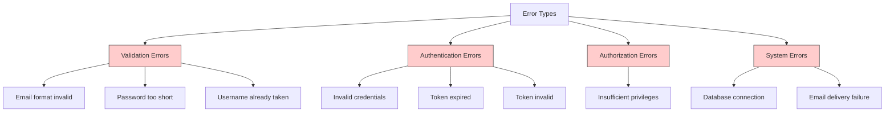

# Authentication Service

<cite>
**Referenced Files in This Document**   
- [auth.service.ts](file://api-fastify/src/services/auth.service.ts)
- [auth.controller.ts](file://api-fastify/src/controllers/auth.controller.ts)
- [user.model.ts](file://api-fastify/src/models/user.model.ts)
- [auth.middleware.ts](file://api-fastify/src/middlewares/auth.middleware.ts)
- [auth.schema.ts](file://api-fastify/src/schemas/auth.schema.ts)
- [email.service.ts](file://api-fastify/src/services/email.service.ts)
- [server.ts](file://api-fastify/src/server.ts)
- [Login.tsx](file://src/pages/Login.tsx)
- [UserContext.tsx](file://src/UserContext.tsx)
</cite>

## Table of Contents
1. [Introduction](#introduction)
2. [Authentication Architecture](#authentication-architecture)
3. [Core Components](#core-components)
4. [User Registration Flow](#user-registration-flow)
5. [Login and JWT Management](#login-and-jwt-management)
6. [Password Reset Mechanism](#password-reset-mechanism)
7. [Email Verification Process](#email-verification-process)
8. [Security Considerations](#security-considerations)
9. [Frontend Integration](#frontend-integration)
10. [Error Handling](#error-handling)
11. [Conclusion](#conclusion)

## Introduction
The authentication service in MERN_chatai_blog provides a comprehensive security framework for user management, implementing industry-standard practices for secure user authentication and authorization. This document details the implementation of user registration, login, password reset, and JWT token management, explaining how the service interacts with the user model, implements password hashing with bcrypt, and manages token generation and validation. The system incorporates email verification, session management, rate limiting, and protection against common vulnerabilities, providing a robust foundation for user authentication in the blog platform.

## Authentication Architecture



**Diagram sources**
- [auth.routes.ts](file://api-fastify/src/routes/auth.routes.ts)
- [auth.controller.ts](file://api-fastify/src/controllers/auth.controller.ts)
- [auth.service.ts](file://api-fastify/src/services/auth.service.ts)

**Section sources**
- [auth.routes.ts](file://api-fastify/src/routes/auth.routes.ts)
- [server.ts](file://api-fastify/src/server.ts)

## Core Components

The authentication system consists of several interconnected components that work together to provide secure user management. The service layer contains the business logic for authentication operations, while controllers handle HTTP requests and responses. The user model defines the data structure and includes password hashing functionality, and middleware components provide authentication verification and rate limiting. Email services handle communication with users for verification and password recovery.

**Section sources**
- [auth.service.ts](file://api-fastify/src/services/auth.service.ts)
- [auth.controller.ts](file://api-fastify/src/controllers/auth.controller.ts)
- [user.model.ts](file://api-fastify/src/models/user.model.ts)
- [auth.middleware.ts](file://api-fastify/src/middlewares/auth.middleware.ts)

## User Registration Flow



**Diagram sources**
- [auth.controller.ts](file://api-fastify/src/controllers/auth.controller.ts#L15-L45)
- [auth.service.ts](file://api-fastify/src/services/auth.service.ts#L15-L55)
- [user.model.ts](file://api-fastify/src/models/user.model.ts#L15-L30)

**Section sources**
- [auth.service.ts](file://api-fastify/src/services/auth.service.ts#L15-L65)
- [auth.controller.ts](file://api-fastify/src/controllers/auth.controller.ts#L15-L55)
- [user.model.ts](file://api-fastify/src/models/user.model.ts#L15-L35)

## Login and JWT Management



**Diagram sources**
- [auth.controller.ts](file://api-fastify/src/controllers/auth.controller.ts#L57-L95)
- [auth.service.ts](file://api-fastify/src/services/auth.service.ts#L65-L95)
- [server.ts](file://api-fastify/src/server.ts#L55-L65)

**Section sources**
- [auth.service.ts](file://api-fastify/src/services/auth.service.ts#L65-L105)
- [auth.controller.ts](file://api-fastify/src/controllers/auth.controller.ts#L57-L105)
- [server.ts](file://api-fastify/src/server.ts#L55-L65)

## Password Reset Mechanism

```mermaid
flowchart TD
A[User requests password reset] --> B{User exists?}
B --> |No| C[Return success message<br>(security best practice)]
B --> |Yes| D[Generate reset token]
D --> E[Store token with expiration]
E --> F[Send reset email]
F --> G[User clicks reset link]
G --> H{Token valid and not expired?}
H --> |No| I[Show error message]
H --> |Yes| J[Show password reset form]
J --> K[User submits new password]
K --> L{Password meets criteria?}
L --> |No| M[Show validation error]
L --> |Yes| N[Update password in database]
N --> O[Clear reset token]
O --> P[Redirect to login]
style C fill:#e6f3ff,stroke:#333
style I fill:#ffe6e6,stroke:#333
style M fill:#ffe6e6,stroke:#333
style P fill:#e6ffe6,stroke:#333
```

**Diagram sources**
- [auth.service.ts](file://api-fastify/src/services/auth.service.ts#L135-L185)
- [auth.controller.ts](file://api-fastify/src/controllers/auth.controller.ts#L145-L185)
- [email.service.ts](file://api-fastify/src/services/email.service.ts#L55-L80)

**Section sources**
- [auth.service.ts](file://api-fastify/src/services/auth.service.ts#L135-L185)
- [auth.controller.ts](file://api-fastify/src/controllers/auth.controller.ts#L145-L185)
- [email.service.ts](file://api-fastify/src/services/email.service.ts#L55-L80)

## Email Verification Process



**Diagram sources**
- [auth.service.ts](file://api-fastify/src/services/auth.service.ts#L115-L135)
- [auth.controller.ts](file://api-fastify/src/controllers/auth.controller.ts#L107-L135)

**Section sources**
- [auth.service.ts](file://api-fastify/src/services/auth.service.ts#L115-L135)
- [auth.controller.ts](file://api-fastify/src/controllers/auth.controller.ts#L107-L135)

## Security Considerations

```mermaid
graph TD
A[Security Features] --> B[Password Hashing]
A --> C[JWT Authentication]
A --> D[Rate Limiting]
A --> E[Input Validation]
A --> F[Secure Cookies]
A --> G[Email Verification]
B --> H[bcrypt with salt]
C --> I[HTTP-only cookies]
C --> J[Token expiration]
D --> K[Redis-based tracking]
E --> L[Schema validation]
F --> M[Secure flag in production]
F --> N[SameSite=lax]
G --> O[Token expiration (1 hour)]
G --> P[Single-use tokens]
style B fill:#f9f,stroke:#333
style C fill:#f9f,stroke:#333
style D fill:#f9f,stroke:#333
style E fill:#f9f,stroke:#333
style F fill:#f9f,stroke:#333
style G fill:#f9f,stroke:#333
```

**Diagram sources**
- [user.model.ts](file://api-fastify/src/models/user.model.ts#L65-L85)
- [server.ts](file://api-fastify/src/server.ts#L55-L65)
- [auth.middleware.ts](file://api-fastify/src/middlewares/rate-limit.middleware.ts)
- [auth.schema.ts](file://api-fastify/src/schemas/auth.schema.ts)

**Section sources**
- [user.model.ts](file://api-fastify/src/models/user.model.ts#L65-L85)
- [server.ts](file://api-fastify/src/server.ts#L55-L65)
- [auth.middleware.ts](file://api-fastify/src/middlewares/rate-limit.middleware.ts)
- [auth.schema.ts](file://api-fastify/src/schemas/auth.schema.ts)

## Frontend Integration



**Diagram sources**
- [UserContext.tsx](file://src/UserContext.tsx)
- [Login.tsx](file://src/pages/Login.tsx)
- [auth.controller.ts](file://api-fastify/src/controllers/auth.controller.ts)

**Section sources**
- [UserContext.tsx](file://src/UserContext.tsx)
- [Login.tsx](file://src/pages/Login.tsx)

## Error Handling



**Diagram sources**
- [auth.service.ts](file://api-fastify/src/services/auth.service.ts)
- [auth.controller.ts](file://api-fastify/src/controllers/auth.controller.ts)
- [server.ts](file://api-fastify/src/server.ts#L160-L170)

**Section sources**
- [auth.service.ts](file://api-fastify/src/services/auth.service.ts)
- [auth.controller.ts](file://api-fastify/src/controllers/auth.controller.ts)
- [server.ts](file://api-fastify/src/server.ts#L160-L170)

## Conclusion
The authentication service in MERN_chatai_blog implements a robust and secure system for user management, incorporating industry best practices for modern web applications. By leveraging JWT for stateless authentication, bcrypt for secure password hashing, and comprehensive email verification, the system provides a solid foundation for user security. The architecture separates concerns effectively with distinct service, controller, and model layers, while middleware components handle cross-cutting concerns like authentication verification and rate limiting. Frontend integration through React context provides a seamless user experience, maintaining authentication state across the application. The system balances security with usability, implementing features like rate limiting to prevent abuse while providing clear error messages and recovery options for legitimate users. Overall, the authentication service demonstrates a well-considered approach to user management that effectively addresses both security requirements and user experience considerations.