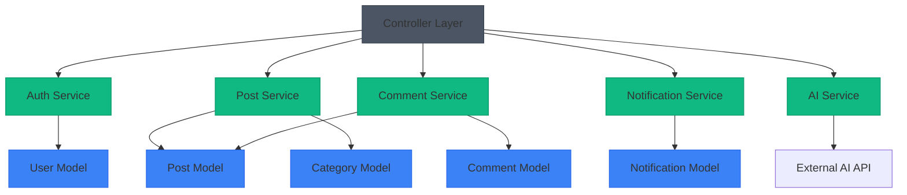
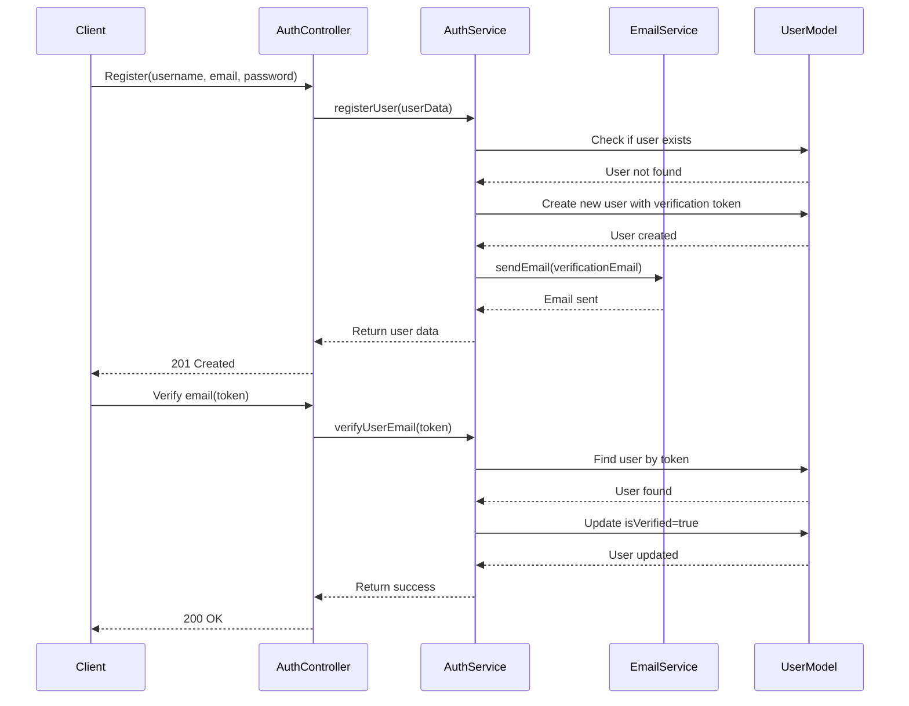
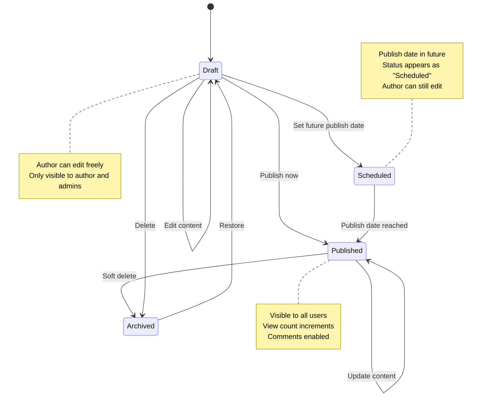
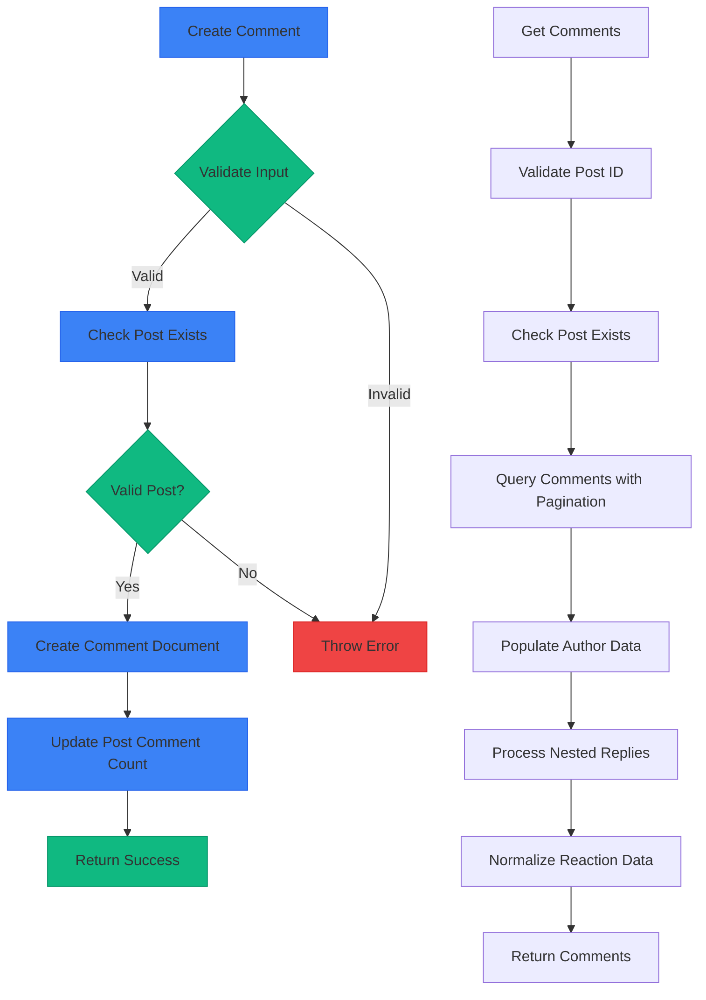
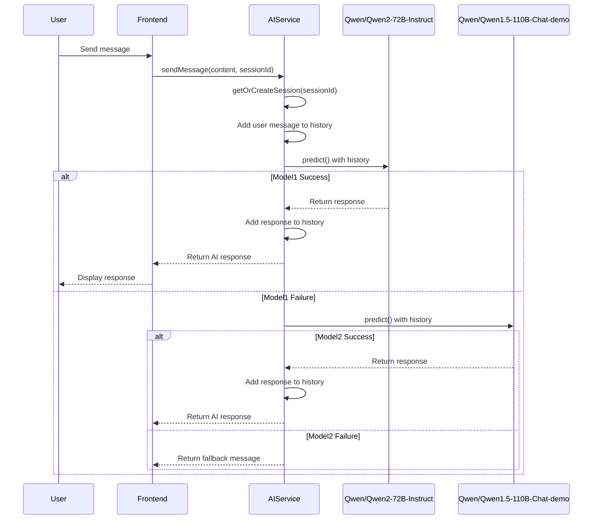
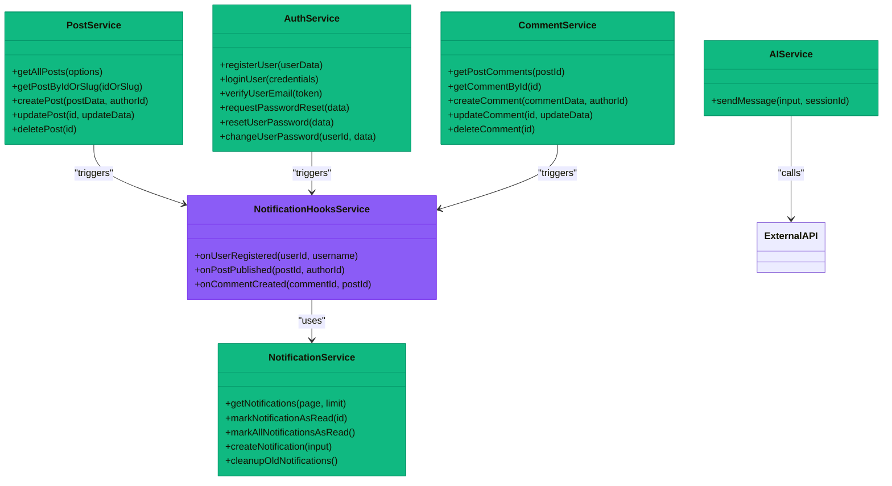
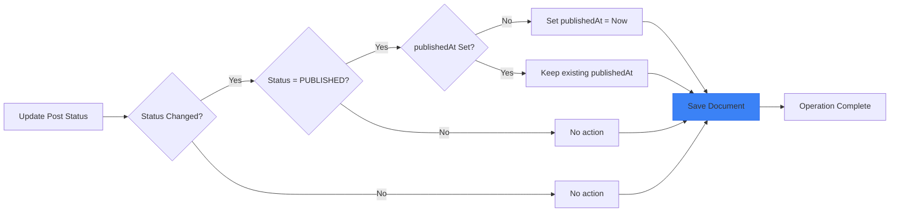

# Business Logic Layer

<cite>
**Referenced Files in This Document**   
- [post.controller.ts](file://api-fastify/src/controllers/post.controller.ts)
- [post.service.ts](file://api-fastify/src/services/post.service.ts)
- [auth.service.ts](file://api-fastify/src/services/auth.service.ts)
- [comment.service.ts](file://api-fastify/src/services/comment.service.ts)
- [notification.service.ts](file://api-fastify/src/services/notification.service.ts)
- [ai.service.ts](file://api-fastify/src/services/ai.service.ts)
- [post.model.ts](file://api-fastify/src/models/post.model.ts)
- [user.model.ts](file://api-fastify/src/models/user.model.ts)
- [EnhancedNotificationService.ts](file://src/services/EnhancedNotificationService.ts)
- [NotificationCache.ts](file://src/services/NotificationCache.ts)
- [ConnectionMonitor.ts](file://src/services/ConnectionMonitor.ts)
- [NotificationErrorHandler.ts](file://src/services/NotificationErrorHandler.ts)
</cite>

## Table of Contents
1. [Introduction](#introduction)
2. [Service Layer Architecture](#service-layer-architecture)
3. [Authentication Flow](#authentication-flow)
4. [Post Lifecycle Management](#post-lifecycle-management)
5. [Comment Moderation](#comment-moderation)
6. [Notification Orchestration](#notification-orchestration)
7. [AI Content Processing](#ai-content-processing)
8. [Error Handling Strategies](#error-handling-strategies)
9. [Service Composition Patterns](#service-composition-patterns)
10. [Race Condition Solutions](#race-condition-solutions)
11. [Conclusion](#conclusion)

## Introduction
The business logic layer of MERN_chatai_blog implements a robust service-oriented architecture that handles core application functionality. This documentation provides a comprehensive analysis of the service layer, focusing on key domains including authentication, content management, user interactions, and AI-powered features. The architecture follows a clear separation of concerns with controllers delegating to specialized services that coordinate between multiple domain models. The system implements sophisticated patterns for transaction management, error handling, and service composition to ensure reliability and maintainability.

## Service Layer Architecture

The service layer in MERN_chatai_blog follows a modular design pattern with each service responsible for a specific domain. Services act as intermediaries between controllers and data models, encapsulating business logic and coordinating interactions between multiple models when necessary. The architecture promotes loose coupling through explicit service dependencies and well-defined interfaces.

**Diagram sources**
- [post.controller.ts](file://api-fastify/src/controllers/post.controller.ts)
- [post.service.ts](file://api-fastify/src/services/post.service.ts)
- [auth.service.ts](file://api-fastify/src/services/auth.service.ts)

**Section sources**
- [post.controller.ts](file://api-fastify/src/controllers/post.controller.ts)
- [post.service.ts](file://api-fastify/src/services/post.service.ts)
- [auth.service.ts](file://api-fastify/src/services/auth.service.ts)

## Authentication Flow

The authentication system implements a comprehensive user management workflow with registration, login, email verification, and password recovery. The `auth.service.ts` handles all authentication logic, ensuring secure password storage through bcrypt hashing and implementing token-based verification for email confirmation and password resets.

**Diagram sources**
- [auth.service.ts](file://api-fastify/src/services/auth.service.ts)
- [user.model.ts](file://api-fastify/src/models/user.model.ts)

**Section sources**
- [auth.service.ts](file://api-fastify/src/services/auth.service.ts)
- [user.model.ts](file://api-fastify/src/models/user.model.ts)

## Post Lifecycle Management

The post management system implements a comprehensive lifecycle from creation to publication with support for drafts, scheduled publishing, and soft deletion. The `post.service.ts` coordinates between the Post, Category, and User models to ensure data consistency and proper authorization checks.

**Diagram sources**
- [post.service.ts](file://api-fastify/src/services/post.service.ts)
- [post.model.ts](file://api-fastify/src/models/post.model.ts)

**Section sources**
- [post.service.ts](file://api-fastify/src/services/post.service.ts)
- [post.model.ts](file://api-fastify/src/models/post.model.ts)

## Comment Moderation

The comment system implements a hierarchical structure with nested replies and reaction-based moderation. The `comment.service.ts` handles comment creation, retrieval, and interaction management, ensuring proper validation and authorization at each step. The service coordinates with the Post model to maintain comment count accuracy and with the User model for author information.

**Diagram sources**
- [comment.service.ts](file://api-fastify/src/services/comment.service.ts)
- [post.model.ts](file://api-fastify/src/models/post.model.ts)

**Section sources**
- [comment.service.ts](file://api-fastify/src/services/comment.service.ts)
- [post.model.ts](file://api-fastify/src/models/post.model.ts)

## Notification Orchestration

The notification system implements a sophisticated orchestration pattern with both server-side and client-side components. The server-side `notification.service.ts` handles CRUD operations for notifications, while the client-side `EnhancedNotificationService` provides caching, offline support, and retry mechanisms for improved user experience.

```mermaid
graph TD
A[Notification Event] --> B{Server-Side}
B --> C[notification.service.ts]
C --> D[Create Notification]
D --> E[Store in Database]
E --> F[Broadcast to Clients]
G[Client Request] --> H{Client-Side}
H --> I[EnhancedNotificationService]
I --> J{Online?}
J --> |Yes| K[Fetch from API]
J --> |No| L[Return from Cache]
K --> M[Store in Cache]
M --> N[Return to UI]
L --> N
O[User Action] --> P[Mark as Read]
P --> Q{Online?}
Q --> |Yes| R[Update Server]
Q --> |No| S[Queue for Sync]
R --> T[Update Cache]
S --> T
T --> U[Update UI]
style B fill:#1F2937,stroke:#111827
style H fill:#1F2937,stroke:#111827
style C fill:#10B981,stroke:#059669
style I fill:#10B981,stroke:#059669
```

**Diagram sources**
- [notification.service.ts](file://api-fastify/src/services/notification.service.ts)
- [EnhancedNotificationService.ts](file://src/services/EnhancedNotificationService.ts)
- [NotificationCache.ts](file://src/services/NotificationCache.ts)

**Section sources**
- [notification.service.ts](file://api-fastify/src/services/notification.service.ts)
- [EnhancedNotificationService.ts](file://src/services/EnhancedNotificationService.ts)

## AI Content Processing

The AI service implements a resilient chat interface with session management and fallback mechanisms. The `ai.service.ts` coordinates with external AI models through the Gradio client, maintaining conversation history and implementing automatic model failover when primary models are unavailable.

**Diagram sources**
- [ai.service.ts](file://api-fastify/src/services/ai.service.ts)

**Section sources**
- [ai.service.ts](file://api-fastify/src/services/ai.service.ts)

## Error Handling Strategies

The system implements comprehensive error handling strategies at both server and client levels. Server-side services use structured error handling with specific error messages for different failure cases, while client-side components implement centralized error management with user-friendly fallbacks.

```mermaid
graph TD
A[Error Occurs] --> B{Server-Side}
B --> C[Service Layer]
C --> D[Handle Specific Errors]
D --> E[Log Error]
E --> F[Return Structured Response]
G[Error Occurs] --> H{Client-Side}
H --> I[ErrorBoundary]
I --> J[Log Error]
J --> K{Retryable?}
K --> |Yes| L[Retry with Backoff]
K --> |No| M[Show Fallback UI]
L --> N{Success?}
N --> |Yes| O[Update State]
N --> |No| M
P[Network Error] --> Q[ConnectionMonitor]
Q --> R{Online?}
R --> |Yes| S[Normal Operation]
R --> |No| T[Show Offline Indicator]
T --> U[Queue Actions]
U --> V[Sync When Online]
style B fill:#1F2937,stroke:#111827
style H fill:#1F2937,stroke:#111827
style C fill:#10B981,stroke:#059669
style I fill:#10B981,stroke:#059669
style Q fill:#10B981,stroke:#059669
```

**Diagram sources**
- [NotificationErrorHandler.ts](file://src/services/NotificationErrorHandler.ts)
- [ConnectionMonitor.ts](file://src/services/ConnectionMonitor.ts)
- [ErrorBoundary.tsx](file://src/components/ErrorBoundary.tsx)

**Section sources**
- [NotificationErrorHandler.ts](file://src/services/NotificationErrorHandler.ts)
- [ConnectionMonitor.ts](file://src/services/ConnectionMonitor.ts)

## Service Composition Patterns

The application demonstrates several effective service composition patterns, including direct service invocation, event-driven communication through hooks, and layered service architecture. The `notification-hooks.service.ts` implements an event-driven pattern where business operations trigger notification events without creating tight coupling between services.

**Diagram sources**
- [post.service.ts](file://api-fastify/src/services/post.service.ts)
- [comment.service.ts](file://api-fastify/src/services/comment.service.ts)
- [notification.service.ts](file://api-fastify/src/services/notification.service.ts)
- [auth.service.ts](file://api-fastify/src/services/auth.service.ts)
- [ai.service.ts](file://api-fastify/src/services/ai.service.ts)
- [notification-hooks.service.ts](file://api-fastify/src/services/notification-hooks.service.ts)

**Section sources**
- [post.service.ts](file://api-fastify/src/services/post.service.ts)
- [notification-hooks.service.ts](file://api-fastify/src/services/notification-hooks.service.ts)

## Race Condition Solutions

The system addresses potential race conditions in post publishing through atomic operations and proper indexing. When a post transitions from draft to published status, the pre-save middleware in the Post model ensures that the publishedAt timestamp is set atomically with the status update, preventing multiple publications or inconsistent states.

The post model also includes a compound index on `{ status: 1, publishedAt: -1 }` which optimizes queries for published posts sorted by publication date, ensuring efficient retrieval even with high volumes of content. For comment operations, the system uses MongoDB's atomic update operations with `$addToSet` and `$pull` to prevent race conditions when multiple users interact with the same comment simultaneously.

**Section sources**
- [post.model.ts](file://api-fastify/src/models/post.model.ts)
- [post.service.ts](file://api-fastify/src/services/post.service.ts)
- [comment.service.ts](file://api-fastify/src/services/comment.service.ts)

## Conclusion
The business logic layer of MERN_chatai_blog demonstrates a well-architected service-oriented design with clear separation of concerns, robust error handling, and effective patterns for service composition. The system successfully balances complexity with maintainability through modular services that encapsulate specific domains of functionality. Key strengths include the event-driven notification system, resilient AI integration with fallback mechanisms, and comprehensive error handling that provides both technical reliability and user-friendly experiences. The implementation of atomic operations and proper indexing effectively addresses potential race conditions, ensuring data consistency across the application. This architecture provides a solid foundation for future enhancements while remaining accessible to developers of varying experience levels.