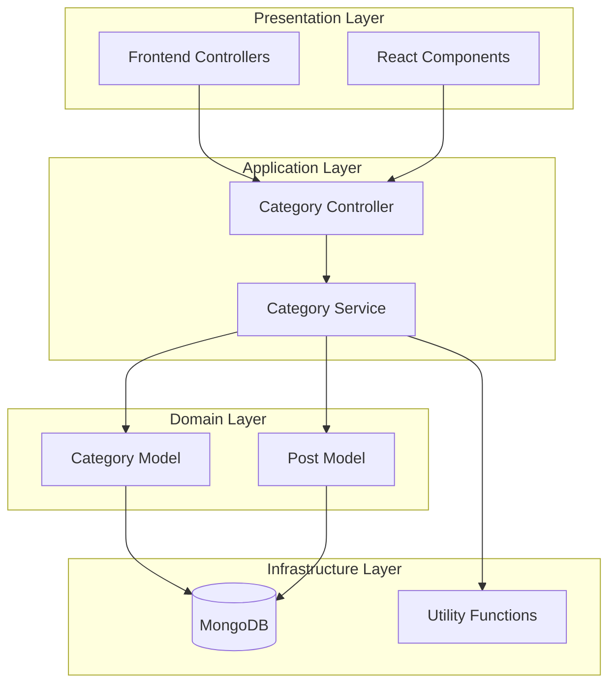
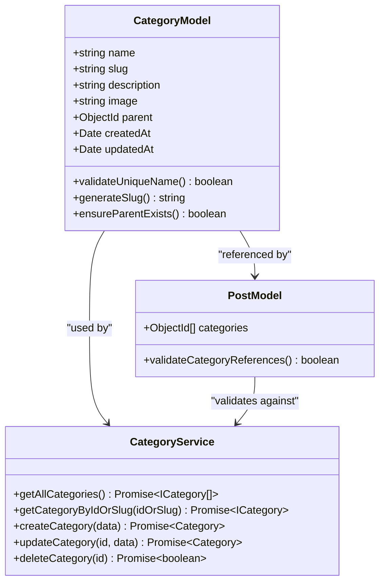
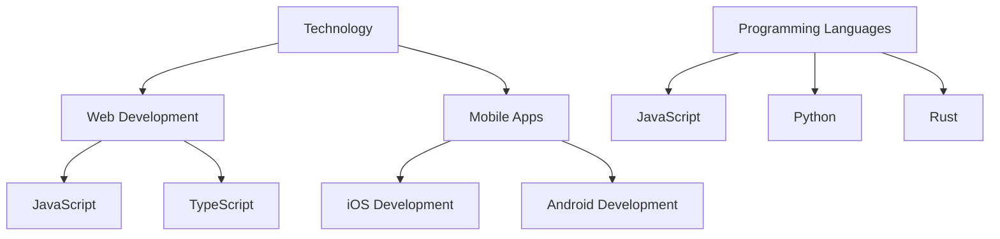
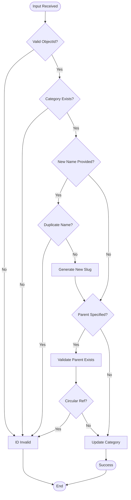

# Category Service

<cite>
**Referenced Files in This Document**
- [category.service.ts](file://api-fastify/src/services/category.service.ts)
- [category.model.ts](file://api-fastify/src/models/category.model.ts)
- [category.types.ts](file://api-fastify/src/types/category.types.ts)
- [category.controller.ts](file://api-fastify/src/controllers/category.controller.ts)
- [category.routes.ts](file://api-fastify/src/routes/category.routes.ts)
- [post.model.ts](file://api-fastify/src/models/post.model.ts)
- [utils/index.ts](file://api-fastify/src/utils/index.ts)
- [createCategory.tsx](file://src/pages/createCategory.tsx)
- [DelCategory.tsx](file://src/pages/DelCategory.tsx)
</cite>

## Table of Contents
1. [Introduction](#introduction)
2. [Architecture Overview](#architecture-overview)
3. [Core Components](#core-components)
4. [Category Model](#category-model)
5. [Service Operations](#service-operations)
6. [Hierarchical Management](#hierarchical-management)
7. [Data Validation and Business Rules](#data-validation-and-business-rules)
8. [Performance Considerations](#performance-considerations)
9. [Common Issues and Solutions](#common-issues-and-solutions)
10. [Frontend Integration](#frontend-integration)
11. [Best Practices](#best-practices)

## Introduction

The Category Service is a comprehensive system for managing hierarchical categories within the MERN_chatai_blog platform. It provides robust functionality for creating, updating, deleting, and organizing categories with support for nested hierarchies, automatic slug generation, and usage statistics tracking. The service ensures data integrity through sophisticated validation rules and prevents orphaned categories by enforcing referential constraints.

Categories serve as the primary organizational structure for blog posts, enabling users to categorize content systematically. The service supports complex scenarios including parent-child relationships, circular reference detection, and maintains comprehensive audit trails through MongoDB timestamps.

## Architecture Overview

The Category Service follows a layered architecture pattern with clear separation of concerns:



**Diagram sources**
- [category.controller.ts](file://api-fastify/src/controllers/category.controller.ts#L1-L235)
- [category.service.ts](file://api-fastify/src/services/category.service.ts#L1-L227)
- [category.model.ts](file://api-fastify/src/models/category.model.ts#L1-L45)

## Core Components

### Category Service Module

The Category Service module (`category.service.ts`) serves as the central business logic layer, implementing all CRUD operations with comprehensive validation and error handling.

```typescript
// Core service functions
export const getAllCategories = async () => { /* Implementation */ };
export const getCategoryByIdOrSlug = async (idOrSlug: string) => { /* Implementation */ };
export const createCategory = async (categoryData: CreateCategoryInput) => { /* Implementation */ };
export const updateCategory = async (id: string, updateData: UpdateCategoryInput) => { /* Implementation */ };
export const deleteCategory = async (id: string) => { /* Implementation */ };
```

### Category Types and Interfaces

The service defines clear type contracts for data validation and type safety:

```typescript
export interface ICategory extends Document {
  name: string;
  slug: string;
  description?: string;
  image?: string;
  parent?: ICategory['_id'];
  createdAt: Date;
  updatedAt: Date;
}
```

**Section sources**
- [category.service.ts](file://api-fastify/src/services/category.service.ts#L1-L227)
- [category.types.ts](file://api-fastify/src/types/category.types.ts#L1-L38)

## Category Model

The Category Model defines the data structure and validation rules for category entities:



**Diagram sources**
- [category.model.ts](file://api-fastify/src/models/category.model.ts#L1-L45)
- [category.service.ts](file://api-fastify/src/services/category.service.ts#L1-L50)
- [post.model.ts](file://api-fastify/src/models/post.model.ts#L1-L50)

### Model Schema Definition

The category model implements comprehensive validation:

```typescript
const categorySchema = new Schema<ICategory>({
  name: {
    type: String,
    required: true,
    trim: true,
    unique: true,
    minlength: 2,
    maxlength: 50,
  },
  slug: {
    type: String,
    required: true,
    unique: true,
    trim: true,
    lowercase: true,
  },
  parent: {
    type: Schema.Types.ObjectId,
    ref: 'Category',
  },
});
```

**Section sources**
- [category.model.ts](file://api-fastify/src/models/category.model.ts#L1-L45)

## Service Operations

### Get All Categories

The `getAllCategories` function retrieves all categories with associated post counts:

```typescript
export const getAllCategories = async () => {
  const categories = await Category.find().sort({ name: 1 });
  
  const categoriesWithPostCount = await Promise.all(
    categories.map(async (category) => {
      const postCount = await Post.countDocuments({
        categories: category._id,
        status: PostStatus.PUBLISHED,
      });
      
      return {
        ...category.toObject(),
        postCount,
      };
    })
  );
  
  return categoriesWithPostCount;
};
```

### Get Category by ID or Slug

The `getCategoryByIdOrSlug` function provides flexible category retrieval:

```typescript
export const getCategoryByIdOrSlug = async (idOrSlug: string) => {
  let query: any = {};
  
  if (isValidObjectId(idOrSlug)) {
    query._id = idOrSlug;
  } else {
    query.slug = idOrSlug;
  }
  
  const category = await Category.findOne(query).populate('parent', '_id name slug');
  
  if (!category) {
    throw new Error('Catégorie non trouvée');
  }
  
  const postCount = await Post.countDocuments({
    categories: category._id,
    status: PostStatus.PUBLISHED,
  });
  
  return {
    ...category.toObject(),
    postCount
  };
};
```

### Create Category

The `createCategory` function handles category creation with comprehensive validation:

```typescript
export const createCategory = async (categoryData: CreateCategoryInput) => {
  const { name, description, image, parent } = categoryData;
  
  // Check for duplicate name
  const existingCategory = await Category.findOne({ name });
  if (existingCategory) {
    throw new Error('Une catégorie avec ce nom existe déjà');
  }
  
  // Generate slug from name
  const slug = generateSlug(name);
  
  // Validate parent category if specified
  if (parent) {
    const parentCategory = await Category.findById(parent);
    if (!parentCategory) {
      throw new Error('Catégorie parent non trouvée');
    }
  }
  
  // Create new category
  const newCategory = new Category({
    name,
    slug,
    description,
    image,
    parent,
  });
  
  await newCategory.save();
  
  return {
    _id: newCategory._id,
    name: newCategory.name,
    slug: newCategory.slug,
  };
};
```

### Update Category

The `updateCategory` function implements sophisticated validation for updates:

```typescript
export const updateCategory = async (id: string, updateData: UpdateCategoryInput) => {
  // Validate ID
  if (!isValidObjectId(id)) {
    throw new Error('ID catégorie invalide');
  }
  
  const category = await Category.findById(id);
  if (!category) {
    throw new Error('Catégorie non trouvée');
  }
  
  // Check for duplicate name
  if (updateData.name && updateData.name !== category.name) {
    const existingCategory = await Category.findOne({ name: updateData.name });
    if (existingCategory) {
      throw new Error('Une catégorie avec ce nom existe déjà');
    }
    
    // Generate new slug if name changed
    updateData.slug = generateSlug(updateData.name);
  }
  
  // Validate parent category and prevent circular references
  if (updateData.parent) {
    // Prevent self-parenting
    if (updateData.parent === id) {
      throw new Error('Une catégorie ne peut pas être son propre parent');
    }
    
    // Check parent existence
    const parentCategory = await Category.findById(updateData.parent);
    if (!parentCategory) {
      throw new Error('Catégorie parent non trouvée');
    }
    
    // Detect circular references
    let currentParent = parentCategory;
    while (currentParent.parent) {
      if (currentParent.parent.toString() === id) {
        throw new Error('Référence circulaire détectée dans la hiérarchie des catégories');
      }
      const nextParent = await Category.findById(currentParent.parent);
      if (!nextParent) break;
      currentParent = nextParent;
    }
  }
  
  // Update category
  const updatedCategory = await Category.findByIdAndUpdate(
    id,
    { $set: updateData },
    { new: true }
  );
  
  return {
    _id: updatedCategory._id,
    name: updatedCategory.name,
    slug: updatedCategory.slug,
  };
};
```

### Delete Category

The `deleteCategory` function enforces referential integrity:

```typescript
export const deleteCategory = async (id: string) => {
  // Validate ID
  if (!isValidObjectId(id)) {
    throw new Error('ID catégorie invalide');
  }
  
  const category = await Category.findById(id);
  if (!category) {
    throw new Error('Catégorie non trouvée');
  }
  
  // Check for child categories
  const hasChildren = await Category.exists({ parent: id });
  if (hasChildren) {
    throw new Error('Impossible de supprimer une catégorie qui a des sous-catégories');
  }
  
  // Check for category usage in posts
  const isUsed = await Post.exists({ categories: id });
  if (isUsed) {
    throw new Error('Impossible de supprimer une catégorie utilisée par des articles');
  }
  
  // Delete category
  await Category.findByIdAndDelete(id);
  
  return true;
};
```

**Section sources**
- [category.service.ts](file://api-fastify/src/services/category.service.ts#L10-L227)

## Hierarchical Management

### Parent-Child Relationships

The category system supports hierarchical organization through parent-child relationships:



### Slug Generation Strategy

The service implements intelligent slug generation to ensure uniqueness:

```typescript
export const generateSlug = (title: string): string => {
  // Clean and normalize the title
  const baseSlug = title
    .toLowerCase()
    .trim()
    .replace(/[^\w\s-]/g, '')
    .replace(/[\s_-]+/g, '-')
    .replace(/^-+|-+$/g, '');

  // Add unique identifier to prevent duplicates
  return `${baseSlug}-${nanoid(6)}`;
};
```

### Circular Reference Prevention

The service detects and prevents circular references in category hierarchies:

```typescript
// During update operations, detect circular references
let currentParent = parentCategory;
while (currentParent.parent) {
  if (currentParent.parent.toString() === id) {
    throw new Error('Référence circulaire détectée dans la hiérarchie des catégories');
  }
  const nextParent = await Category.findById(currentParent.parent);
  if (!nextParent) break;
  currentParent = nextParent;
}
```

**Section sources**
- [utils/index.ts](file://api-fastify/src/utils/index.ts#L8-L18)
- [category.service.ts](file://api-fastify/src/services/category.service.ts#L100-L130)

## Data Validation and Business Rules

### Input Validation

The service implements comprehensive input validation:



**Diagram sources**
- [category.service.ts](file://api-fastify/src/services/category.service.ts#L100-L180)

### Business Rules Enforcement

1. **Unique Names**: No two categories can share the same name
2. **Slug Uniqueness**: Generated slugs must be globally unique
3. **Parent Validation**: Parent categories must exist and be valid
4. **Circular Reference Prevention**: Hierarchies cannot contain loops
5. **Referential Integrity**: Categories cannot be deleted if used by posts
6. **Self-Reference Prevention**: Categories cannot reference themselves as parents

### Usage Statistics Tracking

The service automatically tracks category usage through post associations:

```typescript
// Track post count for each category
const postCount = await Post.countDocuments({
  categories: category._id,
  status: PostStatus.PUBLISHED,
});
```

**Section sources**
- [category.service.ts](file://api-fastify/src/services/category.service.ts#L15-L35)

## Performance Considerations

### Indexing Strategies

The category model implements strategic indexing for optimal performance:

```typescript
// Automatic unique index on name and slug
categorySchema.index({ parent: 1 });
```

### Query Optimization

The service optimizes queries through:

1. **Population Limitation**: Only populate necessary fields
2. **Selective Field Projection**: Retrieve only required data
3. **Batch Operations**: Use Promise.all for concurrent operations
4. **Index Utilization**: Leverage MongoDB indexes effectively

### Caching Approaches

While not explicitly implemented in the current codebase, recommended caching strategies include:

```typescript
// Example caching implementation (not in current code)
const getCachedCategories = async () => {
  const cacheKey = 'all_categories';
  const cachedData = await redis.get(cacheKey);
  
  if (cachedData) {
    return JSON.parse(cachedData);
  }
  
  const categories = await getAllCategories();
  await redis.setex(cacheKey, 300, JSON.stringify(categories)); // 5-minute cache
  
  return categories;
};
```

**Section sources**
- [category.model.ts](file://api-fastify/src/models/category.model.ts#L35-L40)

## Common Issues and Solutions

### Issue: Circular References in Category Hierarchies

**Problem**: Attempting to create a category that would create a loop in the hierarchy.

**Solution**: The service detects circular references during updates:

```typescript
// Detect circular references
let currentParent = parentCategory;
while (currentParent.parent) {
  if (currentParent.parent.toString() === id) {
    throw new Error('Référence circulaire détectée dans la hiérarchie des catégories');
  }
  const nextParent = await Category.findById(currentParent.parent);
  if (!nextParent) break;
  currentParent = nextParent;
}
```

### Issue: Deleting Used Categories

**Problem**: Attempting to delete a category that is still associated with posts.

**Solution**: The service validates usage before deletion:

```typescript
// Check for category usage
const isUsed = await Post.exists({ categories: id });
if (isUsed) {
  throw new Error('Impossible de supprimer une catégorie utilisée par des articles');
}
```

### Issue: Duplicate Category Names

**Problem**: Creating categories with identical names.

**Solution**: The service enforces unique names:

```typescript
// Check for duplicate names
const existingCategory = await Category.findOne({ name });
if (existingCategory) {
  throw new Error('Une catégorie avec ce nom existe déjà');
}
```

### Issue: Performance with Large Hierarchies

**Problem**: Slow performance when retrieving deeply nested category hierarchies.

**Solution**: Implement lazy loading and pagination for large category trees:

```typescript
// Paginated category retrieval
export const getCategoriesPaginated = async (page = 1, limit = 20) => {
  const skip = (page - 1) * limit;
  
  const categories = await Category.find()
    .skip(skip)
    .limit(limit)
    .sort({ name: 1 });
    
  return categories;
};
```

**Section sources**
- [category.service.ts](file://api-fastify/src/services/category.service.ts#L100-L150)
- [category.service.ts](file://api-fastify/src/services/category.service.ts#L180-L210)

## Frontend Integration

### React Component Integration

The frontend provides comprehensive category management interfaces:

```typescript
// Category creation form
const handleSubmit = async (e: React.FormEvent) => {
  e.preventDefault();
  
  try {
    const response = await fetch(API_ENDPOINTS.categories.list, {
      method: "POST",
      headers: { "Content-Type": "application/json" },
      body: JSON.stringify({
        name: formData.name.trim(),
        description: formData.description
      }),
      credentials: "include",
    });
    
    if (!response.ok) {
      throw new Error("Failed to create category");
    }
    
    // Handle success
    showSuccess("Catégorie créée avec succès!");
    
  } catch (error) {
    showError("Erreur lors de la création de la catégorie");
  }
};
```

### Category Deletion Interface

The deletion interface provides bulk operations with confirmation:

```typescript
// Bulk category deletion
const handleDelete = async () => {
  const results = await Promise.all(
    selectedCategories.map(async (categoryId) => {
      try {
        const response = await fetch(`${API_ENDPOINTS.categories.list}/${categoryId}`, {
          method: "DELETE",
          credentials: "include",
        });
        
        if (!response.ok) {
          return { id: categoryId, success: false, message: data.message };
        }
        
        return { id: categoryId, success: true };
      } catch (error) {
        return { id: categoryId, success: false, message: "Network error" };
      }
    })
  );
  
  // Process results and update UI
  const successIds = results.filter(r => r.success).map(r => r.id);
  const failedIds = results.filter(r => !r.success).map(r => r.id);
  
  // Update category list and show notifications
  setCategories(prevCategories =>
    prevCategories.filter(category => !successIds.includes(category._id))
  );
};
```

**Section sources**
- [createCategory.tsx](file://src/pages/createCategory.tsx#L80-L120)
- [DelCategory.tsx](file://src/pages/DelCategory.tsx#L120-L180)

## Best Practices

### Error Handling

Implement comprehensive error handling with meaningful messages:

```typescript
try {
  const result = await CategoryService.createCategory(categoryData);
  return reply.status(201).send({
    message: 'Catégorie créée avec succès',
    category: result,
  });
} catch (error) {
  if (error instanceof Error) {
    if (error.message === 'Une catégorie avec ce nom existe déjà') {
      return reply.status(400).send({
        message: error.message,
      });
    }
  }
  throw error;
}
```

### Data Validation

Always validate data at multiple layers:

1. **Frontend Validation**: Immediate feedback for users
2. **API Validation**: Request schema validation
3. **Service Validation**: Business logic validation
4. **Database Constraints**: Unique indexes and required fields

### Security Considerations

1. **Authentication**: Require authentication for all category operations
2. **Authorization**: Restrict category management to authorized users
3. **Input Sanitization**: Prevent injection attacks through proper validation
4. **Rate Limiting**: Implement rate limiting for API endpoints

### Testing Strategies

1. **Unit Tests**: Test individual service functions
2. **Integration Tests**: Test service interactions with models
3. **End-to-End Tests**: Test complete user workflows
4. **Performance Tests**: Test with large datasets and complex hierarchies

### Monitoring and Logging

Implement comprehensive logging for debugging and monitoring:

```typescript
// Log category operations
request.log.info({
  operation: 'create_category',
  userId: request.user?.id,
  categoryName: categoryData.name,
  timestamp: new Date(),
});
```

The Category Service provides a robust foundation for hierarchical content organization in the MERN_chatai_blog platform. Its comprehensive validation, referential integrity enforcement, and performance optimizations make it suitable for production environments while maintaining developer-friendly APIs and intuitive user interfaces.