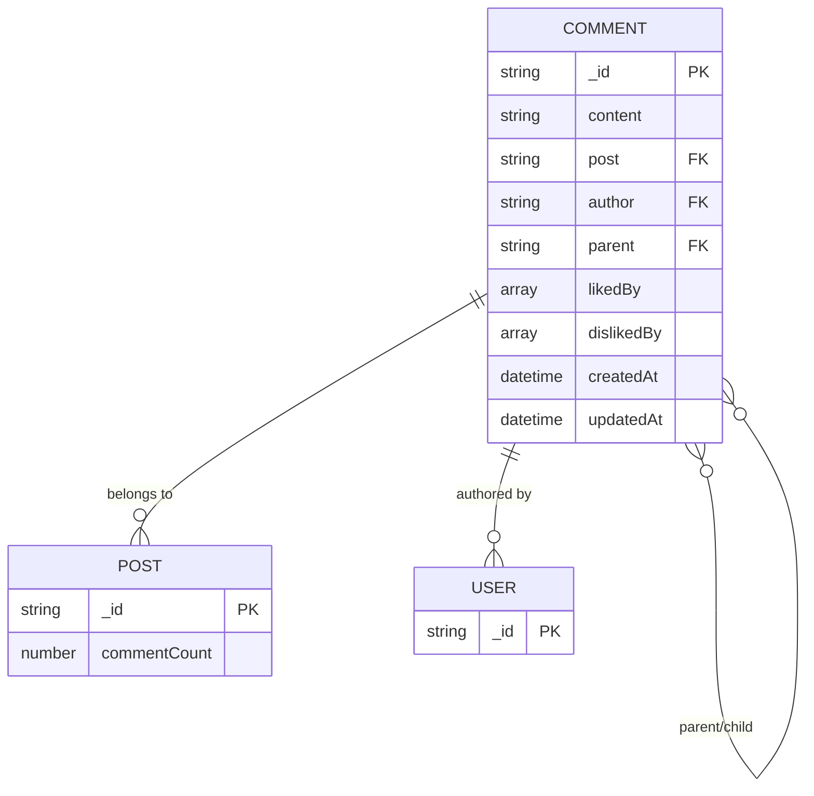
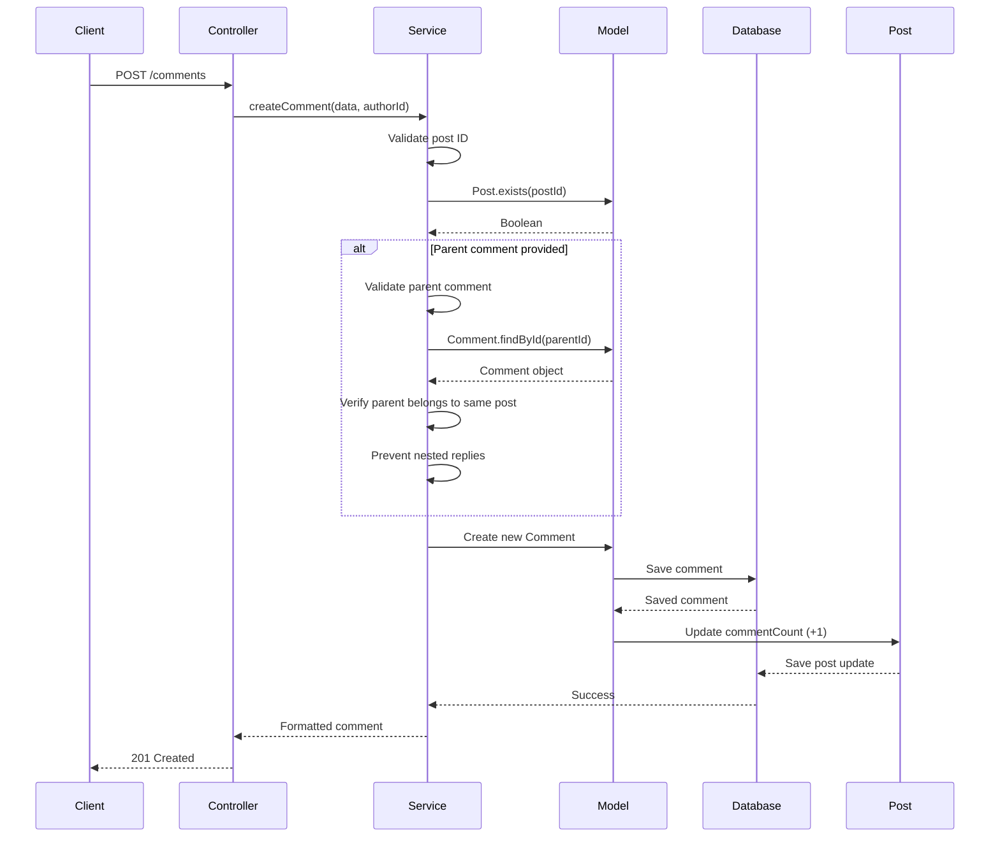
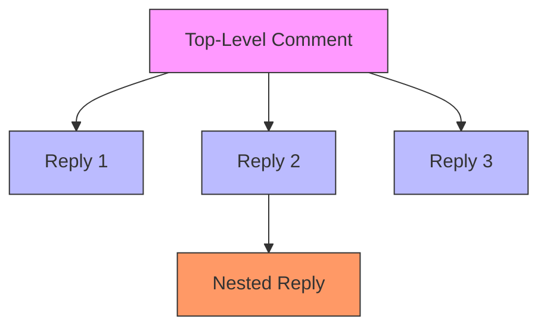
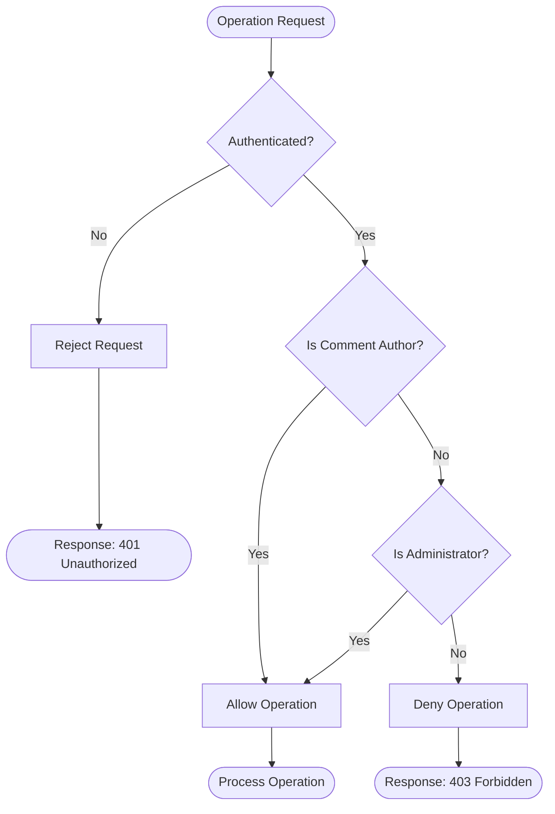
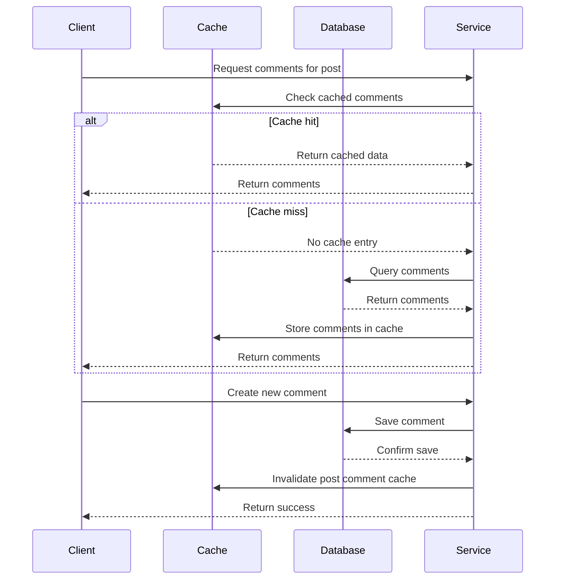
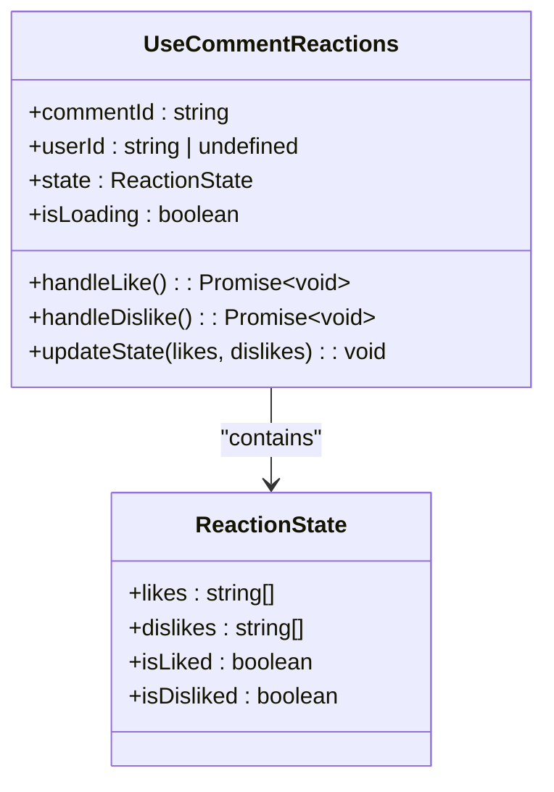

# Comment Service

<cite>
**Referenced Files in This Document**   
- [comment.model.ts](file://api-fastify/src/models/comment.model.ts)
- [comment.service.ts](file://api-fastify/src/services/comment.service.ts)
- [comment.controller.ts](file://api-fastify/src/controllers/comment.controller.ts)
- [comment.schema.ts](file://api-fastify/src/schemas/comment.schema.ts)
- [comment.types.ts](file://api-fastify/src/types/comment.types.ts)
- [post.model.ts](file://api-fastify/src/models/post.model.ts)
- [simple-reaction.service.ts](file://api-fastify/src/services/simple-reaction.service.ts)
- [cache-invalidation.ts](file://api-fastify/src/utils/cache-invalidation.ts)
- [useCommentReactions.ts](file://src/hooks/useCommentReactions.ts)
- [api.config.ts](file://src/config/api.config.ts)
</cite>

## Table of Contents
1. [Introduction](#introduction)
2. [Comment Model Structure](#comment-model-structure)
3. [Core Operations](#core-operations)
4. [Thread Management](#thread-management)
5. [Business Rules and Validation](#business-rules-and-validation)
6. [Moderation and Security](#moderation-and-security)
7. [Performance and Caching](#performance-and-caching)
8. [API Endpoints](#api-endpoints)
9. [Client-Side Integration](#client-side-integration)
10. [Error Handling](#error-handling)
11. [Conclusion](#conclusion)

## Introduction

The Comment Service in MERN_chatai_blog provides a comprehensive system for managing user comments on blog posts. This service enables users to create, edit, delete, and interact with comments through likes and dislikes, while maintaining a structured hierarchy through comment threading. The service is built on a robust backend using Fastify, MongoDB with Mongoose, and follows a clean separation of concerns with controllers, services, models, and schemas.

The comment system is designed to be both user-friendly and technically sound, supporting nested replies while preventing overly complex threading. It integrates seamlessly with the post model to maintain accurate comment counts and provides efficient data retrieval through pagination and caching mechanisms. The service also implements proper authentication and authorization to ensure that users can only modify their own comments while administrators have broader moderation capabilities.

This documentation provides a detailed explanation of the comment service's architecture, operations, and implementation details, making it accessible to developers of all experience levels while providing the technical depth needed for effective implementation and maintenance.

## Comment Model Structure

The comment model defines the structure and relationships for storing comment data in the MongoDB database. Each comment contains essential fields for content, authorship, and hierarchical organization, with proper indexing for optimal query performance.

**Diagram sources**
- [comment.model.ts](file://api-fastify/src/models/comment.model.ts#L1-L77)
- [post.model.ts](file://api-fastify/src/models/post.model.ts#L1-L135)

**Section sources**
- [comment.model.ts](file://api-fastify/src/models/comment.model.ts#L1-L77)
- [comment.types.ts](file://api-fastify/src/types/comment.types.ts#L1-L48)

The comment model includes several key fields:

- **content**: The actual text of the comment, with validation for minimum length (1 character) and maximum length (1000 characters)
- **post**: Reference to the parent post, establishing the relationship between comments and blog articles
- **author**: Reference to the user who created the comment
- **parent**: Optional reference to another comment, enabling the threading functionality
- **likedBy/dislikedBy**: Arrays of user IDs who have liked or disliked the comment
- **timestamps**: Automatically managed createdAt and updatedAt fields

The model implements several database indexes to optimize query performance:
- `{ post: 1, createdAt: -1 }`: For efficiently retrieving comments by post in chronological order
- `{ parent: 1 }`: For quickly finding all replies to a specific comment
- `{ author: 1 }`: For queries related to a user's comment history

Additionally, the model includes middleware hooks that automatically update the comment count on the associated post whenever a comment is created or deleted, ensuring data consistency across the application.

## Core Operations

The comment service provides a complete set of operations for managing comments throughout their lifecycle. These operations are implemented in a service-layer pattern that separates business logic from request handling, making the code more maintainable and testable.

### Create Operation

The create operation allows authenticated users to add new comments to posts or reply to existing comments. When creating a comment, the service validates the input data, checks the existence of the target post, and verifies that any parent comment belongs to the same post.

**Diagram sources**
- [comment.service.ts](file://api-fastify/src/services/comment.service.ts#L200-L332)
- [comment.controller.ts](file://api-fastify/src/controllers/comment.controller.ts#L200-L250)

**Section sources**
- [comment.service.ts](file://api-fastify/src/services/comment.service.ts#L200-L332)
- [comment.controller.ts](file://api-fastify/src/controllers/comment.controller.ts#L200-L250)
- [comment.schema.ts](file://api-fastify/src/schemas/comment.schema.ts#L200-L250)

### Read Operations

The service provides multiple methods for retrieving comments, including getting all comments for a post and retrieving a specific comment by ID. The `getPostComments` function is particularly important as it handles both top-level comments and their replies in a single efficient query.

When retrieving comments for a post, the service implements pagination to prevent performance issues with posts that have many comments. The default page size is 10 comments, with a maximum limit of 100 per request to prevent abuse.

For top-level comments (those without a parent), the service automatically includes their replies by making additional queries to fetch child comments. This reduces the number of round trips needed by the client application while maintaining a clean hierarchical structure in the response.

### Update and Delete Operations

The update and delete operations include strict authorization checks to ensure that only the comment author or an administrator can modify or remove a comment. This security measure prevents unauthorized users from altering content they don't own.

The delete operation includes cascade functionality: when a top-level comment is deleted, all of its replies are also removed from the database. This maintains data integrity and prevents orphaned comments in the system.

Both operations trigger appropriate updates to the parent post's comment count through the model's middleware, ensuring that the post always displays the correct number of comments.

## Thread Management

The comment service implements a sophisticated threading system that allows users to engage in conversations while maintaining a clean and organized structure. The threading model is designed to be simple yet effective, preventing overly complex nested discussions that can be difficult to follow.

### Hierarchical Structure

The threading system is built around the `parent` field in the comment model, which references another comment document. This creates a parent-child relationship where replies are directly connected to the comment they respond to.

**Diagram sources**
- [comment.model.ts](file://api-fastify/src/models/comment.model.ts#L1-L77)
- [comment.service.ts](file://api-fastify/src/services/comment.service.ts#L1-L199)

**Section sources**
- [comment.service.ts](file://api-fastify/src/services/comment.service.ts#L1-L199)
- [comment.model.ts](file://api-fastify/src/models/comment.model.ts#L1-L77)

### Threading Rules

The system enforces specific business rules to maintain a clean conversation flow:

1. **Single-level nesting**: The service prevents "nested replies" by checking if a parent comment already has its own parent. If so, the creation of a reply is rejected with the error "Les réponses imbriquées ne sont pas autorisées" (Nested replies are not allowed).

2. **Same-post constraint**: Replies must belong to the same post as their parent comment. The service verifies this by comparing the post reference of the parent comment with the target post ID.

3. **Parent existence validation**: Before creating a reply, the service confirms that the parent comment exists in the database.

These rules create a flat threading structure where users can reply to top-level comments but cannot create multiple levels of nested responses. This design choice improves readability and prevents complex thread structures that can be confusing to follow.

### Data Structure

The service returns comments in a structured format that includes replies embedded within their parent comments. This eliminates the need for clients to reconstruct the thread hierarchy from a flat list of comments.

The `CommentResponse` type includes an optional `replies` field that contains an array of reply comments, each of which follows the same structure. This recursive definition allows for consistent data handling on the client side, regardless of whether a comment has replies or not.

## Business Rules and Validation

The comment service enforces several business rules and validation requirements to ensure data quality, security, and a positive user experience. These rules are implemented at multiple levels of the application, from schema validation to service-layer logic.

### Content Validation

The service applies strict validation to comment content to maintain quality and prevent abuse:

- **Length constraints**: Comments must be between 1 and 1000 characters, ensuring they contain meaningful content while preventing excessively long comments.
- **Required fields**: The content and post fields are required, ensuring every comment is properly associated with a post.
- **Trimming**: Whitespace is automatically trimmed from the beginning and end of comment content.

These validations are defined in both the schema layer (using Fastify's validation system) and reinforced in the service layer for comprehensive protection.

### Relationship Validation

The service implements several checks to maintain the integrity of relationships between comments, posts, and users:

- **Post existence**: Before creating a comment, the service verifies that the target post exists.
- **Parent validation**: When creating a reply, the service checks that the parent comment exists and belongs to the same post.
- **Cross-post prevention**: The system prevents users from creating replies that would connect comments across different posts.

### Authorization Rules

The service enforces strict authorization policies for comment modification:

- **Ownership requirement**: Users can only edit or delete comments they authored.
- **Administrative override**: Administrators have the ability to modify any comment, providing moderation capabilities.
- **Authentication requirement**: All write operations (create, update, delete) require authenticated users.

These rules are implemented in the service layer, where the current user's ID and role are compared against the comment's author information to determine if the operation should be permitted.

**Diagram sources**
- [comment.service.ts](file://api-fastify/src/services/comment.service.ts#L250-L332)
- [comment.controller.ts](file://api-fastify/src/controllers/comment.controller.ts#L250-L350)

**Section sources**
- [comment.service.ts](file://api-fastify/src/services/comment.service.ts#L250-L332)
- [comment.controller.ts](file://api-fastify/src/controllers/comment.controller.ts#L250-L350)

## Moderation and Security

The comment service includes several moderation and security features to maintain a healthy community and prevent abuse. These features are designed to empower both automated systems and human moderators to manage content effectively.

### Reaction System

The service implements a comprehensive reaction system that allows users to express their opinions through likes and dislikes. This system is built on the SimpleReactionService, which handles the logic for updating comment reactions.

Key features of the reaction system include:

- **Mutual exclusivity**: When a user likes a comment, any previous dislike is automatically removed, and vice versa.
- **Toggle functionality**: Users can remove their reaction by performing the same action again (e.g., clicking "like" again to unlike).
- **Real-time updates**: The service returns the updated reaction counts and user-specific status in the response, allowing the UI to update immediately.

The reaction system also includes protection against duplicate actions, preventing users from liking or disliking a comment multiple times.

### Data Normalization

To ensure consistency between the backend and frontend, the service normalizes data field names when returning comment information. The database stores reaction data in `likedBy` and `dislikedBy` fields, but these are transformed to `likes` and `dislikes` in the API response to match frontend expectations.

This normalization also includes derived fields such as `likeCount`, `dislikeCount`, `isLiked`, and `isDisliked`, which provide convenient access to commonly needed information without requiring additional computation on the client side.

### Security Measures

The service implements several security measures to protect against common web vulnerabilities:

- **Input validation**: All incoming data is validated against defined schemas to prevent malformed or malicious content.
- **Authentication enforcement**: The auth.middleware ensures that users are properly authenticated before performing write operations.
- **Object ID validation**: The service verifies that all provided IDs are valid MongoDB ObjectIds before using them in database queries.
- **Error handling**: Detailed error messages are only provided for client-side validation issues, while internal errors return generic messages to prevent information disclosure.

## Performance and Caching

The comment service incorporates several performance optimizations to ensure fast response times and efficient resource utilization, particularly important for posts with large numbers of comments.

### Pagination Strategy

The service implements server-side pagination to manage large comment threads efficiently. When retrieving comments for a post, clients can specify the page number and limit (number of comments per page) through query parameters.

The default configuration returns 10 comments per page, with the ability to navigate through results using the total, page, limit, and totalPages fields in the response. This approach prevents performance degradation when posts have hundreds or thousands of comments.

For top-level comments, the service retrieves the specified page of parent comments and then fetches all replies for those comments in a separate query. This two-step process balances the need for hierarchical data with performance considerations.

### Caching Implementation

The service uses a comprehensive caching strategy to reduce database load and improve response times:

- **Cache invalidation**: When comments are created, updated, or deleted, the relevant cache entries are automatically invalidated.
- **Targeted invalidation**: The cache-invalidation utility specifically targets comment cache entries for the affected post, ensuring that users see up-to-date information.
- **Centralized cache management**: Cache invalidation is handled through a dedicated utility, providing a consistent approach across different operations.

**Diagram sources**
- [cache-invalidation.ts](file://api-fastify/src/utils/cache-invalidation.ts#L1-L17)
- [comment.controller.ts](file://api-fastify/src/controllers/comment.controller.ts#L350-L450)

**Section sources**
- [cache-invalidation.ts](file://api-fastify/src/utils/cache-invalidation.ts#L1-L17)
- [comment.controller.ts](file://api-fastify/src/controllers/comment.controller.ts#L350-L450)

The caching system is particularly important for the reaction functionality, where frequent updates to like and dislike counts could otherwise create significant database load. By invalidating the cache when reactions change, the system ensures that users see the most current reaction counts while minimizing direct database queries.

## API Endpoints

The comment service exposes a comprehensive set of RESTful endpoints that follow consistent patterns for resource management. These endpoints are defined in the comment.routes.ts file and follow the Fastify framework conventions.

### Endpoint Overview

The service provides the following endpoints:

| Endpoint | Method | Description | Authentication |
|---------|--------|-------------|----------------|
| /comments/post/:post | GET | Retrieve comments for a post | Optional |
| /comments/:id | GET | Retrieve a specific comment | Optional |
| /comments | POST | Create a new comment | Required |
| /comments/:id | PUT | Update a comment | Required |
| /comments/:id | DELETE | Delete a comment | Required |
| /comments/:id/like | POST | Like a comment | Required |
| /comments/:id/unlike | POST | Remove like from comment | Required |
| /comments/:id/dislike | POST | Dislike a comment | Required |

**Section sources**
- [comment.routes.ts](file://api-fastify/src/routes/comment.routes.ts#L1-L128)
- [comment.schema.ts](file://api-fastify/src/schemas/comment.schema.ts#L1-L448)

### Request and Response Structure

Each endpoint follows a consistent pattern for request validation and response formatting. The service uses Fastify's schema validation to ensure that incoming data meets the required specifications.

For example, when creating a comment, the request body must include the content and post fields, with optional parent field for replies. The response returns the created comment with normalized field names and derived properties for easy consumption by the frontend.

Error responses follow a standardized format with appropriate HTTP status codes and descriptive messages, making it easier for clients to handle different error conditions appropriately.

## Client-Side Integration

The comment service is designed to work seamlessly with the frontend application, providing a smooth user experience for interacting with comments. The client-side implementation leverages the structured API responses to create an intuitive comment interface.

### React Hook Implementation

The frontend uses a custom React hook, `useCommentReactions`, to manage the state and interactions for comment reactions. This hook encapsulates the logic for liking and disliking comments, providing a clean API for components to use.

**Diagram sources**
- [useCommentReactions.ts](file://src/hooks/useCommentReactions.ts#L1-L91)

**Section sources**
- [useCommentReactions.ts](file://src/hooks/useCommentReactions.ts#L1-L91)
- [api.config.ts](file://src/config/api.config.ts#L1-L272)

The hook manages the local state of reactions, handles the API calls, and updates the UI accordingly. It includes loading states to provide visual feedback during network requests and error handling to gracefully manage failed operations.

### API Configuration

The frontend configuration defines the endpoints for the comment service, making it easy to construct the appropriate URLs for different operations. The API_ENDPOINTS configuration includes specific functions for comment-related operations, such as creating, updating, and reacting to comments.

This centralized configuration ensures consistency across the application and makes it easier to modify endpoint URLs if needed, without having to update multiple files.

## Error Handling

The comment service implements comprehensive error handling at multiple levels to provide meaningful feedback to clients while maintaining system stability.

### Error Types

The service distinguishes between different types of errors and returns appropriate HTTP status codes:

- **400 Bad Request**: Invalid input data, such as malformed IDs or missing required fields
- **403 Forbidden**: Authorization failures, when a user attempts to modify a comment they don't own
- **404 Not Found**: Resource not found, such as when referencing a non-existent post or comment
- **500 Internal Server Error**: Unexpected server errors

### Error Propagation

Errors are handled consistently throughout the service layers:

1. **Controller layer**: Catches errors from the service layer and maps them to appropriate HTTP responses
2. **Service layer**: Throws descriptive errors that the controller can interpret
3. **Validation layer**: Provides specific error messages for schema validation failures

This layered approach allows for precise error handling while maintaining clean separation of concerns. The controller can provide user-friendly messages based on the type of error, while the service layer focuses on business logic and data integrity.

## Conclusion

The Comment Service in MERN_chatai_blog provides a robust, secure, and user-friendly system for managing blog post comments. Through its well-structured model, comprehensive API, and thoughtful business rules, the service enables rich user interactions while maintaining data integrity and performance.

Key strengths of the implementation include:

- **Clean architecture**: Clear separation of concerns between controllers, services, models, and schemas
- **Performance optimization**: Effective use of pagination and caching to handle large comment threads
- **Security**: Proper authentication and authorization controls to prevent unauthorized access
- **User experience**: Intuitive threading model and reaction system that encourages engagement

The service successfully balances technical requirements with user needs, providing a foundation for vibrant community discussions on blog posts. Its modular design makes it easy to maintain and extend, while its comprehensive documentation ensures that developers can understand and work with the system effectively.

By following established patterns and best practices, the comment service contributes to the overall quality and reliability of the MERN_chatai_blog application, demonstrating how thoughtful design can create engaging user experiences while maintaining technical excellence.