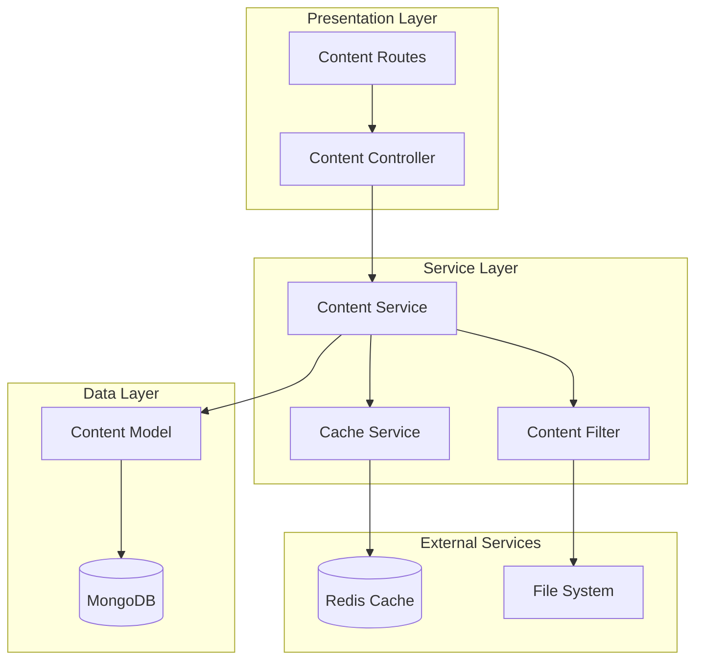
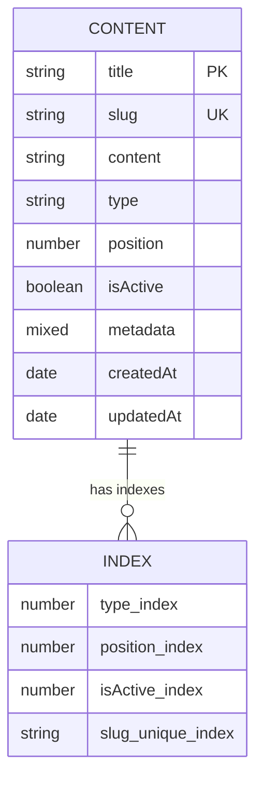
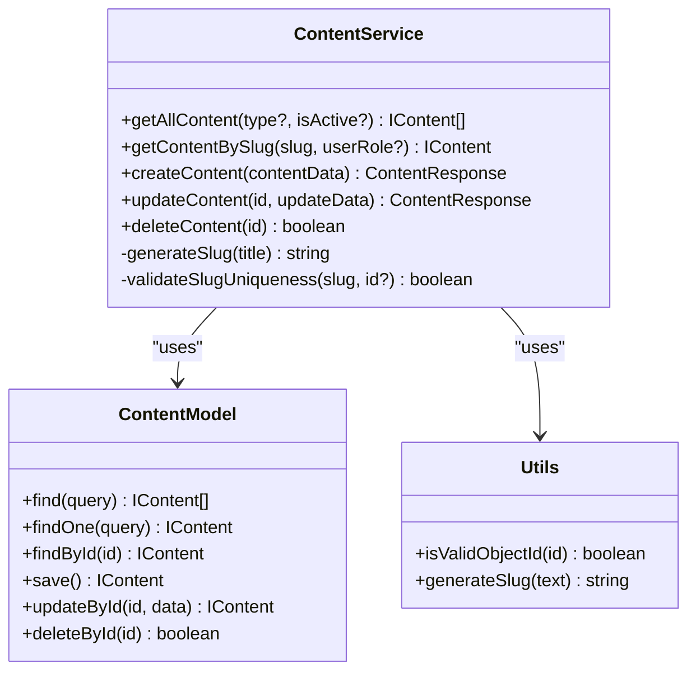
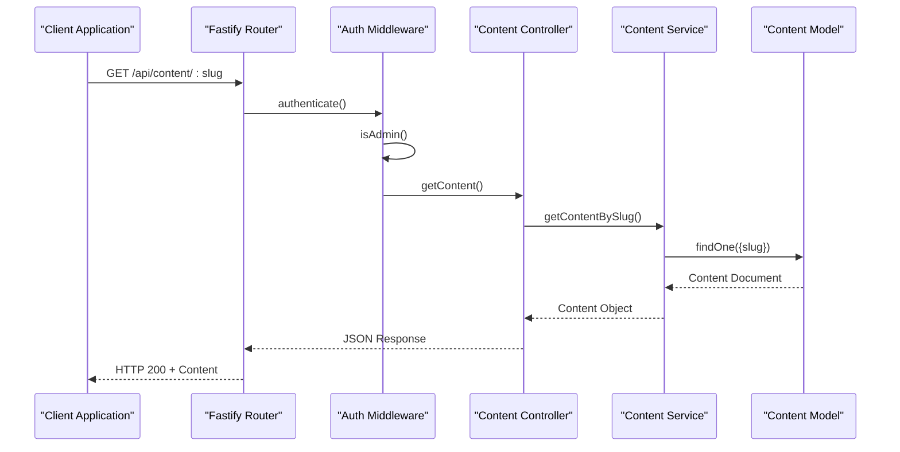
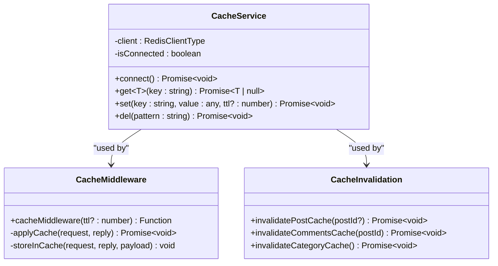
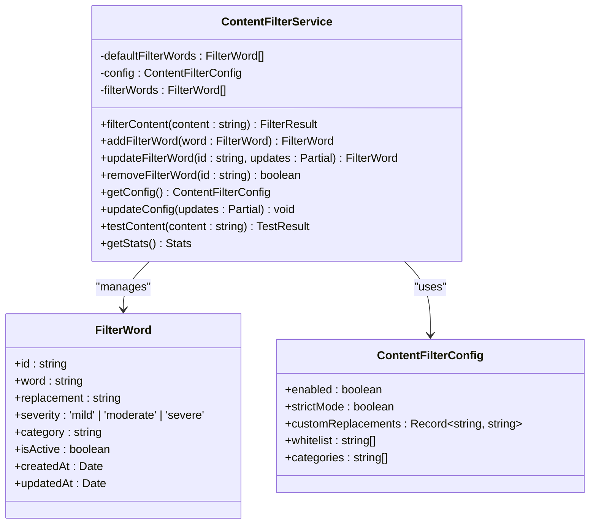
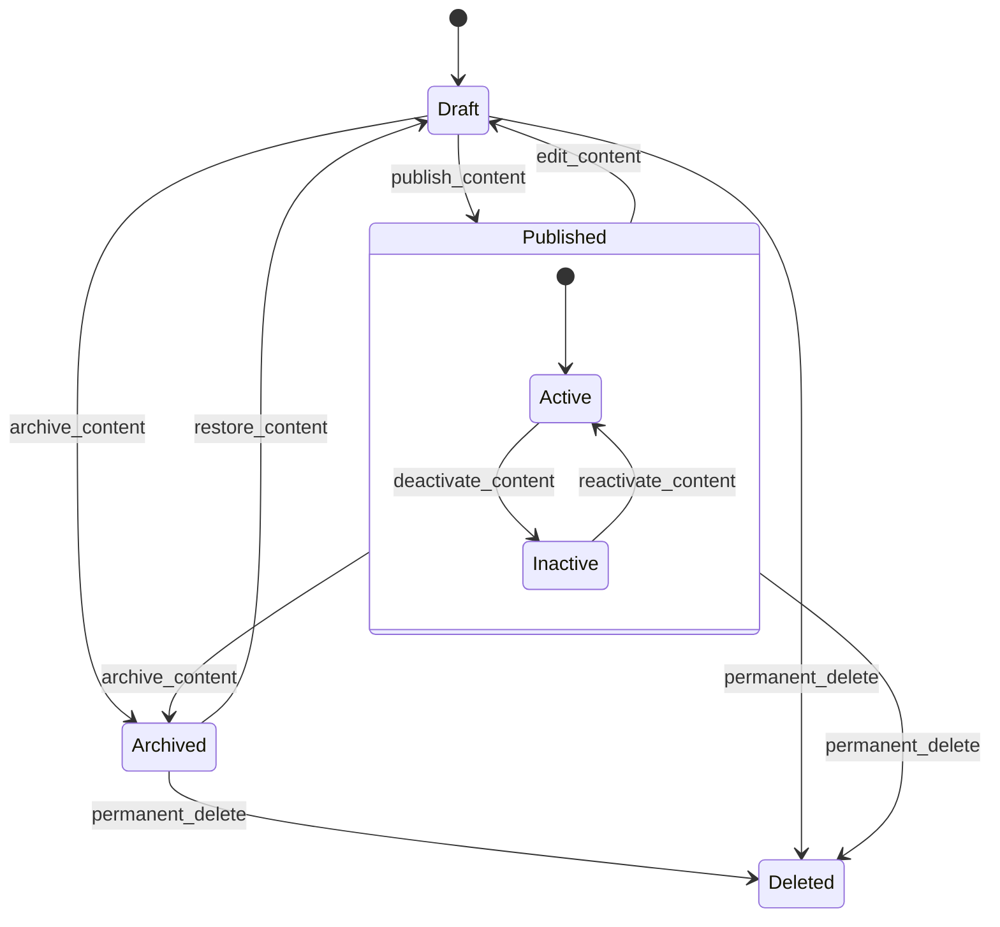
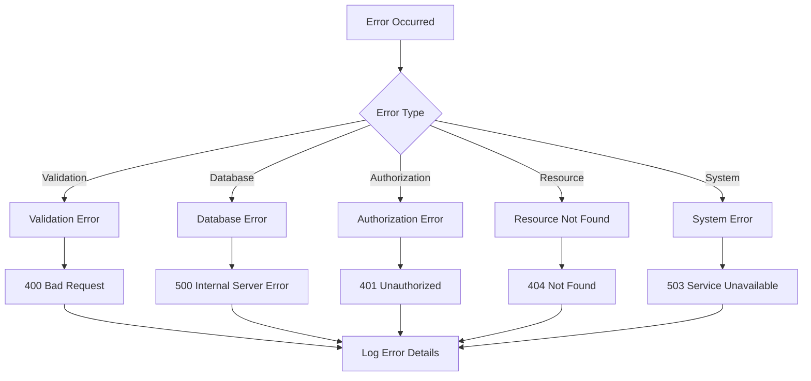

# Content Service

<cite>
**Referenced Files in This Document**
- [content.service.ts](file://api-fastify/src/services/content.service.ts)
- [content.model.ts](file://api-fastify/src/models/content.model.ts)
- [content.types.ts](file://api-fastify/src/types/content.types.ts)
- [content.controller.ts](file://api-fastify/src/controllers/content.controller.ts)
- [content.routes.ts](file://api-fastify/src/routes/content.routes.ts)
- [content.schema.ts](file://api-fastify/src/schemas/content.schema.ts)
- [cache.service.ts](file://api-fastify/src/services/cache.service.ts)
- [cache.middleware.ts](file://api-fastify/src/middlewares/cache.middleware.ts)
- [cache-invalidation.ts](file://api-fastify/src/utils/cache-invalidation.ts)
- [contentFilter.ts](file://src/services/contentFilter.ts)
</cite>

## Table of Contents
1. [Introduction](#introduction)
2. [Architecture Overview](#architecture-overview)
3. [Core Components](#core-components)
4. [Content Model and Data Structure](#content-model-and-data-structure)
5. [Service Layer Implementation](#service-layer-implementation)
6. [Controller and Routing](#controller-and-routing)
7. [Caching Strategy](#caching-strategy)
8. [Content Filtering](#content-filtering)
9. [Business Rules and Validation](#business-rules-and-validation)
10. [Performance Considerations](#performance-considerations)
11. [Error Handling and Troubleshooting](#error-handling-and-troubleshooting)
12. [Best Practices](#best-practices)
13. [Conclusion](#conclusion)

## Introduction

The Content Service is a comprehensive static content management system built for the MERN_chatai_blog platform. This service handles the complete lifecycle of static content including creation, retrieval, updating, deletion, caching, and versioning. It serves as the backbone for managing various types of content such as pages, sections, and blocks that power the blog's static elements.

The service is designed with modern web development best practices, incorporating robust caching mechanisms, content filtering, and comprehensive validation to ensure optimal performance and content quality. It supports multiple content types and provides flexible querying capabilities for different use cases.

## Architecture Overview

The Content Service follows a layered architecture pattern with clear separation of concerns:



**Diagram sources**
- [content.routes.ts](file://api-fastify/src/routes/content.routes.ts#L1-L79)
- [content.controller.ts](file://api-fastify/src/controllers/content.controller.ts#L1-L209)
- [content.service.ts](file://api-fastify/src/services/content.service.ts#L1-L158)

## Core Components

The Content Service consists of several interconnected components that work together to provide comprehensive content management capabilities:

### Content Types Enumeration

The service defines three primary content types that determine how content is structured and displayed:

```typescript
export enum ContentType {
  PAGE = 'page',
  SECTION = 'section',
  BLOCK = 'block',
}
```

Each content type serves a specific purpose:
- **PAGE**: Complete web pages with full HTML structure
- **SECTION**: Major divisions within pages containing multiple blocks
- **BLOCK**: Individual content units that can be combined into sections

### Content Interface Definition

The core data structure defines the shape of all content objects:

```typescript
export interface IContent extends Document {
  title: string;
  slug: string;
  content: string;
  type: ContentType;
  position?: number;
  isActive: boolean;
  metadata?: Record<string, any>;
  createdAt: Date;
  updatedAt: Date;
}
```

**Section sources**
- [content.types.ts](file://api-fastify/src/types/content.types.ts#L1-L51)
- [content.model.ts](file://api-fastify/src/models/content.model.ts#L1-L54)

## Content Model and Data Structure

The Content Model is built on MongoDB using Mongoose for type-safe data persistence. The model includes comprehensive validation and indexing for optimal performance.

### Schema Design



**Diagram sources**
- [content.model.ts](file://api-fastify/src/models/content.model.ts#L5-L35)

### Field Specifications

The model enforces strict validation rules:

- **Title**: Required, min 2 chars, max 200 chars, trimmed and validated
- **Slug**: Unique, required, lowercase, automatically generated if not provided
- **Content**: Required field containing the actual content
- **Type**: Enumerated type with strict validation
- **Position**: Numeric field for ordering content within types
- **IsActive**: Boolean flag for content visibility
- **Metadata**: Flexible object for storing additional data

### Indexing Strategy

The model implements strategic indexing for performance optimization:

```typescript
contentSchema.index({ type: 1, position: 1 });
contentSchema.index({ isActive: 1 });
```

These indexes enable efficient queries for:
- Content sorting by type and position
- Active content filtering
- Slug-based lookups

**Section sources**
- [content.model.ts](file://api-fastify/src/models/content.model.ts#L1-L54)

## Service Layer Implementation

The Content Service provides the core business logic for content operations, implementing comprehensive CRUD functionality with advanced features like slug generation and conflict resolution.

### Service Methods Overview



**Diagram sources**
- [content.service.ts](file://api-fastify/src/services/content.service.ts#L1-L158)

### Content Retrieval Operations

The service provides flexible content retrieval with multiple filtering options:

#### Get All Content
```typescript
export const getAllContent = async (type?: ContentType, isActive?: boolean) => {
  const query: any = {};
  
  if (type) query.type = type;
  if (isActive !== undefined) query.isActive = isActive;
  
  const contents = await Content.find(query)
    .select('-content -metadata')
    .sort({ type: 1, position: 1 });
    
  return contents;
};
```

#### Get Content by Slug
```typescript
export const getContentBySlug = async (slug: string, userRole?: string) => {
  const content = await Content.findOne({ slug });
  
  if (!content) throw new Error('Contenu non trouvé');
  if (!content.isActive && userRole !== 'admin') {
    throw new Error('Contenu non trouvé');
  }
  
  return content;
};
```

### Content Creation and Validation

The creation process includes comprehensive validation and automatic slug generation:

```typescript
export const createContent = async (contentData: CreateContentInput) => {
  const { title, content, type, slug, position, isActive, metadata } = contentData;
  
  // Generate slug if not provided
  const finalSlug = slug || generateSlug(title);
  
  // Check for slug uniqueness
  const existingContent = await Content.findOne({ slug: finalSlug });
  if (existingContent) {
    throw new Error('Un contenu avec ce slug existe déjà');
  }
  
  // Create new content
  const newContent = new Content({
    title,
    content,
    type,
    slug: finalSlug,
    position: position || 0,
    isActive: isActive !== undefined ? isActive : true,
    metadata: metadata || {},
  });
  
  await newContent.save();
  
  return {
    _id: newContent._id,
    title: newContent.title,
    slug: newContent.slug,
  };
};
```

### Content Update and Conflict Resolution

The update operation includes sophisticated conflict detection and resolution:

```typescript
export const updateContent = async (id: string, updateData: UpdateContentInput) => {
  // Validate ID
  if (!isValidObjectId(id)) {
    throw new Error('ID contenu invalide');
  }
  
  // Retrieve existing content
  const content = await Content.findById(id);
  if (!content) {
    throw new Error('Contenu non trouvé');
  }
  
  // Auto-generate slug if title changed and no slug provided
  if (updateData.title && updateData.title !== content.title && !updateData.slug) {
    updateData.slug = generateSlug(updateData.title);
  }
  
  // Check slug uniqueness
  if (updateData.slug && updateData.slug !== content.slug) {
    const existingContent = await Content.findOne({ slug: updateData.slug });
    if (existingContent && existingContent._id.toString() !== id) {
      throw new Error('Un contenu avec ce slug existe déjà');
    }
  }
  
  // Perform update
  const updatedContent = await Content.findByIdAndUpdate(
    id,
    { $set: updateData },
    { new: true }
  ) as IContent | null;
  
  if (!updatedContent) {
    throw new Error('Erreur lors de la mise à jour du contenu');
  }
  
  return {
    _id: updatedContent._id,
    title: updatedContent.title,
    slug: updatedContent.slug,
  };
};
```

**Section sources**
- [content.service.ts](file://api-fastify/src/services/content.service.ts#L1-L158)

## Controller and Routing

The Content Controller and Routes provide a RESTful API interface with comprehensive middleware support for authentication, validation, and error handling.

### Route Structure



**Diagram sources**
- [content.routes.ts](file://api-fastify/src/routes/content.routes.ts#L1-L79)
- [content.controller.ts](file://api-fastify/src/controllers/content.controller.ts#L1-L209)

### Authentication and Authorization

All content modification routes require administrative privileges:

```typescript
// Route definitions with authentication
fastify.post('/', {
  schema: createContentSchema,
  preHandler: [authenticate, isAdmin],
}, ContentController.createContent);

fastify.put('/:id', {
  schema: updateContentSchema,
  preHandler: [authenticate, isAdmin],
}, ContentController.updateContent);

fastify.delete('/:id', {
  schema: deleteContentSchema,
  preHandler: [authenticate, isAdmin],
}, ContentController.deleteContent);
```

### Request Validation

Each route includes comprehensive schema validation:

```typescript
// Content creation schema
export const createContentSchema: FastifySchema = {
  body: {
    type: 'object',
    required: ['title', 'content', 'type'],
    properties: {
      title: { type: 'string', minLength: 2, maxLength: 200 },
      content: { type: 'string' },
      type: { type: 'string', enum: Object.values(ContentType) },
      slug: { type: 'string' },
      position: { type: 'number' },
      isActive: { type: 'boolean' },
      metadata: { type: 'object' },
    },
  },
  response: {
    201: {
      type: 'object',
      properties: {
        message: { type: 'string' },
        content: {
          type: 'object',
          properties: {
            _id: { type: 'string' },
            title: { type: 'string' },
            slug: { type: 'string' },
          },
        },
      },
    },
  },
};
```

### Error Handling Strategy

The controllers implement comprehensive error handling with appropriate HTTP status codes:

```typescript
try {
  const result = await ContentService.createContent(contentData);
  return reply.status(201).send({
    message: 'Contenu créé avec succès',
    content: result,
  });
} catch (error) {
  if (error instanceof Error && error.message === 'Un contenu avec ce slug existe déjà') {
    return reply.status(400).send({
      message: error.message,
    });
  }
  throw error;
}
```

**Section sources**
- [content.routes.ts](file://api-fastify/src/routes/content.routes.ts#L1-L79)
- [content.controller.ts](file://api-fastify/src/controllers/content.controller.ts#L1-L209)
- [content.schema.ts](file://api-fastify/src/schemas/content.schema.ts#L1-L202)

## Caching Strategy

The Content Service implements a sophisticated caching mechanism using Redis to improve performance and reduce database load for frequently accessed content.

### Cache Service Architecture



**Diagram sources**
- [cache.service.ts](file://api-fastify/src/services/cache.service.ts#L1-L58)
- [cache.middleware.ts](file://api-fastify/src/middlewares/cache.middleware.ts#L1-L25)

### Redis Integration

The cache service provides resilient Redis integration with automatic fallback:

```typescript
class CacheService {
  private client: RedisClientType | null = null;
  private isConnected = false;

  async connect() {
    if (this.isConnected) return;

    try {
      this.client = createClient({
        url: process.env.REDIS_URL || 'redis://localhost:6379'
      });

      await this.client.connect();
      this.isConnected = true;
      console.log('Redis connecté');
    } catch (error) {
      console.warn('Redis non disponible, cache désactivé');
    }
  }
}
```

### Cache Middleware Implementation

The middleware provides transparent caching for GET requests:

```typescript
export const cacheMiddleware = (ttl = 300) => {
  return async (request: FastifyRequest, reply: FastifyReply) => {
    if (request.method !== 'GET') return;

    const cacheKey = `cache:${request.url}`;
    const cachedData = await cache.get(cacheKey);

    if (cachedData) {
      reply.header('X-Cache', 'HIT');
      return reply.send(cachedData);
    }

    const originalSend = reply.send;
    reply.send = function(payload: any) {
      if (reply.statusCode === 200) {
        cache.set(cacheKey, payload, ttl);
        reply.header('X-Cache', 'MISS');
      }
      return originalSend.call(this, payload);
    };
  };
};
```

### Cache Invalidation Strategy

The service includes intelligent cache invalidation for maintaining data consistency:

```typescript
export const invalidatePostCache = async (postId?: string) => {
  await cache.del('cache:/api/posts*');
  if (postId) {
    await cache.del(`cache:/api/posts/${postId}*`);
  }
};

export const invalidateCommentsCache = async (postId: string) => {
  if (!postId) return;
  await cache.del(`cache:/api/comments/post/${postId}*`);
};

export const invalidateCategoryCache = async () => {
  await cache.del('cache:/api/categories*');
  await cache.del('cache:/api/posts*');
};
```

**Section sources**
- [cache.service.ts](file://api-fastify/src/services/cache.service.ts#L1-L58)
- [cache.middleware.ts](file://api-fastify/src/middlewares/cache.middleware.ts#L1-L25)
- [cache-invalidation.ts](file://api-fastify/src/utils/cache-invalidation.ts#L1-L18)

## Content Filtering

The Content Service includes a sophisticated content filtering system that helps maintain content quality and enforce community guidelines.

### Filter Service Architecture



**Diagram sources**
- [contentFilter.ts](file://src/services/contentFilter.ts#L1-L353)

### Filter Categories and Severity Levels

The service categorizes inappropriate content into four severity levels:

#### Mild Profanity
- Words: `damn`, `hell`, `crap`
- Replacement: `d***`, `h***`, `c***`
- Example: "That damn car" → "That d*** car"

#### Moderate Profanity
- Words: `shit`, `bitch`, `ass`, `asshole`
- Replacement: `s***`, `b****`, `a**`, `a******`
- Example: "What a bitch" → "What a b****"

#### Severe Profanity
- Words: `fuck`, `fucking`, `motherfucker`
- Replacement: `f***`, `f******`, `m***********`
- Example: "Fucking awesome" → "F****** awesome"

#### Hate Speech
- Words: `nigger`, `faggot`, `retard`
- Replacement: `[REMOVED]`
- Example: "That nigger" → "[REMOVED]"

### Filtering Algorithm

The content filtering process follows a sophisticated pattern matching algorithm:

```typescript
public filterContent(content: string): FilterResult {
  if (!this.config.enabled || !content) {
    return {
      filteredContent: content,
      wasFiltered: false,
      flaggedWords: [],
      replacements: [],
    };
  }

  let filteredContent = content;
  const flaggedWords: string[] = [];
  const replacements: { original: string; replacement: string }[] = [];

  // Get active filter words
  const activeWords = this.filterWords.filter(word => word.isActive);

  // Apply filtering
  for (const filterWord of activeWords) {
    // Skip if word is in whitelist
    if (this.config.whitelist.includes(filterWord.word.toLowerCase())) {
      continue;
    }

    // Create regex pattern for word matching
    const pattern = this.createWordPattern(filterWord.word);
    const regex = new RegExp(pattern, 'gi');

    // Check if word exists in content
    const matches = filteredContent.match(regex);
    if (matches) {
      // Add to flagged words
      flaggedWords.push(...matches.map(match => match.toLowerCase()));

      // Get replacement text
      const replacement = this.config.customReplacements[filterWord.word.toLowerCase()] 
        || filterWord.replacement;

      // Replace the word
      filteredContent = filteredContent.replace(regex, replacement);

      // Track replacement
      matches.forEach(match => {
        replacements.push({
          original: match,
          replacement: replacement,
        });
      });
    }
  }

  return {
    filteredContent,
    wasFiltered: flaggedWords.length > 0,
    flaggedWords: [...new Set(flaggedWords)],
    replacements,
  };
}
```

### Pattern Matching Strategies

The service offers two pattern matching modes:

#### Strict Mode
Matches exact word boundaries using `\b` word boundary markers:
```typescript
private createWordPattern(word: string): string {
  const escapedWord = word.replace(/[.*+?^${}()|[\]\\]/g, '\\$&');
  return `\\b${escapedWord}\\b`;
}
```

#### Lenient Mode
Uses character substitution patterns for more comprehensive matching:
```typescript
const pattern = escapedWord
  .replace(/a/gi, '[a@4]')
  .replace(/e/gi, '[e3]')
  .replace(/i/gi, '[i1!]')
  .replace(/o/gi, '[o0]')
  .replace(/s/gi, '[s$5]')
  .replace(/t/gi, '[t7]');
```

**Section sources**
- [contentFilter.ts](file://src/services/contentFilter.ts#L1-L353)

## Business Rules and Validation

The Content Service implements comprehensive business rules and validation to ensure data integrity and proper content management.

### Content Lifecycle Management



### Validation Rules

#### Content Title Validation
- Minimum length: 2 characters
- Maximum length: 200 characters
- Required field
- Trimmed whitespace
- Character encoding validation

#### Slug Generation and Uniqueness
```typescript
// Automatic slug generation
const finalSlug = slug || generateSlug(title);

// Slug uniqueness validation during creation
const existingContent = await Content.findOne({ slug: finalSlug });
if (existingContent) {
  throw new Error('Un contenu avec ce slug existe déjà');
}

// Slug uniqueness validation during update
if (updateData.slug && updateData.slug !== content.slug) {
  const existingContent = await Content.findOne({ slug: updateData.slug });
  if (existingContent && existingContent._id.toString() !== id) {
    throw new Error('Un contenu avec ce slug existe déjà');
  }
}
```

#### Content Type Restrictions
- Must be one of predefined ContentType values
- Cannot be changed after creation
- Affects display and routing behavior

#### Position Ordering
- Numeric field with default value 0
- Used for content sorting within types
- Supports hierarchical positioning

### Access Control Rules

#### Content Visibility
```typescript
export const getContentBySlug = async (slug: string, userRole?: string) => {
  const content = await Content.findOne({ slug });
  
  if (!content) throw new Error('Contenu non trouvé');
  
  // Public content for non-admins
  if (!content.isActive && userRole !== 'admin') {
    throw new Error('Contenu non trouvé');
  }
  
  return content;
};
```

#### Administrative Operations
- Only accessible to authenticated administrators
- Requires `isAdmin` middleware
- Comprehensive audit logging
- Transactional operations for data consistency

**Section sources**
- [content.service.ts](file://api-fastify/src/services/content.service.ts#L35-L158)
- [content.model.ts](file://api-fastify/src/models/content.model.ts#L8-L35)

## Performance Considerations

The Content Service is designed with performance optimization as a core principle, implementing multiple strategies to ensure fast response times and efficient resource utilization.

### Database Optimization

#### Strategic Indexing
The MongoDB schema includes carefully crafted indexes for optimal query performance:

```typescript
// Composite index for content sorting
contentSchema.index({ type: 1, position: 1 });

// Single field index for active content filtering
contentSchema.index({ isActive: 1 });

// Automatic unique index on slug
contentSchema.index({ slug: 1 }, { unique: true });
```

#### Selective Field Projection
Queries exclude heavy fields when not needed:

```typescript
// Exclude content and metadata for list views
const contents = await Content.find(query)
  .select('-content -metadata')
  .sort({ type: 1, position: 1 });
```

### Caching Strategy

#### Multi-Level Caching
The service implements a three-tier caching strategy:

1. **Application Cache**: In-memory cache for frequently accessed data
2. **Redis Cache**: Distributed cache for session and computed data
3. **CDN Integration**: Static asset caching for improved delivery

#### Cache Expiration Policies
```typescript
// Content cache TTL: 5 minutes
await cache.set(cacheKey, payload, 300);

// Category cache TTL: 1 hour
await cache.set('cache:/api/categories', categories, 3600);

// Comments cache TTL: 15 minutes
await cache.set(`cache:/api/comments/post/${postId}`, comments, 900);
```

### Content Compression

#### Text Compression
Large content blocks benefit from compression techniques:

```typescript
// Compress content before storage
const compressedContent = zlib.gzipSync(content);
await Content.findByIdAndUpdate(id, { compressedContent });

// Decompress content on retrieval
const decompressedContent = zlib.unzipSync(compressedContent);
```

#### Image Optimization
Embedded images receive automatic optimization:

```typescript
// Resize and compress images
const optimizedImage = await sharp(imageBuffer)
  .resize({ width: 1024, height: 1024, fit: 'inside' })
  .jpeg({ quality: 80, progressive: true })
  .webp({ quality: 80 })
  .toBuffer();
```

### Concurrent Request Handling

#### Connection Pooling
Redis connections are managed efficiently:

```typescript
// Reuse connection pool
const client = createClient({
  url: process.env.REDIS_URL,
  maxRetriesPerRequest: null,
  enableOfflineQueue: false,
});
```

#### Batch Operations
Multiple content updates use batch processing:

```typescript
// Batch content updates
const bulkOps = contents.map(content => ({
  updateOne: {
    filter: { _id: content._id },
    update: { $set: { isActive: true } }
  }
}));

await Content.bulkWrite(bulkOps);
```

## Error Handling and Troubleshooting

The Content Service implements comprehensive error handling strategies to ensure reliable operation and meaningful feedback for debugging.

### Error Classification



### Common Issues and Solutions

#### Cache Invalidation Problems

**Issue**: Stale content appears after updates
**Solution**: Proper cache invalidation triggers

```typescript
// After content update
await invalidatePostCache(updatedContent._id);

// After content deletion
await invalidatePostCache(contentId);
```

#### Slug Conflicts

**Issue**: Duplicate slugs causing conflicts
**Solution**: Comprehensive slug validation

```typescript
// During creation
const existingContent = await Content.findOne({ slug: finalSlug });
if (existingContent) {
  throw new Error('Un contenu avec ce slug existe déjà');
}

// During update
if (updateData.slug && updateData.slug !== content.slug) {
  const existingContent = await Content.findOne({ slug: updateData.slug });
  if (existingContent && existingContent._id.toString() !== id) {
    throw new Error('Un contenu avec ce slug existe déjà');
  }
}
```

#### Redis Connection Failures

**Issue**: Redis unavailable affecting cache operations
**Solution**: Graceful degradation and error handling

```typescript
async get<T>(key: string): Promise<T | null> {
  if (!this.client || !this.isConnected) return null;
  
  try {
    const data = await this.client.get(key);
    return data ? JSON.parse(data) : null;
  } catch {
    return null; // Graceful degradation
  }
}
```

### Debugging Tools

#### Logging Integration
```typescript
// Structured logging for content operations
request.log.error({
  operation: 'content_update',
  contentId: id,
  error: error.message,
  stack: error.stack,
});
```

#### Health Checks
```typescript
// Cache service health check
export const checkCacheHealth = async () => {
  try {
    await cache.client.ping();
    return { status: 'healthy', cacheAvailable: true };
  } catch {
    return { status: 'unhealthy', cacheAvailable: false };
  }
};
```

**Section sources**
- [content.controller.ts](file://api-fastify/src/controllers/content.controller.ts#L80-L125)
- [cache.service.ts](file://api-fastify/src/services/cache.service.ts#L25-L58)

## Best Practices

### Content Management Guidelines

#### Content Organization
- Use descriptive titles that include target keywords
- Organize content by logical sections and types
- Maintain consistent slug patterns for predictable URLs
- Implement proper content categorization for easy navigation

#### Performance Optimization
- Minimize content size for faster loading
- Use appropriate content types for different use cases
- Implement strategic caching for frequently accessed content
- Monitor cache hit rates and adjust TTL values accordingly

#### Security Considerations
- Validate all user inputs and sanitize content
- Implement proper access controls for content editing
- Use HTTPS for all content transmission
- Regular security audits of content filtering rules

### Development Workflow

#### Code Quality
```typescript
// Use typed interfaces for content operations
interface ContentOperation {
  type: 'create' | 'update' | 'delete';
  content: IContent;
  timestamp: Date;
}

// Implement comprehensive testing
describe('Content Service', () => {
  it('should validate content creation', async () => {
    const result = await createContent(validContentData);
    expect(result).toHaveProperty('_id');
  });
});
```

#### Monitoring and Observability
- Implement metrics for content operations
- Monitor cache performance and hit rates
- Track content creation and modification patterns
- Set up alerts for unusual activity patterns

### Deployment Considerations

#### Environment Configuration
```typescript
// Production configuration
const redisUrl = process.env.NODE_ENV === 'production' 
  ? process.env.PROD_REDIS_URL 
  : process.env.DEV_REDIS_URL;

// Content filtering configuration
const filterConfig = {
  enabled: process.env.CONTENT_FILTER_ENABLED === 'true',
  strictMode: process.env.CONTENT_FILTER_STRICT === 'true',
};
```

#### Scalability Planning
- Plan for horizontal scaling with Redis clustering
- Implement content sharding for large datasets
- Use CDN for static content distribution
- Monitor resource usage and scale accordingly

## Conclusion

The Content Service represents a comprehensive solution for static content management in the MERN_chatai_blog platform. It successfully combines modern web development practices with robust business logic to provide a scalable, performant, and maintainable content management system.

### Key Achievements

The service delivers:

- **Comprehensive CRUD Operations**: Full lifecycle management of static content with sophisticated validation and conflict resolution
- **Advanced Caching Strategy**: Multi-tier caching with intelligent invalidation for optimal performance
- **Flexible Content Types**: Support for pages, sections, and blocks with customizable positioning
- **Robust Content Filtering**: Sophisticated filtering system with configurable severity levels and pattern matching
- **Security and Access Control**: Proper authentication and authorization with role-based access
- **Performance Optimization**: Strategic indexing, selective field projection, and compression techniques

### Future Enhancements

Potential areas for future development include:

- **Version Control**: Implementing content versioning and rollback capabilities
- **Content Approval Workflows**: Adding multi-stage content review and approval processes
- **Analytics Integration**: Comprehensive analytics for content performance and engagement
- **Multi-language Support**: Internationalization features for global content management
- **Real-time Updates**: WebSocket integration for real-time content synchronization

The Content Service provides a solid foundation for the blog's content management needs while maintaining flexibility for future enhancements and scaling requirements.