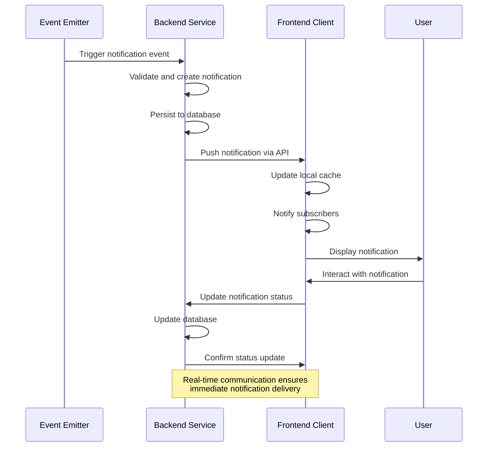
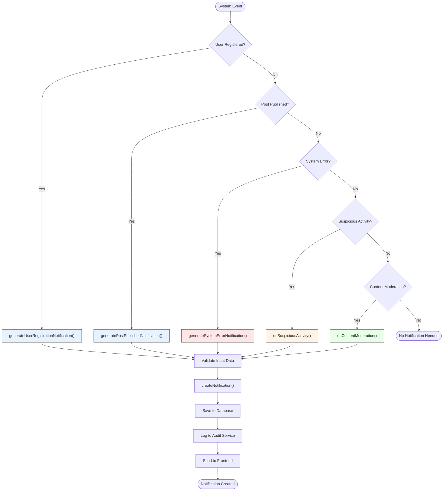
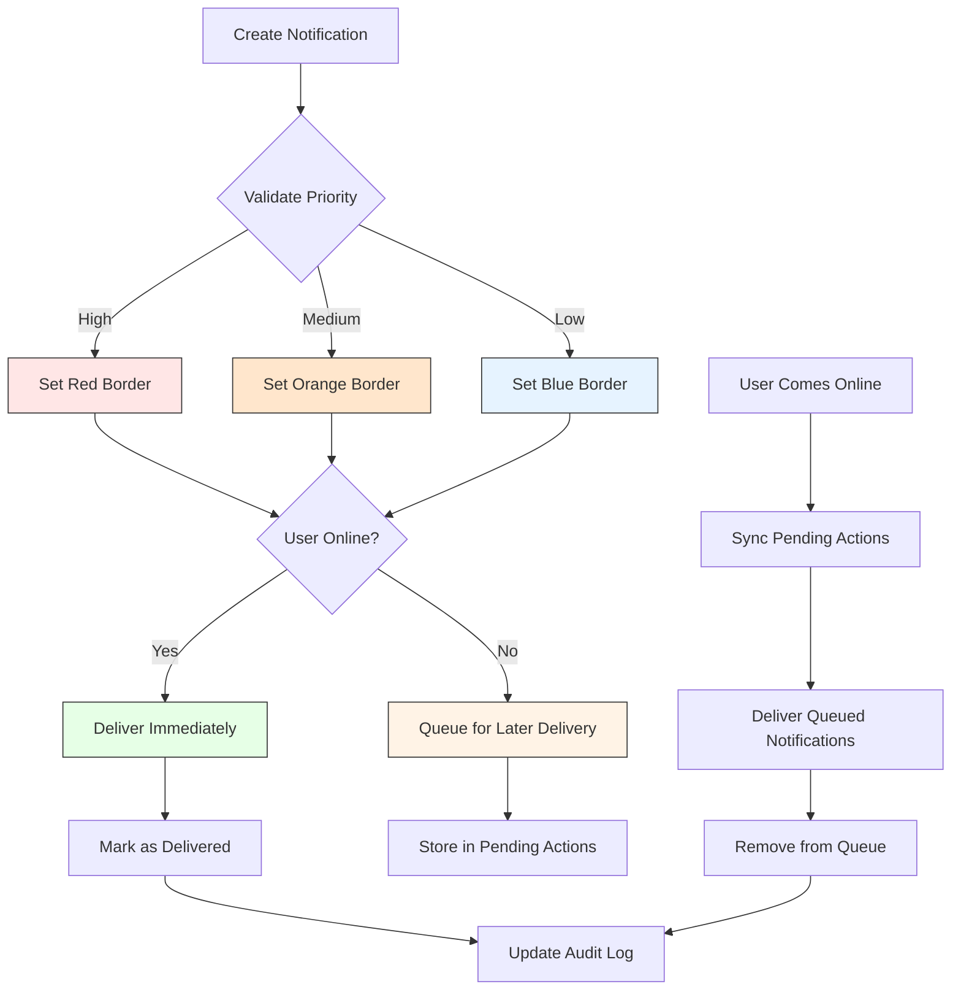
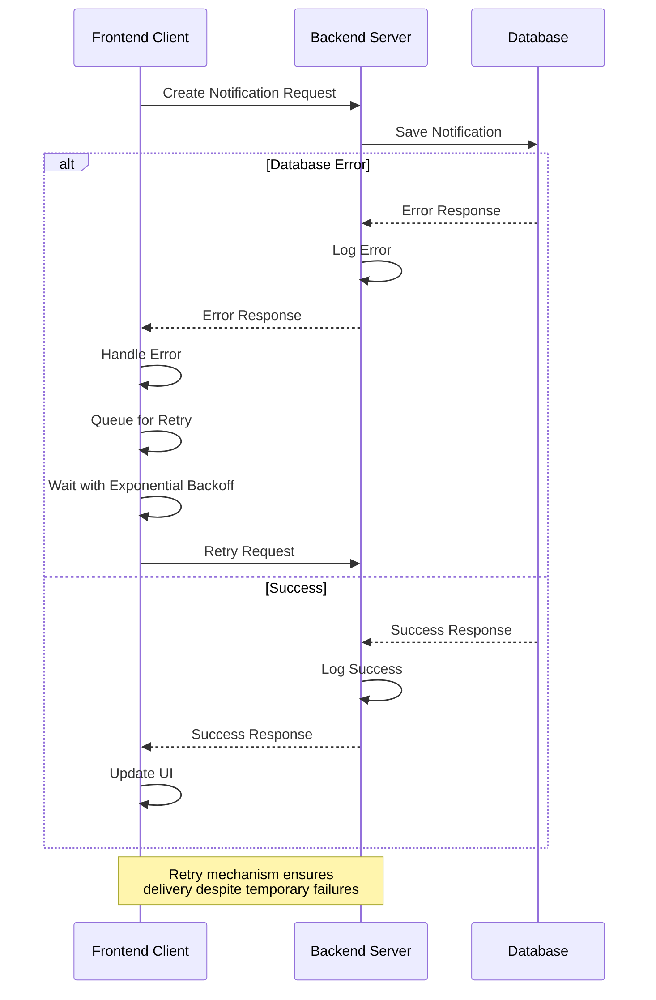
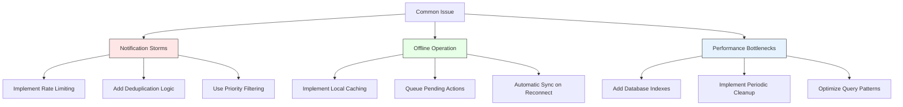

# Notification Service

<cite>
**Referenced Files in This Document**   
- [notification.service.ts](file://api-fastify/src/services/notification.service.ts)
- [notification.model.ts](file://api-fastify/src/models/notification.model.ts)
- [notification.controller.ts](file://api-fastify/src/controllers/notification.controller.ts)
- [notification-hooks.service.ts](file://api-fastify/src/services/notification-hooks.service.ts)
- [notification-audit.service.ts](file://api-fastify/src/services/notification-audit.service.ts)
- [notification-cleanup.service.ts](file://api-fastify/src/services/notification-cleanup.service.ts)
- [NotificationService.ts](file://src/services/NotificationService.ts)
- [EnhancedNotificationService.ts](file://src/services/EnhancedNotificationService.ts)
- [NotificationApiClient.ts](file://src/services/NotificationApiClient.ts)
- [NotificationPanel.tsx](file://src/components/admin/NotificationPanel.tsx)
- [NotificationErrorHandler.ts](file://src/services/NotificationErrorHandler.ts)
- [ConnectionMonitor.ts](file://src/services/ConnectionMonitor.ts)
- [AdminNotification.ts](file://src/types/AdminNotification.ts)
- [notification.routes.ts](file://api-fastify/src/routes/notification.routes.ts)
</cite>

## Table of Contents
1. [Introduction](#introduction)
2. [Architecture Overview](#architecture-overview)
3. [Core Components](#core-components)
4. [Notification Orchestration](#notification-orchestration)
5. [Event-Driven Notification Generation](#event-driven-notification-generation)
6. [Real-Time Communication System](#real-time-communication-system)
7. [Business Rules and Processing Logic](#business-rules-and-processing-logic)
8. [Performance Considerations](#performance-considerations)
9. [Error Handling and Reliability](#error-handling-and-reliability)
10. [Common Issues and Solutions](#common-issues-and-solutions)
11. [Conclusion](#conclusion)

## Introduction
The Notification Service in MERN_chatai_blog is a comprehensive system designed to manage, deliver, and track notifications for administrative users. This service orchestrates the creation and delivery of various notification types including user registration alerts, post publication notifications, and system error warnings. The architecture combines backend services with frontend components to provide a reliable, real-time notification system with offline capabilities and robust error handling. The service is designed to be both accessible to beginners and technically detailed enough for experienced developers, offering a balance between ease of use and advanced functionality.

## Architecture Overview
The notification system follows a client-server architecture with a clear separation between frontend and backend components. The backend handles notification persistence, generation, and delivery through RESTful APIs, while the frontend manages user interface presentation, state management, and real-time updates.

```mermaid
graph TB
subgraph "Frontend"
A[NotificationPanel] --> B[NotificationService]
B --> C[EnhancedNotificationService]
C --> D[NotificationApiClient]
D --> E[ConnectionMonitor]
C --> F[NotificationCache]
C --> G[NotificationErrorHandler]
end
subgraph "Backend"
H[NotificationController] --> I[NotificationService]
I --> J[NotificationModel]
H --> K[NotificationAuditService]
H --> L[NotificationCleanupService]
M[NotificationHooksService] --> I
end
D < --> |HTTP API| H
M --> |Event Hooks| I
style A fill:#f9f,stroke:#333
style J fill:#bbf,stroke:#333
```

**Diagram sources**
- [NotificationPanel.tsx](file://src/components/admin/NotificationPanel.tsx)
- [NotificationService.ts](file://src/services/NotificationService.ts)
- [EnhancedNotificationService.ts](file://src/services/EnhancedNotificationService.ts)
- [NotificationApiClient.ts](file://src/services/NotificationApiClient.ts)
- [notification.controller.ts](file://api-fastify/src/controllers/notification.controller.ts)
- [notification.service.ts](file://api-fastify/src/services/notification.service.ts)
- [notification.model.ts](file://api-fastify/src/models/notification.model.ts)
- [notification-hooks.service.ts](file://api-fastify/src/services/notification-hooks.service.ts)
- [notification-audit.service.ts](file://api-fastify/src/services/notification-audit.service.ts)
- [notification-cleanup.service.ts](file://api-fastify/src/services/notification-cleanup.service.ts)

**Section sources**
- [NotificationPanel.tsx](file://src/components/admin/NotificationPanel.tsx)
- [notification.service.ts](file://api-fastify/src/services/notification.service.ts)
- [notification.model.ts](file://api-fastify/src/models/notification.model.ts)

## Core Components
The notification system comprises several core components that work together to provide a seamless user experience. The backend includes the Notification Model for data persistence, Notification Service for business logic, and Notification Controller for API endpoints. The frontend features the Notification Service for state management, Enhanced Notification Service for offline capabilities, and Notification Panel for user interface presentation. These components are interconnected through well-defined interfaces and APIs, ensuring loose coupling and high cohesion.

**Section sources**
- [notification.service.ts](file://api-fastify/src/services/notification.service.ts)
- [notification.model.ts](file://api-fastify/src/models/notification.model.ts)
- [NotificationService.ts](file://src/services/NotificationService.ts)
- [EnhancedNotificationService.ts](file://src/services/EnhancedNotificationService.ts)
- [NotificationPanel.tsx](file://src/components/admin/NotificationPanel.tsx)

## Notification Orchestration
The notification orchestration process encompasses creation, delivery, and tracking of notifications throughout their lifecycle. When a notification event occurs, the system follows a structured workflow to ensure reliable delivery and proper state management.



**Diagram sources**
- [notification-hooks.service.ts](file://api-fastify/src/services/notification-hooks.service.ts)
- [notification.service.ts](file://api-fastify/src/services/notification.service.ts)
- [NotificationService.ts](file://src/services/NotificationService.ts)
- [EnhancedNotificationService.ts](file://src/services/EnhancedNotificationService.ts)

**Section sources**
- [notification.service.ts](file://api-fastify/src/services/notification.service.ts)
- [notification-hooks.service.ts](file://api-fastify/src/services/notification-hooks.service.ts)
- [NotificationService.ts](file://src/services/NotificationService.ts)

## Event-Driven Notification Generation
The system employs an event-driven architecture to generate notifications based on real-world events within the application. Specific hooks are triggered for different types of events, ensuring that relevant notifications are created automatically without requiring manual intervention.



**Diagram sources**
- [notification-hooks.service.ts](file://api-fastify/src/services/notification-hooks.service.ts)
- [notification.service.ts](file://api-fastify/src/services/notification.service.ts)

**Section sources**
- [notification-hooks.service.ts](file://api-fastify/src/services/notification-hooks.service.ts)
- [notification.service.ts](file://api-fastify/src/services/notification.service.ts)

## Real-Time Communication System
The real-time communication system ensures that notifications are delivered promptly to users as they occur. The system combines HTTP polling with event-driven updates to provide a responsive user experience even under varying network conditions.

```mermaid
classDiagram
class NotificationApiClient {
+baseUrl : string
+timeout : number
+retryAttempts : number
+getNotifications(request) : Promise~GetNotificationsResponse~
+getNotification(id) : Promise~GetNotificationResponse~
+createNotification(request) : Promise~CreateNotificationResponse~
+markAsRead(request) : Promise~UpdateNotificationResponse~
+markAllAsRead(request) : Promise~{success, updatedCount}~
}
class NotificationService {
+apiClient : NotificationApiClient
+listeners : NotificationListener[]
+fetchNotifications(filters) : Promise~AdminNotification[]~
+getNotificationById(id) : Promise~AdminNotification | null~
+markAsRead(notificationId) : Promise~void~
+subscribe(listener) : () => void
+unsubscribe(listener) : void
}
class EnhancedNotificationService {
+connectionStatus : ConnectionStatus
+syncInProgress : boolean
+markAsRead(notificationId) : Promise~void~
+syncPendingActions() : Promise~void~
+getConnectionStatus() : ConnectionStatus
+forcSync() : Promise~void~
}
class ConnectionMonitor {
+status : ConnectionStatus
+checkInterval : NodeJS.Timeout
+subscribe(listener) : () => void
+getStatus() : ConnectionStatus
+forceCheck() : Promise~ConnectionStatus~
}
class NotificationCache {
+cache : Map~string, CacheEntry~
+pendingActions : PendingAction[]
+updateNotification(key, id, updates) : void
+addPendingAction(action) : void
+getPendingActions() : PendingAction[]
+removePendingAction(actionId) : void
+clear() : void
}
NotificationService --> NotificationApiClient : "uses"
EnhancedNotificationService --> NotificationService : "extends"
EnhancedNotificationService --> NotificationCache : "uses"
EnhancedNotificationService --> ConnectionMonitor : "uses"
EnhancedNotificationService --> NotificationErrorHandler : "uses"
```

**Diagram sources**
- [NotificationApiClient.ts](file://src/services/NotificationApiClient.ts)
- [NotificationService.ts](file://src/services/NotificationService.ts)
- [EnhancedNotificationService.ts](file://src/services/EnhancedNotificationService.ts)
- [ConnectionMonitor.ts](file://src/services/ConnectionMonitor.ts)
- [NotificationCache.ts](file://src/services/NotificationCache.ts)

**Section sources**
- [NotificationApiClient.ts](file://src/services/NotificationApiClient.ts)
- [NotificationService.ts](file://src/services/NotificationService.ts)
- [EnhancedNotificationService.ts](file://src/services/EnhancedNotificationService.ts)
- [ConnectionMonitor.ts](file://src/services/ConnectionMonitor.ts)

## Business Rules and Processing Logic
The notification system implements several business rules to ensure efficient and effective notification management. These rules govern notification deduplication, priority handling, and delivery guarantees, ensuring that users receive relevant information without being overwhelmed.

### Notification Deduplication
The system prevents duplicate notifications by implementing a combination of server-side validation and client-side caching. When a notification event occurs, the system checks whether a similar notification has already been created within a specified time window.

### Priority Handling
Notifications are assigned priorities (low, medium, high) that determine their visual presentation and processing order. High-priority notifications are displayed prominently and may trigger additional alert mechanisms.

### Delivery Guarantees
The system ensures delivery guarantees through a combination of retry mechanisms, offline support, and audit logging. When a user is offline, notifications are queued and delivered when connectivity is restored.



**Diagram sources**
- [notification.service.ts](file://api-fastify/src/services/notification.service.ts)
- [EnhancedNotificationService.ts](file://src/services/EnhancedNotificationService.ts)
- [NotificationCache.ts](file://src/services/NotificationCache.ts)
- [notification-audit.service.ts](file://api-fastify/src/services/notification-audit.service.ts)

**Section sources**
- [notification.service.ts](file://api-fastify/src/services/notification.service.ts)
- [EnhancedNotificationService.ts](file://src/services/EnhancedNotificationService.ts)
- [NotificationCache.ts](file://src/services/NotificationCache.ts)
- [notification-audit.service.ts](file://api-fastify/src/services/notification-audit.service.ts)

## Performance Considerations
The notification system incorporates several performance optimizations to handle high-volume notification processing efficiently. These include batching strategies, rate limiting, and database optimization techniques.

### Batching Strategies
The system implements batching for notification retrieval and status updates to minimize database queries and network requests. When multiple notifications need to be marked as read, they are processed in a single database operation.

### Rate Limiting
Rate limiting is applied at both the API and service levels to prevent abuse and ensure system stability. Different rate limits are applied for read and write operations, with more restrictive limits for modification operations.

### Database Optimization
The notification model includes strategic indexes to optimize query performance for common operations such as retrieving unread notifications and sorting by timestamp.

```mermaid
erDiagram
NOTIFICATION {
string id PK
string type
string title
string message
datetime timestamp
boolean read
string priority
string actionUrl
object metadata
datetime createdAt
datetime updatedAt
}
index timestamp_idx on NOTIFICATION(timestamp)
index read_idx on NOTIFICATION(read)
index type_idx on NOTIFICATION(type)
index priority_idx on NOTIFICATION(priority)
```

**Diagram sources**
- [notification.model.ts](file://api-fastify/src/models/notification.model.ts)
- [notification.service.ts](file://api-fastify/src/services/notification.service.ts)
- [notification.routes.ts](file://api-fastify/src/routes/notification.routes.ts)

**Section sources**
- [notification.model.ts](file://api-fastify/src/models/notification.model.ts)
- [notification.service.ts](file://api-fastify/src/services/notification.service.ts)
- [notification.routes.ts](file://api-fastify/src/routes/notification.routes.ts)

## Error Handling and Reliability
The notification system implements comprehensive error handling and reliability features to ensure robust operation under various conditions. This includes client-side error handling, server-side error logging, and automatic retry mechanisms.

### Client-Side Error Handling
The frontend includes a dedicated NotificationErrorHandler class that normalizes different types of errors (network, timeout, HTTP status codes) into a consistent format for user presentation.

### Server-Side Error Logging
The backend uses structured logging with the logger service to record all notification-related operations and errors, including audit trails for security and debugging purposes.

### Automatic Retry Mechanisms
Both client and server implement retry mechanisms with exponential backoff to handle transient failures, ensuring that notifications are delivered even under temporary network disruptions.



**Diagram sources**
- [NotificationErrorHandler.ts](file://src/services/NotificationErrorHandler.ts)
- [notification.service.ts](file://api-fastify/src/services/notification.service.ts)
- [logger.service.ts](file://api-fastify/src/services/logger.service.ts)

**Section sources**
- [NotificationErrorHandler.ts](file://src/services/NotificationErrorHandler.ts)
- [notification.service.ts](file://api-fastify/src/services/notification.service.ts)
- [notification-audit.service.ts](file://api-fastify/src/services/notification-audit.service.ts)

## Common Issues and Solutions
The notification system addresses several common issues that can arise in real-time notification systems, including notification storms, offline operation, and performance bottlenecks.

### Notification Storms
To prevent notification storms, the system implements rate limiting at multiple levels and includes deduplication logic to avoid sending redundant notifications for the same event.

### Offline Operation
The EnhancedNotificationService provides offline capabilities by caching notifications and pending actions locally. When the user regains connectivity, the system automatically synchronizes pending actions with the server.

### Performance Bottlenecks
The system addresses performance bottlenecks through database indexing, query optimization, and periodic cleanup of old notifications to maintain optimal performance.



**Diagram sources**
- [rate-limit.middleware.ts](file://api-fastify/src/middlewares/rate-limit.middleware.ts)
- [EnhancedNotificationService.ts](file://src/services/EnhancedNotificationService.ts)
- [notification-cleanup.service.ts](file://api-fastify/src/services/notification-cleanup.service.ts)
- [notification.model.ts](file://api-fastify/src/models/notification.model.ts)

**Section sources**
- [rate-limit.middleware.ts](file://api-fastify/src/middlewares/rate-limit.middleware.ts)
- [EnhancedNotificationService.ts](file://src/services/EnhancedNotificationService.ts)
- [notification-cleanup.service.ts](file://api-fastify/src/services/notification-cleanup.service.ts)

## Conclusion
The Notification Service in MERN_chatai_blog provides a robust, scalable solution for managing administrative notifications. By combining a well-structured backend with a feature-rich frontend, the system delivers reliable notification orchestration with support for real-time updates, offline operation, and comprehensive error handling. The event-driven architecture ensures that notifications are generated automatically in response to system events, while business rules and performance optimizations maintain system efficiency and user experience. This documentation provides both beginners and experienced developers with the necessary information to understand, use, and extend the notification system effectively.