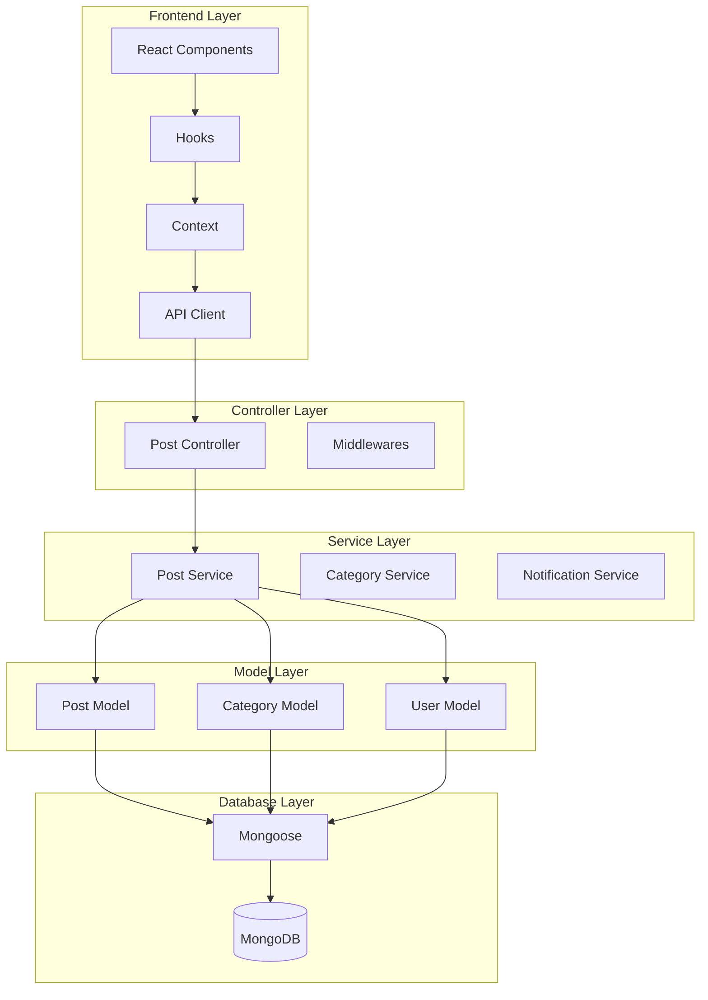
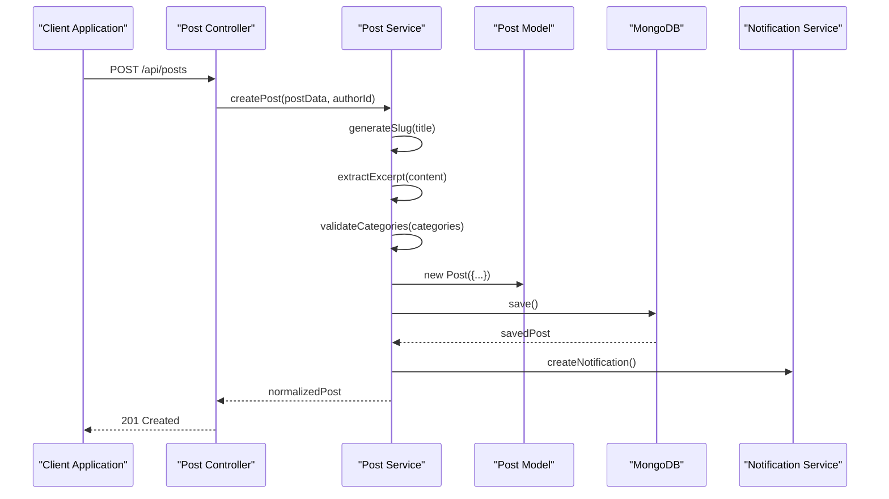
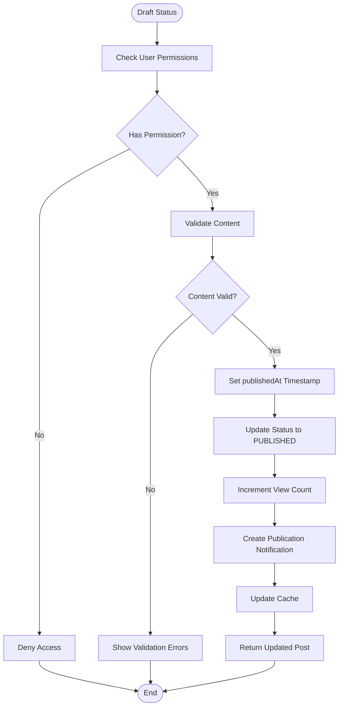
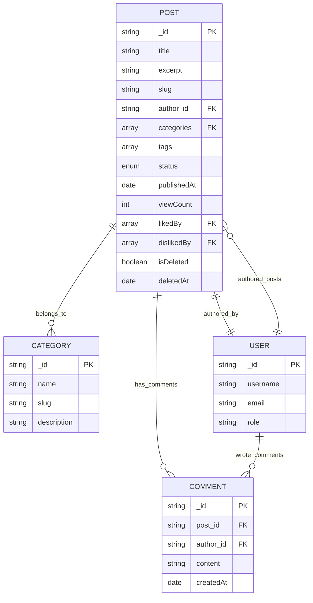
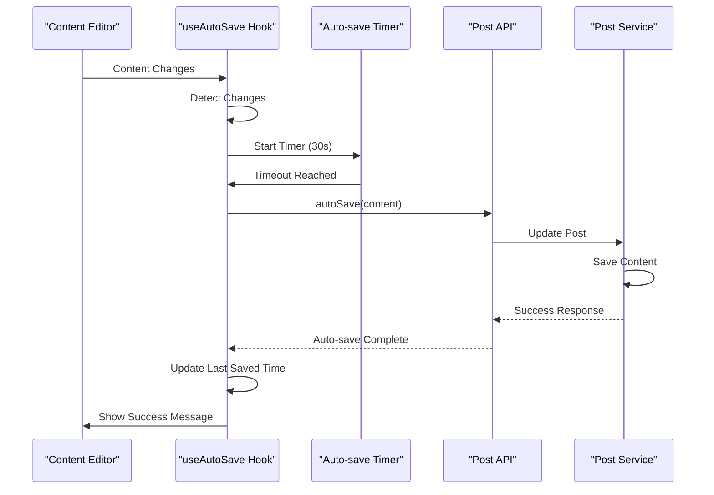
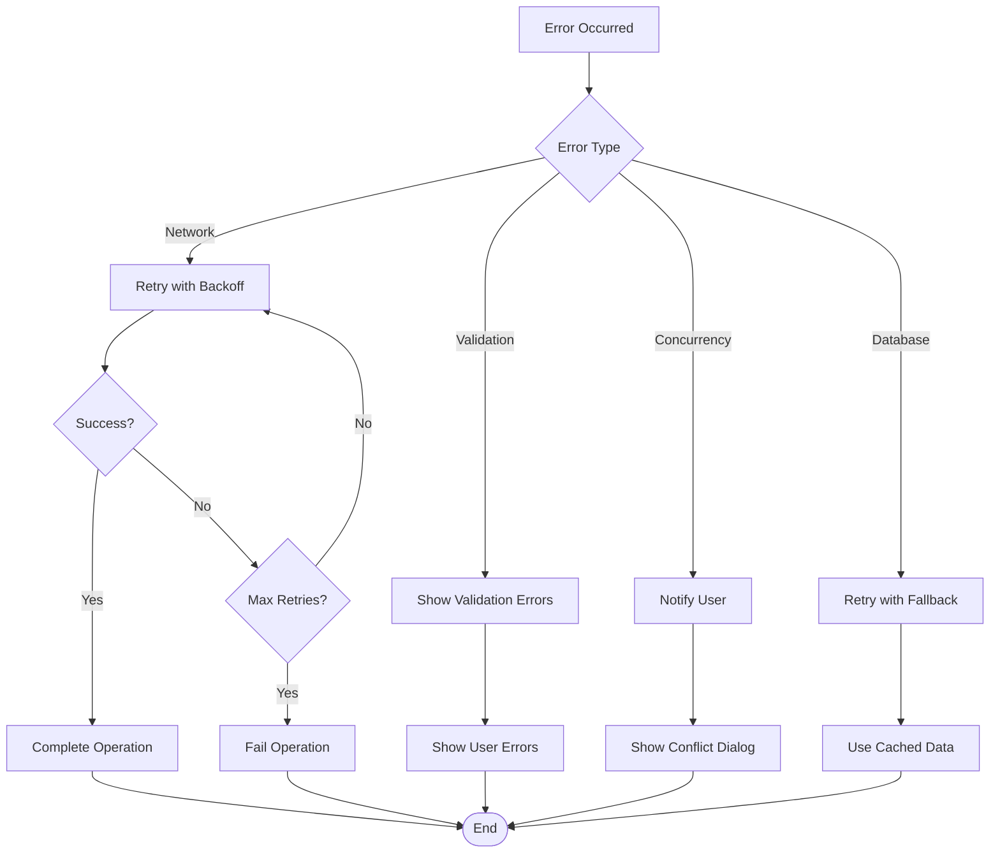
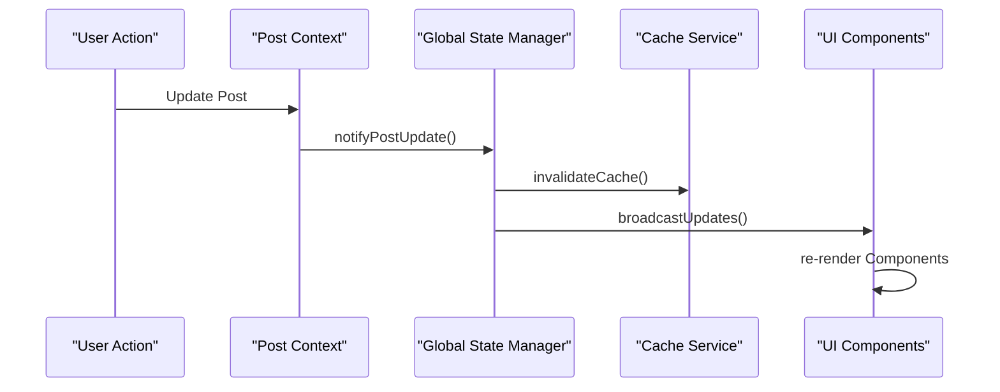

# Post Service Documentation

<cite>
**Referenced Files in This Document**
- [post.service.ts](file://api-fastify/src/services/post.service.ts)
- [post.model.ts](file://api-fastify/src/models/post.model.ts)
- [post.types.ts](file://api-fastify/src/types/post.types.ts)
- [post.controller.ts](file://api-fastify/src/controllers/post.controller.ts)
- [index.ts](file://api-fastify/src/utils/index.ts)
- [useAutoSave.ts](file://src/features/posts/hooks/useAutoSave.ts)
- [postApi.ts](file://src/features/posts/services/postApi.ts)
- [PostContext.tsx](file://src/features/posts/context/PostContext.tsx)
- [post.types.ts](file://src/features/posts/types/post.types.ts)
- [api.types.ts](file://src/features/posts/types/api.types.ts)
- [Drafts.tsx](file://src/features/posts/pages/Drafts.tsx)
</cite>

## Table of Contents
1. [Introduction](#introduction)
2. [Architecture Overview](#architecture-overview)
3. [Core Components](#core-components)
4. [Post Lifecycle Management](#post-lifecycle-management)
5. [Data Models and Relationships](#data-models-and-relationships)
6. [Auto-Save and Draft Management](#auto-save-and-draft-management)
7. [Business Rules and Validation](#business-rules-and-validation)
8. [Performance Considerations](#performance-considerations)
9. [Error Handling and Race Conditions](#error-handling-and-race-conditions)
10. [Integration Patterns](#integration-patterns)
11. [Troubleshooting Guide](#troubleshooting-guide)
12. [Best Practices](#best-practices)

## Introduction

The Post Service is the central component responsible for managing the complete lifecycle of blog posts in the MERN_chatai_blog application. It handles everything from post creation and editing to publishing, archiving, and deletion, with sophisticated support for draft management, auto-save functionality, and real-time collaboration features.

The service operates as part of a modern MERN stack architecture, utilizing Fastify for the backend API, MongoDB with Mongoose for data persistence, and React with TypeScript for the frontend. It implements advanced features like block-based content editing, version control, SEO optimization, and real-time state synchronization across multiple client instances.

## Architecture Overview

The Post Service follows a layered architecture pattern with clear separation of concerns:



**Diagram sources**
- [post.controller.ts](file://api-fastify/src/controllers/post.controller.ts#L1-L50)
- [post.service.ts](file://api-fastify/src/services/post.service.ts#L1-L30)
- [PostContext.tsx](file://src/features/posts/context/PostContext.tsx#L1-L50)

**Section sources**
- [post.controller.ts](file://api-fastify/src/controllers/post.controller.ts#L1-L483)
- [post.service.ts](file://api-fastify/src/services/post.service.ts#L1-L731)

## Core Components

### Post Service Implementation

The Post Service is the heart of the post management system, providing comprehensive CRUD operations with advanced features:

```typescript
// Core service functions
export const getAllPosts = async (options: GetPostsOptions = {});
export const getPostByIdOrSlug = async (idOrSlug: string, currentUserId?: string);
export const createPost = async (postData: CreatePostInput, authorId: string);
export const updatePost = async (id: string, updateData: UpdatePostInput);
export const deletePost = async (id: string, currentUserId: string);
```

Key features include:
- **Status-based Access Control**: Different permissions for draft vs published posts
- **Soft Deletion**: Posts marked as deleted but not permanently removed
- **Content Validation**: Automatic excerpt generation and slug creation
- **Real-time Notifications**: Immediate feedback on post operations

### Post Model Structure

The MongoDB model defines a comprehensive schema supporting modern blogging needs:

```typescript
interface IPost extends Document {
  title: string;
  content?: string;
  contentBlocks?: Block[];
  excerpt?: string;
  slug: string;
  author: IUser['_id'];
  categories?: string[];
  tags?: string[];
  status: PostStatus;
  viewCount: number;
  likedBy: IUser['_id'][];
  dislikedBy: IUser['_id'][];
  publishedAt?: Date;
  isDeleted: boolean;
  deletedAt?: Date;
}
```

**Section sources**
- [post.model.ts](file://api-fastify/src/models/post.model.ts#L1-L136)
- [post.types.ts](file://api-fastify/src/types/post.types.ts#L1-L109)

## Post Lifecycle Management

### Creation Workflow

The post creation process involves multiple stages with automatic validation and optimization:



**Diagram sources**
- [post.service.ts](file://api-fastify/src/services/post.service.ts#L130-L220)
- [post.controller.ts](file://api-fastify/src/controllers/post.controller.ts#L80-L120)

### Publishing Process

The publishing workflow ensures posts are properly prepared for public consumption:



**Diagram sources**
- [post.service.ts](file://api-fastify/src/services/post.service.ts#L220-L350)

### Status Management

The system supports multiple post statuses with appropriate transitions:

```typescript
enum PostStatus {
  DRAFT = 'draft',
  PUBLISHED = 'published',
  ARCHIVED = 'archived',
  SCHEDULED = 'scheduled'
}
```

Each status has specific business rules:
- **Draft**: Only visible to authors and editors
- **Published**: Publicly accessible with view counting
- **Archived**: Hidden from public view but accessible to admins
- **Scheduled**: Will become public at specified time

**Section sources**
- [post.service.ts](file://api-fastify/src/services/post.service.ts#L130-L350)
- [post.types.ts](file://api-fastify/src/types/post.types.ts#L8-L15)

## Data Models and Relationships

### Post Model Schema

The Post Model defines the complete data structure with comprehensive indexing:

```typescript
const postSchema = new Schema<IPost>({
  title: { type: String, required: true, trim: true, minlength: 3, maxlength: 200 },
  content: { type: String, required: false },
  contentBlocks: [{ type: Schema.Types.Mixed }],
  excerpt: { type: String, trim: true, maxlength: 500 },
  slug: { type: String, required: true, unique: true, trim: true, lowercase: true },
  author: { type: Schema.Types.ObjectId, ref: 'User', required: true },
  categories: [{ type: Schema.Types.ObjectId, ref: 'Category' }],
  tags: [{ type: String, trim: true }],
  status: { type: String, enum: Object.values(PostStatus), default: PostStatus.DRAFT },
  viewCount: { type: Number, default: 0 },
  likedBy: [{ type: Schema.Types.ObjectId, ref: 'User' }],
  dislikedBy: [{ type: Schema.Types.ObjectId, ref: 'User' }],
  publishedAt: { type: Date },
  isDeleted: { type: Boolean, default: false },
  deletedAt: { type: Date },
  deletedBy: { type: Schema.Types.ObjectId, ref: 'User' }
});
```

### Indexing Strategy

The model includes strategic indexes for optimal performance:

```typescript
// Full-text search index
postSchema.index({ title: 'text', content: 'text' });

// Performance indexes
postSchema.index({ author: 1 });
postSchema.index({ categories: 1 });
postSchema.index({ status: 1, createdAt: -1 });
postSchema.index({ status: 1, publishedAt: -1 });
postSchema.index({ publishedAt: -1, createdAt: -1 });
```

### Relationship Management

The service handles complex relationships between posts, categories, and users:



**Diagram sources**
- [post.model.ts](file://api-fastify/src/models/post.model.ts#L5-L80)
- [post.types.ts](file://api-fastify/src/types/post.types.ts#L16-L50)

**Section sources**
- [post.model.ts](file://api-fastify/src/models/post.model.ts#L1-L136)
- [post.types.ts](file://api-fastify/src/types/post.types.ts#L16-L50)

## Auto-Save and Draft Management

### Frontend Auto-Save Implementation

The frontend implements sophisticated auto-save functionality with intelligent change detection:

```typescript
interface UseAutoSaveOptions {
  enabled: boolean;
  interval: number; // milliseconds
  maxRetries: number;
  onSave?: (success: boolean, error?: string) => void;
}

interface UseAutoSaveReturn {
  isAutoSaving: boolean;
  lastSaved: Date | null;
  hasUnsavedChanges: boolean;
  saveNow: () => Promise<void>;
  resetAutoSave: () => void;
}
```

### Auto-Save Workflow



**Diagram sources**
- [useAutoSave.ts](file://src/features/posts/hooks/useAutoSave.ts#L1-L168)
- [postApi.ts](file://src/features/posts/services/postApi.ts#L500-L550)

### Draft Management Features

The system provides comprehensive draft management capabilities:

1. **Automatic Saving**: Content changes trigger auto-save every 30 seconds
2. **Change Detection**: Only saves when content actually changes
3. **Retry Logic**: Handles network failures with exponential backoff
4. **Conflict Resolution**: Manages concurrent edits gracefully
5. **Version Control**: Tracks changes and allows reverting to previous versions

### Drafts Page Integration

The Drafts page demonstrates real-time state synchronization:

```typescript
// Real-time draft updates
useGlobalStateEvents([
  {
    type: 'POST_UPDATED',
    handler: ({ postId, postData, source }) => {
      if (source === 'publish' && postData.status !== PostStatus.DRAFT) {
        loadDrafts(); // Remove published posts from drafts list
      }
    }
  },
  {
    type: 'DRAFT_UPDATED',
    handler: ({ postId, postData }) => {
      loadDrafts(); // Refresh drafts to show updates
    }
  }
]);
```

**Section sources**
- [useAutoSave.ts](file://src/features/posts/hooks/useAutoSave.ts#L1-L168)
- [postApi.ts](file://src/features/posts/services/postApi.ts#L500-L605)
- [Drafts.tsx](file://src/features/posts/pages/Drafts.tsx#L45-L91)

## Business Rules and Validation

### Slug Generation

The system automatically generates unique slugs to ensure SEO-friendly URLs:

```typescript
export const generateSlug = (title: string): string => {
  const baseSlug = title
    .toLowerCase()
    .trim()
    .replace(/[^\w\s-]/g, '')
    .replace(/[\s_-]+/g, '-')
    .replace(/^-+|-+$/g, '');
  
  return `${baseSlug}-${nanoid(6)}`;
};
```

### Content Validation Rules

Multiple validation layers ensure content quality:

1. **Title Validation**: Min 3 chars, Max 200 chars
2. **Content Validation**: Automatic excerpt generation
3. **Category Validation**: Verify category existence before saving
4. **Status Validation**: Enforce business rules for status transitions

### Timestamp Management

The service handles various timestamp scenarios:

```typescript
// Middleware for automatic timestamp setting
postSchema.pre('save', function (next) {
  const doc = this as unknown as IPost;
  if (this.isModified('status') && doc.status === PostStatus.PUBLISHED && !doc.publishedAt) {
    doc.publishedAt = new Date();
  }
  next();
});
```

### Access Control Logic

The service implements sophisticated permission checking:

```typescript
const buildStatusQuery = (status?: PostStatus, currentUserId?: string, currentUserRole?: string) => {
  if (!currentUserId) return { status: PostStatus.PUBLISHED };
  
  const isAdminOrEditor = currentUserRole === 'admin' || currentUserRole === 'editor';
  
  if (status) {
    if (isAdminOrEditor) return { status };
    return status === PostStatus.DRAFT 
      ? { status: PostStatus.DRAFT, author: currentUserId }
      : { status: PostStatus.PUBLISHED };
  }
  
  return isAdminOrEditor ? {} : {
    $or: [
      { status: PostStatus.PUBLISHED },
      { status: PostStatus.DRAFT, author: currentUserId },
    ]
  };
};
```

**Section sources**
- [index.ts](file://api-fastify/src/utils/index.ts#L8-L25)
- [post.model.ts](file://api-fastify/src/models/post.model.ts#L80-L90)
- [post.service.ts](file://api-fastify/src/services/post.service.ts#L50-L80)

## Performance Considerations

### Database Indexing Strategy

The Post Model includes strategic indexes for optimal query performance:

```typescript
// Composite indexes for common queries
postSchema.index({ status: 1, createdAt: -1 });
postSchema.index({ status: 1, publishedAt: -1 });
postSchema.index({ publishedAt: -1, createdAt: -1 });

// Full-text search for content queries
postSchema.index({ title: 'text', content: 'text' });
```

### Caching Strategies

The system implements multiple caching layers:

1. **Redis Cache**: Frequently accessed posts cached for quick retrieval
2. **Browser Cache**: Client-side caching of post data
3. **CDN Integration**: Static assets served from CDN
4. **Edge Caching**: Regional caching for global distribution

### Query Optimization

The service uses optimized queries with population:

```typescript
const posts = await Post.find(query)
  .populate('author', '_id username profilePicture')
  .populate('categories', '_id name slug')
  .sort({ publishedAt: -1, createdAt: -1 })
  .skip(skip)
  .limit(limit);
```

### Memory Management

Efficient memory usage through:

- **Streaming Responses**: Large datasets streamed to clients
- **Connection Pooling**: Optimized database connections
- **Garbage Collection**: Proper cleanup of temporary objects
- **Lazy Loading**: Resources loaded on demand

**Section sources**
- [post.model.ts](file://api-fastify/src/models/post.model.ts#L40-L60)
- [post.service.ts](file://api-fastify/src/services/post.service.ts#L100-L130)

## Error Handling and Race Conditions

### Concurrent Editing Protection

The system prevents race conditions during concurrent editing:

```typescript
// Optimistic locking mechanism
const updatePost = async (id: string, updateData: UpdatePostInput) => {
  const post = await Post.findById(id);
  
  // Check for concurrent modifications
  if (post.updatedAt > lastKnownUpdate) {
    throw new Error('Post has been modified by another user');
  }
  
  // Apply updates safely
  post.set(updateData);
  await post.save();
};
```

### Transaction Management

Critical operations use MongoDB transactions:

```typescript
// Atomic operations for complex updates
const session = await mongoose.startSession();
session.startTransaction();

try {
  // Multiple related updates
  await Post.findByIdAndUpdate(id, updateData, { session });
  await Notification.create(notificationData, { session });
  
  await session.commitTransaction();
} catch (error) {
  await session.abortTransaction();
  throw error;
} finally {
  session.endSession();
}
```

### Error Recovery Mechanisms

The system implements robust error recovery:

1. **Retry Logic**: Failed operations automatically retried
2. **Fallback Mechanisms**: Graceful degradation when services unavailable
3. **Rollback Procedures**: Clean rollback on transaction failure
4. **Health Checks**: Continuous monitoring of service health

### Common Error Scenarios



**Section sources**
- [post.service.ts](file://api-fastify/src/services/post.service.ts#L220-L400)
- [useAutoSave.ts](file://src/features/posts/hooks/useAutoSave.ts#L50-L100)

## Integration Patterns

### Frontend-Backend Communication

The system uses a sophisticated API communication pattern:

```typescript
class PostApiService {
  async updatePost(id: string, data: UpdatePostInput): Promise<PostOperationResult> {
    const response = await this.fetchWithAuth(API_ENDPOINTS.posts.update(id), {
      method: 'PUT',
      headers: { 'Content-Type': 'application/json' },
      body: JSON.stringify(this.normalizeData(data))
    });
    
    return this.handleResponse(response);
  }
}
```

### Real-time State Synchronization

The frontend maintains synchronized state across multiple components:

```typescript
// Global state manager integration
globalStateManager.notifyPostUpdate(id, result.data, 'edit');
globalStateManager.notifyCacheInvalidation('all', 'post-updated');
```

### Event-driven Architecture

The system uses event-driven patterns for loose coupling:



**Diagram sources**
- [PostContext.tsx](file://src/features/posts/context/PostContext.tsx#L200-L250)

### Microservice Integration

The Post Service integrates with other microservices:

1. **Notification Service**: Automated notifications for post events
2. **Image Service**: Automatic image optimization and resizing
3. **Search Service**: Real-time content indexing
4. **Analytics Service**: Usage statistics and insights

**Section sources**
- [postApi.ts](file://src/features/posts/services/postApi.ts#L100-L200)
- [PostContext.tsx](file://src/features/posts/context/PostContext.tsx#L150-L250)

## Troubleshooting Guide

### Common Issues and Solutions

#### Auto-save Not Working

**Symptoms**: Content changes not being saved automatically
**Causes**: 
- Network connectivity issues
- Browser storage limitations
- JavaScript errors in auto-save logic

**Solutions**:
1. Check browser console for JavaScript errors
2. Verify network connectivity
3. Clear browser cache and localStorage
4. Test with incognito mode

#### Drafts Not Syncing

**Symptoms**: Drafts not appearing in drafts list
**Causes**:
- Global state manager not receiving updates
- Cache invalidation issues
- Authentication problems

**Solutions**:
1. Check authentication tokens
2. Clear application cache
3. Restart global state manager
4. Verify WebSocket connections

#### Publishing Failures

**Symptoms**: Posts failing to publish
**Causes**:
- Content validation errors
- Category validation failures
- Database connection issues

**Solutions**:
1. Review content for validation errors
2. Verify category existence
3. Check database connectivity
4. Review server logs for detailed errors

### Debugging Tools

The system provides comprehensive debugging capabilities:

```typescript
// Debug logging in production
console.log('[updatePost] Service called', {
  id,
  currentUserId,
  currentUserRole,
  updateDataKeys: Object.keys(updateData),
  status: updateData.status
});

// Error boundary implementation
<ErrorBoundary fallback={<ErrorNotification />}>
  <PostEditor />
</ErrorBoundary>
```

### Performance Monitoring

Key performance indicators to monitor:

1. **Auto-save Latency**: Time taken for auto-save operations
2. **Post Load Times**: Time to load individual posts
3. **Cache Hit Rates**: Effectiveness of caching strategies
4. **Error Rates**: Frequency of service errors

**Section sources**
- [post.service.ts](file://api-fastify/src/services/post.service.ts#L220-L280)
- [useAutoSave.ts](file://src/features/posts/hooks/useAutoSave.ts#L80-L120)

## Best Practices

### Development Guidelines

1. **Code Organization**: Follow the established module structure
2. **Error Handling**: Implement comprehensive error boundaries
3. **Testing**: Write unit tests for all service functions
4. **Documentation**: Maintain up-to-date API documentation

### Security Considerations

1. **Input Validation**: Always validate user inputs
2. **Access Control**: Implement role-based permissions
3. **SQL Injection Prevention**: Use parameterized queries
4. **XSS Prevention**: Sanitize user-generated content

### Performance Optimization

1. **Indexing Strategy**: Add indexes for frequently queried fields
2. **Query Optimization**: Use projection to limit returned fields
3. **Caching**: Implement multi-level caching strategies
4. **Database Tuning**: Optimize database configuration

### Maintenance Procedures

1. **Regular Backups**: Automated backup of MongoDB collections
2. **Log Rotation**: Manage log file sizes and retention
3. **Performance Monitoring**: Continuous monitoring of key metrics
4. **Security Updates**: Regular updates of dependencies and frameworks

The Post Service represents a sophisticated, production-ready solution for modern blog post management. Its comprehensive feature set, robust error handling, and scalable architecture make it suitable for applications requiring advanced content management capabilities.