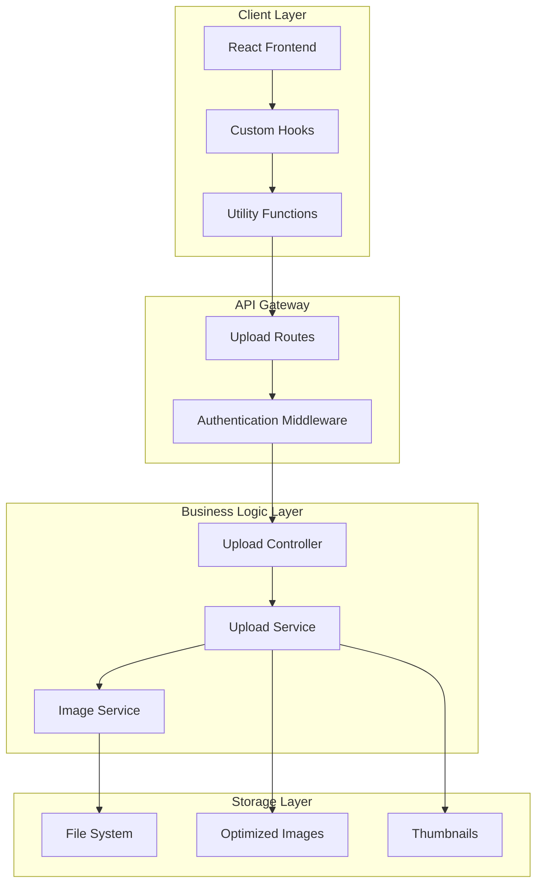
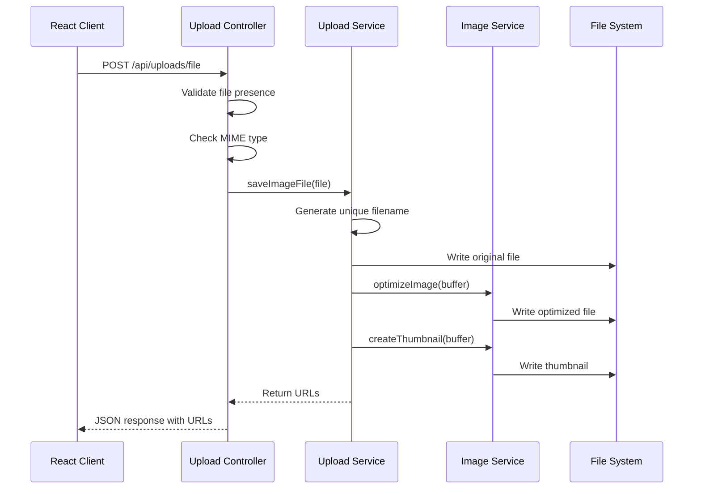
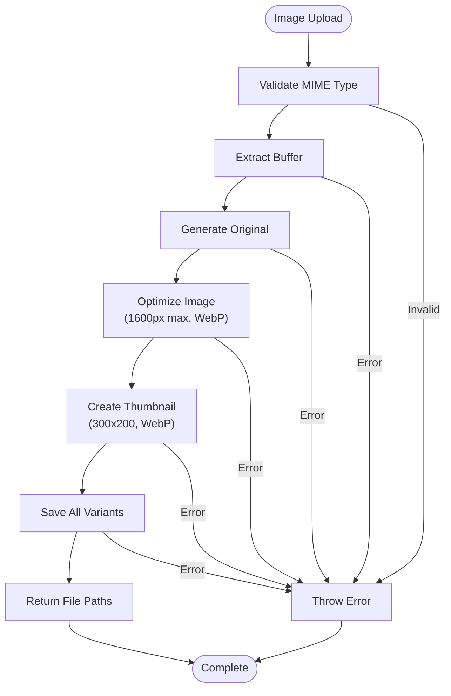

# Upload Service

<cite>
**Referenced Files in This Document**
- [upload.service.ts](file://api-fastify/src/services/upload.service.ts)
- [upload.controller.ts](file://api-fastify/src/controllers/upload.controller.ts)
- [image.service.ts](file://api-fastify/src/services/image.service.ts)
- [upload.routes.ts](file://api-fastify/src/routes/upload.routes.ts)
- [auth.middleware.ts](file://api-fastify/src/middlewares/auth.middleware.ts)
- [useImageHandler.ts](file://src/hooks/useImageHandler.ts)
- [api.config.ts](file://src/config/api.config.ts)
- [imageCompression.ts](file://src/utils/imageCompression.ts)
- [database.ts](file://api-fastify/src/config/database.ts)
- [user.model.ts](file://api-fastify/src/models/user.model.ts)
- [user.types.ts](file://api-fastify/src/types/user.types.ts)
</cite>

## Table of Contents
1. [Introduction](#introduction)
2. [System Architecture](#system-architecture)
3. [Core Components](#core-components)
4. [File Upload Operations](#file-upload-operations)
5. [Image Processing Pipeline](#image-processing-pipeline)
6. [Security and Validation](#security-and-validation)
7. [Client-Side Integration](#client-side-integration)
8. [Performance Optimization](#performance-optimization)
9. [Error Handling](#error-handling)
10. [Troubleshooting Guide](#troubleshooting-guide)
11. [Best Practices](#best-practices)
12. [Conclusion](#conclusion)

## Introduction

The MERN_chatai_blog upload service is a comprehensive file management system built on the Fastify framework that handles file uploads, image processing, and storage management. This service provides robust functionality for uploading various file types, with specialized support for image optimization, thumbnail generation, and secure file handling.

The upload service is designed to handle both traditional file uploads and base64-encoded images, offering automatic optimization, security validation, and efficient storage management. It integrates seamlessly with the blog's content management system, providing essential features for media-heavy applications.

## System Architecture

The upload service follows a layered architecture pattern with clear separation of concerns:



**Diagram sources**
- [upload.routes.ts](file://api-fastify/src/routes/upload.routes.ts#L1-L89)
- [upload.controller.ts](file://api-fastify/src/controllers/upload.controller.ts#L1-L120)
- [upload.service.ts](file://api-fastify/src/services/upload.service.ts#L1-L165)

## Core Components

### Upload Service Module

The core upload service provides the fundamental file handling capabilities:

```typescript
// Core upload operations
export const saveFile = async (file: MultipartFile): Promise<string>
export const saveImageFile = async (file: MultipartFile): Promise<SavedImage>
export const saveBase64Image = async (base64Data: string, fileName: string): Promise<string>
export const saveBase64ImageDetailed = async (base64Data: string, fileName: string): Promise<SavedImage>
export const deleteFile = async (filePath: string): Promise<void>
```

### Image Service Module

The image service handles advanced image processing using Sharp library:

```typescript
class ImageService {
  async optimizeImage(inputBuffer: Buffer, filename: string, options: ImageOptions): Promise<string>
  async createThumbnail(inputBuffer: Buffer, filename: string): Promise<string>
}
```

### Authentication Integration

The service integrates with the authentication middleware to ensure secure access:

```typescript
// Authentication decorators
fastify.post('/file', { preHandler: [authenticate] }, controller)
fastify.post('/base64', { preHandler: [authenticate] }, controller)
```

**Section sources**
- [upload.service.ts](file://api-fastify/src/services/upload.service.ts#L1-L165)
- [image.service.ts](file://api-fastify/src/services/image.service.ts#L1-L62)
- [upload.routes.ts](file://api-fastify/src/routes/upload.routes.ts#L1-L89)

## File Upload Operations

### Traditional File Upload

The service supports standard multipart file uploads with comprehensive validation:



**Diagram sources**
- [upload.controller.ts](file://api-fastify/src/controllers/upload.controller.ts#L20-L60)
- [upload.service.ts](file://api-fastify/src/services/upload.service.ts#L50-L75)

### Base64 Image Upload

Support for base64-encoded images with automatic format detection:

```typescript
// Base64 upload validation
const matches = base64Data.match(/^data:([A-Za-z-+\/]+);base64,(.+)$/);
if (!matches || matches.length !== 3) {
  throw new Error('Invalid base64 image format');
}

// Automatic MIME type extraction
const mimeType = matches[1]; // e.g., 'image/jpeg'
const imageData = matches[2]; // Base64 encoded data
const buffer = Buffer.from(imageData, 'base64');
```

### File Storage Management

The service implements a robust file storage system:

```typescript
// Directory structure
const UPLOAD_DIR = path.join(process.cwd(), 'uploads');

// Filename generation with collision prevention
const fileName = `${nanoid(10)}${fileExtension}`;

// Path resolution
const filePath = path.join(UPLOAD_DIR, fileName);
```

**Section sources**
- [upload.controller.ts](file://api-fastify/src/controllers/upload.controller.ts#L20-L120)
- [upload.service.ts](file://api-fastify/src/services/upload.service.ts#L25-L165)

## Image Processing Pipeline

### Image Optimization Workflow

The image processing pipeline utilizes the Sharp library for high-performance image manipulation:



**Diagram sources**
- [image.service.ts](file://api-fastify/src/services/image.service.ts#L15-L62)
- [upload.service.ts](file://api-fastify/src/services/upload.service.ts#L50-L75)

### Image Processing Options

The service supports configurable image processing:

```typescript
interface ImageOptions {
  width?: number;     // Target width (default: 800)
  height?: number;    // Target height (optional)
  quality?: number;   // Quality factor (default: 80)
  format?: 'jpeg' | 'png' | 'webp'; // Output format (default: webp)
}

// Default optimization settings
const defaultOptions = {
  width: 1600,
  format: 'webp',
  quality: 82
};
```

### Thumbnail Generation

Automatic thumbnail creation for improved performance:

```typescript
async createThumbnail(inputBuffer: Buffer, filename: string): Promise<string> {
  return this.optimizeImage(inputBuffer, filename, {
    width: 300,
    height: 200,
    quality: 70,
    format: 'webp'
  });
}
```

**Section sources**
- [image.service.ts](file://api-fastify/src/services/image.service.ts#L1-L62)
- [upload.service.ts](file://api-fastify/src/services/upload.service.ts#L50-L75)

## Security and Validation

### Client-Side Validation

The frontend implements comprehensive image validation:

```typescript
// File type validation
const allowedTypes = ['image/jpeg', 'image/jpg', 'image/png', 'image/gif', 'image/webp'];

// Size limit enforcement (5MB max)
const maxSize = 5 * 1024 * 1024;

// Dimension validation
const maxWidth = 4000;
const maxHeight = 4000;
```

### Server-Side Validation

Backend validation ensures security and integrity:

```typescript
// MIME type checking
if (!mimeType.startsWith('image/')) {
  throw new Error('File must be an image');
}

// Base64 format validation
const matches = base64Data.match(/^data:([A-Za-z-+\/]+);base64,(.+)$/);
if (!matches || matches.length !== 3) {
  throw new Error('Invalid base64 image format');
}
```

### Authentication Requirements

All upload endpoints require authentication:

```typescript
// Authentication middleware integration
fastify.post('/file', { preHandler: [authenticate] }, controller)
fastify.post('/base64', { preHandler: [authenticate] }, controller)
```

### Role-Based Access Control

The service integrates with role-based permissions:

```typescript
// Available roles for upload access
enum UserRole {
  USER = 'user',
  ADMIN = 'admin',
  EDITOR = 'editor',
  AUTHOR = 'author'
}

// Middleware for different access levels
export const isAuthorEditorOrAdmin = async (request, reply) => {
  // Implementation checks user role
};
```

**Section sources**
- [useImageHandler.ts](file://src/hooks/useImageHandler.ts#L30-L60)
- [upload.controller.ts](file://api-fastify/src/controllers/upload.controller.ts#L30-L50)
- [auth.middleware.ts](file://api-fastify/src/middlewares/auth.middleware.ts#L70-L127)

## Client-Side Integration

### React Hook Integration

The `useImageHandler` hook provides seamless React integration:

```typescript
interface UseImageHandlerReturn {
  uploadImage: (file: File) => Promise<string | null>;
  validateImage: (file: File) => Promise<boolean>;
  uploadState: ImageUploadState;
  clearError: () => void;
}

interface ImageUploadState {
  isUploading: boolean;
  progress: number;
  error: string | null;
}
```

### Progress Tracking

Real-time upload progress monitoring:

```typescript
// Progress event listener
xhr.upload.addEventListener('progress', event => {
  if (event.lengthComputable) {
    const progress = Math.round((event.loaded / event.total) * 100);
    setUploadState(prev => ({ ...prev, progress }));
  }
});
```

### Error Handling

Centralized error management with user feedback:

```typescript
// Error handling with context
const handleImageError = (fileName: string, errorInfo: ErrorContext) => {
  // Log to console
  console.error(`Upload error for ${fileName}:`, errorInfo);
  
  // Show user-friendly message
  setUploadState(prev => ({
    ...prev,
    error: errorInfo.showToUser ? errorInfo.message : null
  }));
};
```

### Image Compression

Client-side image compression for mobile optimization:

```typescript
// Mobile-optimized compression settings
const mobileSettings = {
  maxWidth: 800,
  maxHeight: 600,
  quality: 0.7,
  format: 'jpeg'
};

// Responsive variant generation
const variants = [
  { width: 400, suffix: 'mobile', quality: 0.7 },
  { width: 800, suffix: 'tablet', quality: 0.8 },
  { width: 1200, suffix: 'desktop', quality: 0.85 }
];
```

**Section sources**
- [useImageHandler.ts](file://src/hooks/useImageHandler.ts#L1-L265)
- [api.config.ts](file://src/config/api.config.ts#L150-L200)
- [imageCompression.ts](file://src/utils/imageCompression.ts#L1-L301)

## Performance Optimization

### Streaming Uploads

The service supports efficient file streaming for large uploads:

```typescript
// Buffer-based processing for memory efficiency
const buffer = await file.toBuffer();

// Stream processing for very large files
// (Implementation would use streams for files > threshold)
```

### Parallel Processing

Multiple image derivatives generated concurrently:

```typescript
// Concurrent image processing
const [optimizedName, thumbName] = await Promise.all([
  imageService.optimizeImage(buffer, fileName, { width: 1600, format: 'webp', quality: 82 }),
  imageService.createThumbnail(buffer, fileName)
]);
```

### CDN Integration

The service supports CDN integration through URL configuration:

```typescript
// Dynamic CDN URL construction
const baseUrl = `${request.protocol}://${request.hostname}:${port}`;
const fileUrl = `${baseUrl}${saved.url}`;
const optimizedUrl = `${baseUrl}${saved.optimizedUrl}`;
const thumbnailUrl = `${baseUrl}${saved.thumbnailUrl}`;
```

### Caching Strategies

The frontend implements intelligent caching:

```typescript
// Image URL caching with validation
export function getImageUrl(imagePath?: string | null): string {
  // Check cache validity
  // Return cached URL or regenerate
}
```

**Section sources**
- [upload.service.ts](file://api-fastify/src/services/upload.service.ts#L50-L80)
- [api.config.ts](file://src/config/api.config.ts#L150-L200)

## Error Handling

### Comprehensive Error Categories

The service implements detailed error categorization:

```typescript
// Upload validation errors
const validationErrors = {
  invalidType: "Format d'image non supporté",
  oversized: "L'image est trop volumineuse (max 5MB)",
  invalidDimensions: "Dimensions d'image trop importantes",
  invalidFormat: "Format d'image invalide"
};

// Processing errors
const processingErrors = {
  parseError: "Erreur lors du traitement de la réponse",
  networkError: "Erreur réseau lors de l'upload",
  timeoutError: "Timeout lors de l'upload"
};
```

### Error Recovery Mechanisms

Graceful degradation and retry logic:

```typescript
// Fallback mechanisms
const fallbackUrls = {
  original: '/placeholder.svg',
  optimized: '/placeholder.svg',
  thumbnail: '/placeholder.svg'
};

// Retry logic for transient failures
const retryUpload = async (file: File, retries: number = 3): Promise<string | null> => {
  for (let i = 0; i < retries; i++) {
    try {
      return await uploadImage(file);
    } catch (error) {
      if (i === retries - 1) throw error;
      await new Promise(resolve => setTimeout(resolve, 1000 * (i + 1)));
    }
  }
  return null;
};
```

### Logging and Monitoring

Structured logging for debugging:

```typescript
// Request logging
console.log('Cookies received:', request.cookies);
console.log('Headers received:', request.headers);
console.log('Token found in cookies:', request.cookies.token);
console.log('Token found in authorization header:', request.headers.authorization);

// Error logging with context
request.log.error(error);
```

**Section sources**
- [useImageHandler.ts](file://src/hooks/useImageHandler.ts#L150-L200)
- [upload.controller.ts](file://api-fastify/src/controllers/upload.controller.ts#L80-L120)

## Troubleshooting Guide

### Common Issues and Solutions

#### File Upload Failures

**Problem**: Upload fails with "Aucun fichier fourni" error
**Solution**: 
- Verify multipart form data is properly configured
- Check file input element has `enctype="multipart/form-data"`
- Ensure file size doesn't exceed browser limits

**Problem**: "Seules les images sont autorisées" error
**Solution**:
- Verify MIME type starts with "image/"
- Check file extension matches content type
- Use proper file validation before upload

#### Image Processing Errors

**Problem**: Sharp library throws processing errors
**Solution**:
- Install Sharp dependencies: `npm install sharp`
- Verify image format compatibility
- Check available memory for large images

**Problem**: Thumbnails not generated
**Solution**:
- Verify imageService is properly initialized
- Check filesystem write permissions
- Monitor disk space availability

#### Authentication Issues

**Problem**: "Non autorisé - Veuillez vous connecter" error
**Solution**:
- Verify JWT token is present in cookies or headers
- Check token expiration
- Ensure proper authentication middleware configuration

#### Performance Issues

**Problem**: Slow upload speeds
**Solution**:
- Implement client-side compression
- Use chunked uploads for large files
- Enable CDN for static assets

**Problem**: Memory usage spikes during processing
**Solution**:
- Process images in smaller batches
- Implement streaming for large files
- Monitor and limit concurrent uploads

### Debugging Tools

#### Backend Debugging

```typescript
// Enable debug logging
console.log('Upload directory:', UPLOAD_DIR);
console.log('File metadata:', { filename: file.filename, mimetype: file.mimetype, size: file.file.size });

// Validate file system permissions
if (!fs.existsSync(UPLOAD_DIR)) {
  console.error('Upload directory does not exist');
}
```

#### Frontend Debugging

```typescript
// Network request debugging
console.log('Upload request:', {
  endpoint: API_ENDPOINTS.uploads.file,
  headers: xhr.getAllResponseHeaders(),
  status: xhr.status
});

// File validation debugging
console.log('File validation:', {
  name: file.name,
  type: file.type,
  size: file.size,
  dimensions: { width: img.width, height: img.height }
});
```

**Section sources**
- [upload.controller.ts](file://api-fastify/src/controllers/upload.controller.ts#L30-L50)
- [useImageHandler.ts](file://src/hooks/useImageHandler.ts#L30-L60)

## Best Practices

### Security Guidelines

1. **Input Validation**: Always validate file types and sizes on both client and server sides
2. **Authentication**: Require authentication for all upload endpoints
3. **Rate Limiting**: Implement rate limiting to prevent abuse
4. **File Sanitization**: Sanitize filenames to prevent path traversal attacks
5. **Access Control**: Implement role-based access control for different upload types

### Performance Optimization

1. **Client-Side Compression**: Compress images before upload for mobile optimization
2. **Progressive Loading**: Implement progressive image loading for better UX
3. **CDN Integration**: Use CDN for serving optimized images
4. **Caching**: Implement intelligent caching for frequently accessed images
5. **Batch Processing**: Process multiple files in batches to improve throughput

### Code Organization

1. **Separation of Concerns**: Keep file handling, image processing, and business logic separate
2. **Error Handling**: Implement comprehensive error handling with meaningful messages
3. **Logging**: Use structured logging for debugging and monitoring
4. **Testing**: Write unit tests for critical upload and processing logic
5. **Documentation**: Maintain clear documentation for API endpoints and usage patterns

### Scalability Considerations

1. **Horizontal Scaling**: Design for horizontal scaling with stateless upload services
2. **Load Balancing**: Implement load balancing for high-traffic scenarios
3. **Database Optimization**: Optimize database queries for file metadata storage
4. **Storage Management**: Implement proper cleanup procedures for orphaned files
5. **Monitoring**: Set up comprehensive monitoring and alerting for upload service health

## Conclusion

The MERN_chatai_blog upload service provides a robust, scalable solution for file and image management in modern web applications. Its comprehensive architecture supports both traditional file uploads and base64-encoded images, with sophisticated image processing capabilities including optimization, thumbnail generation, and format conversion.

Key strengths of the service include:

- **Security**: Built-in authentication, validation, and sanitization
- **Performance**: Efficient processing with Sharp library and client-side optimization
- **Flexibility**: Support for multiple upload formats and customization options
- **Reliability**: Comprehensive error handling and fallback mechanisms
- **Scalability**: Designed for horizontal scaling and CDN integration

The service successfully integrates with the broader MERN stack ecosystem, providing essential functionality for content-heavy applications while maintaining high standards for security, performance, and developer experience.

Future enhancements could include cloud storage integration, advanced image recognition, batch processing capabilities, and enhanced analytics for uploaded content. The modular architecture makes such improvements straightforward to implement while maintaining backward compatibility.