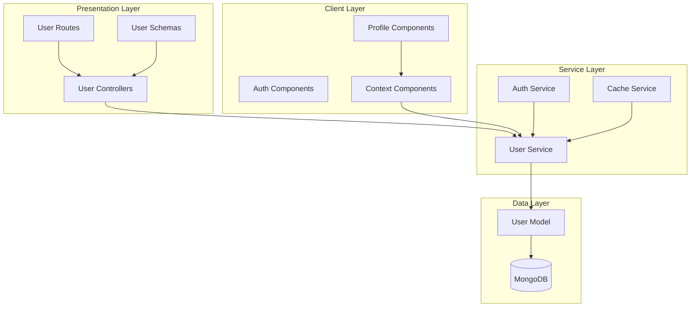
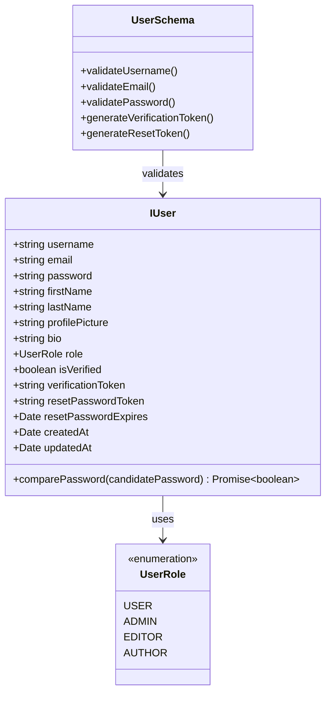
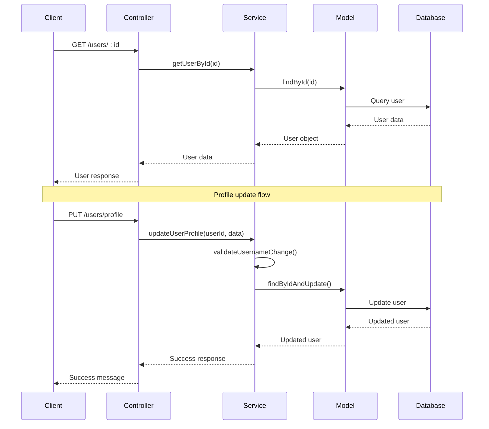
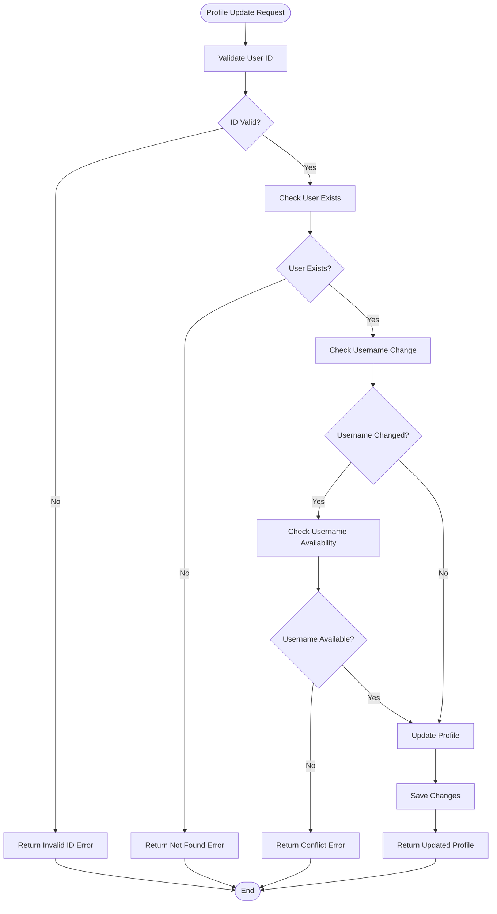

# User Service

<cite>
**Referenced Files in This Document**
- [user.service.ts](file://api-fastify/src/services/user.service.ts)
- [user.model.ts](file://api-fastify/src/models/user.model.ts)
- [user.types.ts](file://api-fastify/src/types/user.types.ts)
- [user.controller.ts](file://api-fastify/src/controllers/user.controller.ts)
- [user.routes.ts](file://api-fastify/src/routes/user.routes.ts)
- [user.schema.ts](file://api-fastify/src/schemas/user.schema.ts)
- [ChangeUsername.tsx](file://src/pages/ChangeUsername.tsx)
- [UserContext.tsx](file://src/UserContext.tsx)
- [api.config.ts](file://src/config/api.config.ts)
</cite>

## Table of Contents
1. [Introduction](#introduction)
2. [Architecture Overview](#architecture-overview)
3. [Core Components](#core-components)
4. [User Model and Data Validation](#user-model-and-data-validation)
5. [Service Operations](#service-operations)
6. [Authentication and Authorization](#authentication-and-authorization)
7. [Profile Management](#profile-management)
8. [Username Management](#username-management)
9. [Security and Privacy](#security-and-privacy)
10. [Performance Considerations](#performance-considerations)
11. [Error Handling](#error-handling)
12. [Troubleshooting Guide](#troubleshooting-guide)
13. [Best Practices](#best-practices)

## Introduction

The User Service is a comprehensive user management system built for the MERN_chatai_blog application. It provides robust functionality for user registration, authentication, profile management, and administrative operations. The service is designed with security, scalability, and user experience in mind, offering features like username availability checks, profile picture management, and role-based access control.

The service operates as part of a modern MERN stack architecture, utilizing MongoDB for data persistence, Fastify for API routing, and TypeScript for type safety. It implements industry-standard security practices including password hashing, JWT token management, and comprehensive input validation.

## Architecture Overview

The User Service follows a layered architecture pattern with clear separation of concerns:



**Diagram sources**
- [user.controller.ts](file://api-fastify/src/controllers/user.controller.ts#L1-L315)
- [user.service.ts](file://api-fastify/src/services/user.service.ts#L1-L239)
- [user.routes.ts](file://api-fastify/src/routes/user.routes.ts#L1-L110)

The architecture ensures:
- **Separation of Concerns**: Clear boundaries between presentation, business logic, and data layers
- **Scalability**: Modular design allows for easy scaling and maintenance
- **Security**: Authentication and authorization implemented at appropriate layers
- **Type Safety**: Comprehensive TypeScript interfaces and validation schemas

## Core Components

### User Service Module

The User Service module (`user.service.ts`) serves as the central business logic layer for all user-related operations. It encapsulates complex user management functionality while maintaining clean interfaces for controllers.

```typescript
// Core service functions
export const getAllUsers = async (page: number, limit: number, search: string) => {
  const skip = (page - 1) * limit;
  const searchQuery = search ? buildSearchQuery(search) : {};
  
  const users = await User.find(searchQuery)
    .select('-password -verificationToken -resetPasswordToken')
    .sort({ createdAt: -1 })
    .skip(skip)
    .limit(limit);
    
  const total = await User.countDocuments(searchQuery);
  const totalPages = Math.ceil(total / limit);
  
  return { users, total, page, limit, totalPages };
};
```

### User Model Definition

The User Model defines the data structure and validation rules for user entities:

```typescript
const userSchema = new Schema<IUser>({
  username: {
    type: String,
    required: true,
    unique: true,
    trim: true,
    minlength: 3,
    maxlength: 30,
  },
  email: {
    type: String,
    required: true,
    unique: true,
    trim: true,
    lowercase: true,
    match: [/^\S+@\S+\.\S+$/, 'Veuillez fournir une adresse email valide'],
  },
  password: {
    type: String,
    required: true,
    minlength: 6,
  },
  // Additional fields...
});
```

### Role-Based Access Control

The system implements a hierarchical role-based access control system:

```typescript
export enum UserRole {
  USER = 'user',
  ADMIN = 'admin',
  EDITOR = 'editor',
  AUTHOR = 'author',
}
```

**Section sources**
- [user.service.ts](file://api-fastify/src/services/user.service.ts#L1-L239)
- [user.model.ts](file://api-fastify/src/models/user.model.ts#L1-L97)
- [user.types.ts](file://api-fastify/src/types/user.types.ts#L1-L59)

## User Model and Data Validation

### Data Structure and Constraints

The User Model implements comprehensive validation rules to ensure data integrity and security:



**Diagram sources**
- [user.model.ts](file://api-fastify/src/models/user.model.ts#L5-L45)
- [user.types.ts](file://api-fastify/src/types/user.types.ts#L10-L25)

### Validation Rules

The model enforces strict validation rules:

- **Username**: Minimum 3 characters, maximum 30 characters, alphanumeric with underscores only
- **Email**: Must be valid email format, unique across users
- **Password**: Minimum 6 characters, automatically hashed before storage
- **Bio**: Maximum 500 characters for profile description
- **Roles**: Enumerated values with hierarchical permissions

### Security Features

The model implements several security measures:

```typescript
// Password hashing middleware
userSchema.pre('save', async function (next) {
  if (!this.isModified('password')) return next();
  
  try {
    const salt = await bcrypt.genSalt(10);
    this.password = await bcrypt.hash(this.password, salt);
    next();
  } catch (error) {
    next(error);
  }
});

// Password comparison method
userSchema.methods.comparePassword = async function (candidatePassword: string): Promise<boolean> {
  return await bcrypt.compare(candidatePassword, this.password);
};
```

**Section sources**
- [user.model.ts](file://api-fastify/src/models/user.model.ts#L47-L97)

## Service Operations

### CRUD Operations

The User Service provides comprehensive CRUD operations with advanced features:



**Diagram sources**
- [user.controller.ts](file://api-fastify/src/controllers/user.controller.ts#L25-L50)
- [user.service.ts](file://api-fastify/src/services/user.service.ts#L35-L85)

### Advanced Features

#### Username Availability Check

The service implements real-time username availability checking:

```typescript
// Frontend validation
const validateUsername = (username: string): boolean => {
  if (username.length < 3) {
    setError("Username must be at least 3 characters long");
    return false;
  }
  
  if (!/^[a-zA-Z0-9_]+$/.test(username)) {
    setError("Username can only contain letters, numbers, and underscores");
    return false;
  }
  
  return true;
};

// Backend validation
if (updateData.username && updateData.username !== user.username) {
  const existingUser = await User.findOne({ username: updateData.username });
  if (existingUser) {
    throw new Error('Ce nom d\'utilisateur est déjà utilisé');
  }
}
```

#### Profile Picture Management

The service supports flexible profile picture handling:

```typescript
// Profile picture update
const updateData = {
  username: trimmedUsername,
  firstName: formData.firstName,
  lastName: formData.lastName,
  profilePicture: imageUrl, // Can be URL or base64
  bio: formData.bio
};
```

#### Pagination and Search

Advanced pagination with search capabilities:

```typescript
export const getAllUsers = async (page: number = 1, limit: number = 10, search: string = '') => {
  const skip = (page - 1) * limit;
  
  const searchQuery = search ? {
    $or: [
      { username: { $regex: search, $options: 'i' } },
      { email: { $regex: search, $options: 'i' } },
      { firstName: { $regex: search, $options: 'i' } },
      { lastName: { $regex: search, $options: 'i' } },
    ],
  } : {};
  
  const users = await User.find(searchQuery)
    .select('-password -verificationToken')
    .sort({ createdAt: -1 })
    .skip(skip)
    .limit(limit);
};
```

**Section sources**
- [user.service.ts](file://api-fastify/src/services/user.service.ts#L10-L35)
- [ChangeUsername.tsx](file://src/pages/ChangeUsername.tsx#L40-L60)

## Authentication and Authorization

### Session Management

The system implements secure session management through the User Context:

```typescript
// User context provider
export const UserContextProvider = ({ children }: { children: ReactNode }) => {
  const [userInfo, setUserInfo] = useState<UserInfo>(null);
  const [isLoading, setIsLoading] = useState<boolean>(true);

  const checkAuth = async (): Promise<boolean> => {
    try {
      const res = await fetch(API_ENDPOINTS.users.profile, {
        method: "GET",
        credentials: "include",
        headers: { "Content-Type": "application/json" },
      });

      if (res.ok) {
        const responseData = await res.json();
        const userData = responseData.user;
        
        setUserInfo({
          id: userData._id,
          username: userData.username,
          role: userData.role,
        });
        return true;
      }
      
      setUserInfo(null);
      return false;
    } catch (error) {
      setUserInfo(null);
      return false;
    }
  };
};
```

### Role-Based Access Control

The service implements granular access control:

```typescript
// User update authorization
if (currentUserId !== id && currentUserRole !== 'admin') {
  throw new Error('Vous n\'êtes pas autorisé à mettre à jour cet utilisateur');
}

// Admin role change restrictions
if (user.role === UserRole.ADMIN && role !== UserRole.ADMIN) {
  const adminCount = await User.countDocuments({ role: UserRole.ADMIN });
  if (adminCount <= 1) {
    throw new Error('Impossible de rétrograder le dernier administrateur');
  }
}
```

### Token Management

Secure token handling for authentication:

```typescript
// Token-based authentication
const login = async (email: string, password: string): Promise<boolean> => {
  const res = await fetch(API_ENDPOINTS.auth.login, {
    method: "POST",
    credentials: "include",
    headers: { "Content-Type": "application/json" },
    body: JSON.stringify({ email, password }),
  });

  if (res.ok) {
    const responseData = await res.json();
    setUserInfo({
      id: responseData.user._id,
      username: responseData.user.username,
      role: responseData.user.role,
    });
    return true;
  }
  
  return false;
};
```

**Section sources**
- [UserContext.tsx](file://src/UserContext.tsx#L40-L120)
- [user.service.ts](file://api-fastify/src/services/user.service.ts#L50-L70)

## Profile Management

### Profile Retrieval

The system provides secure profile retrieval with sensitive data filtering:

```typescript
export const getUserProfile = async (userId: string) => {
  if (!isValidObjectId(userId)) {
    throw new Error('ID utilisateur invalide');
  }

  const user = await User.findById(userId).select(
    '-password -verificationToken -resetPasswordToken -resetPasswordExpires'
  );

  if (!user) {
    throw new Error('Utilisateur non trouvé');
  }

  return user;
};
```

### Profile Updates

Flexible profile update functionality with validation:



**Diagram sources**
- [user.service.ts](file://api-fastify/src/services/user.service.ts#L150-L190)

### Profile Fields

The profile system supports comprehensive user information:

- **Basic Information**: First name, last name, email
- **Identity**: Username (unique identifier)
- **Presentation**: Profile picture, bio description
- **Status**: Verification status, account creation date
- **Preferences**: Role-based permissions and access levels

**Section sources**
- [user.service.ts](file://api-fastify/src/services/user.service.ts#L150-L190)
- [user.model.ts](file://api-fastify/src/models/user.model.ts#L5-L45)

## Username Management

### Username Update Process

The username update process combines frontend validation with backend enforcement:

```typescript
// Frontend validation and submission
const handleSubmit = async (e: React.FormEvent) => {
  e.preventDefault();
  
  const trimmedUsername = newUsername.trim();
  
  // Prevent same username update
  if (trimmedUsername === currentUsername) {
    setError("New username is the same as your current username");
    return;
  }

  // Validate username format
  if (!validateUsername(trimmedUsername)) {
    return;
  }

  try {
    const response = await fetch(API_ENDPOINTS.users.update, {
      method: "PUT",
      headers: { "Content-Type": "application/json" },
      body: JSON.stringify({ username: trimmedUsername }),
      credentials: "include",
    });

    if (response.ok) {
      // Update local user context
      setUserInfo({ ...userInfo, username: trimmedUsername });
      setStatus("success");
    }
  } catch (error) {
    setError("An error occurred while connecting to the server");
  }
};
```

### Username Constraints

The system enforces strict username constraints:

```typescript
// Username validation rules
const validateUsername = (username: string): boolean => {
  // Length requirement
  if (username.length < 3) {
    setError("Username must be at least 3 characters long");
    return false;
  }

  // Character set restriction
  if (!/^[a-zA-Z0-9_]+$/.test(username)) {
    setError("Username can only contain letters, numbers, and underscores");
    return false;
  }

  return true;
};
```

### Username Uniqueness

Backend enforcement of username uniqueness:

```typescript
// Backend username validation
if (updateData.username && updateData.username !== user.username) {
  const existingUser = await User.findOne({ username: updateData.username });
  if (existingUser) {
    throw new Error('Ce nom d\'utilisateur est déjà utilisé');
  }
}
```

**Section sources**
- [ChangeUsername.tsx](file://src/pages/ChangeUsername.tsx#L70-L120)
- [user.service.ts](file://api-fastify/src/services/user.service.ts#L60-L75)

## Security and Privacy

### Data Protection

The service implements comprehensive data protection measures:

```typescript
// Automatic data sanitization in model
{
  toJSON: {
    transform: (_, ret) => {
      delete ret.password;
      delete ret.verificationToken;
      delete ret.resetPasswordToken;
      delete ret.resetPasswordExpires;
      return ret;
    },
  }
}
```

### Password Security

Strong password security implementation:

```typescript
// Password hashing with bcrypt
userSchema.pre('save', async function (next) {
  if (!this.isModified('password')) return next();
  
  try {
    const salt = await bcrypt.genSalt(10);
    this.password = await bcrypt.hash(this.password, salt);
    next();
  } catch (error) {
    next(error);
  }
});
```

### Access Control

Granular access control with role-based permissions:

```typescript
// Role-based access control
const authorizeUser = (request: FastifyRequest) => {
  const currentUserId = request.user._id;
  const currentUserRole = request.user.role;
  const targetUserId = request.params.id;

  // Self-update or admin privilege
  if (currentUserId !== targetUserId && currentUserRole !== 'admin') {
    throw new Error('Vous n\'êtes pas autorisé à effectuer cette action');
  }
};
```

### Privacy Features

- **Selective Field Projection**: Sensitive fields excluded from responses
- **Token Expiration**: Password reset tokens with expiration
- **Audit Trail**: Timestamp tracking for all user actions
- **Data Minimization**: Only essential data stored and transmitted

**Section sources**
- [user.model.ts](file://api-fastify/src/models/user.model.ts#L35-L45)
- [user.service.ts](file://api-fastify/src/services/user.service.ts#L50-L70)

## Performance Considerations

### Query Optimization

The service implements efficient database queries:

```typescript
// Optimized pagination with indexing
const users = await User.find(searchQuery)
  .select('-password -verificationToken -resetPasswordToken')
  .sort({ createdAt: -1 })
  .skip(skip)
  .limit(limit);

// Efficient count query
const total = await User.countDocuments(searchQuery);
```

### Caching Strategies

Recommended caching approaches:

```typescript
// Profile data caching
const getCachedUserProfile = async (userId: string) => {
  const cacheKey = `user:${userId}:profile`;
  const cachedData = await redis.get(cacheKey);
  
  if (cachedData) {
    return JSON.parse(cachedData);
  }
  
  const user = await User.findById(userId);
  await redis.setex(cacheKey, 3600, JSON.stringify(user)); // 1 hour cache
  
  return user;
};
```

### Indexing Recommendations

Recommended MongoDB indexes:

```javascript
// User collection indexes
db.users.createIndex({ username: 1 }, { unique: true });
db.users.createIndex({ email: 1 }, { unique: true });
db.users.createIndex({ role: 1 });
db.users.createIndex({ createdAt: -1 });
```

### Memory Management

Efficient memory usage patterns:

- **Selective Field Loading**: Use `.select()` to load only required fields
- **Batch Operations**: Group related database operations
- **Connection Pooling**: Optimize MongoDB connection usage
- **Garbage Collection**: Proper cleanup of temporary objects

## Error Handling

### Comprehensive Error Management

The service implements structured error handling:

```typescript
// Controller-level error handling
export const updateUserProfile = async (request: FastifyRequest, reply: FastifyReply) => {
  try {
    const userId = request.user._id;
    const updateData = request.body;

    const updatedUser = await UserService.updateUserProfile(userId, updateData);
    
    return reply.status(200).send({
      message: 'Profil mis à jour avec succès',
      user: updatedUser,
    });
  } catch (error) {
    if (error instanceof Error) {
      if (error.message.includes('invalide')) {
        return reply.status(400).send({ message: error.message });
      } else if (error.message.includes('non trouvé')) {
        return reply.status(404).send({ message: error.message });
      } else if (error.message.includes('déjà utilisé')) {
        return reply.status(400).send({ message: error.message });
      }
    }
    throw error;
  }
};
```

### Error Categories

Common error scenarios and handling:

- **Validation Errors**: Invalid input data
- **Authorization Errors**: Insufficient permissions
- **Resource Not Found**: User or resource doesn't exist
- **Concurrency Errors**: Race conditions during updates
- **System Errors**: Database or infrastructure issues

### Error Response Format

Standardized error response structure:

```typescript
interface ErrorResponse {
  message: string;
  statusCode: number;
  timestamp: string;
  path: string;
}
```

**Section sources**
- [user.controller.ts](file://api-fastify/src/controllers/user.controller.ts#L250-L315)

## Troubleshooting Guide

### Common Issues and Solutions

#### Username Already Taken

**Problem**: User receives "username already taken" error
**Solution**: 
1. Check if username meets length requirements (3-30 characters)
2. Verify username contains only allowed characters (letters, numbers, underscores)
3. Try a different username variation

#### Profile Update Failures

**Problem**: Profile updates fail silently
**Solution**:
1. Check network connectivity
2. Verify user authentication status
3. Validate input data format
4. Check server logs for detailed error messages

#### Authentication Issues

**Problem**: Users cannot log in or maintain sessions
**Solution**:
1. Verify credentials are correct
2. Check browser cookies are enabled
3. Clear browser cache and cookies
4. Verify server-side authentication tokens

### Debugging Tools

#### Frontend Debugging

```typescript
// Enable debug logging
console.log("Current user info:", userInfo);
console.log("API endpoint:", API_ENDPOINTS.users.update);
console.log("Request payload:", { username: trimmedUsername });
```

#### Backend Debugging

```typescript
// Enable detailed logging
request.log.info('Updating user profile', {
  userId: request.user._id,
  updateData: request.body,
  timestamp: new Date().toISOString()
});
```

### Monitoring and Observability

Recommended monitoring practices:

- **Health Checks**: Regular API endpoint monitoring
- **Error Tracking**: Centralized error logging
- **Performance Metrics**: Response time and throughput monitoring
- **User Activity**: Track user engagement and feature usage

## Best Practices

### Development Guidelines

#### Code Organization

- **Single Responsibility**: Each service function handles one specific operation
- **Consistent Naming**: Use descriptive function and variable names
- **Error Handling**: Implement comprehensive error handling at all levels
- **Documentation**: Maintain clear inline documentation

#### Security Best Practices

- **Input Validation**: Validate all user inputs on both client and server
- **Output Encoding**: Sanitize data before displaying to users
- **Access Control**: Implement proper authorization checks
- **Secure Defaults**: Use secure configurations by default

#### Performance Optimization

- **Query Optimization**: Use appropriate indexes and projections
- **Caching**: Implement caching for frequently accessed data
- **Batch Operations**: Group related database operations
- **Connection Management**: Optimize database connections

### Deployment Considerations

#### Environment Configuration

```typescript
// Production configuration
const config = {
  database: {
    uri: process.env.MONGODB_URI,
    options: {
      useNewUrlParser: true,
      useUnifiedTopology: true,
      poolSize: 10
    }
  },
  auth: {
    jwtSecret: process.env.JWT_SECRET,
    tokenExpiration: '24h'
  }
};
```

#### Monitoring Setup

- **Log Aggregation**: Centralized logging system
- **Alerting**: Automated alerts for critical errors
- **Metrics Collection**: Performance and usage metrics
- **Health Checks**: Regular system health monitoring

### Maintenance Procedures

#### Regular Tasks

- **Database Backups**: Automated backup scheduling
- **Index Maintenance**: Regular index optimization
- **Log Rotation**: Manage log file sizes and retention
- **Security Updates**: Regular dependency updates

#### Troubleshooting Workflow

1. **Identify Issue**: Gather error details and context
2. **Reproduce Problem**: Attempt to reproduce in development
3. **Isolate Cause**: Narrow down the source of the problem
4. **Implement Fix**: Apply appropriate solution
5. **Verify Resolution**: Confirm issue is resolved
6. **Document Solution**: Record troubleshooting steps

This comprehensive User Service documentation provides developers with the knowledge needed to effectively utilize, maintain, and extend the user management functionality in the MERN_chatai_blog application. The service's robust architecture, security features, and comprehensive error handling make it suitable for production deployment while remaining accessible to developers of varying experience levels.