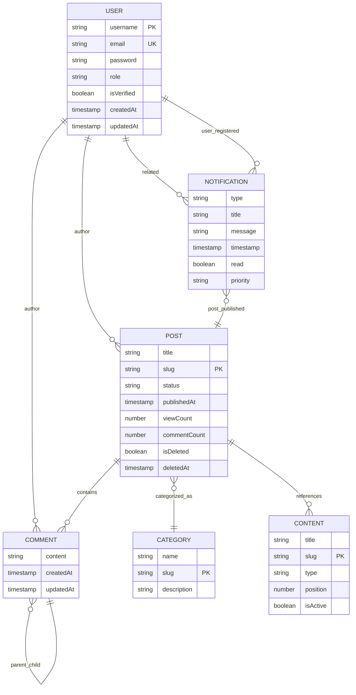
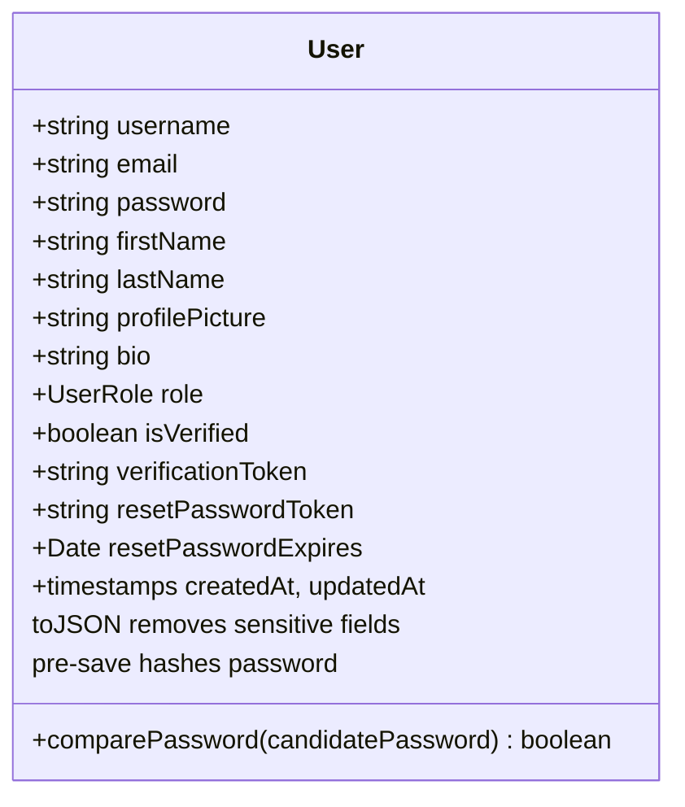
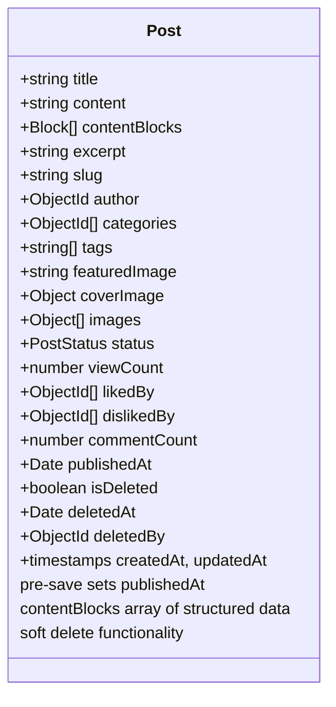
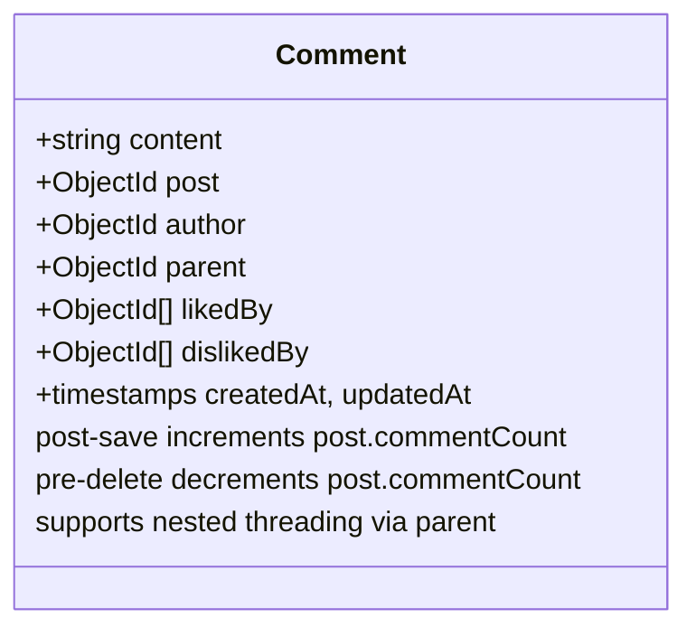
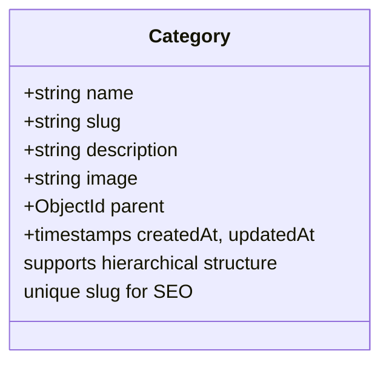
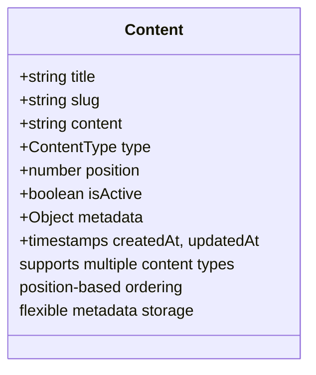
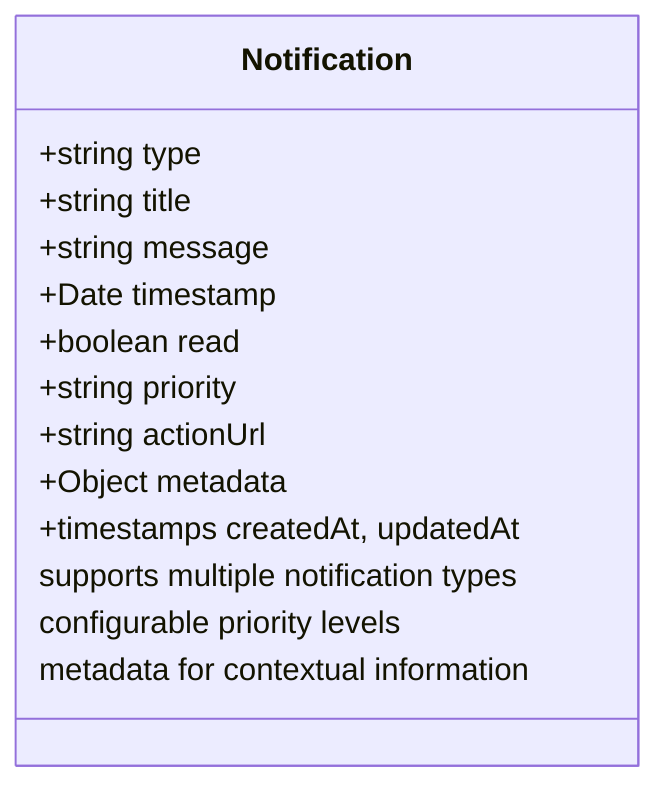

# Data Models & ORM Mapping

<cite>
**Referenced Files in This Document**   
- [user.model.ts](file://api-fastify/src/models/user.model.ts)
- [post.model.ts](file://api-fastify/src/models/post.model.ts)
- [comment.model.ts](file://api-fastify/src/models/comment.model.ts)
- [category.model.ts](file://api-fastify/src/models/category.model.ts)
- [content.model.ts](file://api-fastify/src/models/content.model.ts)
- [notification.model.ts](file://api-fastify/src/models/notification.model.ts)
- [user.types.ts](file://api-fastify/src/types/user.types.ts)
- [post.types.ts](file://api-fastify/src/types/post.types.ts)
- [comment.types.ts](file://api-fastify/src/types/comment.types.ts)
- [category.types.ts](file://api-fastify/src/types/category.types.ts)
- [content.types.ts](file://api-fastify/src/types/content.types.ts)
- [notification.types.ts](file://api-fastify/src/types/notification.types.ts)
</cite>

## Table of Contents
1. [Introduction](#introduction)
2. [Entity Relationship Overview](#entity-relationship-overview)
3. [User Model](#user-model)
4. [Post Model](#post-model)
5. [Comment Model](#comment-model)
6. [Category Model](#category-model)
7. [Content Model](#content-model)
8. [Notification Model](#notification-model)
9. [Data Access Patterns](#data-access-patterns)
10. [Performance Considerations](#performance-considerations)
11. [Data Retention and Archival](#data-retention-and-archival)
12. [Security and Access Control](#security-and-access-control)

## Introduction
This document provides comprehensive documentation for the MongoDB schema implementation in the MERN_chatai_blog application using Mongoose. The system features a content management architecture with interconnected entities including users, posts, comments, categories, content blocks, and notifications. The schema design incorporates modern content modeling practices with support for block-based content structures, soft deletion, and role-based access control. This documentation details the data models, their relationships, validation rules, indexing strategies, and business logic embedded within the schema definitions.

## Entity Relationship Overview
The data model represents a hierarchical content management system where users create and interact with posts, which are organized by categories and enhanced with structured content blocks. Comments form a nested discussion tree on posts, while notifications track system events and user activities. The following diagram illustrates the core entity relationships:



**Diagram sources**
- [user.model.ts](file://api-fastify/src/models/user.model.ts#L1-L97)
- [post.model.ts](file://api-fastify/src/models/post.model.ts#L1-L136)
- [comment.model.ts](file://api-fastify/src/models/comment.model.ts#L1-L78)
- [category.model.ts](file://api-fastify/src/models/category.model.ts#L1-L45)
- [content.model.ts](file://api-fastify/src/models/content.model.ts#L1-L54)
- [notification.model.ts](file://api-fastify/src/models/notification.model.ts#L1-L97)

**Section sources**
- [user.model.ts](file://api-fastify/src/models/user.model.ts#L1-L97)
- [post.model.ts](file://api-fastify/src/models/post.model.ts#L1-L136)
- [comment.model.ts](file://api-fastify/src/models/comment.model.ts#L1-L78)
- [category.model.ts](file://api-fastify/src/models/category.model.ts#L1-L45)
- [content.model.ts](file://api-fastify/src/models/content.model.ts#L1-L54)
- [notification.model.ts](file://api-fastify/src/models/notification.model.ts#L1-L97)

## User Model
The User model represents application users with authentication credentials, profile information, and role-based permissions. It serves as the foundation for content creation, commenting, and system interactions.

### Field Definitions
- **username**: Unique identifier (3-30 characters)
- **email**: Unique verified email address with format validation
- **password**: BCrypt-hashed password with minimum 6 characters
- **firstName/lastName**: Optional personal information
- **profilePicture**: URL to user avatar
- **bio**: Short biography (max 500 characters)
- **role**: UserRole enum (user, admin, editor, author)
- **isVerified**: Email verification status
- **verificationToken**: Token for email verification
- **resetPasswordToken**: Token for password reset
- **resetPasswordExpires**: Expiration timestamp for password reset

### Data Validation and Constraints
The model enforces strict validation rules:
- Username and email uniqueness via MongoDB unique indexes
- Email format validation using regex pattern
- Password minimum length of 6 characters
- Username length between 3-30 characters
- Role field restricted to predefined enum values

### Business Logic and Lifecycle Hooks
The schema includes critical business logic:
- **Password Hashing**: Pre-save middleware automatically hashes passwords using BCrypt with salt rounds of 10
- **Data Sanitization**: toJSON transformation removes sensitive fields (password, tokens) when serializing
- **Authentication Method**: comparePassword method for secure password verification

### Indexing Strategy
- Unique index on username and email fields
- No additional indexes required due to typical query patterns focusing on these unique fields



**Diagram sources**
- [user.model.ts](file://api-fastify/src/models/user.model.ts#L1-L97)
- [user.types.ts](file://api-fastify/src/types/user.types.ts#L1-L59)

**Section sources**
- [user.model.ts](file://api-fastify/src/models/user.model.ts#L1-L97)
- [user.types.ts](file://api-fastify/src/types/user.types.ts#L1-L59)

## Post Model
The Post model represents blog articles with support for both legacy plain content and modern block-based content structures. It incorporates publishing workflows, engagement metrics, and content organization features.

### Field Definitions
- **title**: Article title (3-200 characters)
- **content**: Legacy plain text content (optional during transition)
- **contentBlocks**: Array of structured content blocks with type and data
- **excerpt**: Short summary for listings (max 500 characters)
- **slug**: URL-friendly identifier (unique)
- **author**: Reference to User document
- **categories**: Array of Category references
- **tags**: Array of string tags
- **featuredImage/coverImage/images**: Image references with optional alt text
- **status**: PostStatus enum (draft, published, archived)
- **viewCount**: Read counter
- **likedBy/dislikedBy**: Arrays of User references for engagement
- **commentCount**: Cached counter for performance
- **publishedAt**: Publication timestamp
- **isDeleted/deletedAt/deletedBy**: Soft deletion fields

### Data Validation and Constraints
- Title length between 3-200 characters
- Slug uniqueness enforced by MongoDB unique index
- Status field restricted to predefined enum values
- Content block structure validation via schema definition
- Image URL format validation

### Business Logic and Lifecycle Hooks
- **Publication Timestamp**: Pre-save middleware automatically sets publishedAt when status changes to PUBLISHED
- **Comment Count Maintenance**: Comment creation and deletion trigger updates to post.commentCount
- **Content Migration**: Support for both legacy content and modern contentBlocks during transition

### Indexing Strategy
- Text index on title and content for full-text search
- Single field indexes on author, categories, and status
- Composite indexes for optimized querying:
  - { status: 1, createdAt: -1 } for draft management
  - { status: 1, publishedAt: -1 } for publication workflows
  - { publishedAt: -1, createdAt: -1 } for chronological sorting



**Diagram sources**
- [post.model.ts](file://api-fastify/src/models/post.model.ts#L1-L136)
- [post.types.ts](file://api-fastify/src/types/post.types.ts#L1-L109)

**Section sources**
- [post.model.ts](file://api-fastify/src/models/post.model.ts#L1-L136)
- [post.types.ts](file://api-fastify/src/types/post.types.ts#L1-L109)

## Comment Model
The Comment model enables user discussions on posts with support for nested replies and engagement metrics. It maintains a hierarchical structure while optimizing for performance through denormalized counters.

### Field Definitions
- **content**: Comment text (1-1000 characters)
- **post**: Reference to parent Post
- **author**: Reference to User
- **parent**: Optional reference to parent Comment for threading
- **likedBy/dislikedBy**: Arrays of User references for reactions

### Data Validation and Constraints
- Content length between 1-1000 characters
- Required references to post and author
- Parent comment must exist and belong to the same post

### Business Logic and Lifecycle Hooks
- **Comment Count Propagation**: Post-save middleware increments post.commentCount
- **Comment Count Cleanup**: Pre-findOneAndDelete middleware decrements post.commentCount on deletion
- **Hierarchical Structure**: Parent-child relationships enable nested comment threads

### Indexing Strategy
- Composite index on { post: 1, createdAt: -1 } for chronological comment retrieval
- Index on parent field for efficient nested comment queries
- Index on author field for user-specific comment retrieval



**Diagram sources**
- [comment.model.ts](file://api-fastify/src/models/comment.model.ts#L1-L78)
- [comment.types.ts](file://api-fastify/src/types/comment.types.ts#L1-L49)

**Section sources**
- [comment.model.ts](file://api-fastify/src/models/comment.model.ts#L1-L78)
- [comment.types.ts](file://api-fastify/src/types/comment.types.ts#L1-L49)

## Category Model
The Category model organizes posts into hierarchical taxonomies with support for nested categories and SEO-friendly URLs.

### Field Definitions
- **name**: Category name (2-50 characters)
- **slug**: URL-friendly identifier (unique)
- **description**: Optional description (max 500 characters)
- **image**: Optional category image URL
- **parent**: Optional reference to parent Category for hierarchy

### Data Validation and Constraints
- Name length between 2-50 characters
- Slug uniqueness enforced by MongoDB unique index
- Parent category must exist in the system

### Business Logic and Lifecycle Hooks
- No custom middleware or methods defined
- Simple hierarchical relationship through parent reference

### Indexing Strategy
- Unique index on slug field
- Index on parent field for efficient hierarchical queries



**Diagram sources**
- [category.model.ts](file://api-fastify/src/models/category.model.ts#L1-L45)
- [category.types.ts](file://api-fastify/src/types/category.types.ts#L1-L38)

**Section sources**
- [category.model.ts](file://api-fastify/src/models/category.model.ts#L1-L45)
- [category.types.ts](file://api-fastify/src/types/category.types.ts#L1-L38)

## Content Model
The Content model manages structured content blocks for pages, sections, and reusable components with flexible positioning and activation controls.

### Field Definitions
- **title**: Content title (2-200 characters)
- **slug**: URL-friendly identifier (unique)
- **content**: Main content string
- **type**: ContentType enum (page, section, block)
- **position**: Numeric position for ordering
- **isActive**: Boolean flag for content visibility
- **metadata**: Flexible key-value storage for additional properties

### Data Validation and Constraints
- Title length between 2-200 characters
- Slug uniqueness enforced by MongoDB unique index
- Type field restricted to predefined enum values

### Business Logic and Lifecycle Hooks
- No custom middleware or methods defined
- Flexible metadata field supports extensibility

### Indexing Strategy
- Unique index on slug field
- Composite index on { type: 1, position: 1 } for type-based ordering
- Index on isActive field for filtering active content



**Diagram sources**
- [content.model.ts](file://api-fastify/src/models/content.model.ts#L1-L54)
- [content.types.ts](file://api-fastify/src/types/content.types.ts#L1-L51)

**Section sources**
- [content.model.ts](file://api-fastify/src/models/content.model.ts#L1-L54)
- [content.types.ts](file://api-fastify/src/types/content.types.ts#L1-L51)

## Notification Model
The Notification model tracks system events, user activities, and administrative alerts with configurable priority and actionability.

### Field Definitions
- **type**: Notification type enum (user_registered, post_published, system_error, user_activity, content_moderation)
- **title**: Notification title (max 200 characters)
- **message**: Detailed message content (max 1000 characters)
- **timestamp**: Event timestamp
- **read**: Boolean read status
- **priority**: Priority level (low, medium, high)
- **actionUrl**: Optional URL for user action
- **metadata**: Structured data including userId, postId, username, postTitle, errorCode

### Data Validation and Constraints
- Type field restricted to predefined enum values
- Priority field restricted to predefined enum values
- Title and message length limits
- Metadata fields follow consistent naming conventions

### Business Logic and Lifecycle Hooks
- No custom middleware or methods defined in schema
- Timestamp defaults to current date
- Read status defaults to false
- Priority defaults to medium

### Indexing Strategy
- Index on timestamp (-1) for chronological ordering
- Index on read status for filtering unread notifications
- Index on type for category-based filtering
- Index on priority for urgency-based sorting



**Diagram sources**
- [notification.model.ts](file://api-fastify/src/models/notification.model.ts#L1-L97)
- [notification.types.ts](file://api-fastify/src/types/notification.types.ts#L1-L48)

**Section sources**
- [notification.model.ts](file://api-fastify/src/models/notification.model.ts#L1-L97)
- [notification.types.ts](file://api-fastify/src/types/notification.types.ts#L1-L48)

## Data Access Patterns
The application employs several data access patterns optimized for performance and usability:

### Population Strategies
- **Post Population**: Posts are typically populated with author (username, profilePicture), categories (name, slug), and sometimes comments
- **Comment Population**: Comments are populated with author information and nested replies
- **User Population**: Users are populated with their posts and comments, with sensitive fields excluded

### Query Optimization
- **Text Search**: Utilizes MongoDB text indexes on post title and content for full-text search
- **Filtered Queries**: Leverages indexes on status, publishedAt, and createdAt for efficient filtering
- **Aggregation Pipelines**: Used for complex operations like comment thread construction and analytics

### Sample Document Structures
**Post Document Example:**
```json
{
  "_id": "60d5ecf0f1a2c34567890123",
  "title": "Getting Started with MERN Stack",
  "slug": "getting-started-with-mern-stack",
  "contentBlocks": [
    {
      "type": "heading",
      "data": { "level": 1, "text": "Introduction" }
    },
    {
      "type": "paragraph",
      "data": { "text": "The MERN stack is a powerful..." }
    }
  ],
  "author": "60d5ecf0f1a2c34567890124",
  "categories": ["60d5ecf0f1a2c34567890125"],
  "status": "published",
  "publishedAt": "2023-06-15T10:00:00Z",
  "viewCount": 150,
  "commentCount": 12,
  "createdAt": "2023-06-15T09:30:00Z",
  "updatedAt": "2023-06-15T10:00:00Z"
}
```

**Comment Document Example:**
```json
{
  "_id": "60d5ecf0f1a2c34567890126",
  "content": "Great article! Thanks for sharing.",
  "post": "60d5ecf0f1a2c34567890123",
  "author": "60d5ecf0f1a2c34567890127",
  "likedBy": ["60d5ecf0f1a2c34567890128"],
  "createdAt": "2023-06-15T10:15:00Z",
  "updatedAt": "2023-06-15T10:15:00Z"
}
```

**Section sources**
- [post.model.ts](file://api-fastify/src/models/post.model.ts#L1-L136)
- [comment.model.ts](file://api-fastify/src/models/comment.model.ts#L1-L78)

## Performance Considerations
The schema design incorporates several performance optimizations:

### Indexing Strategies
- **Composite Indexes**: Strategically created to support common query patterns
- **Text Indexes**: Enable efficient full-text search across post content
- **Selective Indexing**: Avoids over-indexing to maintain write performance

### Data Denormalization
- **Comment Count**: Cached on posts to avoid aggregation queries
- **View Count**: Incremented directly on post document
- **Author Information**: Embedded in responses to reduce population overhead

### Query Optimization
- **Projection**: Fields are selectively included/excluded based on use case
- **Pagination**: Implemented with limit and skip parameters
- **Caching**: Service layer implements caching for frequently accessed data

### Scalability Considerations
- **Block-based Content**: Allows flexible content structures without schema changes
- **Metadata Fields**: Support extensibility without altering core schema
- **Soft Deletion**: Preserves referential integrity while hiding content

**Section sources**
- [post.model.ts](file://api-fastify/src/models/post.model.ts#L1-L136)
- [comment.model.ts](file://api-fastify/src/models/comment.model.ts#L1-L78)
- [user.model.ts](file://api-fastify/src/models/user.model.ts#L1-L97)

## Data Retention and Archival
The system implements data retention policies to balance storage efficiency with data integrity:

### Notification Retention
- **Default Retention**: Notifications are retained indefinitely with read/unread status
- **Cleanup Strategy**: Administrative interface allows manual cleanup of old notifications
- **Audit Requirements**: Critical notifications (system_error, content_moderation) are preserved for compliance

### Content Archival
- **Post Status Workflow**: Draft → Published → Archived lifecycle
- **Archived Content**: Remains in database but is excluded from public queries
- **Soft Deletion**: Deleted posts are marked with isDeleted flag and preserved for recovery

### Data Purging
- **No Automatic Purging**: The system does not automatically delete data
- **Manual Administration**: Data cleanup is performed through administrative interfaces
- **Backup Strategy**: Regular backups ensure data recovery capabilities

**Section sources**
- [post.model.ts](file://api-fastify/src/models/post.model.ts#L1-L136)
- [notification.model.ts](file://api-fastify/src/models/notification.model.ts#L1-L97)

## Security and Access Control
The data models incorporate security measures at multiple levels:

### Model-Level Security
- **Sensitive Data Protection**: Passwords, tokens, and reset links are excluded from serialized output via toJSON transformation
- **Input Validation**: Comprehensive validation prevents injection and malformed data
- **Authentication**: Passwords are securely hashed using BCrypt with salt

### Access Control
- **Role-Based Permissions**: UserRole enum defines user capabilities
- **Field-Level Security**: Sensitive fields are only accessible to authorized roles
- **Audit Trails**: Timestamps track creation and modification events

### Data Integrity
- **Referential Integrity**: ObjectId references maintain relationships between collections
- **Validation Constraints**: Ensure data consistency and business rule compliance
- **Transaction Safety**: Operations are designed to maintain consistency across related documents

**Section sources**
- [user.model.ts](file://api-fastify/src/models/user.model.ts#L1-L97)
- [post.model.ts](file://api-fastify/src/models/post.model.ts#L1-L136)
- [notification.model.ts](file://api-fastify/src/models/notification.model.ts#L1-L97)