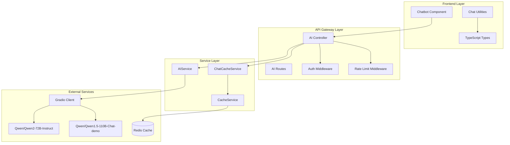
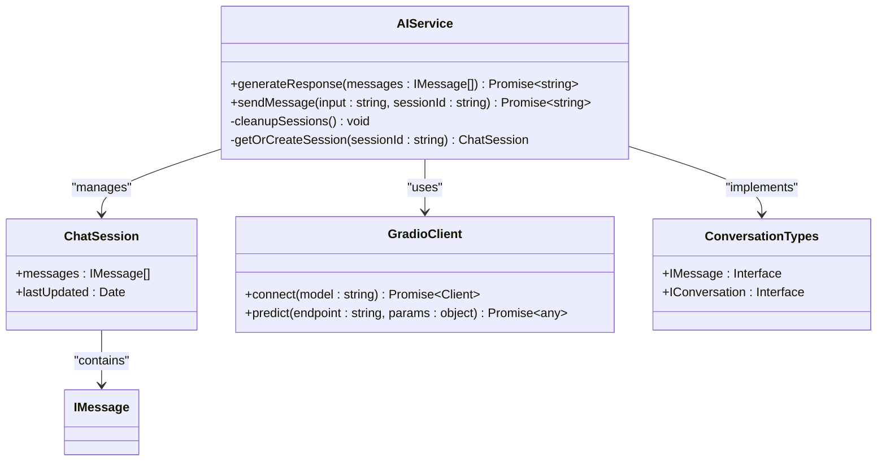
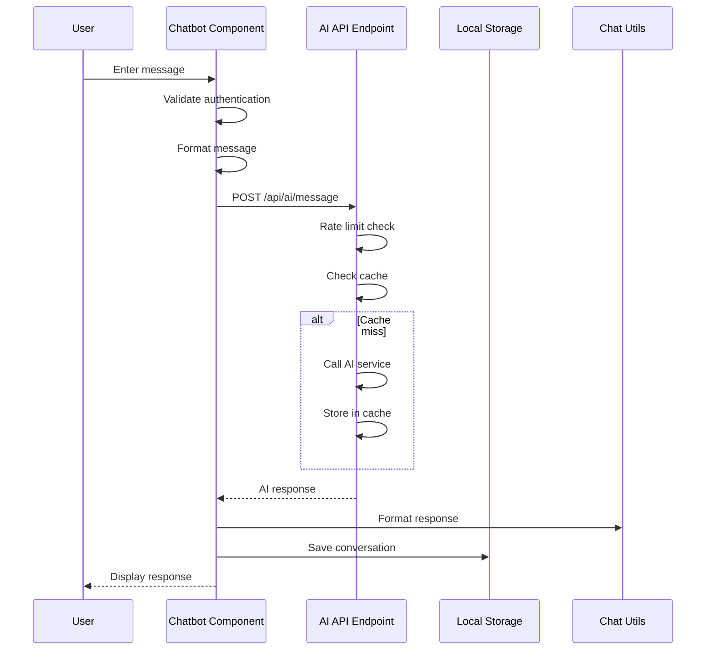
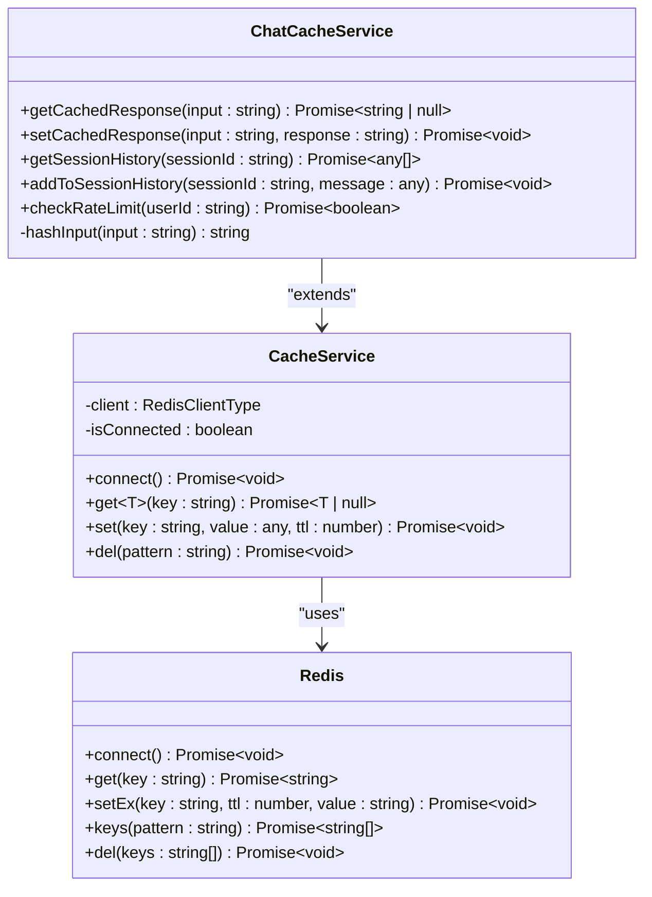
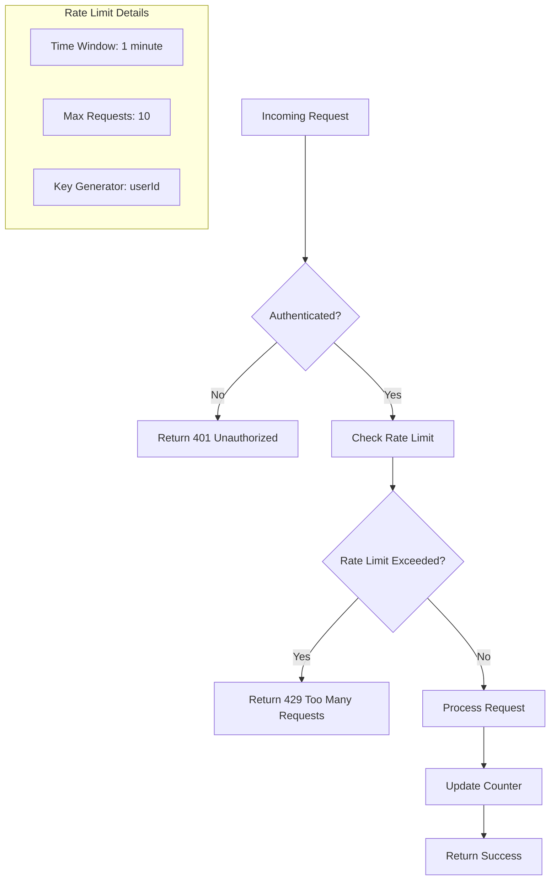
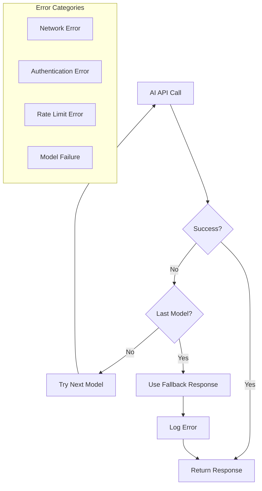

# AI Service Integration

<cite>
**Referenced Files in This Document**
- [ai.service.ts](file://api-fastify/src/services/ai.service.ts)
- [ai.controller.ts](file://api-fastify/src/controllers/ai.controller.ts)
- [chat-cache.service.ts](file://api-fastify/src/services/chat-cache.service.ts)
- [cache.service.ts](file://api-fastify/src/services/cache.service.ts)
- [Chatbot.tsx](file://src/components/Chatbot.tsx)
- [ChatTypes.ts](file://src/types/ChatTypes.ts)
- [chatUtils.ts](file://src/lib/chatUtils.ts)
- [api.config.ts](file://src/config/api.config.ts)
- [conversation.types.ts](file://api-fastify/src/types/conversation.types.ts)
- [rate-limit.middleware.ts](file://api-fastify/src/middlewares/rate-limit.middleware.ts)
- [auth.middleware.ts](file://api-fastify/src/middlewares/auth.middleware.ts)
- [ai.routes.ts](file://api-fastify/src/routes/ai.routes.ts)
</cite>

## Table of Contents
1. [Introduction](#introduction)
2. [System Architecture](#system-architecture)
3. [AI Service Implementation](#ai-service-implementation)
4. [Chatbot Frontend Integration](#chatbot-frontend-integration)
5. [Caching Layer](#caching-layer)
6. [Rate Limiting and Security](#rate-limiting-and-security)
7. [Configuration Management](#configuration-management)
8. [Error Handling and Recovery](#error-handling-and-recovery)
9. [Performance Optimization](#performance-optimization)
10. [Troubleshooting Guide](#troubleshooting-guide)
11. [Best Practices](#best-practices)

## Introduction

The AI service integration in MERN_chatai_blog provides a sophisticated chatbot system powered by Gradio client technology. This comprehensive system enables real-time AI-powered conversations with intelligent caching, rate limiting, and robust error handling mechanisms. The integration seamlessly connects the frontend React components with the backend Fastify API, leveraging Redis for caching and providing a scalable solution for AI-driven user interactions.

The system is designed to handle various AI models through a failover mechanism, ensuring reliability and performance while maintaining user privacy and security standards. The architecture emphasizes scalability, fault tolerance, and efficient resource utilization through intelligent caching strategies and rate limiting controls.

## System Architecture

The AI service integration follows a layered architecture that separates concerns between the frontend presentation layer, backend API services, and external AI model providers.



**Diagram sources**
- [Chatbot.tsx](file://src/components/Chatbot.tsx#L1-L50)
- [ai.controller.ts](file://api-fastify/src/controllers/ai.controller.ts#L1-L30)
- [ai.service.ts](file://api-fastify/src/services/ai.service.ts#L1-L40)

The architecture ensures clear separation of responsibilities while maintaining efficient communication between layers. The frontend handles user interactions and presentation, while the backend manages AI model communication, caching, and security enforcement.

**Section sources**
- [Chatbot.tsx](file://src/components/Chatbot.tsx#L1-L100)
- [ai.controller.ts](file://api-fastify/src/controllers/ai.controller.ts#L1-L70)
- [ai.service.ts](file://api-fastify/src/services/ai.service.ts#L1-L131)

## AI Service Implementation

The core AI service is implemented through the `AIService` class, which provides a robust interface for communicating with AI models via the Gradio client library.

### Core Service Architecture



**Diagram sources**
- [ai.service.ts](file://api-fastify/src/services/ai.service.ts#L5-L15)
- [conversation.types.ts](file://api-fastify/src/types/conversation.types.ts#L1-L18)

### Session Management

The AI service implements sophisticated session management to maintain conversational context across multiple interactions:

```typescript
// Session interface definition
interface ChatSession {
  messages: IMessage[];
  lastUpdated: Date;
}

// Session TTL configuration
const SESSION_TTL = 24 * 60 * 60 * 1000; // 24 hours

// Automatic cleanup mechanism
setInterval(cleanupSessions, 60 * 60 * 1000); // Every hour
```

The session management system automatically cleans up expired sessions and maintains conversational continuity by storing up to 10 recent messages per session. This prevents memory leaks while preserving context for meaningful interactions.

### Multi-Model Failover

The service implements a failover mechanism to ensure reliability across multiple AI models:

```typescript
const models = [
  "Qwen/Qwen2-72B-Instruct",
  "Qwen/Qwen1.5-110B-Chat-demo"
];

for (const model of models) {
  try {
    const client = await Client.connect(model);
    // Attempt prediction with current model
    const result = await client.predict("/model_chat", {
      query: lastUserMessage,
      history: history,
      system: process.env.QWEN_PROMPT || "Tu es un assistant utile et amical..."
    });
    return aiResponse;
  } catch (error) {
    if (model === models[models.length - 1]) {
      throw error; // Last model failed
    }
    console.log(`Essai avec le modèle suivant...`);
  }
}
```

This approach ensures that if one model fails, the system automatically attempts to use the next available model, providing redundancy and improved availability.

**Section sources**
- [ai.service.ts](file://api-fastify/src/services/ai.service.ts#L40-L90)

## Chatbot Frontend Integration

The frontend chatbot component provides an intuitive interface for users to interact with the AI service while maintaining seamless integration with the backend API.

### Component Architecture



**Diagram sources**
- [Chatbot.tsx](file://src/components/Chatbot.tsx#L120-L180)
- [ai.controller.ts](file://api-fastify/src/controllers/ai.controller.ts#L20-L50)

### Authentication Integration

The chatbot component integrates with the authentication system to ensure secure access:

```typescript
// Authentication check
if (!userInfo) {
  setError("Vous devez être connecté pour utiliser le chat. Veuillez vous connecter.")
  return
}

// API call with authentication
const response = await fetch(apiEndpoint, {
  method: "POST",
  headers: {
    "Content-Type": "application/json",
  },
  body: JSON.stringify({ input, sessionId }),
  credentials: "include", // Includes cookies for auth
})
```

This ensures that only authenticated users can access AI-powered features, maintaining security and compliance with user privacy regulations.

### Message Formatting and Display

The frontend implements sophisticated message formatting using custom utilities:

```typescript
export function formatChatMessage(text: string): string {
  return text
    .replace(/\*\*(.*?)\*\*/g, "<strong>$1</strong>") // Bold
    .replace(/\*(.*?)\*/g, "<em>$1</em>") // Italic
    .replace(/`(.*?)`/g, "<code class='bg-gray-100 dark:bg-gray-800'>...</code>")
    .replace(/\[(.*?)\]\((.*?)\)/g, "<a href='$2'>...</a>")
    .replace(/\n/g, "<br />")
}
```

This formatting system supports Markdown-like syntax for rich text display, enhancing the user experience with properly formatted AI responses.

**Section sources**
- [Chatbot.tsx](file://src/components/Chatbot.tsx#L120-L200)
- [chatUtils.ts](file://src/lib/chatUtils.ts#L1-L70)

## Caching Layer

The caching system provides multiple layers of optimization to improve performance and reduce API calls to external AI services.

### Cache Service Architecture



**Diagram sources**
- [cache.service.ts](file://api-fastify/src/services/cache.service.ts#L1-L58)
- [chat-cache.service.ts](file://api-fastify/src/services/chat-cache.service.ts#L1-L47)

### Response Caching Strategy

The chat cache service implements intelligent response caching to avoid redundant API calls:

```typescript
async getCachedResponse(input: string): Promise<string | null> {
  const key = `chat:response:${this.hashInput(input)}`;
  return await cache.get(key);
}

async setCachedResponse(input: string, response: string): Promise<void> {
  const key = `chat:response:${this.hashInput(input)}`;
  await cache.set(key, response, 3600); // 1 hour TTL
}
```

The caching strategy uses SHA-256 hashing of normalized input text to create unique cache keys, ensuring that semantically equivalent queries receive cached responses while preventing collisions.

### Session History Management

The system maintains session histories with automatic trimming to prevent excessive memory usage:

```typescript
async addToSessionHistory(sessionId: string, message: any): Promise<void> {
  const key = `chat:session:${sessionId}`;
  const history = await this.getSessionHistory(sessionId);
  history.push(message);
  
  // Keep only the 20 most recent messages
  const trimmed = history.slice(-20);
  await cache.set(key, trimmed, 7200); // 2 hours TTL
}
```

This approach balances conversational context preservation with memory efficiency, ensuring optimal performance while maintaining meaningful conversation continuity.

**Section sources**
- [chat-cache.service.ts](file://api-fastify/src/services/chat-cache.service.ts#L1-L47)

## Rate Limiting and Security

The system implements comprehensive rate limiting and security measures to protect against abuse and ensure fair resource allocation.

### Rate Limiting Implementation



**Diagram sources**
- [rate-limit.middleware.ts](file://api-fastify/src/middlewares/rate-limit.middleware.ts#L15-L50)

### Rate Limiting Middleware

The rate limiting middleware provides configurable protection against abuse:

```typescript
export const notificationRateLimit = createRateLimitMiddleware({
  windowMs: 60 * 1000, // 1 minute
  maxRequests: 10,     // 10 requests per minute
  keyGenerator: (request: FastifyRequest) => {
    return request.user?._id || request.ip;
  },
  skipSuccessfulRequests: false,
  skipFailedRequests: true,
});
```

This middleware tracks request patterns and automatically throttles users who exceed the configured limits, protecting system resources while maintaining fair access for legitimate users.

### Security Measures

The authentication system implements multiple layers of security:

```typescript
export const authenticate = async (request: FastifyRequest, reply: FastifyReply) => {
  try {
    // Log authentication attempts for monitoring
    console.log('Cookies received:', request.cookies);
    console.log('Headers received:', request.headers);
    
    // Verify JWT token
    await request.jwtVerify();
    
    // Log successful authentication
    console.log('Authenticated user:', request.user);
  } catch (error) {
    console.error('Authentication error:', error);
    reply.status(401).send({
      message: 'Unauthorized - Please log in',
      error: error instanceof Error ? error.message : 'Unknown error'
    });
  }
};
```

The system logs authentication attempts and failures for security monitoring while providing clear error messages to users.

**Section sources**
- [rate-limit.middleware.ts](file://api-fastify/src/middlewares/rate-limit.middleware.ts#L1-L92)
- [auth.middleware.ts](file://api-fastify/src/middlewares/auth.middleware.ts#L1-L50)

## Configuration Management

The system uses environment variables and configuration files to manage deployment-specific settings and API endpoints.

### Environment Configuration

```typescript
// Redis connection configuration
const redisUrl = process.env.REDIS_URL || 'redis://localhost:6379';

// AI model configuration
const models = [
  "Qwen/Qwen2-72B-Instruct",
  "Qwen/Qwen1.5-110B-Chat-demo"
];

// AI prompt configuration
const systemPrompt = process.env.QWEN_PROMPT || 
  "Tu es un assistant utile et amical pour un blog sur la technologie et l'IA.";
```

### API Endpoint Configuration

The frontend uses a centralized configuration system for API endpoints:

```typescript
export const API_ENDPOINTS = {
  ai: {
    message: `${API_BASE_URL}/ai/message`,
    test: `${API_BASE_URL}/ai/test`,
  },
};

export const API_BASE_URL = import.meta.env.VITE_API_URL || '/api';
```

This configuration approach ensures consistency across the application while allowing easy customization for different deployment environments.

**Section sources**
- [ai.service.ts](file://api-fastify/src/services/ai.service.ts#L68-L70)
- [api.config.ts](file://src/config/api.config.ts#L1-L50)

## Error Handling and Recovery

The system implements comprehensive error handling and recovery mechanisms to ensure graceful degradation during failures.

### Error Recovery Strategy



**Diagram sources**
- [ai.service.ts](file://api-fastify/src/services/ai.service.ts#L70-L100)

### Fallback Mechanisms

The AI service implements multiple fallback strategies:

```typescript
try {
  const aiResponse = await generateResponse(session.messages);
  session.messages.push({ content: aiResponse, sender: 'assistant' });
  return aiResponse;
} catch (error) {
  console.error('Error sending message to AI:', error);
  
  // Fallback response for AI service failures
  return 'Désolé, je rencontre des difficultés à traiter votre demande pour le moment. Veuillez réessayer plus tard.';
}
```

The system provides meaningful fallback responses when AI services are unavailable, ensuring users still receive helpful information even during temporary outages.

### Controller-Level Error Handling

The AI controller implements comprehensive error handling:

```typescript
try {
  // Process AI request
  return reply.status(200).send({
    response,
    success: true,
    sessionId
  });
} catch (error) {
  request.log.error(error);
  return reply.status(500).send({
    message: 'An error occurred while sending the message',
    success: false,
    error: error instanceof Error ? error.message : 'Unknown error'
  });
}
```

This approach ensures that all errors are properly logged and communicated to users while maintaining system stability.

**Section sources**
- [ai.service.ts](file://api-fastify/src/services/ai.service.ts#L100-L131)
- [ai.controller.ts](file://api-fastify/src/controllers/ai.controller.ts#L50-L70)

## Performance Optimization

The system employs multiple optimization strategies to minimize latency and maximize throughput for AI interactions.

### Caching Strategies

The multi-tier caching approach significantly reduces API calls and improves response times:

1. **Response Caching**: Frequently asked questions are cached for 1 hour
2. **Session Caching**: Recent conversation history is cached for 2 hours
3. **Rate Limiting**: Prevents unnecessary API calls by enforcing limits

### Memory Management

Automatic session cleanup prevents memory leaks:

```typescript
const cleanupSessions = () => {
  const now = new Date();
  for (const [sessionId, session] of chatSessions.entries()) {
    if (now.getTime() - session.lastUpdated.getTime() > SESSION_TTL) {
      chatSessions.delete(sessionId);
    }
  }
};
```

This ensures that inactive sessions are automatically removed, maintaining optimal memory usage.

### Connection Pooling

The Redis client implementation supports connection pooling and automatic reconnection:

```typescript
async connect() {
  if (this.isConnected) return;
  
  try {
    this.client = createClient({
      url: process.env.REDIS_URL || 'redis://localhost:6379'
    });
    
    await this.client.connect();
    this.isConnected = true;
    console.log('Redis connected');
  } catch (error) {
    console.warn('Redis unavailable, cache disabled');
  }
}
```

This approach ensures reliable cache operations while gracefully handling Redis connectivity issues.

## Troubleshooting Guide

### Common Issues and Solutions

**AI Service Unavailable**
- Verify Redis connectivity
- Check AI model endpoints
- Review rate limiting configuration

**Authentication Failures**
- Ensure JWT tokens are present
- Verify token validity
- Check user permissions

**Cache Performance Issues**
- Monitor Redis memory usage
- Adjust cache TTL settings
- Review cache key patterns

### Debugging Tools

Enable debug logging for comprehensive troubleshooting:

```typescript
// Enable detailed logging
console.log('Cookies received:', request.cookies);
console.log('Headers received:', request.headers);
console.log('Authenticated user:', request.user);
```

### Monitoring and Metrics

Implement monitoring for key metrics:
- AI API response times
- Cache hit rates
- Rate limit violations
- Authentication success rates

**Section sources**
- [ai.service.ts](file://api-fastify/src/services/ai.service.ts#L15-L30)
- [cache.service.ts](file://api-fastify/src/services/cache.service.ts#L10-L30)

## Best Practices

### Development Guidelines

1. **Environment Configuration**: Always use environment variables for sensitive configuration
2. **Error Handling**: Implement comprehensive error handling at all levels
3. **Security**: Enforce authentication and authorization for all AI interactions
4. **Performance**: Leverage caching to minimize API calls and improve response times
5. **Monitoring**: Implement logging and monitoring for production deployments

### Deployment Considerations

1. **Redis Setup**: Configure Redis for production with appropriate memory limits
2. **Rate Limits**: Adjust rate limits based on expected traffic patterns
3. **Model Selection**: Choose appropriate AI models based on performance requirements
4. **Backup Strategies**: Implement backup procedures for cached data
5. **Scalability**: Design for horizontal scaling with load balancing

### Maintenance Procedures

1. **Regular Cleanup**: Monitor and clean up expired sessions regularly
2. **Cache Optimization**: Periodically review cache effectiveness and adjust TTLs
3. **Model Updates**: Stay current with AI model updates and improvements
4. **Security Audits**: Regularly review authentication and authorization mechanisms
5. **Performance Tuning**: Continuously monitor and optimize system performance

The AI service integration provides a robust, scalable foundation for AI-powered chat interactions in modern web applications. By following these guidelines and best practices, developers can build reliable, performant systems that deliver exceptional user experiences while maintaining security and operational excellence.