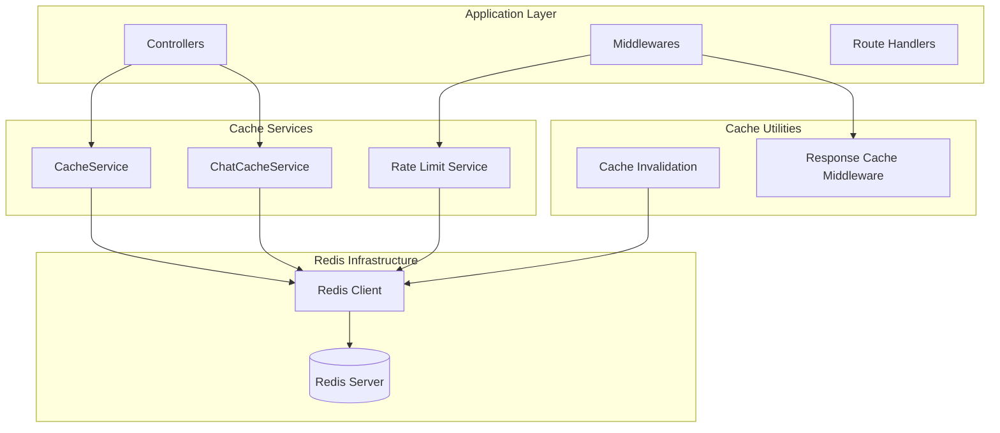
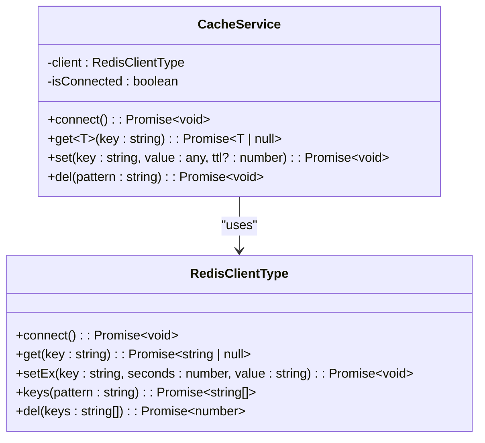
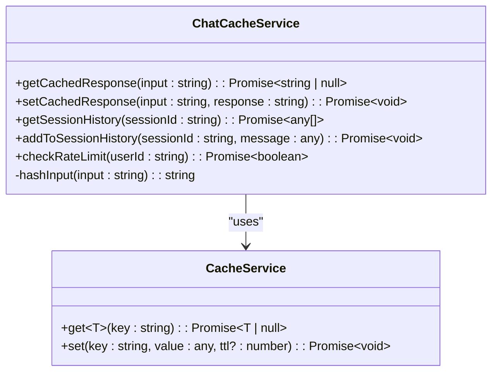
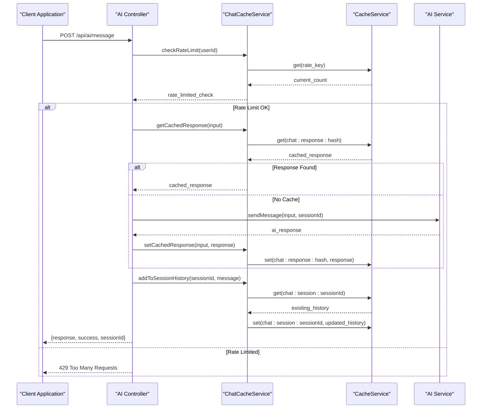
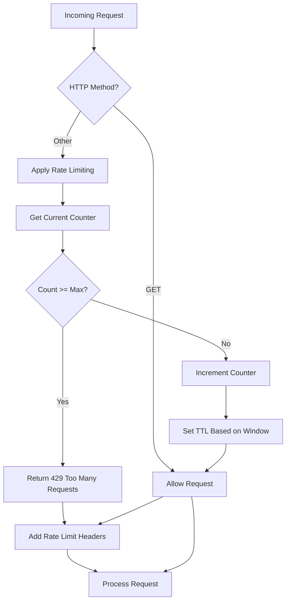
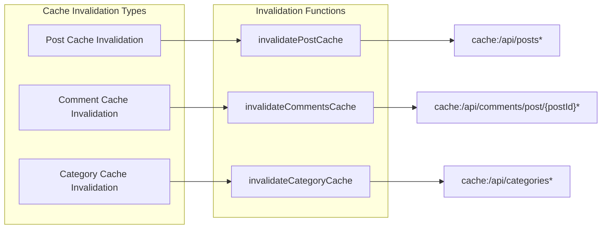
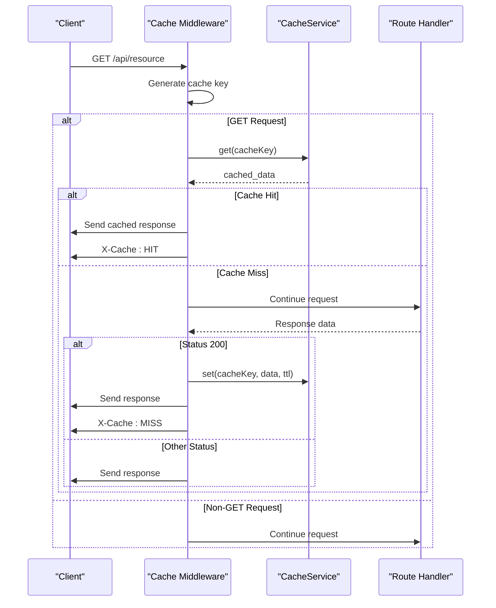

# Caching Layer Architecture Documentation

<cite>
**Referenced Files in This Document**
- [cache.service.ts](file://api-fastify/src/services/cache.service.ts)
- [chat-cache.service.ts](file://api-fastify/src/services/chat-cache.service.ts)
- [cache.middleware.ts](file://api-fastify/src/middlewares/cache.middleware.ts)
- [rate-limit.middleware.ts](file://api-fastify/src/middlewares/rate-limit.middleware.ts)
- [cache-invalidation.ts](file://api-fastify/src/utils/cache-invalidation.ts)
- [ai.controller.ts](file://api-fastify/src/controllers/ai.controller.ts)
- [ai.service.ts](file://api-fastify/src/services/ai.service.ts)
- [conversation.types.ts](file://api-fastify/src/types/conversation.types.ts)
- [ai.routes.ts](file://api-fastify/src/routes/ai.routes.ts)
- [index.ts](file://api-fastify/src/index.ts)
</cite>

## Table of Contents
1. [Introduction](#introduction)
2. [Architecture Overview](#architecture-overview)
3. [Core Cache Services](#core-cache-services)
4. [AI Conversation Caching](#ai-conversation-caching)
5. [Rate Limiting Implementation](#rate-limiting-implementation)
6. [Cache Invalidation Strategies](#cache-invalidation-strategies)
7. [Response Caching Middleware](#response-caching-middleware)
8. [Configuration and Environment Setup](#configuration-and-environment-setup)
9. [Performance Monitoring](#performance-monitoring)
10. [Security Considerations](#security-considerations)
11. [Best Practices](#best-practices)
12. [Troubleshooting Guide](#troubleshooting-guide)

## Introduction

The MERN_chatai_blog application implements a sophisticated Redis-based caching architecture designed to enhance performance, reduce latency, and improve scalability. The caching layer consists of multiple specialized services that handle different aspects of data caching, from simple key-value storage to complex AI conversation management and rate limiting.

The architecture follows a layered approach with graceful degradation capabilities, ensuring that the application remains functional even when Redis connectivity is temporarily unavailable. This documentation provides comprehensive coverage of the cache implementation, usage patterns, and operational considerations.

## Architecture Overview

The caching architecture is built around several key components that work together to provide efficient data caching and retrieval:



**Diagram sources**
- [cache.service.ts](file://api-fastify/src/services/cache.service.ts#L1-L57)
- [chat-cache.service.ts](file://api-fastify/src/services/chat-cache.service.ts#L1-L47)
- [cache.middleware.ts](file://api-fastify/src/middlewares/cache.middleware.ts#L1-L24)

The architecture implements a hierarchical caching strategy where:
- **Primary Cache**: Handles general-purpose caching needs
- **AI-Specific Cache**: Manages conversation history and response caching
- **Rate Limiting Cache**: Provides distributed rate limiting
- **Response Cache**: Implements HTTP response caching middleware

**Section sources**
- [cache.service.ts](file://api-fastify/src/services/cache.service.ts#L1-L57)
- [chat-cache.service.ts](file://api-fastify/src/services/chat-cache.service.ts#L1-L47)

## Core Cache Services

### CacheService Implementation

The `CacheService` class serves as the foundation of the caching architecture, providing essential Redis connectivity and basic caching operations with graceful degradation capabilities.



**Diagram sources**
- [cache.service.ts](file://api-fastify/src/services/cache.service.ts#L3-L57)

#### Key Features:

1. **Connection Management**: Automatic Redis connection handling with fallback to disabled caching mode
2. **Graceful Degradation**: Continues operation even when Redis is unavailable
3. **Generic Type Support**: TypeScript-enabled caching with proper type safety
4. **JSON Serialization**: Automatic serialization/deserialization of cached data
5. **Pattern-Based Deletion**: Supports wildcard pattern matching for cache invalidation

#### Connection Handling:

The service implements robust connection management with automatic fallback:

```typescript
async connect() {
  if (this.isConnected) return;

  try {
    this.client = createClient({
      url: process.env.REDIS_URL || 'redis://localhost:6379'
    });

    await this.client.connect();
    this.isConnected = true;
    console.log('Redis connecté');
  } catch (error) {
    console.warn('Redis non disponible, cache désactivé');
  }
}
```

#### Cache Operations:

The service provides four primary operations:

- **Get**: Retrieves cached data with automatic JSON parsing
- **Set**: Stores data with configurable TTL and automatic JSON serialization
- **Delete**: Removes cache entries using pattern matching
- **Connect**: Establishes Redis connection with error handling

**Section sources**
- [cache.service.ts](file://api-fastify/src/services/cache.service.ts#L1-L57)

### ChatCacheService Implementation

The `ChatCacheService` extends the core caching functionality specifically for AI conversation management, providing specialized caching patterns for chat applications.



**Diagram sources**
- [chat-cache.service.ts](file://api-fastify/src/services/chat-cache.service.ts#L3-L47)

#### Specialized Caching Patterns:

1. **Response Caching**: Prevents redundant AI API calls for identical inputs
2. **Session History**: Maintains conversation context with automatic trimming
3. **Rate Limiting**: Implements per-user rate limiting with Redis counters
4. **Hash-Based Keys**: Uses Base64 hashing for input normalization

#### Key Methods:

**Response Caching**:
```typescript
async getCachedResponse(input: string): Promise<string | null> {
  const key = `chat:response:${this.hashInput(input)}`;
  return await cache.get(key);
}
```

**Session Management**:
```typescript
async addToSessionHistory(sessionId: string, message: any): Promise<void> {
  const key = `chat:session:${sessionId}`;
  const history = await this.getSessionHistory(sessionId);
  history.push(message);
  
  // Keep only last 20 messages
  const trimmed = history.slice(-20);
  await cache.set(key, trimmed, 7200); // 2 hours
}
```

**Rate Limiting**:
```typescript
async checkRateLimit(userId: string): Promise<boolean> {
  const key = `chat:rate:${userId}`;
  const count = await cache.get<number>(key) || 0;
  
  if (count >= 10) return false; // Max 10 messages/minute
  
  await cache.set(key, count + 1, 60); // 1 minute
  return true;
}
```

**Section sources**
- [chat-cache.service.ts](file://api-fastify/src/services/chat-cache.service.ts#L1-L47)

## AI Conversation Caching

### Conversation Flow Architecture

The AI conversation caching system implements a sophisticated multi-layered approach to optimize AI interactions and maintain conversation context.



**Diagram sources**
- [ai.controller.ts](file://api-fastify/src/controllers/ai.controller.ts#L20-L69)
- [chat-cache.service.ts](file://api-fastify/src/services/chat-cache.service.ts#L6-L47)

### Cache Key Naming Conventions

The system uses structured key naming patterns for organized cache management:

1. **Response Cache**: `chat:response:{hash}`
2. **Session History**: `chat:session:{sessionId}`
3. **Rate Limiting**: `chat:rate:{userId}`

### TTL Strategies

Different cache types employ varying TTL strategies:

- **Response Cache**: 1 hour (3600 seconds)
- **Session History**: 2 hours (7200 seconds)
- **Rate Limit Counters**: 1 minute (60 seconds)

### Session History Management

The session history system maintains conversation context while preventing memory bloat:

```typescript
// Automatic trimming to last 20 messages
const trimmed = history.slice(-20);
await cache.set(key, trimmed, 7200);
```

**Section sources**
- [ai.controller.ts](file://api-fastify/src/controllers/ai.controller.ts#L1-L69)
- [chat-cache.service.ts](file://api-fastify/src/services/chat-cache.service.ts#L1-L47)

## Rate Limiting Implementation

### Distributed Rate Limiting Architecture

The rate limiting system provides distributed rate limiting capabilities using Redis counters, enabling consistent enforcement across multiple application instances.



**Diagram sources**
- [rate-limit.middleware.ts](file://api-fastify/src/middlewares/rate-limit.middleware.ts#L20-L62)

### Rate Limiting Configuration

The rate limiting middleware supports flexible configuration:

```typescript
interface RateLimitOptions {
  windowMs: number;           // Time window in milliseconds
  maxRequests: number;        // Maximum requests per window
  keyGenerator?: (request: FastifyRequest) => string;
  skipSuccessfulRequests?: boolean;
  skipFailedRequests?: boolean;
}
```

### Rate Limiting Headers

The middleware automatically adds standardized rate limiting headers:

- `X-RateLimit-Limit`: Maximum requests allowed
- `X-RateLimit-Remaining`: Remaining requests in current window
- `X-RateLimit-Reset`: Unix timestamp when limit resets
- `Retry-After`: Seconds until reset (for 429 responses)

### Graceful Error Handling

The rate limiting system implements graceful error handling:

```typescript
try {
  // Rate limiting logic
} catch (error) {
  // In case of Redis error, allow request to pass
  request.log.error('Erreur dans le rate limiting:', error);
}
```

**Section sources**
- [rate-limit.middleware.ts](file://api-fastify/src/middlewares/rate-limit.middleware.ts#L1-L62)

## Cache Invalidation Strategies

### Pattern-Based Invalidation

The cache invalidation system uses pattern-based deletion to efficiently manage cache updates across related resources.



**Diagram sources**
- [cache-invalidation.ts](file://api-fastify/src/utils/cache-invalidation.ts#L1-L17)

### Invalidation Functions

The system provides specialized invalidation functions for different resource types:

**Post Cache Invalidation**:
```typescript
export const invalidatePostCache = async (postId?: string) => {
  await cache.del('cache:/api/posts*');
  if (postId) {
    await cache.del(`cache:/api/posts/${postId}*`);
  }
};
```

**Comment Cache Invalidation**:
```typescript
export const invalidateCommentsCache = async (postId: string) => {
  if (!postId) return;
  await cache.del(`cache:/api/comments/post/${postId}*`);
};
```

**Category Cache Invalidation**:
```typescript
export const invalidateCategoryCache = async () => {
  await cache.del('cache:/api/categories*');
  await cache.del('cache:/api/posts*'); // Posts can be filtered by category
};
```

### Cache Warming Strategies

While not explicitly implemented in the current codebase, the architecture supports cache warming through:

1. **Pre-population**: Manual cache population during application startup
2. **Background Updates**: Scheduled cache refresh for frequently accessed data
3. **Lazy Loading**: On-demand cache population for infrequently accessed data

**Section sources**
- [cache-invalidation.ts](file://api-fastify/src/utils/cache-invalidation.ts#L1-L17)

## Response Caching Middleware

### HTTP Response Caching Implementation

The response caching middleware provides transparent HTTP response caching for GET requests, significantly reducing backend load and improving response times.



**Diagram sources**
- [cache.middleware.ts](file://api-fastify/src/middlewares/cache.middleware.ts#L3-L24)

### Cache Headers

The middleware automatically adds cache-related headers:

- `X-Cache`: Indicates cache status (HIT or MISS)
- Standard HTTP cache headers for browser-side caching

### Usage Examples

**Basic Usage**:
```typescript
import { cacheMiddleware } from '../middlewares/cache.middleware.js';

// Apply default 5-minute cache
app.get('/api/data', cacheMiddleware(), getData);
```

**Custom TTL**:
```typescript
// Apply 1-hour cache
app.get('/api/long-lived-data', cacheMiddleware(3600), getLongLivedData);
```

### Performance Benefits

The response caching middleware provides significant performance improvements:

1. **Reduced Database Queries**: Eliminates repeated database access for static data
2. **Lower API Load**: Reduces strain on backend services
3. **Improved Latency**: Faster response times for cached content
4. **Bandwidth Savings**: Reduced network traffic for repeated requests

**Section sources**
- [cache.middleware.ts](file://api-fastify/src/middlewares/cache.middleware.ts#L1-L24)

## Configuration and Environment Setup

### Environment Variables

The caching system relies on a single critical environment variable:

```typescript
url: process.env.REDIS_URL || 'redis://localhost:6379'
```

### Environment Variable Configuration

**Required Variables**:
- `REDIS_URL`: Redis connection URL (default: redis://localhost:6379)

**Optional Variables**:
- `PORT`: Application port (default: 4200)
- `MONGODB_URI`: MongoDB connection string

### Configuration Best Practices

1. **Production Configuration**:
   ```bash
   REDIS_URL=redis://production-redis:6379
   ```

2. **Development Configuration**:
   ```bash
   REDIS_URL=redis://localhost:6379
   ```

3. **Testing Configuration**:
   ```bash
   REDIS_URL=redis://localhost:6379
   ```

### Connection Security

The Redis client supports various connection security options:

- **SSL/TLS**: Enable encrypted connections
- **Authentication**: Configure Redis authentication
- **Network Security**: Restrict access to specific networks

**Section sources**
- [cache.service.ts](file://api-fastify/src/services/cache.service.ts#L11-L11)
- [index.ts](file://api-fastify/src/index.ts#L5-L7)

## Performance Monitoring

### Cache Hit/Miss Tracking

The caching system provides built-in monitoring capabilities through cache headers:

- **Cache Hits**: Responses served from cache
- **Cache Misses**: Responses requiring backend processing
- **Cache Status**: Real-time cache utilization metrics

### Performance Metrics

Key performance indicators to monitor:

1. **Cache Hit Ratio**: Percentage of requests served from cache
2. **Average Response Time**: Time savings from cache hits
3. **Redis Memory Usage**: Resource consumption monitoring
4. **Cache Eviction Rate**: Frequency of cache item removal

### Monitoring Implementation

```typescript
// Cache hit detection in middleware
if (cachedData) {
  reply.header('X-Cache', 'HIT');
  return reply.send(cachedData);
}

// Cache miss indication
reply.header('X-Cache', 'MISS');
```

### Performance Optimization Strategies

1. **TTL Tuning**: Optimize cache expiration times based on data volatility
2. **Memory Management**: Monitor Redis memory usage and implement eviction policies
3. **Connection Pooling**: Efficient Redis connection management
4. **Cache Warming**: Pre-populate caches for frequently accessed data

## Security Considerations

### Data Protection

The caching system implements several security measures:

1. **Sensitive Data Filtering**: Exclude sensitive information from cache
2. **Cache Isolation**: Separate cache namespaces for different user roles
3. **Data Encryption**: Encrypt sensitive cached data
4. **Access Control**: Implement proper authentication for cache operations

### Cache Poisoning Prevention

The system includes safeguards against cache poisoning attacks:

1. **Input Validation**: Validate all cache keys and values
2. **Rate Limiting**: Prevent abuse through rate limiting
3. **Cache Sanitization**: Clean cache data before storage
4. **Monitoring**: Detect unusual cache access patterns

### Security Headers

The middleware automatically adds security-related headers:

```typescript
reply.header('X-Cache', 'HIT'); // Indicates cache status
```

### Access Control

Implement access control for cache operations:

1. **User-Specific Caching**: Separate caches for different user permissions
2. **Role-Based Access**: Different cache access patterns based on user roles
3. **Session Isolation**: Isolate cache data by user sessions

## Best Practices

### Cache Design Principles

1. **Layered Caching**: Implement multiple cache layers for optimal performance
2. **Graceful Degradation**: Ensure application functionality without cache
3. **Consistency**: Maintain data consistency across cache layers
4. **Monitoring**: Implement comprehensive cache monitoring and alerting

### Implementation Guidelines

1. **TTL Strategy**: Choose appropriate TTL based on data volatility
2. **Key Naming**: Use consistent, descriptive cache key patterns
3. **Error Handling**: Implement robust error handling for cache operations
4. **Resource Management**: Properly manage Redis connections and memory

### Operational Excellence

1. **Cache Warming**: Implement cache warming strategies for critical data
2. **Monitoring**: Set up comprehensive cache monitoring and alerting
3. **Maintenance**: Regular cache maintenance and cleanup procedures
4. **Scaling**: Plan for cache scaling as application grows

### Code Quality Standards

1. **Type Safety**: Use TypeScript for cache operations
2. **Error Handling**: Implement comprehensive error handling
3. **Documentation**: Maintain clear documentation for cache operations
4. **Testing**: Implement thorough testing for cache functionality

## Troubleshooting Guide

### Common Issues and Solutions

#### Redis Connection Problems

**Symptoms**: Cache operations fail, application logs show Redis errors

**Solutions**:
1. Verify Redis server is running
2. Check network connectivity
3. Validate Redis URL configuration
4. Review firewall settings

#### Cache Performance Issues

**Symptoms**: Slow cache operations, high cache miss rates

**Solutions**:
1. Optimize TTL values
2. Review cache key patterns
3. Implement cache warming
4. Monitor Redis memory usage

#### Memory Management Issues

**Symptoms**: High memory usage, cache eviction problems

**Solutions**:
1. Implement proper TTL strategies
2. Review cache key patterns
3. Monitor cache growth
4. Implement cache cleanup procedures

### Debugging Techniques

1. **Enable Debug Logging**: Turn on detailed logging for cache operations
2. **Monitor Cache Metrics**: Track cache hit/miss ratios
3. **Redis Monitoring**: Use Redis monitoring tools
4. **Application Logs**: Review application logs for cache-related errors

### Recovery Procedures

1. **Cache Clearing**: Implement safe cache clearing procedures
2. **Graceful Degradation**: Ensure application continues without cache
3. **Backup Restoration**: Restore cache from backups when needed
4. **Failover Procedures**: Implement cache failover strategies

### Diagnostic Commands

```bash
# Check Redis connectivity
redis-cli ping

# Monitor Redis memory usage
redis-cli info memory

# List cache keys
redis-cli keys "cache:*"

# Get cache statistics
redis-cli info stats
```

**Section sources**
- [cache.service.ts](file://api-fastify/src/services/cache.service.ts#L12-L18)
- [rate-limit.middleware.ts](file://api-fastify/src/middlewares/rate-limit.middleware.ts#L50-L52)