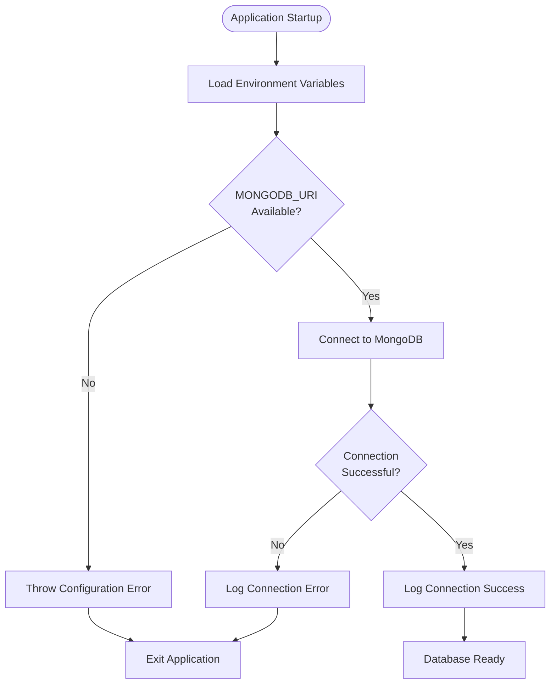
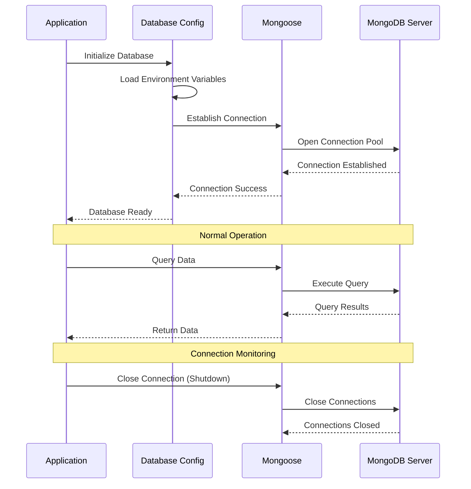
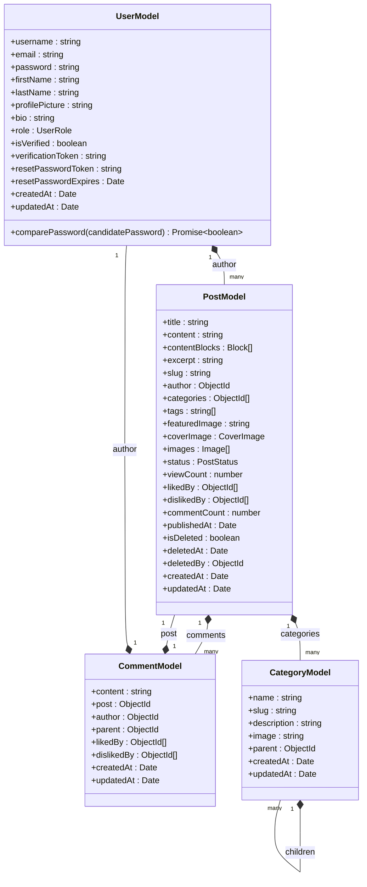
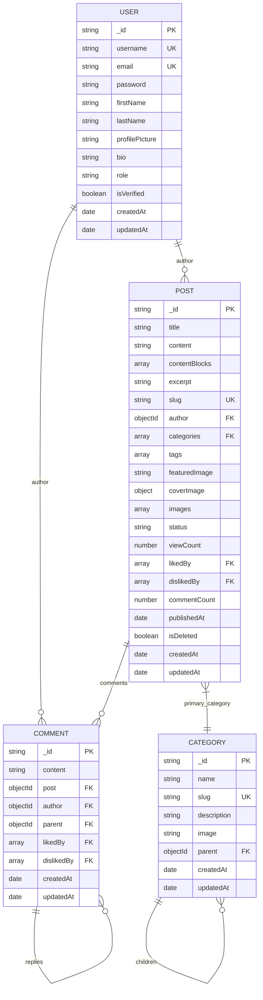
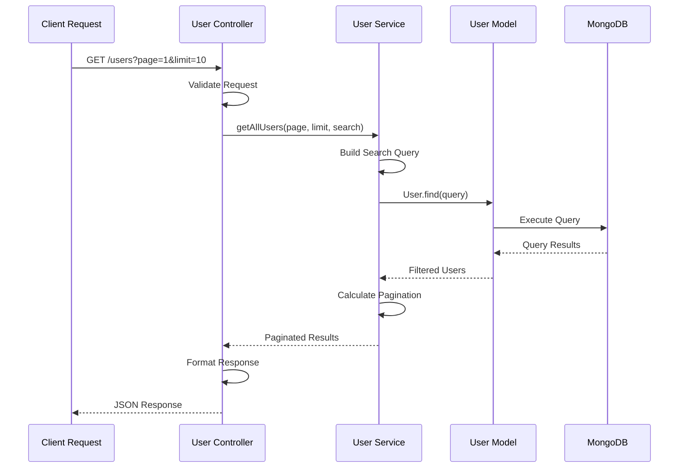
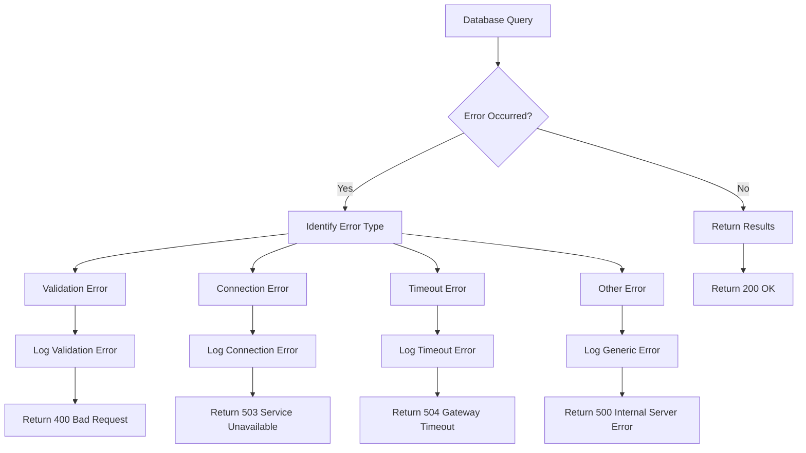
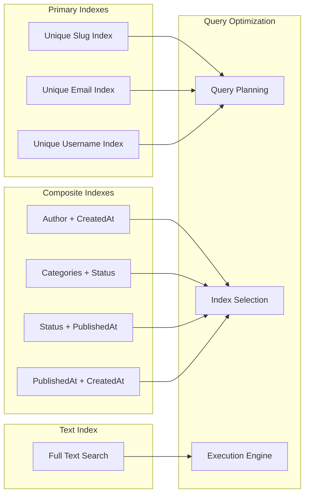
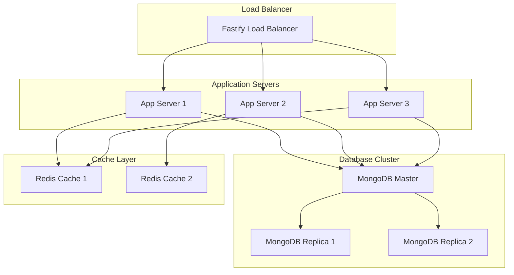
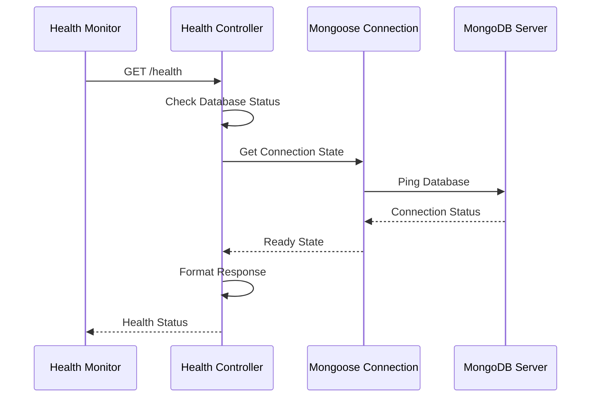

# Database Integration Architecture Documentation

<cite>
**Referenced Files in This Document**
- [database.ts](file://api-fastify/src/config/database.ts)
- [index.ts](file://api-fastify/src/models/index.ts)
- [user.model.ts](file://api-fastify/src/models/user.model.ts)
- [post.model.ts](file://api-fastify/src/models/post.model.ts)
- [comment.model.ts](file://api-fastify/src/models/comment.model.ts)
- [category.model.ts](file://api-fastify/src/models/category.model.ts)
- [user.controller.ts](file://api-fastify/src/controllers/user.controller.ts)
- [user.service.ts](file://api-fastify/src/services/user.service.ts)
- [user.types.ts](file://api-fastify/src/types/user.types.ts)
- [post.types.ts](file://api-fastify/src/types/post.types.ts)
- [comment.types.ts](file://api-fastify/src/types/comment.types.ts)
- [user.routes.ts](file://api-fastify/src/routes/user.routes.ts)
- [user.schema.ts](file://api-fastify/src/schemas/user.schema.ts)
- [server.ts](file://api-fastify/src/server.ts)
- [health.controller.ts](file://api-fastify/src/controllers/health.controller.ts)
</cite>

## Table of Contents
1. [Introduction](#introduction)
2. [Database Configuration](#database-configuration)
3. [Connection Management](#connection-management)
4. [Mongoose ODM Layer](#mongoose-odm-layer)
5. [Model Architecture](#model-architecture)
6. [Schema Definitions](#schema-definitions)
7. [Model Relationships](#model-relationships)
8. [Integration with Fastify Controllers](#integration-with-fastify-controllers)
9. [Error Handling](#error-handling)
10. [Performance Optimization](#performance-optimization)
11. [Security Practices](#security-practices)
12. [Scalability Considerations](#scalability-considerations)
13. [Monitoring and Health Checks](#monitoring-and-health-checks)
14. [Best Practices](#best-practices)

## Introduction

The MERN_chatai_blog project implements a robust MongoDB database integration using Mongoose as the Object Data Modeling (ODM) layer. This architecture provides a comprehensive solution for managing blog-related data including users, posts, comments, categories, and notifications. The integration follows modern best practices for database connectivity, performance optimization, and security.

The database layer is designed to handle high-load scenarios while maintaining data integrity and providing efficient access patterns for the Fastify-based backend API. The architecture emphasizes scalability, maintainability, and operational reliability through structured model definitions, comprehensive indexing strategies, and robust error handling mechanisms.

## Database Configuration

The database configuration is centralized in a dedicated module that handles connection initialization, environment variable management, and error handling.



**Diagram sources**
- [database.ts](file://api-fastify/src/config/database.ts#L1-L22)

The configuration module provides a clean abstraction for database connectivity:

```typescript
export const connectDB = async (): Promise<void> => {
  try {
    const MONGO_URI = process.env.MONGODB_URI || 'mongodb://localhost:27017/mern_blog';
    
    if (!MONGO_URI) {
      throw new Error('URI MongoDB non définie dans les variables d\'environnement');
    }
    
    await mongoose.connect(MONGO_URI);
    
    console.log('MongoDB connected successfully');
  } catch (error) {
    console.error('MongoDB connection error:', error instanceof Error ? error.message : error);
    process.exit(1);
  }
};
```

**Section sources**
- [database.ts](file://api-fastify/src/config/database.ts#L1-L22)

## Connection Management

The connection management strategy focuses on reliability and graceful error handling. The application uses a single connection pool managed by Mongoose, which provides built-in connection pooling capabilities.

### Connection Pooling Strategy

Mongoose automatically manages connection pools with the following characteristics:

- **Default Pool Size**: 5 connections per host
- **Connection Reuse**: Automatic reuse of established connections
- **Connection Monitoring**: Built-in health checks
- **Automatic Retry**: Graceful handling of transient failures

### Connection Lifecycle



**Diagram sources**
- [database.ts](file://api-fastify/src/config/database.ts#L6-L20)
- [server.ts](file://api-fastify/src/server.ts#L130-L132)

**Section sources**
- [database.ts](file://api-fastify/src/config/database.ts#L1-L22)
- [server.ts](file://api-fastify/src/server.ts#L130-L132)

## Mongoose ODM Layer

The Mongoose ODM layer provides a powerful abstraction over MongoDB operations, offering type safety, schema validation, middleware support, and query optimization.

### Core Features Implemented

1. **Type Safety**: Strong typing through TypeScript interfaces
2. **Schema Validation**: Runtime validation of data integrity
3. **Middleware Support**: Pre and post-operation hooks
4. **Query Building**: Fluent query interface
5. **Virtual Properties**: Computed properties and relationships
6. **Population**: Automatic document linking and expansion

### Model Registration Pattern

The application uses a centralized export pattern for easy model management:

```typescript
// Exporter tous les modèles pour faciliter l'importation
export * from './user.model.js';
export * from './post.model.js';
export * from './comment.model.js';
export * from './category.model.js';
export * from './content.model.js';
export * from './notification.model.js';
```

**Section sources**
- [index.ts](file://api-fastify/src/models/index.ts#L1-L8)

## Model Architecture

The model architecture follows a modular design with clear separation of concerns and consistent patterns across all entity types.



**Diagram sources**
- [user.model.ts](file://api-fastify/src/models/user.model.ts#L6-L96)
- [post.model.ts](file://api-fastify/src/models/post.model.ts#L5-L135)
- [comment.model.ts](file://api-fastify/src/models/comment.model.ts#L5-L77)
- [category.model.ts](file://api-fastify/src/models/category.model.ts#L5-L44)

## Schema Definitions

Each model implements comprehensive schema definitions with validation rules, indexes, and middleware for optimal performance and data integrity.

### User Model Schema

The User model implements sophisticated validation and security features:

```typescript
const userSchema = new Schema<IUser>({
  username: {
    type: String,
    required: true,
    unique: true,
    trim: true,
    minlength: 3,
    maxlength: 30,
  },
  email: {
    type: String,
    required: true,
    unique: true,
    trim: true,
    lowercase: true,
    match: [/^\S+@\S+\.\S+$/, 'Veuillez fournir une adresse email valide'],
  },
  password: {
    type: String,
    required: true,
    minlength: 6,
  },
  // ... other fields
}, {
  timestamps: true,
  toJSON: {
    transform: (_, ret) => {
      delete ret.password;
      delete ret.verificationToken;
      delete ret.resetPasswordToken;
      delete ret.resetPasswordExpires;
      return ret;
    },
  },
});
```

### Post Model Schema

The Post model demonstrates advanced schema features including block-based content and soft deletion:

```typescript
const postSchema = new Schema<IPost>({
  title: {
    type: String,
    required: true,
    trim: true,
    minlength: 3,
    maxlength: 200,
  },
  contentBlocks: [
    new Schema({
      type: { type: String, required: true },
      data: { type: Schema.Types.Mixed, required: true },
    }, { _id: false })
  ],
  // ... other fields
}, {
  timestamps: true,
});
```

### Comment Model Schema

The Comment model implements hierarchical structure support for threaded discussions:

```typescript
const commentSchema = new Schema<IComment>({
  content: {
    type: String,
    required: true,
    trim: true,
    minlength: 1,
    maxlength: 1000,
  },
  post: {
    type: Schema.Types.ObjectId,
    ref: 'Post',
    required: true,
  },
  author: {
    type: Schema.Types.ObjectId,
    ref: 'User',
    required: true,
  },
  parent: {
    type: Schema.Types.ObjectId,
    ref: 'Comment',
  },
  // ... other fields
}, {
  timestamps: true,
});
```

**Section sources**
- [user.model.ts](file://api-fastify/src/models/user.model.ts#L6-L40)
- [post.model.ts](file://api-fastify/src/models/post.model.ts#L5-L60)
- [comment.model.ts](file://api-fastify/src/models/comment.model.ts#L5-L30)

## Model Relationships

The application implements sophisticated relationship patterns that enable complex queries and data operations.

### Reference-Based Relationships

All models use MongoDB's reference pattern for establishing relationships:



**Diagram sources**
- [user.model.ts](file://api-fastify/src/models/user.model.ts#L35-L40)
- [post.model.ts](file://api-fastify/src/models/post.model.ts#L40-L50)
- [comment.model.ts](file://api-fastify/src/models/comment.model.ts#L15-L25)
- [category.model.ts](file://api-fastify/src/models/category.model.ts#L15-L25)

### Relationship Implementation Patterns

1. **One-to-Many Relationships**: Using arrays of ObjectIds
2. **Self-Referencing**: Hierarchical categories and threaded comments
3. **Soft References**: Using string references for flexibility
4. **Populate Operations**: Lazy loading of related documents

**Section sources**
- [post.model.ts](file://api-fastify/src/models/post.model.ts#L40-L50)
- [comment.model.ts](file://api-fastify/src/models/comment.model.ts#L15-L25)
- [category.model.ts](file://api-fastify/src/models/category.model.ts#L30-L35)

## Integration with Fastify Controllers

The database integration seamlessly connects with Fastify controllers through service layers that encapsulate business logic and data access patterns.

### Controller-Service Pattern



**Diagram sources**
- [user.controller.ts](file://api-fastify/src/controllers/user.controller.ts#L10-L25)
- [user.service.ts](file://api-fastify/src/services/user.service.ts#L8-L35)

### Service Layer Implementation

The service layer provides comprehensive data access with validation, error handling, and business logic:

```typescript
export const getAllUsers = async (page: number = 1, limit: number = 10, search: string = '') => {
  const skip = (page - 1) * limit;
  
  const searchQuery = search
    ? {
        $or: [
          { username: { $regex: search, $options: 'i' } },
          { email: { $regex: search, $options: 'i' } },
          { firstName: { $regex: search, $options: 'i' } },
          { lastName: { $regex: search, $options: 'i' } },
        ],
      }
    : {};
  
  const users = await User.find(searchQuery)
    .select('-password -verificationToken -resetPasswordToken -resetPasswordExpires')
    .sort({ createdAt: -1 })
    .skip(skip)
    .limit(limit);
    
  const total = await User.countDocuments(searchQuery);
  const totalPages = Math.ceil(total / limit);
  
  return { users, total, page, limit, totalPages };
};
```

### Error Handling Strategy

Controllers implement comprehensive error handling with appropriate HTTP status codes:

```typescript
try {
  const result = await UserService.getAllUsers(page, limit, search);
  return reply.status(200).send(result);
} catch (error) {
  request.log.error(error);
  return reply.status(500).send({
    message: 'Une erreur est survenue lors de la récupération des utilisateurs',
  });
}
```

**Section sources**
- [user.service.ts](file://api-fastify/src/services/user.service.ts#L8-L35)
- [user.controller.ts](file://api-fastify/src/controllers/user.controller.ts#L10-L25)

## Error Handling

The application implements a multi-layered error handling strategy that ensures robustness and provides meaningful feedback to clients.

### Database-Level Error Handling



### Error Classification and Response

The system categorizes errors into specific types with appropriate responses:

1. **Validation Errors**: Return 400 Bad Request with error details
2. **Authentication Errors**: Return 401 Unauthorized
3. **Authorization Errors**: Return 403 Forbidden
4. **Resource Not Found**: Return 404 Not Found
5. **Database Connection Errors**: Return 503 Service Unavailable
6. **Internal Server Errors**: Return 500 Internal Server Error

**Section sources**
- [user.controller.ts](file://api-fastify/src/controllers/user.controller.ts#L20-L35)
- [user.service.ts](file://api-fastify/src/services/user.service.ts#L20-L30)

## Performance Optimization

The database implementation incorporates several performance optimization strategies to ensure efficient operation under load.

### Indexing Strategy



**Diagram sources**
- [post.model.ts](file://api-fastify/src/models/post.model.ts#L65-L75)
- [comment.model.ts](file://api-fastify/src/models/comment.model.ts#L25-L30)
- [category.model.ts](file://api-fastify/src/models/category.model.ts#L25-L27)

### Index Implementation Details

The Post model implements comprehensive indexing for optimal query performance:

```typescript
// Index pour améliorer les performances des recherches
postSchema.index({ title: 'text', content: 'text' });
// Note: slug index is automatically created by unique: true
postSchema.index({ author: 1 });
postSchema.index({ categories: 1 });
postSchema.index({ status: 1, createdAt: -1 });
postSchema.index({ status: 1, publishedAt: -1 });
postSchema.index({ publishedAt: -1, createdAt: -1 });
```

### Query Optimization Techniques

1. **Selective Field Projection**: Using `.select()` to limit returned fields
2. **Pagination**: Implementing skip/limit for large result sets
3. **Index Utilization**: Strategic placement of indexes for common queries
4. **Query Planning**: Leveraging MongoDB's query optimizer

**Section sources**
- [post.model.ts](file://api-fastify/src/models/post.model.ts#L65-L75)
- [user.service.ts](file://api-fastify/src/services/user.service.ts#L25-L35)

## Security Practices

The database integration implements comprehensive security measures to protect sensitive data and prevent unauthorized access.

### Data Protection Strategies

1. **Password Hashing**: Using bcrypt for secure password storage
2. **Sensitive Data Filtering**: Automatic removal of sensitive fields in responses
3. **Environment Variable Management**: Secure credential storage
4. **Access Control**: Role-based permissions for data operations

### Password Security Implementation

```typescript
// Middleware pré-sauvegarde pour hacher le mot de passe
userSchema.pre('save', async function (next) {
  if (!this.isModified('password')) return next();
  
  try {
    const salt = await bcrypt.genSalt(10);
    this.password = await bcrypt.hash(this.password as string, salt);
    next();
  } catch (error: any) {
    next(error);
  }
});
```

### Sensitive Data Protection

The application implements automatic filtering of sensitive data in JSON responses:

```typescript
toJSON: {
  transform: (_, ret) => {
    delete ret.password;
    delete ret.verificationToken;
    delete ret.resetPasswordToken;
    delete ret.resetPasswordExpires;
    return ret;
  },
}
```

### Environment Variable Security

```typescript
const MONGO_URI = process.env.MONGODB_URI || 'mongodb://localhost:27017/mern_blog';
```

**Section sources**
- [user.model.ts](file://api-fastify/src/models/user.model.ts#L45-L60)
- [user.model.ts](file://api-fastify/src/models/user.model.ts#L35-L40)
- [database.ts](file://api-fastify/src/config/database.ts#L6-L8)

## Scalability Considerations

The database architecture is designed to handle high-load scenarios through various optimization and scaling strategies.

### Horizontal Scaling Approaches

1. **Sharding Strategy**: Distributing data across multiple MongoDB instances
2. **Read Replicas**: Implementing replica sets for read scalability
3. **Caching Integration**: Using Redis for frequently accessed data
4. **Connection Pooling**: Efficient resource utilization

### Load Balancing and Distribution



### Performance Monitoring

The application implements comprehensive monitoring for database performance:

```typescript
export const checkHealth = async (_request: FastifyRequest, reply: FastifyReply) => {
  try {
    const dbStatus = mongoose.connection.readyState === 1 ? 'connected' : 'disconnected';
    
    return reply.status(200).send({
      status: 'ok',
      database: {
        status: dbStatus,
      },
    });
  } catch (error) {
    return reply.status(500).send({
      status: 'error',
      message: 'Une erreur est survenue lors de la vérification de la santé de l\'API',
    });
  }
};
```

**Section sources**
- [health.controller.ts](file://api-fastify/src/controllers/health.controller.ts#L8-L30)

## Monitoring and Health Checks

The application provides comprehensive monitoring capabilities for database health and performance.

### Health Check Implementation



**Diagram sources**
- [health.controller.ts](file://api-fastify/src/controllers/health.controller.ts#L8-L30)

### Monitoring Metrics

The health check endpoint provides essential metrics:

1. **Database Connectivity**: Connection state verification
2. **Response Time**: Query execution timing
3. **Error Rates**: Failure rate monitoring
4. **Resource Utilization**: Memory and CPU usage

**Section sources**
- [health.controller.ts](file://api-fastify/src/controllers/health.controller.ts#L8-L30)

## Best Practices

The database integration follows industry best practices for maintainability, performance, and reliability.

### Code Organization Principles

1. **Separation of Concerns**: Clear boundaries between models, services, and controllers
2. **Consistent Naming Conventions**: Standardized naming patterns across all components
3. **Type Safety**: Comprehensive TypeScript integration
4. **Documentation**: Inline documentation and schema definitions

### Development Guidelines

1. **Schema Design**: Implement comprehensive validation rules
2. **Index Strategy**: Create indexes for frequently queried fields
3. **Error Handling**: Implement consistent error handling patterns
4. **Performance Testing**: Regular performance benchmarking and optimization

### Operational Excellence

1. **Backup Strategy**: Regular database backups and recovery procedures
2. **Monitoring**: Continuous monitoring of database performance and health
3. **Capacity Planning**: Proactive capacity management and scaling
4. **Security Audits**: Regular security assessments and vulnerability scanning

The MERN_chatai_blog database integration provides a robust, scalable, and maintainable foundation for blog application data management. Through careful attention to performance optimization, security practices, and operational excellence, the architecture supports high-load scenarios while maintaining data integrity and system reliability.