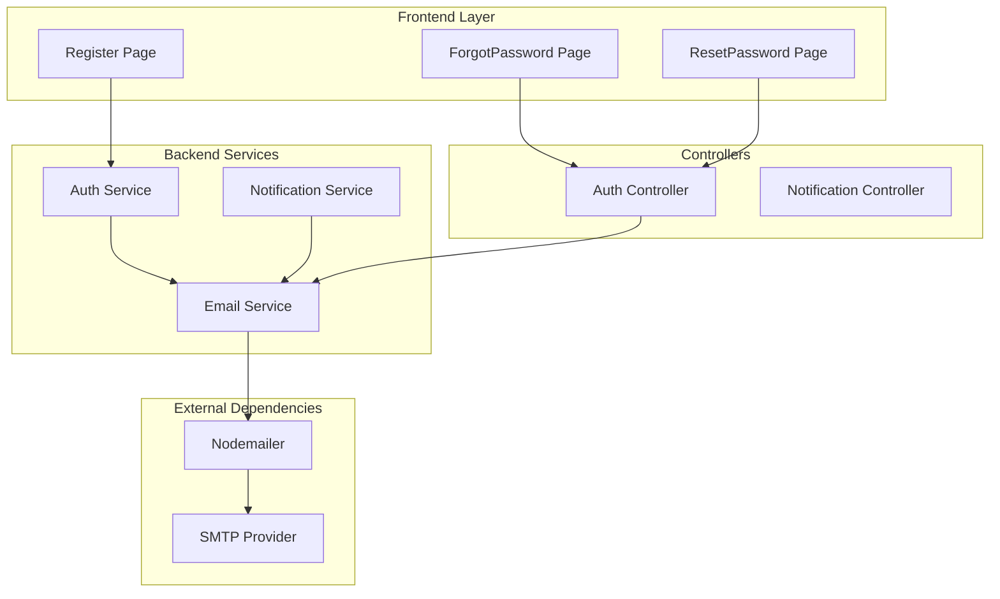
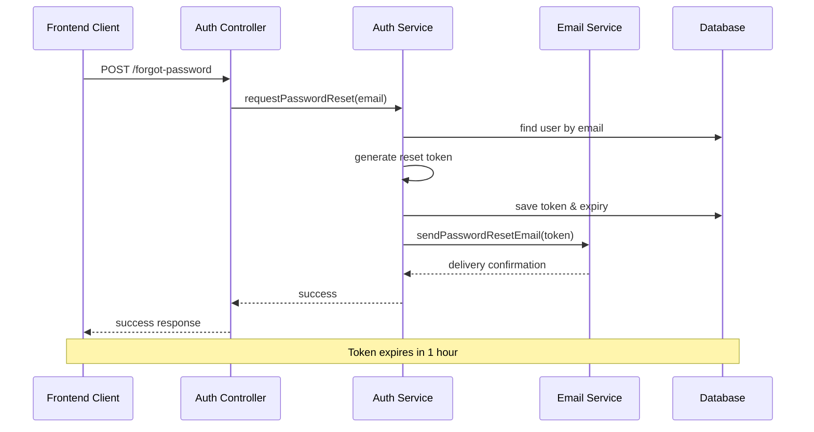
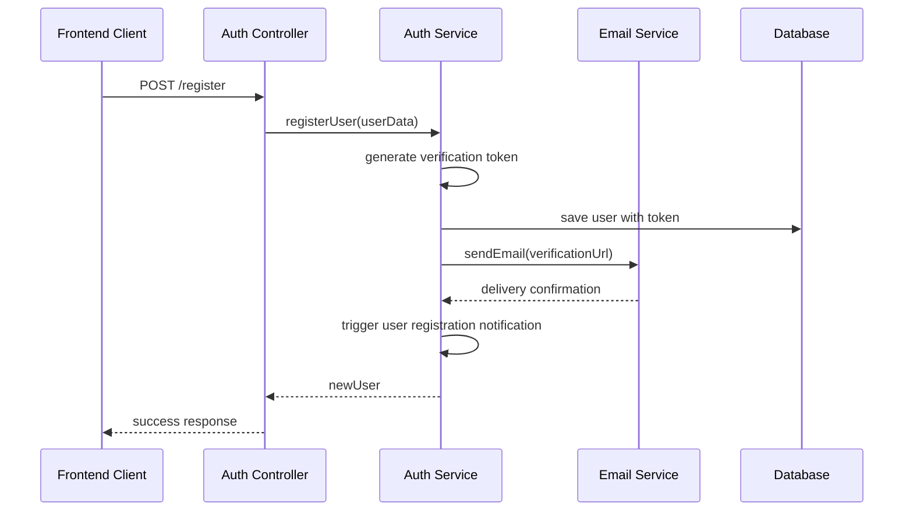

# Email Service Integration Documentation

<cite>
**Referenced Files in This Document**
- [email.service.ts](file://api-fastify/src/services/email.service.ts)
- [auth.service.ts](file://api-fastify/src/services/auth.service.ts)
- [auth.controller.ts](file://api-fastify/src/controllers/auth.controller.ts)
- [server.ts](file://api-fastify/src/server.ts)
- [user.model.ts](file://api-fastify/src/models/user.model.ts)
- [notification.service.ts](file://api-fastify/src/services/notification.service.ts)
- [notification-hooks.service.ts](file://api-fastify/src/services/notification-hooks.service.ts)
- [ForgotPassword.tsx](file://src/pages/ForgotPassword.tsx)
- [ResetPassword.tsx](file://src/pages/ResetPassword.tsx)
- [Register.tsx](file://src/pages/Register.tsx)
- [package.json](file://api-fastify/package.json)
</cite>

## Table of Contents
1. [Introduction](#introduction)
2. [Architecture Overview](#architecture-overview)
3. [Email Service Implementation](#email-service-implementation)
4. [SMTP Configuration](#smtp-configuration)
5. [Email Templates and Use Cases](#email-templates-and-use-cases)
6. [Integration with Authentication](#integration-with-authentication)
7. [Error Handling and Security](#error-handling-and-security)
8. [Scalability and Performance](#scalability-and-performance)
9. [Best Practices](#best-practices)
10. [Troubleshooting Guide](#troubleshooting-guide)

## Introduction

The MERN_chatai_blog platform implements a comprehensive email service integration using Nodemailer to handle various email communications including password reset emails, user registration confirmations, and system notifications. This service is designed to be robust, scalable, and secure, with proper error handling and delivery tracking capabilities.

The email service operates as a centralized component within the backend Fastify server, providing reliable email delivery for all user-facing communication needs while maintaining separation of concerns and clean architectural boundaries.

## Architecture Overview

The email service follows a modular architecture with clear separation between configuration, transport management, and email sending operations:



**Diagram sources**
- [email.service.ts](file://api-fastify/src/services/email.service.ts#L1-L59)
- [auth.service.ts](file://api-fastify/src/services/auth.service.ts#L1-L46)
- [server.ts](file://api-fastify/src/server.ts#L1-L32)

**Section sources**
- [email.service.ts](file://api-fastify/src/services/email.service.ts#L1-L59)
- [server.ts](file://api-fastify/src/server.ts#L1-L32)

## Email Service Implementation

The email service is implemented as a singleton module that manages SMTP transport configuration and provides standardized email sending capabilities:

### Core Service Functions

The email service exposes several key functions for different email scenarios:

```typescript
// Initialize email transport
export const initEmailTransporter = (): void => {
  // Transport configuration logic
};

// Generic email sending
export const sendEmail = async (
  to: string,
  subject: string,
  html: string
): Promise<boolean> => {
  // Email sending logic with error handling
};

// Specialized password reset email
export const sendPasswordResetEmail = async (
  to: string,
  token: string
): Promise<boolean> => {
  // Password reset email with token inclusion
};
```

### Transport Management

The service implements lazy initialization of the SMTP transport, checking for required environment variables before establishing connections:

```typescript
export const initEmailTransporter = (): void => {
  const host = process.env.EMAIL_HOST;
  const port = parseInt(process.env.EMAIL_PORT || '587', 10);
  const user = process.env.EMAIL_USER;
  const pass = process.env.EMAIL_PASS;
  const secure = process.env.EMAIL_SECURE === 'true';

  if (!host || !user || !pass) {
    console.warn('Configuration email incomplète, les emails ne seront pas envoyés');
    return;
  }

  transporter = nodemailer.createTransport({
    host,
    port,
    secure,
    auth: {
      user,
      pass,
    },
  });
};
```

**Section sources**
- [email.service.ts](file://api-fastify/src/services/email.service.ts#L8-L28)

## SMTP Configuration

The email service requires specific environment variables for SMTP configuration:

### Required Environment Variables

```bash
# SMTP Server Configuration
EMAIL_HOST=smtp.example.com
EMAIL_PORT=587
EMAIL_USER=username
EMAIL_PASS=password
EMAIL_SECURE=false

# Sender Information
EMAIL_FROM=noreply@example.com
APP_URL=http://localhost:3000
```

### Configuration Validation

The service implements runtime validation to ensure all required configuration parameters are present:

```typescript
if (!host || !user || !pass) {
  console.warn('Configuration email incomplète, les emails ne seront pas envoyés');
  return;
}
```

### Transport Security Settings

The service supports both secure and insecure SMTP connections based on the `EMAIL_SECURE` environment variable, allowing flexibility for different SMTP providers and deployment environments.

**Section sources**
- [email.service.ts](file://api-fastify/src/services/email.service.ts#L8-L28)
- [server.ts](file://api-fastify/src/server.ts#L130-L132)

## Email Templates and Use Cases

The email service handles three primary use cases with specialized templates:

### 1. Password Reset Emails

Password reset emails include a secure token-based link with expiration handling:

```html
<h1>Réinitialisation de votre mot de passe</h1>
<p>Vous avez demandé la réinitialisation de votre mot de passe.</p>
<p>Cliquez sur le lien ci-dessous pour réinitialiser votre mot de passe :</p>
<p><a href="${resetUrl}">Réinitialiser mon mot de passe</a></p>
<p>Ce lien est valable pendant 1 heure.</p>
<p>Si vous n'avez pas demandé la réinitialisation de votre mot de passe, ignorez cet email.</p>
```

### 2. User Registration Confirmations

Registration confirmation emails include verification links for account activation:

```html
<h1>Vérification de votre adresse email</h1>
<p>Merci de vous être inscrit sur notre plateforme.</p>
<p>Cliquez sur le lien ci-dessous pour vérifier votre adresse email :</p>
<p><a href="${verificationUrl}">Vérifier mon adresse email</a></p>
```

### 3. Notification Emails

System-generated notifications for administrative actions and system events.

**Section sources**
- [email.service.ts](file://api-fastify/src/services/email.service.ts#L54-L82)
- [auth.service.ts](file://api-fastify/src/services/auth.service.ts#L45-L88)

## Integration with Authentication

The email service integrates seamlessly with the authentication system through dedicated service and controller layers:

### Password Reset Flow



**Diagram sources**
- [auth.controller.ts](file://api-fastify/src/controllers/auth.controller.ts#L110-L138)
- [auth.service.ts](file://api-fastify/src/services/auth.service.ts#L138-L191)
- [email.service.ts](file://api-fastify/src/services/email.service.ts#L54-L82)

### Registration Flow



**Diagram sources**
- [auth.controller.ts](file://api-fastify/src/controllers/auth.controller.ts#L15-L42)
- [auth.service.ts](file://api-fastify/src/services/auth.service.ts#L15-L88)
- [notification-hooks.service.ts](file://api-fastify/src/services/notification-hooks.service.ts#L10-L25)

**Section sources**
- [auth.controller.ts](file://api-fastify/src/controllers/auth.controller.ts#L110-L138)
- [auth.service.ts](file://api-fastify/src/services/auth.service.ts#L138-L191)
- [email.service.ts](file://api-fastify/src/services/email.service.ts#L54-L82)

## Error Handling and Security

### Error Handling Strategies

The email service implements comprehensive error handling with graceful degradation:

```typescript
export const sendEmail = async (
  to: string,
  subject: string,
  html: string
): Promise<boolean> => {
  try {
    if (!transporter) {
      console.warn('Transporteur email non initialisé, email non envoyé');
      return false;
    }

    const from = process.env.EMAIL_FROM || 'noreply@example.com';

    await transporter.sendMail({
      from,
      to,
      subject,
      html,
    });

    return true;
  } catch (error) {
    console.error('Erreur lors de l\'envoi de l\'email:', error);
    return false;
  }
};
```

### Security Practices

1. **Token-Based Authentication**: Password reset tokens are securely generated and expire after 1 hour
2. **Environment Variable Protection**: SMTP credentials are stored in environment variables
3. **Input Sanitization**: Email addresses and URLs are validated before processing
4. **Secure Defaults**: HTTPS is enforced for production deployments

### Delivery Tracking

The service returns boolean success/failure indicators, enabling frontend feedback and retry mechanisms.

**Section sources**
- [email.service.ts](file://api-fastify/src/services/email.service.ts#L30-L59)

## Scalability and Performance

### Current Implementation

The email service currently uses a singleton transport approach, which is suitable for moderate traffic scenarios. For high-volume email sending, consider implementing:

1. **Queue-Based Processing**: Use message queues for bulk email operations
2. **Connection Pooling**: Implement connection pooling for SMTP servers
3. **Async Processing**: Separate email sending from request-response cycles

### Bulk Email Considerations

For future scaling, the service could be enhanced to support:

- **Template Caching**: Pre-compile HTML templates for faster rendering
- **Batch Processing**: Group similar emails to reduce SMTP overhead
- **Rate Limiting**: Implement backoff strategies for SMTP provider limits

## Best Practices

### Email Deliverability

1. **Sender Reputation**: Use verified sender addresses
2. **Content Quality**: Avoid spammy content patterns
3. **Authentication**: Implement DKIM and SPF records
4. **Compliance**: Respect user preferences and provide unsubscribe links

### Development Guidelines

1. **Environment Separation**: Use different SMTP configurations for development and production
2. **Testing**: Implement email testing utilities for development
3. **Monitoring**: Log email delivery attempts and failures
4. **Fallback Mechanisms**: Provide alternative communication channels

### Security Guidelines

1. **Token Expiration**: Implement short-lived tokens with automatic cleanup
2. **HTTPS Enforcement**: Ensure all email links use HTTPS
3. **Input Validation**: Strictly validate all user inputs
4. **Error Information**: Avoid exposing sensitive information in error messages

## Troubleshooting Guide

### Common Issues and Solutions

#### 1. Email Not Being Sent

**Symptoms**: Users report not receiving emails
**Diagnosis**:
```bash
# Check SMTP configuration
echo $EMAIL_HOST
echo $EMAIL_PORT
echo $EMAIL_USER

# Verify transport initialization
# Check server logs for warnings about incomplete configuration
```

**Solutions**:
- Verify all required environment variables are set
- Test SMTP connectivity manually
- Check firewall and network restrictions
- Review SMTP provider quotas and restrictions

#### 2. Password Reset Links Expired

**Symptoms**: Users receive expired password reset links
**Diagnosis**:
```javascript
// Check token expiration logic
const resetExpires = new Date(Date.now() + 3600000); // 1 hour
```

**Solutions**:
- Verify token generation and storage
- Check system clock synchronization
- Implement token refresh mechanisms

#### 3. Email Template Rendering Issues

**Symptoms**: Emails arrive without proper formatting
**Diagnosis**:
- Check HTML template syntax
- Verify CSS inline styling
- Test with different email clients

**Solutions**:
- Use email-safe HTML templates
- Implement responsive design for mobile clients
- Test with popular email clients (Outlook, Gmail, etc.)

### Monitoring and Logging

Enable comprehensive logging for email operations:

```typescript
// Enable debug logging
process.env.DEBUG = 'nodemailer';

// Monitor email delivery rates
// Track bounce rates and spam complaints
// Implement retry mechanisms for failed deliveries
```

**Section sources**
- [email.service.ts](file://api-fastify/src/services/email.service.ts#L30-L59)
- [auth.service.ts](file://api-fastify/src/services/auth.service.ts#L138-L191)