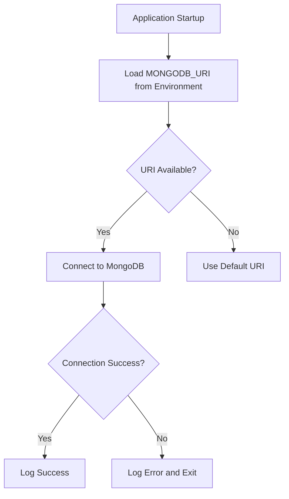
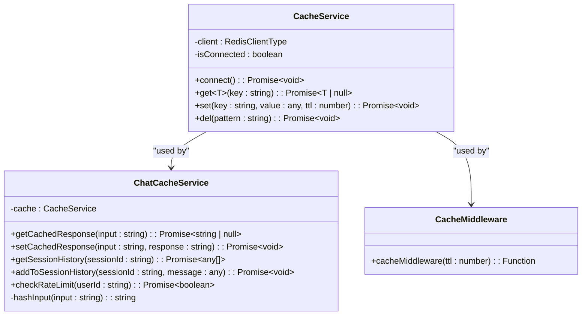
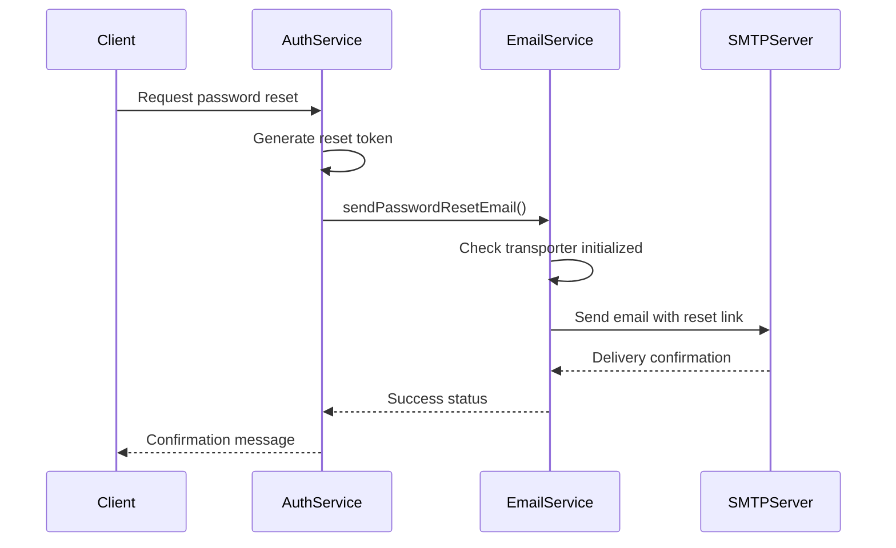
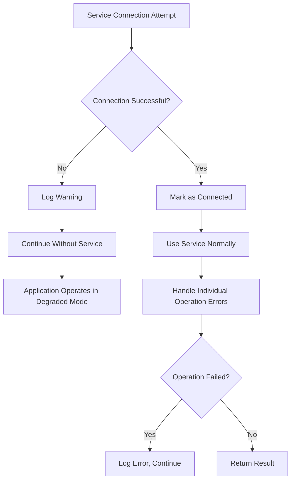
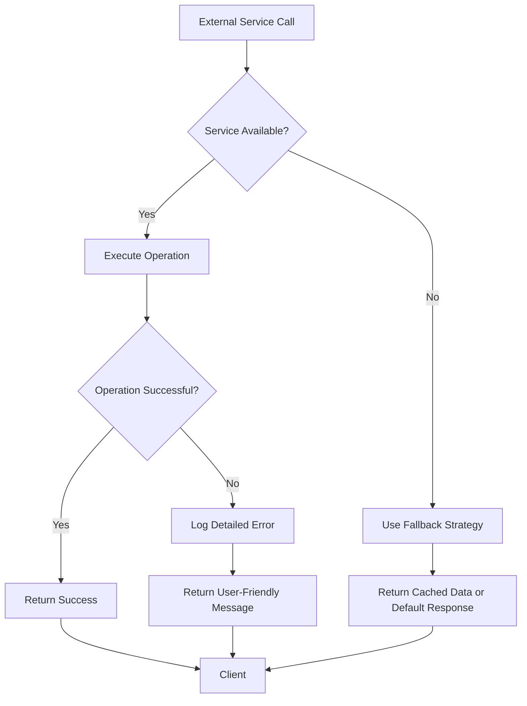
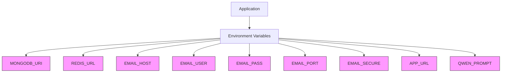
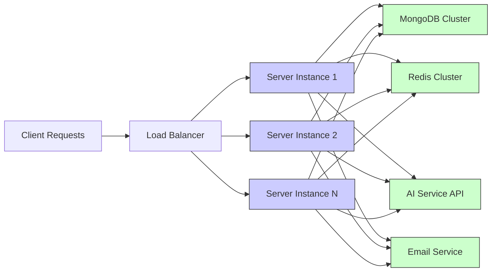

# External Integrations

<cite>
**Referenced Files in This Document**   
- [database.ts](file://api-fastify/src/config/database.ts)
- [cache.service.ts](file://api-fastify/src/services/cache.service.ts)
- [email.service.ts](file://api-fastify/src/services/email.service.ts)
- [ai.service.ts](file://api-fastify/src/services/ai.service.ts)
- [chat-cache.service.ts](file://api-fastify/src/services/chat-cache.service.ts)
- [cache.middleware.ts](file://api-fastify/src/middlewares/cache.middleware.ts)
- [ai.controller.ts](file://api-fastify/src/controllers/ai.controller.ts)
- [auth.controller.ts](file://api-fastify/src/controllers/auth.controller.ts)
- [auth.service.ts](file://api-fastify/src/services/auth.service.ts)
- [user.model.ts](file://api-fastify/src/models/user.model.ts)
- [pnpm-lock.yaml](file://api-fastify/pnpm-lock.yaml)
</cite>

## Table of Contents
1. [Introduction](#introduction)
2. [MongoDB Integration](#mongodb-integration)
3. [Redis Caching Architecture](#redis-caching-architecture)
4. [Email Service Integration](#email-service-integration)
5. [AI Service Integration](#ai-service-integration)
6. [Connection Management and Retry Strategies](#connection-management-and-retry-strategies)
7. [Failure Handling and Error Recovery](#failure-handling-and-error-recovery)
8. [Security Considerations](#security-considerations)
9. [Scalability and Monitoring](#scalability-and-monitoring)
10. [Conclusion](#conclusion)

## Introduction
The MERN_chatai_blog application integrates with several external systems to provide core functionality including data persistence, caching, email notifications, and AI-powered chatbot capabilities. This document details the integration patterns, connection management, and failure handling strategies for MongoDB, Redis, email services (Nodemailer), and AI services (@gradio/client). The architecture is designed to ensure reliability, security, and scalability while providing a seamless user experience.

**Section sources**
- [database.ts](file://api-fastify/src/config/database.ts)
- [cache.service.ts](file://api-fastify/src/services/cache.service.ts)
- [email.service.ts](file://api-fastify/src/services/email.service.ts)
- [ai.service.ts](file://api-fastify/src/services/ai.service.ts)

## MongoDB Integration
The application uses MongoDB as its primary data store through the Mongoose ODM. The connection is established during application startup with proper error handling and logging.



The connection is managed through a dedicated configuration file that handles the connection lifecycle, including error handling and process termination on connection failure. The application follows MongoDB best practices by using connection pooling through Mongoose, which manages multiple connections to the database server efficiently.

**Diagram sources**
- [database.ts](file://api-fastify/src/config/database.ts)

**Section sources**
- [database.ts](file://api-fastify/src/config/database.ts)
- [user.model.ts](file://api-fastify/src/models/user.model.ts)

## Redis Caching Architecture
Redis is used for both response caching and session storage, providing significant performance improvements for frequently accessed data.



The caching architecture implements multiple patterns:
- **Response caching**: API responses are cached with configurable TTL (Time To Live)
- **Session storage**: Chat session history is stored in Redis with a 2-hour expiration
- **Rate limiting**: User message frequency is limited to 10 messages per minute
- **Response caching**: Frequently generated AI responses are cached for 1 hour

The cache service is designed to be resilient, continuing application operation even when Redis is unavailable by catching and ignoring cache errors.

**Diagram sources**
- [cache.service.ts](file://api-fastify/src/services/cache.service.ts)
- [chat-cache.service.ts](file://api-fastify/src/services/chat-cache.service.ts)
- [cache.middleware.ts](file://api-fastify/src/middlewares/cache.middleware.ts)

**Section sources**
- [cache.service.ts](file://api-fastify/src/services/cache.service.ts)
- [chat-cache.service.ts](file://api-fastify/src/services/chat-cache.service.ts)
- [cache.middleware.ts](file://api-fastify/src/middlewares/cache.middleware.ts)

## Email Service Integration
The application uses Nodemailer to handle email communications for password reset and user verification workflows.



The email service is configured through environment variables, allowing for flexible deployment across different environments. The service includes:
- Configurable SMTP host, port, and authentication
- Support for secure connections (SSL/TLS)
- Default sender address configuration
- Graceful degradation when email configuration is incomplete

Email templates are defined in code for password reset and user verification workflows, with proper HTML formatting and time-limited links (1 hour expiration for password reset tokens).

**Diagram sources**
- [email.service.ts](file://api-fastify/src/services/email.service.ts)
- [auth.service.ts](file://api-fastify/src/services/auth.service.ts)

**Section sources**
- [email.service.ts](file://api-fastify/src/services/email.service.ts)
- [auth.service.ts](file://api-fastify/src/services/auth.service.ts)

## AI Service Integration
The application integrates with AI services through the @gradio/client library, enabling chatbot functionality and content generation.

```mermaid
sequenceDiagram
participant Client
participant AIController
participant ChatCacheService
participant AIService
participant GradioAPI
Client->>AIController : Send message with sessionId
AIController->>ChatCacheService : checkRateLimit()
ChatCacheService-->>AIController : Rate limit status
alt Rate limit exceeded
AIController-->>Client : 429 Too Many Requests
stop
end
AIController->>ChatCacheService : getCachedResponse()
ChatCacheService-->>AIController : Cached response or null
alt Response not cached
AIController->>AIService : sendMessage()
AIService->>AIService : getOrCreateSession()
AIService->>GradioAPI : predict() with primary model
alt Primary model fails
GradioAPI-->>AIService : Error
AIService->>GradioAPI : predict() with fallback model
end
GradioAPI-->>AIService : AI response
AIService->>ChatCacheService : setCachedResponse()
AIService-->>AIController : Response
end
AIController->>ChatCacheService : addToSessionHistory()
AIController-->>Client : Response with sessionId
```

The AI integration features:
- Multiple model fallback strategy using Qwen models
- Session management with in-memory storage and Redis backup
- Response caching to avoid redundant API calls
- Rate limiting to prevent abuse
- Session history preservation for context-aware responses
- Automatic cleanup of expired sessions (24-hour TTL)

The system implements a fallback mechanism that attempts multiple AI models if the primary model fails, ensuring service availability even when individual models are temporarily unavailable.

**Diagram sources**
- [ai.controller.ts](file://api-fastify/src/controllers/ai.controller.ts)
- [chat-cache.service.ts](file://api-fastify/src/services/chat-cache.service.ts)
- [ai.service.ts](file://api-fastify/src/services/ai.service.ts)

**Section sources**
- [ai.controller.ts](file://api-fastify/src/controllers/ai.controller.ts)
- [chat-cache.service.ts](file://api-fastify/src/services/chat-cache.service.ts)
- [ai.service.ts](file://api-fastify/src/services/ai.service.ts)

## Connection Management and Retry Strategies
The application implements robust connection management for all external services with appropriate retry strategies and failure handling.

For MongoDB, the connection is established at startup with proper error handling that terminates the process on connection failure, ensuring the application doesn't run in a degraded state. Mongoose handles connection pooling automatically, maintaining optimal connections to the database server.

Redis connections are managed with automatic reconnection capabilities. The cache service attempts to connect to Redis on initialization and continues to operate (in degraded mode) if the connection fails, preventing cache failures from affecting core application functionality.



The AI service implements a model fallback strategy rather than retries, attempting different models when the primary model fails. This approach is more effective than simple retries since model failures are often persistent.

Email service operations include built-in retry logic through Nodemailer's transport layer, with connection pooling and automatic reconnection capabilities.

**Diagram sources**
- [database.ts](file://api-fastify/src/config/database.ts)
- [cache.service.ts](file://api-fastify/src/services/cache.service.ts)
- [email.service.ts](file://api-fastify/src/services/email.service.ts)
- [ai.service.ts](file://api-fastify/src/services/ai.service.ts)

**Section sources**
- [database.ts](file://api-fastify/src/config/database.ts)
- [cache.service.ts](file://api-fastify/src/services/cache.service.ts)
- [email.service.ts](file://api-fastify/src/services/email.service.ts)
- [ai.service.ts](file://api-fastify/src/services/ai.service.ts)

## Failure Handling and Error Recovery
The application implements comprehensive failure handling strategies for external dependencies, ensuring graceful degradation when services are unavailable.

For database operations, all MongoDB interactions are wrapped in try-catch blocks with appropriate error logging. Connection failures result in process termination to prevent data corruption, while individual operation failures are logged and handled gracefully.



Redis failures are handled by continuing application operation without caching, which degrades performance but maintains functionality. Cache operations are designed to fail silently, preventing cache issues from affecting core features.

Email service failures are logged but do not prevent user workflows, as email delivery is not critical for immediate application functionality. Users are not informed of email delivery failures to avoid confusion, following security best practices.

AI service failures trigger a fallback response that informs users of temporary difficulties while maintaining the chat interface. The system attempts multiple models before returning a generic error message, maximizing the chance of successful response generation.

**Diagram sources**
- [database.ts](file://api-fastify/src/config/database.ts)
- [cache.service.ts](file://api-fastify/src/services/cache.service.ts)
- [email.service.ts](file://api-fastify/src/services/email.service.ts)
- [ai.service.ts](file://api-fastify/src/services/ai.service.ts)

**Section sources**
- [database.ts](file://api-fastify/src/config/database.ts)
- [cache.service.ts](file://api-fastify/src/services/cache.service.ts)
- [email.service.ts](file://api-fastify/src/services/email.service.ts)
- [ai.service.ts](file://api-fastify/src/services/ai.service.ts)

## Security Considerations
The application implements several security measures for external integrations, particularly around secrets management and data protection.

All sensitive configuration is managed through environment variables, including:
- MongoDB connection strings
- Redis URLs
- Email server credentials
- AI service API keys (implicit in @gradio/client)



Password reset tokens are generated using cryptographically secure random bytes and have a limited lifespan of one hour. The tokens are stored in the database with expiration timestamps to prevent reuse.

User passwords are hashed using bcrypt with a salt round of 10, providing strong protection against brute force attacks. The password hashes are never exposed in API responses through the Mongoose toJSON transformation.

Email communications include security best practices such as using secure connections (when configured) and avoiding the disclosure of account existence during password reset requests.

**Diagram sources**
- [database.ts](file://api-fastify/src/config/database.ts)
- [cache.service.ts](file://api-fastify/src/services/cache.service.ts)
- [email.service.ts](file://api-fastify/src/services/email.service.ts)
- [user.model.ts](file://api-fastify/src/models/user.model.ts)
- [utils/index.ts](file://api-fastify/src/utils/index.ts)

**Section sources**
- [database.ts](file://api-fastify/src/config/database.ts)
- [email.service.ts](file://api-fastify/src/services/email.service.ts)
- [user.model.ts](file://api-fastify/src/models/user.model.ts)
- [utils/index.ts](file://api-fastify/src/utils/index.ts)

## Scalability and Monitoring
The external integration architecture is designed with scalability in mind, allowing the application to handle increased loads through various strategies.



Database scalability is achieved through MongoDB's native clustering and sharding capabilities, with the Mongoose connection handling connection pooling automatically. The application can be deployed in multiple instances, all connecting to the same MongoDB cluster.

Redis is used to reduce database load through response caching, significantly improving performance under high traffic conditions. The rate limiting implementation prevents abuse and ensures fair resource usage.

The AI service integration includes response caching and session history storage in Redis, reducing the number of external API calls needed. This is particularly important given that AI services can be rate-limited or costly.

Monitoring is implemented through comprehensive logging of external service interactions, including:
- Database connection status
- Cache hit/miss ratios
- Email sending success/failure
- AI service response times and errors
- Rate limiting events

The application could be enhanced with more sophisticated monitoring through integration with observability platforms, but the current logging provides essential insights into external dependency performance.

**Diagram sources**
- [cache.service.ts](file://api-fastify/src/services/cache.service.ts)
- [ai.service.ts](file://api-fastify/src/services/ai.service.ts)
- [email.service.ts](file://api-fastify/src/services/email.service.ts)

**Section sources**
- [cache.service.ts](file://api-fastify/src/services/cache.service.ts)
- [ai.service.ts](file://api-fastify/src/services/ai.service.ts)
- [email.service.ts](file://api-fastify/src/services/email.service.ts)

## Conclusion
The MERN_chatai_blog application demonstrates a well-architected approach to external integrations, balancing functionality, reliability, and security. The integration patterns for MongoDB, Redis, email services, and AI services follow industry best practices, with appropriate connection management, retry strategies, and failure handling.

Key strengths of the architecture include:
- Resilient design that gracefully degrades when external services fail
- Comprehensive security measures for secrets management and data protection
- Performance optimizations through strategic caching
- Scalable design that can handle increased loads
- Clear separation of concerns between integration layers

The application could be further improved by implementing more sophisticated monitoring and alerting for external dependencies, but the current implementation provides a solid foundation for a production-grade application.