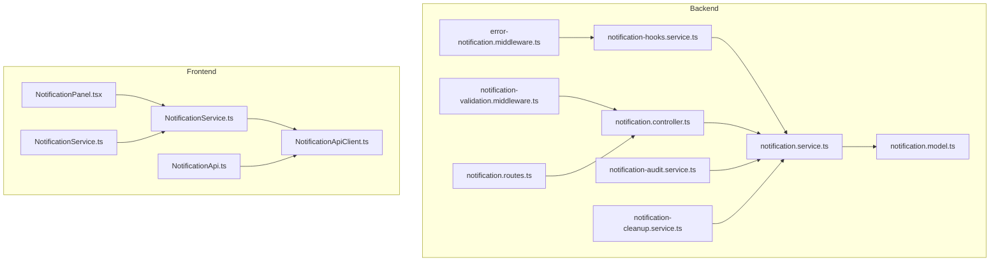
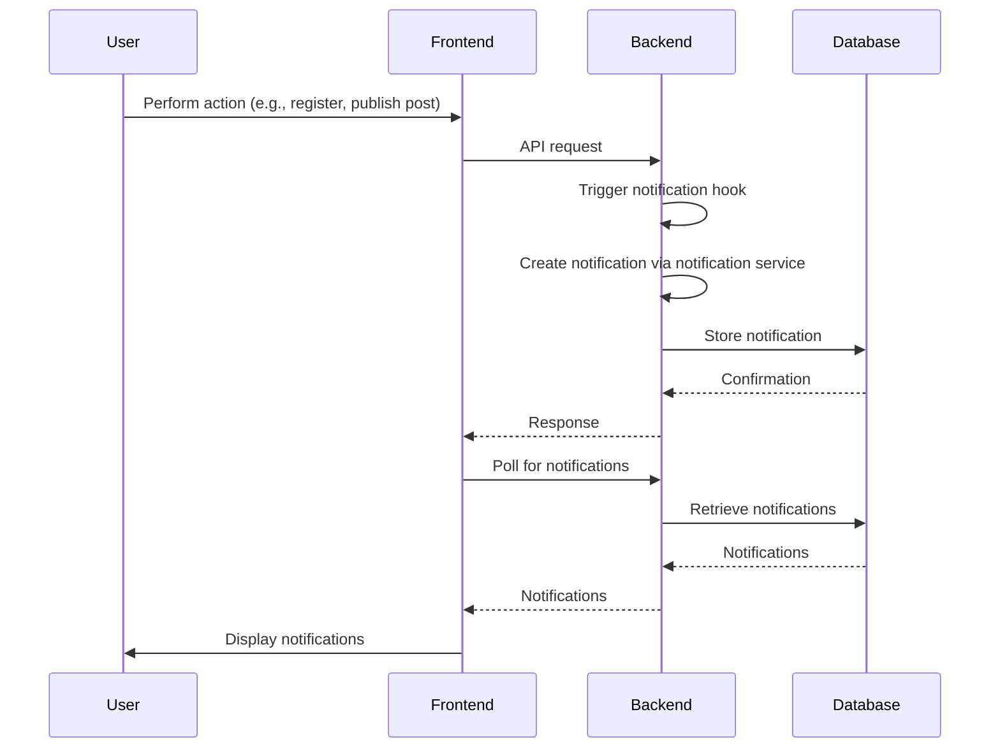
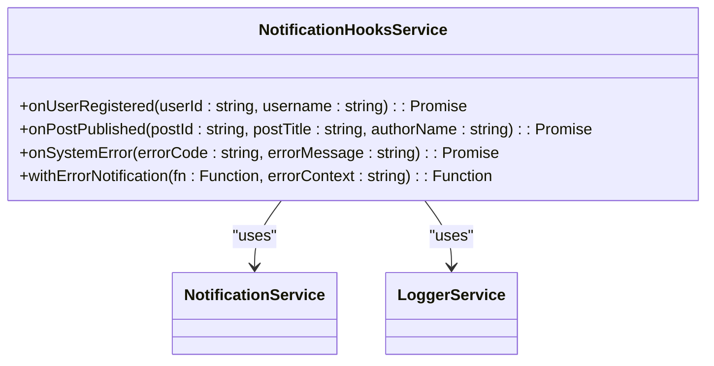
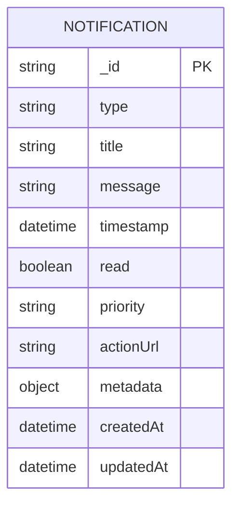
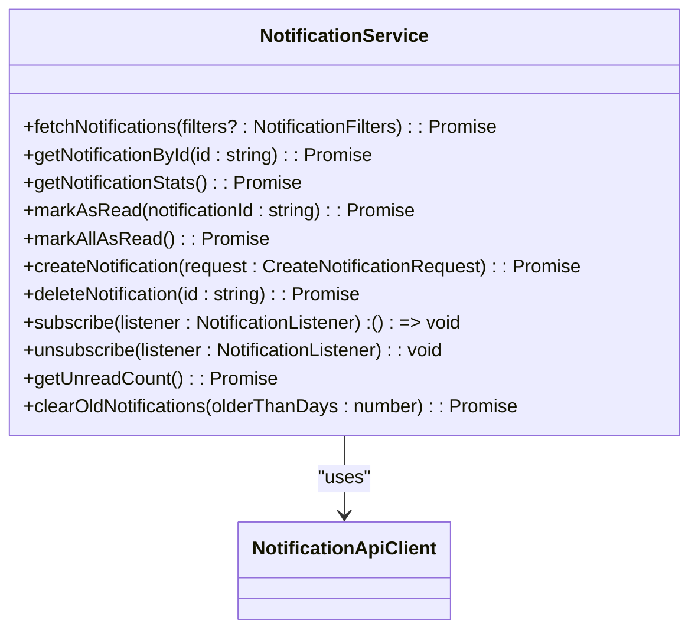
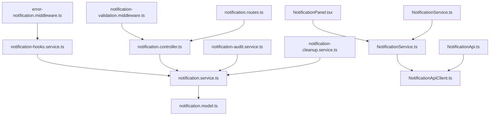

# Notification Hooks

<cite>
**Referenced Files in This Document**   
- [notification-hooks.service.ts](file://api-fastify/src/services/notification-hooks.service.ts)
- [notification.service.ts](file://api-fastify/src/services/notification.service.ts)
- [notification.model.ts](file://api-fastify/src/models/notification.model.ts)
- [notification.types.ts](file://api-fastify/src/types/notification.types.ts)
- [notification.controller.ts](file://api-fastify/src/controllers/notification.controller.ts)
- [notification-audit.service.ts](file://api-fastify/src/services/notification-audit.service.ts)
- [notification-cleanup.service.ts](file://api-fastify/src/services/notification-cleanup.service.ts)
- [error-notification.middleware.ts](file://api-fastify/src/middlewares/error-notification.middleware.ts)
- [notification-validation.middleware.ts](file://api-fastify/src/middlewares/notification-validation.middleware.ts)
- [notification.routes.ts](file://api-fastify/src/routes/notification.routes.ts)
- [NotificationService.ts](file://src/services/NotificationService.ts)
- [NotificationApiClient.ts](file://src/services/NotificationApiClient.ts)
- [NotificationPanel.tsx](file://src/components/admin/NotificationPanel.tsx)
- [NotificationService.ts](file://src/types/NotificationService.ts)
- [NotificationApi.ts](file://src/types/NotificationApi.ts)
</cite>

## Table of Contents
1. [Introduction](#introduction)
2. [Project Structure](#project-structure)
3. [Core Components](#core-components)
4. [Architecture Overview](#architecture-overview)
5. [Detailed Component Analysis](#detailed-component-analysis)
6. [Dependency Analysis](#dependency-analysis)
7. [Performance Considerations](#performance-considerations)
8. [Troubleshooting Guide](#troubleshooting-guide)
9. [Conclusion](#conclusion)

## Introduction
The notification hooks service in MERN_chatai_blog implements an event-driven architecture that triggers notifications based on system events such as user registration, post publication, and system errors. This documentation provides a comprehensive overview of the notification system, including the hook registration mechanism, event listeners, payload transformation logic, and integration with the main notification service for message creation and delivery. The system is designed with reliability features such as retry mechanisms, error logging, and dead letter queues for failed notifications. The documentation also covers security considerations for preventing notification spam and ensuring data privacy, along with guidance on extending the system with new hooks and configuring notification channels.

## Project Structure
The notification system is organized across both the backend (api-fastify) and frontend (src) directories. The backend contains the core notification services, models, controllers, and middleware, while the frontend includes the notification service, API client, and UI components.



**Diagram sources**
- [notification-hooks.service.ts](file://api-fastify/src/services/notification-hooks.service.ts)
- [notification.service.ts](file://api-fastify/src/services/notification.service.ts)
- [notification.model.ts](file://api-fastify/src/models/notification.model.ts)
- [notification.controller.ts](file://api-fastify/src/controllers/notification.controller.ts)
- [notification-audit.service.ts](file://api-fastify/src/services/notification-audit.service.ts)
- [notification-cleanup.service.ts](file://api-fastify/src/services/notification-cleanup.service.ts)
- [error-notification.middleware.ts](file://api-fastify/src/middlewares/error-notification.middleware.ts)
- [notification-validation.middleware.ts](file://api-fastify/src/middlewares/notification-validation.middleware.ts)
- [notification.routes.ts](file://api-fastify/src/routes/notification.routes.ts)
- [NotificationService.ts](file://src/services/NotificationService.ts)
- [NotificationApiClient.ts](file://src/services/NotificationApiClient.ts)
- [NotificationPanel.tsx](file://src/components/admin/NotificationPanel.tsx)
- [NotificationService.ts](file://src/types/NotificationService.ts)
- [NotificationApi.ts](file://src/types/NotificationApi.ts)

**Section sources**
- [notification-hooks.service.ts](file://api-fastify/src/services/notification-hooks.service.ts)
- [notification.service.ts](file://api-fastify/src/services/notification.service.ts)
- [notification.model.ts](file://api-fastify/src/models/notification.model.ts)
- [notification.controller.ts](file://api-fastify/src/controllers/notification.controller.ts)
- [notification-audit.service.ts](file://api-fastify/src/services/notification-audit.service.ts)
- [notification-cleanup.service.ts](file://api-fastify/src/services/notification-cleanup.service.ts)
- [error-notification.middleware.ts](file://api-fastify/src/middlewares/error-notification.middleware.ts)
- [notification-validation.middleware.ts](file://api-fastify/src/middlewares/notification-validation.middleware.ts)
- [notification.routes.ts](file://api-fastify/src/routes/notification.routes.ts)
- [NotificationService.ts](file://src/services/NotificationService.ts)
- [NotificationApiClient.ts](file://src/services/NotificationApiClient.ts)
- [NotificationPanel.tsx](file://src/components/admin/NotificationPanel.tsx)
- [NotificationService.ts](file://src/types/NotificationService.ts)
- [NotificationApi.ts](file://src/types/NotificationApi.ts)

## Core Components
The core components of the notification system include the notification hooks service, which handles event-driven notifications, the notification service, which manages notification creation and retrieval, and the notification model, which defines the structure of notifications in the database. The system also includes audit and cleanup services for monitoring and maintenance, as well as middleware for error handling and validation.

**Section sources**
- [notification-hooks.service.ts](file://api-fastify/src/services/notification-hooks.service.ts)
- [notification.service.ts](file://api-fastify/src/services/notification.service.ts)
- [notification.model.ts](file://api-fastify/src/models/notification.model.ts)
- [notification-audit.service.ts](file://api-fastify/src/services/notification-audit.service.ts)
- [notification-cleanup.service.ts](file://api-fastify/src/services/notification-cleanup.service.ts)

## Architecture Overview
The notification system follows an event-driven architecture where specific events in the application trigger notification hooks. These hooks then create notifications through the notification service, which stores them in the database. The frontend retrieves these notifications via API calls and displays them in the notification panel. The system includes reliability features such as retry mechanisms and error logging, as well as security measures like rate limiting and input validation.



**Diagram sources**
- [notification-hooks.service.ts](file://api-fastify/src/services/notification-hooks.service.ts)
- [notification.service.ts](file://api-fastify/src/services/notification.service.ts)
- [notification.model.ts](file://api-fastify/src/models/notification.model.ts)
- [notification.controller.ts](file://api-fastify/src/controllers/notification.controller.ts)
- [NotificationService.ts](file://src/services/NotificationService.ts)
- [NotificationApiClient.ts](file://src/services/NotificationApiClient.ts)
- [NotificationPanel.tsx](file://src/components/admin/NotificationPanel.tsx)

## Detailed Component Analysis

### Notification Hooks Service Analysis
The notification hooks service is responsible for handling event-driven notifications. It includes functions for user registration, post publication, and system errors. The service uses a wrapper function to capture and notify system errors automatically.



**Diagram sources**
- [notification-hooks.service.ts](file://api-fastify/src/services/notification-hooks.service.ts)
- [notification.service.ts](file://api-fastify/src/services/notification.service.ts)
- [logger.service.ts](file://api-fastify/src/services/logger.service.ts)

**Section sources**
- [notification-hooks.service.ts](file://api-fastify/src/services/notification-hooks.service.ts)

### Notification Service Analysis
The notification service manages the creation, retrieval, and deletion of notifications. It includes functions for creating notifications of different types, retrieving notifications with pagination, and marking notifications as read.

```mermaid
classDiagram
class NotificationService {
+getNotifications(page : number, limit : number, unreadOnly : boolean) : Promise<GetNotificationsResponse>
+markNotificationAsRead(notificationId : string) : Promise<AdminNotification>
+markAllNotificationsAsRead() : Promise<{ modifiedCount : number }>
+createNotification(input : CreateNotificationInput) : Promise<AdminNotification>
+cleanupOldNotifications() : Promise<{ deletedCount : number }>
+generateUserRegistrationNotification(userId : string, username : string) : Promise<AdminNotification>
+generatePostPublishedNotification(postId : string, postTitle : string, authorName : string) : Promise<AdminNotification>
+generateSystemErrorNotification(errorCode : string, errorMessage : string) : Promise<AdminNotification>
}
NotificationService --> NotificationModel : "uses"
NotificationService --> LoggerService : "uses"
```

**Diagram sources**
- [notification.service.ts](file://api-fastify/src/services/notification.service.ts)
- [notification.model.ts](file://api-fastify/src/models/notification.model.ts)
- [logger.service.ts](file://api-fastify/src/services/logger.service.ts)

**Section sources**
- [notification.service.ts](file://api-fastify/src/services/notification.service.ts)

### Notification Model Analysis
The notification model defines the structure of notifications in the database. It includes fields for type, title, message, timestamp, read status, priority, action URL, and metadata.



**Diagram sources**
- [notification.model.ts](file://api-fastify/src/models/notification.model.ts)

**Section sources**
- [notification.model.ts](file://api-fastify/src/models/notification.model.ts)

### Frontend Notification Service Analysis
The frontend notification service manages the retrieval and display of notifications. It includes functions for fetching notifications, marking them as read, and subscribing to notification updates.



**Diagram sources**
- [NotificationService.ts](file://src/services/NotificationService.ts)
- [NotificationApiClient.ts](file://src/services/NotificationApiClient.ts)

**Section sources**
- [NotificationService.ts](file://src/services/NotificationService.ts)

## Dependency Analysis
The notification system has a clear dependency hierarchy, with the notification hooks service depending on the notification service, which in turn depends on the notification model. The frontend notification service depends on the notification API client, which handles communication with the backend.



**Diagram sources**
- [notification-hooks.service.ts](file://api-fastify/src/services/notification-hooks.service.ts)
- [notification.service.ts](file://api-fastify/src/services/notification.service.ts)
- [notification.model.ts](file://api-fastify/src/models/notification.model.ts)
- [notification.controller.ts](file://api-fastify/src/controllers/notification.controller.ts)
- [notification-audit.service.ts](file://api-fastify/src/services/notification-audit.service.ts)
- [notification-cleanup.service.ts](file://api-fastify/src/services/notification-cleanup.service.ts)
- [error-notification.middleware.ts](file://api-fastify/src/middlewares/error-notification.middleware.ts)
- [notification-validation.middleware.ts](file://api-fastify/src/middlewares/notification-validation.middleware.ts)
- [notification.routes.ts](file://api-fastify/src/routes/notification.routes.ts)
- [NotificationService.ts](file://src/services/NotificationService.ts)
- [NotificationApiClient.ts](file://src/services/NotificationApiClient.ts)
- [NotificationPanel.tsx](file://src/components/admin/NotificationPanel.tsx)
- [NotificationService.ts](file://src/types/NotificationService.ts)
- [NotificationApi.ts](file://src/types/NotificationApi.ts)

**Section sources**
- [notification-hooks.service.ts](file://api-fastify/src/services/notification-hooks.service.ts)
- [notification.service.ts](file://api-fastify/src/services/notification.service.ts)
- [notification.model.ts](file://api-fastify/src/models/notification.model.ts)
- [notification.controller.ts](file://api-fastify/src/controllers/notification.controller.ts)
- [notification-audit.service.ts](file://api-fastify/src/services/notification-audit.service.ts)
- [notification-cleanup.service.ts](file://api-fastify/src/services/notification-cleanup.service.ts)
- [error-notification.middleware.ts](file://api-fastify/src/middlewares/error-notification.middleware.ts)
- [notification-validation.middleware.ts](file://api-fastify/src/middlewares/notification-validation.middleware.ts)
- [notification.routes.ts](file://api-fastify/src/routes/notification.routes.ts)
- [NotificationService.ts](file://src/services/NotificationService.ts)
- [NotificationApiClient.ts](file://src/services/NotificationApiClient.ts)
- [NotificationPanel.tsx](file://src/components/admin/NotificationPanel.tsx)
- [NotificationService.ts](file://src/types/NotificationService.ts)
- [NotificationApi.ts](file://src/types/NotificationApi.ts)

## Performance Considerations
The notification system includes several performance optimizations, such as pagination for retrieving notifications, indexing on frequently queried fields in the database, and caching on the frontend. The system also includes a cleanup service that automatically removes old notifications to keep the database size manageable.

**Section sources**
- [notification.service.ts](file://api-fastify/src/services/notification.service.ts)
- [notification.model.ts](file://api-fastify/src/models/notification.model.ts)
- [notification-cleanup.service.ts](file://api-fastify/src/services/notification-cleanup.service.ts)
- [NotificationService.ts](file://src/services/NotificationService.ts)

## Troubleshooting Guide
The notification system includes comprehensive error handling and logging. The audit service logs all notification-related actions, and the cleanup service provides status information. The frontend includes error handling for network issues and retry mechanisms.

**Section sources**
- [notification-audit.service.ts](file://api-fastify/src/services/notification-audit.service.ts)
- [notification-cleanup.service.ts](file://api-fastify/src/services/notification-cleanup.service.ts)
- [NotificationService.ts](file://src/services/NotificationService.ts)
- [NotificationApiClient.ts](file://src/services/NotificationApiClient.ts)

## Conclusion
The notification hooks service in MERN_chatai_blog provides a robust, event-driven architecture for delivering notifications based on system events. The system is designed with reliability, security, and performance in mind, and includes comprehensive documentation and error handling. The clear separation of concerns between the backend and frontend components makes the system easy to maintain and extend.