# Middleware & Interceptors

<cite>
**Referenced Files in This Document**   
- [auth.middleware.ts](file://api-fastify/src/middlewares/auth.middleware.ts)
- [rate-limit.middleware.ts](file://api-fastify/src/middlewares/rate-limit.middleware.ts)
- [cache.middleware.ts](file://api-fastify/src/middlewares/cache.middleware.ts)
- [error-logger.middleware.ts](file://api-fastify/src/middlewares/error-logger.middleware.ts)
- [error-notification.middleware.ts](file://api-fastify/src/middlewares/error-notification.middleware.ts)
- [notification-validation.middleware.ts](file://api-fastify/src/middlewares/notification-validation.middleware.ts)
- [cache.service.ts](file://api-fastify/src/services/cache.service.ts)
- [server.ts](file://api-fastify/src/server.ts)
- [notification.routes.ts](file://api-fastify/src/routes/notification.routes.ts)
- [notification.controller.ts](file://api-fastify/src/controllers/notification.controller.ts)
- [notification-audit.service.ts](file://api-fastify/src/services/notification-audit.service.ts)
- [notification-cleanup.service.ts](file://api-fastify/src/services/notification-cleanup.service.ts)
</cite>

## Table of Contents
1. [Introduction](#introduction)
2. [Middleware Pipeline Architecture](#middleware-pipeline-architecture)
3. [Authentication Validation](#authentication-validation)
4. [Rate Limiting](#rate-limiting)
5. [Caching](#caching)
6. [Error Logging](#error-logging)
7. [Error Notification](#error-notification)
8. [Request Validation](#request-validation)
9. [Execution Order & Request Lifecycle](#execution-order--request-lifecycle)
10. [Configuration Options](#configuration-options)
11. [Usage Examples](#usage-examples)
12. [Error Handling Cascade](#error-handling-cascade)
13. [Performance Implications](#performance-implications)
14. [Troubleshooting Guide](#troubleshooting-guide)

## Introduction
The MERN_chatai_blog Fastify backend implements a comprehensive middleware pipeline to handle authentication, rate limiting, caching, error logging, and request validation. This documentation provides a detailed analysis of the middleware architecture, implementation, and integration within the request lifecycle. The system is designed to ensure security, performance, and reliability while providing robust error handling and monitoring capabilities.

## Middleware Pipeline Architecture

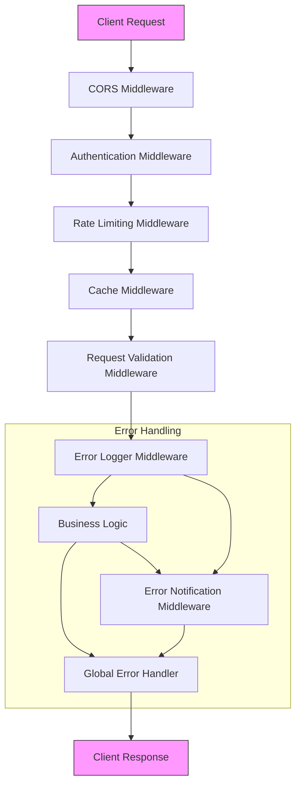

**Diagram sources**
- [server.ts](file://api-fastify/src/server.ts#L10-L173)
- [auth.middleware.ts](file://api-fastify/src/middlewares/auth.middleware.ts#L1-L128)
- [rate-limit.middleware.ts](file://api-fastify/src/middlewares/rate-limit.middleware.ts#L1-L92)

**Section sources**
- [server.ts](file://api-fastify/src/server.ts#L10-L173)
- [middlewares](file://api-fastify/src/middlewares)

## Authentication Validation

The authentication middleware system provides multiple layers of access control based on user roles. The implementation uses JWT tokens with cookie-based authentication and supports role-based authorization for different user types (admin, editor, author).

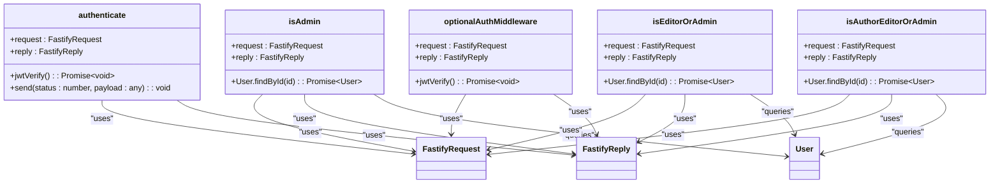

**Diagram sources**
- [auth.middleware.ts](file://api-fastify/src/middlewares/auth.middleware.ts#L1-L128)

**Section sources**
- [auth.middleware.ts](file://api-fastify/src/middlewares/auth.middleware.ts#L1-L128)

## Rate Limiting

The rate limiting middleware implements a flexible rate limiting system using Redis for distributed rate tracking. The system supports configurable windows, request limits, and custom key generators to handle different rate limiting scenarios.

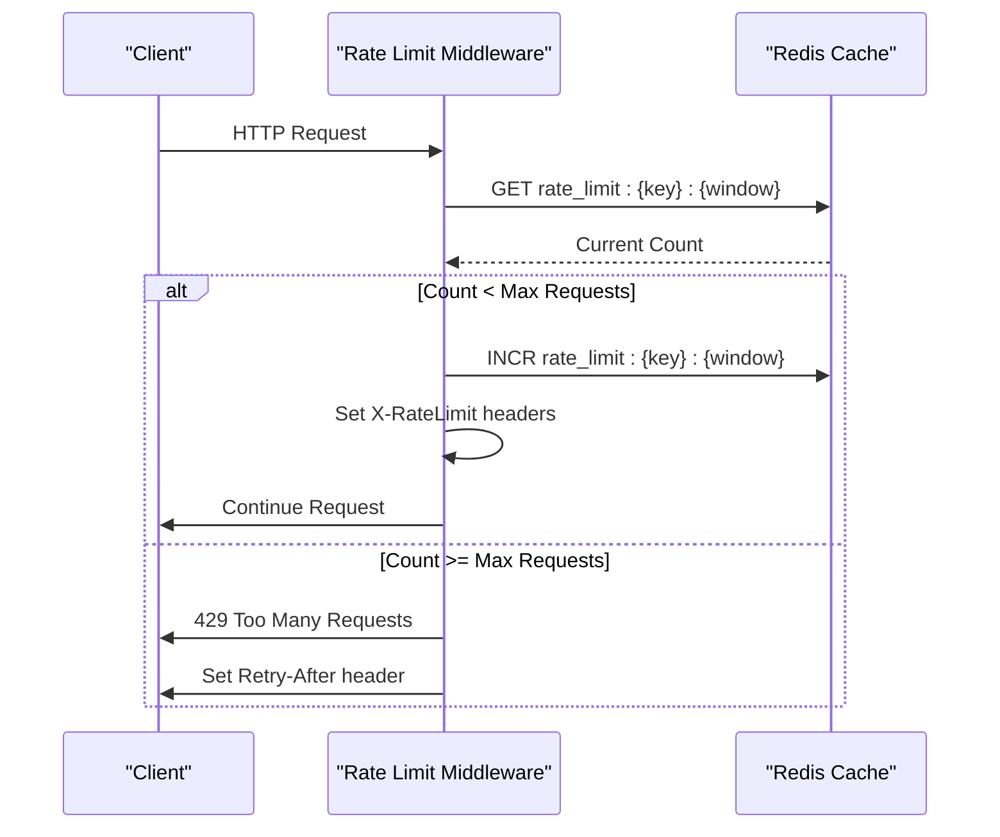

**Diagram sources**
- [rate-limit.middleware.ts](file://api-fastify/src/middlewares/rate-limit.middleware.ts#L1-L92)
- [cache.service.ts](file://api-fastify/src/services/cache.service.ts#L1-L58)

**Section sources**
- [rate-limit.middleware.ts](file://api-fastify/src/middlewares/rate-limit.middleware.ts#L1-L92)

## Caching

The caching middleware implements a transparent caching layer using Redis to improve performance for GET requests. The system automatically caches successful responses and serves them on subsequent requests, reducing database load and improving response times.

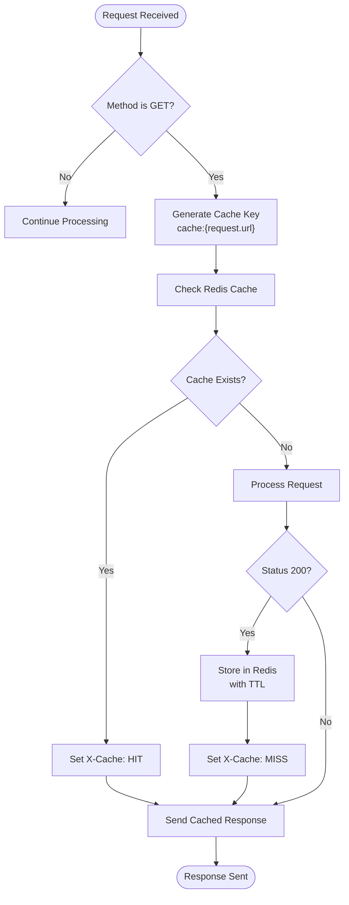

**Diagram sources**
- [cache.middleware.ts](file://api-fastify/src/middlewares/cache.middleware.ts#L1-L25)
- [cache.service.ts](file://api-fastify/src/services/cache.service.ts#L1-L58)

**Section sources**
- [cache.middleware.ts](file://api-fastify/src/middlewares/cache.middleware.ts#L1-L25)

## Error Logging

The error logging middleware intercepts responses with status codes 400 and above to log detailed error information. This provides comprehensive error tracking while maintaining separation between error handling and logging concerns.

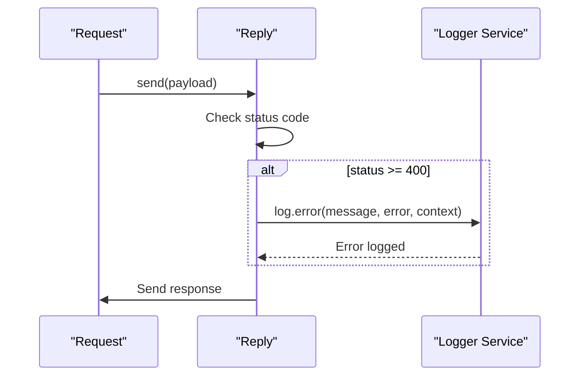

**Diagram sources**
- [error-logger.middleware.ts](file://api-fastify/src/middlewares/error-logger.middleware.ts#L1-L22)
- [logger.service.ts](file://api-fastify/src/services/logger.service.ts)

**Section sources**
- [error-logger.middleware.ts](file://api-fastify/src/middlewares/error-logger.middleware.ts#L1-L22)

## Error Notification

The error notification system creates automated notifications for server errors (500+ status codes) and system exceptions. This ensures critical issues are immediately reported through the application's notification system.

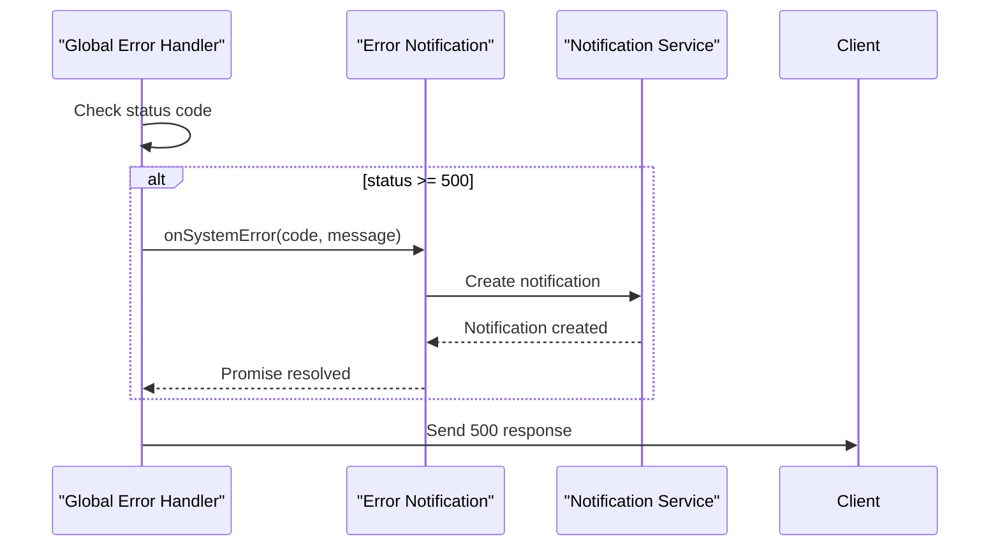

**Diagram sources**
- [error-notification.middleware.ts](file://api-fastify/src/middlewares/error-notification.middleware.ts#L1-L32)
- [server.ts](file://api-fastify/src/server.ts#L150-L173)

**Section sources**
- [error-notification.middleware.ts](file://api-fastify/src/middlewares/error-notification.middleware.ts#L1-L32)

## Request Validation

The request validation middleware provides comprehensive input validation for notification-related endpoints, including parameter validation, query string validation, and input sanitization to prevent injection attacks.

```mermaid
flowchart TD
Start([Request Received]) --> ValidateID["Validate Notification ID"]
ValidateID --> IsValidID{"Valid ObjectId?"}
IsValidID --> |No| Return400["Return 400 Bad Request"]
IsValidID --> |Yes| ValidateQuery["Validate Query Parameters"]
ValidateQuery --> IsValidPage{"Valid Page?"}
IsValidPage --> |No| Return400
IsValidPage --> |Yes| IsValidLimit{"Valid Limit?"}
IsValidLimit --> |No| Return400
IsValidLimit --> |Yes| SanitizeInput["Sanitize Input Parameters"]
SanitizeInput --> RemoveChars["Remove < > \" ' & characters"]
RemoveChars --> Continue[Continue Processing]
Return400 --> End([Response Sent])
Continue --> End
```

**Diagram sources**
- [notification-validation.middleware.ts](file://api-fastify/src/middlewares/notification-validation.middleware.ts#L1-L112)

**Section sources**
- [notification-validation.middleware.ts](file://api-fastify/src/middlewares/notification-validation.middleware.ts#L1-L112)

## Execution Order & Request Lifecycle

The middleware execution follows a specific order that aligns with the Fastify request lifecycle hooks. The system uses both global and route-specific middleware to provide layered security and functionality.

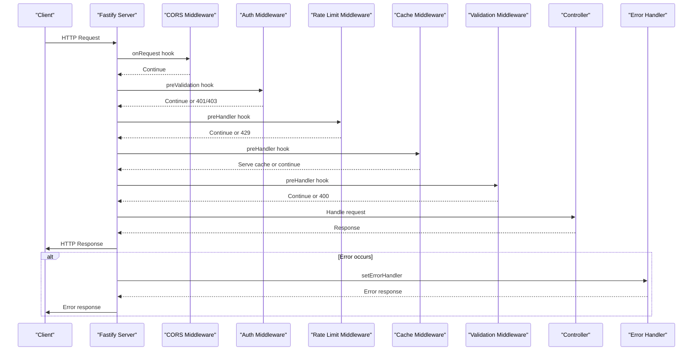

**Diagram sources**
- [server.ts](file://api-fastify/src/server.ts#L10-L173)
- [notification.routes.ts](file://api-fastify/src/routes/notification.routes.ts#L1-L317)

**Section sources**
- [server.ts](file://api-fastify/src/server.ts#L10-L173)
- [notification.routes.ts](file://api-fastify/src/routes/notification.routes.ts#L1-L317)

## Configuration Options

The middleware system provides configurable options for rate limiting thresholds and cache TTLs through environment variables and middleware parameters. These configurations allow fine-tuning of system behavior based on deployment requirements.

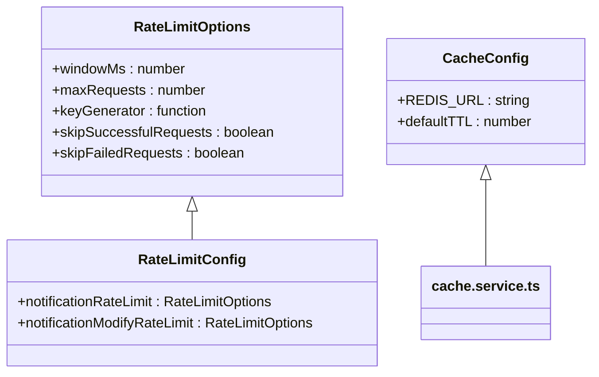

**Diagram sources**
- [rate-limit.middleware.ts](file://api-fastify/src/middlewares/rate-limit.middleware.ts#L1-L92)
- [cache.service.ts](file://api-fastify/src/services/cache.service.ts#L1-L58)

**Section sources**
- [rate-limit.middleware.ts](file://api-fastify/src/middlewares/rate-limit.middleware.ts#L1-L92)
- [cache.service.ts](file://api-fastify/src/services/cache.service.ts#L1-L58)

## Usage Examples

The middleware system is applied to routes through Fastify's plugin architecture and hook system. Different routes can have different middleware combinations based on their security and performance requirements.

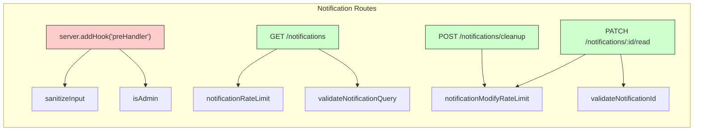

**Diagram sources**
- [notification.routes.ts](file://api-fastify/src/routes/notification.routes.ts#L1-L317)

**Section sources**
- [notification.routes.ts](file://api-fastify/src/routes/notification.routes.ts#L1-L317)

## Error Handling Cascade

The error handling system implements a cascading approach where errors are handled at multiple levels, from middleware-specific handling to global error handling, ensuring comprehensive error coverage and appropriate responses.

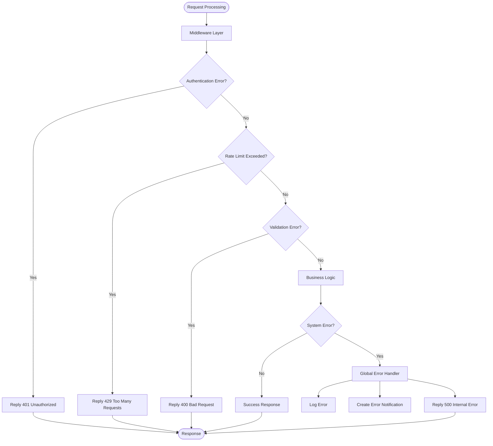

**Diagram sources**
- [server.ts](file://api-fastify/src/server.ts#L150-L173)
- [error-logger.middleware.ts](file://api-fastify/src/middlewares/error-logger.middleware.ts#L1-L22)
- [error-notification.middleware.ts](file://api-fastify/src/middlewares/error-notification.middleware.ts#L1-L32)

**Section sources**
- [server.ts](file://api-fastify/src/server.ts#L150-L173)
- [error-logger.middleware.ts](file://api-fastify/src/middlewares/error-logger.middleware.ts#L1-L22)

## Performance Implications

The middleware chain has significant performance implications that are mitigated through careful design and optimization techniques. The system balances security and functionality with performance requirements.

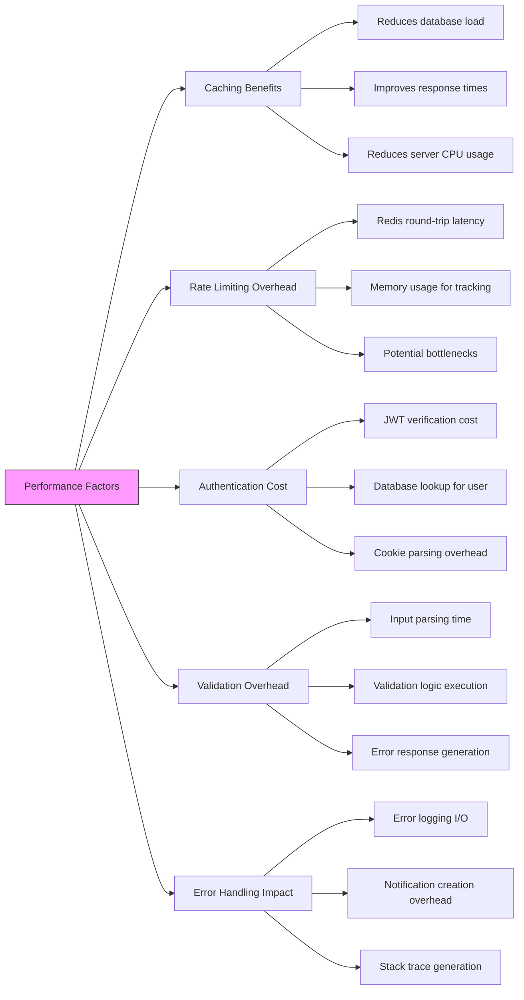

**Diagram sources**
- [cache.middleware.ts](file://api-fastify/src/middlewares/cache.middleware.ts#L1-L25)
- [rate-limit.middleware.ts](file://api-fastify/src/middlewares/rate-limit.middleware.ts#L1-L92)
- [auth.middleware.ts](file://api-fastify/src/middlewares/auth.middleware.ts#L1-L128)

**Section sources**
- [cache.middleware.ts](file://api-fastify/src/middlewares/cache.middleware.ts#L1-L25)
- [rate-limit.middleware.ts](file://api-fastify/src/middlewares/rate-limit.middleware.ts#L1-L92)

## Troubleshooting Guide

This section provides guidance for diagnosing and resolving common middleware-related issues, including authentication failures, cache invalidation problems, and rate limiting issues.

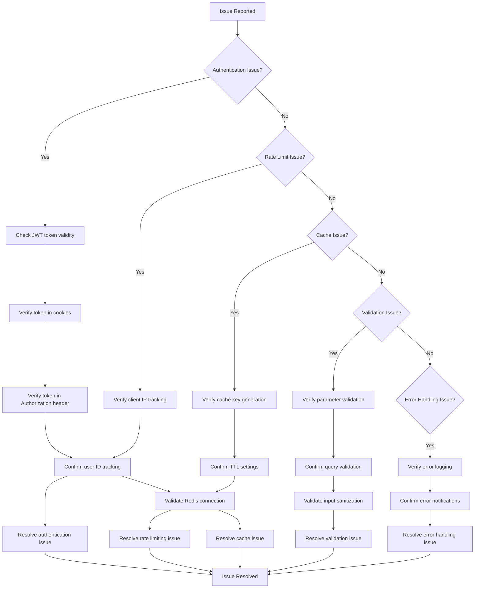

**Diagram sources**
- [auth.middleware.ts](file://api-fastify/src/middlewares/auth.middleware.ts#L1-L128)
- [rate-limit.middleware.ts](file://api-fastify/src/middlewares/rate-limit.middleware.ts#L1-L92)
- [cache.middleware.ts](file://api-fastify/src/middlewares/cache.middleware.ts#L1-L25)
- [notification-validation.middleware.ts](file://api-fastify/src/middlewares/notification-validation.middleware.ts#L1-L112)

**Section sources**
- [auth.middleware.ts](file://api-fastify/src/middlewares/auth.middleware.ts#L1-L128)
- [rate-limit.middleware.ts](file://api-fastify/src/middlewares/rate-limit.middleware.ts#L1-L92)
- [cache.middleware.ts](file://api-fastify/src/middlewares/cache.middleware.ts#L1-L25)
- [notification-validation.middleware.ts](file://api-fastify/src/middlewares/notification-validation.middleware.ts#L1-L112)