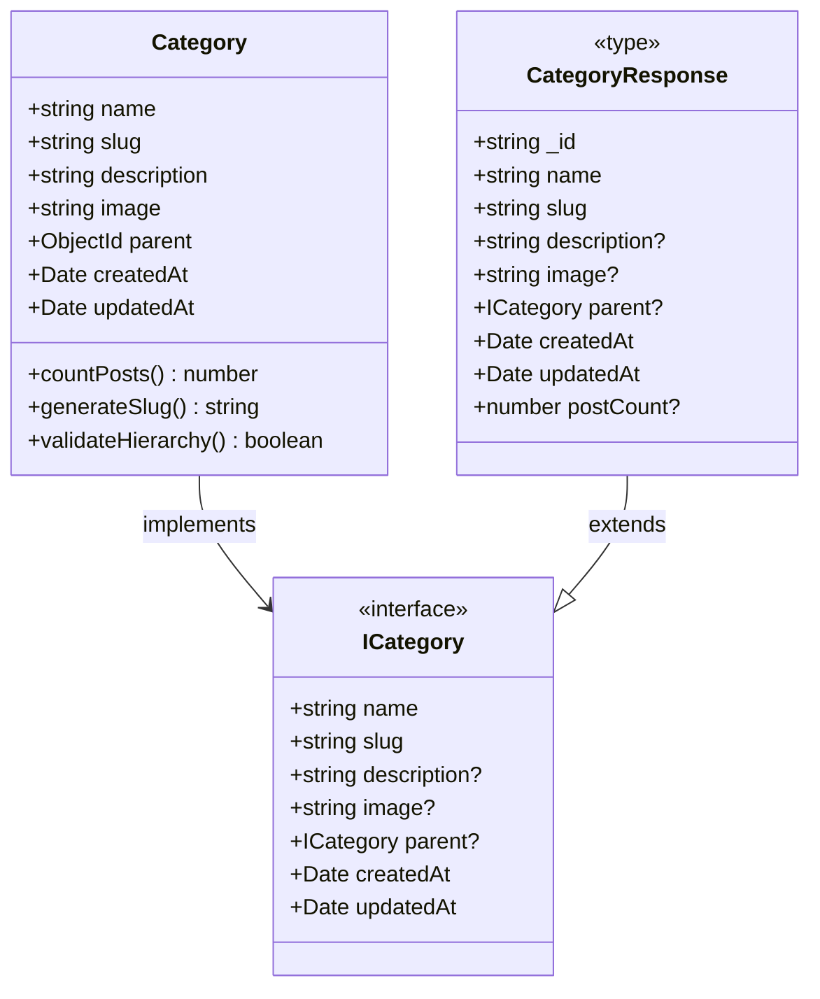
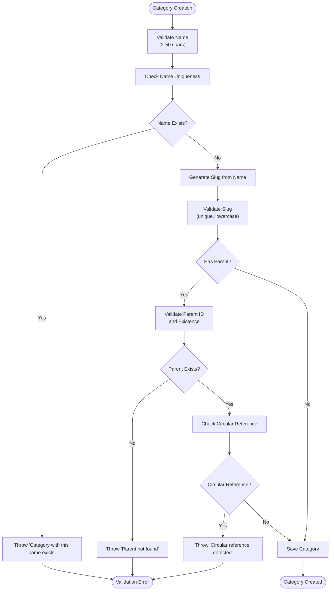
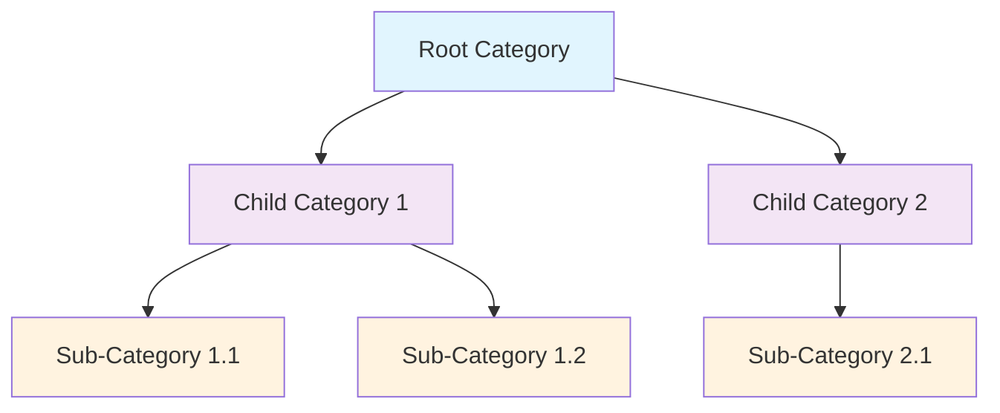
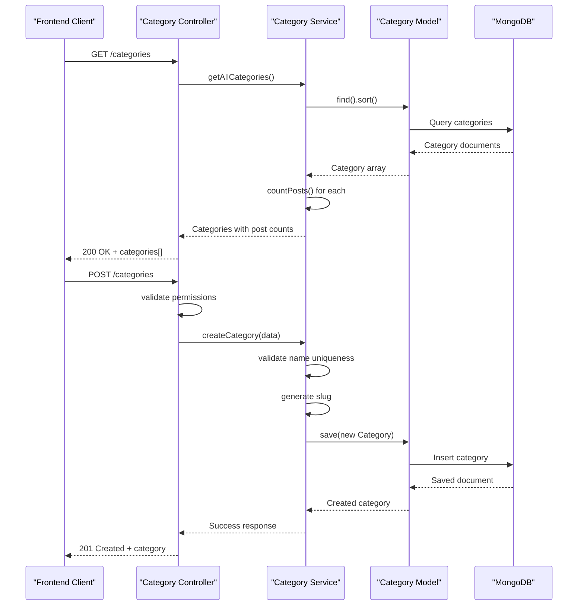
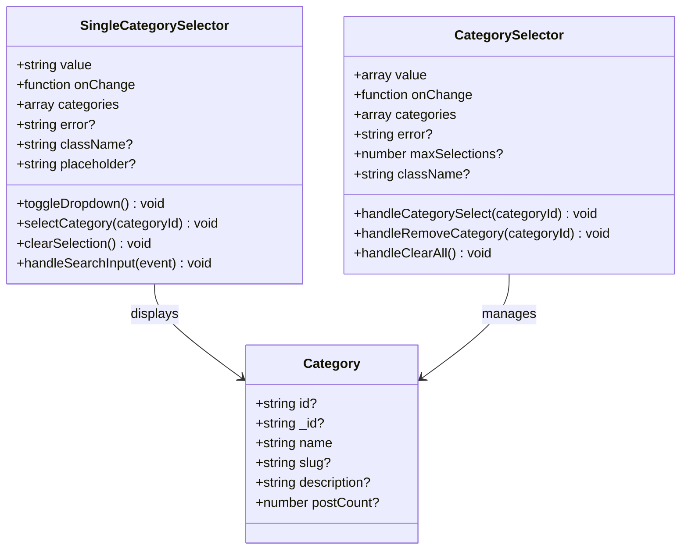
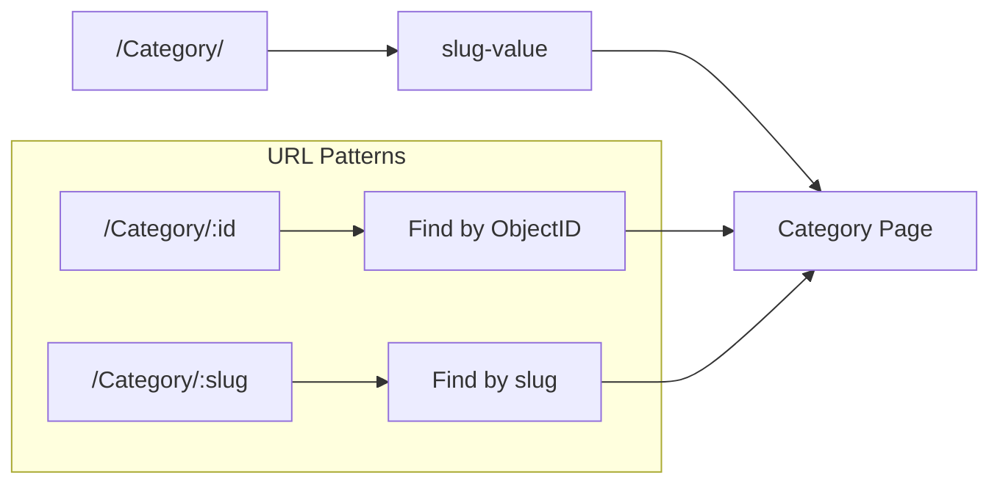

# Category Model Documentation

<cite>
**Referenced Files in This Document**
- [category.model.ts](file://api-fastify/src/models/category.model.ts)
- [category.types.ts](file://api-fastify/src/types/category.types.ts)
- [category.controller.ts](file://api-fastify/src/controllers/category.controller.ts)
- [category.service.ts](file://api-fastify/src/services/category.service.ts)
- [category.routes.ts](file://api-fastify/src/routes/category.routes.ts)
- [category.schema.ts](file://api-fastify/src/schemas/category.schema.ts)
- [SingleCategorySelector.tsx](file://src/features/posts/components/PostForm/SingleCategorySelector.tsx)
- [CategorySelector.tsx](file://src/features/posts/components/PostForm/CategorySelector.tsx)
- [createCategory.tsx](file://src/pages/createCategory.tsx)
- [DelCategory.tsx](file://src/pages/DelCategory.tsx)
- [Category.tsx](file://src/pages/Category.tsx)
- [category.tsx](file://src/components/category.tsx)
</cite>

## Table of Contents
1. [Introduction](#introduction)
2. [Model Definition](#model-definition)
3. [Field Specifications](#field-specifications)
4. [Business Rules and Constraints](#business-rules-and-constraints)
5. [Relationships](#relationships)
6. [Indexing Strategy](#indexing-strategy)
7. [API Endpoints](#api-endpoints)
8. [Frontend Components](#frontend-components)
9. [URL Routing and SEO](#url-routing-and-seo)
10. [Usage Examples](#usage-examples)
11. [Performance Considerations](#performance-considerations)
12. [Troubleshooting](#troubleshooting)

## Introduction

The Category model in the MERN_chatai_blog application serves as the foundation for organizing blog posts into thematic groups. This comprehensive model supports hierarchical categorization, SEO-friendly URLs through slugs, and efficient querying capabilities. The model is designed to handle both single and multi-category scenarios while maintaining data integrity and performance.

## Model Definition

The Category model is built using Mongoose ODM and defines the structure for storing category information in MongoDB.



**Diagram sources**
- [category.model.ts](file://api-fastify/src/models/category.model.ts#L1-L45)
- [category.types.ts](file://api-fastify/src/types/category.types.ts#L1-L38)

**Section sources**
- [category.model.ts](file://api-fastify/src/models/category.model.ts#L1-L45)
- [category.types.ts](file://api-fastify/src/types/category.types.ts#L1-L38)

## Field Specifications

### Core Fields

#### name
- **Type**: `String`
- **Required**: Yes
- **Constraints**: 
  - Minimum length: 2 characters
  - Maximum length: 50 characters
  - Unique constraint enforced at database level
  - Trimmed automatically
- **Purpose**: Human-readable category name displayed in UI components
- **Validation**: Enforced through schema definition and business logic

#### slug
- **Type**: `String`
- **Required**: Yes
- **Constraints**:
  - Unique constraint enforced at database level
  - Automatically generated from name field
  - Lowercase conversion applied
  - Trimmed automatically
- **Purpose**: SEO-friendly URL identifier for category pages
- **Generation**: Created using `generateSlug()` utility function
- **Usage**: Used in URL routing and category page identification

#### description
- **Type**: `String`
- **Optional**: Yes
- **Constraints**:
  - Maximum length: 500 characters
  - Trimmed automatically
- **Purpose**: Detailed explanation of category content and scope
- **Display**: Shown on category pages and in admin interfaces

#### image
- **Type**: `String`
- **Optional**: Yes
- **Purpose**: Category thumbnail or icon URL
- **Usage**: Displayed in category cards and selectors

#### parent
- **Type**: `ObjectId`
- **Reference**: References another Category document
- **Optional**: Yes
- **Purpose**: Enables hierarchical category structure
- **Relationship**: Self-referencing through `ref: 'Category'`

**Section sources**
- [category.model.ts](file://api-fastify/src/models/category.model.ts#L5-L35)
- [category.types.ts](file://api-fastify/src/types/category.types.ts#L6-L12)

## Business Rules and Constraints

### Uniqueness Constraints

The Category model enforces several uniqueness constraints:

1. **Name Uniqueness**: No two categories can share the same name
2. **Slug Uniqueness**: No two categories can have identical slugs
3. **Hierarchical Integrity**: Prevents circular references in parent-child relationships

### Validation Rules



**Diagram sources**
- [category.service.ts](file://api-fastify/src/services/category.service.ts#L67-L120)

### Administrative Management

The system restricts category management operations to authorized users:

- **Creation**: Requires admin or author role
- **Updates**: Restricted to authenticated admins
- **Deletions**: Admin-only operation with safety checks
- **Permissions**: Implemented through middleware authentication

**Section sources**
- [category.service.ts](file://api-fastify/src/services/category.service.ts#L67-L120)
- [category.controller.ts](file://api-fastify/src/controllers/category.controller.ts#L100-L140)

## Relationships

### Hierarchical Structure

The Category model supports hierarchical categorization through the parent field:



**Diagram sources**
- [category.model.ts](file://api-fastify/src/models/category.model.ts#L28-L32)

### Category-Post Relationship

Categories are linked to posts through a many-to-many relationship:

- **Single Category Assignment**: Each post can belong to one primary category
- **Multi-Category Support**: Posts can reference multiple categories through the `categories` array
- **Post Count Calculation**: Automatic counting of published posts per category

**Section sources**
- [category.service.ts](file://api-fastify/src/services/category.service.ts#L12-L25)

## Indexing Strategy

### Database Indexes

The Category model implements strategic indexing for optimal performance:

```typescript
// Automatic slug index (unique: true creates index)
categorySchema.index({ parent: 1 });
```

### Index Purpose and Benefits

1. **Primary Index**: Automatic unique index on slug for fast lookups
2. **Parent Index**: Separate index on parent field for hierarchical queries
3. **Composite Indexes**: Potential for future composite indexes on frequently queried fields

### Performance Optimization

- **Slug Lookups**: O(1) average case for category retrieval by slug
- **Hierarchical Queries**: Efficient parent-child relationship traversals
- **Sorting**: Natural alphabetical sorting by name field

**Section sources**
- [category.model.ts](file://api-fastify/src/models/category.model.ts#L37-L40)

## API Endpoints

### Complete REST API

The Category model exposes a comprehensive REST API with CRUD operations:



**Diagram sources**
- [category.controller.ts](file://api-fastify/src/controllers/category.controller.ts#L10-L25)
- [category.service.ts](file://api-fastify/src/services/category.service.ts#L12-L25)

### Endpoint Details

#### GET /categories
- **Purpose**: Retrieve all categories with post counts
- **Response**: Array of categories with `postCount` field
- **Use Case**: Admin dashboard, category selectors

#### GET /categories/:idOrSlug
- **Purpose**: Fetch specific category by ID or slug
- **Parameters**: `idOrSlug` (string)
- **Response**: Single category with post count
- **Use Case**: Category pages, post filtering

#### POST /categories
- **Purpose**: Create new category
- **Authentication**: Admin required
- **Validation**: Name uniqueness, slug generation
- **Response**: Created category with minimal data

#### PUT /categories/:id
- **Purpose**: Update existing category
- **Authentication**: Admin required
- **Validation**: Name uniqueness, parent validation
- **Response**: Updated category data

#### DELETE /categories/:id
- **Purpose**: Remove category
- **Authentication**: Admin required
- **Safety Checks**: Prevents deletion of used categories
- **Response**: Success confirmation

**Section sources**
- [category.routes.ts](file://api-fastify/src/routes/category.routes.ts#L15-L70)
- [category.controller.ts](file://api-fastify/src/controllers/category.controller.ts#L10-L235)

## Frontend Components

### Category Selector Components

The application provides specialized components for category selection:

#### SingleCategorySelector
- **Purpose**: Simplified single category selection
- **Features**: Search functionality, dropdown menu
- **Use Case**: Post creation forms requiring single category assignment
- **Implementation**: Supports both `id` and `_id` field variations

#### CategorySelector
- **Purpose**: Multi-category selection for posts
- **Features**: Multiple selection, max limit enforcement
- **Use Case**: Advanced post editing with multiple categories
- **Limit**: Maximum 5 categories per post



**Diagram sources**
- [SingleCategorySelector.tsx](file://src/features/posts/components/PostForm/SingleCategorySelector.tsx#L15-L25)
- [CategorySelector.tsx](file://src/features/posts/components/PostForm/CategorySelector.tsx#L10-L18)

### Admin Management Pages

#### CreateCategory Page
- **Purpose**: Admin interface for category creation
- **Features**: Form validation, permission checking, success/error feedback
- **Security**: Requires author/admin role verification

#### DeleteCategories Page
- **Purpose**: Bulk category management and deletion
- **Features**: Search, select multiple, confirmation dialog
- **Safety**: Prevents deletion of categories in use by posts

**Section sources**
- [SingleCategorySelector.tsx](file://src/features/posts/components/PostForm/SingleCategorySelector.tsx#L1-L271)
- [CategorySelector.tsx](file://src/features/posts/components/PostForm/CategorySelector.tsx#L1-L233)
- [createCategory.tsx](file://src/pages/createCategory.tsx#L1-L280)
- [DelCategory.tsx](file://src/pages/DelCategory.tsx#L1-L427)

## URL Routing and SEO

### Slug-Based Routing

The Category model enables SEO-friendly URL structures:



**Diagram sources**
- [category.routes.ts](file://api-fastify/src/routes/category.routes.ts#L25-L35)

### SEO Considerations

1. **Clean URLs**: Slugs provide readable, search-engine-friendly URLs
2. **Canonical Paths**: Single canonical URL for each category
3. **Meta Information**: Automatic inclusion of category metadata in responses
4. **Breadcrumbs**: Hierarchical navigation structure for better UX

### Routing Implementation

The system supports dual routing mechanisms:

- **ID-based**: Direct MongoDB ObjectId lookup
- **Slug-based**: Friendly URL slug matching
- **Fallback**: Automatic fallback between both methods

**Section sources**
- [category.routes.ts](file://api-fastify/src/routes/category.routes.ts#L25-L35)
- [category.service.ts](file://api-fastify/src/services/category.service.ts#L32-L44)

## Usage Examples

### Creating a Category

```typescript
// Example: Creating a new category
const categoryData = {
  name: "Technology",
  description: "Latest tech news and trends",
  image: "/images/tech.jpg",
  parent: "654321098765432109876543" // Optional parent category ID
};

const result = await CategoryService.createCategory(categoryData);
// Result: { _id: "765432109876543210987654", name: "Technology", slug: "technology" }
```

### Retrieving Categories with Post Counts

```typescript
// Example: Getting categories with post counts
const categories = await CategoryService.getAllCategories();
// Returns: [{ _id: "123", name: "Tech", slug: "tech", postCount: 15 }]
```

### Filtering Posts by Category

```typescript
// Example: Category page implementation
const category = await CategoryService.getCategoryByIdOrSlug("technology");
const posts = await PostService.getPostsByCategory(category._id);
// Automatically filters posts belonging to this category
```

### Hierarchical Category Structure

```typescript
// Example: Building category hierarchy
const parentCategory = await Category.findById(parentId);
const childCategories = await Category.find({ parent: parentId });
// Creates tree-like structure for navigation menus
```

**Section sources**
- [category.service.ts](file://api-fastify/src/services/category.service.ts#L67-L120)
- [category.service.ts](file://api-fastify/src/services/category.service.ts#L12-L25)

## Performance Considerations

### Query Optimization

1. **Index Usage**: Strategic indexes on frequently queried fields
2. **Population**: Efficient population of parent category data
3. **Projection**: Minimal field selection for read-heavy operations
4. **Caching**: Potential for caching category lists and metadata

### Scalability Features

- **Hierarchical Efficiency**: Optimized queries for parent-child relationships
- **Slug Lookup**: O(1) average case performance for category identification
- **Batch Operations**: Efficient bulk category operations in admin interface
- **Memory Management**: Proper cleanup of category-related components

### Monitoring and Metrics

- **Post Count Accuracy**: Regular synchronization of post counts
- **Query Performance**: Monitoring of category retrieval operations
- **Index Effectiveness**: Tracking of index usage statistics

## Troubleshooting

### Common Issues and Solutions

#### Category Creation Failures

**Issue**: "Category with this name exists"
- **Cause**: Duplicate name in database
- **Solution**: Choose unique name or modify existing category

**Issue**: "Parent not found"
- **Cause**: Invalid or non-existent parent category ID
- **Solution**: Verify parent category exists and ID is correct

**Issue**: "Circular reference detected"
- **Cause**: Attempting to set category as its own ancestor
- **Solution**: Break circular relationship chain

#### Retrieval Problems

**Issue**: Category not found by slug
- **Cause**: Slug mismatch or category deleted
- **Solution**: Verify slug spelling and category existence

**Issue**: Empty category list
- **Cause**: No categories created or query filter issue
- **Solution**: Check database records and query parameters

#### Performance Issues

**Issue**: Slow category loading
- **Cause**: Missing indexes or inefficient queries
- **Solution**: Verify index creation and optimize queries

**Issue**: Memory leaks in category selectors
- **Cause**: Improper cleanup of event listeners
- **Solution**: Ensure proper component unmounting

### Debugging Tools

1. **Console Logging**: Built-in debug statements in category components
2. **Database Queries**: Direct MongoDB query inspection
3. **Network Monitoring**: API endpoint response analysis
4. **Component State**: React DevTools for component debugging

**Section sources**
- [category.service.ts](file://api-fastify/src/services/category.service.ts#L67-L120)
- [category.controller.ts](file://api-fastify/src/controllers/category.controller.ts#L100-L140)