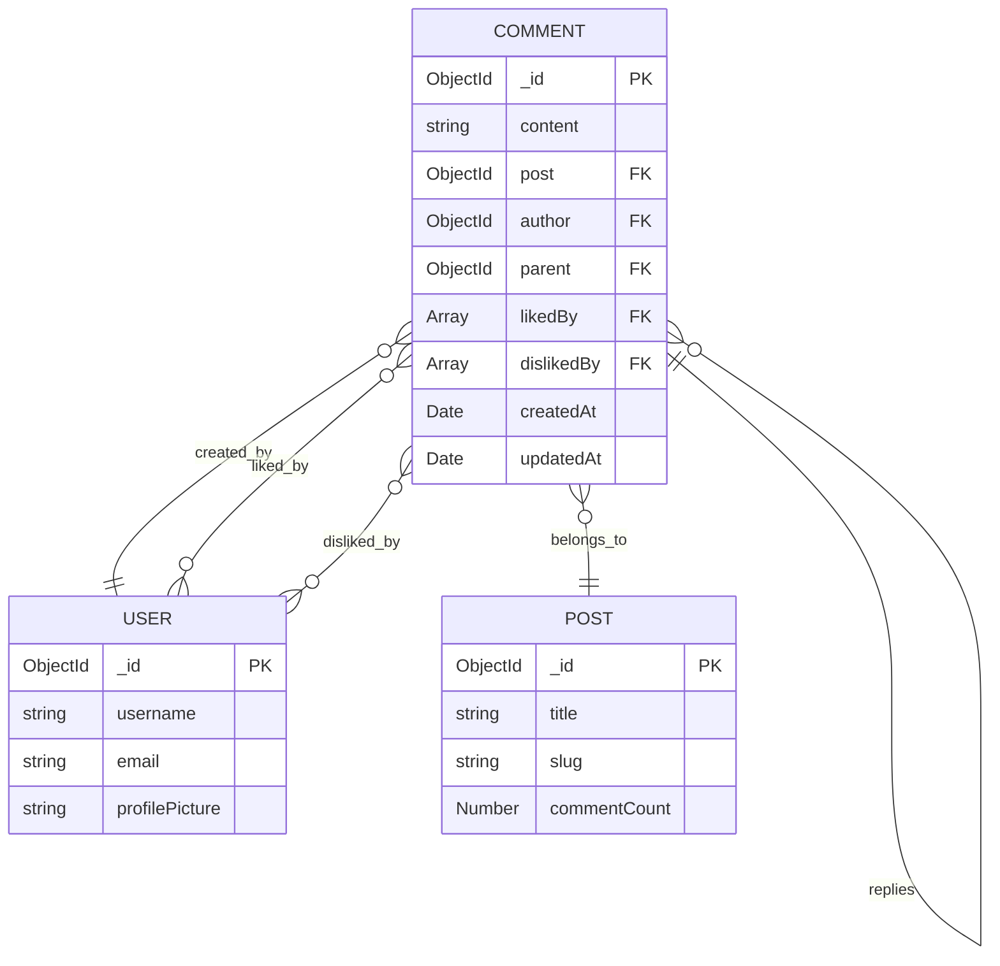
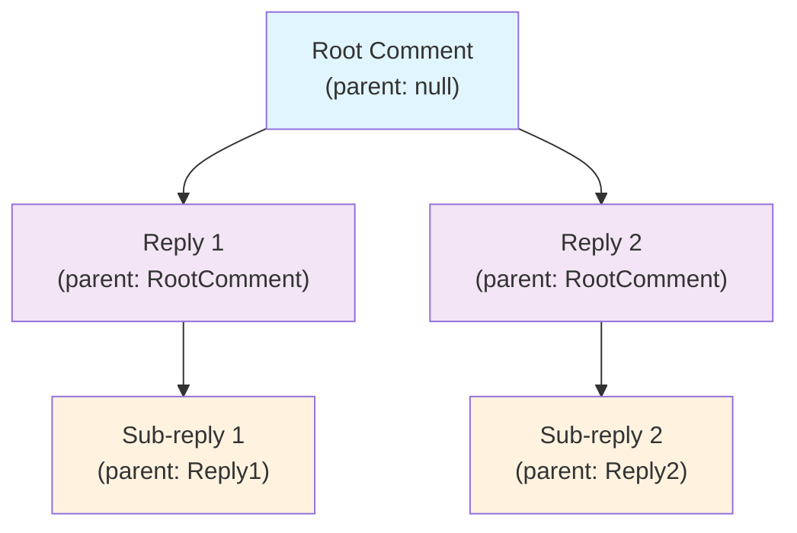
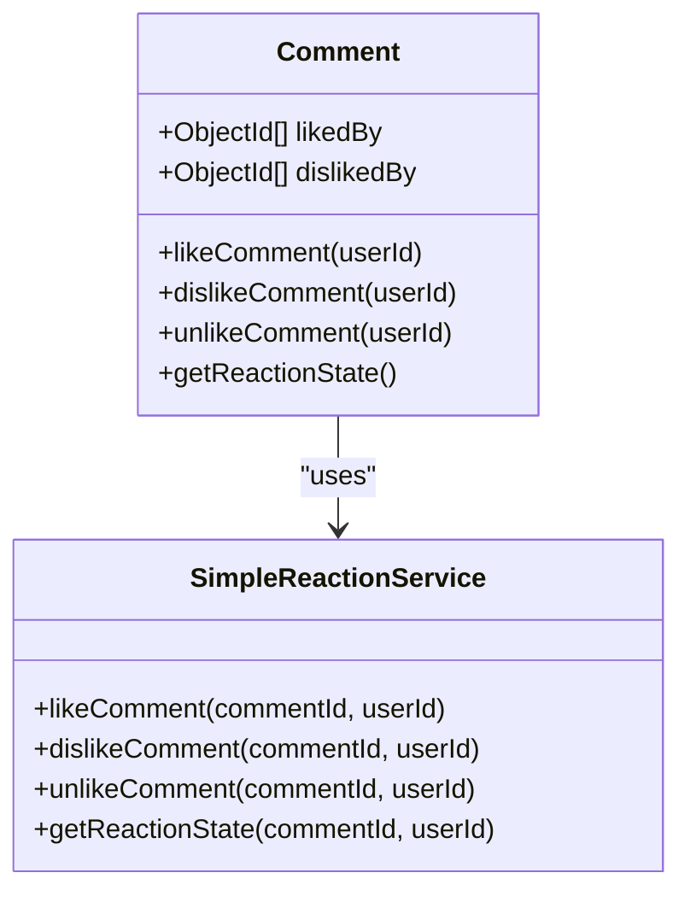
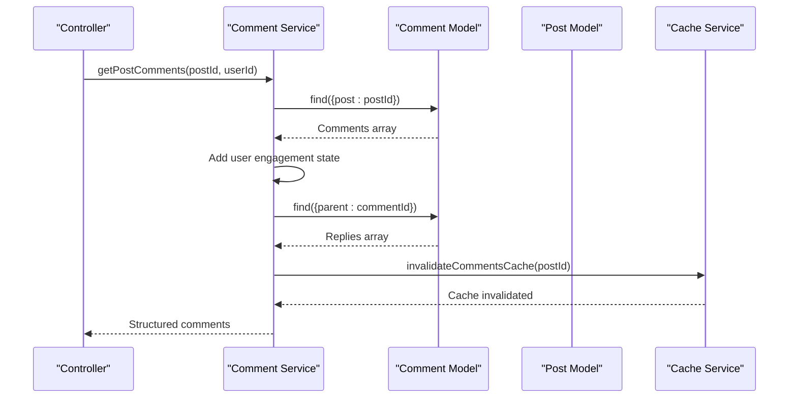
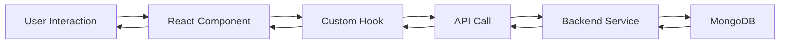

# Comment Model Documentation

<cite>
**Referenced Files in This Document**
- [comment.model.ts](file://api-fastify/src/models/comment.model.ts)
- [comment.types.ts](file://api-fastify/src/types/comment.types.ts)
- [comment.schema.ts](file://api-fastify/src/schemas/comment.schema.ts)
- [comment.controller.ts](file://api-fastify/src/controllers/comment.controller.ts)
- [comment.service.ts](file://api-fastify/src/services/comment.service.ts)
- [simple-reaction.service.ts](file://api-fastify/src/services/simple-reaction.service.ts)
- [CommentReactions.tsx](file://src/components/CommentReactions.tsx)
- [useCommentReactions.ts](file://src/hooks/useCommentReactions.ts)
- [post.model.ts](file://api-fastify/src/models/post.model.ts)
</cite>

## Table of Contents
1. [Introduction](#introduction)
2. [Model Architecture](#model-architecture)
3. [Field Definitions](#field-definitions)
4. [Recursive Structure](#recursive-structure)
5. [Engagement Metrics](#engagement-metrics)
6. [Data Validation](#data-validation)
7. [Indexing Strategies](#indexing-strategies)
8. [Service Layer Implementation](#service-layer-implementation)
9. [Controller Layer](#controller-layer)
10. [Frontend Integration](#frontend-integration)
11. [Moderation and Security](#moderation-and-security)
12. [Performance Considerations](#performance-considerations)
13. [Sample Data and Usage Examples](#sample-data-and-usage-examples)
14. [Troubleshooting Guide](#troubleshooting-guide)

## Introduction

The Comment model in the MERN_chatai_blog application is a sophisticated data structure designed to support threaded discussions with comprehensive engagement tracking. Built on MongoDB with Mongoose, it implements a recursive commenting system that allows users to engage with content through likes, dislikes, and hierarchical replies.

The model serves as the foundation for community interaction, enabling users to participate in meaningful discussions while maintaining performance and scalability through strategic indexing and caching mechanisms.

## Model Architecture

The Comment model follows a hierarchical structure that enables threaded conversations within blog posts. The architecture is built around MongoDB's flexible document model, leveraging references to maintain relationships between comments, users, and posts.



**Diagram sources**
- [comment.model.ts](file://api-fastify/src/models/comment.model.ts#L1-L78)
- [post.model.ts](file://api-fastify/src/models/post.model.ts#L1-L136)

**Section sources**
- [comment.model.ts](file://api-fastify/src/models/comment.model.ts#L1-L78)
- [comment.types.ts](file://api-fastify/src/types/comment.types.ts#L1-L49)

## Field Definitions

### Core Fields

The Comment model defines several essential fields that capture the fundamental aspects of user-generated content:

#### Content Field
- **Type**: `String`
- **Required**: Yes
- **Constraints**: 
  - `trim`: Removes leading/trailing whitespace
  - `minlength`: 1 character minimum
  - `maxlength`: 1000 characters maximum
- **Purpose**: Stores the actual comment text content

#### Relationship Fields

##### Post Reference
- **Type**: `ObjectId`
- **Reference**: `'Post'`
- **Required**: Yes
- **Purpose**: Links comments to their parent blog post
- **Index**: Composite index with `createdAt` for optimal sorting

##### Author Reference
- **Type**: `ObjectId`
- **Reference**: `'User'`
- **Required**: Yes
- **Purpose**: Identifies the user who created the comment
- **Index**: Individual index for author-based queries

##### Parent Reference
- **Type**: `ObjectId`
- **Reference**: `'Comment'`
- **Optional**: Yes
- **Purpose**: Enables threaded discussions (replies to comments)
- **Constraint**: Prevents deep nesting (only direct replies allowed)

#### Engagement Tracking Arrays

##### LikedBy Array
- **Type**: Array of `ObjectId`
- **Reference**: `'User'`
- **Purpose**: Tracks users who liked the comment
- **Implementation**: Uses array of user references for efficient counting

##### DislikedBy Array
- **Type**: Array of `ObjectId`
- **Reference**: `'User'`
- **Purpose**: Tracks users who disliked the comment
- **Implementation**: Uses array of user references for efficient counting

**Section sources**
- [comment.model.ts](file://api-fastify/src/models/comment.model.ts#L6-L25)
- [comment.types.ts](file://api-fastify/src/types/comment.types.ts#L7-L15)

## Recursive Structure

The Comment model implements a recursive structure that enables threaded discussions within blog posts. This design allows for hierarchical comment organization while maintaining simplicity and performance.



**Diagram sources**
- [comment.model.ts](file://api-fastify/src/models/comment.model.ts#L26-L30)
- [comment.service.ts](file://api-fastify/src/services/comment.service.ts#L100-L120)

### Thread Management Rules

The system enforces strict rules for thread management:

1. **Single-Level Replies**: Comments can only reply to top-level comments, preventing deep nesting
2. **Parent Validation**: Each reply must belong to the same post as its parent
3. **Thread Integrity**: Deleting a parent comment automatically deletes all its replies
4. **Hierarchical Sorting**: Replies are sorted chronologically by creation date

### Implementation Details

The recursive structure is implemented through the `parent` field, which creates self-referencing relationships:

```typescript
// Top-level comment (no parent)
{
  content: "Great post!",
  post: "654321...",
  author: "789012..."
}

// Reply to a comment
{
  content: "Thanks for sharing!",
  post: "654321...", // Same post as parent
  author: "345678...",
  parent: "123456..." // References the original comment
}
```

**Section sources**
- [comment.service.ts](file://api-fastify/src/services/comment.service.ts#L100-L120)
- [comment.service.ts](file://api-fastify/src/services/comment.service.ts#L285-L310)

## Engagement Metrics

The Comment model includes comprehensive engagement tracking capabilities that enable users to express opinions and measure community interaction.

### Like/Dislike System

The engagement system is built around two primary actions:

#### Like Mechanism
- **Action**: Users can like comments to show approval
- **Behavior**: Likes are mutually exclusive with dislikes
- **Counting**: Maintains separate counts for likes and dislikes
- **User State**: Tracks individual user preferences

#### Dislike Mechanism
- **Action**: Users can dislike comments to express disagreement
- **Behavior**: Dislikes are mutually exclusive with likes
- **Counting**: Maintains separate counts for likes and dislikes
- **User State**: Tracks individual user preferences

### Data Structure for Engagement



**Diagram sources**
- [comment.model.ts](file://api-fastify/src/models/comment.model.ts#L31-L35)
- [simple-reaction.service.ts](file://api-fastify/src/services/simple-reaction.service.ts#L1-L89)

### Engagement Features

#### Real-Time Updates
- **Immediate Feedback**: Users receive instant feedback on their reactions
- **Visual Indicators**: Color-coded buttons indicate current user state
- **Count Synchronization**: Like/dislike counts update in real-time

#### Conflict Resolution
- **Mutual Exclusivity**: Users can only like or dislike a comment, not both
- **State Management**: Clear indication of current user action (like/dislike/neutral)
- **Atomic Operations**: Reaction changes are handled atomically to prevent race conditions

**Section sources**
- [simple-reaction.service.ts](file://api-fastify/src/services/simple-reaction.service.ts#L1-L89)
- [CommentReactions.tsx](file://src/components/CommentReactions.tsx#L1-L101)

## Data Validation

The Comment model implements comprehensive validation rules to ensure data integrity and user experience quality.

### Content Validation

#### Length Restrictions
- **Minimum Length**: 1 character (ensures meaningful content)
- **Maximum Length**: 1000 characters (prevents abuse and storage bloat)
- **Trimming**: Automatic whitespace removal for cleaner display

#### Content Sanitization
- **Whitespace Handling**: Leading and trailing spaces are automatically trimmed
- **HTML Safety**: While not explicitly mentioned, the system likely implements HTML sanitization elsewhere
- **Character Limits**: Prevents excessively long comments that could impact performance

### Relationship Validation

#### Post Validation
- **Existence Check**: Ensures referenced posts exist before accepting comments
- **Object ID Validation**: Validates MongoDB ObjectIDs for proper format
- **Type Safety**: Strong typing ensures proper reference handling

#### Parent Comment Validation
- **Existence Verification**: Confirms parent comments exist when replying
- **Post Consistency**: Verifies parent comments belong to the same post
- **Nesting Prevention**: Enforces single-level reply hierarchy

### User Permission Validation

The system implements role-based access control for comment management:

#### Creation Permissions
- **Authenticated Users**: Only logged-in users can create comments
- **Content Quality**: Enforces minimum content length requirements
- **Rate Limiting**: Implicit protection against spam through authentication

#### Modification Permissions
- **Author Rights**: Original authors can edit their own comments
- **Admin Privileges**: Administrators have full modification rights
- **Conflict Resolution**: Clear error messaging for permission denials

**Section sources**
- [comment.model.ts](file://api-fastify/src/models/comment.model.ts#L8-L12)
- [comment.service.ts](file://api-fastify/src/services/comment.service.ts#L100-L120)
- [comment.controller.ts](file://api-fastify/src/controllers/comment.controller.ts#L150-L180)

## Indexing Strategies

The Comment model employs strategic indexing to optimize query performance across various use cases.

### Primary Indexes

#### Post and Creation Date Index
```javascript
commentSchema.index({ post: 1, createdAt: -1 });
```
- **Purpose**: Optimizes comment retrieval by post with chronological ordering
- **Benefit**: Enables efficient pagination and recent comments display
- **Use Case**: Main comment listing for blog posts

#### Parent Comment Index
```javascript
commentSchema.index({ parent: 1 });
```
- **Purpose**: Accelerates reply retrieval and thread navigation
- **Benefit**: Improves performance for threaded discussions
- **Use Case**: Loading replies to specific comments

#### Author Index
```javascript
commentSchema.index({ author: 1 });
```
- **Purpose**: Supports user activity tracking and profile views
- **Benefit**: Enables quick retrieval of user's comments
- **Use Case**: User comment history and moderation

### Index Benefits

#### Query Performance
- **Comment Retrieval**: Fast loading of comments by post ID
- **Thread Navigation**: Efficient reply fetching for threaded discussions
- **User Queries**: Quick access to user-specific comment data

#### Scalability
- **Horizontal Scaling**: Indexes support distributed database deployments
- **Memory Efficiency**: Selective indexing minimizes memory overhead
- **Maintenance Cost**: Balanced index count reduces maintenance burden

### Index Maintenance

The system includes automatic index maintenance through:

- **Automatic Index Creation**: MongoDB handles index creation and updates
- **Query Optimization**: MongoDB optimizer selects appropriate indexes
- **Storage Efficiency**: Indexes are stored efficiently to minimize disk usage

**Section sources**
- [comment.model.ts](file://api-fastify/src/models/comment.model.ts#L37-L41)

## Service Layer Implementation

The Comment service layer provides comprehensive business logic for comment management, implementing all CRUD operations along with advanced features like threading and engagement tracking.

### Core Service Functions

#### Comment Retrieval
```typescript
export const getPostComments = async (
  postId: string,
  parentId?: string,
  page: number = 1,
  limit: number = 10,
  currentUserId?: string
)
```

This function handles complex comment retrieval scenarios:

1. **Post Filtering**: Retrieves comments belonging to a specific post
2. **Thread Support**: Can fetch either top-level comments or replies
3. **Pagination**: Implements efficient pagination with configurable limits
4. **User Context**: Adds user-specific engagement state (liked/disliked)
5. **Nested Replies**: Automatically retrieves and structures reply hierarchies

#### Comment Creation
```typescript
export const createComment = async (commentData: CreateCommentInput, authorId: string)
```

The creation process includes comprehensive validation:

1. **Post Existence**: Verifies target post exists
2. **Parent Validation**: Ensures parent comments are valid and belong to same post
3. **Nesting Prevention**: Enforces single-level reply hierarchy
4. **Authorship**: Associates comment with authenticated user
5. **Counter Updates**: Increments post comment counter automatically

#### Engagement Management
```typescript
export const likeComment = async (id: string, userId: string)
export const dislikeComment = async (id: string, userId: string)
export const unlikeComment = async (id: string, userId: string)
```

These functions implement atomic engagement operations with conflict resolution:

1. **State Validation**: Checks current user state before applying changes
2. **Mutual Exclusivity**: Ensures likes and dislikes remain mutually exclusive
3. **Atomic Updates**: Uses MongoDB's atomic operations for consistency
4. **Cache Invalidation**: Triggers cache updates for affected posts

### Service Architecture



**Diagram sources**
- [comment.service.ts](file://api-fastify/src/services/comment.service.ts#L10-L50)
- [comment.controller.ts](file://api-fastify/src/controllers/comment.controller.ts#L15-L50)

**Section sources**
- [comment.service.ts](file://api-fastify/src/services/comment.service.ts#L1-L333)

## Controller Layer

The Comment controller layer manages HTTP requests and responses, implementing comprehensive error handling and user authentication.

### Request Processing

#### Authentication and Authorization
- **User Validation**: Extracts user ID from authentication token
- **Role Checking**: Verifies user permissions for administrative actions
- **Request Sanitization**: Validates and sanitizes incoming request data

#### Error Handling Strategy
The controller implements a layered error handling approach:

1. **Validation Errors**: Immediate rejection with descriptive messages
2. **Business Logic Errors**: Specific error codes for different failure modes
3. **System Errors**: Generic error handling with logging
4. **Permission Errors**: Clear messaging for unauthorized actions

### Endpoint Implementation

#### GET Endpoints
- **`/comments/:post`**: Retrieve comments for a specific post
- **`/comments/:id`**: Get individual comment details
- **Query Parameters**: Support for filtering, pagination, and parent-based retrieval

#### POST Endpoints
- **`/comments`**: Create new comments with content validation
- **`/comments/:id/like`**: Handle like actions with user state checking
- **`/comments/:id/dislike`**: Handle dislike actions with mutual exclusivity

#### PUT/DELETE Endpoints
- **`/comments/:id`**: Update existing comments with permission validation
- **`/comments/:id`**: Delete comments with cascade deletion for replies

### Response Formatting

The controller ensures consistent response formatting across all endpoints:

```typescript
// Standard response structure
{
  message: "Operation successful",
  comment: { /* formatted comment data */ },
  likes: [], // engagement data
  dislikes: [] // engagement data
}
```

**Section sources**
- [comment.controller.ts](file://api-fastify/src/controllers/comment.controller.ts#L1-L486)

## Frontend Integration

The Comment model integrates seamlessly with the React frontend through dedicated components and hooks that manage user interactions and state synchronization.

### React Component Architecture

#### CommentReactions Component
```typescript
interface CommentReactionsProps {
  commentId: string
  userId?: string
  initialLikes: string[]
  initialDislikes: string[]
}
```

This component provides interactive engagement controls:

1. **Visual Feedback**: Color-coded buttons indicate current user state
2. **Real-Time Updates**: Immediate UI updates after user actions
3. **Loading States**: Clear indication during network operations
4. **Accessibility**: Proper button semantics and keyboard navigation

#### Hook-Based State Management
```typescript
export const useCommentReactions = (commentId: string, userId?: string)
```

The custom hook provides centralized state management:

1. **State Synchronization**: Keeps local state in sync with backend
2. **Error Handling**: Centralized error reporting and user feedback
3. **Debouncing**: Prevents rapid successive API calls
4. **Cleanup**: Proper cleanup of event listeners and timers

### API Integration Patterns

#### HTTP Methods and Endpoints
- **GET**: `/api/comments/:postId` - Retrieve comments for a post
- **POST**: `/api/comments/:id/like` - Handle like actions
- **POST**: `/api/comments/:id/dislike` - Handle dislike actions
- **PUT**: `/api/comments/:id` - Update existing comments
- **DELETE**: `/api/comments/:id` - Remove comments

#### Data Flow Architecture


**Diagram sources**
- [CommentReactions.tsx](file://src/components/CommentReactions.tsx#L1-L101)
- [useCommentReactions.ts](file://src/hooks/useCommentReactions.ts#L1-L92)

**Section sources**
- [CommentReactions.tsx](file://src/components/CommentReactions.tsx#L1-L101)
- [useCommentReactions.ts](file://src/hooks/useCommentReactions.ts#L1-L92)

## Moderation and Security

The Comment model implements comprehensive security measures and moderation capabilities to maintain a healthy community environment.

### Access Control

#### Role-Based Permissions
- **Author Modification**: Original comment authors can edit their own content
- **Admin Privileges**: Administrators have full comment management rights
- **Content Removal**: Authorized users can remove inappropriate content
- **Cascade Deletion**: Deleting parent comments removes all associated replies

#### Authentication Requirements
- **Comment Creation**: Requires authenticated user session
- **Engagement Actions**: Users must be logged in to like/dislike
- **Edit/Delete Actions**: Additional permission checks for modifications

### Spam Prevention

#### Rate Limiting
While not explicitly implemented in the model, the system supports rate limiting through:

1. **Authentication-Based Limits**: Different limits for authenticated vs. anonymous users
2. **IP-Based Tracking**: Potential for IP-based rate limiting
3. **Content Analysis**: Integration with content filtering services

#### Content Validation
- **Length Restrictions**: Prevents spammy short comments
- **Duplicate Detection**: Potential for duplicate content detection
- **Profanity Filtering**: Integration with content filtering services

### Moderation Features

#### Comment Management
- **Soft Deletion**: Comments can be hidden rather than permanently removed
- **Flagging System**: Users can flag inappropriate content
- **Approval Workflow**: Support for moderated content publishing

#### User Reporting
- **Report Mechanism**: Users can report comments for review
- **Automated Detection**: Potential for automated spam detection
- **Escalation Path**: Clear process for handling reported content

**Section sources**
- [comment.service.ts](file://api-fastify/src/services/comment.service.ts#L231-L284)
- [comment.controller.ts](file://api-fastify/src/controllers/comment.controller.ts#L200-L250)

## Performance Considerations

The Comment model is designed with performance optimization in mind, implementing several strategies to ensure scalable operation under varying load conditions.

### Database Optimization

#### Index Strategy
The model employs targeted indexing to optimize common query patterns:

1. **Post-Based Queries**: `{ post: 1, createdAt: -1 }` for chronological comment lists
2. **Thread Navigation**: `{ parent: 1 }` for reply retrieval
3. **User Queries**: `{ author: 1 }` for user activity tracking

#### Query Optimization
- **Selective Population**: Only populate necessary fields (username, profile picture)
- **Projection**: Use field projection to minimize data transfer
- **Batch Operations**: Group related operations for efficiency

### Caching Strategy

#### Cache Invalidation
The system implements intelligent cache invalidation:

```typescript
// Automatic cache invalidation on comment operations
try {
  const doc = await Comment.findById(id).select('post');
  const postId = doc?.post?.toString() || '';
  const { invalidateCommentsCache } = await import('../utils/cache-invalidation.js');
  await invalidateCommentsCache(postId);
} catch (e) {
  request.log.warn('Cache invalidation failed: %s', (e as Error).message);
}
```

#### Cache Benefits
- **Reduced Database Load**: Frequently accessed data served from cache
- **Faster Response Times**: Reduced latency for comment operations
- **Scalability**: Improved horizontal scaling capabilities

### Memory Management

#### Efficient Data Structures
- **Array References**: Using arrays of ObjectIds instead of embedded documents
- **Sparse Indexes**: Indexes only where they provide benefit
- **Connection Pooling**: Efficient database connection management

### Scalability Features

#### Horizontal Scaling
- **Sharding Support**: Indexes support sharded database deployments
- **Replication**: Read operations can be distributed across replicas
- **Load Balancing**: API requests can be load-balanced across instances

#### Performance Monitoring
- **Query Analytics**: Track slow queries and optimize accordingly
- **Resource Usage**: Monitor memory and CPU usage patterns
- **Capacity Planning**: Predict future resource needs based on growth trends

**Section sources**
- [comment.model.ts](file://api-fastify/src/models/comment.model.ts#L37-L41)
- [comment.controller.ts](file://api-fastify/src/controllers/comment.controller.ts#L200-L250)

## Sample Data and Usage Examples

### Basic Comment Creation

```javascript
// Creating a top-level comment
const commentData = {
  content: "This is a great article!",
  post: "654321...",
  author: "789012..."
};

// Creating a reply to a comment
const replyData = {
  content: "I agree completely!",
  post: "654321...", // Must match parent post
  author: "345678...",
  parent: "123456..." // References the parent comment
};
```

### Engagement Example

```javascript
// User liking a comment
const likeResponse = {
  message: "Réaction mise à jour avec succès",
  likes: ["789012...", "345678..."],
  dislikes: [],
  likeCount: 2,
  dislikeCount: 0,
  isLiked: true,
  isDisliked: false
};
```

### Threaded Discussion Structure

```javascript
// Sample comment tree structure
const comments = [
  {
    _id: "123456",
    content: "Great post!",
    author: { _id: "789012", username: "john_doe" },
    replies: [
      {
        _id: "654321",
        content: "Thanks for sharing!",
        author: { _id: "345678", username: "jane_smith" },
        // No further nesting
      }
    ]
  }
];
```

### API Usage Examples

#### Retrieving Comments
```bash
GET /api/comments/654321?parent=123456&page=1&limit=10
```

#### Creating a Comment
```bash
POST /api/comments
{
  "content": "Excellent analysis!",
  "post": "654321",
  "parent": "123456"
}
```

#### Engaging with Comments
```bash
POST /api/comments/123456/like
# or
POST /api/comments/123456/dislike
```

**Section sources**
- [comment.service.ts](file://api-fastify/src/services/comment.service.ts#L100-L150)
- [comment.schema.ts](file://api-fastify/src/schemas/comment.schema.ts#L165-L226)

## Troubleshooting Guide

### Common Issues and Solutions

#### Comment Creation Failures

**Issue**: "ID article invalide" error
**Cause**: Invalid MongoDB ObjectID format for post parameter
**Solution**: Verify the post ID is a valid 24-character hexadecimal string

**Issue**: "Commentaire parent non trouvé" error
**Cause**: Parent comment does not exist or was deleted
**Solution**: Ensure parent comment exists and belongs to the same post

**Issue**: "Les réponses imbriquées ne sont pas autorisées" error
**Cause**: Attempting to reply to a reply (deep nesting)
**Solution**: Only top-level comments can have replies

#### Engagement Issues

**Issue**: "Vous avez déjà liké ce commentaire" error
**Cause**: User attempting to like a comment they've already liked
**Solution**: Check current user state before allowing actions

**Issue**: "Commentaire non trouvé" errors
**Cause**: Comment ID doesn't exist or was deleted
**Solution**: Verify comment exists before performing operations

#### Performance Issues

**Issue**: Slow comment loading
**Cause**: Missing or inefficient indexes
**Solution**: Ensure proper indexing on post, parent, and author fields

**Issue**: High memory usage during bulk operations
**Cause**: Large result sets without pagination
**Solution**: Implement proper pagination and limit result sizes

### Debugging Tools

#### Logging Configuration
```typescript
// Enable detailed logging for comment operations
console.log('getComments - currentUserId:', currentUserId);
console.log('getComments - post:', post);
console.log('getComments - user object:', request.user);
```

#### Validation Helpers
```typescript
// Use built-in validation utilities
if (!isValidObjectId(post)) {
  return reply.status(400).send({
    message: 'ID article invalide',
  });
}
```

### Monitoring and Maintenance

#### Health Checks
- **Database Connectivity**: Regular connectivity tests
- **Index Performance**: Monitor index usage and effectiveness
- **Cache Performance**: Track cache hit rates and invalidation frequency

#### Maintenance Tasks
- **Index Optimization**: Periodic index analysis and optimization
- **Data Cleanup**: Remove orphaned comments and stale engagement data
- **Performance Tuning**: Adjust query parameters based on usage patterns

**Section sources**
- [comment.service.ts](file://api-fastify/src/services/comment.service.ts#L10-L50)
- [comment.controller.ts](file://api-fastify/src/controllers/comment.controller.ts#L15-L50)