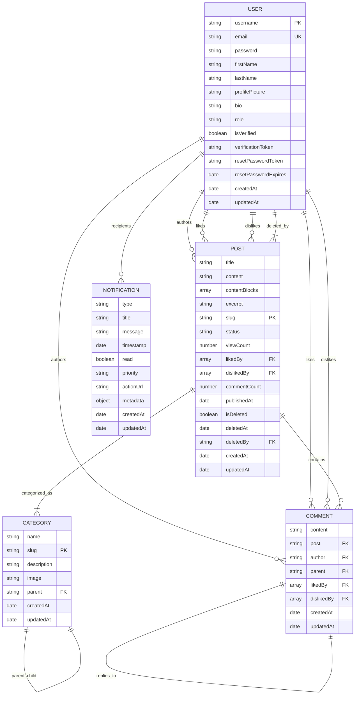
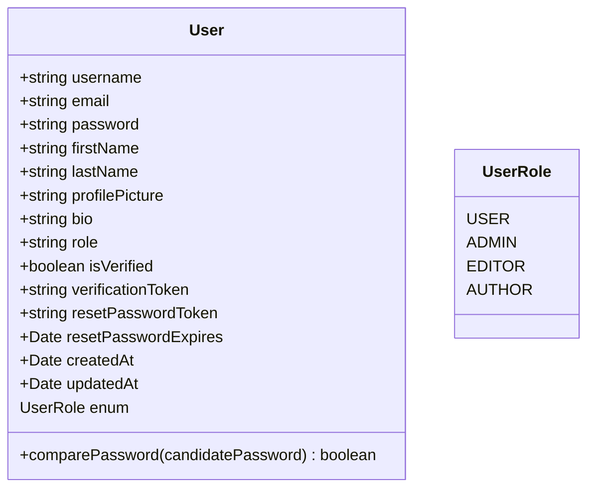
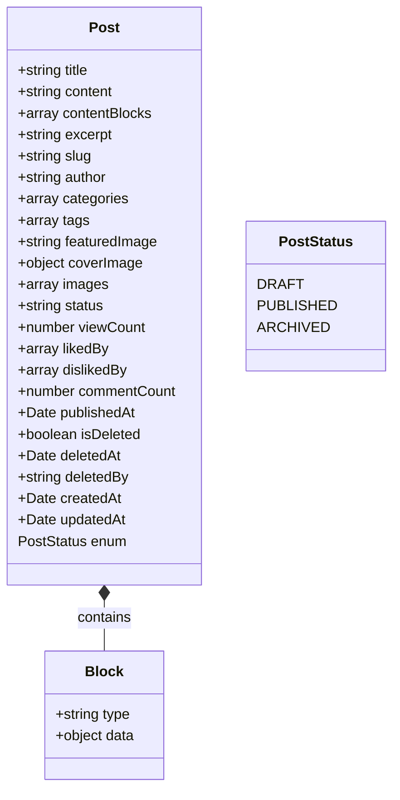
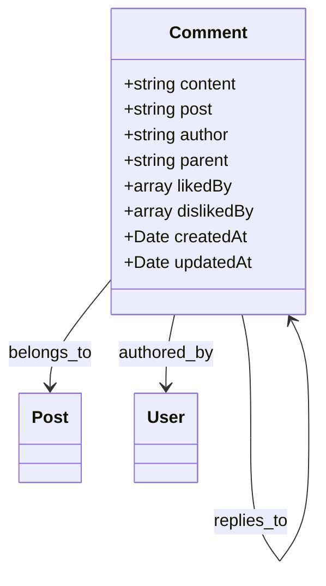
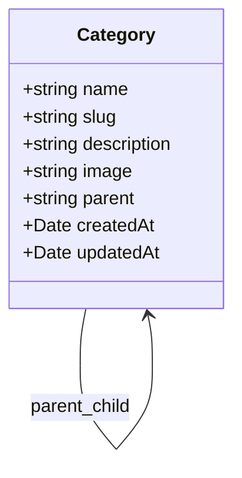
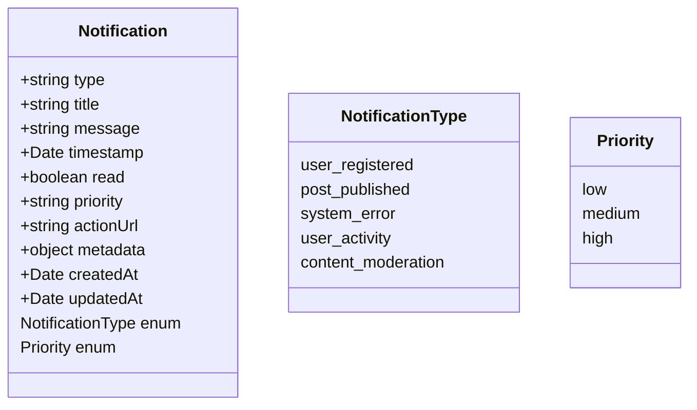

# Data Models

<cite>
**Referenced Files in This Document**   
- [user.model.ts](file://api-fastify/src/models/user.model.ts)
- [post.model.ts](file://api-fastify/src/models/post.model.ts)
- [comment.model.ts](file://api-fastify/src/models/comment.model.ts)
- [category.model.ts](file://api-fastify/src/models/category.model.ts)
- [notification.model.ts](file://api-fastify/src/models/notification.model.ts)
- [user.types.ts](file://api-fastify/src/types/user.types.ts)
- [post.types.ts](file://api-fastify/src/types/post.types.ts)
- [comment.types.ts](file://api-fastify/src/types/comment.types.ts)
- [category.types.ts](file://api-fastify/src/types/category.types.ts)
- [notification.types.ts](file://api-fastify/src/types/notification.types.ts)
- [migrate-to-tiptap.ts](file://api-fastify/src/scripts/migrate-to-tiptap.ts)
- [seed.ts](file://api-fastify/src/scripts/seed.ts)
- [database.ts](file://api-fastify/src/config/database.ts)
</cite>

## Table of Contents
1. [Introduction](#introduction)
2. [Core Data Models](#core-data-models)
3. [Entity Relationships](#entity-relationships)
4. [Data Validation and Business Rules](#data-validation-and-business-rules)
5. [Database Schema Diagrams](#database-schema-diagrams)
6. [Data Access Patterns](#data-access-patterns)
7. [Performance Considerations](#performance-considerations)
8. [Data Lifecycle Management](#data-lifecycle-management)
9. [Data Migration and Version Management](#data-migration-and-version-management)
10. [Data Security and Access Control](#data-security-and-access-control)

## Introduction
This document provides comprehensive documentation for the data models used in the MERN_chatai_blog application. The system is built on a MongoDB database with Mongoose as the ODM (Object Document Mapper), following a document-oriented data model. The core entities include User, Post, Comment, Category, and Notification, each with specific fields, relationships, and business rules implemented through Mongoose schemas. This documentation details the structure, relationships, validation rules, and operational characteristics of these models, providing a complete reference for developers and system administrators.

## Core Data Models

### User Model
The User model represents application users with authentication credentials, profile information, and role-based access control. It includes fields for username, email, password (hashed), personal information, and role designation.

**Section sources**
- [user.model.ts](file://api-fastify/src/models/user.model.ts#L1-L97)
- [user.types.ts](file://api-fastify/src/types/user.types.ts#L1-L59)

### Post Model
The Post model represents blog articles with support for both legacy plain text content and a new block-based content structure using Tiptap. Posts can be authored by users, categorized, tagged, and have various status states (draft, published, archived).

**Section sources**
- [post.model.ts](file://api-fastify/src/models/post.model.ts#L1-L136)
- [post.types.ts](file://api-fastify/src/types/post.types.ts#L1-L109)

### Comment Model
The Comment model represents user comments on blog posts, supporting both direct comments and nested replies through a parent-child relationship. Comments are associated with posts and users, and can be liked or disliked.

**Section sources**
- [comment.model.ts](file://api-fastify/src/models/comment.model.ts#L1-L78)
- [comment.types.ts](file://api-fastify/src/types/comment.types.ts#L1-L49)

### Category Model
The Category model represents content categories that can be hierarchical (supporting parent categories). Categories are used to organize posts and can have descriptive information and images.

**Section sources**
- [category.model.ts](file://api-fastify/src/models/category.model.ts#L1-L45)
- [category.types.ts](file://api-fastify/src/types/category.types.ts#L1-L38)

### Notification Model
The Notification model represents system notifications for various events such as user registration, post publication, and system errors. Notifications have types, priorities, and metadata for different use cases.

**Section sources**
- [notification.model.ts](file://api-fastify/src/models/notification.model.ts#L1-L97)
- [notification.types.ts](file://api-fastify/src/types/notification.types.ts#L1-L48)

## Entity Relationships

**Diagram sources**
- [user.model.ts](file://api-fastify/src/models/user.model.ts#L1-L97)
- [post.model.ts](file://api-fastify/src/models/post.model.ts#L1-L136)
- [comment.model.ts](file://api-fastify/src/models/comment.model.ts#L1-L78)
- [category.model.ts](file://api-fastify/src/models/category.model.ts#L1-L45)
- [notification.model.ts](file://api-fastify/src/models/notification.model.ts#L1-L97)

## Data Validation and Business Rules

### User Model Validation
The User model implements comprehensive validation rules to ensure data integrity and security:
- Username must be 3-30 characters, unique, and trimmed
- Email must be valid format, unique, and lowercase
- Password must be at least 6 characters
- Role must be one of the defined UserRole enum values
- Passwords are automatically hashed before saving using bcrypt
- Sensitive fields (password, tokens) are excluded from JSON output

**Section sources**
- [user.model.ts](file://api-fastify/src/models/user.model.ts#L1-L97)

### Post Model Validation
The Post model enforces several business rules and validation constraints:
- Title must be 3-200 characters
- Slug must be unique and lowercase
- Status must be one of PostStatus enum values (draft, published, archived)
- When status changes to published, publishedAt timestamp is automatically set
- Content can exist in both legacy (content field) and modern (contentBlocks) formats
- Featured images and cover images have structured formats

**Section sources**
- [post.model.ts](file://api-fastify/src/models/post.model.ts#L1-L136)

### Comment Model Validation
The Comment model includes validation and business logic:
- Content must be 1-1000 characters
- Comments are linked to posts and authors
- Support for nested comments via parent reference
- After saving a comment, the associated post's commentCount is incremented
- When a comment is deleted, the post's commentCount is decremented

**Section sources**
- [comment.model.ts](file://api-fastify/src/models/comment.model.ts#L1-L78)

### Category Model Validation
The Category model implements the following rules:
- Name must be 2-50 characters and unique
- Slug must be unique and lowercase
- Description limited to 500 characters
- Support for hierarchical categories through parent reference
- Categories can be nested to create a tree structure

**Section sources**
- [category.model.ts](file://api-fastify/src/models/category.model.ts#L1-L45)

### Notification Model Validation
The Notification model enforces:
- Type must be one of the defined notification types
- Title and message are required with length limits
- Priority must be low, medium, or high
- Timestamp defaults to current time
- Read status defaults to false
- Metadata can contain various contextual information depending on notification type

**Section sources**
- [notification.model.ts](file://api-fastify/src/models/notification.model.ts#L1-L97)

## Database Schema Diagrams

### User Schema

**Diagram sources**
- [user.model.ts](file://api-fastify/src/models/user.model.ts#L1-L97)
- [user.types.ts](file://api-fastify/src/types/user.types.ts#L1-L59)

### Post Schema

**Diagram sources**
- [post.model.ts](file://api-fastify/src/models/post.model.ts#L1-L136)
- [post.types.ts](file://api-fastify/src/types/post.types.ts#L1-L109)

### Comment Schema

**Diagram sources**
- [comment.model.ts](file://api-fastify/src/models/comment.model.ts#L1-L78)
- [comment.types.ts](file://api-fastify/src/types/comment.types.ts#L1-L49)

### Category Schema

**Diagram sources**
- [category.model.ts](file://api-fastify/src/models/category.model.ts#L1-L45)
- [category.types.ts](file://api-fastify/src/types/category.types.ts#L1-L38)

### Notification Schema

**Diagram sources**
- [notification.model.ts](file://api-fastify/src/models/notification.model.ts#L1-L97)
- [notification.types.ts](file://api-fastify/src/types/notification.types.ts#L1-L48)

## Data Access Patterns

### Query Patterns
The application implements several optimized query patterns through Mongoose indexes:

**Post Queries**
- Text search on title and content using text index
- Author-based queries using author index
- Category-based queries using categories index
- Status-based queries with createdAt for chronological ordering
- Published posts ordered by publishedAt for content display

**Comment Queries**
- Post-based queries with createdAt for chronological ordering
- Parent-based queries for nested comment retrieval
- Author-based queries for user activity tracking

**Category Queries**
- Parent-based queries for hierarchical category retrieval
- Slug-based queries for direct category access

**Notification Queries**
- Timestamp-based queries for chronological ordering
- Read status queries for unread notifications
- Type-based queries for notification filtering
- Priority-based queries for critical notifications

**Section sources**
- [post.model.ts](file://api-fastify/src/models/post.model.ts#L1-L136)
- [comment.model.ts](file://api-fastify/src/models/comment.model.ts#L1-L78)
- [category.model.ts](file://api-fastify/src/models/category.model.ts#L1-L45)
- [notification.model.ts](file://api-fastify/src/models/notification.model.ts#L1-L97)

## Performance Considerations

### Indexing Strategy
The application employs a comprehensive indexing strategy to optimize query performance:

**Post Indexes**
- Text index on title and content for full-text search
- Single field index on author for author-based queries
- Single field index on categories for category filtering
- Compound index on status and createdAt for draft management
- Compound index on status and publishedAt for published content
- Compound index on publishedAt and createdAt for optimized sorting

**Comment Indexes**
- Compound index on post and createdAt for comment threads
- Single field index on parent for nested comments
- Single field index on author for user comment history

**Category Indexes**
- Single field index on parent for hierarchical navigation

**Notification Indexes**
- Single field index on timestamp for chronological ordering
- Single field index on read status for unread filtering
- Single field index on type for notification categorization
- Single field index on priority for critical alerts

**Section sources**
- [post.model.ts](file://api-fastify/src/models/post.model.ts#L1-L136)
- [comment.model.ts](file://api-fastify/src/models/comment.model.ts#L1-L78)
- [category.model.ts](file://api-fastify/src/models/category.model.ts#L1-L45)
- [notification.model.ts](file://api-fastify/src/models/notification.model.ts#L1-L97)

### Caching Strategy
The application implements caching through middleware and services to reduce database load:

**Post Caching**
- Published posts are cached based on slug and category
- Cache invalidation on post update, status change, or deletion
- Time-based expiration for content freshness

**User Caching**
- User profiles are cached after authentication
- Cache invalidated on profile updates
- Shorter TTL for admin users with frequent permission changes

**Category Caching**
- Category hierarchies are cached for navigation
- Cache invalidated when categories are created, updated, or deleted

**Notification Caching**
- User notification lists are cached
- Cache invalidated when new notifications are created or read status changes

**Section sources**
- [cache.middleware.ts](file://api-fastify/src/middlewares/cache.middleware.ts)
- [cache.service.ts](file://api-fastify/src/services/cache.service.ts)
- [notification-cleanup.service.ts](file://api-fastify/src/services/notification-cleanup.service.ts)

## Data Lifecycle Management

### Data Retention Policies
The application implements specific data retention policies for different entity types:

**User Data**
- Active user accounts are retained indefinitely
- Inactive accounts (no login for 2 years) are flagged for review
- Deleted user data is retained for 30 days before permanent removal
- Verification and reset tokens expire after 24 hours

**Post Data**
- Published posts are retained indefinitely
- Draft posts are retained for 1 year of inactivity
- Archived posts are retained for 5 years before potential deletion
- Soft-deleted posts are retained for 30 days before permanent removal

**Comment Data**
- Comments are retained as long as their parent post exists
- Orphaned comments (post deleted) are retained for 7 days
- Soft-deleted comments are retained for 30 days

**Notification Data**
- Read notifications are retained for 90 days
- Unread notifications are retained for 180 days
- System error notifications are retained for 1 year for auditing
- User registration notifications are retained for 2 years

**Section sources**
- [notification-cleanup.service.ts](file://api-fastify/src/services/notification-cleanup.service.ts)
- [post.model.ts](file://api-fastify/src/models/post.model.ts#L1-L136)
- [comment.model.ts](file://api-fastify/src/models/comment.model.ts#L1-L78)

### Archival Rules
The application implements archival rules to manage data growth:

**Post Archival**
- Posts can be manually archived by authors or administrators
- Automated archival of posts with no views in 2 years
- Archived posts are removed from public listings but accessible via direct link
- Archival preserves all comments and metadata

**Notification Archival**
- Automated archival of read notifications after 90 days
- Manual archival option for users to manage notification inbox
- Archived notifications are moved to a separate collection for historical analysis

**Section sources**
- [post.model.ts](file://api-fastify/src/models/post.model.ts#L1-L136)
- [notification-cleanup.service.ts](file://api-fastify/src/services/notification-cleanup.service.ts)

## Data Migration and Version Management

### Content Migration
The application supports migration from legacy content format to modern block-based content:

**Tiptap Migration**
- Script migrates legacy content field to contentBlocks array
- Legacy content is wrapped in a paragraph block
- Migration preserves original content while enabling rich formatting
- Migration script handles error cases and logs progress

**Field Migration**
- Support for both content and contentBlocks during transition period
- Applications can read from either field based on availability
- New posts default to contentBlocks format
- Legacy content field will be deprecated in future versions

**Section sources**
- [migrate-to-tiptap.ts](file://api-fastify/src/scripts/migrate-to-tiptap.ts#L1-L52)
- [post.model.ts](file://api-fastify/src/models/post.model.ts#L1-L136)

### Schema Versioning
The application implements schema versioning through several strategies:

**Backward Compatibility**
- Optional fields allow gradual adoption of new features
- Type unions support multiple content formats
- Default values ensure consistent behavior
- Deprecation warnings guide developers to new patterns

**Migration Scripts**
- Database seeding script initializes sample data
- Content migration script handles format transitions
- Field migration scripts update legacy data structures
- Validation migration scripts ensure data integrity

**Section sources**
- [migrate-to-tiptap.ts](file://api-fastify/src/scripts/migrate-to-tiptap.ts#L1-L52)
- [seed.ts](file://api-fastify/src/scripts/seed.ts#L1-L421)

## Data Security and Access Control

### Data Security Mechanisms
The application implements multiple layers of data security:

**Authentication Security**
- Passwords are hashed with bcrypt (10 rounds)
- Password validation enforces minimum length
- Reset password tokens are time-limited (24 hours)
- Verification tokens are used for email confirmation

**Data Protection**
- Sensitive fields (password, tokens) are excluded from JSON output
- Mongoose toJSON transform removes protected fields
- Environment variables store database credentials
- HTTPS recommended for production deployment

**Input Validation**
- All user inputs are validated for type, length, and format
- Email format is validated with regex
- Username and slug fields are trimmed and normalized
- Content length is limited to prevent abuse

**Section sources**
- [user.model.ts](file://api-fastify/src/models/user.model.ts#L1-L97)
- [auth.controller.ts](file://api-fastify/src/controllers/auth.controller.ts)
- [auth.service.ts](file://api-fastify/src/services/auth.service.ts)

### Access Control Mechanisms
The application implements role-based access control (RBAC) with multiple permission levels:

**User Roles**
- USER: Can create posts, comments, and edit own profile
- AUTHOR: Can publish own posts and edit own content
- EDITOR: Can publish any post and manage comments
- ADMIN: Full access including user management and system settings

**Resource Access Rules**
- Users can edit/delete own posts and comments
- Editors and admins can edit/delete any content
- Only admins can manage users and categories
- All users can read published posts
- Only authenticated users can create content

**API Level Security**
- Middleware validates authentication for protected routes
- Route-level authorization checks user roles
- Input validation prevents injection attacks
- Rate limiting protects against abuse

**Section sources**
- [user.model.ts](file://api-fastify/src/models/user.model.ts#L1-L97)
- [auth.middleware.ts](file://api-fastify/src/middlewares/auth.middleware.ts)
- [user.types.ts](file://api-fastify/src/types/user.types.ts#L1-L59)