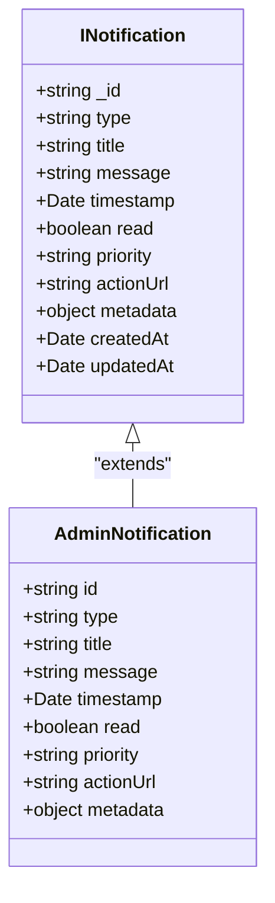
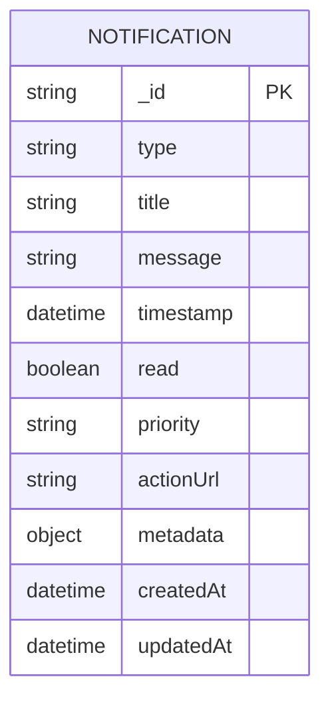
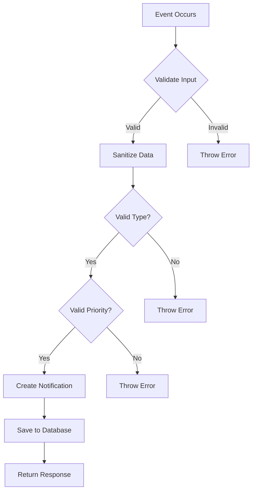
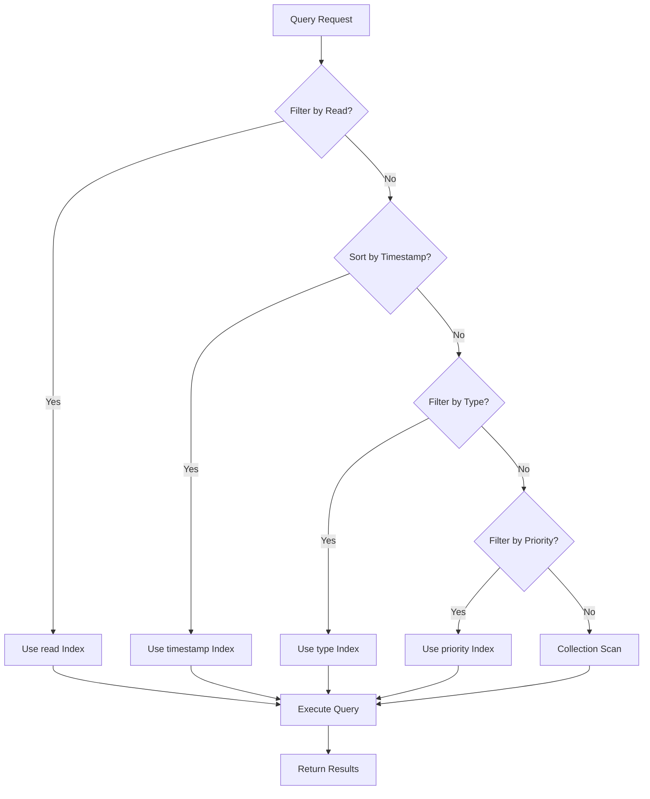
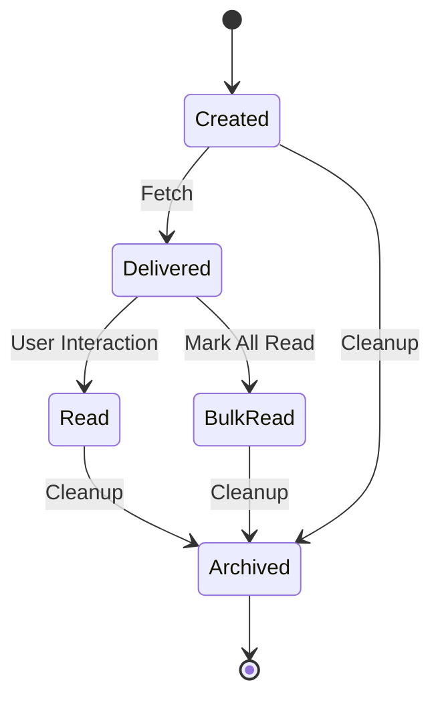
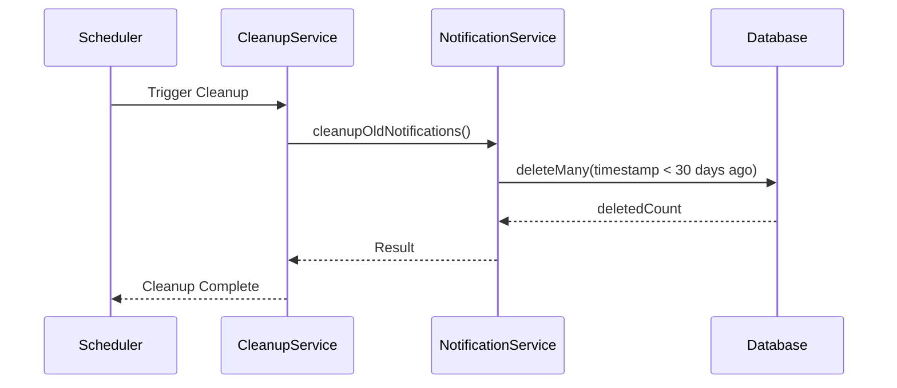
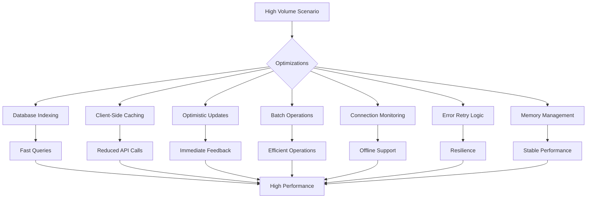
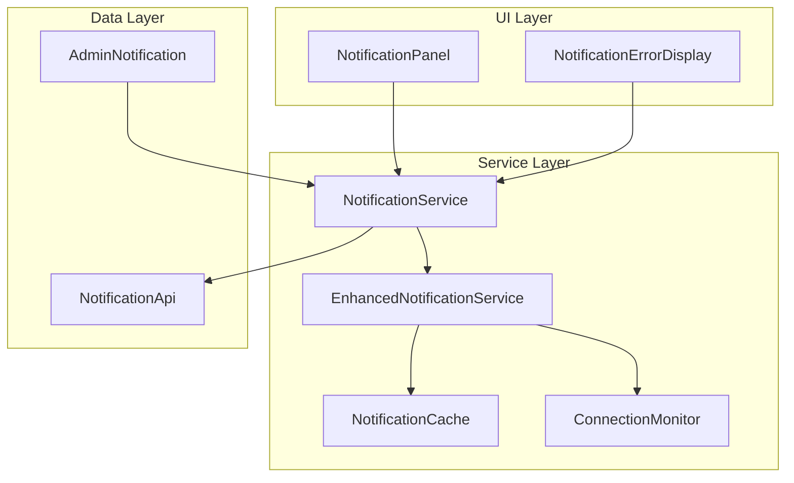
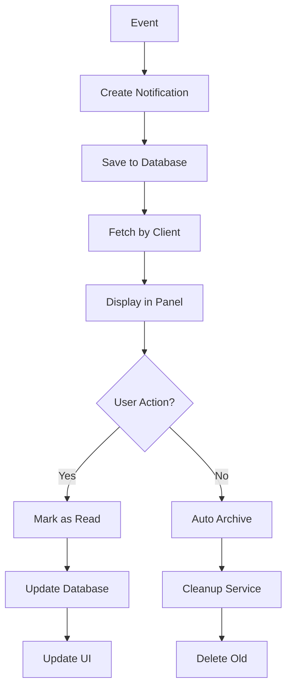

# Notification Model

<cite>
**Referenced Files in This Document**   
- [notification.model.ts](file://api-fastify/src/models/notification.model.ts)
- [notification.service.ts](file://api-fastify/src/services/notification.service.ts)
- [notification.types.ts](file://api-fastify/src/types/notification.types.ts)
- [notification-audit.service.ts](file://api-fastify/src/services/notification-audit.service.ts)
- [notification-cleanup.service.ts](file://api-fastify/src/services/notification-cleanup.service.ts)
- [NotificationPanel.tsx](file://src/components/admin/NotificationPanel.tsx)
- [NotificationErrorDisplay.tsx](file://src/components/admin/NotificationErrorDisplay.tsx)
- [NotificationErrorHandler.ts](file://src/services/NotificationErrorHandler.ts)
- [NotificationService.ts](file://src/services/NotificationService.ts)
- [AdminNotification.ts](file://src/types/AdminNotification.ts)
- [NotificationCache.ts](file://src/services/NotificationCache.ts)
- [ConnectionMonitor.ts](file://src/services/ConnectionMonitor.ts)
</cite>

## Table of Contents
1. [Introduction](#introduction)
2. [Core Data Model](#core-data-model)
3. [Field Definitions](#field-definitions)
4. [Notification Types and Business Logic](#notification-types-and-business-logic)
5. [Indexing and Query Performance](#indexing-and-query-performance)
6. [Notification Lifecycle](#notification-lifecycle)
7. [Audit and Cleanup Services](#audit-and-cleanup-services)
8. [Performance Considerations](#performance-considerations)
9. [Client-Side Implementation](#client-side-implementation)
10. [Sample Data and Usage Examples](#sample-data-and-usage-examples)

## Introduction
The Notification model in the MERN_chatai_blog application serves as a centralized system for managing administrative notifications across the platform. This comprehensive documentation details the data model, field definitions, relationships, indexing strategies, lifecycle management, and client-side implementations. The system supports various notification types triggered by specific business events, with robust audit and cleanup mechanisms to ensure data integrity and performance. The model is designed to efficiently handle high-volume notification scenarios while providing a seamless user experience through the NotificationPanel and related components.

## Core Data Model

**Diagram sources**
- [notification.model.ts](file://api-fastify/src/models/notification.model.ts#L1-L96)
- [notification.types.ts](file://api-fastify/src/types/notification.types.ts#L1-L47)

**Section sources**
- [notification.model.ts](file://api-fastify/src/models/notification.model.ts#L1-L96)
- [notification.types.ts](file://api-fastify/src/types/notification.types.ts#L1-L47)

## Field Definitions

The Notification model contains several key fields that define its structure and behavior:

**Type**: The notification type is a string enum with five possible values: 'user_registered', 'post_published', 'system_error', 'user_activity', and 'content_moderation'. This field categorizes the notification for filtering and display purposes.

**Title**: A required string field with a maximum length of 200 characters that provides a brief summary of the notification. The title is trimmed and sanitized to prevent injection attacks.

**Message**: A required string field with a maximum length of 1000 characters that contains the detailed content of the notification. Like the title, it is trimmed and sanitized.

**Timestamp**: A Date field that records when the notification was created. This field is required and defaults to the current date/time when a notification is created.

**Read**: A boolean field that tracks whether the notification has been viewed by the recipient. It defaults to false when a notification is created.

**Priority**: A string enum with three possible values: 'low', 'medium', and 'high'. This field helps prioritize notifications in the user interface and can trigger different handling logic.

**ActionUrl**: An optional string field with a maximum length of 500 characters that contains a URL for the user to navigate to when interacting with the notification.

**Metadata**: An optional object that contains additional context-specific information such as userId, postId, username, postTitle, or errorCode. The structure varies depending on the notification type.

**CreatedAt and UpdatedAt**: Date fields automatically managed by Mongoose that track when the document was created and last modified.

**Diagram sources**
- [notification.model.ts](file://api-fastify/src/models/notification.model.ts#L1-L96)

**Section sources**
- [notification.model.ts](file://api-fastify/src/models/notification.model.ts#L1-L96)

## Notification Types and Business Logic

The system supports five distinct notification types, each triggered by specific business events:

**User Registered**: Generated when a new user registers on the platform. This notification includes metadata about the user's ID and username, with a medium priority level.

**Post Published**: Created when a new post is published. This notification contains information about the post and its author, with a low priority level.

**System Error**: Triggered when critical system errors occur. These notifications have a high priority and include error codes and component information in the metadata.

**User Activity**: Generated for significant user activities that require administrative attention. These notifications have a low priority by default.

**Content Moderation**: Created when content is flagged for moderation. These notifications have variable priority based on severity and include information about the reported content.

The business logic for creating notifications is implemented in the `createNotification` function in the notification service, which validates input data, sanitizes fields, and ensures proper type and priority values before saving to the database.

**Diagram sources**
- [notification.service.ts](file://api-fastify/src/services/notification.service.ts#L121-L192)
- [notification.model.ts](file://api-fastify/src/models/notification.model.ts#L1-L96)

**Section sources**
- [notification.service.ts](file://api-fastify/src/services/notification.service.ts#L121-L192)
- [notification.model.ts](file://api-fastify/src/models/notification.model.ts#L1-L96)

## Indexing and Query Performance

The Notification model implements several database indexes to optimize query performance:

**Timestamp Index**: A descending index on the timestamp field to efficiently retrieve notifications in chronological order, which is the most common access pattern.

**Read Status Index**: An ascending index on the read field to quickly filter between read and unread notifications.

**Type Index**: An ascending index on the type field to optimize queries that filter by notification category.

**Priority Index**: An ascending index on the priority field to support queries that sort or filter by priority level.

These indexes are defined directly in the schema using Mongoose's index methods, ensuring they are created when the collection is initialized. The combination of these indexes allows for efficient retrieval of notifications based on various criteria, including filtering by read status, sorting by timestamp, and grouping by type or priority.

The `getNotifications` service function leverages these indexes by applying appropriate filters and sort orders to database queries, ensuring optimal performance even with large notification volumes.

**Diagram sources**
- [notification.model.ts](file://api-fastify/src/models/notification.model.ts#L85-L89)
- [notification.service.ts](file://api-fastify/src/services/notification.service.ts#L1-L120)

**Section sources**
- [notification.model.ts](file://api-fastify/src/models/notification.model.ts#L85-L89)
- [notification.service.ts](file://api-fastify/src/services/notification.service.ts#L1-L120)

## Notification Lifecycle

The notification lifecycle spans from creation through delivery to archival, with several key stages:

**Creation**: Notifications are created through the `createNotification` service function, which validates input data and saves the notification to the database with read status set to false.

**Delivery**: The client-side NotificationService fetches notifications from the API and manages their display in the NotificationPanel component. The service implements polling to check for new notifications at regular intervals.

**Reading**: When a user views a notification, it is marked as read through the `markNotificationAsRead` service function. This updates the read field in the database and triggers appropriate UI changes.

**Bulk Management**: Users can mark all notifications as read using the `markAllNotificationsAsRead` function, which updates all unread notifications in a single database operation.

**Archival**: The system automatically removes old notifications through the cleanup service, which deletes notifications older than 30 days.

The lifecycle is supported by both server-side and client-side components working in concert to provide a seamless user experience while maintaining data consistency.

**Diagram sources**
- [notification.service.ts](file://api-fastify/src/services/notification.service.ts#L1-L192)
- [NotificationService.ts](file://src/services/NotificationService.ts#L1-L656)

**Section sources**
- [notification.service.ts](file://api-fastify/src/services/notification.service.ts#L1-L192)
- [NotificationService.ts](file://src/services/NotificationService.ts#L1-L656)

## Audit and Cleanup Services

The system implements comprehensive audit and cleanup services to maintain data integrity and performance:

**Audit Service**: The NotificationAuditService logs all significant operations including notification access, marking as read, bulk operations, and creation. Each audit event includes metadata about the user, IP address, user agent, and operation success status. The service also includes functionality to detect suspicious activity patterns, though this is currently a placeholder for future implementation.

**Cleanup Service**: The notification-cleanup.service manages the archival of old notifications through both automatic and manual processes. The automatic cleanup runs on a configurable interval (default 24 hours) and removes notifications older than 30 days. The service can also be triggered manually for immediate cleanup.

The cleanup process is implemented in two layers:
1. The `cleanupOldNotifications` function in the notification service performs the actual database deletion
2. The `startNotificationCleanup` function in the cleanup service manages the scheduling and execution of cleanup operations

These services ensure that the notification system remains performant by preventing unbounded growth of the notification collection while maintaining an audit trail of all operations.

**Diagram sources**
- [notification-audit.service.ts](file://api-fastify/src/services/notification-audit.service.ts#L1-L148)
- [notification-cleanup.service.ts](file://api-fastify/src/services/notification-cleanup.service.ts#L1-L82)
- [notification.service.ts](file://api-fastify/src/services/notification.service.ts#L194-L261)

**Section sources**
- [notification-audit.service.ts](file://api-fastify/src/services/notification-audit.service.ts#L1-L148)
- [notification-cleanup.service.ts](file://api-fastify/src/services/notification-cleanup.service.ts#L1-L82)
- [notification.service.ts](file://api-fastify/src/services/notification.service.ts#L194-L261)

## Performance Considerations

The notification system is designed to handle high-volume scenarios with several performance optimizations:

**Database Indexing**: As previously detailed, multiple indexes support efficient querying by timestamp, read status, type, and priority, ensuring fast retrieval even with large datasets.

**Client-Side Caching**: The NotificationCache service implements a local cache with TTL (time-to-live) to reduce API calls and improve responsiveness, especially in offline scenarios.

**Optimistic Updates**: The EnhancedNotificationService implements optimistic updates for marking notifications as read, providing immediate UI feedback while the server operation completes in the background.

**Batch Operations**: The system supports bulk operations like marking all notifications as read, which reduces the number of database operations and network requests.

**Connection Monitoring**: The ConnectionMonitor service tracks network status and adjusts behavior accordingly, switching to offline mode when connectivity is lost and synchronizing pending actions when reconnected.

**Error Handling and Retry**: The NotificationErrorHandler implements exponential backoff with jitter for retrying failed operations, preventing overwhelming the server during temporary outages.

**Memory Management**: The cache cleanup runs periodically to remove expired entries, preventing unbounded memory growth in the client application.

These optimizations work together to ensure the notification system remains responsive and reliable even under heavy load or challenging network conditions.

**Diagram sources**
- [NotificationCache.ts](file://src/services/NotificationCache.ts#L1-L109)
- [EnhancedNotificationService.ts](file://src/services/EnhancedNotificationService.ts#L1-L160)
- [NotificationErrorHandler.ts](file://src/services/NotificationErrorHandler.ts#L1-L264)
- [ConnectionMonitor.ts](file://src/services/ConnectionMonitor.ts#L1-L138)

**Section sources**
- [NotificationCache.ts](file://src/services/NotificationCache.ts#L1-L109)
- [EnhancedNotificationService.ts](file://src/services/EnhancedNotificationService.ts#L1-L160)
- [NotificationErrorHandler.ts](file://src/services/NotificationErrorHandler.ts#L1-L264)
- [ConnectionMonitor.ts](file://src/services/ConnectionMonitor.ts#L1-L138)

## Client-Side Implementation

The client-side implementation of the notification system centers around several key components:

**NotificationPanel**: The primary UI component for displaying notifications, built with React and enhanced with framer-motion for smooth animations. It displays notifications in a dropdown panel with features like unread counters, timestamp formatting, and priority indicators.

**NotificationErrorDisplay**: A specialized component for handling and displaying errors that occur during notification operations, providing user-friendly messages and retry functionality.

**NotificationService**: The core service that manages notification state, handles API communication, and provides methods for common operations like fetching, marking as read, and creating notifications.

**EnhancedNotificationService**: An extension of the base service that adds offline support, connection monitoring, and automatic synchronization of pending actions.

The implementation follows a layered architecture with clear separation between UI components, service logic, and data models. The NotificationPanel subscribes to the NotificationService to receive real-time updates, creating a reactive user interface that responds immediately to changes in notification state.

**Diagram sources**
- [NotificationPanel.tsx](file://src/components/admin/NotificationPanel.tsx#L1-L454)
- [NotificationErrorDisplay.tsx](file://src/components/admin/NotificationErrorDisplay.tsx#L1-L107)
- [NotificationService.ts](file://src/services/NotificationService.ts#L1-L656)
- [EnhancedNotificationService.ts](file://src/services/EnhancedNotificationService.ts#L1-L160)

**Section sources**
- [NotificationPanel.tsx](file://src/components/admin/NotificationPanel.tsx#L1-L454)
- [NotificationErrorDisplay.tsx](file://src/components/admin/NotificationErrorDisplay.tsx#L1-L107)
- [NotificationService.ts](file://src/services/NotificationService.ts#L1-L656)
- [EnhancedNotificationService.ts](file://src/services/EnhancedNotificationService.ts#L1-L160)

## Sample Data and Usage Examples

The system includes several example implementations that demonstrate typical usage patterns:

**User Registration Notification**: When a new user registers, the system generates a notification with type 'user_registered', including the user's username and ID in the metadata. The title typically reads "Nouvel utilisateur inscrit" with a message containing the user's email.

**Post Publication Notification**: When a post is published, a 'post_published' notification is created with the post title and author name in the message. The actionUrl points to the post in the admin interface.

**System Error Notification**: Critical errors trigger 'system_error' notifications with high priority. These include the error code and component name in the metadata, with titles like "Erreur système - database".

**Content Moderation Notification**: When content is flagged, a 'content_moderation' notification is generated with details about the reported content and reason. The priority is determined by the severity of the issue.

The NotificationPanel component demonstrates client-side usage, handling various states including loading, error, and normal operation. It implements keyboard navigation, accessibility features, and smooth animations for an enhanced user experience.

The EnhancedNotificationService demonstrates advanced usage patterns including offline support, where actions like marking notifications as read are queued and synchronized when connectivity is restored.

These examples illustrate how the notification system integrates with various parts of the application to provide timely and relevant information to administrators.

**Diagram sources**
- [AdminNotification.test.ts](file://src/types/__tests__/AdminNotification.test.ts#L1-L85)
- [NotificationPanel.tsx](file://src/components/admin/NotificationPanel.tsx#L1-L454)
- [NotificationService.ts](file://src/services/NotificationService.ts#L1-L656)

**Section sources**
- [AdminNotification.test.ts](file://src/types/__tests__/AdminNotification.test.ts#L1-L85)
- [NotificationPanel.tsx](file://src/components/admin/NotificationPanel.tsx#L1-L454)
- [NotificationService.ts](file://src/services/NotificationService.ts#L1-L656)