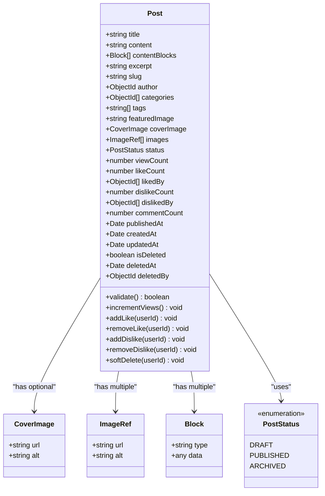
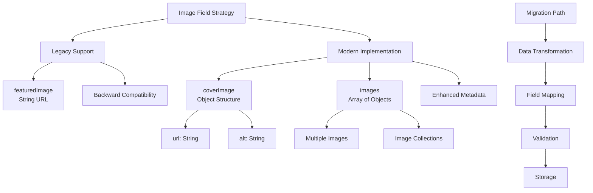
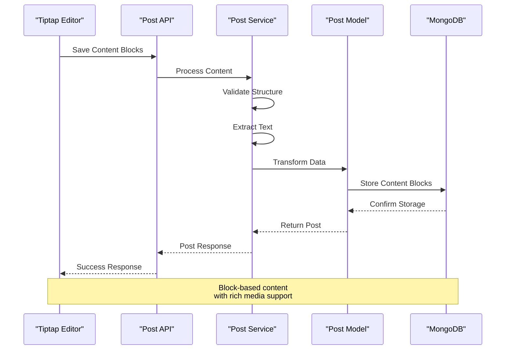
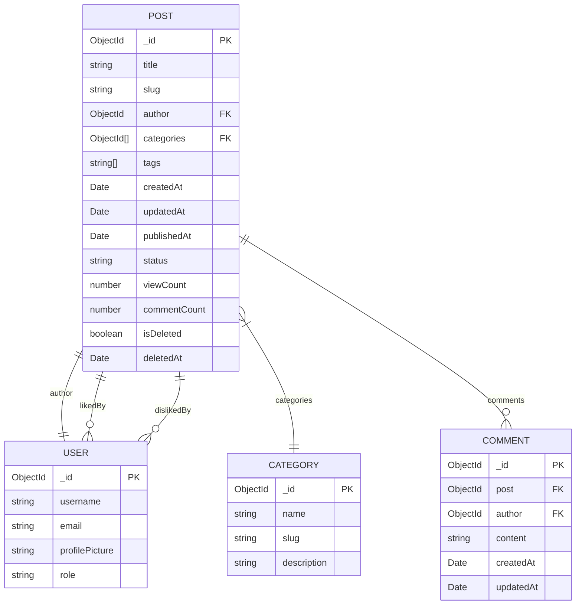
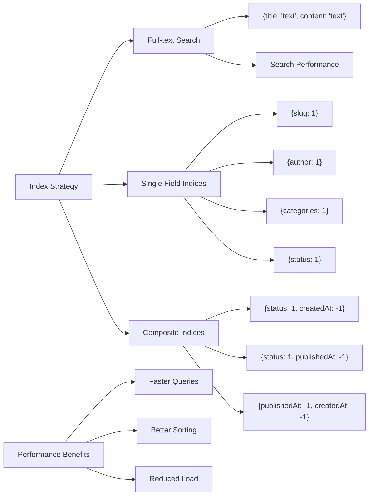
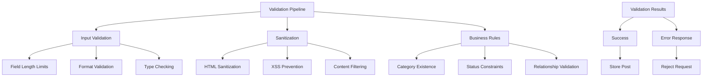
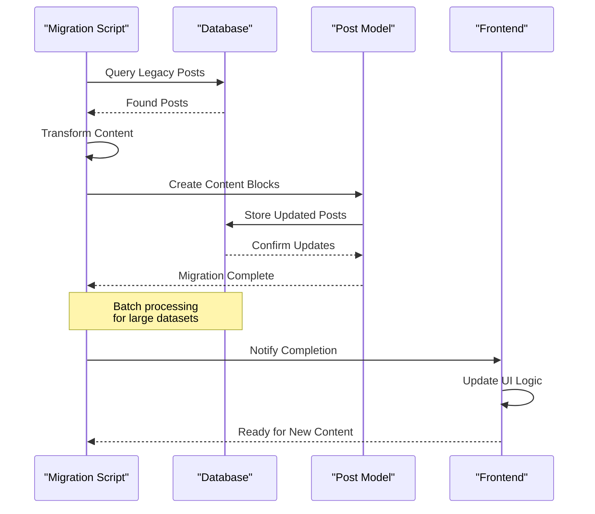

# Post Model Documentation

<cite>
**Referenced Files in This Document**
- [post.model.ts](file://api-fastify/src/models/post.model.ts)
- [post.types.ts](file://api-fastify/src/types/post.types.ts)
- [post.controller.ts](file://api-fastify/src/controllers/post.controller.ts)
- [post.service.ts](file://api-fastify/src/services/post.service.ts)
- [post.schema.ts](file://api-fastify/src/schemas/post.schema.ts)
- [migrate-to-tiptap.ts](file://api-fastify/src/scripts/migrate-to-tiptap.ts)
- [TiptapBlockEditor.tsx](file://src/features/posts/components/BlockEditor/TiptapBlockEditor.tsx)
- [post.types.ts](file://src/features/posts/types/post.types.ts)
- [postApi.ts](file://src/features/posts/services/postApi.ts)
- [index.ts](file://api-fastify/src/utils/index.ts)
</cite>

## Table of Contents
1. [Introduction](#introduction)
2. [Model Architecture](#model-architecture)
3. [Field Definitions](#field-definitions)
4. [Dual Image Field Strategy](#dual-image-field-strategy)
5. [Content Management System](#content-management-system)
6. [Relationships and References](#relationships-and-references)
7. [Indexing Strategies](#indexing-strategies)
8. [Business Rules and Lifecycle](#business-rules-and-lifecycle)
9. [Validation and Sanitization](#validation-and-sanitization)
10. [Migration and Compatibility](#migration-and-compatibility)
11. [Usage Examples](#usage-examples)
12. [Performance Considerations](#performance-considerations)
13. [Troubleshooting](#troubleshooting)

## Introduction

The Post model in the MERN_chatai_blog application represents a sophisticated content management system designed to handle rich, interactive blog posts with advanced features including dual content systems, engagement metrics, and comprehensive categorization. This model serves as the central data structure for all blog content, supporting both legacy and modern content formats while maintaining backward compatibility.

The Post model implements a dual-content strategy that seamlessly transitions from traditional markdown-based content to modern block-based content powered by Tiptap editor, ensuring smooth migration paths and future-proof architecture. It incorporates comprehensive engagement tracking, soft deletion capabilities, and robust indexing strategies for optimal performance.

## Model Architecture

The Post model follows a comprehensive schema design that balances flexibility with performance, incorporating multiple content formats and extensive metadata support.



**Diagram sources**
- [post.model.ts](file://api-fastify/src/models/post.model.ts#L1-L136)
- [post.types.ts](file://api-fastify/src/types/post.types.ts#L1-L109)

**Section sources**
- [post.model.ts](file://api-fastify/src/models/post.model.ts#L1-L136)
- [post.types.ts](file://api-fastify/src/types/post.types.ts#L1-L109)

## Field Definitions

### Core Content Fields

**Title Field**
- **Type**: String
- **Required**: Yes
- **Constraints**: Minimum 3 characters, Maximum 200 characters
- **Validation**: Trimmed, validated for length
- **Purpose**: Primary identifier and display title

**Content Fields**
- **Legacy Content**: `content` (String, optional)
  - Stores traditional markdown content
  - Used during transition period
  - Maintained for backward compatibility

- **Modern Content**: `contentBlocks` (Array of Blocks)
  - Flexible block-based structure
  - Supports rich content types
  - Enables advanced editing capabilities

**Excerpt Field**
- **Type**: String
- **Optional**: Yes
- **Constraints**: Maximum 500 characters
- **Purpose**: Preview text for listings and SEO

**Slug Field**
- **Type**: String
- **Required**: Yes
- **Constraints**: Unique, lowercase, trimmed
- **Generation**: Automatically generated from title
- **Purpose**: URL-friendly identifier

### Relationship Fields

**Author Reference**
- **Type**: ObjectId referencing User collection
- **Required**: Yes
- **Purpose**: Content ownership and attribution

**Category References**
- **Type**: Array of ObjectIds referencing Category collection
- **Optional**: Yes
- **Purpose**: Content categorization and organization

**Tag Array**
- **Type**: Array of Strings
- **Optional**: Yes
- **Purpose**: Keyword-based content classification

### Engagement Metrics

**View Count**
- **Type**: Number
- **Default**: 0
- **Purpose**: Tracks content popularity
- **Increment Logic**: Automatic on content access

**Like/Dislike Tracking**
- **Structure**: Arrays of ObjectIds referencing User collection
- **Purpose**: User engagement measurement
- **Count Calculation**: Derived from arrays

**Comment Count**
- **Type**: Number
- **Default**: 0
- **Purpose**: Engagement metric
- **Synchronization**: Managed through Comment model

### Status and Lifecycle

**Status Field**
- **Type**: String with enum validation
- **Values**: `draft`, `published`, `archived`
- **Default**: `draft`
- **Purpose**: Content lifecycle management

**Publication Timestamp**
- **Type**: Date
- **Optional**: Yes
- **Automatic**: Set when status changes to published
- **Purpose**: Content scheduling and ordering

**Section sources**
- [post.model.ts](file://api-fastify/src/models/post.model.ts#L6-L66)
- [post.types.ts](file://api-fastify/src/types/post.types.ts#L15-L46)

## Dual Image Field Strategy

The Post model implements a sophisticated dual image field strategy that supports both legacy and modern image handling approaches, ensuring seamless migration and backward compatibility.



**Diagram sources**
- [post.model.ts](file://api-fastify/src/models/post.model.ts#L48-L60)
- [post.types.ts](file://api-fastify/src/types/post.types.ts#L25-L30)

### Legacy Image Field (`featuredImage`)

**Structure**: Simple string URL
- **Type**: String
- **Optional**: Yes
- **Purpose**: Maintains compatibility with older systems
- **Usage**: Single primary image reference

### Modern Image Fields

**Cover Image (`coverImage`)**
- **Structure**: Object with URL and metadata
- **Fields**: `url` (String, required), `alt` (String, optional)
- **Purpose**: Enhanced image representation
- **Benefits**: Better accessibility and SEO

**Additional Images (`images`)**
- **Structure**: Array of image objects
- **Fields**: `url` (String, required), `alt` (String, optional)
- **Purpose**: Multiple image support
- **Usage**: Gallery-style content presentation

### Migration Strategy

The system implements automatic migration logic to transform legacy image data into modern structures:

```typescript
// Example migration logic
if (post.featuredImage && !post.coverImage) {
  post.coverImage = {
    url: post.featuredImage,
    alt: '' // Default empty alt text
  };
}
```

**Section sources**
- [post.model.ts](file://api-fastify/src/models/post.model.ts#L48-L60)
- [post.types.ts](file://api-fastify/src/types/post.types.ts#L25-L30)

## Content Management System

The Post model integrates a sophisticated content management system that supports both traditional markdown and modern block-based editing through Tiptap integration.



**Diagram sources**
- [TiptapBlockEditor.tsx](file://src/features/posts/components/BlockEditor/TiptapBlockEditor.tsx#L1-L218)
- [post.service.ts](file://api-fastify/src/services/post.service.ts#L1-L199)

### Block-Based Content Structure

The modern content system uses a flexible block structure that supports various content types:

**Supported Block Types**
- **Paragraph**: Basic text content
- **Heading**: Multiple levels (h1-h4)
- **Image**: Embedded images with captions
- **Code**: Syntax-highlighted code blocks
- **Quote**: Block quotes with attribution
- **List**: Ordered and unordered lists
- **Embed**: Social media and external content
- **Callout**: Informational boxes

### Tiptap Integration

The frontend implements a sophisticated Tiptap-based editor that provides:

**Editor Features**
- Real-time collaboration
- Rich text formatting
- Image upload and management
- Content validation
- Undo/redo functionality
- Character counting

**Data Flow**
- Editor generates JSON structure
- Content blocks stored in database
- Frontend renders blocks dynamically
- Automatic serialization/deserialization

### Content Extraction and Processing

The system implements intelligent content extraction for various purposes:

```typescript
// Content extraction helpers
const extractTextFromBlock = (block: any): string => {
  if (!block) return '';
  const type = block.type;
  const data = block.data ?? block;
  
  if (['paragraph', 'heading', 'quote', 'callout'].includes(type) && typeof data.text === 'string') {
    return data.text;
  }
  if (type === 'list' && Array.isArray(data.items)) {
    return data.items.join(' ');
  }
  if (type === 'code' && typeof data.code === 'string') {
    return data.code;
  }
  return '';
};
```

**Section sources**
- [post.service.ts](file://api-fastify/src/services/post.service.ts#L15-L30)
- [TiptapBlockEditor.tsx](file://src/features/posts/components/BlockEditor/TiptapBlockEditor.tsx#L1-L218)
- [migrate-to-tiptap.ts](file://api-fastify/src/scripts/migrate-to-tiptap.ts#L1-L53)

## Relationships and References

The Post model establishes comprehensive relationships with other entities in the system, creating a rich interconnected data ecosystem.



**Diagram sources**
- [post.model.ts](file://api-fastify/src/models/post.model.ts#L32-L40)
- [post.service.ts](file://api-fastify/src/services/post.service.ts#L100-L120)

### Author Relationship

**Reference**: `author` field (ObjectId referencing User)
- **Purpose**: Establishes content ownership
- **Populated Data**: Username, profile picture
- **Access Control**: Author-only modifications for drafts

### Category Relationships

**Reference**: `categories` field (Array of ObjectIds referencing Category)
- **Purpose**: Hierarchical content organization
- **Populated Data**: Category details and metadata
- **Validation**: Ensures category existence before save

### User Engagement References

**Like/Dislike References**: Arrays of ObjectIds referencing User
- **Purpose**: Track user interactions
- **Populated Data**: User identifiers for permission checks
- **Access Control**: Prevent duplicate engagements

### Comment Relationship

**Reference**: Managed through separate Comment model
- **Purpose**: Separate engagement tracking
- **Synchronization**: Automatic comment count updates
- **Cascade Behavior**: Comment deletion affects counter

**Section sources**
- [post.model.ts](file://api-fastify/src/models/post.model.ts#L32-L40)
- [post.service.ts](file://api-fastify/src/services/post.service.ts#L100-L120)

## Indexing Strategies

The Post model implements comprehensive indexing strategies to optimize query performance across frequently accessed fields and complex search scenarios.



**Diagram sources**
- [post.model.ts](file://api-fastify/src/models/post.model.ts#L85-L92)

### Full-text Search Index

**Index Definition**: `{ title: 'text', content: 'text' }`
- **Purpose**: Comprehensive content search
- **Implementation**: MongoDB text index
- **Usage**: Search functionality across title and content
- **Performance**: Optimized for multi-language content

### Single Field Indices

**Slug Index**: Automatically created due to `unique: true` constraint
- **Purpose**: Fast ID resolution by slug
- **Performance**: O(1) lookup time

**Author Index**: `{ author: 1 }`
- **Purpose**: Author-specific content queries
- **Usage**: User dashboard and author profiles

**Category Index**: `{ categories: 1 }`
- **Purpose**: Category-based filtering
- **Usage**: Category archives and browsing

**Status Index**: `{ status: 1 }`
- **Purpose**: Content lifecycle queries
- **Usage**: Status-based filtering and reporting

### Composite Indices

**Published Content Index**: `{ status: 1, publishedAt: -1 }`
- **Purpose**: Efficient published content retrieval
- **Sorting**: Latest published content first
- **Performance**: Optimized for timeline views

**Draft Management Index**: `{ status: 1, createdAt: -1 }`
- **Purpose**: Author draft organization
- **Sorting**: Newest drafts first
- **Performance**: Quick draft access

**Multi-field Sorting Index**: `{ publishedAt: -1, createdAt: -1 }`
- **Purpose**: Complex chronological sorting
- **Usage**: Content feeds and archives
- **Performance**: Optimized for mixed sorting criteria

**Section sources**
- [post.model.ts](file://api-fastify/src/models/post.model.ts#L85-L92)

## Business Rules and Lifecycle

The Post model enforces comprehensive business rules that govern content lifecycle, access control, and operational constraints.

```mermaid
stateDiagram-v2
[*] --> Draft
Draft --> Published : Publish
Draft --> Archived : Archive
Published --> Draft : Unpublish
Published --> Archived : Archive
Archived --> Draft : Restore
Archived --> Published : Republish
note right of Draft : Author edits<br/>Status : draft
note right of Published : Public access<br/>Status : published
note right of Archived : Hidden content<br/>Status : archived
Published --> SoftDelete : Delete
Draft --> SoftDelete : Delete
Archived --> SoftDelete : Delete
SoftDelete --> [*] : Permanent Delete
```

**Diagram sources**
- [post.types.ts](file://api-fastify/src/types/post.types.ts#L7-L12)
- [post.service.ts](file://api-fastify/src/services/post.service.ts#L45-L65)

### Content Status Management

**Status Values and Transitions**
- **Draft**: Author-only content, not publicly visible
- **Published**: Publicly accessible, searchable
- **Archived**: Hidden from public, accessible to authors/admins

**Status Validation Rules**
```typescript
// Status query builder with access control
const buildStatusQuery = (status?: PostStatus, currentUserId?: string, currentUserRole?: string) => {
  if (!currentUserId) return { status: PostStatus.PUBLISHED };
  
  const isAdminOrEditor = currentUserRole === 'admin' || currentUserRole === 'editor';
  
  if (status) {
    if (isAdminOrEditor) return { status };
    return status === PostStatus.DRAFT 
      ? { status: PostStatus.DRAFT, author: currentUserId }
      : { status: PostStatus.PUBLISHED };
  }
  
  return isAdminOrEditor ? {} : {
    $or: [
      { status: PostStatus.PUBLISHED },
      { status: PostStatus.DRAFT, author: currentUserId },
    ]
  };
};
```

### Access Control Rules

**Permission Matrix**
- **Authors**: Can modify their own drafts
- **Editors**: Can manage all published content
- **Admins**: Full content management rights
- **Public**: Read-only access to published content

**Content Visibility Logic**
```typescript
// Content visibility determination
if (post.status !== PostStatus.PUBLISHED) {
  if (!currentUserId) {
    throw new Error('Article non trouvé');
  }

  const isAuthor = post.author._id.toString() === currentUserId;
  const isAdminOrEditor = currentUserRole === 'admin' || currentUserRole === 'editor';

  if (!isAuthor && !isAdminOrEditor) {
    throw new Error('Article non trouvé');
  }
}
```

### Publication Lifecycle

**Automatic Publication Timestamp**
- **Trigger**: Status changes to `published`
- **Logic**: Sets `publishedAt` to current date/time
- **Purpose**: Content scheduling and ordering

**View Count Increment**
- **Trigger**: Non-author access to published content
- **Logic**: Automatic increment on content access
- **Purpose**: Engagement tracking

**Section sources**
- [post.service.ts](file://api-fastify/src/services/post.service.ts#L45-L65)
- [post.service.ts](file://api-fastify/src/services/post.service.ts#L120-L140)
- [post.model.ts](file://api-fastify/src/models/post.model.ts#L94-L102)

## Validation and Sanitization

The Post model implements comprehensive validation and sanitization mechanisms to ensure data integrity and security across all content fields.



**Diagram sources**
- [post.schema.ts](file://api-fastify/src/schemas/post.schema.ts#L230-L283)
- [post.service.ts](file://api-fastify/src/services/post.service.ts#L219-L255)

### Input Validation

**Field-Level Validation**
- **Title**: Required, min 3 chars, max 200 chars
- **Content**: Optional, min 1 char (when present)
- **Excerpt**: Max 500 chars
- **Slug**: Generated automatically, unique constraint enforced
- **Tags**: Array of trimmed strings

**Schema Validation**
```typescript
// Example schema validation rules
{
  title: { type: 'string', minLength: 3, maxLength: 200 },
  content: { type: 'string', minLength: 1 },
  excerpt: { type: 'string', maxLength: 500 },
  categories: {
    type: 'array',
    items: { type: 'string' },
  },
  status: { type: 'string', enum: Object.values(PostStatus) },
}
```

### Content Sanitization

**HTML Content Protection**
- **XSS Prevention**: Automatic sanitization of HTML content
- **Script Removal**: Malicious scripts blocked
- **Attribute Filtering**: Unsafe attributes removed

**Markdown Security**
- **Safe Rendering**: Trusted markdown rendering pipeline
- **External Links**: Controlled link opening
- **Image Sources**: Verified image URLs

### Business Rule Validation

**Category Validation**
```typescript
// Category existence verification
if (cleanUpdateData.categories && cleanUpdateData.categories.length > 0) {
  const categoryCount = await Category.countDocuments({
    _id: { $in: cleanUpdateData.categories },
  });

  if (categoryCount !== cleanUpdateData.categories.length) {
    throw new Error("Une ou plusieurs catégories n'existent pas");
  }
}
```

**Slug Generation and Uniqueness**
```typescript
// Automatic slug generation with uniqueness
export const generateSlug = (title: string): string => {
  const baseSlug = title
    .toLowerCase()
    .trim()
    .replace(/[^\w\s-]/g, '')
    .replace(/[\s_-]+/g, '-')
    .replace(/^-+|-+$/g, '');

  return `${baseSlug}-${nanoid(6)}`;
};
```

**Section sources**
- [post.schema.ts](file://api-fastify/src/schemas/post.schema.ts#L230-L283)
- [post.service.ts](file://api-fastify/src/services/post.service.ts#L435-L467)
- [index.ts](file://api-fastify/src/utils/index.ts#L8-L18)

## Migration and Compatibility

The Post model implements a comprehensive migration strategy that handles the transition from legacy content systems to modern block-based content while maintaining full backward compatibility.



**Diagram sources**
- [migrate-to-tiptap.ts](file://api-fastify/src/scripts/migrate-to-tiptap.ts#L1-L53)

### Legacy Content Detection

**Migration Criteria**
```typescript
// Identify posts requiring migration
const posts = await Post.find({
  $or: [
    { contentBlocks: { $exists: false } },
    { contentBlocks: { $size: 0 } }
  ],
  content: { $exists: true, $ne: '' }
});
```

### Content Transformation

**Legacy to Modern Conversion**
```typescript
// Transform markdown to block structure
post.contentBlocks = [{
  type: 'paragraph',
  text: post.content || ''
}];
```

### Migration Execution

**Batch Processing Strategy**
- **Efficiency**: Process posts in batches
- **Safety**: Rollback capability on failure
- **Monitoring**: Progress tracking and logging
- **Validation**: Data integrity checks

### Frontend Compatibility

**Dual Content Support**
- **Legacy Rendering**: Continue supporting old content
- **New Rendering**: Enhanced block-based display
- **Fallback Logic**: Graceful degradation for unsupported content

**API Response Normalization**
```typescript
// Normalize post data for frontend
const normalizePostForFrontend = (post: any, currentUserId?: string): PostResponse => {
  const postObj = post.toObject() as PostResponse;
  
  // Handle cover image normalization
  if (postObj && (postObj as any).coverImage) {
    if (typeof (postObj as any).coverImage === 'string') {
      (postObj as any).coverImage = { url: (postObj as any).coverImage, alt: '' };
    }
    if (typeof (postObj as any).coverImage === 'object' && !(postObj as any).coverImage.alt) {
      (postObj as any).coverImage.alt = '';
    }
  }
  
  return postObj;
};
```

**Section sources**
- [migrate-to-tiptap.ts](file://api-fastify/src/scripts/migrate-to-tiptap.ts#L1-L53)
- [post.service.ts](file://api-fastify/src/services/post.service.ts#L70-L95)

## Usage Examples

### Creating a New Post

```typescript
// Basic post creation
const newPost = new Post({
  title: 'My First Blog Post',
  content: '# Hello World\nThis is my first post!',
  excerpt: 'Introduction to blogging with our platform',
  slug: 'my-first-blog-post',
  author: userId,
  categories: [categoryId],
  tags: ['welcome', 'introduction'],
  status: PostStatus.DRAFT
});

await newPost.save();
```

### Updating Post Content

```typescript
// Update with modern block-based content
const updatedPost = await Post.findByIdAndUpdate(postId, {
  title: 'Updated Title',
  contentBlocks: [
    {
      type: 'paragraph',
      data: { text: 'Updated content with rich formatting' }
    },
    {
      type: 'image',
      data: { 
        url: 'https://example.com/image.jpg',
        alt: 'Descriptive alt text'
      }
    }
  ],
  excerpt: 'Updated excerpt for better SEO'
}, { new: true });
```

### Managing Engagement

```typescript
// Like a post
await Post.findByIdAndUpdate(postId, {
  $addToSet: { likedBy: userId },
  $inc: { likeCount: 1 }
});

// Unlike a post
await Post.findByIdAndUpdate(postId, {
  $pull: { likedBy: userId },
  $inc: { likeCount: -1 }
});
```

### Querying Posts with Filters

```typescript
// Advanced post search
const posts = await Post.find({
  status: PostStatus.PUBLISHED,
  categories: { $in: [categoryId] },
  tags: { $in: ['featured'] }
})
.populate('author', 'username profilePicture')
.populate('categories', 'name slug')
.sort({ publishedAt: -1 })
.skip(page * limit)
.limit(limit);
```

### Soft Deletion

```typescript
// Soft delete a post
await Post.findByIdAndUpdate(postId, {
  isDeleted: true,
  deletedAt: new Date(),
  deletedBy: userId
});

// Permanently delete (admin only)
await Post.findByIdAndDelete(postId);
```

**Section sources**
- [post.controller.ts](file://api-fastify/src/controllers/post.controller.ts#L80-L130)
- [post.service.ts](file://api-fastify/src/services/post.service.ts#L150-L199)

## Performance Considerations

The Post model is designed with performance optimization as a core consideration, implementing several strategies to ensure efficient operation at scale.

### Query Optimization

**Indexed Field Usage**
- **Slug Queries**: O(1) lookup via unique index
- **Author Filtering**: O(log n) via author index
- **Category Filtering**: O(log n) via categories index
- **Status Filtering**: O(log n) via status index

**Composite Index Benefits**
- **Published Content**: `{ status: 1, publishedAt: -1 }` enables efficient timelines
- **Draft Management**: `{ status: 1, createdAt: -1 }` supports author dashboards
- **Multi-field Sorting**: `{ publishedAt: -1, createdAt: -1 }` optimizes complex queries

### Memory Management

**Population Strategies**
- **Selective Population**: Populate only required fields
- **Limit Population**: Restrict population depth for performance
- **Manual Joins**: Custom join logic for complex relationships

**Large Dataset Handling**
- **Pagination**: Built-in pagination support
- **Cursor-based Pagination**: Efficient for large datasets
- **Batch Processing**: Migration and bulk operations

### Caching Strategy

**Cacheable Data**
- **Popular Posts**: Frequently accessed content
- **Category Archives**: Category-based content
- **Author Content**: Author-specific content
- **Recent Activity**: Recent posts and updates

**Cache Invalidation**
```typescript
// Cache invalidation on post updates
try {
  const { invalidatePostCache } = await import('../utils/cache-invalidation.js');
  await invalidatePostCache(id);
} catch (e) {
  request.log.warn('Cache invalidation failed: %s', (e as Error).message);
}
```

### Scalability Features

**Horizontal Scaling**
- **Sharded Indexes**: Distribute indexed queries
- **Replica Sets**: High availability and read scaling
- **Connection Pooling**: Efficient database connections

**Vertical Scaling**
- **Memory Optimization**: Efficient data structures
- **CPU Optimization**: Optimized query execution
- **Disk I/O**: Minimized disk access patterns

**Section sources**
- [post.model.ts](file://api-fastify/src/models/post.model.ts#L85-L92)
- [post.controller.ts](file://api-fastify/src/controllers/post.controller.ts#L350-L370)

## Troubleshooting

### Common Issues and Solutions

**Migration Failures**
- **Symptom**: Posts fail to migrate to contentBlocks
- **Cause**: Database connectivity or permission issues
- **Solution**: Verify database connection and retry migration

**Slug Conflicts**
- **Symptom**: Duplicate slug errors during creation
- **Cause**: Manual slug conflicts or race conditions
- **Solution**: Automatic slug generation with uniqueness check

**Category Validation Errors**
- **Symptom**: "Une ou plusieurs catégories n'existent pas" error
- **Cause**: Invalid category IDs in post data
- **Solution**: Verify category existence before post creation

**Performance Issues**
- **Symptom**: Slow query responses
- **Cause**: Missing or inefficient indexes
- **Solution**: Review query patterns and add appropriate indices

### Debugging Tools

**Logging Configuration**
```typescript
// Enable detailed logging for debugging
request.log.debug({
  msg: '[createPost] incoming payload summary',
  hasContentBlocks: Array.isArray(cb),
  contentBlocks: Array.isArray(cb)
    ? { length: cb.length, types: cb.map((b: any) => b?.type) }
    : cb,
});
```

**Data Validation Checks**
```typescript
// Validate post data before processing
console.log('[updatePost] Request received', {
  id,
  userId: request.user._id,
  userRole: request.user.role,
  dataKeys: Object.keys(updateData),
  hasTitle: !!updateData.title,
  hasContent: !!updateData.content,
  hasContentBlocks: Array.isArray((updateData as any)?.contentBlocks),
  status: updateData.status,
  categories: updateData.categories,
});
```

### Monitoring and Maintenance

**Health Checks**
- **Database Connectivity**: Regular connection testing
- **Index Health**: Monitor index usage and performance
- **Migration Status**: Track migration progress and failures

**Maintenance Tasks**
- **Index Rebuild**: Periodic index optimization
- **Data Cleanup**: Remove orphaned records
- **Performance Monitoring**: Track query performance metrics

**Section sources**
- [post.controller.ts](file://api-fastify/src/controllers/post.controller.ts#L126-L153)
- [post.service.ts](file://api-fastify/src/services/post.service.ts#L435-L467)