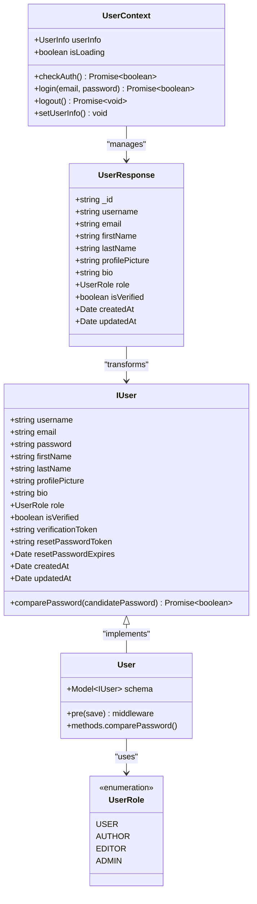
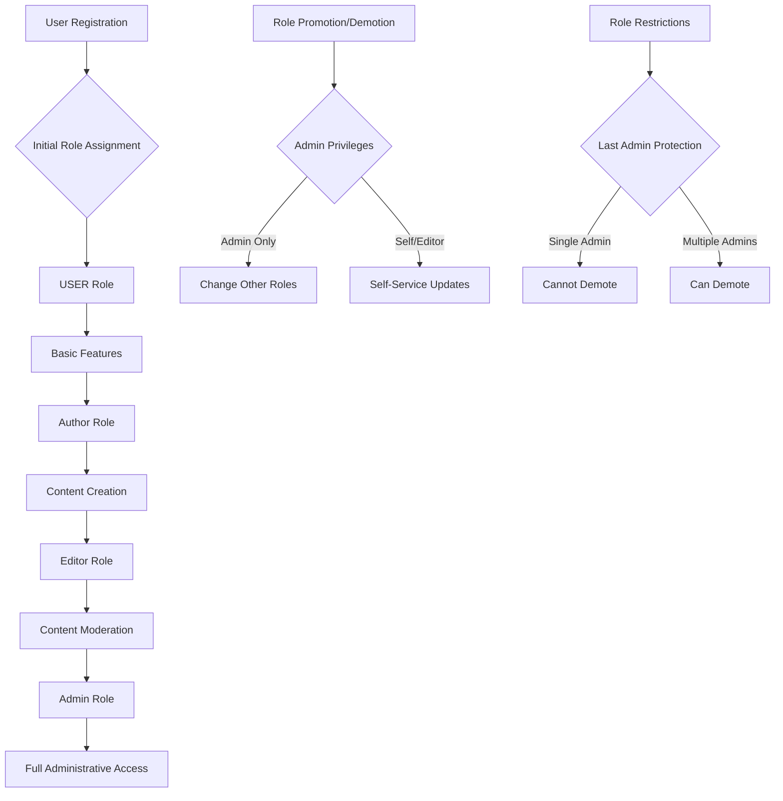
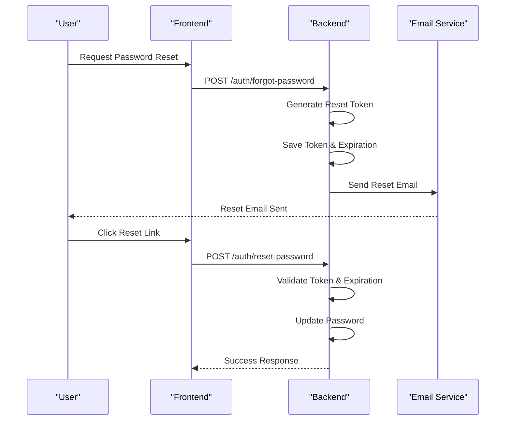
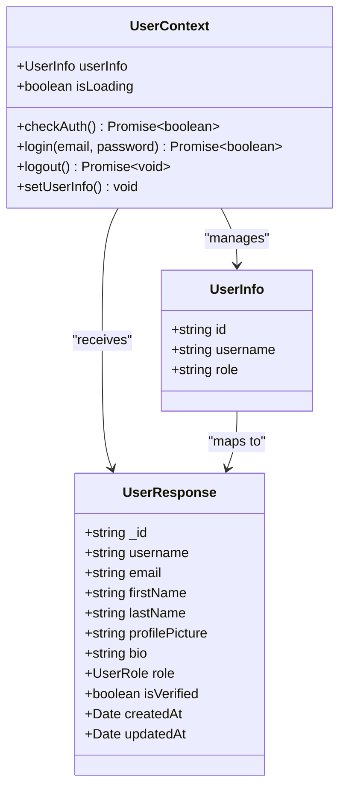
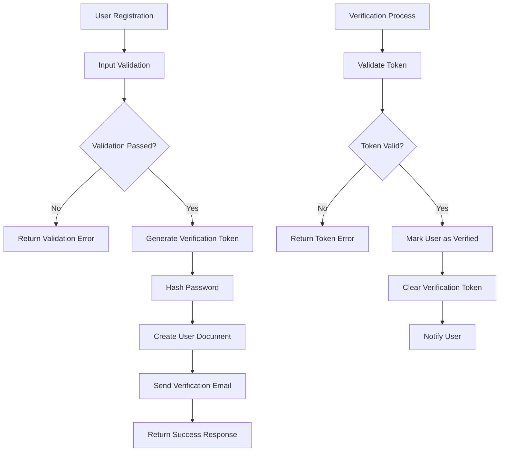
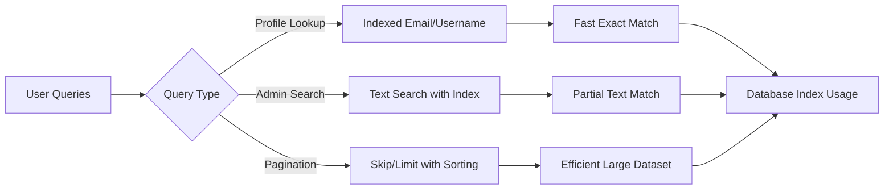
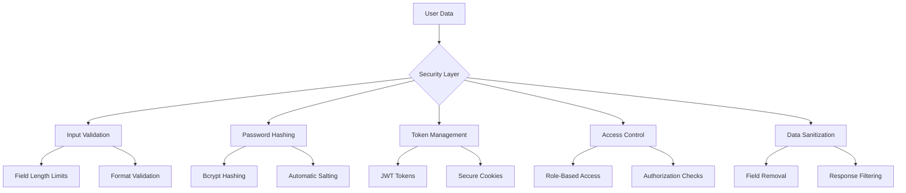

# User Model Documentation

<cite>
**Referenced Files in This Document**
- [user.model.ts](file://api-fastify/src/models/user.model.ts)
- [user.schema.ts](file://api-fastify/src/schemas/user.schema.ts)
- [user.types.ts](file://api-fastify/src/types/user.types.ts)
- [User.ts](file://src/types/User.ts)
- [UserContext.tsx](file://src/UserContext.tsx)
- [auth.controller.ts](file://api-fastify/src/controllers/auth.controller.ts)
- [user.controller.ts](file://api-fastify/src/controllers/user.controller.ts)
- [user.service.ts](file://api-fastify/src/services/user.service.ts)
- [auth.service.ts](file://api-fastify/src/services/auth.service.ts)
- [UsersTable.tsx](file://src/components/UsersTable.tsx)
- [api.config.ts](file://src/config/api.config.ts)
</cite>

## Table of Contents
1. [Introduction](#introduction)
2. [User Model Architecture](#user-model-architecture)
3. [Field Definitions and Data Types](#field-definitions-and-data-types)
4. [Role-Based Access Control](#role-based-access-control)
5. [Authentication and Security](#authentication-and-security)
6. [Frontend-Backend Integration](#frontend-backend-integration)
7. [Data Lifecycle Management](#data-lifecycle-management)
8. [Performance Optimization](#performance-optimization)
9. [Security Considerations](#security-considerations)
10. [Sample Data and Usage Examples](#sample-data-and-usage-examples)
11. [Troubleshooting Guide](#troubleshooting-guide)
12. [Conclusion](#conclusion)

## Introduction

The User model in the MERN_chatai_blog application serves as the cornerstone of the authentication and authorization system. Built with MongoDB and Mongoose, it provides a comprehensive data structure for managing user accounts, roles, and authentication states. The model implements robust security measures including password hashing, email verification, and role-based access control with four distinct user roles: user, author, editor, and admin.

This documentation covers the complete User model implementation, from the backend Mongoose schema to the frontend React components that interact with user data. The system emphasizes security, performance, and maintainability while providing a seamless user experience across the entire application stack.

## User Model Architecture

The User model follows a layered architecture pattern with clear separation of concerns between data persistence, business logic, and presentation layers.



**Diagram sources**
- [user.model.ts](file://api-fastify/src/models/user.model.ts#L1-L97)
- [user.types.ts](file://api-fastify/src/types/user.types.ts#L1-L59)
- [User.ts](file://src/types/User.ts#L1-L14)

**Section sources**
- [user.model.ts](file://api-fastify/src/models/user.model.ts#L1-L97)
- [user.types.ts](file://api-fastify/src/types/user.types.ts#L1-L59)

## Field Definitions and Data Types

The User model defines comprehensive field structures with strict validation rules and appropriate data types.

### Core Identity Fields

```typescript
// Username field with validation
username: {
  type: String,
  required: true,
  unique: true,
  trim: true,
  minlength: 3,
  maxlength: 30,
}

// Email field with comprehensive validation
email: {
  type: String,
  required: true,
  unique: true,
  trim: true,
  lowercase: true,
  match: [/^\S+@\S+\.\S+$/, 'Veuillez fournir une adresse email valide'],
}
```

### Personal Information Fields

```typescript
// First name with optional field
firstName: {
  type: String,
  trim: true,
}

// Last name with optional field
lastName: {
  type: String,
  trim: true,
}

// Profile picture URL
profilePicture: {
  type: String,
}

// Bio with character limit
bio: {
  type: String,
  maxlength: 500,
}
```

### Authentication and Security Fields

```typescript
// Password stored as hash (never exposed)
password: {
  type: String,
  required: true,
  minlength: 6,
}

// Verification status
isVerified: {
  type: Boolean,
  default: false,
}

// Email verification token
verificationToken: String,

// Password reset token
resetPasswordToken: String,

// Password reset expiration
resetPasswordExpires: Date,
```

### Role Management Field

```typescript
// User role with enum validation
role: {
  type: String,
  enum: Object.values(UserRole),
  default: UserRole.USER,
}
```

**Section sources**
- [user.model.ts](file://api-fastify/src/models/user.model.ts#L6-L42)
- [user.types.ts](file://api-fastify/src/types/user.types.ts#L14-L25)

## Role-Based Access Control

The application implements a sophisticated role-based access control system with four distinct user roles, each with specific permissions and capabilities.



**Diagram sources**
- [user.service.ts](file://api-fastify/src/services/user.service.ts#L100-L130)
- [auth.service.ts](file://api-fastify/src/services/auth.service.ts#L1-L50)

### Role Definitions

#### USER Role
- **Default role** for newly registered users
- **Capabilities**: Basic profile management, content consumption
- **Restrictions**: Cannot create or edit content, limited administrative access

#### AUTHOR Role
- **Content creators** with publishing privileges
- **Capabilities**: Create, edit, and publish blog posts
- **Restrictions**: Cannot manage other users, limited moderation rights

#### EDITOR Role
- **Content moderators** with review capabilities
- **Capabilities**: Moderate comments, approve/deny content, basic user management
- **Restrictions**: Cannot delete users, limited administrative functions

#### ADMIN Role
- **Full administrative privileges**
- **Capabilities**: Complete system management, user administration, content moderation
- **Restrictions**: None (except last admin protection)

### Role Management Implementation

The system prevents unauthorized role changes and protects against accidental demotion of the last administrator:

```typescript
// Prevent demoting the last admin
if (user.role === UserRole.ADMIN && role !== UserRole.ADMIN) {
  const adminCount = await User.countDocuments({ role: UserRole.ADMIN });
  if (adminCount <= 1) {
    throw new Error('Impossible de rétrograder le dernier administrateur');
  }
}
```

**Section sources**
- [user.types.ts](file://api-fastify/src/types/user.types.ts#L6-L11)
- [user.service.ts](file://api-fastify/src/services/user.service.ts#L100-L130)

## Authentication and Security

The User model implements comprehensive authentication and security measures to protect user data and prevent unauthorized access.

### Password Hashing Mechanism

The system uses bcrypt for secure password storage with automatic salting and hashing:

```typescript
// Pre-save middleware for password hashing
userSchema.pre('save', async function (next) {
  if (!this.isModified('password')) return next();
  
  try {
    const salt = await bcrypt.genSalt(10);
    this.password = await bcrypt.hash(this.password as string, salt);
    next();
  } catch (error: any) {
    next(error);
  }
});
```

### Password Comparison Method

```typescript
// Custom method for password verification
userSchema.methods.comparePassword = async function (candidatePassword: string): Promise<boolean> {
  try {
    return await bcrypt.compare(candidatePassword, this.password);
  } catch (error) {
    throw error;
  }
};
```

### Token-Based Authentication

The system implements JWT-based authentication with secure cookie management:

```typescript
// JWT token generation and cookie setting
const token = await reply.jwtSign({
  _id: user._id.toString(),
  email: user.email,
  username: user.username,
  role: user.role,
}, {
  expiresIn: process.env.JWT_EXPIRES_IN || '30d',
});

reply.setCookie('token', token, {
  path: '/',
  httpOnly: true,
  secure: process.env.NODE_ENV === 'production',
  sameSite: 'lax',
  maxAge: 30 * 24 * 60 * 60 * 1000, // 30 days
});
```

### Email Verification System

```typescript
// Email verification process
export const verifyUserEmail = async (token: string) => {
  const user = await User.findOne({ verificationToken: token });
  
  if (!user) {
    throw new Error('Token de vérification invalide');
  }
  
  user.isVerified = true;
  user.verificationToken = undefined;
  await user.save();
  
  return user;
};
```

### Password Reset Workflow



**Diagram sources**
- [auth.service.ts](file://api-fastify/src/services/auth.service.ts#L120-L180)
- [auth.controller.ts](file://api-fastify/src/controllers/auth.controller.ts#L120-L180)

**Section sources**
- [user.model.ts](file://api-fastify/src/models/user.model.ts#L44-L65)
- [auth.service.ts](file://api-fastify/src/services/auth.service.ts#L120-L180)
- [auth.controller.ts](file://api-fastify/src/controllers/auth.controller.ts#L30-L80)

## Frontend-Backend Integration

The User model seamlessly integrates between the backend Mongoose schema and frontend React components, maintaining data consistency and providing a unified user experience.

### User Context Architecture



**Diagram sources**
- [UserContext.tsx](file://src/UserContext.tsx#L20-L35)
- [User.ts](file://src/types/User.ts#L1-L14)

### Authentication Flow

The frontend authentication system maintains persistent user sessions through cookie-based JWT management:

```typescript
// Authentication check implementation
const checkAuth = async (): Promise<boolean> => {
  try {
    const res = await fetch(API_ENDPOINTS.users.profile, {
      method: "GET",
      credentials: "include",
      headers: {
        "Content-Type": "application/json",
      },
    });

    if (res.ok) {
      const responseData = await res.json();
      
      if (responseData && responseData.user && responseData.user._id) {
        const userData = responseData.user;
        setUserInfo({
          id: userData._id,
          username: userData.username,
          role: userData.role,
        });
        return true;
      }
    }
  } catch (error) {
    console.error("Session verification failed:", error);
    setUserInfo(null);
    return false;
  }
};
```

### User Profile Management

The frontend provides comprehensive user profile management through the UserContext:

```typescript
// User profile update functionality
const updateUserProfile = async (userId: string, updateData: UpdateUserInput) => {
  const updatedUser = await User.findByIdAndUpdate(
    userId,
    { $set: updateData },
    { new: true }
  ).select('-password -verificationToken -resetPasswordToken -resetPasswordExpires');

  return updatedUser;
};
```

### Admin Dashboard Integration

The UsersTable component demonstrates advanced user management capabilities:

```typescript
// Bulk user operations
const handleBulkRoleChange = (newRole: "user" | "author" | "editor" | "admin") => {
  if (selectedUsers.length === 0) return
  
  if (window.confirm(`Êtes-vous sûr de vouloir changer le rôle de ${selectedUsers.length} utilisateurs en "${newRole}" ?`)) {
    selectedUsers.forEach(userId => {
      const user = users.find(u => u._id === userId)
      if (user && user.role !== newRole) {
        onRoleChange(userId, newRole)
      }
    })
    setSelectedUsers([])
  }
}
```

**Section sources**
- [UserContext.tsx](file://src/UserContext.tsx#L48-L120)
- [UsersTable.tsx](file://src/components/UsersTable.tsx#L120-L180)
- [user.controller.ts](file://api-fastify/src/controllers/user.controller.ts#L200-L250)

## Data Lifecycle Management

The User model implements comprehensive data lifecycle management covering account creation, updates, and deletion with proper audit trails and data protection.

### Account Creation Lifecycle



**Diagram sources**
- [auth.service.ts](file://api-fastify/src/services/auth.service.ts#L15-L60)
- [user.service.ts](file://api-fastify/src/services/user.service.ts#L1-L50)

### Timestamp Management

The Mongoose schema automatically manages creation and update timestamps:

```typescript
// Automatic timestamp generation
{
  timestamps: true,
  toJSON: {
    transform: (_, ret) => {
      delete ret.password;
      delete ret.verificationToken;
      delete ret.resetPasswordToken;
      delete ret.resetPasswordExpires;
      return ret;
    },
  }
}
```

### Data Sanitization

Sensitive data is automatically removed from API responses:

```typescript
// Transform function removes sensitive fields
transform: (_, ret) => {
  delete ret.password;
  delete ret.verificationToken;
  delete ret.resetPasswordToken;
  delete ret.resetPasswordExpires;
  return ret;
}
```

### Account Deletion Process

```typescript
// Protected account deletion
export const deleteUser = async (id: string, currentUserId: string, currentUserRole: string) => {
  // Authorization check
  if (currentUserId !== id && currentUserRole !== 'admin') {
    throw new Error('Vous n\'êtes pas autorisé à supprimer cet utilisateur');
  }

  // Prevent deletion of last admin
  if (user.role === UserRole.ADMIN) {
    const adminCount = await User.countDocuments({ role: UserRole.ADMIN });
    if (adminCount <= 1) {
      throw new Error('Impossible de supprimer le dernier administrateur');
    }
  }

  // Perform deletion
  await User.findByIdAndDelete(id);
  return true;
};
```

**Section sources**
- [user.model.ts](file://api-fastify/src/models/user.model.ts#L66-L85)
- [user.service.ts](file://api-fastify/src/services/user.service.ts#L80-L120)

## Performance Optimization

The User model implements several performance optimization strategies to ensure efficient data retrieval and manipulation.

### Database Indexes

The schema includes strategic indexes for optimal query performance:

```typescript
// Username and email uniqueness with indexes
username: {
  type: String,
  required: true,
  unique: true, // Creates unique index
  trim: true,
  minlength: 3,
  maxlength: 30,
},
email: {
  type: String,
  required: true,
  unique: true, // Creates unique index
  trim: true,
  lowercase: true,
  match: [/^\S+@\S+\.\S+$/, 'Veuillez fournir une adresse email valide'],
}
```

### Query Optimization Strategies



### Selective Field Projection

The system uses selective field projection to minimize data transfer:

```typescript
// Selective field retrieval
const users = await User.find(searchQuery)
  .select('-password -verificationToken -resetPasswordToken -resetPasswordExpires')
  .sort({ createdAt: -1 })
  .skip(skip)
  .limit(limit);
```

### Caching Strategy

While not explicitly implemented in the User model, the architecture supports caching through the UserContext:

```typescript
// Periodic authentication checks
useEffect(() => {
  const interval = setInterval(() => {
    if (userInfo) {
      checkAuth()
    }
  }, 5 * 60 * 1000) // 5-minute intervals
}, [userInfo?.id])
```

**Section sources**
- [user.model.ts](file://api-fastify/src/models/user.model.ts#L6-L42)
- [user.service.ts](file://api-fastify/src/services/user.service.ts#L15-L45)

## Security Considerations

The User model implements multiple layers of security to protect user data and prevent unauthorized access.

### Data Protection Measures



### Privacy Compliance

The system implements GDPR-compliant data handling:

```typescript
// Automatic data sanitization in API responses
transform: (_, ret) => {
  delete ret.password;                    // Never expose passwords
  delete ret.verificationToken;           // Remove temporary tokens
  delete ret.resetPasswordToken;          // Clear reset tokens
  delete ret.resetPasswordExpires;        // Remove expiration data
  return ret;
}
```

### Access Control Implementation

```typescript
// Role-based authorization
export const updateUser = async (id: string, updateData: UpdateUserInput, currentUserId: string, currentUserRole: string) => {
  // Authorization check
  if (currentUserId !== id && currentUserRole !== 'admin') {
    throw new Error('Vous n\'êtes pas autorisé à mettre à jour cet utilisateur');
  }
  
  // Additional role-based restrictions
  if (updateData.role && currentUserRole !== 'admin') {
    throw new Error('Seul un administrateur peut modifier les rôles');
  }
  
  return updatedUser;
};
```

### Session Security

```typescript
// Secure cookie configuration
reply.setCookie('token', token, {
  path: '/',
  httpOnly: true,           // Prevent JavaScript access
  secure: process.env.NODE_ENV === 'production', // HTTPS only in prod
  sameSite: 'lax',          // CSRF protection
  maxAge: 30 * 24 * 60 * 60 * 1000, // 30-day expiration
});
```

### Audit Trail Capabilities

The automatic timestamp management provides built-in audit capabilities:

```typescript
// Automatic audit fields
createdAt: Date,     // Account creation timestamp
updatedAt: Date,     // Last modification timestamp
lastLogin?: Date,    // Last login timestamp (frontend tracking)
```

**Section sources**
- [user.model.ts](file://api-fastify/src/models/user.model.ts#L66-L85)
- [user.service.ts](file://api-fastify/src/services/user.service.ts#L50-L80)
- [auth.controller.ts](file://api-fastify/src/controllers/auth.controller.ts#L50-L80)

## Sample Data and Usage Examples

### Typical User Document

```json
{
  "_id": "654321abcdef654321abcdef",
  "username": "johndoe",
  "email": "john.doe@example.com",
  "firstName": "John",
  "lastName": "Doe",
  "profilePicture": "/uploads/users/johndoe/avatar.jpg",
  "bio": "Passionate blogger and tech enthusiast",
  "role": "user",
  "isVerified": true,
  "createdAt": "2024-01-15T10:30:00.000Z",
  "updatedAt": "2024-01-15T14:45:00.000Z"
}
```

### Registration Example

```typescript
// User registration request
const registrationData = {
  username: "johndoe",
  email: "john.doe@example.com",
  password: "securePassword123",
  firstName: "John",
  lastName: "Doe",
  bio: "Tech blogger and software developer"
};

// Registration process
const newUser = await AuthService.registerUser(registrationData);
console.log("User registered successfully:", newUser);
```

### Authentication Example

```typescript
// Login process
const loginCredentials = {
  email: "john.doe@example.com",
  password: "securePassword123"
};

const isAuthenticated = await contextLogin(loginCredentials.email, loginCredentials.password);
if (isAuthenticated) {
  console.log("Login successful, user info:", userInfo);
} else {
  console.log("Login failed");
}
```

### Role Management Example

```typescript
// Changing user role
const changeUserRole = async (userId: string, newRole: UserRole) => {
  try {
    const userWithNewRole = await UserService.changeUserRole(userId, newRole);
    console.log("Role changed successfully:", userWithNewRole);
  } catch (error) {
    console.error("Failed to change role:", error.message);
  }
};
```

### Frontend User Context Usage

```typescript
// Using UserContext in React components
const UserProfile = () => {
  const { userInfo, login, logout } = UserContext();
  
  if (!userInfo) {
    return <LoginButton onClick={() => login("email", "password")} />;
  }
  
  return (
    <div>
      <h2>Welcome, {userInfo.username}</h2>
      <p>Role: {userInfo.role}</p>
      <button onClick={logout}>Logout</button>
    </div>
  );
};
```

**Section sources**
- [user.service.ts](file://api-fastify/src/services/user.service.ts#L1-L50)
- [UserContext.tsx](file://src/UserContext.tsx#L200-L250)

## Troubleshooting Guide

### Common Issues and Solutions

#### Authentication Problems

**Issue**: Users cannot log in despite correct credentials
**Solution**: 
1. Check if the user account is verified (`isVerified: true`)
2. Verify the password hash was generated correctly
3. Ensure the JWT token is being set in cookies

```typescript
// Debug authentication issues
const debugLogin = async (email: string, password: string) => {
  try {
    const user = await User.findOne({ email });
    if (!user) {
      console.log("User not found");
      return false;
    }
    
    const isPasswordValid = await user.comparePassword(password);
    console.log("Password valid:", isPasswordValid);
    console.log("Is verified:", user.isVerified);
    
    return isPasswordValid && user.isVerified;
  } catch (error) {
    console.error("Login debug error:", error);
    return false;
  }
};
```

#### Role Permission Issues

**Issue**: Users cannot access admin features despite having admin role
**Solution**: 
1. Verify the role assignment in the database
2. Check the admin check endpoint implementation
3. Ensure proper role-based routing

```typescript
// Admin permission check
const checkAdminPermission = async (userId: string) => {
  try {
    const user = await UserService.getCurrentUser(userId);
    const isAdmin = user.role === UserRole.ADMIN;
    
    if (!isAdmin) {
      throw new Error('Insufficient permissions');
    }
    
    return true;
  } catch (error) {
    console.error("Admin check failed:", error);
    return false;
  }
};
```

#### Email Verification Problems

**Issue**: Users receive verification emails but cannot verify
**Solution**:
1. Check token validity and expiration
2. Verify the verification endpoint is accessible
3. Ensure proper CORS configuration

```typescript
// Email verification debugging
const debugVerification = async (token: string) => {
  try {
    const user = await User.findOne({ verificationToken: token });
    
    if (!user) {
      console.log("No user found with token");
      return false;
    }
    
    if (user.verificationToken !== token) {
      console.log("Token mismatch");
      return false;
    }
    
    console.log("Verification token valid, user:", user.username);
    return true;
  } catch (error) {
    console.error("Verification debug error:", error);
    return false;
  }
};
```

#### Performance Issues

**Issue**: Slow user queries or high database load
**Solution**:
1. Verify indexes are properly created
2. Optimize query parameters
3. Implement pagination for large datasets

```typescript
// Optimized user search
const optimizedUserSearch = async (searchTerm: string, page: number = 1, limit: number = 10) => {
  const skip = (page - 1) * limit;
  
  const users = await User.find({
    $or: [
      { username: { $regex: searchTerm, $options: 'i' } },
      { email: { $regex: searchTerm, $options: 'i' } },
      { firstName: { $regex: searchTerm, $options: 'i' } },
      { lastName: { $regex: searchTerm, $options: 'i' } }
    ]
  })
  .select('username email role isVerified createdAt')
  .sort({ createdAt: -1 })
  .skip(skip)
  .limit(limit);
  
  return users;
};
```

**Section sources**
- [auth.service.ts](file://api-fastify/src/services/auth.service.ts#L120-L180)
- [user.service.ts](file://api-fastify/src/services/user.service.ts#L80-L120)
- [auth.controller.ts](file://api-fastify/src/controllers/auth.controller.ts#L50-L100)

## Conclusion

The User model in the MERN_chatai_blog application represents a comprehensive and secure foundation for user management in modern web applications. Through its robust implementation of authentication, authorization, and data protection mechanisms, it provides a solid framework for building scalable and secure user-centric applications.

Key strengths of the implementation include:

- **Comprehensive Security**: Multi-layered security with bcrypt hashing, JWT authentication, and role-based access control
- **Flexible Architecture**: Clean separation between backend models, frontend components, and API services
- **Performance Optimization**: Strategic indexing, selective field projection, and efficient query patterns
- **Developer Experience**: Well-structured TypeScript interfaces, comprehensive validation, and intuitive APIs
- **Maintainability**: Modular design with clear separation of concerns and extensive error handling

The system successfully balances security requirements with usability, providing administrators with powerful user management capabilities while protecting user privacy and data integrity. The integration between frontend React components and backend services creates a seamless user experience across the entire application stack.

Future enhancements could include implementing two-factor authentication, adding more granular permission controls, and integrating with external identity providers for social login capabilities. The current implementation provides an excellent foundation for these advanced features while maintaining backward compatibility and system stability.