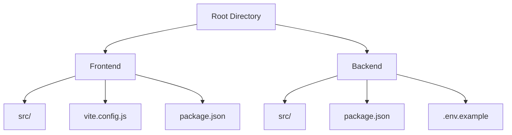
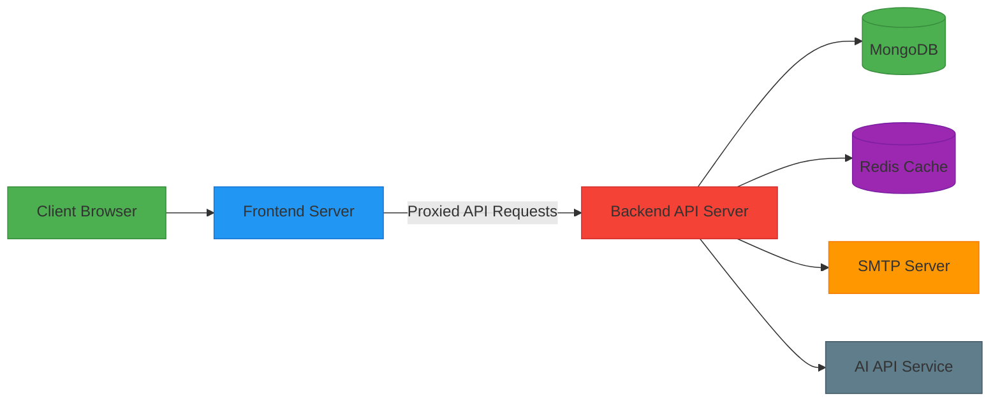
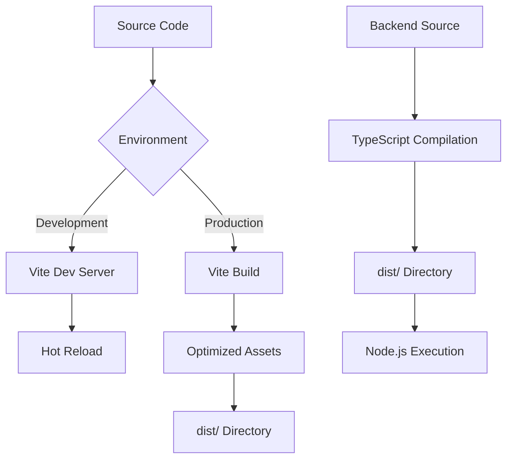
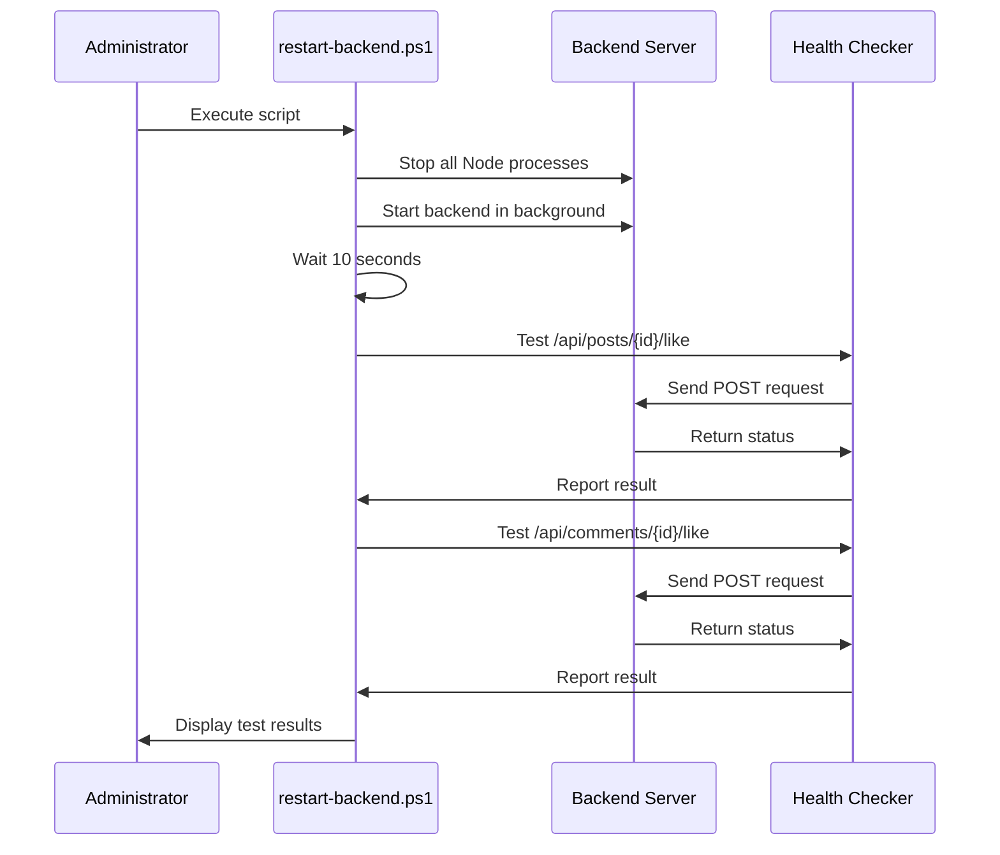
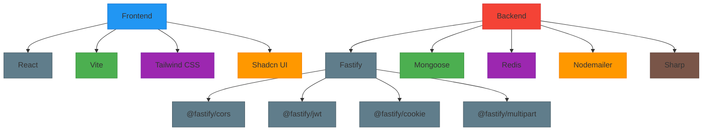

# Deployment Architecture

<cite>
**Referenced Files in This Document**   
- [package.json](file://package.json)
- [api-fastify/package.json](file://api-fastify/package.json)
- [restart-backend.ps1](file://restart-backend.ps1)
- [vite.config.js](file://vite.config.js)
- [api-fastify/src/server.ts](file://api-fastify/src/server.ts)
- [api-fastify/src/config/database.ts](file://api-fastify/src/config/database.ts)
- [api-fastify/src/services/cache.service.ts](file://api-fastify/src/services/cache.service.ts)
- [api-fastify/.env.example](file://api-fastify/.env.example)
- [api-fastify/src/services/email.service.ts](file://api-fastify/src/services/email.service.ts)
- [api-fastify/src/services/notification.service.ts](file://api-fastify/src/services/notification.service.ts)
</cite>

## Table of Contents
1. [Introduction](#introduction)
2. [Project Structure](#project-structure)
3. [Core Components](#core-components)
4. [Architecture Overview](#architecture-overview)
5. [Detailed Component Analysis](#detailed-component-analysis)
6. [Dependency Analysis](#dependency-analysis)
7. [Performance Considerations](#performance-considerations)
8. [Troubleshooting Guide](#troubleshooting-guide)
9. [Conclusion](#conclusion)

## Introduction
The MERN_chatai_blog application is a full-stack blog platform built with React, TypeScript, and Fastify. This document outlines the deployment architecture, focusing on build processes, runtime environment, deployment options, and operational procedures. The system follows a decoupled frontend-backend architecture with MongoDB as the primary data store and Redis for caching. The deployment strategy supports multiple environments and includes mechanisms for monitoring, error handling, and system health checks.

## Project Structure
The project follows a monorepo structure with two main components: a React frontend in the root directory and a Fastify backend in the `api-fastify` directory. The frontend uses Vite as the build tool with React and TypeScript, while the backend is built with Fastify, TypeScript, and MongoDB via Mongoose. The structure separates concerns between frontend and backend code, with shared configuration files at the root level.

**Diagram sources**
- [package.json](file://package.json)
- [api-fastify/package.json](file://api-fastify/package.json)

**Section sources**
- [package.json](file://package.json)
- [api-fastify/package.json](file://api-fastify/package.json)

## Core Components
The deployment architecture centers around two core components: the React frontend built with Vite and the Fastify backend API server. The frontend serves static assets through a development server or production build, while the backend provides RESTful endpoints for data operations. Key infrastructure components include MongoDB for persistent storage, Redis for caching, and Nodemailer for email services. The system uses JWT for authentication and implements comprehensive error handling with logging and notification systems.

**Section sources**
- [api-fastify/src/server.ts](file://api-fastify/src/server.ts)
- [api-fastify/src/config/database.ts](file://api-fastify/src/config/database.ts)
- [api-fastify/src/services/cache.service.ts](file://api-fastify/src/services/cache.service.ts)

## Architecture Overview
The deployment architecture follows a client-server model with the frontend and backend deployed separately. During development, Vite's proxy feature routes API requests from the frontend server (typically on port 5173) to the backend server (on port 4200). In production, the frontend is built into static files and can be served independently, while the backend runs as a Node.js application. The architecture includes Redis for caching frequently accessed data and session management, improving response times and reducing database load.

**Diagram sources**
- [vite.config.js](file://vite.config.js)
- [api-fastify/src/server.ts](file://api-fastify/src/server.ts)
- [api-fastify/src/config/database.ts](file://api-fastify/src/config/database.ts)

## Detailed Component Analysis

### Build Process and Pipeline
The build pipeline is configured through package.json scripts in both the frontend and backend. The frontend uses Vite for development and production builds, with the "build" script generating optimized static assets in the "dist" directory. The backend uses TypeScript compilation to transform source files into JavaScript in the "dist" directory. The development workflow supports hot reloading through Vite and tsx for the frontend and backend respectively.

**Diagram sources**
- [package.json](file://package.json)
- [api-fastify/package.json](file://api-fastify/package.json)
- [vite.config.js](file://vite.config.js)

**Section sources**
- [package.json](file://package.json)
- [api-fastify/package.json](file://api-fastify/package.json)

### Environment Management and Configuration
The system uses environment variables for configuration, with the backend providing a comprehensive .env.example file that defines all required variables. Configuration includes database connection strings, JWT secrets, email service settings, and AI API credentials. The frontend uses Vite's env loading mechanism to inject environment variables at build time, while the backend accesses environment variables directly at runtime.

**Section sources**
- [api-fastify/.env.example](file://api-fastify/.env.example)
- [vite.config.js](file://vite.config.js)

### Deployment Options and Strategies
The application supports multiple deployment strategies. The primary approach involves running the frontend and backend as separate services, with the frontend served as static files through a web server or CDN, and the backend running as a Node.js process. The restart-backend.ps1 script demonstrates a Windows-based deployment workflow that restarts the backend service and performs health checks on key endpoints. For production deployments, process managers like PM2 can be used to ensure service reliability.

**Diagram sources**
- [restart-backend.ps1](file://restart-backend.ps1)

**Section sources**
- [restart-backend.ps1](file://restart-backend.ps1)
- [package.json](file://package.json)

### Infrastructure Requirements
The deployment requires several infrastructure components: a Node.js runtime environment (version 14+), MongoDB database server, Redis cache server, and SMTP service for email delivery. The backend server needs sufficient memory to handle image processing operations, as the application includes file upload functionality with image optimization using Sharp. The recommended production setup includes environment-specific configuration, proper secret management, and secure connection settings for all external services.

**Section sources**
- [api-fastify/.env.example](file://api-fastify/.env.example)
- [api-fastify/src/services/email.service.ts](file://api-fastify/src/services/email.service.ts)
- [api-fastify/src/services/cache.service.ts](file://api-fastify/src/services/cache.service.ts)

### Scalability and Topology
The application architecture supports horizontal scaling of the backend services, as the state is primarily stored in MongoDB and Redis rather than in memory. Multiple backend instances can be deployed behind a load balancer, with Redis serving as a shared cache layer. The frontend, being static assets, can be easily distributed through CDNs for global reach and improved performance. Database scaling can be achieved through MongoDB clustering and sharding for high-traffic scenarios.

## Dependency Analysis
The application has well-defined dependencies managed through npm/pnpm. The frontend dependencies focus on UI components, state management, and development tools, while the backend dependencies include Fastify plugins for CORS, JWT authentication, cookie handling, and multipart form data processing. Both components use TypeScript and associated tooling for type safety. The backend also depends on Mongoose for MongoDB interactions, Redis for caching, and Nodemailer for email services.

**Diagram sources**
- [package.json](file://package.json)
- [api-fastify/package.json](file://api-fastify/package.json)

**Section sources**
- [package.json](file://package.json)
- [api-fastify/package.json](file://api-fastify/package.json)

## Performance Considerations
The deployment architecture incorporates several performance optimizations. The backend uses Redis caching to reduce database load and improve response times for frequently accessed data. Image uploads are optimized automatically using the Sharp library, reducing file sizes while maintaining quality. The frontend build process generates optimized static assets with code splitting and minification. The Fastify framework is known for its high performance and low overhead compared to other Node.js frameworks.

## Troubleshooting Guide
The system includes several mechanisms for troubleshooting and monitoring. The restart-backend.ps1 script includes endpoint testing to verify service availability after restarts. The backend implements comprehensive error logging with Pino, capturing detailed information about requests and errors. Error notifications are generated automatically for server-side errors, creating audit trails in the database. The CORS configuration includes detailed logging of origin validation, helping diagnose cross-origin request issues. Environment variables must be properly configured, particularly database connections, JWT secrets, and email service settings, to ensure all features work correctly.

**Section sources**
- [restart-backend.ps1](file://restart-backend.ps1)
- [api-fastify/src/server.ts](file://api-fastify/src/server.ts)
- [api-fastify/src/services/notification.service.ts](file://api-fastify/src/services/notification.service.ts)

## Conclusion
The MERN_chatai_blog deployment architecture provides a robust foundation for both development and production environments. The separation of frontend and backend components allows for independent scaling and deployment. The use of modern tools like Vite and Fastify ensures good performance, while the comprehensive configuration system supports multiple environments. The inclusion of caching, error monitoring, and health checks contributes to system reliability. For production deployment, additional considerations like process management, SSL termination, and backup procedures should be implemented to ensure high availability and data safety.