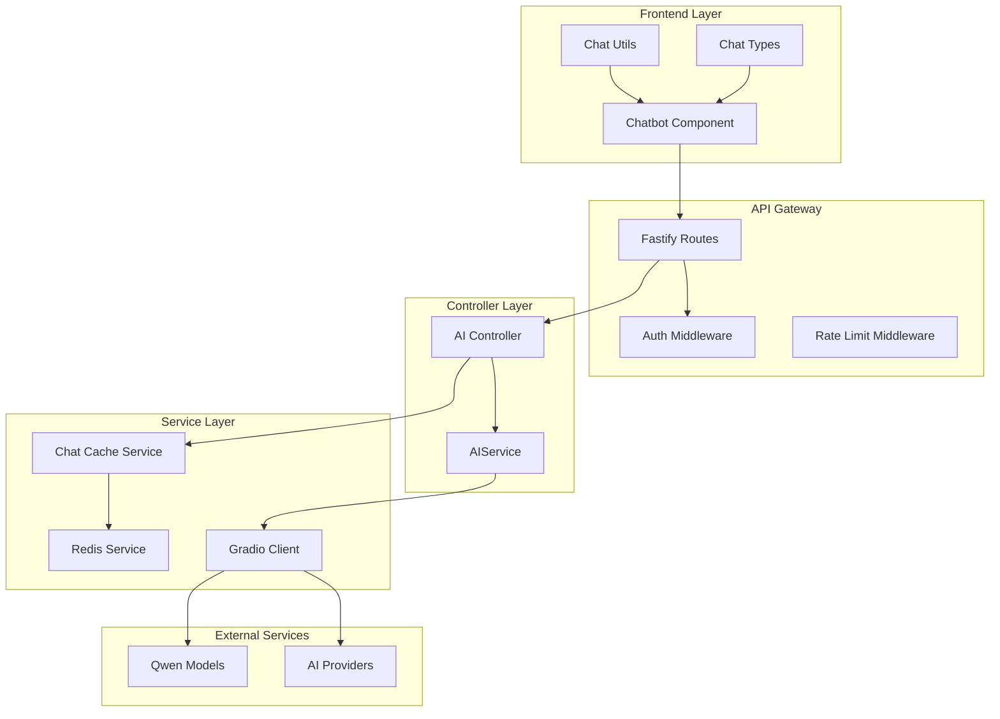
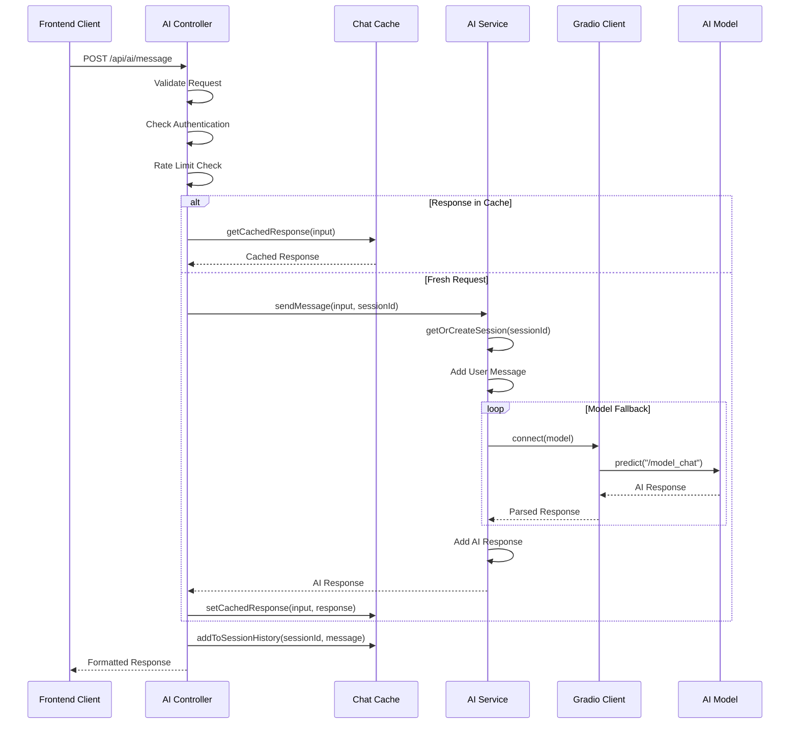
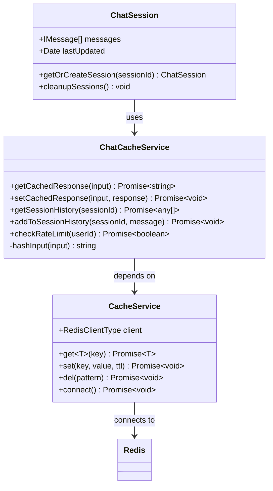
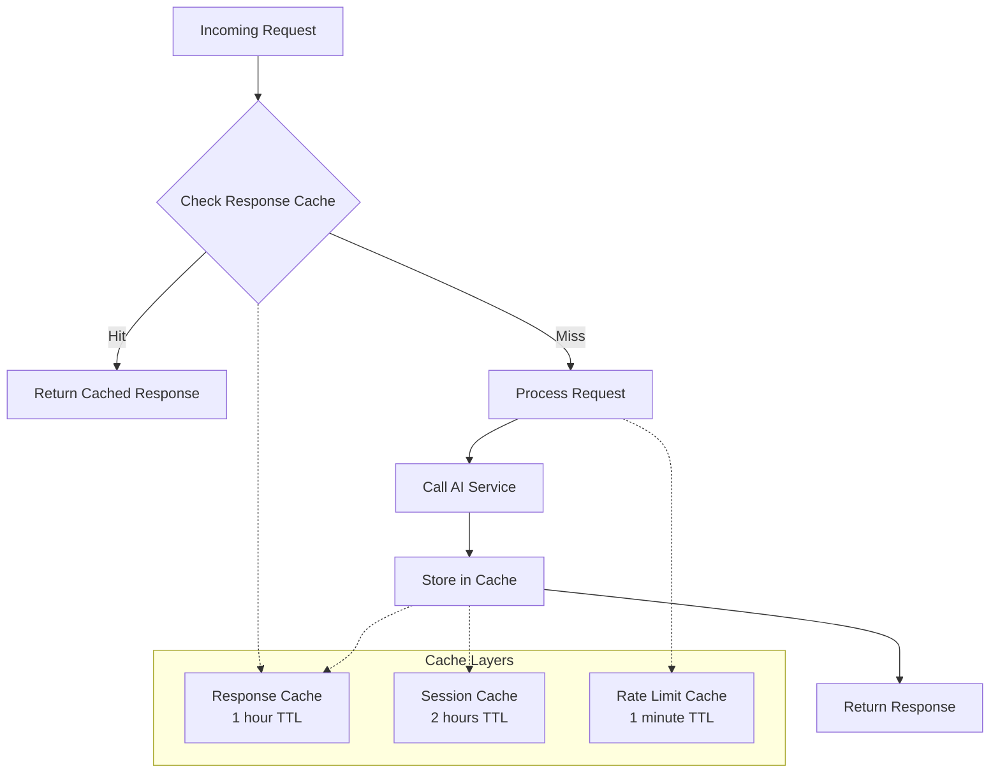
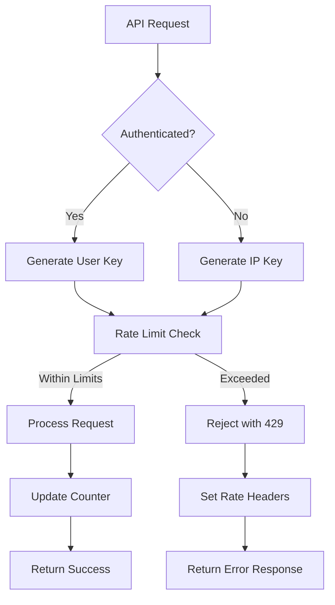
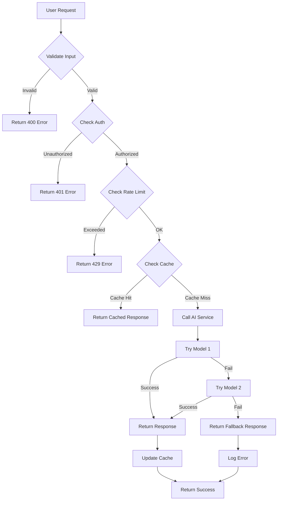

# AI Content Processing Backend

<cite>
**Referenced Files in This Document**
- [ai.controller.ts](file://api-fastify/src/controllers/ai.controller.ts)
- [ai.service.ts](file://api-fastify/src/services/ai.service.ts)
- [ai.routes.ts](file://api-fastify/src/routes/ai.routes.ts)
- [chat-cache.service.ts](file://api-fastify/src/services/chat-cache.service.ts)
- [cache.service.ts](file://api-fastify/src/services/cache.service.ts)
- [rate-limit.middleware.ts](file://api-fastify/src/middlewares/rate-limit.middleware.ts)
- [Chatbot.tsx](file://src/components/Chatbot.tsx)
- [ChatTypes.ts](file://src/types/ChatTypes.ts)
- [chatUtils.ts](file://src/lib/chatUtils.ts)
- [api.config.ts](file://src/config/api.config.ts)
- [conversation.types.ts](file://api-fastify/src/types/conversation.types.ts)
</cite>

## Table of Contents
1. [Introduction](#introduction)
2. [System Architecture](#system-architecture)
3. [Core Components](#core-components)
4. [Message Processing Pipeline](#message-processing-pipeline)
5. [Session Management](#session-management)
6. [Caching Strategy](#caching-strategy)
7. [Rate Limiting & Security](#rate-limiting--security)
8. [Error Handling & Resilience](#error-handling--resilience)
9. [Performance Considerations](#performance-considerations)
10. [Troubleshooting Guide](#troubleshooting-guide)
11. [Conclusion](#conclusion)

## Introduction

The AI content processing backend in MERN_chatai_blog provides intelligent conversational capabilities through a sophisticated service layer that integrates with external AI models via the @gradio/client library. The system implements a robust message handling pipeline that manages session-based conversations, ensures response caching, and maintains security through authentication and rate limiting mechanisms.

The architecture follows a layered approach with clear separation of concerns between the controller layer, service layer, and external AI integrations. The system is designed to handle concurrent user sessions while maintaining optimal performance through intelligent caching and fallback strategies.

## System Architecture

The AI content processing system is built on a Fastify-based backend with React frontend integration, utilizing Redis for caching and rate limiting. The architecture emphasizes scalability, reliability, and user experience through session persistence and intelligent response management.



**Diagram sources**
- [Chatbot.tsx](file://src/components/Chatbot.tsx#L1-L50)
- [ai.routes.ts](file://api-fastify/src/routes/ai.routes.ts#L1-L43)
- [ai.controller.ts](file://api-fastify/src/controllers/ai.controller.ts#L1-L70)

## Core Components

### AI Controller Layer

The AI controller serves as the primary entry point for chat interactions, implementing comprehensive request validation, authentication checks, and response formatting. The controller manages the complete request lifecycle from initial validation to final response delivery.

```typescript
// Request validation and authentication
export const sendMessage = async (
  request: FastifyRequest<{ Body: MessageRequest }>,
  reply: FastifyReply
) => {
  try {
    const { input, sessionId } = request.body;
    const userId = (request as any).user?.id;

    if (!input || !sessionId) {
      return reply.status(400).send({
        message: 'Le message et l\'identifiant de session sont requis',
      });
    }
    
    // Rate limiting check
    if (userId && !(await chatCache.checkRateLimit(userId))) {
      return reply.status(429).send({
        message: 'Trop de requêtes. Attendez une minute.',
        success: false
      });
    }
    
    // Response caching logic
    let response = await chatCache.getCachedResponse(input);
    
    if (!response) {
      response = await AIService.sendMessage(input, sessionId);
      await chatCache.setCachedResponse(input, response);
    }
    
    // Session history management
    await chatCache.addToSessionHistory(sessionId, {
      input,
      response,
      timestamp: new Date()
    });

    return reply.status(200).send({
      response,
      success: true,
      sessionId
    });
  } catch (error) {
    // Error logging and response
    request.log.error(error);
    return reply.status(500).send({
      message: 'Une erreur est survenue lors de l\'envoi du message',
      success: false,
      error: error instanceof Error ? error.message : 'Erreur inconnue'
    });
  }
};
```

### AI Service Layer

The AI service layer orchestrates communication with external AI models through the Gradio client, implementing robust error handling, model fallback strategies, and session management. The service maintains conversation context while optimizing for performance and reliability.

```typescript
// Session management and cleanup
const getOrCreateSession = (sessionId: string): ChatSession => {
  if (!chatSessions.has(sessionId)) {
    chatSessions.set(sessionId, {
      messages: [],
      lastUpdated: new Date(),
    });
  }

  const session = chatSessions.get(sessionId)!;
  session.lastUpdated = new Date();
  return session;
};

// Multi-model fallback implementation
const generateResponse = async (messages: IMessage[]): Promise<string> => {
  const models = [
    "Qwen/Qwen2-72B-Instruct",
    "Qwen/Qwen1.5-110B-Chat-demo"
  ];

  for (const model of models) {
    try {
      const client = await Client.connect(model);
      const lastUserMessage = messages[messages.length - 1].content;
      const history = messages.slice(0, -1).map(msg => [msg.content, msg.sender]);

      const result = await client.predict("/model_chat", {
        query: lastUserMessage,
        history: history,
        system: process.env.QWEN_PROMPT || "Tu es un assistant utile et amical pour un blog sur la technologie et l'IA."
      });

      if (!result || !result.data) {
        throw new Error("Format de réponse invalide de l'API");
      }

      const resultData = result.data as any;
      const aiResponse = resultData[1][resultData[1].length - 1][1];
      return aiResponse;
    } catch (error) {
      console.error(`Erreur lors de la génération de la réponse avec ${model}:`, error);
      
      if (model === models[models.length - 1]) {
        throw error;
      }
    }
  }

  throw new Error("Tous les modèles ont échoué à générer une réponse");
};
```

**Section sources**
- [ai.controller.ts](file://api-fastify/src/controllers/ai.controller.ts#L18-L70)
- [ai.service.ts](file://api-fastify/src/services/ai.service.ts#L25-L131)

## Message Processing Pipeline

The message processing pipeline implements a sophisticated workflow that transforms user input into AI-generated responses through multiple stages of validation, caching, and external API communication.



**Diagram sources**
- [ai.controller.ts](file://api-fastify/src/controllers/ai.controller.ts#L18-L60)
- [ai.service.ts](file://api-fastify/src/services/ai.service.ts#L85-L131)

### Request Payload Structure

The system expects a standardized request payload structure that includes both the user's input and session identifier:

```typescript
interface MessageRequest {
  input: string;      // User's message content
  sessionId: string;  // Unique session identifier
}
```

### Response Formatting Logic

The AI service implements comprehensive response formatting that includes error handling, fallback mechanisms, and structured data presentation:

```typescript
// Response generation with fallback
export const sendMessage = async (input: string, sessionId: string): Promise<string> => {
  try {
    const session = getOrCreateSession(sessionId);
    session.messages.push({ content: input, sender: 'user' });

    // Message history limitation
    if (session.messages.length > 10) {
      session.messages = session.messages.slice(-10);
    }

    const aiResponse = await generateResponse(session.messages);
    session.messages.push({ content: aiResponse, sender: 'assistant' });

    return aiResponse;
  } catch (error) {
    console.error('Erreur lors de l\'envoi du message à l\'IA:', error);
    return 'Désolé, je rencontre des difficultés à traiter votre demande pour le moment. Veuillez réessayer plus tard.';
  }
};
```

**Section sources**
- [ai.controller.ts](file://api-fastify/src/controllers/ai.controller.ts#L18-L70)
- [ai.service.ts](file://api-fastify/src/services/ai.service.ts#L85-L131)

## Session Management

The session management system maintains conversational context across multiple interactions while implementing automatic cleanup and persistence mechanisms. Sessions are managed in-memory with Redis-backed persistence for long-term storage.



**Diagram sources**
- [ai.service.ts](file://api-fastify/src/services/ai.service.ts#L10-L25)
- [chat-cache.service.ts](file://api-fastify/src/services/chat-cache.service.ts#L1-L47)
- [cache.service.ts](file://api-fastify/src/services/cache.service.ts#L1-L58)

### Session Lifecycle Management

The system implements automatic session lifecycle management with configurable TTL (Time To Live) policies:

```typescript
// Session cleanup mechanism
const cleanupSessions = () => {
  const now = new Date();
  for (const [sessionId, session] of chatSessions.entries()) {
    if (now.getTime() - session.lastUpdated.getTime() > SESSION_TTL) {
      chatSessions.delete(sessionId);
    }
  }
};

// Automatic cleanup interval
setInterval(cleanupSessions, 60 * 60 * 1000); // Every hour
```

### Session History Persistence

Session history is maintained in Redis with automatic trimming to prevent memory bloat:

```typescript
async addToSessionHistory(sessionId: string, message: any): Promise<void> {
  const key = `chat:session:${sessionId}`;
  const history = await this.getSessionHistory(sessionId);
  history.push(message);
  
  // Maintain only recent messages
  const trimmed = history.slice(-20);
  await cache.set(key, trimmed, 7200); // 2 hours TTL
}
```

**Section sources**
- [ai.service.ts](file://api-fastify/src/services/ai.service.ts#L10-L25)
- [chat-cache.service.ts](file://api-fastify/src/services/chat-cache.service.ts#L20-L30)

## Caching Strategy

The caching strategy implements a multi-layered approach that optimizes response times while maintaining data consistency. The system utilizes Redis for persistent caching with intelligent key management and TTL policies.

### Cache Architecture



**Diagram sources**
- [chat-cache.service.ts](file://api-fastify/src/services/chat-cache.service.ts#L5-L30)
- [cache.service.ts](file://api-fastify/src/services/cache.service.ts#L25-L45)

### Cache Implementation Details

The cache service provides a robust foundation with automatic connection management and error handling:

```typescript
// Intelligent cache key generation
private hashInput(input: string): string {
  return Buffer.from(input.toLowerCase().trim()).toString('base64').slice(0, 16);
}

// Multi-purpose cache operations
async getCachedResponse(input: string): Promise<string | null> {
  const key = `chat:response:${this.hashInput(input)}`;
  return await cache.get(key);
}

async setCachedResponse(input: string, response: string): Promise<void> {
  const key = `chat:response:${this.hashInput(input)}`;
  await cache.set(key, response, 3600); // 1 hour TTL
}
```

### Cache Performance Metrics

The caching system is designed to achieve high hit rates through intelligent key management and TTL optimization:

- **Response Cache**: 1-hour TTL for identical queries
- **Session Cache**: 2-hour TTL for conversation history
- **Rate Limit Cache**: 1-minute TTL for request throttling
- **Memory Efficiency**: Automatic cleanup of expired entries

**Section sources**
- [chat-cache.service.ts](file://api-fastify/src/services/chat-cache.service.ts#L5-L47)
- [cache.service.ts](file://api-fastify/src/services/cache.service.ts#L25-L58)

## Rate Limiting & Security

The system implements comprehensive rate limiting and security measures to protect against abuse while maintaining fair access for legitimate users. The rate limiting middleware provides granular control over API usage patterns.

### Rate Limiting Architecture



**Diagram sources**
- [rate-limit.middleware.ts](file://api-fastify/src/middlewares/rate-limit.middleware.ts#L15-L50)
- [ai.controller.ts](file://api-fastify/src/controllers/ai.controller.ts#L30-L40)

### Rate Limiting Implementation

The rate limiting middleware provides flexible configuration with support for both authenticated and anonymous users:

```typescript
// Generic rate limiting middleware
export function createRateLimitMiddleware(options: RateLimitOptions) {
  const {
    windowMs,
    maxRequests,
    keyGenerator = (request: FastifyRequest) => request.ip,
  } = options;

  return async (request: FastifyRequest, reply: FastifyReply) => {
    try {
      const key = `rate_limit:${keyGenerator(request)}`;
      const windowStart = Math.floor(Date.now() / windowMs) * windowMs;
      const windowKey = `${key}:${windowStart}`;

      const currentRequests = await cache.get<number>(windowKey) || 0;

      if (currentRequests >= maxRequests) {
        const resetTime = windowStart + windowMs;
        const retryAfter = Math.ceil((resetTime - Date.now()) / 1000);

        reply.header('X-RateLimit-Limit', maxRequests);
        reply.header('X-RateLimit-Remaining', 0);
        reply.header('X-RateLimit-Reset', resetTime);
        reply.header('Retry-After', retryAfter);

        return reply.status(429).send({
          message: 'Trop de requêtes. Veuillez réessayer plus tard.',
          retryAfter,
        });
      }

      // Increment counter and set TTL
      const newCount = currentRequests + 1;
      const ttl = Math.ceil((windowStart + windowMs - Date.now()) / 1000);
      await cache.set(windowKey, newCount, ttl);
    } catch (error) {
      // Graceful degradation on cache failure
      request.log.error('Erreur dans le rate limiting:', error);
    }
  };
}
```

### Security Features

The system implements multiple layers of security protection:

1. **Authentication Binding**: Rate limits are bound to authenticated users when available
2. **IP-based Fallback**: Anonymous users receive IP-based rate limiting
3. **Graceful Degradation**: Cache failures don't block legitimate requests
4. **Request Validation**: Input sanitization and length limits
5. **Session Isolation**: Each session operates independently

**Section sources**
- [rate-limit.middleware.ts](file://api-fastify/src/middlewares/rate-limit.middleware.ts#L15-L92)
- [ai.controller.ts](file://api-fastify/src/controllers/ai.controller.ts#L30-L40)

## Error Handling & Resilience

The AI content processing system implements comprehensive error handling and resilience mechanisms to ensure reliable operation under various failure conditions. The system employs multiple fallback strategies and graceful degradation patterns.

### Error Handling Architecture



**Diagram sources**
- [ai.controller.ts](file://api-fastify/src/controllers/ai.controller.ts#L18-L70)
- [ai.service.ts](file://api-fastify/src/services/ai.service.ts#L40-L80)

### Multi-Model Fallback Strategy

The AI service implements a robust fallback mechanism that attempts multiple AI models before failing gracefully:

```typescript
// Multi-model fallback implementation
const generateResponse = async (messages: IMessage[]): Promise<string> => {
  const models = [
    "Qwen/Qwen2-72B-Instruct",
    "Qwen/Qwen1.5-110B-Chat-demo"
  ];

  for (const model of models) {
    try {
      const client = await Client.connect(model);
      const lastUserMessage = messages[messages.length - 1].content;
      const history = messages.slice(0, -1).map(msg => [msg.content, msg.sender]);

      const result = await client.predict("/model_chat", {
        query: lastUserMessage,
        history: history,
        system: process.env.QWEN_PROMPT || "Tu es un assistant utile et amical pour un blog sur la technologie et l'IA."
      });

      if (!result || !result.data) {
        throw new Error("Format de réponse invalide de l'API");
      }

      const resultData = result.data as any;
      const aiResponse = resultData[1][resultData[1].length - 1][1];
      return aiResponse;
    } catch (error) {
      console.error(`Erreur lors de la génération de la réponse avec ${model}:`, error);
      
      if (model === models[models.length - 1]) {
        throw error;
      }
    }
  }

  throw new Error("Tous les modèles ont échoué à générer une réponse");
};
```

### Error Recovery Mechanisms

The system implements several error recovery mechanisms:

1. **Automatic Retry**: Failed requests are retried with alternative models
2. **Graceful Degradation**: Fallback responses maintain user experience
3. **Logging and Monitoring**: Comprehensive error logging for debugging
4. **Health Checks**: Regular monitoring of external service availability

**Section sources**
- [ai.service.ts](file://api-fastify/src/services/ai.service.ts#L40-L80)
- [ai.controller.ts](file://api-fastify/src/controllers/ai.controller.ts#L50-L70)

## Performance Considerations

The AI content processing system is optimized for high-performance operation with careful attention to response latency, resource utilization, and scalability. The architecture incorporates multiple optimization strategies to ensure optimal user experience.

### Performance Optimization Strategies

The system implements several key performance optimization strategies:

1. **Response Caching**: Intelligent caching reduces API calls and improves response times
2. **Connection Pooling**: Efficient management of external API connections
3. **Session Cleanup**: Automatic memory management prevents resource leaks
4. **Rate Limiting**: Prevents system overload and ensures fair resource distribution

### Latency Optimization

```typescript
// Optimized session management with automatic cleanup
const SESSION_TTL = 24 * 60 * 60 * 1000; // 24 hours

const cleanupSessions = () => {
  const now = new Date();
  for (const [sessionId, session] of chatSessions.entries()) {
    if (now.getTime() - session.lastUpdated.getTime() > SESSION_TTL) {
      chatSessions.delete(sessionId);
    }
  }
};

// Automatic cleanup every hour
setInterval(cleanupSessions, 60 * 60 * 1000);
```

### Scalability Features

The system is designed to scale horizontally with the following features:

- **Stateless Design**: No session state stored in memory beyond cleanup cycles
- **Redis Integration**: Persistent storage for session data and caching
- **Load Balancing**: Support for multiple backend instances
- **Resource Monitoring**: Built-in metrics for performance tracking

### Memory Management

```typescript
// Efficient message history management
if (session.messages.length > 10) {
  session.messages = session.messages.slice(-10);
}

// Automatic session cleanup
const trimmed = history.slice(-20);
await cache.set(key, trimmed, 7200); // 2 hours TTL
```

**Section sources**
- [ai.service.ts](file://api-fastify/src/services/ai.service.ts#L10-L25)
- [chat-cache.service.ts](file://api-fastify/src/services/chat-cache.service.ts#L20-L30)

## Troubleshooting Guide

This section provides comprehensive guidance for diagnosing and resolving common issues with the AI content processing system.

### Common Issues and Solutions

#### API Timeout Issues

**Symptoms**: Requests timing out or returning 504 errors
**Causes**: 
- External AI model unavailability
- Network connectivity issues
- High request volume

**Solutions**:
1. Check Redis connectivity: `redis-cli ping`
2. Verify AI model endpoints are accessible
3. Review rate limiting configuration
4. Monitor external service health

#### Authentication Failures

**Symptoms**: 401 Unauthorized responses
**Causes**:
- Expired or invalid JWT tokens
- Missing authentication headers
- User session expiration

**Solutions**:
1. Verify JWT token validity and expiration
2. Check authentication middleware configuration
3. Implement token refresh mechanisms
4. Review user session management

#### Cache Performance Issues

**Symptoms**: Slow response times despite cached data
**Causes**:
- Redis connectivity problems
- Cache key collisions
- Inappropriate TTL settings

**Solutions**:
1. Monitor Redis performance metrics
2. Review cache key generation logic
3. Adjust TTL settings based on usage patterns
4. Implement cache warming strategies

#### Rate Limiting Problems

**Symptoms**: 429 Too Many Requests responses
**Causes**:
- Aggressive rate limiting thresholds
- Misconfigured rate limiting keys
- User session conflicts

**Solutions**:
1. Review rate limiting configuration
2. Implement exponential backoff for clients
3. Adjust rate limiting thresholds
4. Monitor rate limiting effectiveness

### Debugging Tools and Techniques

#### Logging Configuration

Enable comprehensive logging for troubleshooting:

```typescript
// Enable debug logging
console.log(`Résultat brut de l'API (${model}):`, result.data);

// Error logging with context
console.error('Erreur lors de l\'envoi du message à l\'IA:', error);
```

#### Health Check Endpoints

The system provides health check endpoints for monitoring:

```typescript
// Test endpoint for service verification
fastify.get('/test', async () => {
  return {
    message: 'Service d\'IA fonctionnel',
    endpoints: {
      message: '/api/ai/message'
    },
    usage: 'Envoyez une requête POST à /api/ai/message avec un corps JSON contenant "input" et "sessionId"'
  };
});
```

#### Monitoring and Metrics

Implement monitoring for key performance indicators:

- Response time percentiles
- Cache hit rates
- Rate limiting violations
- External API availability
- Error rates by type

**Section sources**
- [ai.service.ts](file://api-fastify/src/services/ai.service.ts#L40-L80)
- [ai.routes.ts](file://api-fastify/src/routes/ai.routes.ts#L30-L43)

## Conclusion

The AI content processing backend in MERN_chatai_blog represents a sophisticated and resilient system for handling conversational AI interactions. Through its layered architecture, comprehensive caching strategy, and robust error handling mechanisms, the system delivers high-quality user experiences while maintaining operational reliability.

Key strengths of the system include:

- **Scalable Architecture**: Modular design supports horizontal scaling
- **Intelligent Caching**: Multi-tier caching reduces latency and API costs
- **Robust Error Handling**: Comprehensive fallback strategies ensure availability
- **Security Focus**: Authentication binding and rate limiting protect against abuse
- **Performance Optimization**: Automatic cleanup and resource management

The system's design demonstrates best practices for building production-ready AI services, with careful attention to reliability, security, and user experience. Future enhancements could include additional AI model integrations, advanced caching strategies, and enhanced monitoring capabilities.