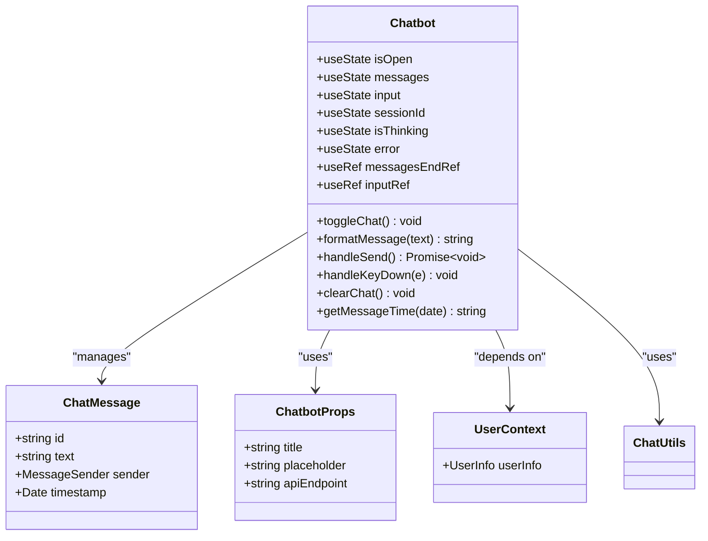
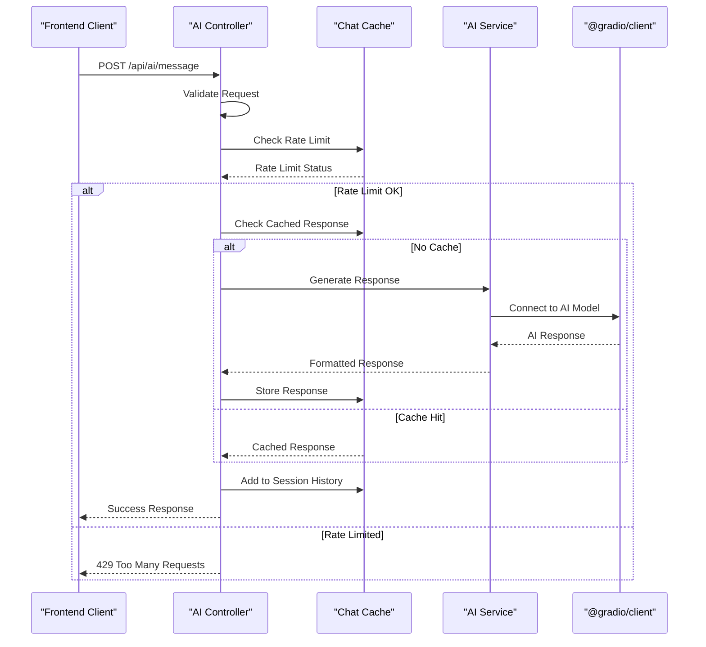
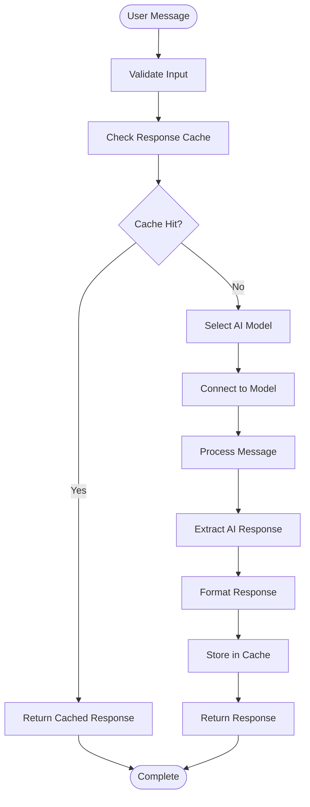
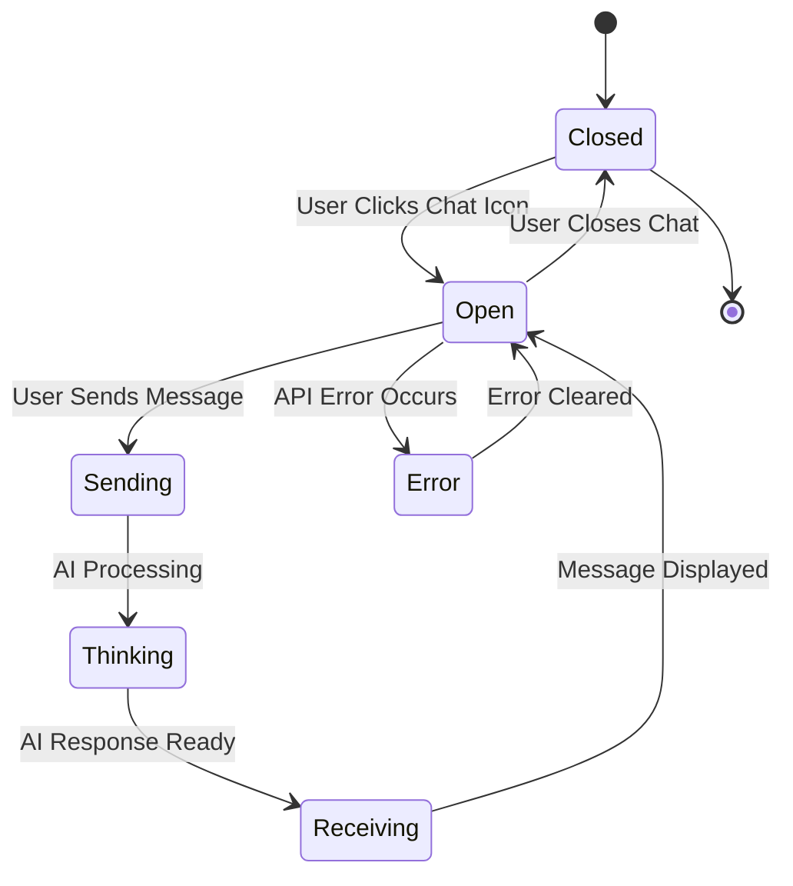

# AI Features Documentation

<cite>
**Referenced Files in This Document**
- [Chatbot.tsx](file://src/components/Chatbot.tsx)
- [ai.controller.ts](file://api-fastify/src/controllers/ai.controller.ts)
- [ai.service.ts](file://api-fastify/src/services/ai.service.ts)
- [chat-cache.service.ts](file://api-fastify/src/services/chat-cache.service.ts)
- [chatUtils.ts](file://src/lib/chatUtils.ts)
- [ChatTypes.ts](file://src/types/ChatTypes.ts)
- [ChatbotProps.ts](file://src/types/ChatbotProps.ts)
- [api.config.ts](file://src/config/api.config.ts)
- [conversation.types.ts](file://api-fastify/src/types/conversation.types.ts)
- [ai.routes.ts](file://api-fastify/src/routes/ai.routes.ts)
- [package.json](file://package.json)
- [api-fastify/package.json](file://api-fastify/package.json)
</cite>

## Table of Contents
1. [Introduction](#introduction)
2. [System Architecture](#system-architecture)
3. [Frontend Implementation](#frontend-implementation)
4. [Backend Services](#backend-services)
5. [AI Integration](#ai-integration)
6. [State Management](#state-management)
7. [Error Handling](#error-handling)
8. [Performance Optimization](#performance-optimization)
9. [Security Considerations](#security-considerations)
10. [Troubleshooting Guide](#troubleshooting-guide)
11. [Best Practices](#best-practices)

## Introduction

The MERN_chatai_blog project implements a sophisticated AI-powered chatbot system that enables users to interact with intelligent assistants for content exploration, Q&A, and assistance with blog-related queries. The system integrates seamlessly with external AI services through the @gradio/client library, providing real-time conversational capabilities with robust caching, rate limiting, and error handling mechanisms.

The AI features are built around a modern MERN stack architecture with React for the frontend and Fastify for the backend, ensuring scalability, performance, and maintainability. The system supports multiple AI models, automatic fallback mechanisms, and comprehensive session management for personalized user experiences.

## System Architecture

The AI system follows a layered architecture that separates concerns between frontend presentation, backend processing, and external AI service integration.

```mermaid
graph TB
subgraph "Frontend Layer"
ChatUI[Chatbot.tsx]
ChatUtils[chatUtils.ts]
ChatTypes[ChatTypes.ts]
end
subgraph "Backend Layer"
AIController[ai.controller.ts]
AIService[ai.service.ts]
CacheService[chat-cache.service.ts]
AuthMiddleware[auth.middleware.ts]
end
subgraph "External Services"
GradioClient[@gradio/client]
AIModels[AI Models<br/>Qwen/Qwen2-72B-Instruct<br/>Qwen/Qwen1.5-110B-Chat-demo]
end
subgraph "Infrastructure"
Redis[(Redis Cache)]
MongoDB[(MongoDB)]
end
ChatUI --> AIController
AIController --> AIService
AIController --> CacheService
AIService --> GradioClient
GradioClient --> AIModels
CacheService --> Redis
AIController --> AuthMiddleware
ChatUI -.-> ChatUtils
ChatUI -.-> ChatTypes
AIController -.-> ChatTypes
```

**Diagram sources**
- [Chatbot.tsx](file://src/components/Chatbot.tsx#L1-L355)
- [ai.controller.ts](file://api-fastify/src/controllers/ai.controller.ts#L1-L70)
- [ai.service.ts](file://api-fastify/src/services/ai.service.ts#L1-L131)
- [chat-cache.service.ts](file://api-fastify/src/services/chat-cache.service.ts#L1-L47)

## Frontend Implementation

The frontend AI chatbot is implemented as a React component that provides an intuitive interface for user interaction with the AI system.

### Chatbot Component Architecture



**Diagram sources**
- [Chatbot.tsx](file://src/components/Chatbot.tsx#L20-L355)
- [ChatTypes.ts](file://src/types/ChatTypes.ts#L1-L39)
- [ChatbotProps.ts](file://src/types/ChatbotProps.ts#L1-L6)

### Key Features

The Chatbot component implements several advanced features:

1. **Session Management**: Maintains persistent conversations using session IDs stored in localStorage
2. **Real-time Communication**: Handles asynchronous AI responses with loading indicators
3. **Markdown Formatting**: Processes and renders formatted text with bold, italic, links, and code blocks
4. **Authentication Integration**: Requires user authentication for AI interactions
5. **Local Storage Persistence**: Saves chat history locally for seamless user experience
6. **Responsive Design**: Adapts to different screen sizes with mobile-friendly controls

### State Management Pattern

The component uses React's built-in state management with sophisticated lifecycle handling:

```typescript
// Session initialization and persistence
const [sessionId, setSessionId] = useState<string>(() => {
  const storedSessionId = localStorage.getItem("chatSessionId")
  return storedSessionId || nanoid()
})

// Message persistence
useEffect(() => {
  saveMessagesToStorage(messages)
}, [messages])
```

**Section sources**
- [Chatbot.tsx](file://src/components/Chatbot.tsx#L30-L60)
- [chatUtils.ts](file://src/lib/chatUtils.ts#L35-L45)

## Backend Services

The backend AI system is built around a modular architecture that handles request routing, authentication, caching, and AI service integration.

### Controller Layer



**Diagram sources**
- [ai.controller.ts](file://api-fastify/src/controllers/ai.controller.ts#L15-L69)
- [ai.service.ts](file://api-fastify/src/services/ai.service.ts#L70-L131)
- [chat-cache.service.ts](file://api-fastify/src/services/chat-cache.service.ts#L1-L47)

### AI Service Implementation

The AI service implements a robust model selection and fallback mechanism:

```typescript
const generateResponse = async (messages: IMessage[]): Promise<string> => {
  const models = [
    "Qwen/Qwen2-72B-Instruct",
    "Qwen/Qwen1.5-110B-Chat-demo"
  ];

  for (const model of models) {
    try {
      const client = await Client.connect(model);
      // Process message with current model...
      return aiResponse;
    } catch (error) {
      if (model === models[models.length - 1]) {
        throw error;
      }
      console.log(`Essai avec le modèle suivant...`);
    }
  }
}
```

### Caching Strategy

The system implements a multi-layered caching approach:

1. **Response Caching**: Stores AI responses for identical queries
2. **Session History**: Maintains conversation context with sliding window
3. **Rate Limiting**: Prevents abuse with per-user request limits
4. **Model Fallback**: Automatic switching between AI models

**Section sources**
- [ai.controller.ts](file://api-fastify/src/controllers/ai.controller.ts#L15-L69)
- [ai.service.ts](file://api-fastify/src/services/ai.service.ts#L40-L85)
- [chat-cache.service.ts](file://api-fastify/src/services/chat-cache.service.ts#L1-L47)

## AI Integration

The system integrates with external AI services through the @gradio/client library, providing seamless access to powerful language models.

### Model Configuration

The AI service supports multiple models with automatic fallback:

```typescript
const models = [
  "Qwen/Qwen2-72B-Instruct",
  "Qwen/Qwen1.5-110B-Chat-demo"
];
```

### Request/Response Processing



**Diagram sources**
- [ai.service.ts](file://api-fastify/src/services/ai.service.ts#L40-L85)

### Session Management

The system maintains conversation context through session management:

```typescript
interface ChatSession {
  messages: IMessage[];
  lastUpdated: Date;
}

const SESSION_TTL = 24 * 60 * 60 * 1000; // 24 hours
```

**Section sources**
- [ai.service.ts](file://api-fastify/src/services/ai.service.ts#L1-L131)
- [conversation.types.ts](file://api-fastify/src/types/conversation.types.ts#L1-L18)

## State Management

The AI system implements comprehensive state management across both frontend and backend components.

### Frontend State Patterns



### Local Storage Integration

The frontend persists chat state using localStorage:

```typescript
export function saveMessagesToStorage(messages: ChatMessage[]): void {
  if (messages.length > 0) {
    localStorage.setItem("chatMessages", JSON.stringify(messages))
  }
}

export function loadMessagesFromStorage(): ChatMessage[] {
  const savedMessages = localStorage.getItem("chatMessages")
  if (savedMessages) {
    try {
      const parsedMessages = JSON.parse(savedMessages)
      return parsedMessages.map((msg: any) => ({
        ...msg,
        timestamp: new Date(msg.timestamp)
      }))
    } catch (err) {
      console.error("Error loading saved messages:", err)
    }
  }
  return []
}
```

**Section sources**
- [chatUtils.ts](file://src/lib/chatUtils.ts#L35-L69)

## Error Handling

The AI system implements comprehensive error handling at multiple levels.

### Frontend Error Management

```typescript
const handleSend = async () => {
  try {
    // AI request logic...
  } catch (error) {
    console.error("Error:", error)
    setError(error instanceof Error ? error.message : "Une erreur est survenue")
  } finally {
    setIsThinking(false)
  }
}
```

### Backend Error Handling

```typescript
try {
  // AI processing logic...
  return reply.status(200).send({
    response,
    success: true,
    sessionId
  });
} catch (error) {
  request.log.error(error);
  return reply.status(500).send({
    message: 'Une erreur est survenue lors de l\'envoi du message',
    success: false,
    error: error instanceof Error ? error.message : 'Erreur inconnue'
  });
}
```

### Error Categories

1. **Network Errors**: API connectivity issues
2. **Authentication Errors**: User not logged in
3. **Rate Limiting**: Exceeded request limits
4. **Model Failures**: AI service unavailable
5. **Validation Errors**: Invalid input data

**Section sources**
- [Chatbot.tsx](file://src/components/Chatbot.tsx#L130-L170)
- [ai.controller.ts](file://api-fastify/src/controllers/ai.controller.ts#L50-L69)

## Performance Optimization

The AI system implements several performance optimization strategies.

### Caching Mechanisms

1. **Response Caching**: Reduces redundant API calls
2. **Session Cleanup**: Removes expired sessions automatically
3. **Sliding Window**: Limits conversation history size

### Rate Limiting

```typescript
async checkRateLimit(userId: string): Promise<boolean> {
  const key = `chat:rate:${userId}`;
  const count = await cache.get<number>(key) || 0;
  
  if (count >= 10) return false; // Max 10 messages/minute
  
  await cache.set(key, count + 1, 60); // 1 minute
  return true;
}
```

### Memory Management

The system implements automatic memory cleanup:

```typescript
const cleanupSessions = () => {
  const now = new Date();
  for (const [sessionId, session] of chatSessions.entries()) {
    if (now.getTime() - session.lastUpdated.getTime() > SESSION_TTL) {
      chatSessions.delete(sessionId);
    }
  }
};

// Clean up sessions every hour
setInterval(cleanupSessions, 60 * 60 * 1000);
```

**Section sources**
- [chat-cache.service.ts](file://api-fastify/src/services/chat-cache.service.ts#L25-L47)
- [ai.service.ts](file://api-fastify/src/services/ai.service.ts#L15-L30)

## Security Considerations

The AI system implements multiple security measures to protect against abuse and ensure safe operation.

### Authentication Requirements

```typescript
// Frontend: User must be authenticated
if (!userInfo) {
  setError("Vous devez être connecté pour utiliser le chat. Veuillez vous connecter.")
  return
}

// Backend: Authentication middleware
fastify.post('/message', {
  preHandler: [authenticate],
  // ...
})
```

### Input Validation

```typescript
if (!input || !sessionId) {
  return reply.status(400).send({
    message: 'Le message et l\'identifiant de session sont requis',
  });
}
```

### Rate Limiting

The system prevents abuse through per-user rate limiting:

- Maximum 10 requests per minute per user
- Automatic cleanup of expired rate limit counters
- Graceful degradation when limits are exceeded

**Section sources**
- [Chatbot.tsx](file://src/components/Chatbot.tsx#L130-L140)
- [ai.controller.ts](file://api-fastify/src/controllers/ai.controller.ts#L18-L25)

## Troubleshooting Guide

### Common Issues and Solutions

#### 1. AI Service Unavailable

**Symptoms**: 
- "Tous les modèles ont échoué à générer une réponse"
- Network errors in browser console

**Solutions**:
- Verify @gradio/client installation
- Check network connectivity to AI service
- Review model availability and quotas
- Implement proper error handling for fallback scenarios

#### 2. Rate Limiting Issues

**Symptoms**:
- "Trop de requêtes. Attendez une minute."
- 429 HTTP status codes

**Solutions**:
- Implement exponential backoff retry logic
- Increase rate limit thresholds for trusted users
- Add user feedback for rate limit violations

#### 3. Session Persistence Problems

**Symptoms**:
- Chat history not persisting
- New session created on every page load

**Solutions**:
- Verify localStorage availability
- Check browser privacy settings
- Implement fallback to server-side session storage

#### 4. Authentication Failures

**Symptoms**:
- "Vous devez être connecté pour utiliser le chat"
- Authentication tokens expired

**Solutions**:
- Implement automatic token refresh
- Add login redirect with return URL
- Provide clear error messaging

### Debugging Tools

1. **Browser Developer Tools**: Monitor network requests and console errors
2. **Backend Logs**: Enable detailed logging for AI service calls
3. **Redis Monitoring**: Track cache hit rates and memory usage
4. **Performance Profiling**: Monitor response times and resource usage

**Section sources**
- [ai.service.ts](file://api-fastify/src/services/ai.service.ts#L115-L131)
- [chat-cache.service.ts](file://api-fastify/src/services/chat-cache.service.ts#L25-L35)

## Best Practices

### Development Guidelines

1. **Error Handling**: Always implement comprehensive error handling
2. **Rate Limiting**: Apply appropriate limits to prevent abuse
3. **Caching**: Use caching strategically to improve performance
4. **Authentication**: Require authentication for sensitive operations
5. **Logging**: Implement structured logging for debugging and monitoring

### Production Deployment

1. **Environment Variables**: Configure AI service endpoints securely
2. **Monitoring**: Set up alerts for service availability and performance
3. **Backup**: Implement backup strategies for cached data
4. **Scaling**: Plan for horizontal scaling with Redis clustering
5. **Security**: Regular security audits and updates

### User Experience

1. **Loading States**: Provide clear feedback during AI processing
2. **Error Messages**: Offer helpful, non-technical error messages
3. **Session Persistence**: Maintain context across browser sessions
4. **Mobile Optimization**: Ensure responsive design for all devices
5. **Accessibility**: Implement proper ARIA labels and keyboard navigation

The MERN_chatai_blog AI system demonstrates a well-architected approach to integrating artificial intelligence into web applications, combining modern development practices with robust error handling and performance optimization. The system's modular design ensures maintainability and extensibility while providing a seamless user experience for AI-powered interactions.