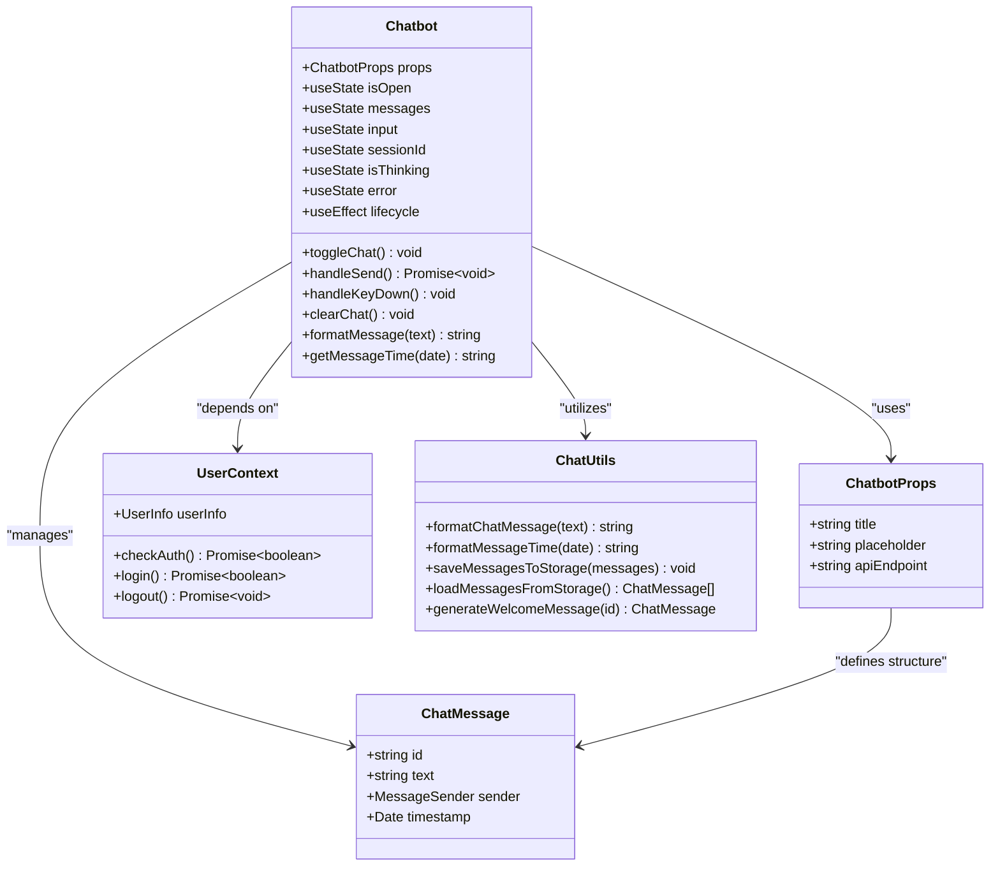
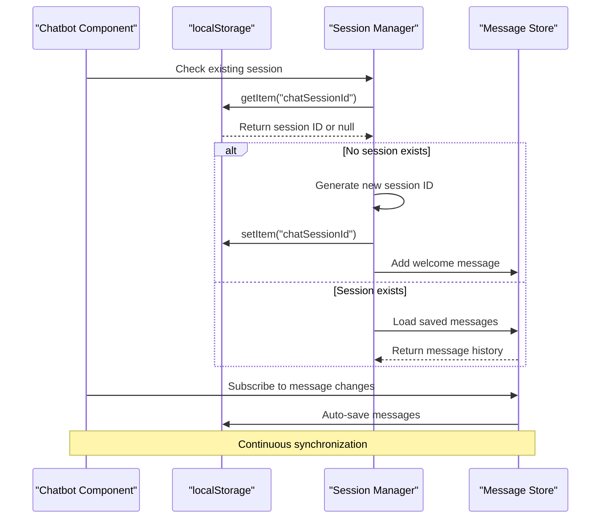
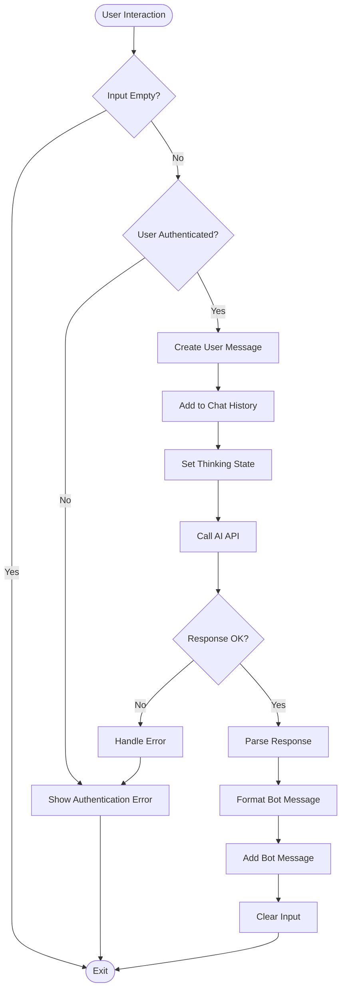
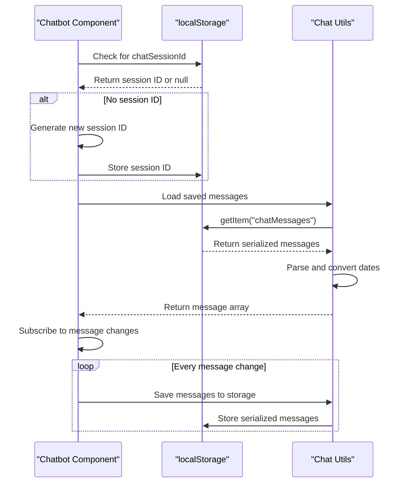

# Chatbot Interface

<cite>
**Referenced Files in This Document**
- [Chatbot.tsx](file://src/components/Chatbot.tsx)
- [ChatTypes.ts](file://src/types/ChatTypes.ts)
- [ChatbotProps.ts](file://src/types/ChatbotProps.ts)
- [chatUtils.ts](file://src/lib/chatUtils.ts)
- [api.config.ts](file://src/config/api.config.ts)
- [UserContext.tsx](file://src/UserContext.tsx)
- [utils.ts](file://src/lib/utils.ts)
- [tailwind.config.js](file://tailwind.config.js)
- [Button.tsx](file://src/components/ui/button/Button.tsx)
- [input.tsx](file://src/components/ui/input.tsx)
</cite>

## Table of Contents
1. [Introduction](#introduction)
2. [Component Architecture](#component-architecture)
3. [State Management](#state-management)
4. [Lifecycle Management](#lifecycle-management)
5. [User Interaction Handlers](#user-interaction-handlers)
6. [External Service Integration](#external-service-integration)
7. [Local Storage Persistence](#local-storage-persistence)
8. [Visual Design and Theming](#visual-design-and-theming)
9. [Accessibility and Responsive Design](#accessibility-and-responsive-design)
10. [Error Handling](#error-handling)
11. [Common Issues and Solutions](#common-issues-and-solutions)
12. [Customization Guide](#customization-guide)
13. [Performance Considerations](#performance-considerations)
14. [Troubleshooting](#troubleshooting)

## Introduction

The Chatbot component is a sophisticated AI-powered chat interface built for the MERN_chatai_blog application. It provides users with an interactive way to engage with an AI assistant through a modern, responsive design that integrates seamlessly with the blog platform's authentication system and message persistence mechanisms.

This component serves as the primary interface for AI-driven interactions, offering features such as real-time messaging, session management, message formatting, and seamless integration with the backend AI service. The chatbot is designed to enhance user engagement by providing intelligent assistance with blog-related queries and general knowledge questions.

## Component Architecture

The Chatbot component follows a functional React architecture with TypeScript for type safety and comprehensive state management. The component is structured around several key architectural patterns:



**Diagram sources**
- [Chatbot.tsx](file://src/components/Chatbot.tsx#L1-L355)
- [ChatTypes.ts](file://src/types/ChatTypes.ts#L1-L39)
- [ChatbotProps.ts](file://src/types/ChatbotProps.ts#L1-L6)

**Section sources**
- [Chatbot.tsx](file://src/components/Chatbot.tsx#L1-L355)
- [ChatTypes.ts](file://src/types/ChatTypes.ts#L1-L39)

## State Management

The Chatbot component manages five primary pieces of state, each serving a specific purpose in the chat functionality:

### Core State Variables

```typescript
// Chat visibility state
const [isOpen, setIsOpen] = useState<boolean>(false)

// Message history storage
const [messages, setMessages] = useState<ChatMessage[]>([])

// Current user input
const [input, setInput] = useState<string>("")

// Session identifier for maintaining conversation continuity
const [sessionId, setSessionId] = useState<string>(() => {
  const storedSessionId = localStorage.getItem("chatSessionId")
  return storedSessionId || nanoid()
})

// Loading state during AI response generation
const [isThinking, setIsThinking] = useState<boolean>(false)

// Error state for displaying user-friendly error messages
const [error, setError] = useState<string | null>(null)
```

### State Interdependencies

The state variables work together to create a cohesive chat experience:

- **isOpen** controls the visibility of the chat interface
- **messages** maintains the conversation history
- **input** captures user text input
- **sessionId** ensures persistent conversations across browser sessions
- **isThinking** provides feedback during AI processing
- **error** displays user-friendly error messages

**Section sources**
- [Chatbot.tsx](file://src/components/Chatbot.tsx#L30-L45)

## Lifecycle Management

The Chatbot component utilizes multiple `useEffect` hooks to manage various aspects of the component's lifecycle:

### Session Initialization Effect

```typescript
useEffect(() => {
  // Initialize session ID
  if (!localStorage.getItem("chatSessionId")) {
    const newSessionId = nanoid()
    setSessionId(newSessionId)
    localStorage.setItem("chatSessionId", newSessionId)
    
    // Add welcome message for new sessions
    const welcomeMsg = generateWelcomeMessage(nanoid())
    setMessages([welcomeMsg])
  } else {
    // Load saved messages
    const savedMessages = loadMessagesFromStorage()
    if (savedMessages.length > 0) {
      setMessages(savedMessages)
    } else {
      // Add welcome message if no saved messages
      const welcomeMsg = generateWelcomeMessage(nanoid())
      setMessages([welcomeMsg])
    }
  }
}, [])
```

### Message Persistence Effect

```typescript
useEffect(() => {
  saveMessagesToStorage(messages)
}, [messages])
```

### Scroll Behavior Effect

```typescript
useEffect(() => {
  messagesEndRef.current?.scrollIntoView({ behavior: "smooth" })
}, [messages])
```

### Input Focus Effect

```typescript
useEffect(() => {
  if (isOpen) {
    setTimeout(() => {
      inputRef.current?.focus()
    }, 300)
  }
}, [isOpen])
```



**Diagram sources**
- [Chatbot.tsx](file://src/components/Chatbot.tsx#L50-L75)
- [chatUtils.ts](file://src/lib/chatUtils.ts#L35-L50)

**Section sources**
- [Chatbot.tsx](file://src/components/Chatbot.tsx#L50-L85)

## User Interaction Handlers

The Chatbot component provides four primary interaction handlers that manage user input and actions:

### Toggle Chat Handler

```typescript
const toggleChat = () => {
  setIsOpen(!isOpen)
  setError(null)
}
```

This handler toggles the chat window visibility and clears any existing error messages.

### Send Message Handler

```typescript
const handleSend = async () => {
  if (input.trim() === "") return
  
  // Check if user is authenticated
  if (!userInfo) {
    setError("Vous devez être connecté pour utiliser le chat. Veuillez vous connecter.")
    return
  }
  
  setError(null)
  
  // Create new message
  const newUserMessage: ChatMessage = {
    id: nanoid(),
    text: input,
    sender: "user",
    timestamp: new Date()
  }
  
  // Add user message to chat
  setMessages(prev => [...prev, newUserMessage])
  setInput("")
  setIsThinking(true)
  
  try {
    const response = await fetch(apiEndpoint, {
      method: "POST",
      headers: {
        "Content-Type": "application/json",
      },
      body: JSON.stringify({ input, sessionId }),
      credentials: "include",
    })
    
    if (!response.ok) {
      if (response.status === 401) {
        throw new Error("Vous devez être connecté pour utiliser le chat. Veuillez vous connecter.")
      } else {
        throw new Error(`Erreur serveur: ${response.status}`)
      }
    }
    
    const data: ChatApiResponse = await response.json()
    
    if (!data.success) {
      throw new Error(data.error || "Erreur lors de la génération de la réponse")
    }
    
    // Create bot response message
    const botMessage: ChatMessage = {
      id: nanoid(),
      text: formatMessage(data.response),
      sender: "model",
      timestamp: new Date()
    }
    
    // Add bot message to chat
    setMessages(prev => [...prev, botMessage])
  } catch (error) {
    console.error("Error:", error)
    setError(error instanceof Error ? error.message : "Une erreur est survenue")
  } finally {
    setIsThinking(false)
  }
}
```

### Key Down Handler

```typescript
const handleKeyDown = (e: React.KeyboardEvent) => {
  if (e.key === "Enter" && !e.shiftKey) {
    e.preventDefault()
    handleSend()
  }
}
```

### Clear Chat Handler

```typescript
const clearChat = () => {
  setMessages([])
  localStorage.removeItem("chatMessages")
}
```



**Diagram sources**
- [Chatbot.tsx](file://src/components/Chatbot.tsx#L120-L180)

**Section sources**
- [Chatbot.tsx](file://src/components/Chatbot.tsx#L90-L190)

## External Service Integration

The Chatbot component integrates with external AI services through a configurable API endpoint system:

### API Endpoint Configuration

```typescript
const apiEndpoint = API_ENDPOINTS.ai.message
```

The component uses the `apiEndpoint` prop to configure the AI service endpoint, defaulting to the configured AI message endpoint from the API configuration.

### Authentication Integration

The component integrates with the UserContext to ensure proper authentication:

```typescript
const { userInfo } = UserContext()
```

This integration ensures that only authenticated users can access the chat functionality, providing security and personalized experiences.

### Network Communication

The component handles network communication with the AI service using the Fetch API:

```typescript
const response = await fetch(apiEndpoint, {
  method: "POST",
  headers: {
    "Content-Type": "application/json",
  },
  body: JSON.stringify({ input, sessionId }),
  credentials: "include",
})
```

The `credentials: "include"` option ensures that cookies are included in cross-origin requests, enabling proper authentication with the backend service.

**Section sources**
- [Chatbot.tsx](file://src/components/Chatbot.tsx#L25-L30)
- [Chatbot.tsx](file://src/components/Chatbot.tsx#L120-L140)
- [api.config.ts](file://src/config/api.config.ts#L75-L80)

## Local Storage Persistence

The Chatbot component implements robust message persistence using localStorage to maintain conversation continuity across browser sessions:

### Session Management

```typescript
const [sessionId, setSessionId] = useState<string>(() => {
  const storedSessionId = localStorage.getItem("chatSessionId")
  return storedSessionId || nanoid()
})
```

The component generates a unique session ID using nanoid if none exists, storing it in localStorage for future sessions.

### Message Storage Functions

```typescript
export function saveMessagesToStorage(messages: ChatMessage[]): void {
  if (messages.length > 0) {
    localStorage.setItem("chatMessages", JSON.stringify(messages))
  }
}

export function loadMessagesFromStorage(): ChatMessage[] {
  const savedMessages = localStorage.getItem("chatMessages")
  if (savedMessages) {
    try {
      const parsedMessages = JSON.parse(savedMessages)
      // Convert string timestamps back to Date objects
      return parsedMessages.map((msg: any) => ({
        ...msg,
        timestamp: new Date(msg.timestamp)
      }))
    } catch (err) {
      console.error("Error loading saved messages:", err)
    }
  }
  return []
}
```

### Persistence Workflow



**Diagram sources**
- [Chatbot.tsx](file://src/components/Chatbot.tsx#L40-L50)
- [chatUtils.ts](file://src/lib/chatUtils.ts#L35-L60)

**Section sources**
- [Chatbot.tsx](file://src/components/Chatbot.tsx#L40-L50)
- [chatUtils.ts](file://src/lib/chatUtils.ts#L35-L60)

## Visual Design and Theming

The Chatbot component employs a modern design system utilizing Tailwind CSS and Radix UI components for a polished user experience:

### Color Scheme

The component uses a lime-green color scheme that aligns with the blog's branding:

```typescript
// Background color for the toggle button
bg-lime-600 hover:bg-lime-700

// Header background
bg-lime-600 text-white

// User message background
bg-lime-600 text-white rounded-br-none

// Bot message background
bg-white dark:bg-gray-800 shadow-sm rounded-bl-none
```

### Component Integration

The Chatbot integrates with several UI components:

```typescript
import { Button } from "./ui/button"
import { Input } from "./ui/input"
import { Badge } from "./ui/badge"
import { Card, CardHeader, CardContent, CardFooter } from "./ui/card"
```

### Animation and Transitions

The component implements smooth animations for enhanced user experience:

```typescript
className={cn(
  "mt-3 w-80 md:w-96 transition-all duration-300 transform",
  isOpen
    ? "opacity-100 scale-100 translate-y-0"
    : "opacity-0 scale-95 translate-y-4 pointer-events-none"
)}
```

### Responsive Design

The component adapts to different screen sizes:

- Mobile: 80px width
- Desktop: 96px width (md breakpoint)
- Smooth transitions for opening/closing
- Proper spacing and sizing for touch interactions

**Section sources**
- [Chatbot.tsx](file://src/components/Chatbot.tsx#L200-L250)
- [tailwind.config.js](file://tailwind.config.js#L15-L50)

## Accessibility and Responsive Design

The Chatbot component incorporates several accessibility and responsive design features:

### Accessibility Features

- **Focus Management**: Automatic focus on input field when chat opens
- **Keyboard Navigation**: Enter key support for sending messages
- **Semantic HTML**: Proper use of buttons, inputs, and divs
- **Screen Reader Support**: Semantic structure and ARIA attributes

### Responsive Implementation

```typescript
// Fixed positioning for mobile devices
style={{ position: 'fixed', bottom: '20px', right: '20px' }}

// Responsive width
className="w-80 md:w-96"

// Touch-friendly sizing
className="h-12 w-12 rounded-full shadow-lg"
```

### Mobile Optimization

The component includes mobile-specific considerations:

- Touch-friendly button sizes
- Proper spacing for finger interactions
- Smooth animations that work on mobile devices
- Responsive input field sizing

**Section sources**
- [Chatbot.tsx](file://src/components/Chatbot.tsx#L200-L220)
- [Chatbot.tsx](file://src/components/Chatbot.tsx#L280-L300)

## Error Handling

The Chatbot component implements comprehensive error handling to provide users with meaningful feedback:

### Authentication Error Handling

```typescript
if (!userInfo) {
  setError("Vous devez être connecté pour utiliser le chat. Veuillez vous connecter.")
  return
}
```

### Network Error Handling

```typescript
try {
  const response = await fetch(apiEndpoint, {
    method: "POST",
    headers: {
      "Content-Type": "application/json",
    },
    body: JSON.stringify({ input, sessionId }),
    credentials: "include",
  })

  if (!response.ok) {
    if (response.status === 401) {
      throw new Error("Vous devez être connecté pour utiliser le chat. Veuillez vous connecter.")
    } else {
      throw new Error(`Erreur serveur: ${response.status}`)
    }
  }
} catch (error) {
  console.error("Error:", error)
  setError(error instanceof Error ? error.message : "Une erreur est survenue")
} finally {
  setIsThinking(false)
}
```

### Error Display

```typescript
{error && (
  <div className="flex max-w-[85%] mx-auto rounded-lg p-3 bg-red-50 text-red-700 border border-red-200">
    <div className="text-sm">
      <strong>Erreur:</strong> {error}
    </div>
  </div>
)}
```

### Error Categories

The component handles several types of errors:

- **Authentication Errors**: User not logged in
- **Network Errors**: API connectivity issues
- **Server Errors**: Backend service problems
- **Parsing Errors**: Invalid response format

**Section sources**
- [Chatbot.tsx](file://src/components/Chatbot.tsx#L120-L140)
- [Chatbot.tsx](file://src/components/Chatbot.tsx#L180-L190)

## Common Issues and Solutions

### localStorage Quota Limits

**Issue**: Browser localStorage quota exceeded
**Solution**: Implement message truncation or periodic cleanup

```typescript
// Potential solution for quota management
export function saveMessagesToStorage(messages: ChatMessage[]): void {
  const serialized = JSON.stringify(messages)
  if (serialized.length > localStorageSpaceAvailable()) {
    // Truncate oldest messages
    const truncated = messages.slice(-MAX_MESSAGES)
    localStorage.setItem("chatMessages", JSON.stringify(truncated))
  } else {
    localStorage.setItem("chatMessages", serialized)
  }
}
```

### Session Management Edge Cases

**Issue**: Session conflicts or corruption
**Solution**: Implement session validation and regeneration

```typescript
// Session validation
const validateSession = (sessionId: string): boolean => {
  return /^[a-zA-Z0-9_-]{21}$/.test(sessionId)
}
```

### UX Improvements for Mobile Devices

**Issue**: Small touch targets on mobile
**Solution**: Increase button sizes and spacing

```typescript
// Improved mobile touch targets
className="h-14 w-14 rounded-full shadow-lg"
```

### Performance Optimization

**Issue**: Slow rendering with large message histories
**Solution**: Implement virtual scrolling or message pagination

```typescript
// Virtual scrolling concept
const renderMessages = () => {
  const visibleMessages = messages.slice(-MAX_VISIBLE_MESSAGES)
  return visibleMessages.map(renderMessage)
}
```

## Customization Guide

The Chatbot component offers several customization options through props and styling:

### Props-Based Customization

```typescript
interface ChatbotProps {
  title?: string           // Chat window title
  placeholder?: string     // Input field placeholder
  apiEndpoint?: string     // Custom API endpoint
}
```

### Styling Overrides

The component supports extensive styling customization:

```typescript
// Custom button styling
className="h-12 w-12 rounded-full shadow-lg bg-custom-color hover:bg-hover-color"

// Custom message styling
className={cn(
  "flex flex-col max-w-[85%] rounded-lg p-3",
  msg.sender === "user"
    ? "ml-auto bg-user-color text-white"
    : "mr-auto bg-bot-color shadow-sm"
)}
```

### Theme Integration

The component integrates with the Tailwind CSS theme system:

```typescript
// Theme-aware colors
bg-lime-600 text-white
bg-white dark:bg-gray-800
```

### Message Formatting Customization

```typescript
// Custom message formatting
export function formatChatMessage(text: string): string {
  return text
    .replace(/\*\*(.*?)\*\*/g, "<strong class='text-bold'>$1</strong>")
    .replace(/\*(.*?)\*/g, "<em class='text-italic'>$1</em>")
    // Additional custom formatting rules
}
```

**Section sources**
- [ChatbotProps.ts](file://src/types/ChatbotProps.ts#L1-L6)
- [Chatbot.tsx](file://src/components/Chatbot.tsx#L200-L250)

## Performance Considerations

### Memory Management

The component implements efficient memory management through:

- **Message Truncation**: Preventing unlimited message accumulation
- **Session Cleanup**: Removing stale session data
- **Event Listener Cleanup**: Proper cleanup of effects

### Rendering Optimization

- **Conditional Rendering**: Only rendering visible elements
- **Memoization**: Using React.memo for expensive computations
- **Virtual Scrolling**: Potential implementation for large message lists

### Network Optimization

- **Debounced Sending**: Preventing rapid successive API calls
- **Request Caching**: Storing recent responses locally
- **Connection Pooling**: Reusing HTTP connections

## Troubleshooting

### Common Problems and Solutions

#### Chat Not Opening
**Symptoms**: Clicking the chat icon does nothing
**Causes**: 
- JavaScript errors preventing component mounting
- CSS conflicts blocking element visibility
- Missing dependencies

**Solutions**:
- Check browser console for JavaScript errors
- Verify Tailwind CSS is properly configured
- Ensure all required dependencies are installed

#### Messages Not Persisting
**Symptoms**: Chat history lost between sessions
**Causes**:
- localStorage disabled in browser
- Privacy mode restrictions
- Storage quota exceeded

**Solutions**:
- Check browser localStorage availability
- Implement fallback storage mechanisms
- Monitor storage usage

#### AI Responses Not Loading
**Symptoms**: Thinking indicator stays active indefinitely
**Causes**:
- API endpoint misconfiguration
- Network connectivity issues
- Authentication problems

**Solutions**:
- Verify API endpoint configuration
- Check network connectivity
- Ensure user authentication

### Debugging Tools

```typescript
// Enable debug logging
console.log("Chat state:", { isOpen, messages, sessionId, isThinking, error })

// Network request debugging
const debugFetch = async (url: string, options: RequestInit) => {
  console.log("Sending request:", { url, options })
  const response = await fetch(url, options)
  console.log("Received response:", { status: response.status, ok: response.ok })
  return response
}
```

### Monitoring and Analytics

Consider implementing monitoring for:

- **User Engagement**: Chat open/close frequency
- **Message Volume**: Average messages per session
- **Error Rates**: Frequency of different error types
- **Performance Metrics**: Response times and rendering performance