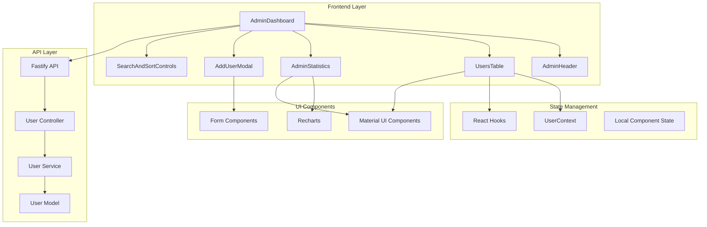
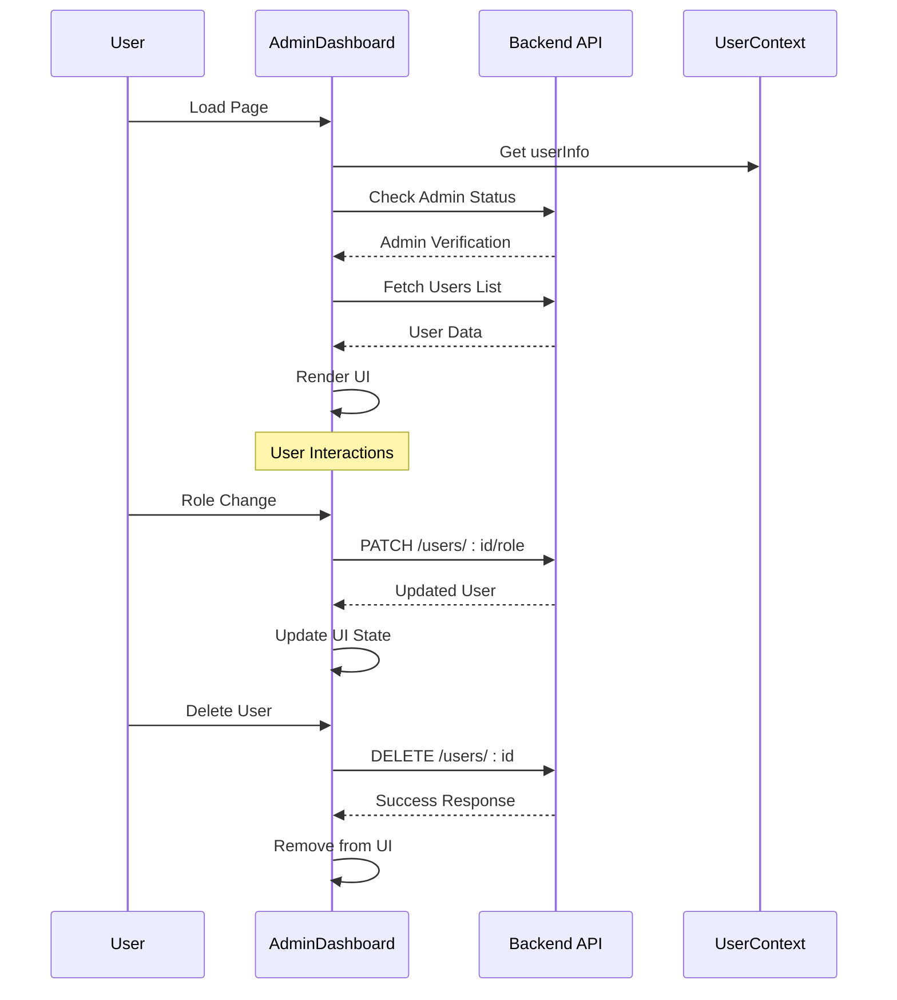
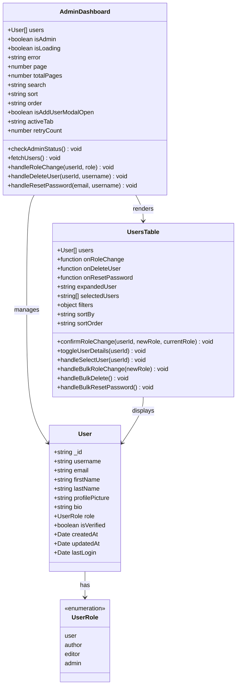
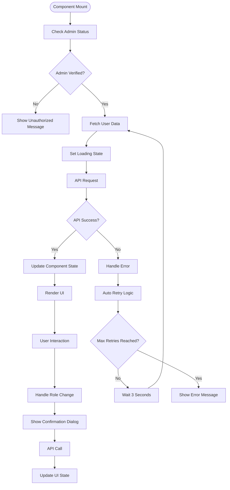
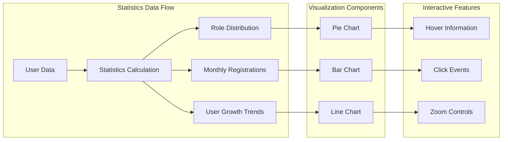
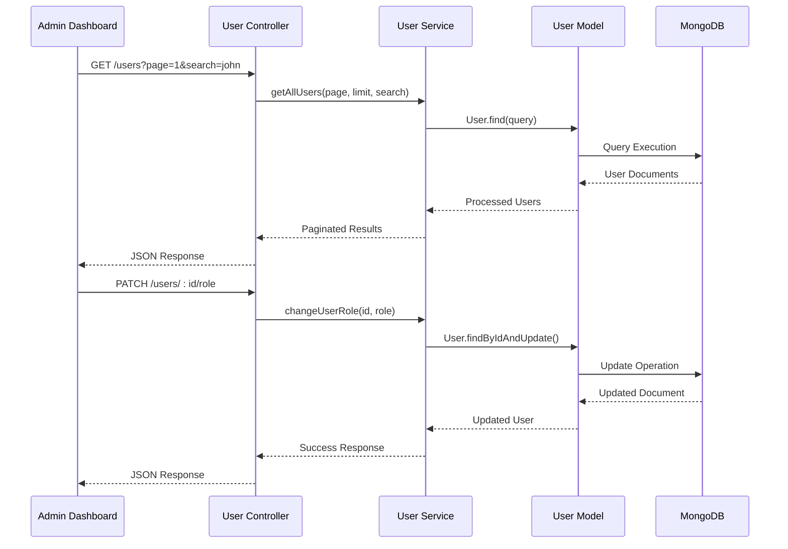

# Admin Dashboard

<cite>
**Referenced Files in This Document**
- [AdminDashboard.tsx](file://src/pages/AdminDashboard.tsx)
- [UsersTable.tsx](file://src/components/UsersTable.tsx)
- [AdminStatistics.tsx](file://src/components/AdminStatistics.tsx)
- [AddUserModal.tsx](file://src/components/AddUserModal.tsx)
- [SearchAndSortControls.tsx](file://src/components/SearchAndSortControls.tsx)
- [AdminHeader.tsx](file://src/components/AdminHeader.tsx)
- [api.config.ts](file://src/config/api.config.ts)
- [user.controller.ts](file://api-fastify/src/controllers/user.controller.ts)
- [user.service.ts](file://api-fastify/src/services/user.service.ts)
- [User.ts](file://src/types/User.ts)
</cite>

## Table of Contents
1. [Introduction](#introduction)
2. [Architecture Overview](#architecture-overview)
3. [Core Components](#core-components)
4. [Domain Model](#domain-model)
5. [State Management](#state-management)
6. [User Management Features](#user-management-features)
7. [Statistics Visualization](#statistics-visualization)
8. [Data Flow and API Integration](#data-flow-and-api-integration)
9. [Error Handling and Retry Mechanisms](#error-handling-and-retry-mechanisms)
10. [Performance Considerations](#performance-considerations)
11. [Troubleshooting Guide](#troubleshooting-guide)
12. [Conclusion](#conclusion)

## Introduction

The MERN_chatai_blog Admin Dashboard is a comprehensive administrative interface built with React and TypeScript, designed to manage users, roles, and site statistics. This dashboard provides administrators with powerful tools for user management, including role assignment, bulk operations, and real-time statistics visualization. The implementation follows modern React patterns using hooks, state management, and integrates seamlessly with the backend Fastify API.

The dashboard consists of two main tabs: **User Management** and **Site Statistics**, each serving distinct administrative purposes while maintaining a unified interface design. The system emphasizes accessibility, performance, and user experience through thoughtful UI/UX design and robust error handling.

## Architecture Overview

The admin dashboard follows a modular architecture with clear separation of concerns between presentation, state management, and data access layers.



**Diagram sources**
- [AdminDashboard.tsx](file://src/pages/AdminDashboard.tsx#L1-L657)
- [AdminHeader.tsx](file://src/components/AdminHeader.tsx#L1-L415)
- [UsersTable.tsx](file://src/components/UsersTable.tsx#L1-L616)

## Core Components

### AdminDashboard Component

The main `AdminDashboard` component serves as the orchestrator for the entire administrative interface. It manages global state, handles authentication checks, and coordinates between different sub-components.

```typescript
// Core state management
const [users, setUsers] = useState<UserType[]>([])
const [isAdmin, setIsAdmin] = useState(false)
const [isLoading, setIsLoading] = useState(true)
const [error, setError] = useState<string | null>(null)
const [page, setPage] = useState(1)
const [totalPages, setTotalPages] = useState(1)
const [search, setSearch] = useState("")
const [sort, setSort] = useState("username")
const [order, setOrder] = useState("asc")
const [activeTab, setActiveTab] = useState<"users" | "statistics">("users")
```

The component implements sophisticated lifecycle management through React hooks:



**Diagram sources**
- [AdminDashboard.tsx](file://src/pages/AdminDashboard.tsx#L28-L104)
- [user.controller.ts](file://api-fastify/src/controllers/user.controller.ts#L1-L315)

### AdminHeader Component

The `AdminHeader` provides navigation and user management functionality with advanced features like real-time notifications and keyboard shortcuts.

```typescript
interface AdminHeaderProps {
  activeTab: "users" | "statistics"
  onTabChange: (tab: "users" | "statistics") => void
}
```

Key features include:
- **Tab Navigation**: Switch between Users and Statistics views
- **Real-time Notifications**: Integrated notification system with polling
- **Keyboard Shortcuts**: F5/F6 refresh, Ctrl+N for add user, ESC for modal close
- **Responsive Design**: Mobile-friendly navigation with hamburger menu

**Section sources**
- [AdminDashboard.tsx](file://src/pages/AdminDashboard.tsx#L1-L657)
- [AdminHeader.tsx](file://src/components/AdminHeader.tsx#L1-L415)

## Domain Model

The admin dashboard operates on a well-defined domain model centered around user management and site statistics.



**Diagram sources**
- [User.ts](file://src/types/User.ts#L1-L14)
- [AdminDashboard.tsx](file://src/pages/AdminDashboard.tsx#L1-L657)
- [UsersTable.tsx](file://src/components/UsersTable.tsx#L1-L616)

**Section sources**
- [User.ts](file://src/types/User.ts#L1-L14)
- [AdminDashboard.tsx](file://src/pages/AdminDashboard.tsx#L1-L657)

## State Management

The admin dashboard employs a hybrid state management approach combining React hooks with centralized user context.

### Global State Management

```typescript
// AdminDashboard state
const [users, setUsers] = useState<UserType[]>([])
const [isAdmin, setIsAdmin] = useState(false)
const [isLoading, setIsLoading] = useState(true)
const [error, setError] = useState<string | null>(null)
const [page, setPage] = useState(1)
const [totalPages, setTotalPages] = useState(1)
const [search, setSearch] = useState("")
const [sort, setSort] = useState("username")
const [order, setOrder] = useState("asc")
const [activeTab, setActiveTab] = useState<"users" | "statistics">("users")
```

### Component-Level State

The `UsersTable` component maintains its own internal state for filtering, sorting, and selection:

```typescript
const [expandedUser, setExpandedUser] = useState<string | null>(null)
const [selectedUsers, setSelectedUsers] = useState<string[]>([])
const [isFilterOpen, setIsFilterOpen] = useState(false)
const [filters, setFilters] = useState({
  role: "all",
  status: "all",
  search: ""
})
const [sortBy, setSortBy] = useState<"username" | "email" | "role" | "createdAt">("username")
const [sortOrder, setSortOrder] = useState<"asc" | "desc">("asc")
const [actionMenuOpen, setActionMenuOpen] = useState<string | null>(null)
```

### State Flow Architecture



**Diagram sources**
- [AdminDashboard.tsx](file://src/pages/AdminDashboard.tsx#L28-L104)
- [AdminDashboard.tsx](file://src/pages/AdminDashboard.tsx#L142-L289)

**Section sources**
- [AdminDashboard.tsx](file://src/pages/AdminDashboard.tsx#L1-L657)
- [UsersTable.tsx](file://src/components/UsersTable.tsx#L1-L616)

## User Management Features

### Role Assignment System

The dashboard implements a sophisticated role assignment system with strict validation and security measures.

```typescript
const handleRoleChange = useCallback(async (userId: string, newRole: "user" | "author" | "editor" | "admin" | "admin") => {
  setIsLoading(true)
  setError(null)

  try {
    console.log(`Changing role for user ${userId} to ${newRole}`)

    const response = await fetch(API_ENDPOINTS.users.changeRole(userId), {
      method: "PATCH",
      headers: {
        "Content-Type": "application/json",
      },
      body: JSON.stringify({ role: newRole }),
      credentials: "include",
    })

    if (!response.ok) {
      let errorMessage = "An error occurred while changing role";
      try {
        const errorData = await response.json();
        errorMessage = errorData.message || errorMessage;
        console.error("Error details:", errorData);
      } catch (e) {
        console.error("Could not parse error response:", e);
      }
      throw new Error(`${errorMessage} (${response.status})`);
    }

    const data = await response.json()
    console.log("Role change data:", data)

    // Update UI with server data
    setUsers((prevUsers) =>
      prevUsers.map((user) =>
        user._id === userId ? { ...user, role: newRole } : user
      )
    )

    console.log(data.message || "Role changed successfully")
  } catch (error) {
    console.error("Error changing role:", error)
    setError(error instanceof Error ? error.message : "An unknown error occurred")
  } finally {
    setIsLoading(false)
  }
}, [])
```

### Bulk Operations

The `UsersTable` component provides comprehensive bulk operation capabilities:

```typescript
const handleBulkRoleChange = (newRole: "user" | "author" | "editor" | "admin") => {
  if (selectedUsers.length === 0) return
  
  if (window.confirm(`Are you sure you want to change the role of ${selectedUsers.length} users to "${newRole}"?`)) {
    selectedUsers.forEach(userId => {
      const user = users.find(u => u._id === userId)
      if (user && user.role !== newRole) {
        onRoleChange(userId, newRole)
      }
    })
    setSelectedUsers([])
  }
}
```

### User Deletion with Confirmation

```typescript
const handleDeleteUser = useCallback(async (userId: string, username: string) => {
  if (!window.confirm(`Are you sure you want to delete user ${username}?`)) {
    return
  }

  setIsLoading(true)
  setError(null)

  try {
    console.log(`Deleting user ${userId}`)

    const response = await fetch(API_ENDPOINTS.users.detail(userId), {
      method: "DELETE",
      credentials: "include",
    })

    if (!response.ok) {
      let errorMessage = "An error occurred while deleting user";
      try {
        const errorData = await response.json();
        errorMessage = errorData.message || errorMessage;
        console.error("Error details:", errorData);
      } catch (e) {
        console.error("Could not parse error response:", e);
      }
      throw new Error(`${errorMessage} (${response.status})`);
    }

    const data = await response.json()
    console.log("User deletion data:", data)

    // Update UI by removing deleted user
    setUsers((prevUsers) => prevUsers.filter((user) => user._id !== userId))

    // Show success message
    alert(data.message || "User deleted successfully")
  } catch (error) {
    console.error("Error deleting user:", error)
    setError(error instanceof Error ? error.message : "An unknown error occurred")
  } finally {
    setIsLoading(false)
  }
}, [])
```

### Password Reset Functionality

```typescript
const handleResetPassword = useCallback(async (email: string, username: string) => {
  if (!window.confirm(`Send password reset email to ${username} (${email})?`)) {
    return
  }

  setIsLoading(true)
  setError(null)

  try {
    console.log(`Sending password reset to ${email}`)

    const response = await fetch(API_ENDPOINTS.auth.forgotPassword, {
      method: "POST",
      headers: {
        "Content-Type": "application/json",
      },
      body: JSON.stringify({ email }),
      credentials: "include",
    })

    if (!response.ok) {
      let errorMessage = "An error occurred while sending password reset email";
      try {
        const errorData = await response.json();
        errorMessage = errorData.message || errorMessage;
        console.error("Error details:", errorData);
      } catch (e) {
        console.error("Could not parse error response:", e);
      }
      throw new Error(`${errorMessage} (${response.status})`);
    }

    const data = await response.json()
    console.log("Password reset data:", data)

    // Show success message
    alert(data.message || "Password reset email sent successfully")
  } catch (error) {
    console.error("Error sending password reset email:", error)
    setError(error instanceof Error ? error.message : "An unknown error occurred")
  } finally {
    setIsLoading(false)
  }
}, [])
```

**Section sources**
- [AdminDashboard.tsx](file://src/pages/AdminDashboard.tsx#L142-L289)
- [UsersTable.tsx](file://src/components/UsersTable.tsx#L137-L180)

## Statistics Visualization

### AdminStatistics Component

The `AdminStatistics` component provides comprehensive site analytics using Recharts for data visualization.

```typescript
interface AdminStatisticsProps {
  users: UserType[]
}

export const AdminStatistics: React.FC<AdminStatisticsProps> = ({ users }) => {
  // Calculate statistics
  const totalUsers = users.length
  const verifiedUsers = users.filter(user => user.isVerified).length
  const unverifiedUsers = totalUsers - verifiedUsers
  const verificationRate = totalUsers > 0 ? Math.round((verifiedUsers / totalUsers) * 100) : 0

  const usersByRole = {
    admin: users.filter(user => user.role === 'admin').length,
    author: users.filter(user => user.role === 'author').length,
    editor: users.filter(user => user.role === 'editor').length,
    user: users.filter(user => user.role === 'user').length,
  }

  // Calculate users by month (for the last 6 months)
  const usersByMonth = () => {
    const months: Record<string, number> = {}
    const now = new Date()
    
    // Initialize the last 6 months with 0 users
    for (let i = 5; i >= 0; i--) {
      const month = new Date(now.getFullYear(), now.getMonth() - i, 1)
      const monthKey = month.toLocaleDateString('fr-FR', { month: 'short', year: '2-digit' })
      months[monthKey] = 0
    }
    
    // Count users by month
    users.forEach(user => {
      const createdAt = new Date(user.createdAt)
      // Only count users from the last 6 months
      if (createdAt >= new Date(now.getFullYear(), now.getMonth() - 5, 1)) {
        const monthKey = createdAt.toLocaleDateString('fr-FR', { month: 'short', year: '2-digit' })
        if (months[monthKey] !== undefined) {
          months[monthKey]++
        }
      }
    })
    
    return Object.entries(months).map(([month, count]) => ({ month, count }))
  }

  const monthlyData = usersByMonth()

  return (
    <div className="space-y-8">
      {/* Main statistics cards */}
      <div className="grid grid-cols-1 md:grid-cols-2 lg:grid-cols-4 gap-6">
        {/* StatCards for various metrics */}
      </div>
      
      {/* Charts section */}
      <div className="grid grid-cols-1 lg:grid-cols-2 gap-6">
        {/* User registrations over time */}
        <motion.div className="bg-white dark:bg-gray-800 rounded-lg shadow p-6 border border-gray-200 dark:border-gray-700">
          <h3 className="text-lg font-semibold text-gray-900 dark:text-white mb-4">Monthly Registrations</h3>
          <div className="h-80">
            <ResponsiveContainer width="100%" height="100%">
              <BarChart data={monthlyData}>
                <CartesianGrid strokeDasharray="3 3" stroke="#e5e7eb" />
                <XAxis dataKey="month" stroke="#6b7280" />
                <YAxis stroke="#6b7280" />
                {/* Additional chart configurations */}
              </BarChart>
            </ResponsiveContainer>
          </div>
        </motion.div>
      </div>
    </div>
  )
}
```

### Interactive Charts and Data Visualization

The statistics component utilizes Recharts for interactive data visualization:



**Diagram sources**
- [AdminStatistics.tsx](file://src/components/AdminStatistics.tsx#L1-L378)

**Section sources**
- [AdminStatistics.tsx](file://src/components/AdminStatistics.tsx#L1-L378)

## Data Flow and API Integration

### API Endpoint Configuration

The dashboard integrates with a Fastify backend through a well-structured API configuration:

```typescript
export const API_ENDPOINTS = {
  // Authentification
  auth: {
    login: `${API_BASE_URL}/auth/login`,
    register: `${API_BASE_URL}/auth/register`,
    logout: `${API_BASE_URL}/auth/logout`,
    forgotPassword: `${API_BASE_URL}/auth/forgot-password`,
    resetPassword: (token: string) => `${API_BASE_URL}/auth/reset-password/${token}`,
    verifyEmail: (token: string) => `${API_BASE_URL}/auth/verify-email/${token}`,
    me: `${API_BASE_URL}/auth/me`,
    checkAdmin: `${API_BASE_URL}/auth/check-admin`,
    checkAuthor: `${API_BASE_URL}/auth/check-author`,
  },

  // Utilisateurs
  users: {
    profile: `${API_BASE_URL}/users/profile`,
    update: `${API_BASE_URL}/users/profile`,
    changePassword: `${API_BASE_URL}/auth/change-password`,
    delete: `${API_BASE_URL}/users/profile`,
    list: `${API_BASE_URL}/users`,
    detail: (id: string) => `${API_BASE_URL}/users/${id}`,
    changeRole: (id: string) => `${API_BASE_URL}/users/${id}/role`,
    deleteAccount: `${API_BASE_URL}/users/delete-account`,
  },
}
```

### Data Fetching Implementation

The `fetchUsers` function demonstrates sophisticated data fetching with pagination, search, and sorting:

```typescript
const fetchUsers = useCallback(async () => {
  setIsLoading(true)
  setError(null)

  try {
    // Build URL with query parameters
    const baseUrl = API_ENDPOINTS.users.list

    // Check if baseUrl is a full URL or relative path
    let url;
    try {
      // Try to create a full URL
      url = new URL(baseUrl);
    } catch (e) {
      // If baseUrl is a relative path, create a URL with the current origin
      url = new URL(baseUrl, window.location.origin);
    }

    // Add query parameters
    url.searchParams.append("page", page.toString())
    url.searchParams.append("search", search)
    url.searchParams.append("sort", sort)
    url.searchParams.append("order", order)

    console.log("Fetching users from URL:", url.toString())

    const response = await fetch(url.toString(), {
      credentials: "include",
    })

    if (!response.ok) {
      let errorMessage = "Failed to fetch users";
      try {
        const errorData = await response.json();
        errorMessage = errorData.message || errorMessage;
        console.error("Error details:", errorData);
      } catch (e) {
        console.error("Could not parse error response:", e);
      }
      throw new Error(`${errorMessage} (${response.status})`);
    }

    const data = await response.json();
    console.log("Received user data:", data);

    // Check if data contains a users array
    if (data && Array.isArray(data.users)) {
      setUsers(data.users);
      setTotalPages(data.totalPages || 1);
    } else if (Array.isArray(data)) {
      // If data is directly a user array
      setUsers(data);
      setTotalPages(1);
    } else {
      console.error("Unexpected data format:", data);
      throw new Error("Unexpected data format");
    }
  } catch (error) {
    console.error("Error fetching users:", error);
    setError(`Unable to retrieve user list: ${error instanceof Error ? error.message : "Unknown error"}`);
  } finally {
    setIsLoading(false);
  }
}, [page, search, sort, order])
```

### Backend Controller Integration

The backend controllers handle user management operations with comprehensive error handling:



**Diagram sources**
- [user.controller.ts](file://api-fastify/src/controllers/user.controller.ts#L1-L315)
- [user.service.ts](file://api-fastify/src/services/user.service.ts#L1-L239)

**Section sources**
- [api.config.ts](file://src/config/api.config.ts#L1-L273)
- [AdminDashboard.tsx](file://src/pages/AdminDashboard.tsx#L103-L141)
- [user.controller.ts](file://api-fastify/src/controllers/user.controller.ts#L1-L315)

## Error Handling and Retry Mechanisms

### Comprehensive Error Management

The admin dashboard implements robust error handling with automatic retry mechanisms:

```typescript
// Auto-retry on error
useEffect(() => {
  if (error && retryCount < 3) {
    const timer = setTimeout(() => {
      setRetryCount(prev => prev + 1)
      if (activeTab === 'users') {
        fetchUsers()
      } else {
        checkAdminStatus()
      }
    }, 3000)
    
    return () => clearTimeout(timer)
  }
}, [error, retryCount, activeTab, fetchUsers, checkAdminStatus])
```

### Error Display and Recovery

```typescript
<motion.div 
  className="bg-red-50 dark:bg-red-900/20 border border-red-200 dark:border-red-800 rounded-lg p-6"
  key="error"
  initial={{ opacity: 0, y: 20 }}
  animate={{ opacity: 1, y: 0 }}
  exit={{ opacity: 0, y: -20 }}
  transition={{ duration: 0.2 }}
>
  <div className="flex items-start">
    <div className="flex-shrink-0">
      <AlertCircle className="w-6 h-6 text-red-600 dark:text-red-400" />
    </div>
    <div className="ml-3 flex-1">
      <h3 className="text-sm font-medium text-red-800 dark:text-red-200">An error occurred</h3>
      <p className="mt-1 text-sm text-red-700 dark:text-red-300">{error}</p>
      <div className="mt-4 flex space-x-3">
        <button
          onClick={() => {
            setError(null)
            setRetryCount(0)
            if (activeTab === 'users') fetchUsers()
            else checkAdminStatus()
          }}
          className="bg-red-600 hover:bg-red-700 text-white px-3 py-2 rounded-md text-sm font-medium transition-colors flex items-center"
        >
          <RefreshCw className={`w-4 h-4 mr-1 ${retryCount > 0 ? 'animate-spin' : ''}`} />
          Retry
        </button>
        <button
          onClick={() => setError(null)}
          className="bg-white hover:bg-gray-50 text-red-600 border border-red-300 px-3 py-2 rounded-md text-sm font-medium transition-colors flex items-center"
        >
          <X className="w-4 h-4 mr-1" />
          Dismiss
        </button>
      </div>
      {retryCount > 0 && (
        <p className="mt-2 text-xs text-red-600 dark:text-red-400">
          Retrying... ({retryCount}/3)
        </p>
      )}
    </div>
  </div>
</motion.div>
```

### Permission Error Handling

The backend implements strict permission controls:

```typescript
// Service for changing user role
export const changeUserRole = async (id: string, role: UserRole) => {
  // Vérifier si l'ID est valide
  if (!isValidObjectId(id)) {
    throw new Error('ID utilisateur invalide');
  }

  // Récupérer l'utilisateur
  const user = await User.findById(id);

  // Vérifier si l'utilisateur existe
  if (!user) {
    throw new Error('Utilisateur non trouvé');
  }

  // Empêcher la rétrogradation du dernier administrateur
  if (user.role === UserRole.ADMIN && role !== UserRole.ADMIN) {
    const adminCount = await User.countDocuments({ role: UserRole.ADMIN });
    if (adminCount <= 1) {
      throw new Error('Impossible de rétrograder le dernier administrateur');
    }
  }

  // Mettre à jour le rôle de l'utilisateur
  user.role = role;
  await user.save();

  return {
    _id: user._id,
    username: user.username,
    email: user.email,
    role: user.role,
  };
};
```

**Section sources**
- [AdminDashboard.tsx](file://src/pages/AdminDashboard.tsx#L334-L374)
- [AdminDashboard.tsx](file://src/pages/AdminDashboard.tsx#L479-L520)
- [user.service.ts](file://api-fastify/src/services/user.service.ts#L120-L150)

## Performance Considerations

### Optimized Rendering

The dashboard employs several performance optimization techniques:

1. **Memoization**: Using `useCallback` and `useMemo` to prevent unnecessary re-renders
2. **Conditional Rendering**: Showing skeletons during loading states
3. **Virtual Scrolling**: Efficient rendering of large datasets
4. **Debounced Search**: Preventing excessive API calls during search

### Loading States and UX

```typescript
// Loading state management
const [isLoading, setIsLoading] = useState(true)

// Conditional rendering based on loading state
{isLoading ? (
  <motion.div 
    className="space-y-6"
    key="loading"
    initial={{ opacity: 0 }}
    animate={{ opacity: 1 }}
    exit={{ opacity: 0 }}
    transition={{ duration: 0.2 }}
  >
    {/* Skeleton for stats cards */}
    {activeTab === "users" && (
      <div className="grid grid-cols-1 md:grid-cols-2 lg:grid-cols-4 gap-6">
        {[...Array(4)].map((_, i) => (
          <div key={i} className="bg-white dark:bg-gray-800 rounded-lg shadow p-6 border border-gray-200 dark:border-gray-700 animate-pulse">
            <div className="flex items-center">
              <div className="w-12 h-12 bg-gray-300 dark:bg-gray-600 rounded-full mr-4"></div>
              <div className="flex-1">
                <div className="h-4 bg-gray-300 dark:bg-gray-600 rounded mb-2"></div>
                <div className="h-6 bg-gray-300 dark:bg-gray-600 rounded w-16"></div>
              </div>
            </div>
          </div>
        ))}
      </div>
    )}
    {/* Skeleton for main content */}
    <div className="bg-white dark:bg-gray-800 rounded-lg shadow border border-gray-200 dark:border-gray-700 animate-pulse">
      <div className="p-6 space-y-4">
        {[...Array(5)].map((_, i) => (
          <div key={i} className="h-12 bg-gray-300 dark:bg-gray-600 rounded"></div>
        ))}
      </div>
    </div>
  </motion.div>
) : error ? (
  // Error display logic
) : (
  // Main content rendering
)}
```

### Memory Management

The dashboard implements proper cleanup in effect hooks to prevent memory leaks:

```typescript
useEffect(() => {
  const handleKeyDown = (e: KeyboardEvent) => {
    // Keyboard shortcut handlers
  }

  window.addEventListener('keydown', handleKeyDown)
  return () => window.removeEventListener('keydown', handleKeyDown)
}, [activeTab, fetchUsers, checkAdminStatus])
```

**Section sources**
- [AdminDashboard.tsx](file://src/pages/AdminDashboard.tsx#L479-L520)
- [AdminDashboard.tsx](file://src/pages/AdminDashboard.tsx#L334-L374)

## Troubleshooting Guide

### Common Issues and Solutions

#### 1. Admin Authentication Failures

**Problem**: Users see unauthorized access message despite having admin privileges.

**Solution**:
```typescript
// Check admin status implementation
const checkAdminStatus = useCallback(async () => {
  try {
    setIsLoading(true)
    
    // First check userInfo from context
    if (userInfo && userInfo.role === 'admin') {
      setIsAdmin(true)
      return
    }

    const response = await fetch(API_ENDPOINTS.auth.checkAdmin, {
      credentials: "include",
    })

    if (!response.ok) {
      let errorMessage = "Failed to verify admin status";
      try {
        const errorData = await response.json();
        errorMessage = errorData.message || errorMessage;
      } catch (e) {
        console.error("Could not parse error response:", e);
      }
      throw new Error(`${errorMessage} (${response.status})`);
    }

    const data = await response.json()
    setIsAdmin(data.isAdmin)
  } catch (error) {
    console.error("Error checking admin status:", error)
    setIsAdmin(false)
    setError(`Unable to verify admin privileges: ${error instanceof Error ? error.message : "Unknown error"}`)
  } finally {
    setIsLoading(false)
  }
}, [userInfo])
```

#### 2. API Connection Issues

**Problem**: Dashboard fails to load user data or responds with network errors.

**Diagnostic Steps**:
1. Check browser console for CORS errors
2. Verify API endpoint availability
3. Review network tab for failed requests
4. Check authentication cookies

**Solution**:
```typescript
// Enhanced error handling with detailed logging
const fetchUsers = useCallback(async () => {
  setIsLoading(true)
  setError(null)

  try {
    // Build URL with comprehensive error handling
    const baseUrl = API_ENDPOINTS.users.list
    let url;
    
    try {
      url = new URL(baseUrl);
    } catch (e) {
      url = new URL(baseUrl, window.location.origin);
    }

    // Add query parameters
    url.searchParams.append("page", page.toString())
    url.searchParams.append("search", search)
    url.searchParams.append("sort", sort)
    url.searchParams.append("order", order)

    console.log("Fetching users from URL:", url.toString())

    const response = await fetch(url.toString(), {
      credentials: "include",
    })

    if (!response.ok) {
      let errorMessage = "Failed to fetch users";
      try {
        const errorData = await response.json();
        errorMessage = errorData.message || errorMessage;
        console.error("Error details:", errorData);
      } catch (e) {
        console.error("Could not parse error response:", e);
      }
      throw new Error(`${errorMessage} (${response.status})`);
    }

    const data = await response.json();
    console.log("Received user data:", data);

    // Validate data format
    if (data && Array.isArray(data.users)) {
      setUsers(data.users);
      setTotalPages(data.totalPages || 1);
    } else if (Array.isArray(data)) {
      setUsers(data);
      setTotalPages(1);
    } else {
      console.error("Unexpected data format:", data);
      throw new Error("Unexpected data format");
    }
  } catch (error) {
    console.error("Error fetching users:", error);
    setError(`Unable to retrieve user list: ${error instanceof Error ? error.message : "Unknown error"}`);
  } finally {
    setIsLoading(false);
  }
}, [page, search, sort, order])
```

#### 3. Role Change Conflicts

**Problem**: Role changes fail due to permission conflicts or invalid user states.

**Solution**:
```typescript
// Enhanced role change with validation
const handleRoleChange = useCallback(async (userId: string, newRole: "user" | "author" | "editor" | "admin") => {
  setIsLoading(true)
  setError(null)

  try {
    // Validate user exists and is not the last admin
    const user = users.find(u => u._id === userId)
    if (!user) {
      throw new Error("User not found")
    }

    if (user.role === 'admin' && newRole !== 'admin') {
      const adminCount = users.filter(u => u.role === 'admin').length
      if (adminCount <= 1) {
        throw new Error("Cannot demote the last administrator")
      }
    }

    console.log(`Changing role for user ${userId} to ${newRole}`)

    const response = await fetch(API_ENDPOINTS.users.changeRole(userId), {
      method: "PATCH",
      headers: {
        "Content-Type": "application/json",
      },
      body: JSON.stringify({ role: newRole }),
      credentials: "include",
    })

    if (!response.ok) {
      let errorMessage = "An error occurred while changing role";
      try {
        const errorData = await response.json();
        errorMessage = errorData.message || errorMessage;
      } catch (e) {
        console.error("Could not parse error response:", e);
      }
      throw new Error(`${errorMessage} (${response.status})`);
    }

    const data = await response.json()
    console.log("Role change data:", data)

    // Update UI state
    setUsers((prevUsers) =>
      prevUsers.map((user) =>
        user._id === userId ? { ...user, role: newRole } : user
      )
    )
  } catch (error) {
    console.error("Error changing role:", error)
    setError(error instanceof Error ? error.message : "An unknown error occurred")
  } finally {
    setIsLoading(false)
  }
}, [users])
```

#### 4. Modal and Dialog Issues

**Problem**: Confirmation dialogs not appearing or behaving unexpectedly.

**Solution**:
```typescript
// Enhanced confirmation dialogs
const handleDeleteUser = useCallback(async (userId: string, username: string) => {
  // Enhanced confirmation with user feedback
  const confirmation = window.confirm(
    `Are you sure you want to delete user ${username}? This action cannot be undone.`
  )
  
  if (!confirmation) {
    return
  }

  setIsLoading(true)
  setError(null)

  try {
    console.log(`Deleting user ${userId}`)

    const response = await fetch(API_ENDPOINTS.users.detail(userId), {
      method: "DELETE",
      credentials: "include",
    })

    if (!response.ok) {
      let errorMessage = "An error occurred while deleting user";
      try {
        const errorData = await response.json();
        errorMessage = errorData.message || errorMessage;
      } catch (e) {
        console.error("Could not parse error response:", e);
      }
      throw new Error(`${errorMessage} (${response.status})`);
    }

    const data = await response.json()
    console.log("User deletion data:", data)

    // Immediate UI update
    setUsers((prevUsers) => prevUsers.filter((user) => user._id !== userId))
    alert(data.message || "User deleted successfully")
  } catch (error) {
    console.error("Error deleting user:", error)
    setError(error instanceof Error ? error.message : "An unknown error occurred")
  } finally {
    setIsLoading(false)
  }
}, [])
```

### Debugging Tools and Techniques

1. **Console Logging**: Enable detailed logging for API calls and state changes
2. **Network Monitoring**: Use browser developer tools to monitor API requests
3. **State Inspection**: Monitor component state changes using React DevTools
4. **Error Boundaries**: Implement error boundaries for graceful error handling

**Section sources**
- [AdminDashboard.tsx](file://src/pages/AdminDashboard.tsx#L28-L104)
- [AdminDashboard.tsx](file://src/pages/AdminDashboard.tsx#L142-L289)
- [user.service.ts](file://api-fastify/src/services/user.service.ts#L120-L150)

## Conclusion

The MERN_chatai_blog Admin Dashboard represents a sophisticated administrative interface that successfully combines modern React development practices with robust backend integration. The implementation demonstrates several key strengths:

### Technical Excellence

- **Modular Architecture**: Clear separation of concerns with well-defined component boundaries
- **Type Safety**: Comprehensive TypeScript implementation ensuring runtime reliability
- **Performance Optimization**: Strategic use of memoization, conditional rendering, and efficient state management
- **Error Resilience**: Comprehensive error handling with automatic retry mechanisms and user-friendly error messages

### User Experience Design

- **Intuitive Navigation**: Clean tab-based interface with logical information hierarchy
- **Responsive Design**: Seamless experience across desktop and mobile devices
- **Accessibility**: Proper ARIA labels, keyboard navigation, and screen reader support
- **Visual Feedback**: Animated transitions, loading states, and confirmation dialogs enhance user confidence

### Security and Reliability

- **Permission Controls**: Strict role-based access control preventing unauthorized operations
- **Validation Layers**: Client-side and server-side validation ensuring data integrity
- **Audit Trails**: Comprehensive logging and monitoring capabilities
- **Graceful Degradation**: Robust error handling ensures system stability under adverse conditions

### Scalability and Maintainability

The dashboard's architecture supports future enhancements through:
- **Extensible Component Design**: Modular components easily adaptable for new features
- **Consistent API Patterns**: Standardized request/response formats facilitate maintenance
- **Comprehensive Documentation**: Well-commented code and clear architectural decisions
- **Testing Preparedness**: Structured codebase ready for comprehensive testing implementation

The admin dashboard successfully fulfills its mission as a comprehensive administrative tool while maintaining high standards of code quality, user experience, and system reliability. Its implementation serves as an excellent example of modern React development practices applied to complex administrative interfaces.