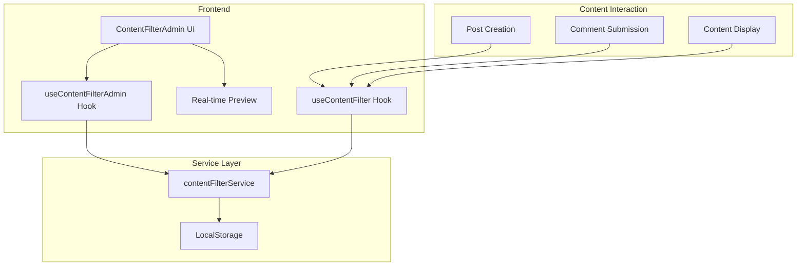
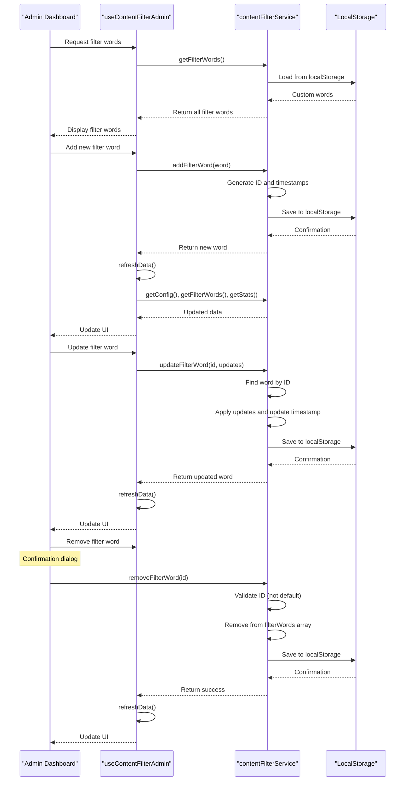
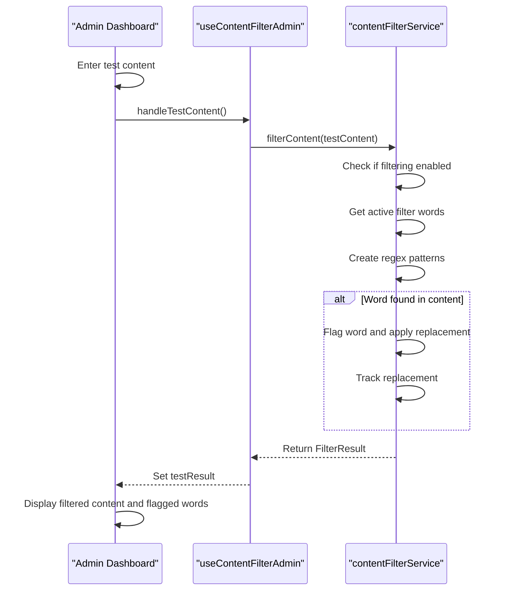
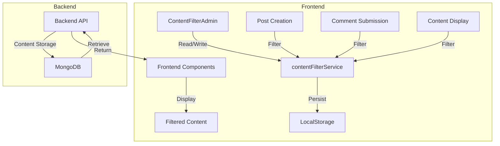
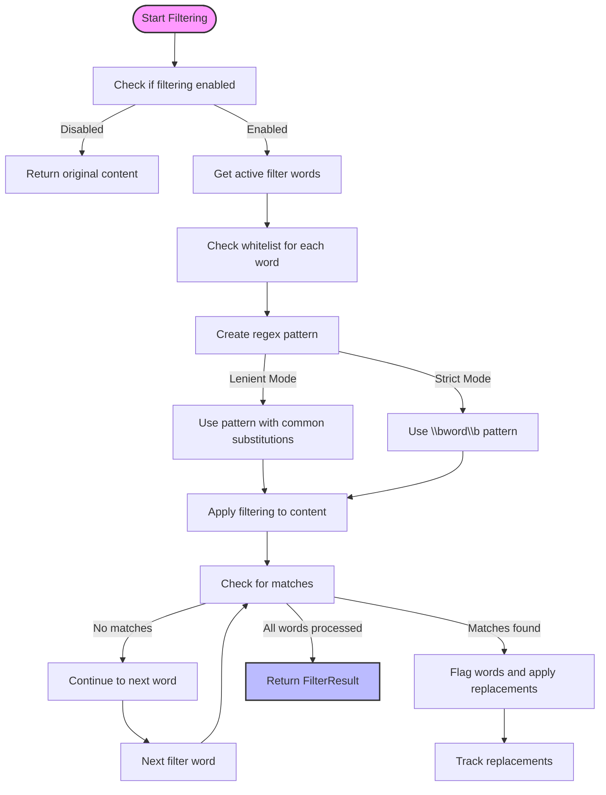
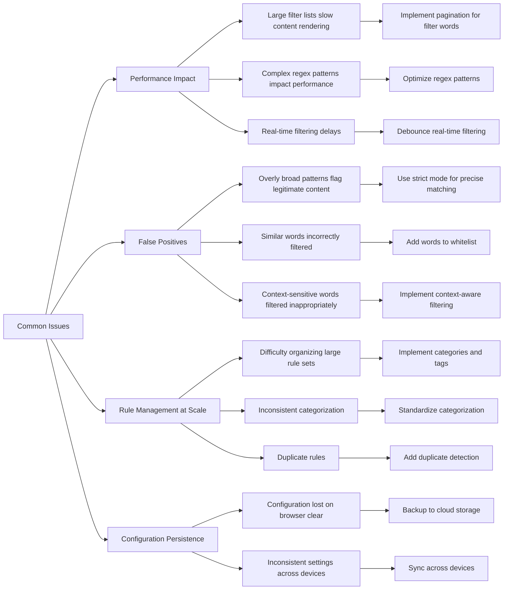
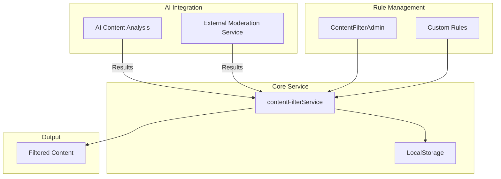

# Content Filtering

<cite>
**Referenced Files in This Document**   
- [ContentFilterAdmin.tsx](file://src/components/admin/ContentFilterAdmin.tsx)
- [useContentFilterAdmin.ts](file://src/hooks/useContentFilterAdmin.ts)
- [contentFilter.ts](file://src/services/contentFilter.ts)
- [useContentFilter.ts](file://src/hooks/useContentFilter.ts)
- [useGlobalErrorHandler.ts](file://src/hooks/useGlobalErrorHandler.ts)
</cite>

## Table of Contents
1. [Introduction](#introduction)
2. [Architecture Overview](#architecture-overview)
3. [Core Components](#core-components)
4. [Filter Rule Management](#filter-rule-management)
5. [Real-time Content Preview](#real-time-content-preview)
6. [State Management with useContentFilterAdmin](#state-management-with-usecontentfilteradmin)
7. [Frontend-Backend Interaction](#frontend-backend-interaction)
8. [Performance Considerations](#performance-considerations)
9. [Common Issues and Solutions](#common-issues-and-solutions)
10. [Integration with AI and External Services](#integration-with-ai-and-external-services)
11. [Conclusion](#conclusion)

## Introduction
The content filtering feature in the MERN_chatai_blog Admin Dashboard provides comprehensive tools for managing inappropriate content through keyword-based moderation. This system enables administrators to create, edit, and manage filter rules that automatically detect and replace offensive language in posts and comments. The implementation combines client-side filtering with centralized state management to ensure consistent content moderation across the platform. The system supports various filtering modes, severity levels, and categories to provide granular control over content moderation policies.

## Architecture Overview



**Diagram sources**
- [ContentFilterAdmin.tsx](file://src/components/admin/ContentFilterAdmin.tsx)
- [useContentFilterAdmin.ts](file://src/hooks/useContentFilterAdmin.ts)
- [contentFilter.ts](file://src/services/contentFilter.ts)
- [useContentFilter.ts](file://src/hooks/useContentFilter.ts)

The content filtering architecture consists of three main layers: the Admin Dashboard UI, the service layer, and the content interaction components. The ContentFilterAdmin component serves as the primary interface for administrators to manage filter rules. It communicates with the useContentFilterAdmin hook, which acts as a bridge to the contentFilterService singleton. This service handles all filtering logic and persists configuration to localStorage. Various content components use the useContentFilter hook to apply filtering rules when creating or displaying content.

## Core Components

```mermaid
classDiagram
class ContentFilterService {
+defaultFilterWords : Omit~FilterWord, 'id' | 'createdAt' | 'updatedAt'~[]
+config : ContentFilterConfig
+filterWords : FilterWord[]
-initializeFilterWords() : void
-loadConfig() : void
-saveConfig() : void
+filterContent(content : string) : FilterResult
+addFilterWord(word : Omit~FilterWord, 'id' | 'createdAt' | 'updatedAt'~) : FilterWord
+updateFilterWord(id : string, updates : Partial~Omit~FilterWord, 'id' | 'createdAt'~~) : FilterWord | null
+removeFilterWord(id : string) : boolean
+getFilterWords() : FilterWord[]
+getFilterWordsByCategory(category : string) : FilterWord[]
+updateConfig(updates : Partial~ContentFilterConfig~) : void
+getConfig() : ContentFilterConfig
+resetConfig() : void
+testContent(content : string) : { hasInappropriateContent : boolean; flaggedWords : string[] }
+getStats() : { totalWords : number; activeWords : number; categoryCounts : Record~string, number~; severityCounts : Record~string, number~ }
}
class FilterWord {
+id : string
+word : string
+replacement : string
+severity : 'mild' | 'moderate' | 'severe'
+category : string
+isActive : boolean
+createdAt : Date
+updatedAt : Date
}
class ContentFilterConfig {
+enabled : boolean
+strictMode : boolean
+customReplacements : Record~string, string~
+whitelist : string[]
+categories : string[]
}
class FilterResult {
+filteredContent : string
+wasFiltered : boolean
+flaggedWords : string[]
+replacements : { original : string; replacement : string }[]
}
ContentFilterService --> FilterWord
ContentFilterService --> ContentFilterConfig
ContentFilterService --> FilterResult
```

**Diagram sources**
- [contentFilter.ts](file://src/services/contentFilter.ts)

**Section sources**
- [contentFilter.ts](file://src/services/contentFilter.ts)

The core of the content filtering system is the ContentFilterService class, which encapsulates all filtering logic and state management. The service maintains a collection of FilterWord objects, each representing a specific word or phrase to be filtered, along with its replacement text, severity level, category, and active status. The ContentFilterConfig interface defines the global filtering configuration, including whether filtering is enabled, strict mode status, custom replacements, whitelist entries, and available categories. When content is processed, the service returns a FilterResult object containing the filtered content, a flag indicating whether filtering occurred, the list of flagged words, and details of the replacements made.

## Filter Rule Management



**Diagram sources**
- [ContentFilterAdmin.tsx](file://src/components/admin/ContentFilterAdmin.tsx)
- [useContentFilterAdmin.ts](file://src/hooks/useContentFilterAdmin.ts)
- [contentFilter.ts](file://src/services/contentFilter.ts)

**Section sources**
- [ContentFilterAdmin.tsx](file://src/components/admin/ContentFilterAdmin.tsx#L200-L740)
- [useContentFilterAdmin.ts](file://src/hooks/useContentFilterAdmin.ts#L117-L237)
- [contentFilter.ts](file://src/services/contentFilter.ts#L107-L250)

The filter rule management system provides administrators with a comprehensive interface for creating, editing, and deleting filter rules. The ContentFilterAdmin component displays filter words in a tabular format with filtering and sorting capabilities by category and severity. Administrators can add new filter words through a form that captures the word, replacement text, category, severity level, and active status. Each filter word is assigned a unique ID and timestamps for creation and updates. The system prevents deletion of default filter words while allowing removal of custom entries. All changes are persisted to localStorage and immediately reflected in the UI through the refreshData mechanism in the useContentFilterAdmin hook.

## Real-time Content Preview



**Diagram sources**
- [ContentFilterAdmin.tsx](file://src/components/admin/ContentFilterAdmin.tsx#L300-L350)
- [contentFilter.ts](file://src/services/contentFilter.ts#L150-L200)

**Section sources**
- [ContentFilterAdmin.tsx](file://src/components/admin/ContentFilterAdmin.tsx#L300-L350)

The real-time content preview feature allows administrators to test the filtering system with sample content before applying changes site-wide. When test content is entered and the "Test Filter" button is clicked, the system processes the content through the same filtering pipeline used for actual posts and comments. The preview displays the filtered output, indicates whether filtering was applied, and lists all flagged words. This immediate feedback helps administrators fine-tune filter rules and replacement patterns to minimize false positives and ensure appropriate content moderation. The preview respects all current configuration settings, including strict mode, whitelist entries, and active/inactive filter words.

## State Management with useContentFilterAdmin

```mermaid
classDiagram
class useContentFilterAdmin {
+config : ContentFilterConfig
+updateConfig(updates : Partial~ContentFilterConfig~) : void
+resetConfig() : void
+filterWords : FilterWord[]
+addFilterWord(word : Omit~FilterWord, 'id' | 'createdAt' | 'updatedAt'~) : FilterWord
+updateFilterWord(id : string, updates : Partial~Omit~FilterWord, 'id' | 'createdAt'~~) : FilterWord | null
+removeFilterWord(id : string) : boolean
+getFilterWordsByCategory(category : string) : FilterWord[]
+stats : { totalWords : number; activeWords : number; categoryCounts : Record~string, number~; severityCounts : Record~string, number~ }
+isLoading : boolean
+error : string | null
+clearError() : void
-refreshData() : void
}
useContentFilterAdmin --> contentFilterService
useContentFilterAdmin --> useGlobalErrorHandler
```

**Diagram sources**
- [useContentFilterAdmin.ts](file://src/hooks/useContentFilterAdmin.ts)

**Section sources**
- [useContentFilterAdmin.ts](file://src/hooks/useContentFilterAdmin.ts)

The useContentFilterAdmin custom hook provides a centralized interface for managing content filtering state and operations. It maintains local state for the current configuration, filter words, statistics, loading status, and error conditions. The hook subscribes to the contentFilterService to receive the latest data on mount and after any modifications. All state updates are handled through useCallback to prevent unnecessary re-renders. The hook implements comprehensive error handling through the useGlobalErrorHandler, ensuring that any issues during filter operations are properly reported to administrators. Loading states are managed to provide visual feedback during asynchronous operations, and error messages are displayed in the ContentFilterAdmin UI to guide administrators through any issues.

## Frontend-Backend Interaction



**Diagram sources**
- [ContentFilterAdmin.tsx](file://src/components/admin/ContentFilterAdmin.tsx)
- [contentFilter.ts](file://src/services/contentFilter.ts)
- [useContentFilter.ts](file://src/hooks/useContentFilter.ts)
- [content.model.ts](file://api-fastify/src/models/content.model.ts)

**Section sources**
- [contentFilter.ts](file://src/services/contentFilter.ts#L80-L105)
- [content.model.ts](file://api-fastify/src/models/content.model.ts)

The content filtering system operates primarily on the client side, with filter rules and configuration stored in localStorage. When content is created or updated through the backend API, the raw content is stored in MongoDB without filtering applied. This approach preserves the original content while allowing flexible filtering rules to be applied dynamically on the client side. The useContentFilter hook is used by content creation and display components to apply filtering rules before rendering. This client-side filtering enables administrators to modify filter rules without requiring content to be reprocessed on the server. The system could be extended to include server-side filtering for additional security by integrating the contentFilterService with backend validation middleware.

## Performance Considerations



**Diagram sources**
- [contentFilter.ts](file://src/services/contentFilter.ts#L150-L200)

**Section sources**
- [contentFilter.ts](file://src/services/contentFilter.ts#L150-L200)

The content filtering system is designed with performance in mind, implementing several optimizations to minimize impact on content rendering. The filtering process first checks if filtering is enabled, returning immediately if disabled. Only active filter words are processed, reducing the number of regex operations. The system uses a whitelist to skip filtering for specific words, avoiding unnecessary processing. For pattern matching, the system supports both strict mode (exact word boundaries) and lenient mode (with common character substitutions), allowing administrators to balance accuracy and performance. The regex patterns are created once per filter word and reused, and the filtering process stops early if no matches are found. For large content, the system could be further optimized by implementing lazy loading of filter words or using a trie data structure for faster word matching.

## Common Issues and Solutions



**Diagram sources**
- [contentFilter.ts](file://src/services/contentFilter.ts)
- [useContentFilterAdmin.ts](file://src/hooks/useContentFilterAdmin.ts)

**Section sources**
- [contentFilter.ts](file://src/services/contentFilter.ts)
- [useContentFilterAdmin.ts](file://src/hooks/useContentFilterAdmin.ts)

Several common issues can arise when managing content filtering at scale. Performance impact on content rendering can occur with large filter lists or complex regex patterns. This can be mitigated by implementing pagination for filter words, optimizing regex patterns, and debouncing real-time filtering operations. False positives, where legitimate content is incorrectly flagged, can be reduced by using strict mode for precise matching, adding specific words to the whitelist, and implementing context-aware filtering that considers surrounding text. Managing filter rules at scale becomes challenging as rule sets grow, which can be addressed by implementing better organization through categories and tags, standardizing categorization, and adding duplicate detection. Configuration persistence issues, such as settings being lost when browsers clear localStorage, can be resolved by backing up configurations to cloud storage and implementing synchronization across devices.

## Integration with AI and External Services



**Diagram sources**
- [contentFilter.ts](file://src/services/contentFilter.ts)
- [useContentFilterAdmin.ts](file://src/hooks/useContentFilterAdmin.ts)

**Section sources**
- [contentFilter.ts](file://src/services/contentFilter.ts)
- [useContentFilterAdmin.ts](file://src/hooks/useContentFilterAdmin.ts)

The content filtering system can be extended to integrate with AI-based content analysis and external moderation services. The modular architecture allows for incorporating machine learning models that can detect nuanced forms of inappropriate content beyond simple keyword matching, such as hate speech, cyberbullying, or toxic language patterns. These AI services can provide confidence scores for different types of inappropriate content, which can be mapped to the existing severity levels (mild, moderate, severe). External moderation services like Google Perspective API or AWS Moderation can be integrated to provide additional layers of content analysis. The results from these services can be used to automatically generate filter rules or adjust the severity of existing rules. The system could also implement feedback loops where administrator actions (accepting or rejecting filtered content) are used to retrain AI models, improving accuracy over time. Integration would typically occur through API calls from the contentFilterService, with results cached to minimize latency and API costs.

## Conclusion
The content filtering feature in the MERN_chatai_blog Admin Dashboard provides a robust and flexible system for managing inappropriate content through keyword-based moderation. The architecture combines a user-friendly administration interface with a well-structured service layer that handles all filtering logic and state management. The system supports comprehensive filter rule management, real-time content preview, and detailed statistics to help administrators maintain a safe and appropriate content environment. By storing filter rules and configuration in localStorage, the system enables client-side filtering that can be easily updated without requiring server-side changes. The implementation includes thoughtful error handling and loading states to provide a smooth administrative experience. For future enhancements, integrating AI-based content analysis and external moderation services could provide more sophisticated content moderation capabilities while maintaining the existing user interface and workflow.