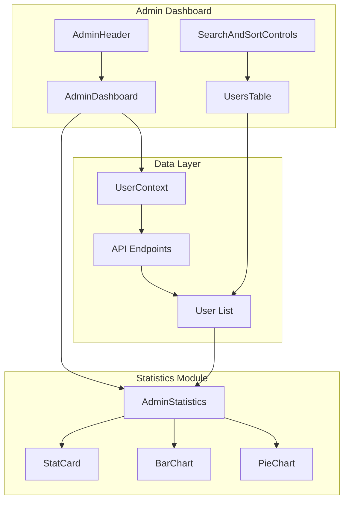
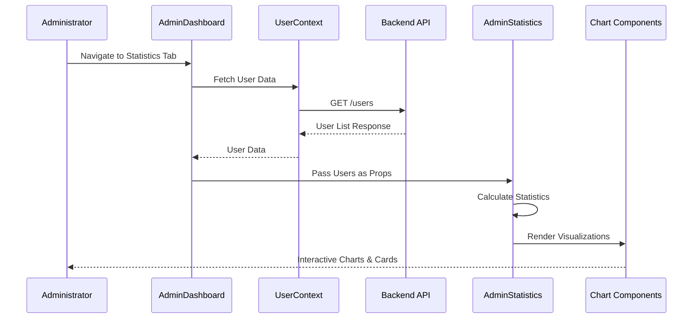
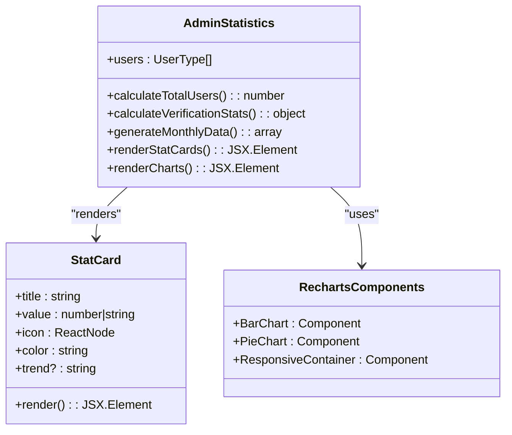
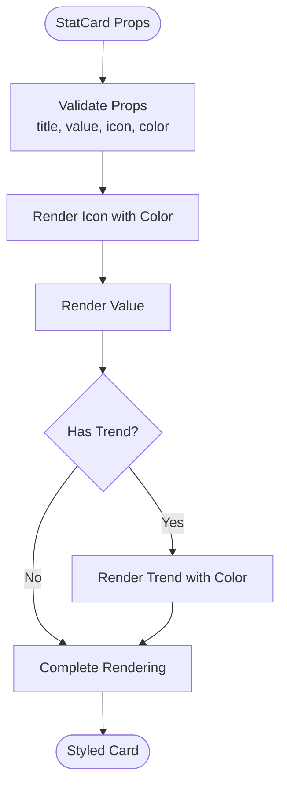

# Site Statistics Feature Documentation

<cite>
**Referenced Files in This Document**
- [AdminDashboard.tsx](file://src/pages/AdminDashboard.tsx)
- [AdminStatistics.tsx](file://src/components/AdminStatistics.tsx)
- [User.ts](file://src/types/User.ts)
- [api.config.ts](file://src/config/api.config.ts)
- [UserContext.tsx](file://src/UserContext.tsx)
- [AdminHeader.tsx](file://src/components/AdminHeader.tsx)
- [SearchAndSortControls.tsx](file://src/components/SearchAndSortControls.tsx)
- [UsersTable.tsx](file://src/components/UsersTable.tsx)
- [utils.ts](file://src/lib/utils.ts)
</cite>

## Table of Contents
1. [Introduction](#introduction)
2. [System Architecture](#system-architecture)
3. [Data Flow Analysis](#data-flow-analysis)
4. [Component Analysis](#component-analysis)
5. [Statistics Calculation Logic](#statistics-calculation-logic)
6. [Data Visualization Components](#data-visualization-components)
7. [Performance Considerations](#performance-considerations)
8. [Accessibility Features](#accessibility-features)
9. [Common Issues and Solutions](#common-issues-and-solutions)
10. [Extending the Statistics Module](#extending-the-statistics-module)
11. [Best Practices](#best-practices)

## Introduction

The Site Statistics feature in the MERN_chatai_blog Admin Dashboard provides comprehensive analytics and visualization of user data through a sophisticated React-based statistics component. This feature enables administrators to monitor user growth, role distribution, verification rates, and recent user activity through interactive charts and statistical cards.

The statistics module operates entirely on client-side data processing, eliminating the need for additional API calls by leveraging pre-fetched user lists. This approach ensures real-time responsiveness while maintaining data privacy and reducing server load.

## System Architecture

The statistics system follows a modular architecture with clear separation of concerns:



**Diagram sources**
- [AdminDashboard.tsx](file://src/pages/AdminDashboard.tsx#L372-L401)
- [AdminStatistics.tsx](file://src/components/AdminStatistics.tsx#L52-L83)
- [UserContext.tsx](file://src/UserContext.tsx#L1-L50)

## Data Flow Analysis

The data flow in the statistics system follows a unidirectional pattern from the backend API to the frontend components:



**Diagram sources**
- [AdminDashboard.tsx](file://src/pages/AdminDashboard.tsx#L60-L120)
- [UserContext.tsx](file://src/UserContext.tsx#L40-L80)
- [AdminStatistics.tsx](file://src/components/AdminStatistics.tsx#L52-L83)

**Section sources**
- [AdminDashboard.tsx](file://src/pages/AdminDashboard.tsx#L60-L120)
- [UserContext.tsx](file://src/UserContext.tsx#L40-L80)

## Component Analysis

### AdminDashboard Integration

The AdminDashboard serves as the orchestrator for the statistics feature, managing state and coordinating data flow:

```typescript
// Key integration points in AdminDashboard
const [users, setUsers] = useState<UserType[]>([])
const [activeTab, setActiveTab] = useState<"users" | "statistics">("users")

// Conditional rendering based on active tab
{activeTab === "statistics" && (
  <AdminStatistics users={users} />
)}
```

The dashboard maintains a centralized user state that feeds into both the UsersTable and AdminStatistics components, ensuring data consistency across the interface.

### AdminStatistics Component Structure

The AdminStatistics component is designed as a pure functional component that receives user data as props and performs all calculations internally:



**Diagram sources**
- [AdminStatistics.tsx](file://src/components/AdminStatistics.tsx#L52-L83)
- [AdminStatistics.tsx](file://src/components/AdminStatistics.tsx#L15-L45)

**Section sources**
- [AdminStatistics.tsx](file://src/components/AdminStatistics.tsx#L52-L83)
- [AdminDashboard.tsx](file://src/pages/AdminDashboard.tsx#L372-L401)

## Statistics Calculation Logic

The AdminStatistics component performs comprehensive calculations on the client side using the provided user data:

### Core Statistical Calculations

```typescript
// Total user calculation
const totalUsers = users.length

// Verification statistics
const verifiedUsers = users.filter(user => user.isVerified).length
const unverifiedUsers = totalUsers - verifiedUsers
const verificationRate = totalUsers > 0 ? Math.round((verifiedUsers / totalUsers) * 100) : 0

// Role distribution
const usersByRole = {
  admin: users.filter(user => user.role === 'admin').length,
  author: users.filter(user => user.role === 'author').length,
  editor: users.filter(user => user.role === 'editor').length,
  user: users.filter(user => user.role === 'user').length,
}
```

### Monthly Registration Tracking

The component implements sophisticated date-based analysis to track user growth trends:

```typescript
const usersByMonth = () => {
  const months: Record<string, number> = {}
  const now = new Date()
  
  // Initialize the last 6 months with 0 users
  for (let i = 5; i >= 0; i--) {
    const month = new Date(now.getFullYear(), now.getMonth() - i, 1)
    const monthKey = month.toLocaleDateString('fr-FR', { month: 'short', year: '2-digit' })
    months[monthKey] = 0
  }
  
  // Count users by month
  users.forEach(user => {
    const createdAt = new Date(user.createdAt)
    // Only count users from the last 6 months
    if (createdAt >= new Date(now.getFullYear(), now.getMonth() - 5, 1)) {
      const monthKey = createdAt.toLocaleDateString('fr-FR', { month: 'short', year: '2-digit' })
      if (months[monthKey] !== undefined) {
        months[monthKey]++
      }
    }
  })
  
  return Object.entries(months).map(([month, count]) => ({ month, count }))
}
```

### Recent Users Display

The component identifies and displays the five most recently registered users:

```typescript
const recentUsers = users
  .sort((a, b) => new Date(b.createdAt).getTime() - new Date(a.createdAt).getTime())
  .slice(0, 5)
```

**Section sources**
- [AdminStatistics.tsx](file://src/components/AdminStatistics.tsx#L60-L120)

## Data Visualization Components

### StatCard Component

The StatCard component provides a reusable interface for displaying individual statistics with animated transitions and contextual icons:



**Diagram sources**
- [AdminStatistics.tsx](file://src/components/AdminStatistics.tsx#L15-L45)

### Chart Implementation

The statistics module utilizes Recharts library for sophisticated data visualization:

#### Bar Chart - Monthly Registrations

```typescript
<BarChart data={monthlyData}>
  <CartesianGrid strokeDasharray="3 3" stroke="#e5e7eb" />
  <XAxis dataKey="month" stroke="#6b7280" />
  <YAxis stroke="#6b7280" />
  <Tooltip contentStyle={{ backgroundColor: 'white', border: '1px solid #e5e7eb', borderRadius: '0.5rem' }} />
  <Legend />
  <Bar dataKey="count" name="Nouveaux utilisateurs" fill="#10B981" radius={[4, 4, 0, 0]} />
</BarChart>
```

#### Pie Chart - Role Distribution

```typescript
<PieChart>
  <Pie
    data={roleDistributionData}
    cx="50%"
    cy="50%"
    labelLine={true}
    outerRadius={80}
    fill="#8884d8"
    dataKey="value"
    label={({ name, percent }) => `${name}: ${(percent * 100).toFixed(0)}%`}
  >
    {roleDistributionData.map((entry, index) => (
      <Cell key={`cell-${index}`} fill={ROLE_COLORS[index % ROLE_COLORS.length]} />
    ))}
  </Pie>
  <Tooltip contentStyle={{ backgroundColor: 'white', border: '1px solid #e5e7eb', borderRadius: '0.5rem' }} />
  <Legend />
</PieChart>
```

**Section sources**
- [AdminStatistics.tsx](file://src/components/AdminStatistics.tsx#L200-L250)
- [AdminStatistics.tsx](file://src/components/AdminStatistics.tsx#L250-L300)

## Performance Considerations

### Client-Side Processing Benefits

The statistics module leverages client-side data processing for several advantages:

1. **Real-time Updates**: No additional API calls required for statistics updates
2. **Reduced Server Load**: Statistics calculations performed locally
3. **Improved Responsiveness**: Immediate feedback on user interactions
4. **Offline Capability**: Basic statistics available without network connectivity

### Performance Optimization Strategies

```typescript
// Memoized calculations to prevent unnecessary re-computations
const usersByRole = useMemo(() => ({
  admin: users.filter(user => user.role === 'admin').length,
  author: users.filter(user => user.role === 'author').length,
  editor: users.filter(user => user.role === 'editor').length,
  user: users.filter(user => user.role === 'user').length,
}), [users])

// Efficient date calculations using native JavaScript Date objects
const usersByMonth = useCallback(() => {
  // Optimized month initialization and counting
}, [users])
```

### Large Dataset Handling

For applications with large user datasets, consider implementing:

1. **Virtualization**: Limit displayed statistics to recent data
2. **Pagination**: Implement pagination for recent users table
3. **Lazy Loading**: Load statistics progressively as needed
4. **Data Sampling**: Use representative samples for trend calculations

**Section sources**
- [AdminStatistics.tsx](file://src/components/AdminStatistics.tsx#L60-L120)

## Accessibility Features

The statistics module incorporates several accessibility enhancements:

### Semantic HTML Structure

```html
<!-- Proper heading hierarchy -->
<h2>Statistiques des utilisateurs</h2>
<h3>Inscriptions mensuelles</h3>
<h3>Distribution des rôles</h3>
<h3>Nouveaux utilisateurs</h3>

<!-- Accessible table structure -->
<table className="min-w-full divide-y divide-gray-200 dark:divide-gray-700">
  <thead className="bg-gray-50 dark:bg-gray-700">
    <tr>
      <th scope="col" className="px-6 py-3 text-left text-xs font-medium text-gray-500 dark:text-gray-300 uppercase tracking-wider">
        Utilisateur
      </th>
      <!-- Additional headers -->
    </tr>
  </thead>
  <tbody className="bg-white dark:bg-gray-800 divide-y divide-gray-200 dark:divide-gray-700">
    <!-- Table rows -->
  </tbody>
</table>
```

### Screen Reader Support

```typescript
// ARIA labels for interactive elements
<button
  onClick={() => setShowFilters(!showFilters)}
  className="px-4 py-2 bg-white dark:bg-gray-700 border border-gray-300 dark:border-gray-600 rounded-md text-gray-700 dark:text-gray-200 hover:bg-gray-50 dark:hover:bg-gray-600 transition-colors flex items-center"
  aria-label="Afficher/masquer les filtres"
>
  <svg className="w-4 h-4 mr-2" fill="none" stroke="currentColor" viewBox="0 0 24 24" xmlns="http://www.w3.org/2000/svg">
    <path strokeLinecap="round" strokeLinejoin="round" strokeWidth="2" d="M3 4a1 1 0 011-1h16a1 1 0 011 1v2.586a1 1 0 01-.293.707l-6.414 6.414a1 1 0 00-.293.707V17l-4 4v-6.586a1 1 0 00-.293-.707L3.293 7.293A1 1 0 013 6.586V4z"></path>
  </svg>
  Filtres {showFilters ? '▲' : '▼'}
</button>
```

### Keyboard Navigation

The component supports full keyboard navigation:

```typescript
// Keyboard shortcuts for admin dashboard
useEffect(() => {
  const handleKeyDown = (e: KeyboardEvent) => {
    // Refresh data with F5 or Ctrl/Cmd + R
    if (e.key === 'F5' || (e.key === 'r' && (e.ctrlKey || e.metaKey))) {
      e.preventDefault()
      if (activeTab === 'users') {
        fetchUsers()
      } else {
        checkAdminStatus()
      }
    }
    
    // Open add user modal with Ctrl/Cmd + N
    if ((e.ctrlKey || e.metaKey) && e.key === 'n') {
      e.preventDefault()
      if (activeTab === 'users') {
        setIsAddUserModalOpen(true)
      }
    }
    
    // Close modals with ESC
    if (e.key === 'Escape') {
      setIsAddUserModalOpen(false)
    }
  }
})
```

**Section sources**
- [AdminDashboard.tsx](file://src/pages/AdminDashboard.tsx#L300-L350)
- [AdminStatistics.tsx](file://src/components/AdminStatistics.tsx#L150-L200)

## Common Issues and Solutions

### Stale Data Concerns

**Issue**: Statistics may not reflect the most recent user data due to caching mechanisms.

**Solution**: Implement automatic refresh intervals and manual refresh buttons:

```typescript
// Automatic refresh every 5 minutes
useEffect(() => {
  const interval = setInterval(() => {
    if (userInfo) {
      checkAuth()
    }
  }, 5 * 60 * 1000)
  
  return () => clearInterval(interval)
}, [userInfo?.id])
```

### Performance with Large Datasets

**Issue**: Slow rendering with thousands of users.

**Solution**: Implement data sampling and progressive loading:

```typescript
// Sample recent data for performance
const recentUsers = useMemo(() => {
  return users
    .sort((a, b) => new Date(b.createdAt).getTime() - new Date(a.createdAt).getTime())
    .slice(0, 100) // Limit to recent 100 users
}, [users])
```

### Chart Rendering Issues

**Issue**: Charts may not render properly on small screens or slow connections.

**Solution**: Implement responsive design and graceful degradation:

```typescript
<ResponsiveContainer width="100%" height="100%">
  <BarChart data={monthlyData}>
    {/* Chart configuration */}
  </BarChart>
</ResponsiveContainer>
```

### Color Contrast Problems

**Issue**: Poor visibility of chart colors against backgrounds.

**Solution**: Use accessible color palettes and provide alternative visual indicators:

```typescript
const COLORS = ['#10B981', '#3B82F6', '#8B5CF6', '#EF4444', '#F59E0B']
const ROLE_COLORS = ['#EF4444', '#3B82F6', '#8B5CF6', '#6B7280']
```

**Section sources**
- [AdminStatistics.tsx](file://src/components/AdminStatistics.tsx#L60-L120)
- [UserContext.tsx](file://src/UserContext.tsx#L280-L310)

## Extending the Statistics Module

### Adding New Metrics

To add new statistical calculations, modify the AdminStatistics component:

```typescript
// Example: Add average user age calculation
const calculateAverageAge = () => {
  const ages = users.map(user => {
    const birthDate = new Date(user.birthDate)
    const ageDifMs = Date.now() - birthDate.getTime()
    const ageDate = new Date(ageDifMs)
    return Math.abs(ageDate.getUTCFullYear() - 1970)
  })
  return ages.reduce((sum, age) => sum + age, 0) / ages.length
}

// Add to statistics object
const statistics = {
  totalUsers,
  verifiedUsers,
  unverifiedUsers,
  verificationRate,
  averageAge: calculateAverageAge(),
  // ... other metrics
}
```

### Integrating Additional Chart Libraries

For enhanced visualization capabilities, integrate libraries like Chart.js or D3.js:

```typescript
// Example integration with Chart.js
import { Chart, registerables } from 'chart.js'

Chart.register(...registerables)

const renderCustomChart = () => {
  const ctx = document.getElementById('custom-chart') as HTMLCanvasElement
  return new Chart(ctx, {
    type: 'line',
    data: {
      labels: monthlyData.map(d => d.month),
      datasets: [{
        label: 'New Users',
        data: monthlyData.map(d => d.count),
        borderColor: '#10B981',
        tension: 0.4
      }]
    },
    options: {
      responsive: true,
      plugins: {
        legend: { position: 'top' }
      }
    }
  })
}
```

### Customizing Chart Themes

Extend the color palette and styling system:

```typescript
const CHART_THEMES = {
  light: {
    backgroundColor: '#ffffff',
    textColor: '#1f2937',
    gridColor: '#e5e7eb'
  },
  dark: {
    backgroundColor: '#1f2937',
    textColor: '#ffffff',
    gridColor: '#374151'
  }
}

// Apply theme dynamically
const applyChartTheme = (theme: keyof typeof CHART_THEMES) => {
  // Configure chart options based on theme
}
```

### Adding Export Functionality

Implement data export capabilities for statistics:

```typescript
const exportStatistics = (format: 'csv' | 'json' | 'pdf') => {
  const data = {
    totalUsers,
    verifiedUsers,
    unverifiedUsers,
    roleDistribution: usersByRole,
    monthlyRegistrations: monthlyData
  }
  
  switch (format) {
    case 'csv':
      // Convert to CSV format
      break
    case 'json':
      // Download JSON file
      break
    case 'pdf':
      // Generate PDF report
      break
  }
}
```

## Best Practices

### Code Organization

1. **Separation of Concerns**: Keep statistical calculations separate from rendering logic
2. **Reusable Components**: Extract common visualization patterns into reusable components
3. **Type Safety**: Use TypeScript interfaces for all data structures
4. **Error Handling**: Implement comprehensive error boundaries and fallbacks

### Data Management

1. **Immutable Operations**: Use immutable data structures for state management
2. **Efficient Filtering**: Implement efficient filtering algorithms for large datasets
3. **Memory Management**: Clean up event listeners and timers appropriately
4. **Validation**: Validate incoming data before processing

### User Experience

1. **Progressive Disclosure**: Show essential statistics first, advanced metrics on demand
2. **Loading States**: Provide clear loading indicators during data processing
3. **Responsive Design**: Ensure charts and tables adapt to different screen sizes
4. **Consistent Styling**: Maintain visual consistency across all components

### Security Considerations

1. **Data Validation**: Validate all user inputs and API responses
2. **Access Control**: Verify admin privileges before rendering sensitive statistics
3. **Information Hiding**: Hide potentially sensitive data in charts and tables
4. **Audit Logging**: Log statistic access for security monitoring

The Site Statistics feature demonstrates a well-architected solution for client-side data analytics, combining performance optimization with comprehensive user insights. By following the patterns and practices outlined in this documentation, developers can extend and maintain the statistics module effectively while ensuring optimal user experience and system performance.