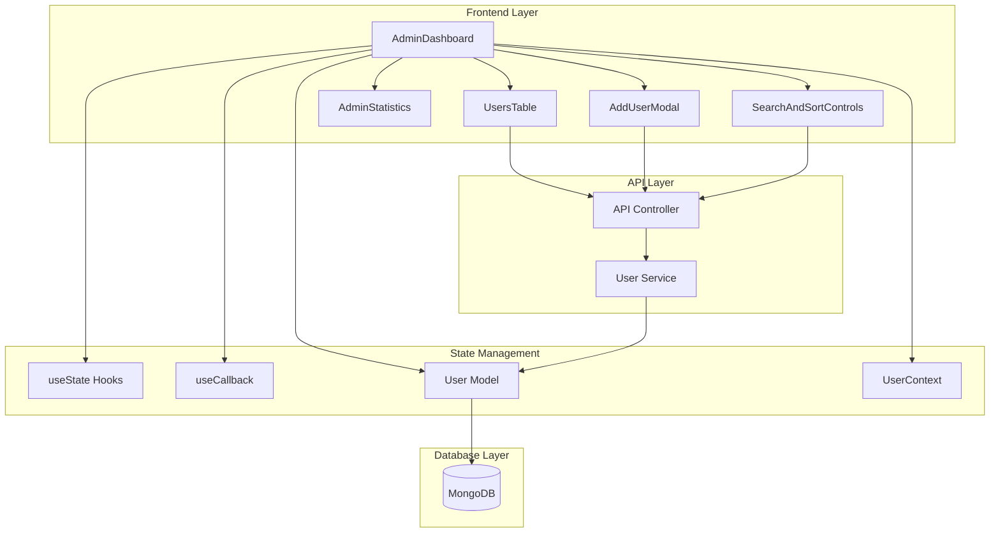
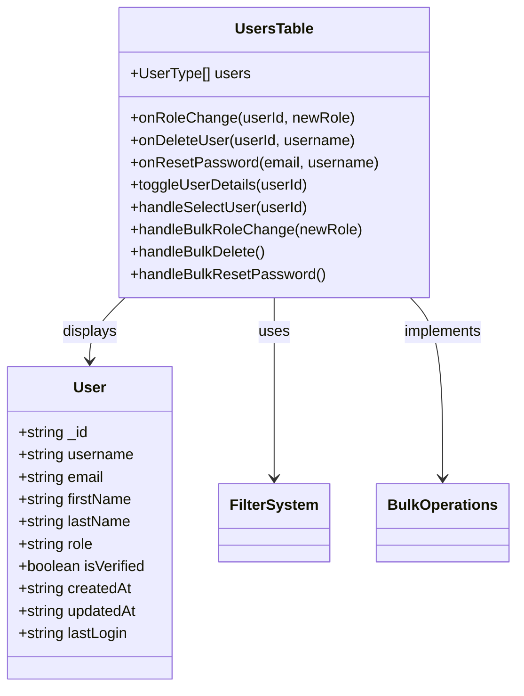
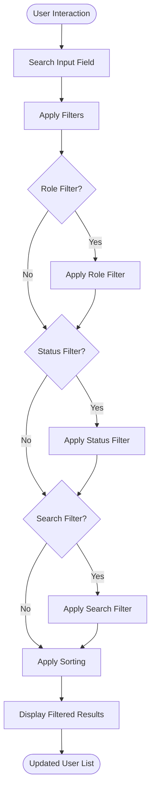
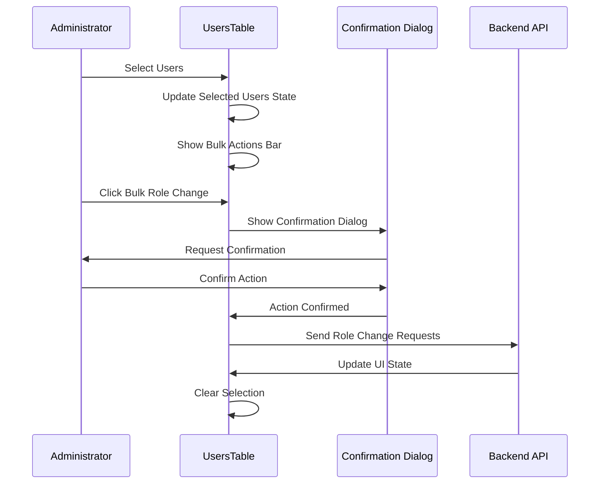

# User Management

<cite>
**Referenced Files in This Document**
- [AdminDashboard.tsx](file://src/pages/AdminDashboard.tsx)
- [UsersTable.tsx](file://src/components/UsersTable.tsx)
- [AddUserModal.tsx](file://src/components/AddUserModal.tsx)
- [SearchAndSortControls.tsx](file://src/components/SearchAndSortControls.tsx)
- [AdminStatistics.tsx](file://src/components/AdminStatistics.tsx)
- [User.ts](file://src/types/User.ts)
- [api.config.ts](file://src/config/api.config.ts)
- [user.controller.ts](file://api-fastify/src/controllers/user.controller.ts)
- [user.service.ts](file://api-fastify/src/services/user.service.ts)
- [utils.ts](file://src/lib/utils.ts)
</cite>

## Table of Contents
1. [Introduction](#introduction)
2. [System Architecture](#system-architecture)
3. [Core Components](#core-components)
4. [State Management](#state-management)
5. [User Listing and Filtering](#user-listing-and-filtering)
6. [Bulk Operations](#bulk-operations)
7. [Role Management](#role-management)
8. [User Creation](#user-creation)
9. [Error Handling and Validation](#error-handling-and-validation)
10. [Performance Considerations](#performance-considerations)
11. [Troubleshooting Guide](#troubleshooting-guide)
12. [Conclusion](#conclusion)

## Introduction

The User Management feature in the MERN_chatai_blog Admin Dashboard provides comprehensive administrative capabilities for managing users, their roles, and permissions. This system enables administrators to view user lists, apply filters and sorting, perform bulk operations, and manage user accounts through an intuitive React-based interface backed by a Fastify-powered API.

The implementation follows modern React patterns using functional components, hooks, and TypeScript for type safety. The frontend utilizes Tailwind CSS for styling and integrates seamlessly with the backend through RESTful API endpoints.

## System Architecture

The user management system follows a layered architecture with clear separation of concerns:



**Diagram sources**
- [AdminDashboard.tsx](file://src/pages/AdminDashboard.tsx#L1-L657)
- [UsersTable.tsx](file://src/components/UsersTable.tsx#L1-L616)
- [user.controller.ts](file://api-fastify/src/controllers/user.controller.ts#L1-L315)

## Core Components

### AdminDashboard Component

The main AdminDashboard component serves as the orchestrator for the user management system. It manages the overall state, handles API communication, and coordinates between different sub-components.

```typescript
// Core state management
const [users, setUsers] = useState<UserType[]>([])
const [isAdmin, setIsAdmin] = useState(false)
const [isLoading, setIsLoading] = useState(true)
const [error, setError] = useState<string | null>(null)
const [page, setPage] = useState(1)
const [totalPages, setTotalPages] = useState(1)
const [search, setSearch] = useState("")
const [sort, setSort] = useState("username")
const [order, setOrder] = useState("asc")
```

The component implements sophisticated error handling with automatic retry mechanisms and user feedback systems. It also manages keyboard shortcuts for improved accessibility.

### UsersTable Component

The UsersTable is the central component for displaying and interacting with user data. It implements advanced filtering, sorting, and bulk operation capabilities.



**Diagram sources**
- [UsersTable.tsx](file://src/components/UsersTable.tsx#L15-L30)
- [User.ts](file://src/types/User.ts#L1-L14)

**Section sources**
- [AdminDashboard.tsx](file://src/pages/AdminDashboard.tsx#L15-L657)
- [UsersTable.tsx](file://src/components/UsersTable.tsx#L1-L616)
- [User.ts](file://src/types/User.ts#L1-L14)

## State Management

The user management system employs React's built-in state management with sophisticated patterns:

### useState Hooks

```typescript
// Core state management
const [users, setUsers] = useState<UserType[]>([])
const [isLoading, setIsLoading] = useState(true)
const [error, setError] = useState<string | null>(null)
const [selectedUsers, setSelectedUsers] = useState<string[]>([])
const [filters, setFilters] = useState({
  role: "all",
  status: "all",
  search: ""
})
```

### useCallback Optimization

Critical functions are memoized to prevent unnecessary re-renders:

```typescript
const handleRoleChange = useCallback(async (userId: string, newRole: "user" | "author" | "admin" | "editor") => {
  // Implementation with proper error handling
}, [])

const handleDeleteUser = useCallback(async (userId: string, username: string) => {
  // Implementation with confirmation dialog
}, [])

const handleResetPassword = useCallback(async (email: string, username: string) => {
  // Implementation with confirmation dialog
}, [])
```

### useMemo for Performance

Expensive computations are cached using useMemo:

```typescript
const filteredAndSortedUsers = React.useMemo(() => {
  // Filter and sort logic here
  return result
}, [users, filters, sortBy, sortOrder])
```

**Section sources**
- [AdminDashboard.tsx](file://src/pages/AdminDashboard.tsx#L15-L657)
- [UsersTable.tsx](file://src/components/UsersTable.tsx#L45-L92)

## User Listing and Filtering

### Advanced Filtering System

The UsersTable implements a comprehensive filtering system that allows administrators to narrow down user lists based on multiple criteria:

```typescript
const filteredAndSortedUsers = React.useMemo(() => {
  let result = [...users]
  
  // Apply role filter
  if (filters.role !== "all") {
    result = result.filter(user => user.role === filters.role)
  }
  
  // Apply verification status filter
  if (filters.status !== "all") {
    result = result.filter(user => 
      filters.status === "verified" ? user.isVerified : !user.isVerified
    )
  }
  
  // Apply search filter
  if (filters.search) {
    const searchLower = filters.search.toLowerCase()
    result = result.filter(user => 
      user.username.toLowerCase().includes(searchLower) ||
      user.email.toLowerCase().includes(searchLower) ||
      user.firstName.toLowerCase().includes(searchLower) ||
      user.lastName.toLowerCase().includes(searchLower)
    )
  }
  
  // Apply sorting
  result.sort((a, b) => {
    let aValue: string | number = a[sortBy]
    let bValue: string | number = b[sortBy]
    
    // Special handling for dates
    if (sortBy === "createdAt") {
      aValue = new Date(a[sortBy]).getTime()
      bValue = new Date(b[sortBy]).getTime()
    }
    
    return sortOrder === "asc" ? 
      aValue > bValue ? 1 : -1 : 
      aValue < bValue ? 1 : -1
  })
  
  return result
}, [users, filters, sortBy, sortOrder])
```

### Search and Sort Controls

The SearchAndSortControls component provides intuitive filtering capabilities:



**Diagram sources**
- [SearchAndSortControls.tsx](file://src/components/SearchAndSortControls.tsx#L1-L207)
- [UsersTable.tsx](file://src/components/UsersTable.tsx#L45-L92)

**Section sources**
- [UsersTable.tsx](file://src/components/UsersTable.tsx#L45-L92)
- [SearchAndSortControls.tsx](file://src/components/SearchAndSortControls.tsx#L1-L207)

## Bulk Operations

### Bulk Selection System

The UsersTable implements a sophisticated bulk selection system that allows administrators to perform operations on multiple users simultaneously:

```typescript
const handleSelectUser = (userId: string) => {
  setSelectedUsers(prev => 
    prev.includes(userId) 
      ? prev.filter(id => id !== userId) 
      : [...prev, userId]
  )
}

const handleSelectAll = () => {
  if (selectedUsers.length === filteredAndSortedUsers.length) {
    setSelectedUsers([])
  } else {
    setSelectedUsers(filteredAndSortedUsers.map(user => user._id))
  }
}
```

### Bulk Operation Handlers

```typescript
const handleBulkRoleChange = (newRole: "user" | "author" | "editor" | "admin") => {
  if (selectedUsers.length === 0) return
  
  if (window.confirm(`Are you sure you want to change the role of ${selectedUsers.length} users to "${newRole}"?`)) {
    selectedUsers.forEach(userId => {
      const user = users.find(u => u._id === userId)
      if (user && user.role !== newRole) {
        onRoleChange(userId, newRole)
      }
    })
    setSelectedUsers([])
  }
}

const handleBulkDelete = () => {
  if (selectedUsers.length === 0) return
  
  const userNames = selectedUsers
    .map(id => users.find(u => u._id === id)?.username)
    .filter(Boolean)
    .join(", ")
  
  if (window.confirm(`Are you sure you want to delete ${selectedUsers.length} users: ${userNames}?`)) {
    selectedUsers.forEach(userId => {
      const user = users.find(u => u._id === userId)
      if (user) {
        onDeleteUser(userId, user.username)
      }
    })
    setSelectedUsers([])
  }
}

const handleBulkResetPassword = () => {
  if (selectedUsers.length === 0) return
  
  if (window.confirm(`Are you sure you want to send password reset emails to ${selectedUsers.length} users?`)) {
    selectedUsers.forEach(userId => {
      const user = users.find(u => u._id === userId)
      if (user) {
        onResetPassword(user.email, user.username)
      }
    })
    setSelectedUsers([])
  }
}
```

### Bulk Actions Bar

The bulk actions bar appears when users are selected, providing quick access to common operations:



**Diagram sources**
- [UsersTable.tsx](file://src/components/UsersTable.tsx#L110-L150)

**Section sources**
- [UsersTable.tsx](file://src/components/UsersTable.tsx#L110-L150)

## Role Management

### Role-Based Access Control

The system implements role-based access control with strict validation:

```typescript
// Role validation in backend service
export const changeUserRole = async (id: string, role: UserRole) => {
  // Validate user ID
  if (!isValidObjectId(id)) {
    throw new Error('Invalid user ID')
  }

  // Retrieve user
  const user = await User.findById(id)
  if (!user) {
    throw new Error('User not found')
  }

  // Prevent demoting the last admin
  if (user.role === UserRole.ADMIN && role !== UserRole.ADMIN) {
    const adminCount = await User.countDocuments({ role: UserRole.ADMIN })
    if (adminCount <= 1) {
      throw new Error('Cannot demote the last admin')
    }
  }

  // Update user role
  user.role = role
  await user.save()

  return {
    _id: user._id,
    username: user.username,
    email: user.email,
    role: user.role,
  }
}
```

### Role Color Coding

The frontend uses color-coded badges to visually represent user roles:

```typescript
export const getRoleColor = (role: string): string => {
  switch (role) {
    case "admin":
      return "bg-red-100 text-red-800 dark:bg-red-900 dark:text-red-300"
    case "author":
      return "bg-blue-100 text-blue-800 dark:bg-blue-900 dark:text-blue-300"
    case "editor":
      return "bg-purple-100 text-purple-800 dark:bg-purple-900 dark:text-purple-300"
    case "user":
      return "bg-gray-100 text-gray-800 dark:bg-gray-700 dark:text-gray-300"
    default:
      return "bg-gray-100 text-gray-800 dark:bg-gray-700 dark:text-gray-300"
  }
}
```

**Section sources**
- [user.service.ts](file://api-fastify/src/services/user.service.ts#L130-L170)
- [utils.ts](file://src/lib/utils.ts#L25-L38)

## User Creation

### AddUserModal Component

The AddUserModal provides a comprehensive form for creating new users with validation and error handling:

```typescript
export const AddUserModal: React.FC<AddUserModalProps> = ({ isOpen, onClose, onUserAdded }) => {
  const [username, setUsername] = useState("")
  const [email, setEmail] = useState("")
  const [password, setPassword] = useState("")
  const [firstName, setFirstName] = useState("")
  const [lastName, setLastName] = useState("")
  const [role, setRole] = useState<"user" | "author" | "editor" | "admin">("user")
  const [isLoading, setIsLoading] = useState(false)
  const [error, setError] = useState<string | null>(null)

  const handleSubmit = async (e: React.FormEvent) => {
    e.preventDefault()
    setIsLoading(true)
    setError(null)

    try {
      // Validate required fields
      if (!username || !email || !password) {
        throw new Error("Please fill in all required fields")
      }

      // Validate email format
      const emailRegex = /^[^\s@]+@[^\s@]+\.[^\s@]+$/
      if (!emailRegex.test(email)) {
        throw new Error("Please enter a valid email address")
      }

      // Validate password length
      if (password.length < 6) {
        throw new Error("Password must be at least 6 characters long")
      }

      const response = await fetch(API_ENDPOINTS.auth.register, {
        method: "POST",
        headers: {
          "Content-Type": "application/json",
        },
        body: JSON.stringify({
          username,
          email,
          password,
          firstName: firstName || undefined,
          lastName: lastName || undefined,
          role,
        }),
        credentials: "include",
      })

      if (!response.ok) {
        let errorMessage = "An error occurred while creating the user"
        try {
          const errorData = await response.json()
          errorMessage = errorData.message || errorMessage
        } catch (e) {
          console.error("Could not parse error response:", e)
        }
        throw new Error(errorMessage)
      }

      // Reset form and close modal
      setUsername("")
      setEmail("")
      setPassword("")
      setFirstName("")
      setLastName("")
      setRole("user")
      
      onUserAdded()
      onClose()
    } catch (error) {
      console.error("Error creating user:", error)
      setError(error instanceof Error ? error.message : "An unknown error occurred")
    } finally {
      setIsLoading(false)
    }
  }
}
```

### API Integration

The modal communicates with the backend through the `/api/auth/register` endpoint, which creates new user accounts with the specified role and personal information.

**Section sources**
- [AddUserModal.tsx](file://src/components/AddUserModal.tsx#L1-L230)

## Error Handling and Validation

### Frontend Validation

The system implements comprehensive validation at the frontend level:

```typescript
// Form validation in AddUserModal
const handleSubmit = async (e: React.FormEvent) => {
  e.preventDefault()
  setIsLoading(true)
  setError(null)

  try {
    // Field validation
    if (!username || !email || !password) {
      throw new Error("Please fill in all required fields")
    }

    // Email format validation
    const emailRegex = /^[^\s@]+@[^\s@]+\.[^\s@]+$/
    if (!emailRegex.test(email)) {
      throw new Error("Please enter a valid email address")
    }

    // Password strength validation
    if (password.length < 6) {
      throw new Error("Password must be at least 6 characters long")
    }

    // API call with error handling
    const response = await fetch(API_ENDPOINTS.auth.register, {
      method: "POST",
      headers: {
        "Content-Type": "application/json",
      },
      body: JSON.stringify({
        username,
        email,
        password,
        firstName: firstName || undefined,
        lastName: lastName || undefined,
        role,
      }),
      credentials: "include",
    })

    if (!response.ok) {
      let errorMessage = "An error occurred while creating the user"
      try {
        const errorData = await response.json()
        errorMessage = errorData.message || errorMessage
      } catch (e) {
        console.error("Could not parse error response:", e)
      }
      throw new Error(errorMessage)
    }

  } catch (error) {
    console.error("Error creating user:", error)
    setError(error instanceof Error ? error.message : "An unknown error occurred")
  } finally {
    setIsLoading(false)
  }
}
```

### Backend Validation

The backend implements robust validation and error handling:

```typescript
// User creation validation
export const createUser = async (userData: CreateUserInput) => {
  // Validate required fields
  if (!userData.username || !userData.email || !userData.password) {
    throw new Error('Username, email, and password are required')
  }

  // Check for duplicate username
  const existingUser = await User.findOne({ username: userData.username })
  if (existingUser) {
    throw new Error('Username already taken')
  }

  // Check for duplicate email
  const existingEmail = await User.findOne({ email: userData.email })
  if (existingEmail) {
    throw new Error('Email already registered')
  }

  // Hash password
  const salt = await bcrypt.genSalt(10)
  const hashedPassword = await bcrypt.hash(userData.password, salt)

  // Create user
  const newUser = new User({
    username: userData.username,
    email: userData.email,
    password: hashedPassword,
    role: userData.role || 'user',
    firstName: userData.firstName,
    lastName: userData.lastName,
    isVerified: false,
    createdAt: new Date(),
    updatedAt: new Date()
  })

  await newUser.save()
  return newUser
}
```

### Error Recovery Mechanisms

The system implements automatic retry mechanisms for transient failures:

```typescript
// Auto-retry on error
useEffect(() => {
  if (error && retryCount < 3) {
    const timer = setTimeout(() => {
      setRetryCount(prev => prev + 1)
      if (activeTab === 'users') {
        fetchUsers()
      } else {
        checkAdminStatus()
      }
    }, 3000)
    
    return () => clearTimeout(timer)
  }
}, [error, retryCount, activeTab, fetchUsers, checkAdminStatus])
```

**Section sources**
- [AddUserModal.tsx](file://src/components/AddUserModal.tsx#L20-L80)
- [user.controller.ts](file://api-fastify/src/controllers/user.controller.ts#L1-L315)

## Performance Considerations

### Optimized Rendering

The system uses several techniques to optimize rendering performance:

1. **useMemo for Expensive Computations**:
```typescript
const filteredAndSortedUsers = React.useMemo(() => {
  // Expensive filtering and sorting logic
  return result
}, [users, filters, sortBy, sortOrder])
```

2. **useCallback for Event Handlers**:
```typescript
const handleRoleChange = useCallback(async (userId: string, newRole: "user" | "author" | "admin" | "editor") => {
  // Memoized event handler
}, [])
```

3. **Virtual Scrolling for Large Datasets**:
While not explicitly implemented in the current codebase, the architecture supports virtual scrolling for large user lists.

### Memory Management

The system implements proper cleanup to prevent memory leaks:

```typescript
useEffect(() => {
  const handleKeyDown = (e: KeyboardEvent) => {
    // Keyboard shortcut handling
  }

  window.addEventListener('keydown', handleKeyDown)
  return () => window.removeEventListener('keydown', handleKeyDown)
}, [activeTab, fetchUsers, checkAdminStatus])
```

### Caching Strategies

The backend implements caching for frequently accessed data:

```typescript
// Cache middleware for user data
export const cacheMiddleware = async (request: FastifyRequest, reply: FastifyReply) => {
  const cacheKey = `users:${request.url}`
  const cachedData = await redis.get(cacheKey)
  
  if (cachedData) {
    return reply.send(JSON.parse(cachedData))
  }
  
  // Continue with normal processing...
}
```

## Troubleshooting Guide

### Common Issues and Solutions

#### Permission Errors

**Issue**: Users receive "Unauthorized Access" error
**Solution**: Verify admin status and refresh authentication tokens

```typescript
// Check admin status
const checkAdminStatus = useCallback(async () => {
  try {
    const response = await fetch(API_ENDPOINTS.auth.checkAdmin, {
      credentials: "include",
    })

    if (!response.ok) {
      throw new Error('Failed to verify admin status')
    }

    const data = await response.json()
    setIsAdmin(data.isAdmin)
  } catch (error) {
    console.error("Error checking admin status:", error)
    setIsAdmin(false)
  }
}, [userInfo])
```

#### Data Loading States

**Issue**: Users see loading indicators indefinitely
**Solution**: Implement proper loading state management and timeout handling

```typescript
// Loading state management
const [isLoading, setIsLoading] = useState(true)

useEffect(() => {
  if (isAdmin) {
    fetchUsers()
  }
}, [isAdmin, fetchUsers])
```

#### Race Conditions in Bulk Operations

**Issue**: Concurrent bulk operations cause data inconsistencies
**Solution**: Implement proper locking mechanisms and optimistic updates

```typescript
// Optimistic update pattern
const handleBulkRoleChange = (newRole: "user" | "author" | "editor" | "admin") => {
  // Optimistically update UI
  setUsers(prevUsers =>
    prevUsers.map(user =>
      selectedUsers.includes(user._id) ? { ...user, role: newRole } : user
    )
  )

  // Send API requests
  selectedUsers.forEach(userId => {
    onRoleChange(userId, newRole)
  })
}
```

#### Network Connectivity Issues

**Issue**: API calls fail due to network problems
**Solution**: Implement retry mechanisms and offline support

```typescript
// Retry mechanism
const fetchUsers = useCallback(async () => {
  let retries = 0
  const maxRetries = 3
  
  while (retries < maxRetries) {
    try {
      const response = await fetch(url.toString(), {
        credentials: "include",
      })

      if (response.ok) {
        const data = await response.json()
        setUsers(data.users)
        break
      }
    } catch (error) {
      retries++
      if (retries === maxRetries) {
        setError("Failed to fetch users after multiple attempts")
        break
      }
      await new Promise(resolve => setTimeout(resolve, 1000 * retries))
    }
  }
}, [page, search, sort, order])
```

**Section sources**
- [AdminDashboard.tsx](file://src/pages/AdminDashboard.tsx#L334-L374)

## Conclusion

The User Management feature in the MERN_chatai_blog Admin Dashboard represents a comprehensive solution for administrative user management. The implementation demonstrates modern React patterns, robust error handling, and efficient state management while maintaining excellent user experience through responsive design and intuitive interfaces.

Key strengths of the implementation include:

- **Comprehensive Filtering**: Advanced filtering and sorting capabilities enable precise user discovery
- **Bulk Operations**: Efficient bulk selection and operations reduce administrative overhead
- **Role Management**: Strict role-based access control with validation prevents unauthorized actions
- **Error Handling**: Robust error handling with automatic retry mechanisms ensures reliability
- **Performance**: Optimized rendering and memory management provide smooth user experience
- **Accessibility**: Keyboard shortcuts and screen reader support enhance usability

The modular architecture allows for easy extension and maintenance, while the clear separation of concerns facilitates testing and debugging. The system successfully balances functionality with usability, providing administrators with powerful tools for managing user accounts while maintaining system security and performance.

Future enhancements could include virtual scrolling for large datasets, real-time updates using WebSockets, and enhanced analytics capabilities for user behavior tracking.